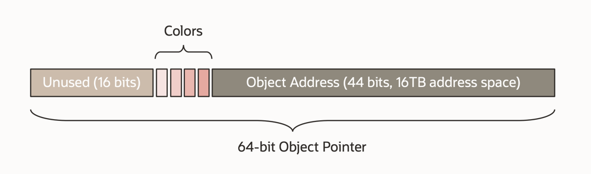

## Introduction

- Concurrent
- Tracing
- Compacting
- Single generation
- 
- Region-based
- NUMA-aware
- Load barriers
- Colored pointers

A core design principle/choice in ZGC is the use of **load barriers** in combination with **colored object pointers** (i.e., colored oops).


the colored-pointers scheme offers some very attractive properties. In particular:

- It allows us to reclaim and reuse memory during the relocation/compaction phase, before pointers pointing into the reclaimed/reused regions have been fixed. 
  This helps keep the general heap overhead down. It also means that there is no need to implement a separate mark-compact algorithm to handle a full GC.
- It allows us to have relatively few and simple GC barriers. This helps keep the runtime overhead down. 
  It also means that it's easier to implement, optimize and maintain the GC barrier code in our interpreter and JIT compilers.
- We currently store marking and relocation related information in the colored pointers. 
  However, the versatile nature of this scheme allows us to store any type of information (as long as we can fit it into the pointer) and let the load barrier take any action it wants to based on that information. 
  We believe this will lay the foundation for many future features. 
  To pick one example, in a heterogeneous memory environment, this could be used to track heap access patterns to guide GC relocation decisions to move rarely used objects to cold storage.
  
From [ZGC The Next Generation Low-Latency Garbage Collector](http://cr.openjdk.java.net/~pliden/slides/ZGC-OracleDevLive-2020.pdf)


Regions
- Small 2MB for < 256KB
- Medium 32MB for 256KB <= <= 4MB
- Large N * 2MB


Colored Pointer/Tag Pointer/Version Pointer


- Pause Mark Start Scan thread stacks
- Concurrent Mark/Remap Walk object graph
- Pause Mark End Synchronization point
- Concurrent Prepare for Reloc. Reference processing Class unloading Relocation set selection
- Pause Relocate Start Scan thread stacks
- Concurrent Relocate Compact heap

### Colored Pointers

- Core design concept in ZGC
- Metadata stored in unused bits in 64-bit pointers


### Load Barrier

A small piece of code injected by the JIT in strategic places
- When loading an **object reference** from the heap 

Checks if the loaded object reference has a bad color
- If so, take action and heal it

Like
```java
String n = person.name;
```


[JEP 376: ZGC: Concurrent Thread-Stack Processing](https://openjdk.java.net/jeps/376)


### Generational ZGC
Young/Old Generation
- Exploit the fact that most objects are short-lived
Benefits
- Withstand higher allocation rates
- Lower heap headroom
- Lower CPU usage

## References
1. [ZGC - by RednaxelaFX](https://www.zhihu.com/question/287945354/answer/458761494)
2. [The Pauseless GC Algorithm](https://www.usenix.org/legacy/events/vee05/full_papers/p46-click.pdf)
3. [The Z Garbage Collector Scalable Low-Latency GC in JDK 11](http://cr.openjdk.java.net/~pliden/slides/ZGC-OracleCodeOne-2018.pdf)
