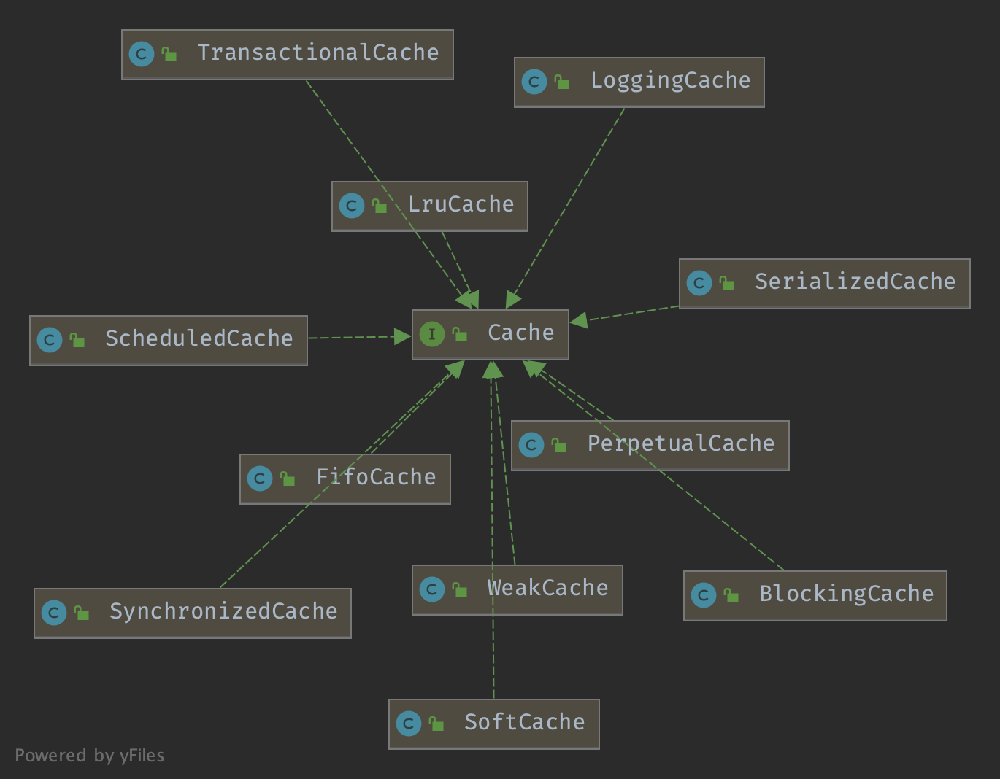

# Cache

Cache


Enable cache


`package org.apache.ibatis.cache`




## Cache

```java
/**
 * SPI for cache providers.
 * 
 * One instance of cache will be created for each namespace.
 * 
 * The cache implementation must have a constructor that receives the cache id as an String parameter.
 * 
 * MyBatis will pass the namespace as id to the constructor.
 * 
 * <pre>
 * public MyCache(final String id) {
 *  if (id == null) {
 *    throw new IllegalArgumentException("Cache instances require an ID");
 *  }
 *  this.id = id;
 *  initialize();
 * }
 * </pre>
 *
 * @author Clinton Begin
 */

public interface Cache {

  /**
   * @return The identifier of this cache
   */
  String getId();

  /**
   * @param key Can be any object but usually it is a {@link CacheKey}
   * @param value The result of a select.
   */
  void putObject(Object key, Object value);

  /**
   * @param key The key
   * @return The object stored in the cache.
   */
  Object getObject(Object key);

  /**
   * As of 3.3.0 this method is only called during a rollback 
   * for any previous value that was missing in the cache.
   * This lets any blocking cache to release the lock that 
   * may have previously put on the key.
   * A blocking cache puts a lock when a value is null 
   * and releases it when the value is back again.
   * This way other threads will wait for the value to be 
   * available instead of hitting the database.
   *
   * 
   * @param key The key
   * @return Not used
   */
  Object removeObject(Object key);

  /**
   * Clears this cache instance
   */  
  void clear();

  /**
   * Optional. This method is not called by the core.
   * 
   * @return The number of elements stored in the cache (not its capacity).
   */
  int getSize();
  
  /** 
   * Optional. As of 3.2.6 this method is no longer called by the core.
   *  
   * Any locking needed by the cache must be provided internally by the cache provider.
   * 
   * @return A ReadWriteLock 
   */
  ReadWriteLock getReadWriteLock();

}
```


## BlockingCache

`Simple blocking decorator Simple and inefficient version of EhCache's BlockingCache decorator. It sets a lock over a cache key when the element is not found in cache. This way, other threads will wait until this element is filled instead of hitting the database.`


```java
public class BlockingCache implements Cache {

  private long timeout;
  private final Cache delegate;
  private final ConcurrentHashMap<Object, ReentrantLock> locks;
  
   @Override
  public void putObject(Object key, Object value) {
    try {
      delegate.putObject(key, value);
    } finally {
      releaseLock(key);
    }
  }

  @Override
  public Object getObject(Object key) {
    acquireLock(key);
    Object value = delegate.getObject(key);
    if (value != null) {
      releaseLock(key);
    }        
    return value;
  }
}  
  
```


`new ReentrantLock when first get Cache`

```java
private ReentrantLock getLockForKey(Object key) {
  ReentrantLock lock = new ReentrantLock();
  ReentrantLock previous = locks.putIfAbsent(key, lock);
  return previous == null ? lock : previous;
}

private void acquireLock(Object key) {
  Lock lock = getLockForKey(key);
  if (timeout > 0) {
    try {
      boolean acquired = lock.tryLock(timeout, TimeUnit.MILLISECONDS);
      if (!acquired) {
        throw new CacheException("Couldn't get a lock in " + timeout + " for the key " +  key + " at the cache " + delegate.getId());  
      }
    } catch (InterruptedException e) {
      throw new CacheException("Got interrupted while trying to acquire lock for key " + key, e);
    }
  } else {
    lock.lock();
  }
}

private void releaseLock(Object key) {
  ReentrantLock lock = locks.get(key);
  if (lock.isHeldByCurrentThread()) {
    lock.unlock();
  }
}
```


## FifoCache

`FIFO (first in, first out) cache decorator`

`Use LinkedList implements Deque`

```java
@Override
public void putObject(Object key, Object value) {
  cycleKeyList(key);
  delegate.putObject(key, value);
}

private void cycleKeyList(Object key) {
  keyList.addLast(key);
  if (keyList.size() > size) {
    Object oldestKey = keyList.removeFirst();
    delegate.removeObject(oldestKey);
  }
}
```


## LruCache

`new LinkedHashMap and size is 1024`

```java
public class LruCache implements Cache {

  private final Cache delegate;
  private Map<Object, Object> keyMap;
  private Object eldestKey;

  public LruCache(Cache delegate) {
    this.delegate = delegate;
    setSize(1024);
  }

  @Override
  public String getId() {
    return delegate.getId();
  }

  @Override
  public int getSize() {
    return delegate.getSize();
  }

  public void setSize(final int size) {
    keyMap = new LinkedHashMap<Object, Object>(size, .75F, true) {
      private static final long serialVersionUID = 4267176411845948333L;

      @Override
      protected boolean removeEldestEntry(Map.Entry<Object, Object> eldest) {
        boolean tooBig = size() > size;
        if (tooBig) {
          eldestKey = eldest.getKey();
        }
        return tooBig;
      }
    };
  }

  private void cycleKeyList(Object key) {
    keyMap.put(key, key);
    if (eldestKey != null) {
      delegate.removeObject(eldestKey);
      eldestKey = null;
    }
  }
}
```


## SynchronizedCache

`decorate put and get methods of Cache with synchronized`