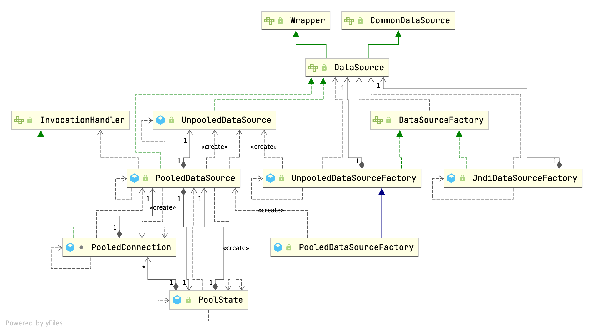

## Introduction


## DataSource

### DataSourceFactory



`DataSourceFactory provide methods to setProperties and get javax.sql.DataSource`

```java
public interface DataSourceFactory {

  void setProperties(Properties props);

  DataSource getDataSource();

}

public class JndiDataSourceFactory implements DataSourceFactory {

  public static final String INITIAL_CONTEXT = "initial_context";
  public static final String DATA_SOURCE = "data_source";
  public static final String ENV_PREFIX = "env.";

  private DataSource dataSource;

  @Override
  public void setProperties(Properties properties) {
    try {
      InitialContext initCtx;
      Properties env = getEnvProperties(properties);
      if (env == null) {
        initCtx = new InitialContext();
      } else {
        initCtx = new InitialContext(env);
      }

      if (properties.containsKey(INITIAL_CONTEXT) && properties.containsKey(DATA_SOURCE)) {
        Context ctx = (Context) initCtx.lookup(properties.getProperty(INITIAL_CONTEXT));
        dataSource = (DataSource) ctx.lookup(properties.getProperty(DATA_SOURCE));
      } else if (properties.containsKey(DATA_SOURCE)) {
        dataSource = (DataSource) initCtx.lookup(properties.getProperty(DATA_SOURCE));
      }

    } catch (NamingException e) {
      throw new DataSourceException("There was an error configuring JndiDataSourceTransactionPool. Cause: " + e, e);
    }
  }
}

public class UnpooledDataSourceFactory implements DataSourceFactory {

  private static final String DRIVER_PROPERTY_PREFIX = "driver.";
  private static final int DRIVER_PROPERTY_PREFIX_LENGTH = DRIVER_PROPERTY_PREFIX.length();

  protected DataSource dataSource;

  public UnpooledDataSourceFactory() {
    this.dataSource = new UnpooledDataSource();
  }

  @Override
  public void setProperties(Properties properties) {
    Properties driverProperties = new Properties();
    MetaObject metaDataSource = SystemMetaObject.forObject(dataSource);
    for (Object key : properties.keySet()) {
      String propertyName = (String) key;
      if (propertyName.startsWith(DRIVER_PROPERTY_PREFIX)) {
        String value = properties.getProperty(propertyName);
        driverProperties.setProperty(propertyName.substring(DRIVER_PROPERTY_PREFIX_LENGTH), value);
      } else if (metaDataSource.hasSetter(propertyName)) {
        String value = (String) properties.get(propertyName);
        Object convertedValue = convertValue(metaDataSource, propertyName, value);
        metaDataSource.setValue(propertyName, convertedValue);
      } else {
        throw new DataSourceException("Unknown DataSource property: " + propertyName);
      }
    }
    if (driverProperties.size() > 0) {
      metaDataSource.setValue("driverProperties", driverProperties);
    }
  }
}

public class PooledDataSourceFactory extends UnpooledDataSourceFactory {

  public PooledDataSourceFactory() {
    this.dataSource = new PooledDataSource();
  }

}
```


### UnpooledDataSource

```java
public class UnpooledDataSource implements DataSource {

  private ClassLoader driverClassLoader;
  private Properties driverProperties;
  private static Map<String, Driver> registeredDrivers = new ConcurrentHashMap<>();

  private String driver;
  private String url;
  private String username;
  private String password;

  private Boolean autoCommit;
  private Integer defaultTransactionIsolationLevel;
  private Integer defaultNetworkTimeout;
  
   static {
    Enumeration<Driver> drivers = DriverManager.getDrivers();
    while (drivers.hasMoreElements()) {
      Driver driver = drivers.nextElement();
      registeredDrivers.put(driver.getClass().getName(), driver);
    }
  }
  
  
  private Connection doGetConnection(Properties properties) throws SQLException {
    initializeDriver();
    Connection connection = DriverManager.getConnection(url, properties);
    configureConnection(connection);
    return connection;
  }

  private synchronized void initializeDriver() throws SQLException {
    if (!registeredDrivers.containsKey(driver)) {
      Class<?> driverType;
      try {
        if (driverClassLoader != null) {
          driverType = Class.forName(driver, true, driverClassLoader);
        } else {
          driverType = Resources.classForName(driver);
        }
        // DriverManager requires the driver to be loaded via the system ClassLoader.
        // http://www.kfu.com/~nsayer/Java/dyn-jdbc.html
        Driver driverInstance = (Driver) driverType.getDeclaredConstructor().newInstance();
        DriverManager.registerDriver(new DriverProxy(driverInstance));
        registeredDrivers.put(driver, driverInstance);
      } catch (Exception e) {
        throw new SQLException("Error setting driver on UnpooledDataSource. Cause: " + e);
      }
    }
  }

  private void configureConnection(Connection conn) throws SQLException {
    if (defaultNetworkTimeout != null) {
      conn.setNetworkTimeout(Executors.newSingleThreadExecutor(), defaultNetworkTimeout);
    }
    if (autoCommit != null && autoCommit != conn.getAutoCommit()) {
      conn.setAutoCommit(autoCommit);
    }
    if (defaultTransactionIsolationLevel != null) {
      conn.setTransactionIsolation(defaultTransactionIsolationLevel);
    }
  }
}
```


### PooledDataSource

```java
/**
 * This is a simple, synchronous, thread-safe database connection pool.
 */
public class PooledDataSource implements DataSource {

  private static final Log log = LogFactory.getLog(PooledDataSource.class);

  private final PoolState state = new PoolState(this);

  private final UnpooledDataSource dataSource;

  // OPTIONAL CONFIGURATION FIELDS
  protected int poolMaximumActiveConnections = 10;
  protected int poolMaximumIdleConnections = 5;
  protected int poolMaximumCheckoutTime = 20000;
  protected int poolTimeToWait = 20000;
  protected int poolMaximumLocalBadConnectionTolerance = 3;
  protected String poolPingQuery = "NO PING QUERY SET";
  protected boolean poolPingEnabled;
  protected int poolPingConnectionsNotUsedFor;

  private int expectedConnectionTypeCode;

  public PooledDataSource() {
    dataSource = new UnpooledDataSource();
  }
```


### PoolState

```java
public class PoolState {

  protected PooledDataSource dataSource;

  protected final List<PooledConnection> idleConnections = new ArrayList<>();
  protected final List<PooledConnection> activeConnections = new ArrayList<>();
  protected long requestCount = 0;
  protected long accumulatedRequestTime = 0;
  protected long accumulatedCheckoutTime = 0;
  protected long claimedOverdueConnectionCount = 0;
  protected long accumulatedCheckoutTimeOfOverdueConnections = 0;
  protected long accumulatedWaitTime = 0;
  protected long hadToWaitCount = 0;
  protected long badConnectionCount = 0;
}
```


### PooledConnection

```java
class PooledConnection implements InvocationHandler {

  private static final String CLOSE = "close";
  private static final Class<?>[] IFACES = new Class<?>[] { Connection.class };

  private final int hashCode;
  private final PooledDataSource dataSource;
  private final Connection realConnection;
  private final Connection proxyConnection;
  private long checkoutTimestamp;
  private long createdTimestamp;
  private long lastUsedTimestamp;
  private int connectionTypeCode;
  private boolean valid;

  /**
   * Constructor for SimplePooledConnection that uses the Connection and PooledDataSource passed in.
   *
   * @param connection
   *          - the connection that is to be presented as a pooled connection
   * @param dataSource
   *          - the dataSource that the connection is from
   */
  public PooledConnection(Connection connection, PooledDataSource dataSource) {
    this.hashCode = connection.hashCode();
    this.realConnection = connection;
    this.dataSource = dataSource;
    this.createdTimestamp = System.currentTimeMillis();
    this.lastUsedTimestamp = System.currentTimeMillis();
    this.valid = true;
    this.proxyConnection = (Connection) Proxy.newProxyInstance(Connection.class.getClassLoader(), IFACES, this);
  }

  /**
   * Method to see if the connection is usable.
   *
   * @return True if the connection is usable
   */
  public boolean isValid() {
    return valid && realConnection != null && dataSource.pingConnection(this);
  }

  /**
   * Required for InvocationHandler implementation.
   *
   * @param proxy  - not used
   * @param method - the method to be executed
   * @param args - the parameters to be passed to the method
   */
  @Override
  public Object invoke(Object proxy, Method method, Object[] args) throws Throwable {
    String methodName = method.getName();
    if (CLOSE.equals(methodName)) {
      dataSource.pushConnection(this);
      return null;
    }
    try {
      if (!Object.class.equals(method.getDeclaringClass())) {
        // issue #579 toString() should never fail
        // throw an SQLException instead of a Runtime
        checkConnection();
      }
      return method.invoke(realConnection, args);
    } catch (Throwable t) {
      throw ExceptionUtil.unwrapThrowable(t);
    }

  }

  private void checkConnection() throws SQLException {
    if (!valid) {
      throw new SQLException("Error accessing PooledConnection. Connection is invalid.");
    }
  }

}
```


#### pushConnection

```java
protected void pushConnection(PooledConnection conn) throws SQLException {

  synchronized (state) {
    state.activeConnections.remove(conn);
    if (conn.isValid()) {
      if (state.idleConnections.size() < poolMaximumIdleConnections && conn.getConnectionTypeCode() == expectedConnectionTypeCode) {
        state.accumulatedCheckoutTime += conn.getCheckoutTime();
        if (!conn.getRealConnection().getAutoCommit()) {
          conn.getRealConnection().rollback();
        }
        PooledConnection newConn = new PooledConnection(conn.getRealConnection(), this);
        state.idleConnections.add(newConn);
        newConn.setCreatedTimestamp(conn.getCreatedTimestamp());
        newConn.setLastUsedTimestamp(conn.getLastUsedTimestamp());
        conn.invalidate();
        if (log.isDebugEnabled()) {
          log.debug("Returned connection " + newConn.getRealHashCode() + " to pool.");
        }
        state.notifyAll();
      } else {
        state.accumulatedCheckoutTime += conn.getCheckoutTime();
        if (!conn.getRealConnection().getAutoCommit()) {
          conn.getRealConnection().rollback();
        }
        conn.getRealConnection().close();
        if (log.isDebugEnabled()) {
          log.debug("Closed connection " + conn.getRealHashCode() + ".");
        }
        conn.invalidate();
      }
    } else {
      if (log.isDebugEnabled()) {
        log.debug("A bad connection (" + conn.getRealHashCode() + ") attempted to return to the pool, discarding connection.");
      }
      state.badConnectionCount++;
    }
  }
}
```

#### popConnection

```java
private PooledConnection popConnection(String username, String password) throws SQLException {
  boolean countedWait = false;
  PooledConnection conn = null;
  long t = System.currentTimeMillis();
  int localBadConnectionCount = 0;

  while (conn == null) {
    synchronized (state) {
      if (!state.idleConnections.isEmpty()) {
        // Pool has available connection
        conn = state.idleConnections.remove(0);
        if (log.isDebugEnabled()) {
          log.debug("Checked out connection " + conn.getRealHashCode() + " from pool.");
        }
      } else {
        // Pool does not have available connection
        if (state.activeConnections.size() < poolMaximumActiveConnections) {
          // Can create new connection
          conn = new PooledConnection(dataSource.getConnection(), this);
          if (log.isDebugEnabled()) {
            log.debug("Created connection " + conn.getRealHashCode() + ".");
          }
        } else {
          // Cannot create new connection
          PooledConnection oldestActiveConnection = state.activeConnections.get(0);
          long longestCheckoutTime = oldestActiveConnection.getCheckoutTime();
          if (longestCheckoutTime > poolMaximumCheckoutTime) {
            // Can claim overdue connection
            state.claimedOverdueConnectionCount++;
            state.accumulatedCheckoutTimeOfOverdueConnections += longestCheckoutTime;
            state.accumulatedCheckoutTime += longestCheckoutTime;
            state.activeConnections.remove(oldestActiveConnection);
            if (!oldestActiveConnection.getRealConnection().getAutoCommit()) {
              try {
                oldestActiveConnection.getRealConnection().rollback();
              } catch (SQLException e) {
                /*
                   Just log a message for debug and continue to execute the following
                   statement like nothing happened.
                   Wrap the bad connection with a new PooledConnection, this will help
                   to not interrupt current executing thread and give current thread a
                   chance to join the next competition for another valid/good database
                   connection. At the end of this loop, bad {@link @conn} will be set as null.
                 */
                log.debug("Bad connection. Could not roll back");
              }
            }
            conn = new PooledConnection(oldestActiveConnection.getRealConnection(), this);
            conn.setCreatedTimestamp(oldestActiveConnection.getCreatedTimestamp());
            conn.setLastUsedTimestamp(oldestActiveConnection.getLastUsedTimestamp());
            oldestActiveConnection.invalidate();
            if (log.isDebugEnabled()) {
              log.debug("Claimed overdue connection " + conn.getRealHashCode() + ".");
            }
          } else {
            // Must wait
            try {
              if (!countedWait) {
                state.hadToWaitCount++;
                countedWait = true;
              }
              if (log.isDebugEnabled()) {
                log.debug("Waiting as long as " + poolTimeToWait + " milliseconds for connection.");
              }
              long wt = System.currentTimeMillis();
              state.wait(poolTimeToWait);
              state.accumulatedWaitTime += System.currentTimeMillis() - wt;
            } catch (InterruptedException e) {
              break;
            }
          }
        }
      }
      if (conn != null) {
        // ping to server and check the connection is valid or not
        if (conn.isValid()) {
          if (!conn.getRealConnection().getAutoCommit()) {
            conn.getRealConnection().rollback();
          }
          conn.setConnectionTypeCode(assembleConnectionTypeCode(dataSource.getUrl(), username, password));
          conn.setCheckoutTimestamp(System.currentTimeMillis());
          conn.setLastUsedTimestamp(System.currentTimeMillis());
          state.activeConnections.add(conn);
          state.requestCount++;
          state.accumulatedRequestTime += System.currentTimeMillis() - t;
        } else {
          if (log.isDebugEnabled()) {
            log.debug("A bad connection (" + conn.getRealHashCode() + ") was returned from the pool, getting another connection.");
          }
          state.badConnectionCount++;
          localBadConnectionCount++;
          conn = null;
          if (localBadConnectionCount > (poolMaximumIdleConnections + poolMaximumLocalBadConnectionTolerance)) {
            if (log.isDebugEnabled()) {
              log.debug("PooledDataSource: Could not get a good connection to the database.");
            }
            throw new SQLException("PooledDataSource: Could not get a good connection to the database.");
          }
        }
      }
    }

  }

  if (conn == null) {
    if (log.isDebugEnabled()) {
      log.debug("PooledDataSource: Unknown severe error condition.  The connection pool returned a null connection.");
    }
    throw new SQLException("PooledDataSource: Unknown severe error condition.  The connection pool returned a null connection.");
  }

  return conn;
}
```


#### pingConnection

```java
/**
 * Method to check to see if a connection is still usable
 *
 * @param conn
 *          - the connection to check
 * @return True if the connection is still usable
 */
protected boolean pingConnection(PooledConnection conn) {
  boolean result = true;

  try {
    result = !conn.getRealConnection().isClosed();
  } catch (SQLException e) {
    if (log.isDebugEnabled()) {
      log.debug("Connection " + conn.getRealHashCode() + " is BAD: " + e.getMessage());
    }
    result = false;
  }

  if (result && poolPingEnabled && poolPingConnectionsNotUsedFor >= 0
      && conn.getTimeElapsedSinceLastUse() > poolPingConnectionsNotUsedFor) {
    try {
      if (log.isDebugEnabled()) {
        log.debug("Testing connection " + conn.getRealHashCode() + " ...");
      }
      Connection realConn = conn.getRealConnection();
      try (Statement statement = realConn.createStatement()) {
        statement.executeQuery(poolPingQuery).close();
      }
      if (!realConn.getAutoCommit()) {
        realConn.rollback();
      }
      result = true;
      if (log.isDebugEnabled()) {
        log.debug("Connection " + conn.getRealHashCode() + " is GOOD!");
      }
    } catch (Exception e) {
      log.warn("Execution of ping query '" + poolPingQuery + "' failed: " + e.getMessage());
      try {
        conn.getRealConnection().close();
      } catch (Exception e2) {
        // ignore
      }
      result = false;
      if (log.isDebugEnabled()) {
        log.debug("Connection " + conn.getRealHashCode() + " is BAD: " + e.getMessage());
      }
    }
  }
  return result;
}

/**
 * Unwraps a pooled connection to get to the 'real' connection
 *
 * @param conn
 *          - the pooled connection to unwrap
 * @return The 'real' connection
 */
public static Connection unwrapConnection(Connection conn) {
  if (Proxy.isProxyClass(conn.getClass())) {
    InvocationHandler handler = Proxy.getInvocationHandler(conn);
    if (handler instanceof PooledConnection) {
      return ((PooledConnection) handler).getRealConnection();
    }
  }
  return conn;
}
```


#### forceCloseAll

`Closes all active and idle connections in the pool. The method in finalize`

```java
public void forceCloseAll() {
  synchronized (state) {
    expectedConnectionTypeCode = assembleConnectionTypeCode(dataSource.getUrl(), dataSource.getUsername(), dataSource.getPassword());
    for (int i = state.activeConnections.size(); i > 0; i--) {
      try {
        PooledConnection conn = state.activeConnections.remove(i - 1);
        conn.invalidate();

        Connection realConn = conn.getRealConnection();
        if (!realConn.getAutoCommit()) {
          realConn.rollback();
        }
        realConn.close();
      } catch (Exception e) {
        // ignore
      }
    }
    for (int i = state.idleConnections.size(); i > 0; i--) {
      try {
        PooledConnection conn = state.idleConnections.remove(i - 1);
        conn.invalidate();

        Connection realConn = conn.getRealConnection();
        if (!realConn.getAutoCommit()) {
          realConn.rollback();
        }
        realConn.close();
      } catch (Exception e) {
        // ignore
      }
    }
  }
  if (log.isDebugEnabled()) {
    log.debug("PooledDataSource forcefully closed/removed all connections.");
  }
}
```


#### pingConnection

`Method to check to see if a connection is still usable.True if the connection is still usable.`

```java
protected boolean pingConnection(PooledConnection conn) {
  boolean result = true;

  try {
    result = !conn.getRealConnection().isClosed();
  } catch (SQLException e) {
    if (log.isDebugEnabled()) {
      log.debug("Connection " + conn.getRealHashCode() + " is BAD: " + e.getMessage());
    }
    result = false;
  }

  if (result && poolPingEnabled && poolPingConnectionsNotUsedFor >= 0
      && conn.getTimeElapsedSinceLastUse() > poolPingConnectionsNotUsedFor) {
    try {
      if (log.isDebugEnabled()) {
        log.debug("Testing connection " + conn.getRealHashCode() + " ...");
      }
      Connection realConn = conn.getRealConnection();
      try (Statement statement = realConn.createStatement()) {
        statement.executeQuery(poolPingQuery).close();
      }
      if (!realConn.getAutoCommit()) {
        realConn.rollback();
      }
      result = true;
      if (log.isDebugEnabled()) {
        log.debug("Connection " + conn.getRealHashCode() + " is GOOD!");
      }
    } catch (Exception e) {
      log.warn("Execution of ping query '" + poolPingQuery + "' failed: " + e.getMessage());
      try {
        conn.getRealConnection().close();
      } catch (Exception e2) {
        // ignore
      }
      result = false;
      if (log.isDebugEnabled()) {
        log.debug("Connection " + conn.getRealHashCode() + " is BAD: " + e.getMessage());
      }
    }
  }
  return result;
}
```


## Transaction

### Transaction

```java
/**
 * Wraps a database connection.
 * Handles the connection lifecycle that comprises: its creation, preparation, commit/rollback and close.
 */
public interface Transaction {

  /**
   * Retrieve inner database connection.
   */
  Connection getConnection() throws SQLException;

  /**
   * Commit inner database connection.
   */
  void commit() throws SQLException;

  /**
   * Rollback inner database connection.
   */
  void rollback() throws SQLException;

  /**
   * Close inner database connection.
   */
  void close() throws SQLException;

  /**
   * Get transaction timeout if set.
   */
  Integer getTimeout() throws SQLException;

}
```


### TransactionFactory

```java
/**
 * Creates {@link Transaction} instances.
 */
public interface TransactionFactory {

  /**
   * Sets transaction factory custom properties.
   * @param props
   *          the new properties
   */
  default void setProperties(Properties props) {
    // NOP
  }

  /**
   * Creates a {@link Transaction} out of an existing connection.
   * @param conn Existing database connection
   * @return Transaction
   * @since 3.1.0
   */
  Transaction newTransaction(Connection conn);

  /**
   * Creates a {@link Transaction} out of a datasource.
   * @param dataSource DataSource to take the connection from
   * @param level Desired isolation level
   * @param autoCommit Desired autocommit
   * @return Transaction
   * @since 3.1.0
   */
  Transaction newTransaction(DataSource dataSource, TransactionIsolationLevel level, boolean autoCommit);

}


/**
 * Creates a {@code SpringManagedTransaction}.
 *
 * @author Hunter Presnall
 */
public class SpringManagedTransactionFactory implements TransactionFactory {

  /**
   * {@inheritDoc}
   */
  @Override
  public Transaction newTransaction(DataSource dataSource, TransactionIsolationLevel level, boolean autoCommit) {
    return new SpringManagedTransaction(dataSource);
  }

  /**
   * {@inheritDoc}
   */
  @Override
  public Transaction newTransaction(Connection conn) {
    throw new UnsupportedOperationException("New Spring transactions require a DataSource");
  }

  /**
   * {@inheritDoc}
   */
  @Override
  public void setProperties(Properties props) {
    // not needed in this version
  }
```


### JdbcTransaction

```java
/**
 * {@link Transaction} that makes use of the JDBC commit and rollback facilities directly.
 * It relies on the connection retrieved from the dataSource to manage the scope of the transaction.
 * Delays connection retrieval until getConnection() is called.
 * Ignores commit or rollback requests when autocommit is on.
 *
 * @author Clinton Begin
 *
 * @see JdbcTransactionFactory
 */
public class JdbcTransaction implements Transaction {

  private static final Log log = LogFactory.getLog(JdbcTransaction.class);

  protected Connection connection;
  protected DataSource dataSource;
  protected TransactionIsolationLevel level;
  protected boolean autoCommit;

  public JdbcTransaction(DataSource ds, TransactionIsolationLevel desiredLevel, boolean desiredAutoCommit) {
    dataSource = ds;
    level = desiredLevel;
    autoCommit = desiredAutoCommit;
  }

  public JdbcTransaction(Connection connection) {
    this.connection = connection;
  }

  @Override
  public Connection getConnection() throws SQLException {
    if (connection == null) {
      openConnection();
    }
    return connection;
  }

  @Override
  public void commit() throws SQLException {
    if (connection != null && !connection.getAutoCommit()) {
      if (log.isDebugEnabled()) {
        log.debug("Committing JDBC Connection [" + connection + "]");
      }
      connection.commit();
    }
  }

  @Override
  public void rollback() throws SQLException {
    if (connection != null && !connection.getAutoCommit()) {
      if (log.isDebugEnabled()) {
        log.debug("Rolling back JDBC Connection [" + connection + "]");
      }
      connection.rollback();
    }
  }

  @Override
  public void close() throws SQLException {
    if (connection != null) {
      resetAutoCommit();
      if (log.isDebugEnabled()) {
        log.debug("Closing JDBC Connection [" + connection + "]");
      }
      connection.close();
    }
  }

  protected void setDesiredAutoCommit(boolean desiredAutoCommit) {
    try {
      if (connection.getAutoCommit() != desiredAutoCommit) {
        if (log.isDebugEnabled()) {
          log.debug("Setting autocommit to " + desiredAutoCommit + " on JDBC Connection [" + connection + "]");
        }
        connection.setAutoCommit(desiredAutoCommit);
      }
    } catch (SQLException e) {
      // Only a very poorly implemented driver would fail here,
      // and there's not much we can do about that.
      throw new TransactionException("Error configuring AutoCommit.  "
          + "Your driver may not support getAutoCommit() or setAutoCommit(). "
          + "Requested setting: " + desiredAutoCommit + ".  Cause: " + e, e);
    }
  }

  protected void resetAutoCommit() {
    try {
      if (!connection.getAutoCommit()) {
        // MyBatis does not call commit/rollback on a connection if just selects were performed.
        // Some databases start transactions with select statements
        // and they mandate a commit/rollback before closing the connection.
        // A workaround is setting the autocommit to true before closing the connection.
        // Sybase throws an exception here.
        if (log.isDebugEnabled()) {
          log.debug("Resetting autocommit to true on JDBC Connection [" + connection + "]");
        }
        connection.setAutoCommit(true);
      }
    } catch (SQLException e) {
      if (log.isDebugEnabled()) {
        log.debug("Error resetting autocommit to true "
            + "before closing the connection.  Cause: " + e);
      }
    }
  }

  protected void openConnection() throws SQLException {
    if (log.isDebugEnabled()) {
      log.debug("Opening JDBC Connection");
    }
    connection = dataSource.getConnection();
    if (level != null) {
      connection.setTransactionIsolation(level.getLevel());
    }
    setDesiredAutoCommit(autoCommit);
  }

  @Override
  public Integer getTimeout() throws SQLException {
    return null;
  }

}


/**
 * Creates {@link JdbcTransaction} instances.
 */
public class JdbcTransactionFactory implements TransactionFactory {

  @Override
  public Transaction newTransaction(Connection conn) {
    return new JdbcTransaction(conn);
  }

  @Override
  public Transaction newTransaction(DataSource ds, TransactionIsolationLevel level, boolean autoCommit) {
    return new JdbcTransaction(ds, level, autoCommit);
  }
}
```


### ManagedTransaction

```java
/**
 * {@link Transaction} that lets the container manage the full lifecycle of the transaction.
 * Delays connection retrieval until getConnection() is called.
 * Ignores all commit or rollback requests.
 * By default, it closes the connection but can be configured not to do it.
 */
public class ManagedTransaction implements Transaction {

  private static final Log log = LogFactory.getLog(ManagedTransaction.class);

  private DataSource dataSource;
  private TransactionIsolationLevel level;
  private Connection connection;
  private final boolean closeConnection;

  public ManagedTransaction(Connection connection, boolean closeConnection) {
    this.connection = connection;
    this.closeConnection = closeConnection;
  }

  public ManagedTransaction(DataSource ds, TransactionIsolationLevel level, boolean closeConnection) {
    this.dataSource = ds;
    this.level = level;
    this.closeConnection = closeConnection;
  }

  @Override
  public Connection getConnection() throws SQLException {
    if (this.connection == null) {
      openConnection();
    }
    return this.connection;
  }

  @Override
  public void commit() throws SQLException {
    // Does nothing
  }

  @Override
  public void rollback() throws SQLException {
    // Does nothing
  }

  @Override
  public void close() throws SQLException {
    if (this.closeConnection && this.connection != null) {
      if (log.isDebugEnabled()) {
        log.debug("Closing JDBC Connection [" + this.connection + "]");
      }
      this.connection.close();
    }
  }

  protected void openConnection() throws SQLException {
    if (log.isDebugEnabled()) {
      log.debug("Opening JDBC Connection");
    }
    this.connection = this.dataSource.getConnection();
    if (this.level != null) {
      this.connection.setTransactionIsolation(this.level.getLevel());
    }
  }

  @Override
  public Integer getTimeout() throws SQLException {
    return null;
  }

}
```


### ManagedTransactionFactory

```java
/**
 * Creates {@link ManagedTransaction} instances.
 */
public class ManagedTransactionFactory implements TransactionFactory {

  private boolean closeConnection = true;

  @Override
  public void setProperties(Properties props) {
    if (props != null) {
      String closeConnectionProperty = props.getProperty("closeConnection");
      if (closeConnectionProperty != null) {
        closeConnection = Boolean.parseBoolean(closeConnectionProperty);
      }
    }
  }

  @Override
  public Transaction newTransaction(Connection conn) {
    return new ManagedTransaction(conn, closeConnection);
  }

  @Override
  public Transaction newTransaction(DataSource ds, TransactionIsolationLevel level, boolean autoCommit) {
    // Silently ignores autocommit and isolation level, as managed transactions are entirely
    // controlled by an external manager.  It's silently ignored so that
    // code remains portable between managed and unmanaged configurations.
    return new ManagedTransaction(ds, level, closeConnection);
  }
}
```


### SpringManagedTransaction

```java
public class SpringManagedTransaction implements Transaction {
    private static final Log LOGGER = LogFactory.getLog(SpringManagedTransaction.class);
    private final DataSource dataSource;
    private Connection connection;
    private boolean isConnectionTransactional;
    private boolean autoCommit;

    public SpringManagedTransaction(DataSource dataSource) {
        Assert.notNull(dataSource, "No DataSource specified");
        this.dataSource = dataSource;
    }

    public Connection getConnection() throws SQLException {
        if (this.connection == null) {
            this.openConnection();
        }

        return this.connection;
    }

    private void openConnection() throws SQLException {
        this.connection = DataSourceUtils.getConnection(this.dataSource);
        this.autoCommit = this.connection.getAutoCommit();
        this.isConnectionTransactional = DataSourceUtils.isConnectionTransactional(this.connection, this.dataSource);
        if (LOGGER.isDebugEnabled()) {
            LOGGER.debug("JDBC Connection [" + this.connection + "] will" + (this.isConnectionTransactional ? " " : " not ") + "be managed by Spring");
        }

    }

    public void commit() throws SQLException {
        if (this.connection != null && !this.isConnectionTransactional && !this.autoCommit) {
            if (LOGGER.isDebugEnabled()) {
                LOGGER.debug("Committing JDBC Connection [" + this.connection + "]");
            }

            this.connection.commit();
        }

    }

    public void rollback() throws SQLException {
        if (this.connection != null && !this.isConnectionTransactional && !this.autoCommit) {
            if (LOGGER.isDebugEnabled()) {
                LOGGER.debug("Rolling back JDBC Connection [" + this.connection + "]");
            }

            this.connection.rollback();
        }

    }

    public void close() throws SQLException {
        DataSourceUtils.releaseConnection(this.connection, this.dataSource);
    }

    public Integer getTimeout() throws SQLException {
        ConnectionHolder holder = (ConnectionHolder)TransactionSynchronizationManager.getResource(this.dataSource);
        return holder != null && holder.hasTimeout() ? holder.getTimeToLiveInSeconds() : null;
    }
}
```


