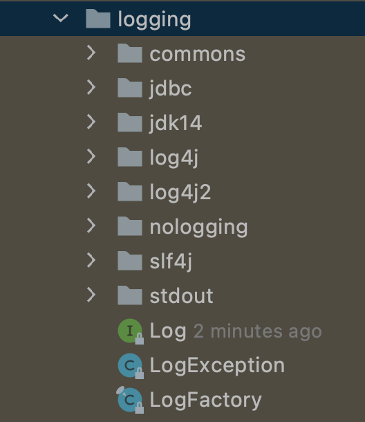
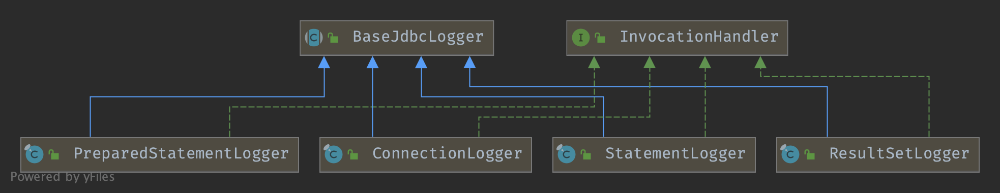

## Introduction

MyBatis provides logging information through the use of an internal log factory. 
The internal log factory will delegate logging information to one of the following log implementations:

- SLF4J
- Apache Commons Logging
- Log4j 2
- Log4j
- JDK logging

The logging solution chosen is based on runtime introspection by the internal MyBatis log factory. 
The MyBatis log factory will use the first logging implementation it finds (implementations are searched in the above order). 
If MyBatis finds none of the above implementations, then logging will be disabled.

### [How to select a different logging implementation ](https://mybatis.org/mybatis-3/logging.html)


## Package




### Log

```java
public interface Log {
    boolean isDebugEnabled();

    boolean isTraceEnabled();

    void error(String var1, Throwable var2);

    void error(String var1);

    void debug(String var1);

    void trace(String var1);

    void warn(String var1);
}
```


### LogFactory

getLog by using `Constructor::newInstance()`

```java
public final class LogFactory {

  /**
   * Marker to be used by logging implementations that support markers
   */
  public static final String MARKER = "MYBATIS";

  private static Constructor<? extends Log> logConstructor;

  static {
    tryImplementation(new Runnable() {
      @Override
      public void run() {
        useSlf4jLogging();
      }
    });
    tryImplementation(() -> { useCommonsLogging(); });
    tryImplementation(() -> { useLog4J2Logging(); });
    tryImplementation(() -> { seLog4JLogging(); });
    tryImplementation(() -> { useJdkLogging(); });
    tryImplementation(() -> { useNoLogging(); });
  }
  
  
  public static Log getLog(String logger) {
    try {
      return logConstructor.newInstance(logger);
    } catch (Throwable t) {
      throw new LogException("Error creating logger for logger " + logger + ".  Cause: " + t, t);
    }
  }
```


So the order of log is in static block:

**useSlf4jLogging** 1st

```java
private static void tryImplementation(Runnable runnable) {
    if (logConstructor == null) {
      try {
        runnable.run();
      } catch (Throwable t) {
        // ignore
      }
    }
  }

public static synchronized void useCustomLogging(Class<? extends Log> clazz) {
  setImplementation(clazz);
}

private static void setImplementation(Class<? extends Log> implClass) {
  try {
    Constructor<? extends Log> candidate = implClass.getConstructor(String.class);
    Log log = candidate.newInstance(LogFactory.class.getName());
    logConstructor = candidate;
  } catch (Throwable t) {
    throw new LogException("Error setting Log implementation.  Cause: " + t, t);
  }
}
```


### Logger




### ConnectionLogger

```java
@Override
public Object invoke(Object proxy, Method method, Object[] params)
    throws Throwable {
  try {
    if (Object.class.equals(method.getDeclaringClass())) {
      return method.invoke(this, params);
    }    
    if ("prepareStatement".equals(method.getName())) {
      if (isDebugEnabled()) {
        debug(" Preparing: " + removeBreakingWhitespace((String) params[0]), true);
      }        
      PreparedStatement stmt = (PreparedStatement) method.invoke(connection, params);
      stmt = PreparedStatementLogger.newInstance(stmt, statementLog, queryStack);
      return stmt;
    } else if ("prepareCall".equals(method.getName())) {
      if (isDebugEnabled()) {
        debug(" Preparing: " + removeBreakingWhitespace((String) params[0]), true);
      }        
      PreparedStatement stmt = (PreparedStatement) method.invoke(connection, params);
      stmt = PreparedStatementLogger.newInstance(stmt, statementLog, queryStack);
      return stmt;
    } else if ("createStatement".equals(method.getName())) {
      Statement stmt = (Statement) method.invoke(connection, params);
      stmt = StatementLogger.newInstance(stmt, statementLog, queryStack);
      return stmt;
    } else {
      return method.invoke(connection, params);
    }
  } catch (Throwable t) {
    throw ExceptionUtil.unwrapThrowable(t);
  }
}
```


## Links

- [MyBatis](/docs/CS/Java/MyBatis/MyBatis.md)