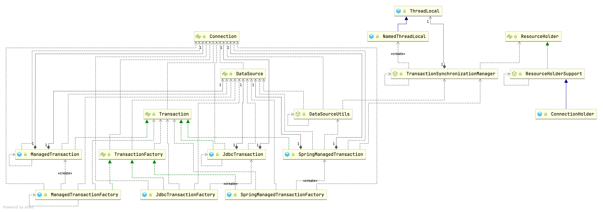
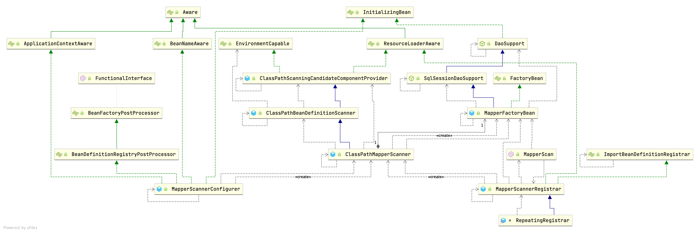

## Introduction

## transaction

<div style="text-align: center;">



</div>

<p style="text-align: center;">
Fig.1. Transaction Organization.
</p>

```java
span
```

SpringManagedTransaction handles the lifecycle of a JDBC connection. It retrieves a connection from Spring's transaction manager and returns it back to it when it is no longer needed.
If Spring's transaction handling is active it will no-op all commit/rollback/close calls assuming that the Spring transaction manager will do the job.
If it is not it will behave like JdbcTransaction.

```java
public class SpringManagedTransaction implements Transaction {

  private final DataSource dataSource;

  private Connection connection;

  private boolean isConnectionTransactional;

  private boolean autoCommit;
...
}
```

Helper class that provides static methods for obtaining JDBC Connections from a DataSource. Includes special support for Spring-managed transactional Connections, e.g. managed by DataSourceTransactionManager or org.springframework.transaction.jta.JtaTransactionManager.
Used internally by Spring's org.springframework.jdbc.core.JdbcTemplate, Spring's JDBC operation objects and the JDBC DataSourceTransactionManager. Can also be used directly in application code.

```java
// org.springframework.jdbc.datasource.DataSourceUtils
public static Connection doGetConnection(DataSource dataSource) throws SQLException {
   Assert.notNull(dataSource, "No DataSource specified");

   ConnectionHolder conHolder = (ConnectionHolder) TransactionSynchronizationManager.getResource(dataSource);
   if (conHolder != null && (conHolder.hasConnection() || conHolder.isSynchronizedWithTransaction())) {
      conHolder.requested();
      if (!conHolder.hasConnection()) {
         logger.debug("Fetching resumed JDBC Connection from DataSource");
         conHolder.setConnection(fetchConnection(dataSource));
      }
      return conHolder.getConnection();
   }
   // Else we either got no holder or an empty thread-bound holder here.

   Connection con = fetchConnection(dataSource);

   if (TransactionSynchronizationManager.isSynchronizationActive()) {
      try {
         // Use same Connection for further JDBC actions within the transaction.
         // Thread-bound object will get removed by synchronization at transaction completion.
         ConnectionHolder holderToUse = conHolder;
         if (holderToUse == null) {
            holderToUse = new ConnectionHolder(con);
         }
         else {
            holderToUse.setConnection(con);
         }
         holderToUse.requested();
         TransactionSynchronizationManager.registerSynchronization(
               new ConnectionSynchronization(holderToUse, dataSource));
         holderToUse.setSynchronizedWithTransaction(true);
         if (holderToUse != conHolder) {
            TransactionSynchronizationManager.bindResource(dataSource, holderToUse);
         }
      }
      catch (RuntimeException ex) {
         // Unexpected exception from external delegation call -> close Connection and rethrow.
         releaseConnection(con, dataSource);
         throw ex;
      }
   }

   return con;
}
```

```java
// TransactionSynchronizationManager

private static final ThreadLocal<Map<Object, Object>> resources =
			new NamedThreadLocal<>("Transactional resources");


@Nullable
private static Object doGetResource(Object actualKey) {
   Map<Object, Object> map = resources.get();
   if (map == null) {
      return null;
   }
   Object value = map.get(actualKey);
   // Transparently remove ResourceHolder that was marked as void...
   if (value instanceof ResourceHolder && ((ResourceHolder) value).isVoid()) {
      map.remove(actualKey);
      // Remove entire ThreadLocal if empty...
      if (map.isEmpty()) {
         resources.remove();
      }
      value = null;
   }
   return value;
}
```

### ConnectionHolder

Resource holder wrapping a JDBC Connection. DataSourceTransactionManager binds instances of this class to the thread, for a specific javax.sql.DataSource.
Inherits rollback-only support for nested JDBC transactions and reference count functionality from the base class.

```java
public class ConnectionHolder extends ResourceHolderSupport {

   /**
    * Prefix for savepoint names.
    */
   public static final String SAVEPOINT_NAME_PREFIX = "SAVEPOINT_";


   @Nullable
   private ConnectionHandle connectionHandle;

   @Nullable
   private Connection currentConnection;

   private boolean transactionActive = false;

   @Nullable
   private Boolean savepointsSupported;

   private int savepointCounter = 0;
  
}
```

## wrap SqlSession

### SqlSessionTemplate

```java
public class SqlSessionTemplate implements SqlSession, DisposableBean {

  private final SqlSessionFactory sqlSessionFactory;

  private final ExecutorType executorType;

  private final SqlSession sqlSessionProxy;

  private final PersistenceExceptionTranslator exceptionTranslator;
 ...
   
   public SqlSessionTemplate(SqlSessionFactory sqlSessionFactory, ExecutorType executorType,
                             PersistenceExceptionTranslator exceptionTranslator) {
   this.sqlSessionFactory = sqlSessionFactory;
   this.executorType = executorType;
   this.exceptionTranslator = exceptionTranslator;
   this.sqlSessionProxy = (SqlSession) newProxyInstance(
     SqlSessionFactory.class.getClassLoader(),
     new Class[] { SqlSession.class },
     new SqlSessionInterceptor());
 }
}
```

#### SqlSessionInterceptor

Proxy needed to route MyBatis method calls to the proper SqlSession got from Spring's Transaction Manager It also unwraps exceptions thrown by Method#invoke(Object, Object...) to pass a PersistenceException to the PersistenceExceptionTranslator.

```java
private class SqlSessionInterceptor implements InvocationHandler {
  @Override
  public Object invoke(Object proxy, Method method, Object[] args) throws Throwable {
    SqlSession sqlSession = getSqlSession(
        SqlSessionTemplate.this.sqlSessionFactory,
        SqlSessionTemplate.this.executorType,
        SqlSessionTemplate.this.exceptionTranslator);
    try {
      Object result = method.invoke(sqlSession, args);
      if (!isSqlSessionTransactional(sqlSession, SqlSessionTemplate.this.sqlSessionFactory)) {
        // force commit even on non-dirty sessions because some databases require
        // a commit/rollback before calling close()
        sqlSession.commit(true);
      }
      return result;
    } catch (Throwable t) {
      Throwable unwrapped = unwrapThrowable(t);
      if (SqlSessionTemplate.this.exceptionTranslator != null && unwrapped instanceof PersistenceException) {
        // release the connection to avoid a deadlock if the translator is no loaded. See issue #22
        closeSqlSession(sqlSession, SqlSessionTemplate.this.sqlSessionFactory);
        sqlSession = null;
        Throwable translated = SqlSessionTemplate.this.exceptionTranslator.translateExceptionIfPossible((PersistenceException) unwrapped);
        if (translated != null) {
          unwrapped = translated;
        }
      }
      throw unwrapped;
    } finally {
      if (sqlSession != null) {
        closeSqlSession(sqlSession, SqlSessionTemplate.this.sqlSessionFactory);
      }
    }
  }
}
```

```java
// DaoSupport implements InitializingBean
@Override
public final void afterPropertiesSet() throws IllegalArgumentException, BeanInitializationException {
   // Let abstract subclasses check their configuration.
   checkDaoConfig();

   // Let concrete implementations initialize themselves.
   try {
      initDao();
   }
   catch (Exception ex) {
      throw new BeanInitializationException("Initialization of DAO failed", ex);
   }
}
```

SqlSessionDaoSupport

```java
public abstract class SqlSessionDaoSupport extends DaoSupport {

  private SqlSessionTemplate sqlSessionTemplate;
...
}
```

BeanFactory that enables injection of MyBatis mapper interfaces. It can be set up with a SqlSessionFactory or a pre-configured SqlSessionTemplate.

```java
public class MapperFactoryBean<T> extends SqlSessionDaoSupport implements FactoryBean<T> {

  private Class<T> mapperInterface;

  private boolean addToConfig = true;
  
  ...
}
```

```java
@Override
protected void checkDaoConfig() {
  super.checkDaoConfig(); // check sqlSessionTemplate not null

  notNull(this.mapperInterface, "Property 'mapperInterface' is required");

  Configuration configuration = getSqlSession().getConfiguration();
  if (this.addToConfig && !configuration.hasMapper(this.mapperInterface)) {
    try {
      configuration.addMapper(this.mapperInterface);
    } catch (Exception e) {
      throw new IllegalArgumentException(e);
    } finally {
      ErrorContext.instance().reset();
    }
  }
}
```

### 1st cache invalid

Because every call will new SqlSession, please use transaction.

## start



### SpringBoot

Auto-Configuration for Mybatis. Contributes a **SqlSessionFactory** and a **SqlSessionTemplate**. If `org.mybatis.spring.annotation.MapperScan` is used, or a configuration file is specified as a property, those will be considered, otherwise this auto-configuration will attempt to register mappers based on the interface definitions in or under the root auto-configuration package.

```java
@org.springframework.context.annotation.Configuration
@ConditionalOnClass({ SqlSessionFactory.class, SqlSessionFactoryBean.class })
@ConditionalOnSingleCandidate(DataSource.class)
@EnableConfigurationProperties(MybatisProperties.class)
@AutoConfigureAfter(DataSourceAutoConfiguration.class)
public class MybatisAutoConfiguration implements InitializingBean {}
```

```java
// MybatisAutoConfiguration
@Bean
@ConditionalOnMissingBean
public SqlSessionFactory sqlSessionFactory(DataSource dataSource) throws Exception {
  SqlSessionFactoryBean factory = new SqlSessionFactoryBean();
  factory.setDataSource(dataSource);
  factory.setVfs(SpringBootVFS.class);
  if (StringUtils.hasText(this.properties.getConfigLocation())) {
    factory.setConfigLocation(this.resourceLoader.getResource(this.properties.getConfigLocation()));
  }
  applyConfiguration(factory);
  if (this.properties.getConfigurationProperties() != null) {
    factory.setConfigurationProperties(this.properties.getConfigurationProperties());
  }
  if (!ObjectUtils.isEmpty(this.interceptors)) { // set plugins
    factory.setPlugins(this.interceptors);
  }
  if (this.databaseIdProvider != null) {
    factory.setDatabaseIdProvider(this.databaseIdProvider);
  }
  if (StringUtils.hasLength(this.properties.getTypeAliasesPackage())) {
    factory.setTypeAliasesPackage(this.properties.getTypeAliasesPackage());
  }
  if (this.properties.getTypeAliasesSuperType() != null) {
    factory.setTypeAliasesSuperType(this.properties.getTypeAliasesSuperType());
  }
  if (StringUtils.hasLength(this.properties.getTypeHandlersPackage())) {
    factory.setTypeHandlersPackage(this.properties.getTypeHandlersPackage());
  }
  if (!ObjectUtils.isEmpty(this.properties.resolveMapperLocations())) {
    factory.setMapperLocations(this.properties.resolveMapperLocations());
  }

  return factory.getObject();
}
```

### use @MapperScan

Use this annotation to register MyBatis mapper interfaces when using Java Config. It performs when same work as MapperScannerConfigurer via MapperScannerRegistrar.

**Configuration example**:

```java
   @Configuration
   @MapperScan("org.mybatis.spring.sample.mapper")
   public class AppConfig {

     @Bean
     public DataSource dataSource() {
       return new EmbeddedDatabaseBuilder()
                .addScript("schema.sql")
                .build();
     }
  
     @Bean
     public DataSourceTransactionManager transactionManager() {
       return new DataSourceTransactionManager(dataSource());
     }
  
     @Bean
     public SqlSessionFactory sqlSessionFactory() throws Exception {
       SqlSessionFactoryBean sessionFactory = new SqlSessionFactoryBean();
       sessionFactory.setDataSource(dataSource());
       return sessionFactory.getObject();
     }
   }
```

```java
@Retention(RetentionPolicy.RUNTIME)
@Target(ElementType.TYPE)
@Documented
@Import(MapperScannerRegistrar.class)
@Repeatable(MapperScans.class)
public @interface MapperScan {
}
```

```java
// MapperScannerRegistrar
void registerBeanDefinitions(AnnotationAttributes annoAttrs, BeanDefinitionRegistry registry) {

  ClassPathMapperScanner scanner = new ClassPathMapperScanner(registry);

  // this check is needed in Spring 3.1
  Optional.ofNullable(resourceLoader).ifPresent(scanner::setResourceLoader);

  ...

  scanner.registerFilters();
  scanner.doScan(StringUtils.toStringArray(basePackages));
}
```

#### processBeanDefinitions

Calls the parent search that will search and register all the candidates. Then the registered objects are post processed to set them as **MapperFactoryBeans**

```java
// org.mybatis.spring.mapper.ClassPathMapperScanner extends ClassPathBeanDefinitionScanner 
@Override
public Set<BeanDefinitionHolder> doScan(String... basePackages) {
  Set<BeanDefinitionHolder> beanDefinitions = super.doScan(basePackages);

  if (beanDefinitions.isEmpty()) {
  } else {
    processBeanDefinitions(beanDefinitions);
  }

  return beanDefinitions;
}

private void processBeanDefinitions(Set<BeanDefinitionHolder> beanDefinitions) {
  GenericBeanDefinition definition;
  for (BeanDefinitionHolder holder : beanDefinitions) {
    definition = (GenericBeanDefinition) holder.getBeanDefinition();
    String beanClassName = definition.getBeanClassName();

    // the mapper interface is the original class of the bean
    // but, the actual class of the bean is MapperFactoryBean
    definition.getConstructorArgumentValues().addGenericArgumentValue(beanClassName); // issue #59
    definition.setBeanClass(this.mapperFactoryBean.getClass());

    definition.getPropertyValues().add("addToConfig", this.addToConfig);

    boolean explicitFactoryUsed = false;
    if (StringUtils.hasText(this.sqlSessionFactoryBeanName)) {
      definition.getPropertyValues().add("sqlSessionFactory", new RuntimeBeanReference(this.sqlSessionFactoryBeanName));
      explicitFactoryUsed = true;
    } else if (this.sqlSessionFactory != null) {
      definition.getPropertyValues().add("sqlSessionFactory", this.sqlSessionFactory);
      explicitFactoryUsed = true;
    }

    if (StringUtils.hasText(this.sqlSessionTemplateBeanName)) {
      definition.getPropertyValues().add("sqlSessionTemplate", new RuntimeBeanReference(this.sqlSessionTemplateBeanName));
      explicitFactoryUsed = true;
    } else if (this.sqlSessionTemplate != null) {
      definition.getPropertyValues().add("sqlSessionTemplate", this.sqlSessionTemplate);
      explicitFactoryUsed = true;
    }

      definition.setAutowireMode(AbstractBeanDefinition.AUTOWIRE_BY_TYPE);
    }
  }
}
```

### MapperScannerConfigurer

BeanDefinitionRegistryPostProcessor that searches recursively starting from a base package for interfaces and registers them as MapperFactoryBean.
Note that only interfaces with at least one method will be registered; concrete classes will be ignored.

This class was a BeanFactoryPostProcessor until 1.0.1 version. It changed to BeanDefinitionRegistryPostProcessor in 1.0.2.
See https://jira.springsource.org/browse/SPR-8269 for the details.

The basePackage property can contain more than one package name, separated by either commas or semicolons.
This class supports filtering the mappers created by either specifying a marker interface or an annotation.
The annotationClass property specifies an annotation to search for.
The markerInterface property specifies a parent interface to search for.
If both properties are specified, mappers are added for interfaces that match either criteria.
By default, these two properties are null, so all interfaces in the given basePackage are added as mappers.
This configurer enables autowire for all the beans that it creates so that they are automatically autowired with the proper SqlSessionFactory or SqlSessionTemplate.
If there is more than one SqlSessionFactory in the application, however, autowiring cannot be used.
In this case you must explicitly specify either an SqlSessionFactory or an SqlSessionTemplate to use via the bean name properties.
Bean names are used rather than actual objects because Spring does not initialize property placeholders until after this class is processed.

Call [ClassPathMapperScanner::processBeanDefinitions()](/docs/CS/Java/MyBatis/MyBatis-Spring.md?id=processBeanDefinitions)

```java
public class MapperScannerConfigurer implements BeanDefinitionRegistryPostProcessor, InitializingBean, ApplicationContextAware, BeanNameAware {

  @Override
  public void postProcessBeanDefinitionRegistry(BeanDefinitionRegistry registry) {
    if (this.processPropertyPlaceHolders) {
      processPropertyPlaceHolders();
    }

    ClassPathMapperScanner scanner = new ClassPathMapperScanner(registry);
    scanner.setAddToConfig(this.addToConfig);
    scanner.setAnnotationClass(this.annotationClass);
    scanner.setMarkerInterface(this.markerInterface);
    scanner.setSqlSessionFactory(this.sqlSessionFactory);
    scanner.setSqlSessionTemplate(this.sqlSessionTemplate);
    scanner.setSqlSessionFactoryBeanName(this.sqlSessionFactoryBeanName);
    scanner.setSqlSessionTemplateBeanName(this.sqlSessionTemplateBeanName);
    scanner.setResourceLoader(this.applicationContext);
    scanner.setBeanNameGenerator(this.nameGenerator);
    scanner.registerFilters();
    scanner.scan(StringUtils.tokenizeToStringArray(this.basePackage, ConfigurableApplicationContext.CONFIG_LOCATION_DELIMITERS));
  }
}
```

## Links

- [MyBatis](/docs/CS/Java/MyBatis/MyBatis.md)
