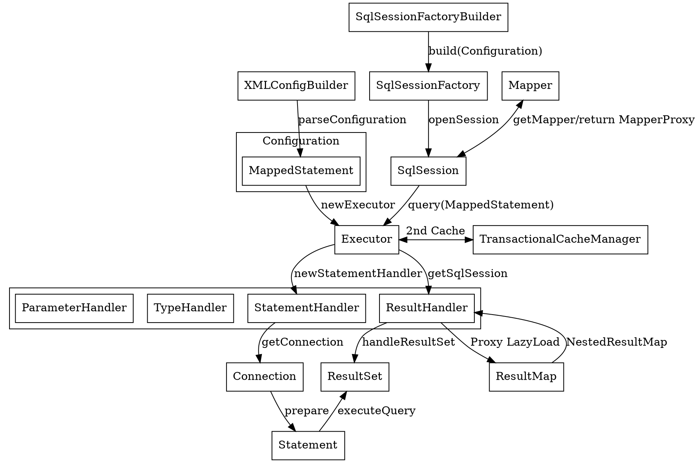

## Introduction

[MyBatis](https://mybatis.org/mybatis-3/) is a first class persistence framework with support for custom SQL, stored procedures and advanced mappings.
MyBatis eliminates almost all of the JDBC code and manual setting of parameters and retrieval of results.
MyBatis can use simple XML or Annotations for configuration and map primitives, Map interfaces and Java POJOs (Plain Old Java Objects) to database records.

**Compare with Hibernate**

|     | MyBatis            | Hibernate      |
| --- | ------------------ | -------------- |
| DB  | Depend on DB       | Independent DB |
| SQL | write SQL manually | Less SQL       |

## Architecture

[Init](/docs/CS/Java/MyBatis/Init.md)

### Infrastructure

Fig.1. MyBatis Infrastructure

- [Binding](/docs/CS/Java/MyBatis/binding.md)
- [Log](/docs/CS/Java/MyBatis/Logging.md) provide log4j log4j2 slf4j jdklog and so on
- [Cache](/docs/CS/Java/MyBatis/Cache.md)
- [DataSource](/docs/CS/Java/MyBatis/DataSource.md)
- [Reflector](/docs/CS/Java/MyBatis/Reflector.md) class represents a cached set of class definition information that allows for easy mapping between property names and getter/setter methods.`

### Core

- [How SQL works](/docs/CS/Java/MyBatis/Execute.md)
- [Executor](/docs/CS/Java/MyBatis/Executor.md)
- [StatementHandler](/docs/CS/Java/MyBatis/StatementHandler.md)
- [ResultSetHandler](/docs/CS/Java/MyBatis/ResultSetHandler.md)
- [Interceptor](/docs/CS/Java/MyBatis/Interceptor.md)
- [KeyGenerator](/docs/CS/Java/MyBatis/KeyGenerator.md)
- [SqlSession](/docs/CS/Java/MyBatis/SqlSession.md)

## Extension

[MyBatis-Spring](/docs/CS/Java/MyBatis/MyBatis-Spring.md) : Load Mybatis-config.xml, create Configuration and SqlsessionFactory

## Links

- [Spring Framework](/docs/CS/Java/Spring/Spring.md)