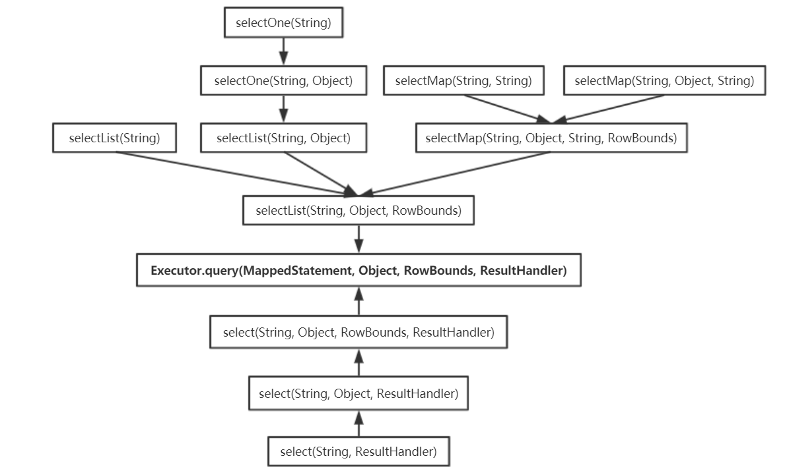

## SqlSessionFactory


```java
/**
 * Creates an SqlSession out of a connection or a DataSource
 */
public interface SqlSessionFactory {

  SqlSession openSession();
  SqlSession openSession(boolean autoCommit);
  SqlSession openSession(Connection connection);
  SqlSession openSession(TransactionIsolationLevel level);
  SqlSession openSession(ExecutorType execType);
  SqlSession openSession(ExecutorType execType, boolean autoCommit);
  SqlSession openSession(ExecutorType execType, TransactionIsolationLevel level);
  SqlSession openSession(ExecutorType execType, Connection connection);
  Configuration getConfiguration();
}
```


### DefaultSqlSessionFactory

openSession

- openSessionFromDataSource
- openSessionFromConnection

Both of them create **Executor** and **DefaultSqlSession**

```java
public class SqlSessionManager implements SqlSessionFactory, SqlSession {

  private final SqlSessionFactory sqlSessionFactory;
  private final SqlSession sqlSessionProxy;

  private final ThreadLocal<SqlSession> localSqlSession = new ThreadLocal<SqlSession>();

  private SqlSessionManager(SqlSessionFactory sqlSessionFactory) {
    this.sqlSessionFactory = sqlSessionFactory;
    this.sqlSessionProxy = (SqlSession) Proxy.newProxyInstance(
        SqlSessionFactory.class.getClassLoader(),
        new Class[]{SqlSession.class},
        new SqlSessionInterceptor());
  }
  
  
  private SqlSession openSessionFromDataSource(ExecutorType execType, TransactionIsolationLevel level, boolean autoCommit) {
    Transaction tx = null;
    try {
      final Environment environment = configuration.getEnvironment();
      final TransactionFactory transactionFactory = getTransactionFactoryFromEnvironment(environment);
      tx = transactionFactory.newTransaction(environment.getDataSource(), level, autoCommit);
      final Executor executor = configuration.newExecutor(tx, execType);
      return new DefaultSqlSession(configuration, executor, autoCommit);
    } catch (Exception e) {
      closeTransaction(tx); // may have fetched a connection so lets call close()
      throw ExceptionFactory.wrapException("Error opening session.  Cause: " + e, e);
    } finally {
      ErrorContext.instance().reset();
    }
  }

  private SqlSession openSessionFromConnection(ExecutorType execType, Connection connection) {
    try {
      boolean autoCommit;
      try {
        autoCommit = connection.getAutoCommit();
      } catch (SQLException e) {
        // Failover to true, as most poor drivers
        // or databases won't support transactions
        autoCommit = true;
      }      
      final Environment environment = configuration.getEnvironment();
      final TransactionFactory transactionFactory = getTransactionFactoryFromEnvironment(environment);
      final Transaction tx = transactionFactory.newTransaction(connection);
      final Executor executor = configuration.newExecutor(tx, execType);
      return new DefaultSqlSession(configuration, executor, autoCommit);
    } catch (Exception e) {
      throw ExceptionFactory.wrapException("Error opening session.  Cause: " + e, e);
    } finally {
      ErrorContext.instance().reset();
    }
  }

  private TransactionFactory getTransactionFactoryFromEnvironment(Environment environment) {
    if (environment == null || environment.getTransactionFactory() == null) {
      return new ManagedTransactionFactory();
    }
    return environment.getTransactionFactory();
  }
}
```


### SqlSessionManager

`use Proxy.newProxyInstance() to execute`

```java
public class SqlSessionManager implements SqlSessionFactory, SqlSession {

  private final SqlSessionFactory sqlSessionFactory;
  private final SqlSession sqlSessionProxy;

  private final ThreadLocal<SqlSession> localSqlSession = new ThreadLocal<SqlSession>();

  private SqlSessionManager(SqlSessionFactory sqlSessionFactory) {
    this.sqlSessionFactory = sqlSessionFactory;
    this.sqlSessionProxy = (SqlSession) Proxy.newProxyInstance(
        SqlSessionFactory.class.getClassLoader(),
        new Class[]{SqlSession.class},
        new SqlSessionInterceptor());
  } 
}
```


SqlSessionManager 与 DefaultSqlSessionFactory 的主要不同点 SqlSessionManager 提供了两种模式 在SqlSessionInterceptor的invoke里处理

- 同一线程每次通过 SqlSessionManager 对象访问数据库时，都会创建新的 SqlSession 对象完成数据库操作
- 通过 localSqlSession 这 ThreadLocal 变量，记录与当前线程绑定的 SqlSession 对象，供当前线程循环使用

#### SqlSessionInterceptor

```java
private class SqlSessionInterceptor implements InvocationHandler {
  public SqlSessionInterceptor() {
      // Prevent Synthetic Access
  }

  @Override
  public Object invoke(Object proxy, Method method, Object[] args) throws Throwable {
    final SqlSession sqlSession = SqlSessionManager.this.localSqlSession.get();
    if (sqlSession != null) {
      try {
        return method.invoke(sqlSession, args);
      } catch (Throwable t) {
        throw ExceptionUtil.unwrapThrowable(t);
      }
    } else {
      final SqlSession autoSqlSession = openSession();
      try {
        final Object result = method.invoke(autoSqlSession, args);
        autoSqlSession.commit();
        return result;
      } catch (Throwable t) {
        autoSqlSession.rollback();
        throw ExceptionUtil.unwrapThrowable(t);
      } finally {
        autoSqlSession.close();
      }
    }
  }
}
```


## SqlSession

The primary Java interface for working with MyBatis.
Through this interface you can execute commands, get mappers and manage transactions.

```java

public interface SqlSession extends Closeable {
...
}
```


### DefaultSqlSession


```java
public class DefaultSqlSession implements SqlSession {

  private final Configuration configuration;
  private final Executor executor;

  private final boolean autoCommit;
  private boolean dirty;
  private List<Cursor<?>> cursorList;

  public DefaultSqlSession(Configuration configuration, Executor executor, boolean autoCommit) {
    this.configuration = configuration;
    this.executor = executor;
    this.dirty = false;
    this.autoCommit = autoCommit;
  }
}
```

`all of select method invoke Executor.query()`




## Links

- [MyBatis](/docs/CS/Java/MyBatis/MyBatis.md)