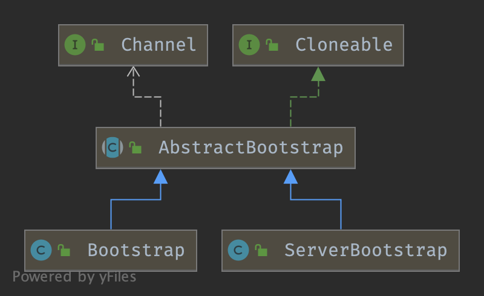

### Bootstrap Hierarchy



## Create

### group

```java
/**
 * The {@link EventLoopGroup} which is used to handle all the events for the to-be-created
 * {@link Channel}
 */
public B group(EventLoopGroup group) {
    ObjectUtil.checkNotNull(group, "group");
    if (this.group != null) {
        throw new IllegalStateException("group set already");
    }
    this.group = group;
    return self();
}

```

```java
/**
 * Set the {@link EventLoopGroup} for the parent (acceptor) and the child (client). These
 * {@link EventLoopGroup}'s are used to handle all the events and IO for {@link ServerChannel} and
 * {@link Channel}'s.
 */
public ServerBootstrap group(EventLoopGroup parentGroup, EventLoopGroup childGroup) {
    super.group(parentGroup);
    ObjectUtil.checkNotNull(childGroup, "childGroup");
    if (this.childGroup != null) {
        throw new IllegalStateException("childGroup set already");
    }
    this.childGroup = childGroup;
    return this;
}
```

## bind

1. [initAndRegister channel](/docs/CS/Java/Netty/Bootstrap.md?id=initAndRegister)
2. then doBind0

```java
// Create a new Channel and bind it.
public ChannelFuture bind() {
  	//Validate all the parameters. Sub-classes may override this, 
  	//but should call the super method in that case.
    validate();
    SocketAddress localAddress = this.localAddress;
    if (localAddress == null) { throw new IllegalStateException("");}
    return doBind(localAddress);
}

private ChannelFuture doBind(final SocketAddress localAddress) {
    final ChannelFuture regFuture = initAndRegister();
    final Channel channel = regFuture.channel();
    if (regFuture.cause() != null) {
        return regFuture;
    }

    if (regFuture.isDone()) {
        // At this point we know that the registration was complete and successful.
        ChannelPromise promise = channel.newPromise();
        doBind0(regFuture, channel, localAddress, promise);
        return promise;
    } else {
        // Registration future is almost always fulfilled already, but just in case it's not.
        final PendingRegistrationPromise promise = new PendingRegistrationPromise(channel);
        regFuture.addListener(new ChannelFutureListener() {
            @Override
            public void operationComplete(ChannelFuture future) throws Exception {
                Throwable cause = future.cause();
                if (cause != null) {
                    // Registration on the EventLoop failed so fail the ChannelPromise directly to not cause an
                    // IllegalStateException once we try to access the EventLoop of the Channel.
                    promise.setFailure(cause);
                } else {
                    // Registration was successful, so set the correct executor to use.
                    // See https://github.com/netty/netty/issues/2586
                    promise.registered();

                    doBind0(regFuture, channel, localAddress, promise);
                }
            }
        });
        return promise;
    }
}
```

### initAndRegister

1. new and init chcnnel
2. register

```java
//AbstractBootstrap#initAndRegister()
final ChannelFuture initAndRegister() {
    Channel channel = null;
    try {
        channel = channelFactory.newChannel(); // (1)
        init(channel);
    } catch (Throwable t) {
        if (channel != null) {
            // channel can be null if newChannel crashed (eg SocketException("too many open files"))
            channel.unsafe().closeForcibly();
            // as the Channel is not registered yet we need to force the usage of the GlobalEventExecutor
            return new DefaultChannelPromise(channel, GlobalEventExecutor.INSTANCE).setFailure(t);
        }
        // as the Channel is not registered yet we need to force the usage of the GlobalEventExecutor
        return new DefaultChannelPromise(new FailedChannel(), GlobalEventExecutor.INSTANCE).setFailure(t);
    }

    ChannelFuture regFuture = config().group().register(channel);// (2)
    if (regFuture.cause() != null) {
        if (channel.isRegistered()) {
            channel.close();
        } else {
            channel.unsafe().closeForcibly();
        }
    }

    // If we are here and the promise is not failed, it's one of the following cases:
    // 1) If we attempted registration from the event loop, the registration has been completed at this point.
    //    i.e. It's safe to attempt bind() or connect() now because the channel has been registered.
    // 2) If we attempted registration from the other thread, the registration request has been successfully
    //    added to the event loop's task queue for later execution.
    //    i.e. It's safe to attempt bind() or connect() now:
    //         because bind() or connect() will be executed *after* the scheduled registration task is executed
    //         because register(), bind(), and connect() are all bound to the same thread.

    return regFuture;
}
```

#### new Channel

The Class which is used to create Channel instances from. You either use this or channelFactory(io.netty.channel.ChannelFactory) if your Channel implementation has no no-args constructor.

```java
//AbstractBootstrap#channel()
public B channel(Class<? extends C> channelClass) {
    return channelFactory(new ReflectiveChannelFactory<C>(
            ObjectUtil.checkNotNull(channelClass, "channelClass")
    ));
}

//ReflectiveChannelFactory#newChannel()
@Override
public T newChannel() {
    try {
        return constructor.newInstance();
    } catch (Throwable t) {
        throw new ChannelException("Unable to create Channel from class " + constructor.getDeclaringClass(), t);
    }
}
```

**new NioServerSocketChannel**

actually new `sun.nio.ch.ServerSocketChannelImpl`

```java
public NioServerSocketChannel() {
    this(newSocket(DEFAULT_SELECTOR_PROVIDER));
}

private static ServerSocketChannel newSocket(SelectorProvider provider) {
    try {
        /**
         *  Use the {@link SelectorProvider} to open {@link SocketChannel} and so remove condition in
         *  {@link SelectorProvider#provider()} which is called by each ServerSocketChannel.open() otherwise.
         *
         *  See <a href="https://github.com/netty/netty/issues/2308">#2308</a>.
         */
        return provider.openServerSocketChannel();
    } catch (IOException e) {
        throw new ChannelException(
                "Failed to open a server socket.", e);
    }
}

ServerSocketChannelImpl(SelectorProvider sp) throws IOException {
    super(sp);
    this.fd =  Net.serverSocket(true);
    this.fdVal = IOUtil.fdVal(fd);
    this.state = ST_INUSE;
}
```

#### init Channel

Add handler into ChannelPipeline will call handlerAdded of this handler.

add `ServerBootstrapAcceptor`

```java
// ServerBootstrap
@Override
void init(Channel channel) {
    setChannelOptions(channel, options0().entrySet().toArray(newOptionArray(0)), logger);
    setAttributes(channel, attrs0().entrySet().toArray(newAttrArray(0)));

    ChannelPipeline p = channel.pipeline();

    final EventLoopGroup currentChildGroup = childGroup;
    final ChannelHandler currentChildHandler = childHandler;
    final Entry<ChannelOption<?>, Object>[] currentChildOptions =
            childOptions.entrySet().toArray(newOptionArray(0));
    final Entry<AttributeKey<?>, Object>[] currentChildAttrs = childAttrs.entrySet().toArray(newAttrArray(0));

    p.addLast(new ChannelInitializer<Channel>() {
        @Override
        public void initChannel(final Channel ch) {
            final ChannelPipeline pipeline = ch.pipeline();
            ChannelHandler handler = config.handler();
            if (handler != null) {
                pipeline.addLast(handler);
            }

            ch.eventLoop().execute(new Runnable() {
                @Override
                public void run() {
                    pipeline.addLast(new ServerBootstrapAcceptor(
                            ch, currentChildGroup, currentChildHandler, currentChildOptions, currentChildAttrs));
                }
            });
        }
    });
}
```

```java
// Bootstrap
@Override
ChannelFuture init(Channel channel) {
    ChannelPromise promise = channel.newPromise();
    ChannelPipeline p = channel.pipeline();
    p.addLast(config.handler());

    setChannelOptions(channel, newOptionsArray(), logger);
    setAttributes(channel, attrs0().entrySet().toArray(EMPTY_ATTRIBUTE_ARRAY));

    return promise.setSuccess();
}
```

### ServerBootstrapAcceptor

```java
//ServerBootstrap$ServerBootstrapAcceptor
private static class ServerBootstrapAcceptor extends ChannelInboundHandlerAdapter {

    private final EventLoopGroup childGroup;
    private final ChannelHandler childHandler;
    private final Entry<ChannelOption<?>, Object>[] childOptions;
    private final Entry<AttributeKey<?>, Object>[] childAttrs;
    private final Runnable enableAutoReadTask;

    ServerBootstrapAcceptor(
            final Channel channel, EventLoopGroup childGroup, ChannelHandler childHandler,
            Entry<ChannelOption<?>, Object>[] childOptions, Entry<AttributeKey<?>, Object>[] childAttrs) {
        this.childGroup = childGroup;
        this.childHandler = childHandler;
        this.childOptions = childOptions;
        this.childAttrs = childAttrs;

        // Task which is scheduled to re-enable auto-read.
        // It's important to create this Runnable before we try to submit it as otherwise the URLClassLoader may
        // not be able to load the class because of the file limit it already reached.
        //
        // See https://github.com/netty/netty/issues/1328
        enableAutoReadTask = new Runnable() {
            @Override
            public void run() {
                channel.config().setAutoRead(true);
            }
        };
    }

   
    @Override
    public void exceptionCaught(ChannelHandlerContext ctx, Throwable cause) throws Exception {
        final ChannelConfig config = ctx.channel().config();
        if (config.isAutoRead()) {
            // stop accept new connections for 1 second to allow the channel to recover
            // See https://github.com/netty/netty/issues/1328
            config.setAutoRead(false);
            ctx.channel().eventLoop().schedule(enableAutoReadTask, 1, TimeUnit.SECONDS);
        }
        // still let the exceptionCaught event flow through the pipeline to give the user
        // a chance to do something with it
        ctx.fireExceptionCaught(cause);
    }
}
```

#### initChild

```java
@Override
public void channelRead(ChannelHandlerContext ctx, Object msg) {
    final Channel child = (Channel) msg;

    EventLoop childEventLoop = child.eventLoop();
    // Ensure we always execute on the child EventLoop.
    if (childEventLoop.inEventLoop()) {
        initChild(child);
    } else {
        try {
            childEventLoop.execute(() -> initChild(child));
        } catch (Throwable cause) {
            forceClose(child, cause); // close by AbstractChannel$AbstractUnsafe
        }
    }
}
```

add ChildHandler

Set childOption

call Channel#register()

```java
private void initChild(final Channel child) {
    assert child.eventLoop().inEventLoop();
    try {
        child.pipeline().addLast(childHandler);

        setChannelOptions(child, childOptions, logger);
        setAttributes(child, childAttrs);

        child.register().addListener((ChannelFutureListener) future -> {
            if (!future.isSuccess()) {
                forceClose(child, future.cause());
            }
        });
    } catch (Throwable t) {
        forceClose(child, t);
    }
}
```

### register

[AbstractChannel$AbstractUnsafe#register()](/docs/CS/Java/Netty/Channel.md?id=register) submit a Runnable of register0 to [EventLoop#execute()](/docs/CS/Java/Netty/Eventloop.md?id=nioeventloopexecute).

**AbstractChannel$AbstracrUnsafe#register0** execute follow methods:

1. [ChannelPipeline#fireChannelRegistered()](/docs/CS/Java/Netty/ChannelHandler.md?id=channelpipelinefirechannelactive-)
2. [AbstractChannel#beginRead()](/docs/CS/Java/Netty/Channel.md?id=abstractchannelbeginread-)

### doBind0

```java
//AbstractBootstrap#doBind0()
private static void doBind0(
        final ChannelFuture regFuture, final Channel channel,
        final SocketAddress localAddress, final ChannelPromise promise) {

    // This method is invoked before channelRegistered() is triggered.  Give user handlers a chance to set up
    // the pipeline in its channelRegistered() implementation.
    channel.eventLoop().execute(new Runnable() {
        @Override
        public void run() {
            if (regFuture.isSuccess()) {
                channel.bind(localAddress, promise).addListener(ChannelFutureListener.CLOSE_ON_FAILURE);
            } else {
                promise.setFailure(regFuture.cause());
            }
        }
    });
}
```

##### Channel#bind()

```java
@Override
public ChannelFuture bind(final SocketAddress localAddress, final ChannelPromise promise) {
    if (localAddress == null) {
        throw new NullPointerException("localAddress");
    }
    if (isNotValidPromise(promise, false)) {
        // cancelled
        return promise;
    }

    final AbstractChannelHandlerContext next = findContextOutbound(MASK_BIND);
    EventExecutor executor = next.executor();
    if (executor.inEventLoop()) {
        next.invokeBind(localAddress, promise);
    } else {
        safeExecute(executor, new Runnable() {
            @Override
            public void run() {
                next.invokeBind(localAddress, promise);
            }
        }, promise, null);
    }
    return promise;
}
```

call `AbstractChannel$AbstractUnsafe#bind()`

```java
//AbstractChannel$AbstractUnsafe#bind()
@Override
public final void bind(final SocketAddress localAddress, final ChannelPromise promise) {
    //ignore assert

    // See: https://github.com/netty/netty/issues/576
    if (Boolean.TRUE.equals(config().getOption(ChannelOption.SO_BROADCAST)) &&
        localAddress instanceof InetSocketAddress &&
        !((InetSocketAddress) localAddress).getAddress().isAnyLocalAddress() &&
        !PlatformDependent.isWindows() && !PlatformDependent.maybeSuperUser()) {
        // Warn a user about the fact that a non-root user can't receive a
        // broadcast packet on *nix if the socket is bound on non-wildcard address.
        logger.warn(
                "A non-root user can't receive a broadcast packet if the socket " +
                "is not bound to a wildcard address; binding to a non-wildcard " +
                "address (" + localAddress + ") anyway as requested.");
    }

    boolean wasActive = isActive();
    try {
        doBind(localAddress); //implement by different subClass of AbstractChannel
    } catch (Throwable t) {
        safeSetFailure(promise, t);
        closeIfClosed();
        return;
    }

    if (!wasActive && isActive()) {
        invokeLater(new Runnable() {
            @Override
            public void run() {
                pipeline.fireChannelActive();
            }
        });
    }

    safeSetSuccess(promise);
}
```

Finally invoke `sun.nio.ch.SocketChannelImpl#bind()`

```java
//NioSocketChannel#doBind0()
private void doBind0(SocketAddress localAddress) throws Exception {
    if (PlatformDependent.javaVersion() >= 7) {
        SocketUtils.bind(javaChannel(), localAddress);
    } else {
        SocketUtils.bind(javaChannel().socket(), localAddress);
    }
}
```

## connect

1. [initAndRegister Channel]()
2. then doResolveAndConnect0

```java
//Connect a Channel to the remote peer.
public ChannelFuture connect(SocketAddress remoteAddress, SocketAddress localAddress) {
    validate();
    return doResolveAndConnect(remoteAddress, localAddress);
}

private ChannelFuture doResolveAndConnect(final SocketAddress remoteAddress, final SocketAddress localAddress) {
    final ChannelFuture regFuture = initAndRegister();
    final Channel channel = regFuture.channel();

    if (regFuture.isDone()) {
        if (!regFuture.isSuccess()) {
            return regFuture;
        }
        return doResolveAndConnect0(channel, remoteAddress, localAddress, channel.newPromise());
    } else {
        // Registration future is almost always fulfilled already, but just in case it's not.
        final PendingRegistrationPromise promise = new PendingRegistrationPromise(channel);
        regFuture.addListener(new ChannelFutureListener() {
            @Override
            public void operationComplete(ChannelFuture future) throws Exception {
                // Directly obtain the cause and do a null check so we only need one volatile read in case of a
                // failure.
                Throwable cause = future.cause();
                if (cause != null) {
                    // Registration on the EventLoop failed so fail the ChannelPromise directly to not cause an
                    // IllegalStateException once we try to access the EventLoop of the Channel.
                    promise.setFailure(cause);
                } else {
                    // Registration was successful, so set the correct executor to use.
                    // See https://github.com/netty/netty/issues/2586
                    promise.registered();
                    doResolveAndConnect0(channel, remoteAddress, localAddress, promise);
                }
            }
        });
        return promise;
    }
}


private ChannelFuture doResolveAndConnect0(final Channel channel, SocketAddress remoteAddress,
                                           final SocketAddress localAddress, final ChannelPromise promise) {
    try {
        final EventLoop eventLoop = channel.eventLoop();
        final AddressResolver<SocketAddress> resolver = this.resolver.getResolver(eventLoop);

        if (!resolver.isSupported(remoteAddress) || resolver.isResolved(remoteAddress)) {
            // Resolver has no idea about what to do with the specified remote address or it's resolved already.
            doConnect(remoteAddress, localAddress, promise);// invoke channel connect
            return promise;
        }

        final Future<SocketAddress> resolveFuture = resolver.resolve(remoteAddress);

        if (resolveFuture.isDone()) {
            final Throwable resolveFailureCause = resolveFuture.cause();

            if (resolveFailureCause != null) {
                // Failed to resolve immediately
                channel.close();
                promise.setFailure(resolveFailureCause);
            } else {
                // Succeeded to resolve immediately; cached? (or did a blocking lookup)
                doConnect(resolveFuture.getNow(), localAddress, promise);
            }
            return promise;
        }

        // Wait until the name resolution is finished.
        resolveFuture.addListener(new FutureListener<SocketAddress>() {
            @Override
            public void operationComplete(Future<SocketAddress> future) throws Exception {
                if (future.cause() != null) {
                    channel.close();
                    promise.setFailure(future.cause());
                } else {
                    doConnect(future.getNow(), localAddress, promise);
                }
            }
        });
    } catch (Throwable cause) {
        promise.tryFailure(cause);
    }
    return promise;
}
```

#### NioSocketChannel#doConnect()

finally invoke `sun.nio.ch.SocketChannelImpl#connect()`

```java
@Override
protected boolean doConnect(SocketAddress remoteAddress, SocketAddress localAddress) throws Exception {
    if (localAddress != null) {
        doBind0(localAddress);
    }

    boolean success = false;
    try {
        boolean connected = SocketUtils.connect(javaChannel(), remoteAddress);
        if (!connected) {
            selectionKey().interestOps(SelectionKey.OP_CONNECT);
        }
        success = true;
        return connected;
    } finally {
        if (!success) {
            doClose();
        }
    }
}
```

## Options

Allow to specify a ChannelOption which is used for the Channel instances once they got created. Use a value of null to remove a previous set ChannelOption.

```java
private final Map<ChannelOption<?>, Object> options = new ConcurrentHashMap<ChannelOption<?>, Object>();

public <T> B option(ChannelOption<T> option, T value) {
    ObjectUtil.checkNotNull(option, "option");
    if (value == null) {
        options.remove(option);
    } else {
        options.put(option, value);
    }
    return self();
}
```

## Links

- [Netty](/docs/CS/Java/Netty/Netty.md)
