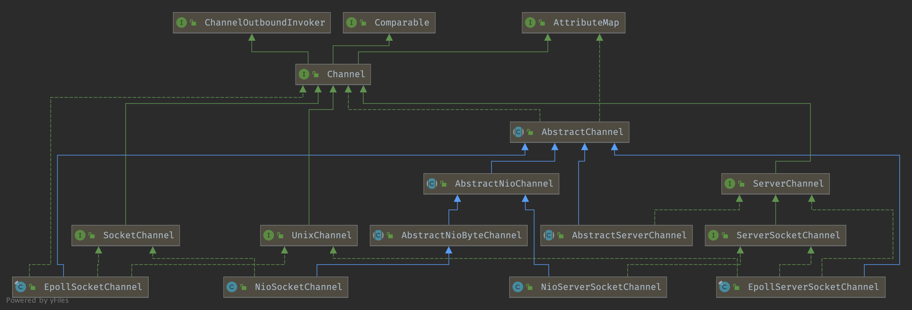

## Introduction


### Channel Hierarchy




## Channel

```java
public interface Channel extends AttributeMap, ChannelOutboundInvoker, Comparable<Channel> {

    /**
     * Returns the globally unique identifier of this {@link Channel}.
     */
    ChannelId id();

    /**
     * Return the {@link EventLoop} this {@link Channel} was registered to.
     */
    EventLoop eventLoop();

    /**
     * Returns the parent of this channel.
     *
     * @return the parent channel.
     *         {@code null} if this channel does not have a parent channel.
     */
    Channel parent();

    /**
     * Returns the configuration of this channel.
     */
    ChannelConfig config();

    /**
     * Returns {@code true} if the {@link Channel} is open and may get active later
     */
    boolean isOpen();

    /**
     * Returns {@code true} if the {@link Channel} is registered with an {@link EventLoop}.
     */
    boolean isRegistered();

    /**
     * Return {@code true} if the {@link Channel} is active and so connected.
     */
    boolean isActive();

    /**
     * Return the {@link ChannelMetadata} of the {@link Channel} which describe the nature of the {@link Channel}.
     */
    ChannelMetadata metadata();

    /**
     * Returns the local address where this channel is bound to.  The returned
     * {@link SocketAddress} is supposed to be down-cast into more concrete
     * type such as {@link InetSocketAddress} to retrieve the detailed
     * information.
     */
    SocketAddress localAddress();

    /**
     * Returns the remote address where this channel is connected to.  The
     * returned {@link SocketAddress} is supposed to be down-cast into more
     * concrete type such as {@link InetSocketAddress} to retrieve the detailed
     * information.
     */
    SocketAddress remoteAddress();

    /**
     * Returns the {@link ChannelFuture} which will be notified when this
     * channel is closed.  This method always returns the same future instance.
     */
    ChannelFuture closeFuture();

    /**
     * Returns {@code true} if and only if the I/O thread will perform the
     * requested write operation immediately.  Any write requests made when
     * this method returns {@code false} are queued until the I/O thread is
     * ready to process the queued write requests.
     */
    boolean isWritable();

    /**
     * Get how many bytes can be written until {@link #isWritable()} returns {@code false}.
     * This quantity will always be non-negative. If {@link #isWritable()} is {@code false} then 0.
     */
    long bytesBeforeUnwritable();

    /**
     * Get how many bytes must be drained from underlying buffers until {@link #isWritable()} returns {@code true}.
     * This quantity will always be non-negative. If {@link #isWritable()} is {@code true} then 0.
     */
    long bytesBeforeWritable();

    /**
     * Returns an <em>internal-use-only</em> object that provides unsafe operations.
     */
    Unsafe unsafe();

    /**
     * Return the assigned {@link ChannelPipeline}.
     */
    ChannelPipeline pipeline();

    /**
     * Return the assigned {@link ByteBufAllocator} which will be used to allocate {@link ByteBuf}s.
     */
    ByteBufAllocator alloc();

    @Override
    Channel read();

    @Override
    Channel flush();

    
}
```


## Unsafe

Unsafe operations that should never be called from user-code. These methods are only provided to implement the actual transport, and must be invoked from an I/O thread except for the following methods:

- localAddress()
- remoteAddress()
- closeForcibly()
- register(EventLoop, ChannelPromise)
- deregister(ChannelPromise)
- voidPromise()

```java
interface Unsafe {

    /**
     * Return the assigned {@link RecvByteBufAllocator.Handle} which will be used to allocate {@link ByteBuf}'s when
     * receiving data.
     */
    RecvByteBufAllocator.Handle recvBufAllocHandle();

    /**
     * Return the {@link SocketAddress} to which is bound local or
     * {@code null} if none.
     */
    SocketAddress localAddress();

    /**
     * Return the {@link SocketAddress} to which is bound remote or
     * {@code null} if none is bound yet.
     */
    SocketAddress remoteAddress();

    /**
     * Register the {@link Channel} of the {@link ChannelPromise} and notify
     * the {@link ChannelFuture} once the registration was complete.
     */
    void register(EventLoop eventLoop, ChannelPromise promise);

    /**
     * Bind the {@link SocketAddress} to the {@link Channel} of the {@link ChannelPromise} and notify
     * it once its done.
     */
    void bind(SocketAddress localAddress, ChannelPromise promise);

    /**
     * Connect the {@link Channel} of the given {@link ChannelFuture} with the given remote {@link SocketAddress}.
     * If a specific local {@link SocketAddress} should be used it need to be given as argument. Otherwise just
     * pass {@code null} to it.
     *
     * The {@link ChannelPromise} will get notified once the connect operation was complete.
     */
    void connect(SocketAddress remoteAddress, SocketAddress localAddress, ChannelPromise promise);

    /**
     * Disconnect the {@link Channel} of the {@link ChannelFuture} and notify the {@link ChannelPromise} once the
     * operation was complete.
     */
    void disconnect(ChannelPromise promise);

    /**
     * Close the {@link Channel} of the {@link ChannelPromise} and notify the {@link ChannelPromise} once the
     * operation was complete.
     */
    void close(ChannelPromise promise);

    /**
     * Closes the {@link Channel} immediately without firing any events.  Probably only useful
     * when registration attempt failed.
     */
    void closeForcibly();

    /**
     * Deregister the {@link Channel} of the {@link ChannelPromise} from {@link EventLoop} and notify the
     * {@link ChannelPromise} once the operation was complete.
     */
    void deregister(ChannelPromise promise);

    /**
     * Schedules a read operation that fills the inbound buffer of the first {@link ChannelInboundHandler} in the
     * {@link ChannelPipeline}.  If there's already a pending read operation, this method does nothing.
     */
    void beginRead();

    /**
     * Schedules a write operation.
     */
    void write(Object msg, ChannelPromise promise);

    /**
     * Flush out all write operations scheduled via {@link #write(Object, ChannelPromise)}.
     */
    void flush();

    /**
     * Return a special ChannelPromise which can be reused and passed to the operations in {@link Unsafe}.
     * It will never be notified of a success or error and so is only a placeholder for operations
     * that take a {@link ChannelPromise} as argument but for which you not want to get notified.
     */
    ChannelPromise voidPromise();

    /**
     * Returns the {@link ChannelOutboundBuffer} of the {@link Channel} where the pending write requests are stored.
     */
    ChannelOutboundBuffer outboundBuffer();
}
```

### AbstractChannel$AbstracrUnsafe#register()

submit a Runnable of register0 to [EventLoop#execute()](/docs/CS/Java/Netty/Eventloop.md?id=nioeventloopexecute).

```java
//AbstractChannel$AbstracrUnsafe#register()
@Override
public final void register(EventLoop eventLoop, final ChannelPromise promise) {
    //ignore assertion

    AbstractChannel.this.eventLoop = eventLoop;
    if (eventLoop.inEventLoop()) {
        register0(promise);
    } else {
        try {
            eventLoop.execute(new Runnable() {
                @Override
                public void run() {
                    register0(promise);
                }
            });
        } catch (Throwable t) {
            logger.warn(
                    "Force-closing a channel whose registration task was not accepted by an event loop: {}",
                    AbstractChannel.this, t);
            closeForcibly();
            closeFuture.setClosed();
            safeSetFailure(promise, t);
        }
    }
}
```

**AbstractChannel$AbstracrUnsafe#register0** execute follow methods:

1. ChannelPipeline#invokeHandlerAddedIfNeeded()
2. [ChannelPipeline#fireChannelRegistered()](/docs/CS/Java/Netty/Channel.md?id=channelpipelinefirechannelactive-)
3. [AbstractChannel#beginRead()](/docs/CS/Java/Netty/Channel.md?id=abstractchannelbeginread-)

```java
private void register0(ChannelPromise promise) {
    try {
        // check if the channel is still open as it could be closed in the mean time when the register
        // call was outside of the eventLoop
        if (!promise.setUncancellable() || !ensureOpen(promise)) {
            return;
        }
        boolean firstRegistration = neverRegistered;
        doRegister();
        neverRegistered = false;
        registered = true;

        // Ensure we call handlerAdded(...) before we actually notify the promise. This is needed as the
        // user may already fire events through the pipeline in the ChannelFutureListener.
        pipeline.invokeHandlerAddedIfNeeded();

        safeSetSuccess(promise);
        pipeline.fireChannelRegistered();
        // Only fire a channelActive if the channel has never been registered. This prevents firing
        // multiple channel actives if the channel is deregistered and re-registered.
        if (isActive()) {
            if (firstRegistration) {
                pipeline.fireChannelActive();
            } else if (config().isAutoRead()) {
                // This channel was registered before and autoRead() is set. This means we need to begin read
                // again so that we process inbound data.
                //
                // See https://github.com/netty/netty/issues/4805
                beginRead();
            }
        }
    } catch (Throwable t) {
        // Close the channel directly to avoid FD leak.
        closeForcibly();
        closeFuture.setClosed();
        safeSetFailure(promise, t);
    }
}
```


### close( )

```java
@Override
public final void close(final ChannelPromise promise) {
    assertEventLoop();

    ClosedChannelException closedChannelException = new ClosedChannelException();
    close(promise, closedChannelException, closedChannelException, false);
}

private void close(final ChannelPromise promise, final Throwable cause,
                   final ClosedChannelException closeCause, final boolean notify) {
    if (!promise.setUncancellable()) {
        return;
    }

    if (closeInitiated) {
        if (closeFuture.isDone()) {
            // Closed already.
            safeSetSuccess(promise);
        } else if (!(promise instanceof VoidChannelPromise)) { // Only needed if no VoidChannelPromise.
            // This means close() was called before so we just register a listener and return
            closeFuture.addListener(new ChannelFutureListener() {
                @Override
                public void operationComplete(ChannelFuture future) throws Exception {
                    promise.setSuccess();
                }
            });
        }
        return;
    }

    closeInitiated = true;

    final boolean wasActive = isActive();
    final ChannelOutboundBuffer outboundBuffer = this.outboundBuffer;
    this.outboundBuffer = null; // Disallow adding any messages and flushes to outboundBuffer.
    Executor closeExecutor = prepareToClose();
    if (closeExecutor != null) {
        closeExecutor.execute(new Runnable() {
            @Override
            public void run() {
                try {
                    // Execute the close.
                    doClose0(promise);
                } finally {
                    // Call invokeLater so closeAndDeregister is executed in the EventLoop again!
                    invokeLater(new Runnable() {
                        @Override
                        public void run() {
                            if (outboundBuffer != null) {
                                // Fail all the queued messages
                                outboundBuffer.failFlushed(cause, notify);
                                outboundBuffer.close(closeCause);
                            }
                            fireChannelInactiveAndDeregister(wasActive);
                        }
                    });
                }
            }
        });
    } else {
        try {
            // Close the channel and fail the queued messages in all cases.
            doClose0(promise);
        } finally {
            if (outboundBuffer != null) {
                // Fail all the queued messages.
                outboundBuffer.failFlushed(cause, notify);
                outboundBuffer.close(closeCause);
            }
        }
        if (inFlush0) {
            invokeLater(new Runnable() {
                @Override
                public void run() {
                    fireChannelInactiveAndDeregister(wasActive);
                }
            });
        } else {
            fireChannelInactiveAndDeregister(wasActive);
        }
    }
}

private void doClose0(ChannelPromise promise) {
    try {
        doClose();
        closeFuture.setClosed();
        safeSetSuccess(promise);
    } catch (Throwable t) {
        closeFuture.setClosed();
        safeSetFailure(promise, t);
    }
}

/**
 * Close the {@link Channel}
 */
@Override
protected void doClose() throws Exception {
    javaChannel().close();
}
```


### AbstractChannel#beginRead( )

```java
@Override
public final void beginRead() {
    assertEventLoop();

    if (!isActive()) {
        return;
    }

    try {
        doBeginRead();
    } catch (final Exception e) {
        invokeLater(new Runnable() {
            @Override
            public void run() {
                pipeline.fireExceptionCaught(e);
            }
        });
        close(voidPromise());
    }
}

@Override
protected void doBeginRead() throws Exception {
    // Channel.read() or ChannelHandlerContext.read() was called
    final SelectionKey selectionKey = this.selectionKey;
    if (!selectionKey.isValid()) {
        return;
    }

    readPending = true;

    final int interestOps = selectionKey.interestOps();
    if ((interestOps & readInterestOp) == 0) {
        selectionKey.interestOps(interestOps | readInterestOp);
    }
}
```


