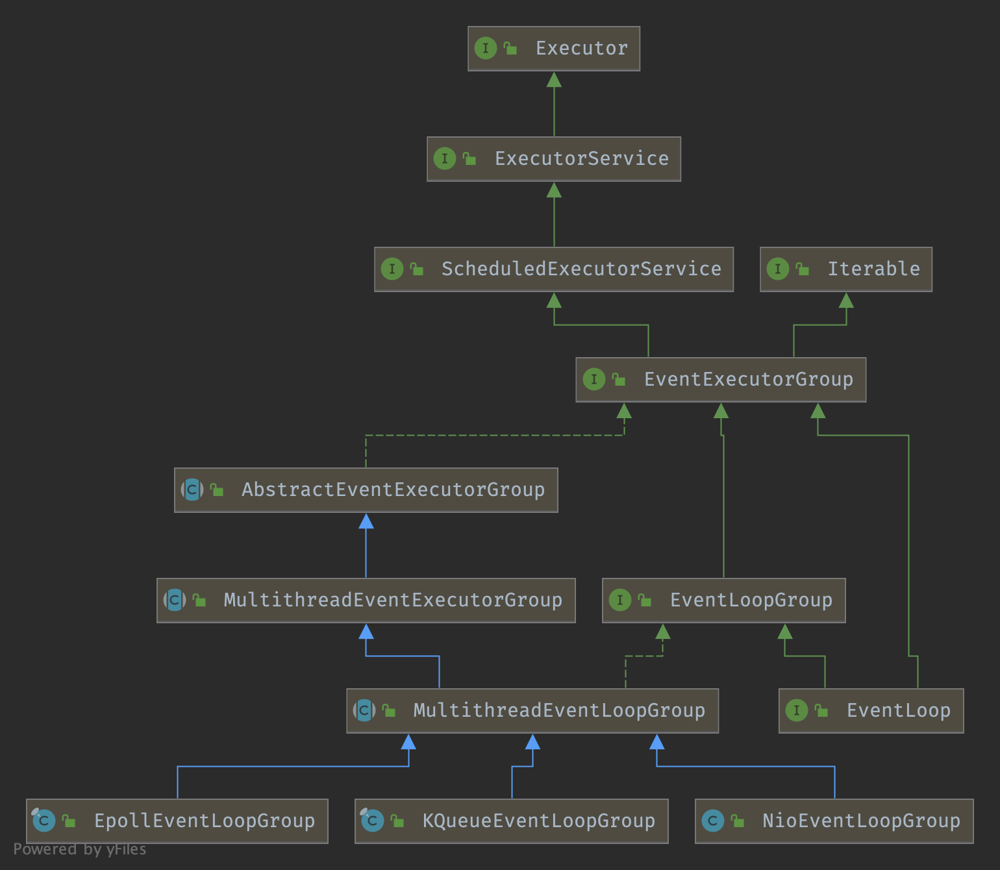

# EventLoop


### EventLoopGroup Inheritance




### EventExecutorGroup

The EventExecutorGroup is responsible for **providing the EventExecutor's to use via its `next()` method**. Besides this, it is also responsible for **handling their life-cycle** and **allows shutting them down in a global fashion**.

```java
public interface EventExecutorGroup extends ScheduledExecutorService, Iterable<EventExecutor> {
    
    //Returns one of the EventExecutors managed by this EventExecutorGroup.
    EventExecutor next();

    @Override
    Iterator<EventExecutor> iterator();
  ...
}
```


Signals this executor that the caller wants the executor to be shut down. Once this method is called, isShuttingDown() starts to return true, and the executor prepares to shut itself down. Unlike shutdown(), graceful shutdown ensures that no tasks are submitted for 'the quiet period' (usually a couple seconds) before it shuts itself down. If a task is submitted during the quiet period, it is guaranteed to be accepted and the quiet period will start over.

```java
 		Future<?> shutdownGracefully(long quietPeriod, long timeout, TimeUnit unit);

		//Returns true if and only if all EventExecutors managed by this EventExecutorGroup 
  	//are being shut down gracefully or was shut down.
    boolean isShuttingDown();

    //Shortcut method for shutdownGracefully(long, long, TimeUnit) with 
		//sensible default values.
    Future<?> shutdownGracefully();

    //Returns the Future which is notified when all EventExecutors managed 
		//by this EventExecutorGroup have been terminated.
    Future<?> terminationFuture();

    @Override
    @Deprecated
    void shutdown();

    @Override
    @Deprecated
    List<Runnable> shutdownNow();
```


### EventExecutor

```java

/**
 * The {@link EventExecutor} is a special {@link EventExecutorGroup} which comes
 * with some handy methods to see if a {@link Thread} is executed in a event loop.
 * Besides this, it also extends the {@link EventExecutorGroup} to allow for a generic
 * way to access methods.
 *
 */
public interface EventExecutor extends EventExecutorGroup {

    /**
     * Returns a reference to itself.
     */
    @Override
    EventExecutor next();

    /**
     * Return the {@link EventExecutorGroup} which is the parent of this {@link EventExecutor},
     */
    EventExecutorGroup parent();

    /**
     * Calls {@link #inEventLoop(Thread)} with {@link Thread#currentThread()} as argument
     */
    boolean inEventLoop();

    /**
     * Return {@code true} if the given {@link Thread} is executed in the event loop,
     * {@code false} otherwise.
     */
    boolean inEventLoop(Thread thread);

    /**
     * Return a new {@link Promise}.
     */
    <V> Promise<V> newPromise();

    /**
     * Create a new {@link ProgressivePromise}.
     */
    <V> ProgressivePromise<V> newProgressivePromise();

    /**
     * Create a new {@link Future} which is marked as succeeded already. So {@link Future#isSuccess()}
     * will return {@code true}. All {@link FutureListener} added to it will be notified directly. Also
     * every call of blocking methods will just return without blocking.
     */
    <V> Future<V> newSucceededFuture(V result);

    /**
     * Create a new {@link Future} which is marked as failed already. So {@link Future#isSuccess()}
     * will return {@code false}. All {@link FutureListener} added to it will be notified directly. Also
     * every call of blocking methods will just return without blocking.
     */
    <V> Future<V> newFailedFuture(Throwable cause);
}
```


### EventLoopGroup

Special EventExecutorGroup which allows registering Channels that get processed for later selection during the event loop.

```java
public interface EventLoopGroup extends EventExecutorGroup {
  
    @Override
    EventLoop next();

    //Register a Channel with this EventLoop. 
  	//The returned ChannelFuture will get notified once the registration was complete.
    ChannelFuture register(Channel channel);

    //Register a Channel with this EventLoop using a ChannelFuture. 
  	//The passed ChannelFuture will get notified once the registration was complete and also will get returned.
    ChannelFuture register(ChannelPromise promise);

    //@deprecated Use #register(ChannelPromise) instead.
    @Deprecated
    ChannelFuture register(Channel channel, ChannelPromise promise);
}
```


### register

```java
//MultithreadEventLoopGroup#register()
@Override
public ChannelFuture register(Channel channel) {
    return next().register(channel);
}

//SingleThreadEventLoop#register()
@Override
public ChannelFuture register(Channel channel) {
    return register(new DefaultChannelPromise(channel, this));
}

//SingleThreadEventLoop#register()
@Override
public ChannelFuture register(final ChannelPromise promise) {
    promise.channel().unsafe().register(this, promise);
    return promise;
}
```

finally invoke` Channel#register()`

### AbstractNioChannel#doRegister( )

```java
//AbstractNioChannel#doRegister()
@Override
protected void doRegister() throws Exception {
    boolean selected = false;
    for (;;) {
        try {
            selectionKey = javaChannel().register(eventLoop().unwrappedSelector(), 0, this);
            return;
        } catch (CancelledKeyException e) {
            if (!selected) {
                // Force the Selector to select now as the "canceled" SelectionKey may still be
                // cached and not removed because no Select.select(..) operation was called yet.
                eventLoop().selectNow();
                selected = true;
            } else {
                // We forced a select operation on the selector before but the SelectionKey is still cached
                // for whatever reason. JDK bug ?
                throw e;
            }
        }
    }
}
```


## Create NioEventLoopGroup


```java
public NioEventLoopGroup(int nThreads) {
    this(nThreads, (Executor) null);
}

//Create a new instance using the specified number of threads, 
//the given ThreadFactory and the SelectorProvider which is returned by SelectorProvider#provider().
public NioEventLoopGroup(int nThreads, ThreadFactory threadFactory) {
    this(nThreads, threadFactory, SelectorProvider.provider());
}

public NioEventLoopGroup(
        int nThreads, ThreadFactory threadFactory, final SelectorProvider selectorProvider) {
    this(nThreads, threadFactory, selectorProvider, DefaultSelectStrategyFactory.INSTANCE);
}

public NioEventLoopGroup(int nThreads, ThreadFactory threadFactory,
    final SelectorProvider selectorProvider, final SelectStrategyFactory selectStrategyFactory) {
    super(nThreads, threadFactory, selectorProvider, selectStrategyFactory, RejectedExecutionHandlers.reject());
}

public NioEventLoopGroup(int nThreads, Executor executor, EventExecutorChooserFactory chooserFactory,
                         final SelectorProvider selectorProvider,
                         final SelectStrategyFactory selectStrategyFactory,
                         final RejectedExecutionHandler rejectedExecutionHandler,
                         final EventLoopTaskQueueFactory taskQueueFactory) {
    super(nThreads, executor, chooserFactory, selectorProvider, selectStrategyFactory,
            rejectedExecutionHandler, taskQueueFactory);
}
```


#### SelectorProvider#provider()

```java
//java.nio.channels.spi.SelectorProvider#provider()
public static SelectorProvider provider() {
        synchronized (lock) {
            if (provider != null)
                return provider;
            return AccessController.doPrivileged(
                new PrivilegedAction<SelectorProvider>() {
                    public SelectorProvider run() {
                            if (loadProviderFromProperty())
                                return provider;
                            if (loadProviderAsService())
                                return provider;
                            provider = sun.nio.ch.DefaultSelectorProvider.create();
                            return provider;
                        }
                    });
        }
    }

//sun.nio.ch.DefaultSelectorProvider.create()
public static SelectorProvider create() {
        String osname = AccessController
            .doPrivileged(new GetPropertyAction("os.name"));
        if (osname.equals("SunOS"))
            return createProvider("sun.nio.ch.DevPollSelectorProvider");
        if (osname.equals("Linux"))
            return createProvider("sun.nio.ch.EPollSelectorProvider");
        return new sun.nio.ch.PollSelectorProvider();
    }
```


#### DefaultSelectStrategyFactory

```java
public final class DefaultSelectStrategyFactory implements SelectStrategyFactory {
    public static final SelectStrategyFactory INSTANCE = new DefaultSelectStrategyFactory();

    private DefaultSelectStrategyFactory() { }

    @Override
    public SelectStrategy newSelectStrategy() {
        return DefaultSelectStrategy.INSTANCE;
    }
}
```


#### RejectedExecutionHandlers#reject()

```java
public final class RejectedExecutionHandlers {
    private static final RejectedExecutionHandler REJECT = new RejectedExecutionHandler() {
        @Override
        public void rejected(Runnable task, SingleThreadEventExecutor executor) {
            throw new RejectedExecutionException();
        }
    };

    private RejectedExecutionHandlers() { }

    /**
     * Returns a {@link RejectedExecutionHandler} that will always just throw a {@link RejectedExecutionException}.
     */
    public static RejectedExecutionHandler reject() {
        return REJECT;
    }
}
```


#### MultithreadEventExecutorGroup


```java
private final EventExecutor[] children;
private final Set<EventExecutor> readonlyChildren;
private final AtomicInteger terminatedChildren = new AtomicInteger();
private final Promise<?> terminationFuture = new DefaultPromise(GlobalEventExecutor.INSTANCE);
private final EventExecutorChooserFactory.EventExecutorChooser chooser;

private static final int DEFAULT_EVENT_LOOP_THREADS;

    static {
        DEFAULT_EVENT_LOOP_THREADS = Math.max(1, SystemPropertyUtil.getInt(
                "io.netty.eventLoopThreads", NettyRuntime.availableProcessors() * 2));
    }

protected MultithreadEventLoopGroup(int nThreads, Executor executor, EventExecutorChooserFactory chooserFactory, Object... args) {
        super(nThreads == 0 ? DEFAULT_EVENT_LOOP_THREADS : nThreads, executor, chooserFactory, args);
    }

protected MultithreadEventExecutorGroup(int nThreads, Executor executor,
                                        EventExecutorChooserFactory chooserFactory, Object... args) {
  	// ... ignore assert method
  
  	if (executor == null) {
            executor = new ThreadPerTaskExecutor(newDefaultThreadFactory());
        }
  
    children = new EventExecutor[nThreads];

    for (int i = 0; i < nThreads; i ++) {
        boolean success = false;
        try {
            children[i] = newChild(executor, args);
            success = true;
        } catch (Exception e) {
            // TODO: Think about if this is a good exception type
            throw new IllegalStateException("failed to create a child event loop", e);
        } finally {
            if (!success) {
                for (int j = 0; j < i; j ++) {
                    children[j].shutdownGracefully();
                }

                for (int j = 0; j < i; j ++) {
                    EventExecutor e = children[j];
                    try {
                        while (!e.isTerminated()) {
                            e.awaitTermination(Integer.MAX_VALUE, TimeUnit.SECONDS);
                        }
                    } catch (InterruptedException interrupted) {
                        // Let the caller handle the interruption.
                        Thread.currentThread().interrupt();
                        break;
                    }
                }
            }
        }
    }

    chooser = chooserFactory.newChooser(children);

    final FutureListener<Object> terminationListener = new FutureListener<Object>() {
        @Override
        public void operationComplete(Future<Object> future) throws Exception {
            if (terminatedChildren.incrementAndGet() == children.length) {
                terminationFuture.setSuccess(null);
            }
        }
    };

    for (EventExecutor e: children) {
        e.terminationFuture().addListener(terminationListener);
    }
		//finally get readonlyChildrenSet
    Set<EventExecutor> childrenSet = new LinkedHashSet<EventExecutor>(children.length);
    Collections.addAll(childrenSet, children);
    readonlyChildren = Collections.unmodifiableSet(childrenSet);
}
```


#### ThreadPerTaskExecutor

```java
public final class ThreadPerTaskExecutor implements Executor {
    private final ThreadFactory threadFactory;
		//ignore constructor

    @Override
    public void execute(Runnable command) {
        threadFactory.newThread(command).start();
    }
}
```


#### DefaultThreadFactory

```java
public class DefaultThreadFactory implements ThreadFactory {

    private static final AtomicInteger poolId = new AtomicInteger();

    private final AtomicInteger nextId = new AtomicInteger();
    private final String prefix;
    private final boolean daemon;
    private final int priority;
    protected final ThreadGroup threadGroup;

    public DefaultThreadFactory(Class<?> poolType) {
        this(poolType, false, Thread.NORM_PRIORITY);
    }

    public DefaultThreadFactory(Class<?> poolType, boolean daemon, int priority) {
        this(toPoolName(poolType), daemon, priority);
    }

    public static String toPoolName(Class<?> poolType) {
       //ignore checking parameters
      
        String poolName = StringUtil.simpleClassName(poolType);
        switch (poolName.length()) {
            case 0:
                return "unknown";
            case 1:
                return poolName.toLowerCase(Locale.US);
            default:
                if (Character.isUpperCase(poolName.charAt(0)) && Character.isLowerCase(poolName.charAt(1))) {
                    return Character.toLowerCase(poolName.charAt(0)) + poolName.substring(1);
                } else {
                    return poolName;
                }
        }
    }

    public DefaultThreadFactory(String poolName, boolean daemon, int priority, ThreadGroup threadGroup) {
       //ignore checking parameters

        prefix = poolName + '-' + poolId.incrementAndGet() + '-';
        this.daemon = daemon;
        this.priority = priority;
        this.threadGroup = threadGroup;
    }

    public DefaultThreadFactory(String poolName, boolean daemon, int priority) {
        this(poolName, daemon, priority, System.getSecurityManager() == null ?
                Thread.currentThread().getThreadGroup() : System.getSecurityManager().getThreadGroup());
    }

  ...
}
```

##### DefaultThreadFactory#newThread()

create **FastThreadLocalThread**

```java
		//DefaultThreadFactory#newThread()
		@Override
    public Thread newThread(Runnable r) {
        Thread t = newThread(FastThreadLocalRunnable.wrap(r), prefix + nextId.incrementAndGet());
        try {
            if (t.isDaemon() != daemon) {
                t.setDaemon(daemon);
            }

            if (t.getPriority() != priority) {
                t.setPriority(priority);
            }
        } catch (Exception ignored) {
            // Doesn't matter even if failed to set.
        }
        return t;
    }

		protected Thread newThread(Runnable r, String name) {
        return new FastThreadLocalThread(threadGroup, r, name);
    }
```


#### NioEventLoopGroup#newChild()

create NioEventLoop

```java
//NioEventLoopGroup#newChild()
@Override
protected EventLoop newChild(Executor executor, Object... args) throws Exception {
    EventLoopTaskQueueFactory queueFactory = args.length == 4 ? (EventLoopTaskQueueFactory) args[3] : null;
    return new NioEventLoop(this, executor, (SelectorProvider) args[0],
        ((SelectStrategyFactory) args[1]).newSelectStrategy(), (RejectedExecutionHandler) args[2], queueFactory);
}
```


#### EventExecutorChooserFactory#newChooser()
default use **PowerOfTwoEventExecutorChooser**

```java
//Default implementation which uses simple round-robin to choose next EventExecutor.
@UnstableApi
public final class DefaultEventExecutorChooserFactory implements EventExecutorChooserFactory {

    public static final DefaultEventExecutorChooserFactory INSTANCE = new DefaultEventExecutorChooserFactory();

    private DefaultEventExecutorChooserFactory() { }

    @SuppressWarnings("unchecked")
    @Override
    public EventExecutorChooser newChooser(EventExecutor[] executors) {
        if (isPowerOfTwo(executors.length)) {
            return new PowerOfTwoEventExecutorChooser(executors);
        } else {
            return new GenericEventExecutorChooser(executors);
        }
    }

    private static boolean isPowerOfTwo(int val) {
        return (val & -val) == val;
    }

    private static final class PowerOfTwoEventExecutorChooser implements EventExecutorChooser {
        private final AtomicInteger idx = new AtomicInteger();
        private final EventExecutor[] executors;

        PowerOfTwoEventExecutorChooser(EventExecutor[] executors) {
            this.executors = executors;
        }

        @Override
        public EventExecutor next() {
            return executors[idx.getAndIncrement() & executors.length - 1];
        }
    }

    private static final class GenericEventExecutorChooser implements EventExecutorChooser {
        private final AtomicInteger idx = new AtomicInteger();
        private final EventExecutor[] executors;

        GenericEventExecutorChooser(EventExecutor[] executors) {
            this.executors = executors;
        }

        @Override
        public EventExecutor next() {
            return executors[Math.abs(idx.getAndIncrement() % executors.length)];
        }
    }
}
```


#### NioEventLoopGroup#setIoRatio

Sets the percentage of the desired amount of time spent for I/O in the child event loops. The default value is 50, which means the event loop will try to **spend the same amount of time for I/O as for non-I/O tasks**.

```java
/**
 * Sets the percentage of the desired amount of time spent for I/O in the child event loops.  The default value is 50, which means the event loop will try to spend the same amount of time for I/O as for non-I/O tasks.
 */
public void setIoRatio(int ioRatio) {
    for (EventExecutor e: this) {
        ((NioEventLoop) e).setIoRatio(ioRatio);
    }
}
```


## Fix epoll 100% CPU bug

Replaces the current Selectors of the child event loops with newly created Selectors to work around the infamous epoll 100% CPU bug.

```java
public void rebuildSelectors() {
    for (EventExecutor e: this) {
        ((NioEventLoop) e).rebuildSelector();
    }
}
```


### EventLoop Inheritance


## Create NioEventLoop

```java
NioEventLoop(NioEventLoopGroup parent, Executor executor, SelectorProvider selectorProvider,
             SelectStrategy strategy, RejectedExecutionHandler rejectedExecutionHandler,
             EventLoopTaskQueueFactory queueFactory) {
    super(parent, executor, false, newTaskQueue(queueFactory), newTaskQueue(queueFactory),
            rejectedExecutionHandler);
    //check selectorProvider & strategy non-null
    provider = selectorProvider;
    final SelectorTuple selectorTuple = openSelector();
    selector = selectorTuple.selector;
    unwrappedSelector = selectorTuple.unwrappedSelector;
    selectStrategy = strategy;
}
```


#### NioEventLoop#newTaskQueue()

`PlatformDependent#<Runnable>newMpscQueue()`

```java
private static Queue<Runnable> newTaskQueue(
        EventLoopTaskQueueFactory queueFactory) {
    if (queueFactory == null) {
        return newTaskQueue0(DEFAULT_MAX_PENDING_TASKS);
    }
    return queueFactory.newTaskQueue(DEFAULT_MAX_PENDING_TASKS);
}

private static Queue<Runnable> newTaskQueue0(int maxPendingTasks) {
    // This event loop never calls takeTask()
    return maxPendingTasks == Integer.MAX_VALUE ? PlatformDependent.<Runnable>newMpscQueue()
            : PlatformDependent.<Runnable>newMpscQueue(maxPendingTasks);
}
```


Fields

```java
private static final int CLEANUP_INTERVAL = 256; // XXX Hard-coded value, but won't need customization.

private static final boolean DISABLE_KEY_SET_OPTIMIZATION =
        SystemPropertyUtil.getBoolean("io.netty.noKeySetOptimization", false);//default false

private static final int MIN_PREMATURE_SELECTOR_RETURNS = 3;

// if SystemPropertyUtil.getInt("io.netty.selectorAutoRebuildThreshold") < 3, default 512
private static final int SELECTOR_AUTO_REBUILD_THRESHOLD;

private final IntSupplier selectNowSupplier = new IntSupplier() {
    @Override
    public int get() throws Exception {
        return selectNow();
    }
};

// Workaround for JDK NIO bug.
//
// See:
// - http://bugs.sun.com/view_bug.do?bug_id=6427854
// - https://github.com/netty/netty/issues/203
static {
    final String key = "sun.nio.ch.bugLevel";
    final String bugLevel = SystemPropertyUtil.get(key);
    // if (bugLevel == null), AccessController.doPrivileged(new PrivilegedAction<Void>()) to run System.setProperty(key, "");

   //init SELECTOR_AUTO_REBUILD_THRESHOLD
}

/**
 * The NIO Selector.
 */
private Selector selector;
private Selector unwrappedSelector;
private SelectedSelectionKeySet selectedKeys;

private final SelectorProvider provider;

/**
 * Boolean that controls determines if a blocked Selector.select should
 * break out of its selection process. In our case we use a timeout for
 * the select method and the select method will block for that time unless
 * waken up.
 */
private final AtomicBoolean wakenUp = new AtomicBoolean();
private volatile long nextWakeupTime = Long.MAX_VALUE;

private final SelectStrategy selectStrategy;

private volatile int ioRatio = 50;
private int cancelledKeys;
private boolean needsToSelectAgain;
```


#### NioEventLoop#openSelector()

```java
private SelectorTuple openSelector() {
    final Selector unwrappedSelector;
    try {
      	//implement by different os, epoll/kqueue
        unwrappedSelector = provider.openSelector();
    } catch (IOException e) {
        throw new ChannelException("failed to open a new selector", e);
    }

    if (DISABLE_KEY_SET_OPTIMIZATION) {
        return new SelectorTuple(unwrappedSelector);
    }

    Object maybeSelectorImplClass = AccessController.doPrivileged(new PrivilegedAction<Object>() {
        @Override
        public Object run() {
            try {
                return Class.forName(
                        "sun.nio.ch.SelectorImpl",
                        false,
                        PlatformDependent.getSystemClassLoader());
            } catch (Throwable cause) {
                return cause;
            }
        }
    });

    if (!(maybeSelectorImplClass instanceof Class) ||
        // ensure the current selector implementation is what we can instrument.
        !((Class<?>) maybeSelectorImplClass).isAssignableFrom(unwrappedSelector.getClass())) {
        if (maybeSelectorImplClass instanceof Throwable) {
            Throwable t = (Throwable) maybeSelectorImplClass;
            logger.trace("failed to instrument a special java.util.Set into: {}", unwrappedSelector, t);
        }
        return new SelectorTuple(unwrappedSelector);
    }

    final Class<?> selectorImplClass = (Class<?>) maybeSelectorImplClass;
    final SelectedSelectionKeySet selectedKeySet = new SelectedSelectionKeySet();

    Object maybeException = AccessController.doPrivileged(new PrivilegedAction<Object>() {
        @Override
        public Object run() {
            try {
                Field selectedKeysField = selectorImplClass.getDeclaredField("selectedKeys");
                Field publicSelectedKeysField = selectorImplClass.getDeclaredField("publicSelectedKeys");

                if (PlatformDependent.javaVersion() >= 9 && PlatformDependent.hasUnsafe()) {
                    // Let us try to use sun.misc.Unsafe to replace the SelectionKeySet.
                    // This allows us to also do this in Java9+ without any extra flags.
                    long selectedKeysFieldOffset = PlatformDependent.objectFieldOffset(selectedKeysField);
                    long publicSelectedKeysFieldOffset =
                            PlatformDependent.objectFieldOffset(publicSelectedKeysField);

                    if (selectedKeysFieldOffset != -1 && publicSelectedKeysFieldOffset != -1) {
                        PlatformDependent.putObject(
                                unwrappedSelector, selectedKeysFieldOffset, selectedKeySet);
                        PlatformDependent.putObject(
                                unwrappedSelector, publicSelectedKeysFieldOffset, selectedKeySet);
                        return null;
                    }
                    // We could not retrieve the offset, lets try reflection as last-resort.
                }

                Throwable cause = ReflectionUtil.trySetAccessible(selectedKeysField, true);
                if (cause != null) {
                    return cause;
                }
                cause = ReflectionUtil.trySetAccessible(publicSelectedKeysField, true);
                if (cause != null) {
                    return cause;
                }

                selectedKeysField.set(unwrappedSelector, selectedKeySet);
                publicSelectedKeysField.set(unwrappedSelector, selectedKeySet);
                return null;
            } catch (NoSuchFieldException e) {
                return e;
            } catch (IllegalAccessException e) {
                return e;
            }
        }
    });

    if (maybeException instanceof Exception) {
        selectedKeys = null;
        Exception e = (Exception) maybeException;
        logger.trace("failed to instrument a special java.util.Set into: {}", unwrappedSelector, e);
        return new SelectorTuple(unwrappedSelector);
    }
    selectedKeys = selectedKeySet;
    logger.trace("instrumented a special java.util.Set into: {}", unwrappedSelector);
    return new SelectorTuple(unwrappedSelector,
                             new SelectedSelectionKeySetSelector(unwrappedSelector, selectedKeySet));
}
```


SelectedSelectionKeySet actually use SelectionKey[] keys

```java
final class SelectedSelectionKeySet extends AbstractSet<SelectionKey> {

    SelectionKey[] keys;
    int size;

    SelectedSelectionKeySet() {
        keys = new SelectionKey[1024];
    }
  ...
}
```


## NioEventLoop#execute()


### SingleThreadEventExecutor#execute()

```java
@Override
public void execute(Runnable task) {
    ObjectUtil.checkNotNull(task, "task");
    execute(task, !(task instanceof LazyRunnable) && wakesUpForTask(task));
}

private void execute(Runnable task, boolean immediate) {
    boolean inEventLoop = inEventLoop();
    addTask(task);
    if (!inEventLoop) {
        startThread();
        if (isShutdown()) {
            boolean reject = false;
            try {
                if (removeTask(task)) {
                    reject = true;
                }
            } catch (UnsupportedOperationException e) {
                // The task queue does not support removal so the best thing we can do is to just move on and
                // hope we will be able to pick-up the task before its completely terminated.
                // In worst case we will log on termination.
            }
            if (reject) {
                reject();
            }
        }
    }

    if (!addTaskWakesUp && immediate) {
        wakeup(inEventLoop);
    }
}
```


### SingleThreadEventExecutor#startThread()

`EventLoop.run() in for(;;) `

```java
private void startThread() {
    if (state == ST_NOT_STARTED) {
        if (STATE_UPDATER.compareAndSet(this, ST_NOT_STARTED, ST_STARTED)) {
            boolean success = false;
            try {
                doStartThread();
                success = true;
            } finally {
                if (!success) {
                    STATE_UPDATER.compareAndSet(this, ST_STARTED, ST_NOT_STARTED);
                }
            }
        }
    }
}

private void doStartThread() {
    assert thread == null;
    executor.execute(new Runnable() {
        @Override
        public void run() {
            thread = Thread.currentThread();
            if (interrupted) {
                thread.interrupt();
            }

            boolean success = false;
            updateLastExecutionTime();
            try {
                SingleThreadEventExecutor.this.run();//invoke EventLoop.run()
                success = true;
            } catch (Throwable t) {
                logger.warn("Unexpected exception from an event executor: ", t);
            } finally {
                for (;;) {
                    int oldState = state;
                    if (oldState >= ST_SHUTTING_DOWN || STATE_UPDATER.compareAndSet(
                            SingleThreadEventExecutor.this, oldState, ST_SHUTTING_DOWN)) {
                        break;
                    }
                }

                // Check if confirmShutdown() was called at the end of the loop.
                if (success && gracefulShutdownStartTime == 0) {
                    if (logger.isErrorEnabled()) {
                        logger.error("Buggy " + EventExecutor.class.getSimpleName() + " implementation; " +
                                SingleThreadEventExecutor.class.getSimpleName() + ".confirmShutdown() must " +
                                "be called before run() implementation terminates.");
                    }
                }

                try {
                    // Run all remaining tasks and shutdown hooks.
                    for (;;) {
                        if (confirmShutdown()) {
                            break;
                        }
                    }
                } finally {
                    try {
                        cleanup();
                    } finally {
                        // Lets remove all FastThreadLocals for the Thread as we are about to terminate and notify
                        // the future. The user may block on the future and once it unblocks the JVM may terminate
                        // and start unloading classes.
                        // See https://github.com/netty/netty/issues/6596.
                        FastThreadLocal.removeAll();

                        STATE_UPDATER.set(SingleThreadEventExecutor.this, ST_TERMINATED);
                        threadLock.countDown();
                        if (logger.isWarnEnabled() && !taskQueue.isEmpty()) {
                            logger.warn("An event executor terminated with " +
                                    "non-empty task queue (" + taskQueue.size() + ')');
                        }
                        terminationFuture.setSuccess(null);
                    }
                }
            }
        }
    });
}
```


### NioEventLoop#run( ) 

```java
@Override
protected void run() {
    for (;;) {
        try {
            try {
                switch (selectStrategy.calculateStrategy(selectNowSupplier, hasTasks())) {
                case SelectStrategy.CONTINUE:
                    continue;

                case SelectStrategy.BUSY_WAIT:
                    // fall-through to SELECT since the busy-wait is not supported with NIO

                case SelectStrategy.SELECT:
                    select(wakenUp.getAndSet(false));

                    // 'wakenUp.compareAndSet(false, true)' is always evaluated
                    // before calling 'selector.wakeup()' to reduce the wake-up
                    // overhead. (Selector.wakeup() is an expensive operation.)
                    //
                    // However, there is a race condition in this approach.
                    // The race condition is triggered when 'wakenUp' is set to
                    // true too early.
                    //
                    // 'wakenUp' is set to true too early if:
                    // 1) Selector is waken up between 'wakenUp.set(false)' and
                    //    'selector.select(...)'. (BAD)
                    // 2) Selector is waken up between 'selector.select(...)' and
                    //    'if (wakenUp.get()) { ... }'. (OK)
                    //
                    // In the first case, 'wakenUp' is set to true and the
                    // following 'selector.select(...)' will wake up immediately.
                    // Until 'wakenUp' is set to false again in the next round,
                    // 'wakenUp.compareAndSet(false, true)' will fail, and therefore
                    // any attempt to wake up the Selector will fail, too, causing
                    // the following 'selector.select(...)' call to block
                    // unnecessarily.
                    //
                    // To fix this problem, we wake up the selector again if wakenUp
                    // is true immediately after selector.select(...).
                    // It is inefficient in that it wakes up the selector for both
                    // the first case (BAD - wake-up required) and the second case
                    // (OK - no wake-up required).

                    if (wakenUp.get()) {
                        selector.wakeup();
                    }
                    // fall through
                default:
                }
            } catch (IOException e) {
                // If we receive an IOException here its because the Selector is messed up. Let's rebuild
                // the selector and retry. https://github.com/netty/netty/issues/8566
                rebuildSelector0();
                handleLoopException(e);
                continue;
            }

            cancelledKeys = 0;
            needsToSelectAgain = false;
            final int ioRatio = this.ioRatio;
            if (ioRatio == 100) {
                try {
                    processSelectedKeys();
                } finally {
                    // Ensure we always run tasks.
                    runAllTasks();
                }
            } else {
                final long ioStartTime = System.nanoTime();
                try {
                    processSelectedKeys();
                } finally {
                    // Ensure we always run tasks.
                    final long ioTime = System.nanoTime() - ioStartTime;
                    runAllTasks(ioTime * (100 - ioRatio) / ioRatio);
                }
            }
        } catch (Throwable t) {
            handleLoopException(t);
        }
        // Always handle shutdown even if the loop processing threw an exception.
        try {
            if (isShuttingDown()) {
                closeAll();
                if (confirmShutdown()) {
                    return;
                }
            }
        } catch (Throwable t) {
            handleLoopException(t);
        }
    }
}
```


### NioEventLoop#register()

```java
/**
 * Registers an arbitrary {@link SelectableChannel}, not necessarily created by Netty, to the {@link Selector}
 * of this event loop.  Once the specified {@link SelectableChannel} is registered, the specified {@code task} will
 * be executed by this event loop when the {@link SelectableChannel} is ready.
 */
public void register(final SelectableChannel ch, final int interestOps, final NioTask<?> task) {
    //ignore assertion

    if (isShutdown()) {
        throw new IllegalStateException("event loop shut down");
    }

    if (inEventLoop()) {
        register0(ch, interestOps, task);
    } else {
        try {
            // Offload to the EventLoop as otherwise java.nio.channels.spi.AbstractSelectableChannel.register
            // may block for a long time while trying to obtain an internal lock that may be hold while selecting.
            submit(new Runnable() {
                @Override
                public void run() {
                    register0(ch, interestOps, task);
                }
            }).sync();
        } catch (InterruptedException ignore) {
            // Even if interrupted we did schedule it so just mark the Thread as interrupted.
            Thread.currentThread().interrupt();
        }
    }
}

private void register0(SelectableChannel ch, int interestOps, NioTask<?> task) {
    try {
        ch.register(unwrappedSelector, interestOps, task);
    } catch (Exception e) {
        throw new EventLoopException("failed to register a channel", e);
    }
}
```


SelectedSelectionKeySet

```java
final class SelectedSelectionKeySet extends AbstractSet<SelectionKey> {

    SelectionKey[] keys;
    int size;

    SelectedSelectionKeySet() {
        keys = new SelectionKey[1024];
    }
/**
 * override add() iterator()
 */
```


### select( )

```java
private void select(boolean oldWakenUp) throws IOException {
    Selector selector = this.selector;
    try {
        int selectCnt = 0;
        long currentTimeNanos = System.nanoTime();
        long selectDeadLineNanos = currentTimeNanos + delayNanos(currentTimeNanos);

        for (;;) {
            long timeoutMillis = (selectDeadLineNanos - currentTimeNanos + 500000L) / 1000000L;
            if (timeoutMillis <= 0) {
                if (selectCnt == 0) {
                    selector.selectNow();
                    selectCnt = 1;
                }
                break;
            }

            // If a task was submitted when wakenUp value was true, the task didn't get a chance to call
            // Selector#wakeup. So we need to check task queue again before executing select operation.
            // If we don't, the task might be pended until select operation was timed out.
            // It might be pended until idle timeout if IdleStateHandler existed in pipeline.
            if (hasTasks() && wakenUp.compareAndSet(false, true)) {
                selector.selectNow();
                selectCnt = 1;
                break;
            }

            int selectedKeys = selector.select(timeoutMillis);
            selectCnt ++;

            if (selectedKeys != 0 || oldWakenUp || wakenUp.get() || hasTasks() || hasScheduledTasks()) {
                // - Selected something,
                // - waken up by user, or
                // - the task queue has a pending task.
                // - a scheduled task is ready for processing
                break;
            }
            if (Thread.interrupted()) {
                // Thread was interrupted so reset selected keys and break so we not run into a busy loop.
                // As this is most likely a bug in the handler of the user or it's client library we will
                // also log it.
                //
                // See https://github.com/netty/netty/issues/2426
                if (logger.isDebugEnabled()) {
                    logger.debug("Selector.select() returned prematurely because " +
                            "Thread.currentThread().interrupt() was called. Use " +
                            "NioEventLoop.shutdownGracefully() to shutdown the NioEventLoop.");
                }
                selectCnt = 1;
                break;
            }

            long time = System.nanoTime();
            if (time - TimeUnit.MILLISECONDS.toNanos(timeoutMillis) >= currentTimeNanos) {
                // timeoutMillis elapsed without anything selected.
                selectCnt = 1;
            } else if (SELECTOR_AUTO_REBUILD_THRESHOLD > 0 &&
                    selectCnt >= SELECTOR_AUTO_REBUILD_THRESHOLD) {
                // The code exists in an extra method to ensure the method is not too big to inline as this
                // branch is not very likely to get hit very frequently.
                selector = selectRebuildSelector(selectCnt);
                selectCnt = 1;
                break;
            }

            currentTimeNanos = time;
        }

        if (selectCnt > MIN_PREMATURE_SELECTOR_RETURNS) {
            if (logger.isDebugEnabled()) {
                logger.debug("Selector.select() returned prematurely {} times in a row for Selector {}.",
                        selectCnt - 1, selector);
            }
        }
    } catch (CancelledKeyException e) {
        if (logger.isDebugEnabled()) {
            logger.debug(CancelledKeyException.class.getSimpleName() + " raised by a Selector {} - JDK bug?",
                    selector, e);
        }
        // Harmless exception - log anyway
    }
}
```


### selectRebuildSelector( )

```java
private Selector selectRebuildSelector(int selectCnt) throws IOException {
    // The selector returned prematurely many times in a row.
    // Rebuild the selector to work around the problem.
    logger.warn(
            "Selector.select() returned prematurely {} times in a row; rebuilding Selector {}.",
            selectCnt, selector);

    rebuildSelector();
    Selector selector = this.selector;

    // Select again to populate selectedKeys.
    selector.selectNow();
    return selector;
}

/**
 * Replaces the current {@link Selector} of this event loop with newly created {@link Selector}s to work
 * around the infamous epoll 100% CPU bug.
 */
public void rebuildSelector() {
    if (!inEventLoop()) {
        execute(new Runnable() {
            @Override
            public void run() {
                rebuildSelector0();
            }
        });
        return;
    }
    rebuildSelector0();
}

private void rebuildSelector0() {
    final Selector oldSelector = selector;
    final SelectorTuple newSelectorTuple;

    if (oldSelector == null) {
        return;
    }

    try {
        newSelectorTuple = openSelector();
    } catch (Exception e) {
        logger.warn("Failed to create a new Selector.", e);
        return;
    }

    // Register all channels to the new Selector.
    int nChannels = 0;
    for (SelectionKey key: oldSelector.keys()) {
        Object a = key.attachment();
        try {
            if (!key.isValid() || key.channel().keyFor(newSelectorTuple.unwrappedSelector) != null) {
                continue;
            }

            int interestOps = key.interestOps();
            key.cancel();
            SelectionKey newKey = key.channel().register(newSelectorTuple.unwrappedSelector, interestOps, a);
            if (a instanceof AbstractNioChannel) {
                // Update SelectionKey
                ((AbstractNioChannel) a).selectionKey = newKey;
            }
            nChannels ++;
        } catch (Exception e) {
            logger.warn("Failed to re-register a Channel to the new Selector.", e);
            if (a instanceof AbstractNioChannel) {
                AbstractNioChannel ch = (AbstractNioChannel) a;
                ch.unsafe().close(ch.unsafe().voidPromise());
            } else {
                @SuppressWarnings("unchecked")
                NioTask<SelectableChannel> task = (NioTask<SelectableChannel>) a;
                invokeChannelUnregistered(task, key, e);
            }
        }
    }

    selector = newSelectorTuple.selector;
    unwrappedSelector = newSelectorTuple.unwrappedSelector;

    try {
        // time to close the old selector as everything else is registered to the new one
        oldSelector.close();
    } catch (Throwable t) {
        if (logger.isWarnEnabled()) {
            logger.warn("Failed to close the old Selector.", t);
        }
    }

    if (logger.isInfoEnabled()) {
        logger.info("Migrated " + nChannels + " channel(s) to the new Selector.");
    }
}
```

#### NioEventLoop#processSelectedKeys( )

```java
private void processSelectedKeys() {
    if (selectedKeys != null) {
        processSelectedKeysOptimized();
    } else {
        processSelectedKeysPlain(selector.selectedKeys());
    }
}

private void processSelectedKeysOptimized() {
    for (int i = 0; i < selectedKeys.size; ++i) {
        final SelectionKey k = selectedKeys.keys[i];
        // null out entry in the array to allow to have it GC'ed once the Channel close
        // See https://github.com/netty/netty/issues/2363
        selectedKeys.keys[i] = null;

        final Object a = k.attachment();

        if (a instanceof AbstractNioChannel) {
            processSelectedKey(k, (AbstractNioChannel) a);
        } else {
            @SuppressWarnings("unchecked")
            NioTask<SelectableChannel> task = (NioTask<SelectableChannel>) a;
            processSelectedKey(k, task);
        }

        if (needsToSelectAgain) {
            // null out entries in the array to allow to have it GC'ed once the Channel close
            // See https://github.com/netty/netty/issues/2363
            selectedKeys.reset(i + 1);

            selectAgain();
            i = -1;
        }
    }
}

private void processSelectedKey(SelectionKey k, AbstractNioChannel ch) {
    final AbstractNioChannel.NioUnsafe unsafe = ch.unsafe();
    if (!k.isValid()) {
        final EventLoop eventLoop;
        try {
            eventLoop = ch.eventLoop();
        } catch (Throwable ignored) {
            // If the channel implementation throws an exception because there is no event loop, we ignore this
            // because we are only trying to determine if ch is registered to this event loop and thus has authority
            // to close ch.
            return;
        }
        // Only close ch if ch is still registered to this EventLoop. ch could have deregistered from the event loop
        // and thus the SelectionKey could be cancelled as part of the deregistration process, but the channel is
        // still healthy and should not be closed.
        // See https://github.com/netty/netty/issues/5125
        if (eventLoop != this || eventLoop == null) {
            return;
        }
        // close the channel if the key is not valid anymore
        unsafe.close(unsafe.voidPromise());
        return;
    }

    try {
        int readyOps = k.readyOps();
        // We first need to call finishConnect() before try to trigger a read(...) or write(...) as otherwise
        // the NIO JDK channel implementation may throw a NotYetConnectedException.
        if ((readyOps & SelectionKey.OP_CONNECT) != 0) {
            // remove OP_CONNECT as otherwise Selector.select(..) will always return without blocking
            // See https://github.com/netty/netty/issues/924
            int ops = k.interestOps();
            ops &= ~SelectionKey.OP_CONNECT;
            k.interestOps(ops);

            unsafe.finishConnect();
        }

        // Process OP_WRITE first as we may be able to write some queued buffers and so free memory.
        if ((readyOps & SelectionKey.OP_WRITE) != 0) {
            // Call forceFlush which will also take care of clear the OP_WRITE once there is nothing left to write
            ch.unsafe().forceFlush();
        }

        // Also check for readOps of 0 to workaround possible JDK bug which may otherwise lead
        // to a spin loop
        if ((readyOps & (SelectionKey.OP_READ | SelectionKey.OP_ACCEPT)) != 0 || readyOps == 0) {
            unsafe.read();
        }
    } catch (CancelledKeyException ignored) {
        unsafe.close(unsafe.voidPromise());
    }
}
```

#### NioByteUnsafe#read( )

```java

public final void read() {
    ChannelConfig config = AbstractNioByteChannel.this.config();
    if (AbstractNioByteChannel.this.shouldBreakReadReady(config)) {
        AbstractNioByteChannel.this.clearReadPending();
    } else {
        ChannelPipeline pipeline = AbstractNioByteChannel.this.pipeline();
        ByteBufAllocator allocator = config.getAllocator();
        Handle allocHandle = this.recvBufAllocHandle();
        allocHandle.reset(config);
        ByteBuf byteBuf = null;
        boolean close = false;

        try {
            do {
                byteBuf = allocHandle.allocate(allocator);
                allocHandle.lastBytesRead(AbstractNioByteChannel.this.doReadBytes(byteBuf));
                if (allocHandle.lastBytesRead() <= 0) {
                    byteBuf.release();
                    byteBuf = null;
                    close = allocHandle.lastBytesRead() < 0;
                    if (close) {
                        AbstractNioByteChannel.this.readPending = false;
                    }
                    break;
                }

                allocHandle.incMessagesRead(1);
                AbstractNioByteChannel.this.readPending = false;
                pipeline.fireChannelRead(byteBuf);
                byteBuf = null;
            } while(allocHandle.continueReading()); // default read once

            allocHandle.readComplete();
            pipeline.fireChannelReadComplete();
            if (close) {
                this.closeOnRead(pipeline);
            }
        } catch (Throwable var11) {
            this.handleReadException(pipeline, byteBuf, var11, close, allocHandle);
        } finally {
            if (!AbstractNioByteChannel.this.readPending && !config.isAutoRead()) {
                this.removeReadOp();
            }

        }

    }
}

//Read messages into the given array and return the amount which was read.
@Override
protected int doReadMessages(List<Object> buf) throws Exception {
    SocketChannel ch = SocketUtils.accept(javaChannel());

    try {
        if (ch != null) {
            buf.add(new NioSocketChannel(this, ch));
            return 1;
        }
    } catch (Throwable t) {
        logger.warn("Failed to create a new channel from an accepted socket.", t);

        try {
            ch.close();
        } catch (Throwable t2) {
            logger.warn("Failed to close a socket.", t2);
        }
    }

    return 0;
}
```


### runAllTasks( ) 

in NioEventLoop

```java
/**
 * Poll all tasks from the task queue and run them via {@link Runnable#run()} method.
 *
 * @return {@code true} if and only if at least one task was run
 */
protected boolean runAllTasks() {
    assert inEventLoop();
    boolean fetchedAll;
    boolean ranAtLeastOne = false;

    do {
        fetchedAll = fetchFromScheduledTaskQueue();
        if (runAllTasksFrom(taskQueue)) {
            ranAtLeastOne = true;
        }
    } while (!fetchedAll); // keep on processing until we fetched all scheduled tasks.

    if (ranAtLeastOne) {
        lastExecutionTime = ScheduledFutureTask.nanoTime();
    }
    afterRunningAllTasks();
    return ranAtLeastOne;
}
```


### closeAll( )

```java
private void closeAll() {
    selectAgain();
    Set<SelectionKey> keys = selector.keys();
    Collection<AbstractNioChannel> channels = new ArrayList<AbstractNioChannel>(keys.size());
    for (SelectionKey k: keys) {
        Object a = k.attachment();
        if (a instanceof AbstractNioChannel) {
            channels.add((AbstractNioChannel) a);
        } else {
            k.cancel();
            @SuppressWarnings("unchecked")
            NioTask<SelectableChannel> task = (NioTask<SelectableChannel>) a;
            invokeChannelUnregistered(task, k, null);
        }
    }

    for (AbstractNioChannel ch: channels) {
        ch.unsafe().close(ch.unsafe().voidPromise());
    }
}
```

unsafe.close( ) in [Channel](/docs/CS/Java/Netty/Channel.md )  