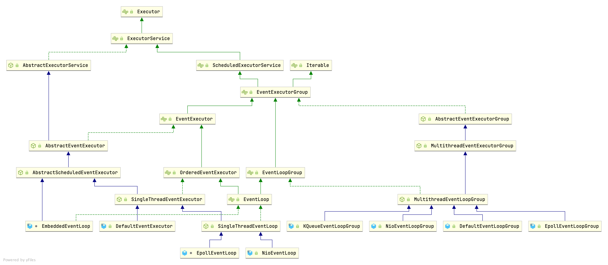

## Introduction

### EventLoop Hierarchy



#### EventExecutorGroup

The EventExecutorGroup is responsible for **providing the EventExecutor's to use via its `next()` method**. 
Besides this, it is also responsible for **handling their life-cycle** and **allows shutting them down in a global fashion**.

```java
public interface EventExecutorGroup extends ScheduledExecutorService, Iterable<EventExecutor> {
  
    //Returns one of the EventExecutors managed by this EventExecutorGroup.
    EventExecutor next();
}
```

Single-thread singleton EventExecutor. 
It starts the thread automatically and stops it when there is no task pending in the task queue for 1 second. 
Please note it is not scalable to schedule large number of tasks to this executor; use a dedicated executor.

```java
public abstract class MultithreadEventExecutorGroup extends AbstractEventExecutorGroup {
    private final Promise<?> terminationFuture = new DefaultPromise(GlobalEventExecutor.INSTANCE);
}

public final class GlobalEventExecutor extends AbstractScheduledEventExecutor implements OrderedEventExecutor {
    private GlobalEventExecutor() {
        scheduledTaskQueue().add(quietPeriodTask);
        threadFactory = ThreadExecutorMap.apply(new DefaultThreadFactory(
                DefaultThreadFactory.toPoolName(getClass()), false, Thread.NORM_PRIORITY, null), this);
    }
}
```


```java
public class DefaultPromise<V> extends AbstractFuture<V> implements Promise<V> {

    public DefaultPromise(EventExecutor executor) {
        this.executor = checkNotNull(executor, "executor");
    }
    
    private void notifyListeners() {
        EventExecutor executor = executor();
        if (executor.inEventLoop()) {
            final InternalThreadLocalMap threadLocals = InternalThreadLocalMap.get();
            final int stackDepth = threadLocals.futureListenerStackDepth();
            if (stackDepth < MAX_LISTENER_STACK_DEPTH) {
                threadLocals.setFutureListenerStackDepth(stackDepth + 1);
                try {
                    notifyListenersNow();
                } finally {
                    threadLocals.setFutureListenerStackDepth(stackDepth);
                }
                return;
            }
        }

        safeExecute(executor, new Runnable() {
            @Override
            public void run() {
                notifyListenersNow();
            }
        });
    }
}
```

#### shutdownGracefully

Signals this executor that the caller wants the executor to be shut down.

Once this method is called, isShuttingDown() starts to return true, and the executor prepares to shut itself down.
Unlike shutdown(), graceful shutdown ensures that no tasks are submitted for 'the quiet period' (usually a couple seconds) before it shuts itself down.
If a task is submitted during the quiet period, it is guaranteed to be accepted and the quiet period will start over.


```java
// SingleThreadEventExecutor
@Override
public Future<?> shutdownGracefully(long quietPeriod, long timeout, TimeUnit unit) {
    ObjectUtil.checkPositiveOrZero(quietPeriod, "quietPeriod");
    if (timeout < quietPeriod) {
        throw new IllegalArgumentException(
                "timeout: " + timeout + " (expected >= quietPeriod (" + quietPeriod + "))");
    }
    ObjectUtil.checkNotNull(unit, "unit");

    if (isShuttingDown()) {
        return terminationFuture();
    }

    boolean inEventLoop = inEventLoop();
    boolean wakeup;
    int oldState;
    for (;;) {
        if (isShuttingDown()) {
            return terminationFuture();
        }
        int newState;
        wakeup = true;
        oldState = state;
        if (inEventLoop) {
            newState = ST_SHUTTING_DOWN;
        } else {
            switch (oldState) {
                case ST_NOT_STARTED:
                case ST_STARTED:
                    newState = ST_SHUTTING_DOWN;
                    break;
                default:
                    newState = oldState;
                    wakeup = false;
            }
        }
        if (STATE_UPDATER.compareAndSet(this, oldState, newState)) {
            break;
        }
    }
    gracefulShutdownQuietPeriod = unit.toNanos(quietPeriod);
    gracefulShutdownTimeout = unit.toNanos(timeout);

    if (ensureThreadStarted(oldState)) {
        return terminationFuture;
    }

    if (wakeup) {
        taskQueue.offer(WAKEUP_TASK);
        if (!addTaskWakesUp) {
            wakeup(inEventLoop);
        }
    }

    return terminationFuture();
}
```

## EventLoopGroup

Special EventExecutorGroup which allows [registering Channels](/docs/CS/Java/Netty/Channel.md?id=register) that get processed for later selection during the event loop.


```java
public interface EventLoopGroup extends EventExecutorGroup {
  
    @Override
    EventLoop next();

    ChannelFuture register(Channel channel);

    //Register a Channel with this EventLoop using a ChannelFuture. 
  	//The passed ChannelFuture will get notified once the registration was complete and also will get returned.
    ChannelFuture register(ChannelPromise promise);
}
```

### Create EventLoopGroup


1. just create NioEventLoop, not start Thread


```java
public NioEventLoopGroup(int nThreads) {
    this(nThreads, (Executor) null);
}

//Create a new instance using the specified number of threads, 
//the given ThreadFactory and the SelectorProvider which is returned by SelectorProvider#provider().
public NioEventLoopGroup(int nThreads, ThreadFactory threadFactory) {
    this(nThreads, threadFactory, SelectorProvider.provider());
}

public NioEventLoopGroup(
        int nThreads, ThreadFactory threadFactory, final SelectorProvider selectorProvider) {
    this(nThreads, threadFactory, selectorProvider, DefaultSelectStrategyFactory.INSTANCE);
}

public NioEventLoopGroup(int nThreads, ThreadFactory threadFactory,
    final SelectorProvider selectorProvider, final SelectStrategyFactory selectStrategyFactory) {
    super(nThreads, threadFactory, selectorProvider, selectStrategyFactory, RejectedExecutionHandlers.reject());
}

public NioEventLoopGroup(int nThreads, Executor executor, EventExecutorChooserFactory chooserFactory,
                         final SelectorProvider selectorProvider,
                         final SelectStrategyFactory selectStrategyFactory,
                         final RejectedExecutionHandler rejectedExecutionHandler,
                         final EventLoopTaskQueueFactory taskQueueFactory) {
    super(nThreads, executor, chooserFactory, selectorProvider, selectStrategyFactory,
            rejectedExecutionHandler, taskQueueFactory);
}
```

ThreadChooser

```java
private final EventExecutor[] children;
private final Set<EventExecutor> readonlyChildren;
private final AtomicInteger terminatedChildren = new AtomicInteger();
private final Promise<?> terminationFuture = new DefaultPromise(GlobalEventExecutor.INSTANCE);
private final EventExecutorChooserFactory.EventExecutorChooser chooser;

private static final int DEFAULT_EVENT_LOOP_THREADS;

    static {
        DEFAULT_EVENT_LOOP_THREADS = Math.max(1, SystemPropertyUtil.getInt(
                "io.netty.eventLoopThreads", NettyRuntime.availableProcessors() * 2));
    }

protected MultithreadEventLoopGroup(int nThreads, Executor executor, EventExecutorChooserFactory chooserFactory, Object... args) {
        super(nThreads == 0 ? DEFAULT_EVENT_LOOP_THREADS : nThreads, executor, chooserFactory, args);
    }

protected MultithreadEventExecutorGroup(int nThreads, Executor executor,
                                        EventExecutorChooserFactory chooserFactory, Object... args) {
  	// ... ignore assert method
  
  	if (executor == null) {
            executor = new ThreadPerTaskExecutor(newDefaultThreadFactory());
        }
  
    children = new EventExecutor[nThreads];

    for (int i = 0; i < nThreads; i ++) {
        boolean success = false;
        try {
            children[i] = newChild(executor, args);
            success = true;
        } catch (Exception e) {
            // TODO: Think about if this is a good exception type
            throw new IllegalStateException("failed to create a child event loop", e);
        } finally {
            if (!success) {
                for (int j = 0; j < i; j ++) {
                    children[j].shutdownGracefully();
                }

                for (int j = 0; j < i; j ++) {
                    EventExecutor e = children[j];
                    try {
                        while (!e.isTerminated()) {
                            e.awaitTermination(Integer.MAX_VALUE, TimeUnit.SECONDS);
                        }
                    } catch (InterruptedException interrupted) {
                        // Let the caller handle the interruption.
                        Thread.currentThread().interrupt();
                        break;
                    }
                }
            }
        }
    }

    chooser = chooserFactory.newChooser(children);

    final FutureListener<Object> terminationListener = new FutureListener<Object>() {
        @Override
        public void operationComplete(Future<Object> future) throws Exception {
            if (terminatedChildren.incrementAndGet() == children.length) {
                terminationFuture.setSuccess(null);
            }
        }
    };

    for (EventExecutor e: children) {
        e.terminationFuture().addListener(terminationListener);
    }
		//finally get readonlyChildrenSet
    Set<EventExecutor> childrenSet = new LinkedHashSet<EventExecutor>(children.length);
    Collections.addAll(childrenSet, children);
    readonlyChildren = Collections.unmodifiableSet(childrenSet);
}
```

### ThreadFactory

create [FastThreadLocalThread](/docs/CS/Java/Netty/FastThreadLocal.md)

```java
	//DefaultThreadFactory#newThread()
    public Thread newThread(Runnable r) {
        Thread t = newThread(FastThreadLocalRunnable.wrap(r), prefix + nextId.incrementAndGet());
        try {
            if (t.isDaemon() != daemon) {
                t.setDaemon(daemon);
            }

            if (t.getPriority() != priority) {
                t.setPriority(priority);
            }
        } catch (Exception ignored) {
            // Doesn't matter even if failed to set.
        }
        return t;
    }

		protected Thread newThread(Runnable r, String name) {
        return new FastThreadLocalThread(threadGroup, r, name);
    }
```


##### newTaskQueue

`PlatformDependent#<Runnable>newMpscQueue()`

```java
private static Queue<Runnable> newTaskQueue(
        EventLoopTaskQueueFactory queueFactory) {
    if (queueFactory == null) {
        return newTaskQueue0(DEFAULT_MAX_PENDING_TASKS);
    }
    return queueFactory.newTaskQueue(DEFAULT_MAX_PENDING_TASKS);
}

private static Queue<Runnable> newTaskQueue0(int maxPendingTasks) {
    // This event loop never calls takeTask()
    return maxPendingTasks == Integer.MAX_VALUE ? PlatformDependent.<Runnable>newMpscQueue()
            : PlatformDependent.<Runnable>newMpscQueue(maxPendingTasks);
}
```


### Chooser

- if isPowerOfTwo default use **PowerOfTwoEventExecutorChooser**  idx.getAndIncrement() & executors.length - 1
- or else GenericEventExecutorChooser Math.abs(idx.getAndIncrement() % executors.length)


## Selector

See [Selector](/docs/CS/Java/JDK/IO/NIO.md?id=Selectors)

### openSelector


```java
final class SelectedSelectionKeySet extends AbstractSet<SelectionKey> {
    SelectionKey[] keys;
    SelectedSelectionKeySet() {
        keys = new SelectionKey[1024];
    }
}
```

Default replace *selectedKeys* and *publicSelectedKeys*(`Set<SelectionKey>`)  with *SelectedSelectionKeySet*(`SelectionKey[]`) into Selector.

```java
// NioEventLoop
private SelectorTuple openSelector() {
    final Selector unwrappedSelector;
    try {
      	//implement by different os, epoll/kqueue
        unwrappedSelector = provider.openSelector();
    } catch (IOException e) {
        throw new ChannelException("failed to open a new selector", e);
    }

    if (DISABLE_KEY_SET_OPTIMIZATION) {
        return new SelectorTuple(unwrappedSelector);
    }
    // ...

    final Class<?> selectorImplClass = (Class<?>) maybeSelectorImplClass;
    final SelectedSelectionKeySet selectedKeySet = new SelectedSelectionKeySet();

    Object maybeException = AccessController.doPrivileged(new PrivilegedAction<Object>() {
        @Override
        public Object run() {
            try {
                Field selectedKeysField = selectorImplClass.getDeclaredField("selectedKeys");
                Field publicSelectedKeysField = selectorImplClass.getDeclaredField("publicSelectedKeys");
                // ...
                selectedKeysField.set(unwrappedSelector, selectedKeySet);
                publicSelectedKeysField.set(unwrappedSelector, selectedKeySet);
                return null;
            } catch (NoSuchFieldException | IllegalAccessException e) {
                return e;
            }
        }
    });
    if (maybeException instanceof Exception) {
        // ...
        return new SelectorTuple(unwrappedSelector);
    }
    
    selectedKeys = selectedKeySet;
    return new SelectorTuple(unwrappedSelector,
                             new SelectedSelectionKeySetSelector(unwrappedSelector, selectedKeySet));
}
```

### rebuildSelector
Replaces the current Selector of this event loop with newly created Selectors to work around the infamous epoll 100% CPU bug.

1. Open a new Selector.
2. Register all channels to the new Selector.
3. Close the old selector as everything else is registered to the new one.

```java
private void rebuildSelector0() {
    final Selector oldSelector = selector;
    final SelectorTuple newSelectorTuple;

    if (oldSelector == null) {
        return;
    }

    try {
        newSelectorTuple = openSelector();
    } catch (Exception e) {
        return;
    }

    int nChannels = 0;
    for (SelectionKey key: oldSelector.keys()) {
        Object a = key.attachment();
        try {
            if (!key.isValid() || key.channel().keyFor(newSelectorTuple.unwrappedSelector) != null) {
                continue;
            }

            int interestOps = key.interestOps();
            key.cancel();
            SelectionKey newKey = key.channel().register(newSelectorTuple.unwrappedSelector, interestOps, a);
            if (a instanceof AbstractNioChannel) {
                // Update SelectionKey
                ((AbstractNioChannel) a).selectionKey = newKey;
            }
            nChannels ++;
        } catch (Exception e) {
            if (a instanceof AbstractNioChannel) {
                AbstractNioChannel ch = (AbstractNioChannel) a;
                ch.unsafe().close(ch.unsafe().voidPromise());
            } else {
                NioTask<SelectableChannel> task = (NioTask<SelectableChannel>) a;
                invokeChannelUnregistered(task, key, e);
            }
        }
    }

    selector = newSelectorTuple.selector;
    unwrappedSelector = newSelectorTuple.unwrappedSelector;

    try {
        // time to close the old selector as everything else is registered to the new one
        oldSelector.close();
    } catch (Throwable t) {
    }
}
```


### wakeup


Fields

```java
private static final int CLEANUP_INTERVAL = 256; // XXX Hard-coded value, but won't need customization.

private static final boolean DISABLE_KEY_SET_OPTIMIZATION =
        SystemPropertyUtil.getBoolean("io.netty.noKeySetOptimization", false);//default false

private static final int MIN_PREMATURE_SELECTOR_RETURNS = 3;

// if SystemPropertyUtil.getInt("io.netty.selectorAutoRebuildThreshold") < 3, default 512
private static final int SELECTOR_AUTO_REBUILD_THRESHOLD;

private final IntSupplier selectNowSupplier = new IntSupplier() {
    @Override
    public int get() throws Exception {
        return selectNow();
    }
};

// Workaround for JDK NIO bug.
//
// See:
// - http://bugs.sun.com/view_bug.do?bug_id=6427854
// - https://github.com/netty/netty/issues/203
static {
    final String key = "sun.nio.ch.bugLevel";
    final String bugLevel = SystemPropertyUtil.get(key);
    // if (bugLevel == null), AccessController.doPrivileged(new PrivilegedAction<Void>()) to run System.setProperty(key, "");

   //init SELECTOR_AUTO_REBUILD_THRESHOLD
}

/**
 * The NIO Selector.
 */
private Selector selector;
private Selector unwrappedSelector;
private SelectedSelectionKeySet selectedKeys;

private final SelectorProvider provider;

/**
 * Boolean that controls determines if a blocked Selector.select should
 * break out of its selection process. In our case we use a timeout for
 * the select method and the select method will block for that time unless
 * waken up.
 */
private final AtomicBoolean wakenUp = new AtomicBoolean();
private volatile long nextWakeupTime = Long.MAX_VALUE;

private final SelectStrategy selectStrategy;

private volatile int ioRatio = 50;
private int cancelledKeys;
private boolean needsToSelectAgain;
```

## execute

startThread when execute first task

```java
// SingleThreadEventExecutor#execute()
@Override
public void execute(Runnable task) {
    ObjectUtil.checkNotNull(task, "task");
    execute(task, !(task instanceof LazyRunnable) && wakesUpForTask(task));
}

private void execute(Runnable task, boolean immediate) {
    boolean inEventLoop = inEventLoop();
    addTask(task);
    if (!inEventLoop) {
        startThread();
        if (isShutdown()) {
            boolean reject = false;
            try {
                if (removeTask(task)) {
                    reject = true;
                }
            } catch (UnsupportedOperationException e) {
                // The task queue does not support removal so the best thing we can do is to just move on and
                // hope we will be able to pick-up the task before its completely terminated.
                // In worst case we will log on termination.
            }
            if (reject) {
                reject();
            }
        }
    }

    if (!addTaskWakesUp && immediate) {
        wakeup(inEventLoop);
    }
}
```

### startThread

`EventLoop.run() in for(;;) `

```java
// SingleThreadEventExecutor#startThread()
private void startThread() {
    if (state == ST_NOT_STARTED) {
        if (STATE_UPDATER.compareAndSet(this, ST_NOT_STARTED, ST_STARTED)) {
            boolean success = false;
            try {
                doStartThread();
                success = true;
            } finally {
                if (!success) {
                    STATE_UPDATER.compareAndSet(this, ST_STARTED, ST_NOT_STARTED);
                }
            }
        }
    }
}

private void doStartThread() {
    assert thread == null;
    executor.execute(new Runnable() {
        @Override
        public void run() {
            thread = Thread.currentThread();
            if (interrupted) {
                thread.interrupt();
            }

            boolean success = false;
            updateLastExecutionTime();
            try {
                SingleThreadEventExecutor.this.run();//invoke EventLoop.run()
                success = true;
            } catch (Throwable t) {
            } finally {
                for (;;) {
                    int oldState = state;
                    if (oldState >= ST_SHUTTING_DOWN || STATE_UPDATER.compareAndSet(
                            SingleThreadEventExecutor.this, oldState, ST_SHUTTING_DOWN)) {
                        break;
                    }
                }

                // Check if confirmShutdown() was called at the end of the loop.
                if (success && gracefulShutdownStartTime == 0) {
                }

                try {
                    // Run all remaining tasks and shutdown hooks.
                    for (;;) {
                        if (confirmShutdown()) {
                            break;
                        }
                    }
                } finally {
                    try {
                        cleanup(); // implement by different EventLoop
                    } finally {
                        // Lets remove all FastThreadLocals for the Thread as we are about to terminate and notify the future.
                        // The user may block on the future and once it unblocks the JVM may terminate
                        // and start unloading classes.
                        // See https://github.com/netty/netty/issues/6596.
                        FastThreadLocal.removeAll();

                        STATE_UPDATER.set(SingleThreadEventExecutor.this, ST_TERMINATED);
                        threadLock.countDown();
                        terminationFuture.setSuccess(null);
                    }
                }
            }
        }
    });
}
```

### run

1. [select](/docs/CS/Java/Netty/EventLoop.md?id=select) get ready Channels, [rebuildSelector](/docs/CS/Java/Netty/EventLoop.md?id=rebuildSelector) if IOException occurs
2. [processSelectedKeys](/docs/CS/Java/Netty/EventLoop.md?id=processSelectedKey)
3. Ensure we always [run tasks](/docs/CS/Java/Netty/EventLoop.md?id=runAllTasks).

'wakenUp.compareAndSet(false, true)' is always evaluated before calling 'selector.wakeup()' to reduce the wake-up overhead. (Selector.wakeup() is an expensive operation.)
However, there is a race condition in this approach.
The race condition is triggered when 'wakenUp' is set to true too early.
'wakenUp' is set to true too early if:
1) Selector is waken up between 'wakenUp.set(false)' and 'selector.select(...)'. (BAD)
2) Selector is waken up between 'selector.select(...)' and 'if (wakenUp.get()) { ... }'. (OK)

In the first case, 'wakenUp' is set to true and the
following 'selector.select(...)' will wake up immediately.
Until 'wakenUp' is set to false again in the next round,
'wakenUp.compareAndSet(false, true)' will fail, and therefore
any attempt to wake up the Selector will fail, too, causing
the following 'selector.select(...)' call to block
unnecessarily.
To fix this problem, we wake up the selector again if wakenUp
is true immediately after selector.select(...).
It is inefficient in that it wakes up the selector for both
the first case (BAD - wake-up required) and the second case
(OK - no wake-up required).

Always handle shutdown even if the loop processing threw an exception.
And [closeAll](/docs/CS/Java/Netty/EventLoop.md?id=closeAll) before shut down

```java
public final class NioEventLoop extends SingleThreadEventLoop {
    @Override
    protected void run() {
        int selectCnt = 0;
        for (;;) {
            try {
                int strategy;
                try {
                    strategy = selectStrategy.calculateStrategy(selectNowSupplier, hasTasks());
                    switch (strategy) {
                        case SelectStrategy.CONTINUE:
                            continue;

                        case SelectStrategy.BUSY_WAIT:
                            // fall-through to SELECT since the busy-wait is not supported with NIO

                        case SelectStrategy.SELECT:
                            long curDeadlineNanos = nextScheduledTaskDeadlineNanos();
                            if (curDeadlineNanos == -1L) {
                                curDeadlineNanos = NONE; // nothing on the calendar
                            }
                            nextWakeupNanos.set(curDeadlineNanos);
                            try {
                                if (!hasTasks()) {
                                    strategy = select(curDeadlineNanos);
                                }
                            } finally {
                                // This update is just to help block unnecessary selector wakeups
                                // so use of lazySet is ok (no race condition)
                                nextWakeupNanos.lazySet(AWAKE);
                            }
                            // fall through
                        default:
                    }
                } catch (IOException e) {
                    rebuildSelector0();
                    selectCnt = 0;
                    handleLoopException(e);
                    continue;
                }

                selectCnt++;
                cancelledKeys = 0;
                needsToSelectAgain = false;
                final int ioRatio = this.ioRatio;
                boolean ranTasks;
                if (ioRatio == 100) {
                    try {
                        if (strategy > 0) {
                            processSelectedKeys();
                        }
                    } finally {
                        ranTasks = runAllTasks();
                    }
                } else if (strategy > 0) {
                    final long ioStartTime = System.nanoTime();
                    try {
                        processSelectedKeys();
                    } finally {
                        final long ioTime = System.nanoTime() - ioStartTime;
                        ranTasks = runAllTasks(ioTime * (100 - ioRatio) / ioRatio);
                    }
                } else {
                    ranTasks = runAllTasks(0); // This will run the minimum number of tasks
                }

                if (ranTasks || strategy > 0) {
                    if (selectCnt > MIN_PREMATURE_SELECTOR_RETURNS && logger.isDebugEnabled()) {
                        logger.debug("Selector.select() returned prematurely {} times in a row for Selector {}.",
                                selectCnt - 1, selector);
                    }
                    selectCnt = 0;
                } else if (unexpectedSelectorWakeup(selectCnt)) { // Unexpected wakeup (unusual case)
                    selectCnt = 0;
                }
            } catch (Throwable t) {
                handleLoopException(t);
            } finally {
                try {
                    if (isShuttingDown()) {
                        closeAll();
                        if (confirmShutdown()) {
                            return;
                        }
                    }
                } catch (Throwable t) {
                    handleLoopException(t);
                }
            }
        }
    }
}
```

SelectedSelectionKeySet

```java
final class SelectedSelectionKeySet extends AbstractSet<SelectionKey> {
    SelectionKey[] keys;
    SelectedSelectionKeySet() {
        keys = new SelectionKey[1024];
    }
}
```

### select

- timeout
  - already select() done, break
  - else do selectNow() then break
- task queue notEmpty & wakeUp == false, selectNow()
- select() util
  - timeout
  - has ready keys
  - wakeUp by other thread
  - 512 rebuildSelector

SELECT if the next step should be blocking select 
CONTINUE if the next step should be to not select but rather jump back to the IO loop and try again. 
Any value >= 0 is treated as an indicator that work needs to be done.

If a task was submitted when wakenUp value was true, the task didn't get a chance to call
Selector#wakeup. So we need to check task queue again before executing select operation.
If we don't, the task might be pended until select operation was timed out.
It might be pended until idle timeout if IdleStateHandler existed in pipeline.
```java
private void select(boolean oldWakenUp) throws IOException {
    Selector selector = this.selector;
    try {
        int selectCnt = 0;
        long currentTimeNanos = System.nanoTime();
        long selectDeadLineNanos = currentTimeNanos + delayNanos(currentTimeNanos);

        for (;;) {
            long timeoutMillis = (selectDeadLineNanos - currentTimeNanos + 500000L) / 1000000L;
            if (timeoutMillis <= 0) {
                if (selectCnt == 0) {
                    selector.selectNow();
                    selectCnt = 1;
                }
                break;
            }

//        If a task was submitted when wakenUp value was true, the task didn't get a chance to call
//        Selector#wakeup. So we need to check task queue again before executing select operation.
//        If we don't, the task might be pended until select operation was timed out.
//        It might be pended until idle timeout if IdleStateHandler existed in pipeline.
        if (hasTasks() && wakenUp.compareAndSet(false, true)) {
                selector.selectNow();
                selectCnt = 1;
                break;
            }

            int selectedKeys = selector.select(timeoutMillis);
            selectCnt ++;

            if (selectedKeys != 0 || oldWakenUp || wakenUp.get() || hasTasks() || hasScheduledTasks()) {
                // - Selected something,
                // - waken up by user, or
                // - the task queue has a pending task.
                // - a scheduled task is ready for processing
                break;
            }
            if (Thread.interrupted()) {
                // Thread was interrupted so reset selected keys and break so we not run into a busy loop.
                // As this is most likely a bug in the handler of the user or it's client library we will
                // also log it.
                //
                // See https://github.com/netty/netty/issues/2426
                selectCnt = 1;
                break;
            }

            long time = System.nanoTime();
            if (time - TimeUnit.MILLISECONDS.toNanos(timeoutMillis) >= currentTimeNanos) {
                // timeoutMillis elapsed without anything selected.
                selectCnt = 1;
            } else if (SELECTOR_AUTO_REBUILD_THRESHOLD > 0 &&
                    selectCnt >= SELECTOR_AUTO_REBUILD_THRESHOLD) {
                // The code exists in an extra method to ensure the method is not too big to inline as this
                // branch is not very likely to get hit very frequently.
                selector = selectRebuildSelector(selectCnt);
                selectCnt = 1;
                break;
            }

            currentTimeNanos = time;
        }
    } catch (CancelledKeyException e) {
        // Harmless exception - log anyway
    }
}
```

### processSelectedKey

call [Channel#finishConnect()](/docs/CS/Java/Netty/Channel.md?id=finishConnect)

```java
private void processSelectedKeys() {
    if (selectedKeys != null) {
        processSelectedKeysOptimized();
    } else {
        processSelectedKeysPlain(selector.selectedKeys());
    }
}

private void processSelectedKeysOptimized() {
    for (int i = 0; i < selectedKeys.size; ++i) {
        final SelectionKey k = selectedKeys.keys[i];
        // null out entry in the array to allow to have it GC'ed once the Channel close
        // See https://github.com/netty/netty/issues/2363
        selectedKeys.keys[i] = null;

        final Object a = k.attachment();

        if (a instanceof AbstractNioChannel) {
            processSelectedKey(k, (AbstractNioChannel) a);
        } else {
            @SuppressWarnings("unchecked")
            NioTask<SelectableChannel> task = (NioTask<SelectableChannel>) a;
            processSelectedKey(k, task);
        }

        if (needsToSelectAgain) {
            // null out entries in the array to allow to have it GC'ed once the Channel close
            // See https://github.com/netty/netty/issues/2363
            selectedKeys.reset(i + 1);

            selectAgain();
            i = -1;
        }
    }
}
```

In a serial loop, so it's not for upload file
1. OP_CONNECT
2. OP_WRITE
3. read

```java
private void processSelectedKey(SelectionKey k, AbstractNioChannel ch) {
    final AbstractNioChannel.NioUnsafe unsafe = ch.unsafe();
    if (!k.isValid()) {
        final EventLoop eventLoop;
        try {
            eventLoop = ch.eventLoop();
        } catch (Throwable ignored) {
            // If the channel implementation throws an exception because there is no event loop, we ignore this
            // because we are only trying to determine if ch is registered to this event loop and thus has authority
            // to close ch.
            return;
        }
        // Only close ch if ch is still registered to this EventLoop. ch could have deregistered from the event loop
        // and thus the SelectionKey could be cancelled as part of the deregistration process, but the channel is
        // still healthy and should not be closed.
        // See https://github.com/netty/netty/issues/5125
        if (eventLoop != this || eventLoop == null) {
            return;
        }
        // close the channel if the key is not valid anymore
        unsafe.close(unsafe.voidPromise());
        return;
    }

    try {
        int readyOps = k.readyOps();
        // We first need to call finishConnect() before try to trigger a read(...) or write(...) as otherwise
        // the NIO JDK channel implementation may throw a NotYetConnectedException.
        if ((readyOps & SelectionKey.OP_CONNECT) != 0) {
            // remove OP_CONNECT as otherwise Selector.select(..) will always return without blocking
            // See https://github.com/netty/netty/issues/924
            int ops = k.interestOps();
            ops &= ~SelectionKey.OP_CONNECT;
            k.interestOps(ops);

            unsafe.finishConnect();
        }

        // Process OP_WRITE first as we may be able to write some queued buffers and so free memory.
        if ((readyOps & SelectionKey.OP_WRITE) != 0) {
            // Call forceFlush which will also take care of clear the OP_WRITE once there is nothing left to write
            ch.unsafe().forceFlush();
        }

        // Also check for readOps of 0 to workaround possible JDK bug which may otherwise lead
        // to a spin loop
        if ((readyOps & (SelectionKey.OP_READ | SelectionKey.OP_ACCEPT)) != 0 || readyOps == 0) {
            unsafe.read();
        }
    } catch (CancelledKeyException ignored) {
        unsafe.close(unsafe.voidPromise());
    }
}
```

#### read

get [ByteBufAllocator]()

Multiple fireChannelRead and 1 fireChannelReadComplete

```java
// AbstractNioByteChannel.NioByteUnsafe#read
protected class NioByteUnsafe extends AbstractNioUnsafe {
    public final void read() {
        final ChannelConfig config = config();
        if (shouldBreakReadReady(config)) {
            clearReadPending();
            return;
        }
        final ChannelPipeline pipeline = pipeline();
        final ByteBufAllocator allocator = config.getAllocator();
        final RecvByteBufAllocator.Handle allocHandle = recvBufAllocHandle();
        allocHandle.reset(config);

        ByteBuf byteBuf = null;
        boolean close = false;
        try {
            do {
                byteBuf = allocHandle.allocate(allocator);
                allocHandle.lastBytesRead(doReadBytes(byteBuf));
                if (allocHandle.lastBytesRead() <= 0) {
                    // nothing was read. release the buffer.
                    byteBuf.release();
                    byteBuf = null;
                    close = allocHandle.lastBytesRead() < 0;
                    if (close) {
                        // There is nothing left to read as we received an EOF.
                        readPending = false;
                    }
                    break;
                }

                allocHandle.incMessagesRead(1);
                readPending = false;
                // fireChannelRead()
                pipeline.fireChannelRead(byteBuf);
                byteBuf = null;
            } while (allocHandle.continueReading());

            allocHandle.readComplete();
            pipeline.fireChannelReadComplete();

            if (close) {
                closeOnRead(pipeline);
            }
        } catch (Throwable t) {
            handleReadException(pipeline, byteBuf, t, close, allocHandle);
        } finally {
            // Check if there is a readPending which was not processed yet.
            // This could be for two reasons:
            // * The user called Channel.read() or ChannelHandlerContext.read() in channelRead(...) method
            // * The user called Channel.read() or ChannelHandlerContext.read() in channelReadComplete(...) method
            //
            // See https://github.com/netty/netty/issues/2254
            if (!readPending && !config.isAutoRead()) {
                removeReadOp();
            }
        }
    }

}
```

max 16

```java
public abstract class MaxMessageHandle implements ExtendedHandle {
    @Override
    public boolean continueReading() {
        return continueReading(defaultMaybeMoreSupplier);
    }

    @Override
    public boolean continueReading(UncheckedBooleanSupplier maybeMoreDataSupplier) {
        return config.isAutoRead() &&
                (!respectMaybeMoreData || maybeMoreDataSupplier.get()) &&
                totalMessages < maxMessagePerRead &&
                totalBytesRead > 0;
    }
}
```

#### RecvByteBufAllocator

Allocates a new receive buffer whose capacity is probably large enough to read all inbound data and small enough not to waste its space.

The RecvByteBufAllocator that automatically increases and decreases the predicted buffer size on feed back.

- It gradually increases the expected number of readable bytes if the previous read fully filled the allocated buffer.
- It gradually decreases the expected number of readable bytes if the read operation was not able to fill a certain amount of the allocated buffer **two times consecutively**.
- Otherwise, it keeps returning the same prediction.

```java
// AdaptiveRecvByteBufAllocator
private final class HandleImpl extends MaxMessageHandle {
    private void record(int actualReadBytes) {
        if (actualReadBytes <= SIZE_TABLE[max(0, index - INDEX_DECREMENT)]) {
            if (decreaseNow) {
                index = max(index - INDEX_DECREMENT, minIndex);
                nextReceiveBufferSize = SIZE_TABLE[index];
                decreaseNow = false;
            } else {
                decreaseNow = true;
            }
        } else if (actualReadBytes >= nextReceiveBufferSize) {
            index = min(index + INDEX_INCREMENT, maxIndex);
            nextReceiveBufferSize = SIZE_TABLE[index];
            decreaseNow = false;
        }
    }
}
```


### runAllTasks
Poll all tasks from the task queue and run them via `Runnable#run()` method.
This method stops running the tasks in the task queue and returns if it ran longer than timeoutNanos.

Check timeout every 64 tasks because nanoTime() is relatively expensive.
```java
    protected boolean runAllTasks(long timeoutNanos) {
        fetchFromScheduledTaskQueue();
        Runnable task = pollTask();
        if (task == null) {
            afterRunningAllTasks();
            return false;
        }

        final long deadline = timeoutNanos > 0 ? ScheduledFutureTask.nanoTime() + timeoutNanos : 0;
        long runTasks = 0;
        long lastExecutionTime;
        for (; ; ) {
            safeExecute(task);

            runTasks++;
            
            if ((runTasks & 0x3F) == 0) {
                lastExecutionTime = ScheduledFutureTask.nanoTime();
                if (lastExecutionTime >= deadline) {
                    break;
                }
            }

            task = pollTask();
            if (task == null) {
                lastExecutionTime = ScheduledFutureTask.nanoTime();
                break;
            }
        }

        afterRunningAllTasks();
        this.lastExecutionTime = lastExecutionTime;
        return true;
    }
```

```java
protected final boolean runAllTasksFrom(Queue<Runnable> taskQueue) {
        Runnable task = pollTaskFrom(taskQueue);
        if (task == null) {
            return false;
        }
        for (;;) {
            safeExecute(task);
            task = pollTaskFrom(taskQueue);
            if (task == null) {
                return true;
            }
        }
    }
```

### closeAll

```java
private void closeAll() {
    selectAgain();
    Set<SelectionKey> keys = selector.keys();
    Collection<AbstractNioChannel> channels = new ArrayList<AbstractNioChannel>(keys.size());
    for (SelectionKey k: keys) {
        Object a = k.attachment();
        if (a instanceof AbstractNioChannel) {
            channels.add((AbstractNioChannel) a);
        } else {
            k.cancel();
            @SuppressWarnings("unchecked")
            NioTask<SelectableChannel> task = (NioTask<SelectableChannel>) a;
            invokeChannelUnregistered(task, k, null);
        }
    }

    for (AbstractNioChannel ch: channels) {
        ch.unsafe().close(ch.unsafe().voidPromise());
    }
}
```

unsafe.close( ) in [Channel](/docs/CS/Java/Netty/Channel.md )

## Implementation

### Epoll
> [!NOTE]
> 
> See [epoll_ctl](/docs/CS/OS/Linux/epoll.md?id=epoll_ctl)

```java
class EpollEventLoop extends SingleThreadEventLoop {

    @Override
    protected void doRegister() throws Exception {
        // Just in case the previous EventLoop was shutdown abruptly, or an event is still pending on the old EventLoop
        // make sure the epollInReadyRunnablePending variable is reset so we will be able to execute the Runnable on the
        // new EventLoop.
        epollInReadyRunnablePending = false;
        ((EpollEventLoop) eventLoop()).add(this);
    }
    
    void add(AbstractEpollChannel ch) throws IOException {
        assert inEventLoop();
        int fd = ch.socket.intValue();
        Native.epollCtlAdd(epollFd.intValue(), fd, ch.flags);
        AbstractEpollChannel old = channels.put(fd, ch);

        // We either expect to have no Channel in the map with the same FD or that the FD of the old Channel is already
        // closed.
        assert old == null || !old.isOpen();
    }
}
```


> [!NOTE]
>
> See [epoll_wait](/docs/CS/OS/Linux/epoll.md?id=epoll_wait)

```java
class EpollEventLoop extends SingleThreadEventLoop {

    @Override
    protected void run() {
        long prevDeadlineNanos = NONE;
        for (; ; ) {
            try {
                int strategy = selectStrategy.calculateStrategy(selectNowSupplier, hasTasks());
                switch (strategy) {
                    // ...
                    case SelectStrategy.SELECT:
                        if (pendingWakeup) {
                            // We are going to be immediately woken so no need to reset wakenUp
                            // or check for timerfd adjustment.
                            strategy = epollWaitTimeboxed();
                            if (strategy != 0) {
                                break;
                            }
                            // We timed out so assume that we missed the write event due to an
                            // abnormally failed syscall (the write itself or a prior epoll_wait)
                            logger.warn("Missed eventfd write (not seen after > 1 second)");
                            pendingWakeup = false;
                            if (hasTasks()) {
                                break;
                            }
                            // fall-through
                        }

                        long curDeadlineNanos = nextScheduledTaskDeadlineNanos();
                        if (curDeadlineNanos == -1L) {
                            curDeadlineNanos = NONE; // nothing on the calendar
                        }
                        nextWakeupNanos.set(curDeadlineNanos);
                        try {
                            if (!hasTasks()) {
                                if (curDeadlineNanos == prevDeadlineNanos) {
                                    // No timer activity needed
                                    strategy = epollWaitNoTimerChange();
                                } else {
                                    // Timerfd needs to be re-armed or disarmed
                                    prevDeadlineNanos = curDeadlineNanos;
                                    strategy = epollWait(curDeadlineNanos);
                                }
                            }
                        } finally {
                            // Try get() first to avoid much more expensive CAS in the case we
                            // were woken via the wakeup() method (submitted task)
                            if (nextWakeupNanos.get() == AWAKE || nextWakeupNanos.getAndSet(AWAKE) == AWAKE) {
                                pendingWakeup = true;
                            }
                        }
                        // fallthrough
                    default:
                }

                final int ioRatio = this.ioRatio;
                if (ioRatio == 100) {
                    try {
                        if (strategy > 0 && processReady(events, strategy)) {
                            prevDeadlineNanos = NONE;
                        }
                    } finally {
                        // Ensure we always run tasks.
                        runAllTasks();
                    }
                } else if (strategy > 0) {
                    final long ioStartTime = System.nanoTime();
                    try {
                        if (processReady(events, strategy)) {
                            prevDeadlineNanos = NONE;
                        }
                    } finally {
                        // Ensure we always run tasks.
                        final long ioTime = System.nanoTime() - ioStartTime;
                        runAllTasks(ioTime * (100 - ioRatio) / ioRatio);
                    }
                } else {
                    runAllTasks(0); // This will run the minimum number of tasks
                }
                if (allowGrowing && strategy == events.length()) {
                    //increase the size of the array as we needed the whole space for the events
                    events.increase();
                }
            } catch (Error e) {
                throw e;
            } catch (Throwable t) {
                handleLoopException(t);
            } finally {
                // Always handle shutdown even if the loop processing threw an exception.
                try {
                    if (isShuttingDown()) {
                        closeAll();
                        if (confirmShutdown()) {
                            break;
                        }
                    }
                } catch (Error e) {
                    throw e;
                } catch (Throwable t) {
                    handleLoopException(t);
                }
            }
        }
    }
}
```

### Kqueue

```java
final class KQueueEventLoop extends SingleThreadEventLoop {

    @Override
    protected void doRegister() throws Exception {
        // Just in case the previous EventLoop was shutdown abruptly, or an event is still pending on the old EventLoop
        // make sure the readReadyRunnablePending variable is reset so we will be able to execute the Runnable on the
        // new EventLoop.
        readReadyRunnablePending = false;

        ((KQueueEventLoop) eventLoop()).add(this);

        // Add the write event first so we get notified of connection refused on the client side!
        if (writeFilterEnabled) {
            evSet0(Native.EVFILT_WRITE, Native.EV_ADD_CLEAR_ENABLE);
        }
        if (readFilterEnabled) {
            evSet0(Native.EVFILT_READ, Native.EV_ADD_CLEAR_ENABLE);
        }
        evSet0(Native.EVFILT_SOCK, Native.EV_ADD, Native.NOTE_RDHUP);
    }
}
```

## Thread Affinity

Create an [AffinityThreadFactory](https://github.com/OpenHFT/Java-Thread-Affinity) with a particular strategy and pass it to the EventLoopGroup which would contain latency-sensitive threads.


## Links

- [Netty](/docs/CS/Java/Netty/Netty.md)