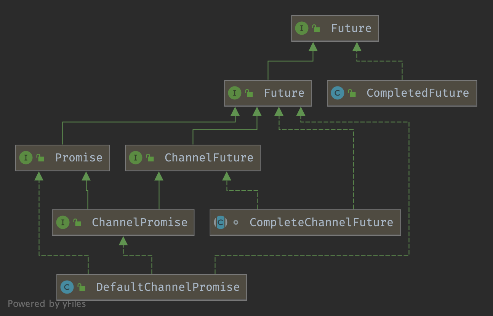

## 

### Future Hierarchy




### Future

```java
/**
 * The result of an asynchronous operation.
 */
@SuppressWarnings("ClassNameSameAsAncestorName")
public interface Future<V> extends java.util.concurrent.Future<V> {

    //Returns {@code true} if and only if the I/O operation was completed successfully.
    boolean isSuccess();

    //returns {@code true} if and only if the operation can be cancelled via {@link #cancel(boolean)}.
    boolean isCancellable();

    //Returns the cause of the failed I/O operation if the I/O operation has failed.
    Throwable cause();

    /**
     * Adds the specified listener to this future.  The
     * specified listener is notified when this future is
     * {@linkplain #isDone() done}.  If this future is already
     * completed, the specified listener is notified immediately.
     */
    Future<V> addListener(GenericFutureListener<? extends Future<? super V>> listener);

    /**
     * Adds the specified listeners to this future.  The
     * specified listeners are notified when this future is
     * {@linkplain #isDone() done}.  If this future is already
     * completed, the specified listeners are notified immediately.
     */
    Future<V> addListeners(GenericFutureListener<? extends Future<? super V>>... listeners);

    /**
     * Removes the first occurrence of the specified listener from this future.
     * The specified listener is no longer notified when this
     * future is {@linkplain #isDone() done}.  If the specified
     * listener is not associated with this future, this method
     * does nothing and returns silently.
     */
    Future<V> removeListener(GenericFutureListener<? extends Future<? super V>> listener);

    /**
     * Removes the first occurrence for each of the listeners from this future.
     * The specified listeners are no longer notified when this
     * future is {@linkplain #isDone() done}.  If the specified
     * listeners are not associated with this future, this method
     * does nothing and returns silently.
     */
    Future<V> removeListeners(GenericFutureListener<? extends Future<? super V>>... listeners);

    /**
     * Waits for this future until it is done, and rethrows the cause of the failure if this future
     * failed.
     */
    Future<V> sync() throws InterruptedException;

    //Waits for this future until it is done, and rethrows the cause of the failure if this future failed.
    Future<V> syncUninterruptibly();

    //Waits for this future to be completed.
    Future<V> await() throws InterruptedException;

    /**
     * Waits for this future to be completed without
     * interruption.  This method catches an {@link InterruptedException} and
     * discards it silently.
     */
    Future<V> awaitUninterruptibly();

    //Waits for this future to be completed within the specified time limit.
    boolean await(long timeout, TimeUnit unit) throws InterruptedException;

    //Waits for this future to be completed within the specified time limit.
    boolean await(long timeoutMillis) throws InterruptedException;

    /**
     * Waits for this future to be completed within the
     * specified time limit without interruption.  This method catches an
     * {@link InterruptedException} and discards it silently.
     *
     * @return {@code true} if and only if the future was completed within
     *         the specified time limit
     */
    boolean awaitUninterruptibly(long timeout, TimeUnit unit);

    /**
     * Waits for this future to be completed within the
     * specified time limit without interruption.  This method catches an
     * {@link InterruptedException} and discards it silently.
     *
     * @return {@code true} if and only if the future was completed within
     *         the specified time limit
     */
    boolean awaitUninterruptibly(long timeoutMillis);

    /**
     * Return the result without blocking. If the future is not done yet this will return {@code null}.
     *
     * As it is possible that a {@code null} value is used to mark the future as successful you also need to check
     * if the future is really done with {@link #isDone()} and not rely on the returned {@code null} value.
     */
    V getNow();

    /**
     * {@inheritDoc}
     *
     * If the cancellation was successful it will fail the future with a {@link CancellationException}.
     */
    @Override
    boolean cancel(boolean mayInterruptIfRunning);
}
```


### ChannelFuture


```java
/**
*                                      +---------------------------+
*                                      | Completed successfully    |
*                                      +---------------------------+
*                                 +---->      isDone() = true      |
* +--------------------------+    |    |   isSuccess() = true      |
* |        Uncompleted       |    |    +===========================+
* +--------------------------+    |    | Completed with failure    |
* |      isDone() = false    |    |    +---------------------------+
* |   isSuccess() = false    |----+---->      isDone() = true      |
* | isCancelled() = false    |    |    |       cause() = non-null  |
* |       cause() = null     |    |    +===========================+
* +--------------------------+    |    | Completed by cancellation |
*                                 |    +---------------------------+
*                                 +---->      isDone() = true      |
*                                      | isCancelled() = true      |
*                                      +---------------------------+
*/
```


### Promise

**Special Future which is writable.**

```java
public interface Promise<V> extends Future<V> {

    //Marks this future as a success and notifies all listeners.
    Promise<V> setSuccess(V result);

    //Marks this future as a success and notifies all listeners.
    boolean trySuccess(V result);

    //Marks this future as a failure and notifies all listeners.
    Promise<V> setFailure(Throwable cause);

    //Marks this future as a failure and notifies all listeners.
    boolean tryFailure(Throwable cause);

    //Make this future impossible to cancel.
    boolean setUncancellable();

    @Override
    Promise<V> addListener(GenericFutureListener<? extends Future<? super V>> listener);

    @Override
    Promise<V> addListeners(GenericFutureListener<? extends Future<? super V>>... listeners);

    @Override
    Promise<V> removeListener(GenericFutureListener<? extends Future<? super V>> listener);

    @Override
    Promise<V> removeListeners(GenericFutureListener<? extends Future<? super V>>... listeners);

    @Override
    Promise<V> await() throws InterruptedException;

    @Override
    Promise<V> awaitUninterruptibly();

    @Override
    Promise<V> sync() throws InterruptedException;

    @Override
    Promise<V> syncUninterruptibly();
}
```


### ChannelPromise

**Special ChannelFuture which is writable.**

Use in [Bootstrap-bind-register](/docs/CS/Java/Netty/Bootstrap.md?id=register)

```java
public interface ChannelPromise extends ChannelFuture, Promise<Void> {
    ChannelPromise setSuccess();

    boolean trySuccess();

    //Returns a new ChannelPromise if isVoid() returns true otherwise itself.
    ChannelPromise unvoid();
  
  	...
}
```


### AbstractFuture

AbstractFuture provide two  get methods

```java
public abstract class AbstractFuture<V> implements Future<V> {

    @Override
    public V get() throws InterruptedException, ExecutionException {
        await();

        Throwable cause = cause();
        if (cause == null) {
            return getNow();
        }
        if (cause instanceof CancellationException) {
            throw (CancellationException) cause;
        }
        throw new ExecutionException(cause);
    }

    @Override
    public V get(long timeout, TimeUnit unit) throws InterruptedException, ExecutionException, TimeoutException {
        if (await(timeout, unit)) {
            Throwable cause = cause();
            if (cause == null) {
                return getNow();
            }
            if (cause instanceof CancellationException) {
                throw (CancellationException) cause;
            }
            throw new ExecutionException(cause);
        }
        throw new TimeoutException();
    }
}
```

### DefaultPromise


DefaultPromise#await()

```java
@Override
public Promise<V> await() throws InterruptedException {
    if (isDone()) {
        return this;
    }

    if (Thread.interrupted()) {
        throw new InterruptedException(toString());
    }

    checkDeadLock();

    synchronized (this) {
        while (!isDone()) {
            incWaiters();
            try {
                wait();
            } finally {
                decWaiters();
            }
        }
    }
    return this;
}
```


```java
protected void checkDeadLock() {
    EventExecutor e = executor();
    if (e != null && e.inEventLoop()) {
        throw new BlockingOperationException(toString());
    }
}
```


DefaultPromise#addListener

```java
@Override
public Promise<V> addListener(GenericFutureListener<? extends Future<? super V>> listener) {
    checkNotNull(listener, "listener");

    synchronized (this) {
        addListener0(listener);
    }

    if (isDone()) {
        notifyListeners();
    }

    return this;
}

private void addListener0(GenericFutureListener<? extends Future<? super V>> listener) {
    if (listeners == null) {
        listeners = listener;
    } else if (listeners instanceof DefaultFutureListeners) {
        ((DefaultFutureListeners) listeners).add(listener);
    } else {
        listeners = new DefaultFutureListeners((GenericFutureListener<?>) listeners, listener);
    }
}

private void notifyListeners() {
    EventExecutor executor = executor();
    if (executor.inEventLoop()) {
        final InternalThreadLocalMap threadLocals = InternalThreadLocalMap.get();
        final int stackDepth = threadLocals.futureListenerStackDepth();
        if (stackDepth < MAX_LISTENER_STACK_DEPTH) {
            threadLocals.setFutureListenerStackDepth(stackDepth + 1);
            try {
                notifyListenersNow();
            } finally {
                threadLocals.setFutureListenerStackDepth(stackDepth);
            }
            return;
        }
    }

    safeExecute(executor, new Runnable() {
        @Override
        public void run() {
            notifyListenersNow();
        }
    });
}
```


### DefaultChannelPromise

The default ChannelPromise implementation. It is recommended to use `Channel.newPromise()` to create a new ChannelPromise rather than calling the constructor explicitly.

```java
public class DefaultChannelPromise extends DefaultPromise<Void> implements ChannelPromise, FlushCheckpoint {

    private final Channel channel;
    private long checkpoint;
 ... 
}
```

## References
1. [method io.netty.util.concurrent.DefaultPromise#cancel/isDone violates contract?](https://github.com/netty/netty/issues/7712)