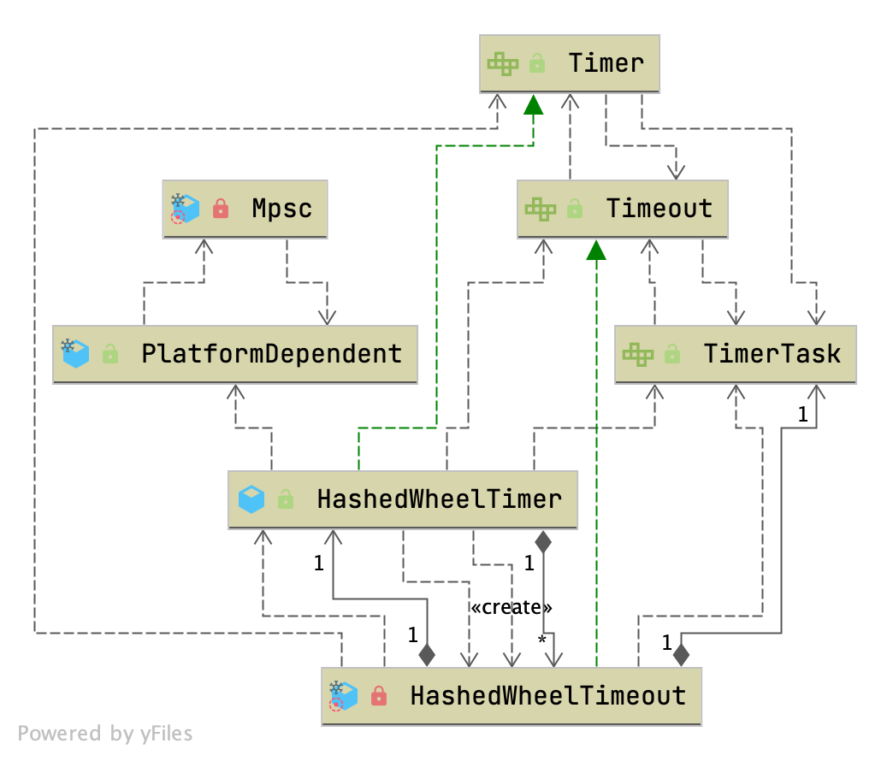

## Introduction



- A [`Timer`](https://netty.io/4.1/api/io/netty/util/Timer.html) optimized for approximated I/O timeout scheduling.

  ### Tick Duration

  As described with 'approximated', this timer does not execute the scheduled [`TimerTask`](https://netty.io/4.1/api/io/netty/util/TimerTask.html) on time. [`HashedWheelTimer`](https://netty.io/4.1/api/io/netty/util/HashedWheelTimer.html), on every tick, will check if there are any [`TimerTask`](https://netty.io/4.1/api/io/netty/util/TimerTask.html)s behind the schedule and execute them.

  You can increase or decrease the accuracy of the execution timing by specifying smaller or larger tick duration in the constructor. In most network applications, I/O timeout does not need to be accurate. Therefore, the default tick duration is 100 milliseconds and you will not need to try different configurations in most cases.

  ### Ticks per Wheel (Wheel Size)

  [`HashedWheelTimer`](https://netty.io/4.1/api/io/netty/util/HashedWheelTimer.html) maintains a data structure called 'wheel'. To put simply, a wheel is a hash table of [`TimerTask`](https://netty.io/4.1/api/io/netty/util/TimerTask.html)s whose hash function is 'dead line of the task'. The default number of ticks per wheel (i.e. the size of the wheel) is 512. You could specify a larger value if you are going to schedule a lot of timeouts.

  ### Do not create many instances.

  [`HashedWheelTimer`](https://netty.io/4.1/api/io/netty/util/HashedWheelTimer.html) creates a new thread whenever it is instantiated and started. Therefore, you should make sure to create only one instance and share it across your application. One of the common mistakes, that makes your application unresponsive, is to create a new instance for every connection.

  ### Implementation Details

  [`HashedWheelTimer`](https://netty.io/4.1/api/io/netty/util/HashedWheelTimer.html) is based on [George Varghese](https://cseweb.ucsd.edu/users/varghese/) and Tony Lauck's paper, ['Hashed and Hierarchical Timing Wheels: data structures to efficiently implement a timer facility'](https://cseweb.ucsd.edu/users/varghese/PAPERS/twheel.ps.Z). More comprehensive slides are located [here](https://www.cse.wustl.edu/~cdgill/courses/cs6874/TimingWheels.ppt).


### Timer

```java
/**
 * Schedules {@link TimerTask}s for one-time future execution in a background
 * thread.
 */
public interface Timer {

    /**
     * Schedules the specified {@link TimerTask} for one-time execution after
     * the specified delay.
     */
    Timeout newTimeout(TimerTask task, long delay, TimeUnit unit);

    /**
     * Releases all resources acquired by this {@link Timer} and cancels all
     * tasks which were scheduled but not executed yet.
     */
    Set<Timeout> stop();
}

/**
 * A task which is executed after the delay specified with
 * {@link Timer#newTimeout(TimerTask, long, TimeUnit)}.
 */
public interface TimerTask {

    /**
     * Executed after the delay specified with
     * {@link Timer#newTimeout(TimerTask, long, TimeUnit)}.
     */
    void run(Timeout timeout) throws Exception;
}
```


```java
public class HashedWheelTimer implements Timer {

    private static final AtomicInteger INSTANCE_COUNTER = new AtomicInteger();
    private static final AtomicBoolean WARNED_TOO_MANY_INSTANCES = new AtomicBoolean();
    private static final int INSTANCE_COUNT_LIMIT = 64;
    private static final long MILLISECOND_NANOS = TimeUnit.MILLISECONDS.toNanos(1);
    private static final ResourceLeakDetector<HashedWheelTimer> leakDetector = ResourceLeakDetectorFactory.instance()
            .newResourceLeakDetector(HashedWheelTimer.class, 1);

    private static final AtomicIntegerFieldUpdater<HashedWheelTimer> WORKER_STATE_UPDATER =
            AtomicIntegerFieldUpdater.newUpdater(HashedWheelTimer.class, "workerState");

    private final ResourceLeakTracker<HashedWheelTimer> leak;
    private final Worker worker = new Worker();
    private final Thread workerThread;

    public static final int WORKER_STATE_INIT = 0;
    public static final int WORKER_STATE_STARTED = 1;
    public static final int WORKER_STATE_SHUTDOWN = 2;
  
    @SuppressWarnings({ "unused", "FieldMayBeFinal" })
    private volatile int workerState; // 0 - init, 1 - started, 2 - shut down

    private final long tickDuration;
    private final HashedWheelBucket[] wheel; // default length 512
    private final int mask;
    private final CountDownLatch startTimeInitialized = new CountDownLatch(1);
    private final Queue<HashedWheelTimeout> timeouts = PlatformDependent.newMpscQueue();
    private final Queue<HashedWheelTimeout> cancelledTimeouts = PlatformDependent.newMpscQueue();
    private final AtomicLong pendingTimeouts = new AtomicLong(0);
    private final long maxPendingTimeouts;

    private volatile long startTime;
  
  
     @Override
    protected void finalize() throws Throwable {
        try {
            super.finalize();
        } finally {
            // This object is going to be GCed and it is assumed the ship has sailed to do a proper shutdown. If
            // we have not yet shutdown then we want to make sure we decrement the active instance count.
            if (WORKER_STATE_UPDATER.getAndSet(this, WORKER_STATE_SHUTDOWN) != WORKER_STATE_SHUTDOWN) {
                INSTANCE_COUNTER.decrementAndGet();
            }
        }
    }
  
...
}
```
### Contructor


```java
		// tickDuration 100; ticksPerWheel 512; leakDetection true; maxPendingTimeouts -1
    // Creates a new timer.
    public HashedWheelTimer(
            ThreadFactory threadFactory,
            long tickDuration, TimeUnit unit, int ticksPerWheel, boolean leakDetection,
            long maxPendingTimeouts) {

        // Normalize ticksPerWheel to power of two and initialize the wheel.
        wheel = createWheel(ticksPerWheel);
        mask = wheel.length - 1;

        // Convert tickDuration to nanos.
        long duration = unit.toNanos(tickDuration);

        // Prevent overflow.
        if (duration >= Long.MAX_VALUE / wheel.length) {
            throw new IllegalArgumentException(String.format(
                    "tickDuration: %d (expected: 0 < tickDuration in nanos < %d",
                    tickDuration, Long.MAX_VALUE / wheel.length));
        }

        if (duration < MILLISECOND_NANOS) {
            this.tickDuration = MILLISECOND_NANOS;
        } else {
            this.tickDuration = duration;
        }

        workerThread = threadFactory.newThread(worker);

        leak = leakDetection || !workerThread.isDaemon() ? leakDetector.track(this) : null;

        this.maxPendingTimeouts = maxPendingTimeouts;

        if (INSTANCE_COUNTER.incrementAndGet() > INSTANCE_COUNT_LIMIT &&
            WARNED_TOO_MANY_INSTANCES.compareAndSet(false, true)) {
            reportTooManyInstances();
        }
    }
```


#### createWheel

```java
private static HashedWheelBucket[] createWheel(int ticksPerWheel) {
    if (ticksPerWheel <= 0) {
        throw new IllegalArgumentException(
                "ticksPerWheel must be greater than 0: " + ticksPerWheel);
    }
    if (ticksPerWheel > 1073741824) {
        throw new IllegalArgumentException(
                "ticksPerWheel may not be greater than 2^30: " + ticksPerWheel);
    }

    ticksPerWheel = normalizeTicksPerWheel(ticksPerWheel);
    HashedWheelBucket[] wheel = new HashedWheelBucket[ticksPerWheel];
    for (int i = 0; i < wheel.length; i ++) {
        wheel[i] = new HashedWheelBucket();
    }
    return wheel;
}

private static int normalizeTicksPerWheel(int ticksPerWheel) {
    int normalizedTicksPerWheel = 1;
    while (normalizedTicksPerWheel < ticksPerWheel) {
        normalizedTicksPerWheel <<= 1;
    }
    return normalizedTicksPerWheel;
}
```


#### start

#### newtimeout

timeouts is MpscQueue

```java

private final Queue<HashedWheelTimeout> timeouts = PlatformDependent.newMpscQueue();

@Override
public Timeout newTimeout(TimerTask task, long delay, TimeUnit unit) {
    long pendingTimeoutsCount = pendingTimeouts.incrementAndGet();

    if (maxPendingTimeouts > 0 && pendingTimeoutsCount > maxPendingTimeouts) {
        pendingTimeouts.decrementAndGet();
        throw new RejectedExecutionException("Number of pending timeouts ("
            + pendingTimeoutsCount + ") is greater than or equal to maximum allowed pending "
            + "timeouts (" + maxPendingTimeouts + ")");
    }

    start();

    // Add the timeout to the timeout queue which will be processed on the next tick.
    // During processing all the queued HashedWheelTimeouts will be added to the correct HashedWheelBucket.
    long deadline = System.nanoTime() + unit.toNanos(delay) - startTime;

    // Guard against overflow.
    if (delay > 0 && deadline < 0) {
        deadline = Long.MAX_VALUE;
    }
    HashedWheelTimeout timeout = new HashedWheelTimeout(this, task, deadline);
    timeouts.add(timeout);
    return timeout;
}
```


```java
/**
 * Starts the background thread explicitly.  The background thread will
 * start automatically on demand even if you did not call this method.
 */
public void start() {
    switch (WORKER_STATE_UPDATER.get(this)) {
        case WORKER_STATE_INIT:
            if (WORKER_STATE_UPDATER.compareAndSet(this, WORKER_STATE_INIT, WORKER_STATE_STARTED)) {
                workerThread.start();
            }
            break;
        case WORKER_STATE_STARTED:
            break;
        case WORKER_STATE_SHUTDOWN:
            throw new IllegalStateException("cannot be started once stopped");
        default:
            throw new Error("Invalid WorkerState");
    }

    // Wait until the startTime is initialized by the worker.
    while (startTime == 0) {
        try {
            startTimeInitialized.await();
        } catch (InterruptedException ignore) {
            // Ignore - it will be ready very soon.
        }
    }
}
```


```java
// Returns the number of pending timeouts of this {@link Timer}.
public long pendingTimeouts() {
  return pendingTimeouts.get();
}

private static void reportTooManyInstances() {
  if (logger.isErrorEnabled()) {
    String resourceType = simpleClassName(HashedWheelTimer.class);
    logger.error("You are creating too many " + resourceType + " instances. " +
                 resourceType + " is a shared resource that must be reused across the JVM," +
                 "so that only a few instances are created.");
  }
}

```


#### Worker


## run

```java
@Override
public void run() {
    // Initialize the startTime.
    startTime = System.nanoTime();
    if (startTime == 0) {
        // We use 0 as an indicator for the uninitialized value here, so make sure it's not 0 when initialized.
        startTime = 1;
    }

    // Notify the other threads waiting for the initialization at start().
    startTimeInitialized.countDown();

    do {
        final long deadline = waitForNextTick(); // 100 ms
        if (deadline > 0) {
            int idx = (int) (tick & mask);
            processCancelledTasks();
            HashedWheelBucket bucket =
                    wheel[idx];
            transferTimeoutsToBuckets();
            bucket.expireTimeouts(deadline);
            tick++;
        }
    } while (WORKER_STATE_UPDATER.get(HashedWheelTimer.this) == WORKER_STATE_STARTED);

    // Fill the unprocessedTimeouts so we can return them from stop() method.
    for (HashedWheelBucket bucket: wheel) {
        bucket.clearTimeouts(unprocessedTimeouts);
    }
    for (;;) {
        HashedWheelTimeout timeout = timeouts.poll();
        if (timeout == null) {
            break;
        }
        if (!timeout.isCancelled()) {
            unprocessedTimeouts.add(timeout);
        }
    }
    processCancelledTasks();
}
```


### transferTimeoutsToBuckets

transfer only max. **100000** timeouts per tick to prevent a thread to stale the workerThread when it just adds new timeouts in a loop.

```java
private void transferTimeoutsToBuckets() {
        for (int i = 0; i < 100000; i++) {
            HashedWheelTimeout timeout = timeouts.poll();
            if (timeout == null) {
                // all processed
                break;
            }
            if (timeout.state() == HashedWheelTimeout.ST_CANCELLED) {
                // Was cancelled in the meantime.
                continue;
            }

            long calculated = timeout.deadline / tickDuration;
            timeout.remainingRounds = (calculated - tick) / wheel.length;

            final long ticks = Math.max(calculated, tick); // Ensure we don't schedule for past.
            int stopIndex = (int) (ticks & mask);

            HashedWheelBucket bucket = wheel[stopIndex];
            bucket.addTimeout(timeout);
        }
    }
```


```java
private void processCancelledTasks() {
        for (;;) {
            HashedWheelTimeout timeout = cancelledTimeouts.poll();
            if (timeout == null) {
                // all processed
                break;
            }
            try {
                timeout.remove();
            } catch (Throwable t) {
            }
        }
    }
```

tickDuration default 100

### waitForNextTick

```java
/**
 * calculate goal nanoTime from startTime and current tick number,
 * then wait until that goal has been reached.
 * @return Long.MIN_VALUE if received a shutdown request,
 * current time otherwise (with Long.MIN_VALUE changed by +1)
 */
private long waitForNextTick() {
    long deadline = tickDuration * (tick + 1);

    for (;;) {
        final long currentTime = System.nanoTime() - startTime;
        long sleepTimeMs = (deadline - currentTime + 999999) / 1000000;

        if (sleepTimeMs <= 0) {
            if (currentTime == Long.MIN_VALUE) {
                return Long.MAX_VALUE;
            } else {
                return currentTime;
            }
        }

        // Check if we run on windows, as if thats the case we will need
        // to round the sleepTime as workaround for a bug that only affect
        // the JVM if it runs on windows.
        //
        // See https://github.com/netty/netty/issues/356
        if (PlatformDependent.isWindows()) {
            sleepTimeMs = sleepTimeMs / 10 * 10;
        }

        try {
            Thread.sleep(sleepTimeMs);
        } catch (InterruptedException ignored) {
            if (WORKER_STATE_UPDATER.get(HashedWheelTimer.this) == WORKER_STATE_SHUTDOWN) {
                return Long.MIN_VALUE;
            }
        }
    }
}
```


```java

private final Set<Timeout> unprocessedTimeouts = new HashSet<Timeout>();

private long tick;

public Set<Timeout> unprocessedTimeouts() {
  return Collections.unmodifiableSet(unprocessedTimeouts);
}

```


#### HashedWheelTimeout


```java
private static final class HashedWheelTimeout implements Timeout {

    private static final int ST_INIT = 0;
    private static final int ST_CANCELLED = 1;
    private static final int ST_EXPIRED = 2;
    private static final AtomicIntegerFieldUpdater<HashedWheelTimeout> STATE_UPDATER =
            AtomicIntegerFieldUpdater.newUpdater(HashedWheelTimeout.class, "state");

    private final HashedWheelTimer timer;
    private final TimerTask task;
    private final long deadline;

    @SuppressWarnings({"unused", "FieldMayBeFinal", "RedundantFieldInitialization" })
    private volatile int state = ST_INIT;

    // remainingRounds will be calculated and set by Worker.transferTimeoutsToBuckets() before the
    // HashedWheelTimeout will be added to the correct HashedWheelBucket.
    long remainingRounds;

    // This will be used to chain timeouts in HashedWheelTimerBucket via a double-linked-list.
    // As only the workerThread will act on it there is no need for synchronization / volatile.
    HashedWheelTimeout next;
    HashedWheelTimeout prev;

    // The bucket to which the timeout was added
    HashedWheelBucket bucket;

    HashedWheelTimeout(HashedWheelTimer timer, TimerTask task, long deadline) {
        this.timer = timer;
        this.task = task;
        this.deadline = deadline;
    }

    @Override
    public boolean cancel() {
        // only update the state it will be removed from HashedWheelBucket on next tick.
        if (!compareAndSetState(ST_INIT, ST_CANCELLED)) {
            return false;
        }
        // If a task should be canceled we put this to another queue which will be processed on each tick.
        // So this means that we will have a GC latency of max. 1 tick duration which is good enough. This way
        // we can make again use of our MpscLinkedQueue and so minimize the locking / overhead as much as possible.
        timer.cancelledTimeouts.add(this);
        return true;
    }

    void remove() {
        HashedWheelBucket bucket = this.bucket;
        if (bucket != null) {
            bucket.remove(this);
        } else {
            timer.pendingTimeouts.decrementAndGet();
        }
    }

    public boolean compareAndSetState(int expected, int state) {
        return STATE_UPDATER.compareAndSet(this, expected, state);
    }

    @Override
    public boolean isCancelled() {
        return state() == ST_CANCELLED;
    }

    @Override
    public boolean isExpired() {
        return state() == ST_EXPIRED;
    }

    public void expire() {
        if (!compareAndSetState(ST_INIT, ST_EXPIRED)) {
            return;
        }

        try {
            task.run(this);
        } catch (Throwable t) {
            if (logger.isWarnEnabled()) {
                logger.warn("An exception was thrown by " + TimerTask.class.getSimpleName() + '.', t);
            }
        }
    }
}
```


#### HashedWheelBucket

```java
/**
 * Bucket that stores HashedWheelTimeouts. These are stored in a linked-list like datastructure to allow easy
 * removal of HashedWheelTimeouts in the middle. Also the HashedWheelTimeout act as nodes themself and so no
 * extra object creation is needed.
 */
private static final class HashedWheelBucket {
    // Used for the linked-list datastructure
    private HashedWheelTimeout head;
    private HashedWheelTimeout tail;

    /**
     * Add {@link HashedWheelTimeout} to this bucket.
     */
    public void addTimeout(HashedWheelTimeout timeout) {
        assert timeout.bucket == null;
        timeout.bucket = this;
        if (head == null) {
            head = tail = timeout;
        } else {
            tail.next = timeout;
            timeout.prev = tail;
            tail = timeout;
        }
    }

    /**
     * Expire all {@link HashedWheelTimeout}s for the given {@code deadline}.
     */
    public void expireTimeouts(long deadline) {
        HashedWheelTimeout timeout = head;

        // process all timeouts
        while (timeout != null) {
            HashedWheelTimeout next = timeout.next;
            if (timeout.remainingRounds <= 0) {
                next = remove(timeout);
                if (timeout.deadline <= deadline) {
                    timeout.expire();
                } else {
                    // The timeout was placed into a wrong slot. This should never happen.
                    throw new IllegalStateException(String.format(
                            "timeout.deadline (%d) > deadline (%d)", timeout.deadline, deadline));
                }
            } else if (timeout.isCancelled()) {
                next = remove(timeout);
            } else {
                timeout.remainingRounds --;
            }
            timeout = next;
        }
    }

    public HashedWheelTimeout remove(HashedWheelTimeout timeout) {
        HashedWheelTimeout next = timeout.next;
        // remove timeout that was either processed or cancelled by updating the linked-list
        if (timeout.prev != null) {
            timeout.prev.next = next;
        }
        if (timeout.next != null) {
            timeout.next.prev = timeout.prev;
        }

        if (timeout == head) {
            // if timeout is also the tail we need to adjust the entry too
            if (timeout == tail) {
                tail = null;
                head = null;
            } else {
                head = next;
            }
        } else if (timeout == tail) {
            // if the timeout is the tail modify the tail to be the prev node.
            tail = timeout.prev;
        }
        // null out prev, next and bucket to allow for GC.
        timeout.prev = null;
        timeout.next = null;
        timeout.bucket = null;
        timeout.timer.pendingTimeouts.decrementAndGet();
        return next;
    }

    /**
     * Clear this bucket and return all not expired / cancelled {@link Timeout}s.
     */
    public void clearTimeouts(Set<Timeout> set) {
        for (;;) {
            HashedWheelTimeout timeout = pollTimeout();
            if (timeout == null) {
                return;
            }
            if (timeout.isExpired() || timeout.isCancelled()) {
                continue;
            }
            set.add(timeout);
        }
    }

    private HashedWheelTimeout pollTimeout() {
        HashedWheelTimeout head = this.head;
        if (head == null) {
            return null;
        }
        HashedWheelTimeout next = head.next;
        if (next == null) {
            tail = this.head =  null;
        } else {
            this.head = next;
            next.prev = null;
        }

        // null out prev and next to allow for GC.
        head.next = null;
        head.prev = null;
        head.bucket = null;
        return head;
    }
}
```


### expireTimeouts

```java
public void expireTimeouts(long deadline) {
    HashedWheelTimeout timeout = head;

    // process all timeouts
    while (timeout != null) {
        HashedWheelTimeout next = timeout.next;
        if (timeout.remainingRounds <= 0) {
            next = remove(timeout);
            if (timeout.deadline <= deadline) {
                timeout.expire();
            } else {
                // The timeout was placed into a wrong slot. This should never happen.
                throw new IllegalStateException(String.format(
                        "timeout.deadline (%d) > deadline (%d)", timeout.deadline, deadline));
            }
        } else if (timeout.isCancelled()) {
            next = remove(timeout);
        } else {
            timeout.remainingRounds --;
        }
        timeout = next;
    }
}
```


run Task

```java
public void expire() {
    if (!compareAndSetState(ST_INIT, ST_EXPIRED)) {
        return;
    }

    try {
        task.run(this);
    } catch (Throwable t) {
        if (logger.isWarnEnabled()) {
            logger.warn("An exception was thrown by " + TimerTask.class.getSimpleName() + '.', t);
        }
    }
}
```


### remove

```java
public HashedWheelTimeout remove(HashedWheelTimeout timeout) {
    HashedWheelTimeout next = timeout.next;
    // remove timeout that was either processed or cancelled by updating the linked-list
    if (timeout.prev != null) {
        timeout.prev.next = next;
    }
    if (timeout.next != null) {
        timeout.next.prev = timeout.prev;
    }

    if (timeout == head) {
        // if timeout is also the tail we need to adjust the entry too
        if (timeout == tail) {
            tail = null;
            head = null;
        } else {
            head = next;
        }
    } else if (timeout == tail) {
        // if the timeout is the tail modify the tail to be the prev node.
        tail = timeout.prev;
    }
    // null out prev, next and bucket to allow for GC.
    timeout.prev = null;
    timeout.next = null;
    timeout.bucket = null;
    timeout.timer.pendingTimeouts.decrementAndGet();
    return next;
}
```


#### stop

```java
@Override
public Set<Timeout> stop() {
    if (Thread.currentThread() == workerThread) {
        throw new IllegalStateException(
                HashedWheelTimer.class.getSimpleName() +
                        ".stop() cannot be called from " +
                        TimerTask.class.getSimpleName());
    }

    if (!WORKER_STATE_UPDATER.compareAndSet(this, WORKER_STATE_STARTED, WORKER_STATE_SHUTDOWN)) {
        // workerState can be 0 or 2 at this moment - let it always be 2.
        if (WORKER_STATE_UPDATER.getAndSet(this, WORKER_STATE_SHUTDOWN) != WORKER_STATE_SHUTDOWN) {
            INSTANCE_COUNTER.decrementAndGet();
            if (leak != null) {
                boolean closed = leak.close(this);
                assert closed;
            }
        }

        return Collections.emptySet();
    }

    try {
        boolean interrupted = false;
        while (workerThread.isAlive()) {
            workerThread.interrupt();
            try {
                workerThread.join(100);
            } catch (InterruptedException ignored) {
                interrupted = true;
            }
        }

        if (interrupted) {
            Thread.currentThread().interrupt();
        }
    } finally {
        INSTANCE_COUNTER.decrementAndGet();
        if (leak != null) {
            boolean closed = leak.close(this);
            assert closed;
        }
    }
    return worker.unprocessedTimeouts();
}
```


## compare schedule


DefaultPriorityQueue

```java
// AbstractScheduledEventExecutor

@Override
public ScheduledFuture<?> schedule(Runnable command, long delay, TimeUnit unit) {
  ObjectUtil.checkNotNull(command, "command");
  ObjectUtil.checkNotNull(unit, "unit");
  if (delay < 0) {
    delay = 0;
  }
  validateScheduled0(delay, unit);

  return schedule(new ScheduledFutureTask<Void>(
    this,
    command,
    deadlineNanos(unit.toNanos(delay))));
}

private <V> ScheduledFuture<V> schedule(final ScheduledFutureTask<V> task) {
  if (inEventLoop()) {
    scheduleFromEventLoop(task);
  } else {
    final long deadlineNanos = task.deadlineNanos();
    // task will add itself to scheduled task queue when run if not expired
    if (beforeScheduledTaskSubmitted(deadlineNanos)) {
      execute(task);
    } else {
      lazyExecute(task);
      // Second hook after scheduling to facilitate race-avoidance
      if (afterScheduledTaskSubmitted(deadlineNanos)) {
        execute(WAKEUP_TASK);
      }
    }
  }

  return task;
}

final void scheduleFromEventLoop(final ScheduledFutureTask<?> task) {
  // nextTaskId a long and so there is no chance it will overflow back to 0
  scheduledTaskQueue().add(task.setId(++nextTaskId));
}

PriorityQueue<ScheduledFutureTask<?>> scheduledTaskQueue() {
    if (scheduledTaskQueue == null) {
        scheduledTaskQueue = new DefaultPriorityQueue<ScheduledFutureTask<?>>(
                SCHEDULED_FUTURE_TASK_COMPARATOR,
                // Use same initial capacity as java.util.PriorityQueue
                11);
    }
    return scheduledTaskQueue;
}
```


Netty 对于单个时间轮的优化方式就是记录下 remainingRounds，从而减少 bucket 过多的内存占用。

### 时间轮和 PriorityQueue 对比

看完上面的时间复杂度对比，你可能会觉得：

- Q：时间轮的复杂度只有 O(1)，schedule 和 ScheduledExecutorService 这种都是 O(log(n))，那时间轮不是碾压吗？
- A：你不要忘了，如果任务是在很久之后才执行的，那么时间轮就会产生很多空转，这是非常浪费 CPU 性能的，这种空转消耗可以通过增大 tickDuration 来避免，但这样做又会产生降低定时任务的精度，可能导致一些任务推到很迟才执行。
- A：而 ScheduledExecutorService 不会有这个问题。

另外，Netty 时间轮的实现模型抽象出来是大概这个样子的：

```
for(Tasks task : tasks) {
    task.doXxx();
}
```

这个抽象是个什么意思呢？你要注意一个点，这里的任务循环执行是同步的，**这意味着你第一个任务执行很慢延迟很高，那么后面的任务全都会被堵住**，所以你加进时间轮的任务不可以是耗时任务，比如一些延迟很高的数据库查询，如果有这种耗时任务，最好再嵌入线程池处理，不要让任务阻塞在这一层。


## Links

- [Netty](/docs/CS/Java/Netty/Netty.md)