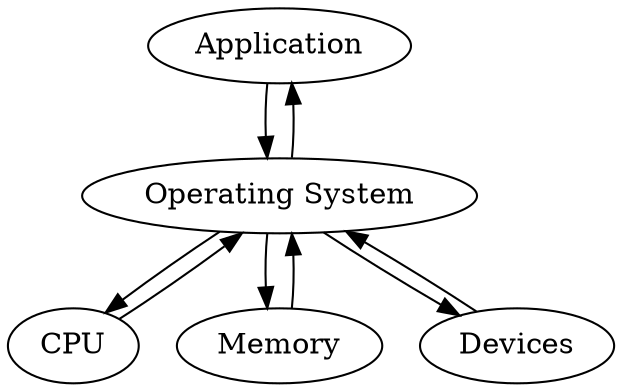

## Introduction

[Netty](https://netty.io) is a NIO client server framework which enables quick and easy development of network applications such as protocol servers and clients. It greatly simplifies and streamlines network programming such as TCP and UDP socket server.


- [Bootstrap](/docs/CS/Java/Netty/Bootstrap.md)
- [Chanel](/docs/CS/Java/Netty/Channel.md)
- [EventLoop](/docs/CS/Java/Netty/EventLoop.md)
- [ByteBuf](/docs/CS/Java/Netty/ByteBuf.md)
- [Future](/docs/CS/Java/Netty/Future.md)
- [FastThreadLocal](/docs/CS/Java/Netty/FastThreadLocal.md)


## [Writing a Discard Server](https://netty.io/wiki/user-guide-for-4.x.html#writing-a-discard-server)




```sequence
participant User
User -->> User: send messages
participant WorkEventLoopGroup as we
participant Selector as se
we ->> se: selector.select()
se ->> we: OP_READ
participant NioByteUnsafe as ue
we ->> ue: NioUnsafe.read()
participant NioSocketChannel as so
ue ->> so: NioUnsafe.read()
so ->> ue: -1(EOF)
ue -->> ue: closeOnRead()
participant ChannelPipeline as pipe

```


```flow
st=>start: User login
op=>operation: Operation
cond=>condition: Successful Yes or No?
e=>end: Into admin
st->op->cond
cond(yes)->e
cond(no)->op
```


```java
/**
 * Discards any incoming data.
 */
public class DiscardServer {
    
    private int port;
    
    public DiscardServer(int port) {
        this.port = port;
    }
    
    public void run() throws Exception {
        EventLoopGroup bossGroup = new NioEventLoopGroup(); // (1)
        EventLoopGroup workerGroup = new NioEventLoopGroup();
        try {
            ServerBootstrap b = new ServerBootstrap(); // (2)
            b.group(bossGroup, workerGroup)
             .channel(NioServerSocketChannel.class) // (3)
             .childHandler(new ChannelInitializer<SocketChannel>() { // (4)
                 @Override
                 public void initChannel(SocketChannel ch) throws Exception {
                     ch.pipeline().addLast(new DiscardServerHandler());
                 }
             })
             .option(ChannelOption.SO_BACKLOG, 128)          // (5)
             .childOption(ChannelOption.SO_KEEPALIVE, true); // (6)
    
            // Bind and start to accept incoming connections.
            ChannelFuture f = b.bind(port).sync(); // (7)
    
            // Wait until the server socket is closed.
            // In this example, this does not happen, but you can do that to gracefully
            // shut down your server.
            f.channel().closeFuture().sync(); // (8)
        } finally {
            workerGroup.shutdownGracefully();
            bossGroup.shutdownGracefully();
        }
    }
    
    public static void main(String[] args) throws Exception {
        int port = 8080;
        if (args.length > 0) {
            port = Integer.parseInt(args[0]);
        }

        new DiscardServer(port).run();
    }
}
```


1. [Create EventLoopGroup](/docs/CS/Java/Netty/EventLoop.md?id=create-nioeventloopgroup)
2. [Create ServerBootstrap](/docs/CS/Java/Netty/Bootstrap.md?id=create-serverbootstrap)
3. Set [Channel](/docs/CS/Java/Netty/Channel.md)
4. Set [ChannelHandler](/docs/CS/Java/Netty/ChannelHandler.md)
5. Option
6. ChildOption
7. [ServerBootstrap#bind()](/docs/CS/Java/Netty/Bootstrap.md?id=serverbootstrapbind-)
8. [ChannelFuture](/docs/CS/Java/Netty/Future.md)


## Under Hood

AllocateByteBuf

## Zero Copy

Direct Memory
Composite Buf
File transfer


## recycler
count

Chunk
Page
SubPage


[Future and Promise](/docs/CS/Java/Netty/Future.md)

