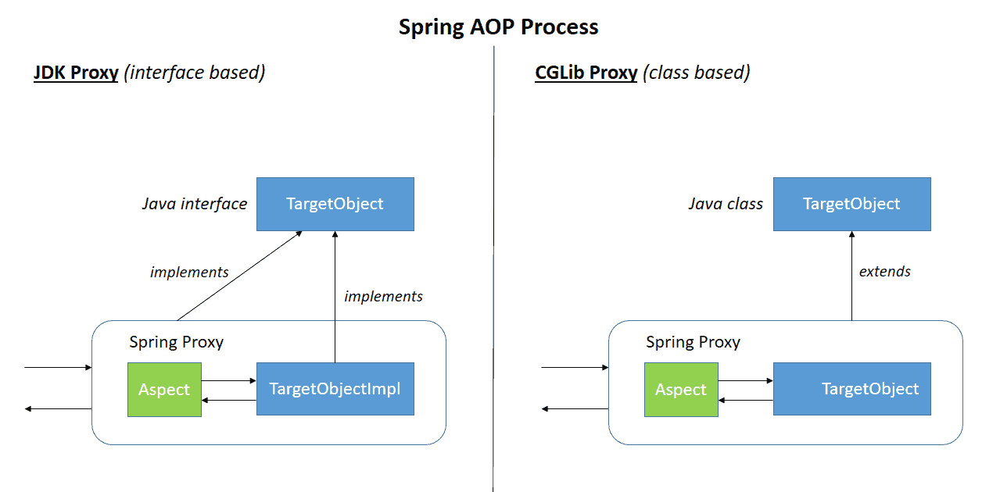
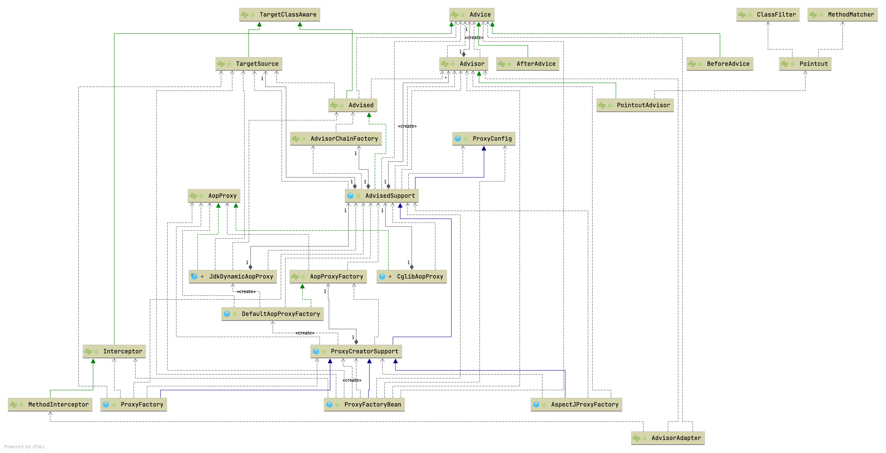

## Introduction

Aspect-Oriented Programming (AOP) complements Object-Oriented Programming (OOP) by providing another way of thinking about program structure.
The key unit of modularity in OOP is the class, whereas in AOP the unit of modularity is the aspect.
Aspects enable the modularization of concerns such as transaction management that cut across multiple types and objects. (Such concerns are often termed crosscutting concerns in AOP literature.)

One of the key components of Spring is the AOP framework.
While the Spring IoC container does not depend on AOP, meaning you do not need to use AOP if you don't want to, AOP complements Spring IoC to provide a very capable middleware solution.

As AspectJ uses compile time and classload time weaving, Spring AOP makes use of runtime weaving.

AOP is used in the Spring Framework to:

- provide declarative enterprise services, especially as a replacement for EJB declarative services. The most important such service is [declarative transaction management](/docs/CS/Java/Spring/Transaction.md?id=Declarative-transaction).
- allow users to implement custom aspects, complementing their use of OOP with AOP.


If the target object to be proxied implements at least one interface, a JDK dynamic proxy is used. All of the interfaces implemented by the target type are proxied. 
If the target object does not implement any interfaces, a CGLIB proxy is created.




## AOP Concepts

Let us begin by defining some central AOP concepts and terminology.
These terms are not Spring-specific.
Unfortunately, AOP terminology is not particularly intuitive.
However, it would be even more confusing if Spring used its own terminology.

- Aspect: A modularization of a concern that cuts across multiple classes.
  Transaction management is a good example of a crosscutting concern in enterprise Java applications.
  In Spring AOP, aspects are implemented by using regular classes (the schema-based approach) or regular classes annotated with the @Aspect annotation (the @AspectJ style).
- Join point: A point during the execution of a program, such as the execution of a method or the handling of an exception. In Spring AOP, a join point always represents a method execution.
- Advice: Action taken by an aspect at a particular join point.
  Different types of advice include "around", "before", and "after" advice. (Advice types are discussed later.)
  Many AOP frameworks, including Spring, model an advice as an interceptor and maintain a chain of interceptors around the join point.
- Pointcut: A predicate that matches join points. Advice is associated with a pointcut expression and runs at any join point matched by the pointcut (for example, the execution of a method with a certain name).
  The concept of join points as matched by pointcut expressions is central to AOP, and Spring uses the AspectJ pointcut expression language by default.
- Introduction: Declaring additional methods or fields on behalf of a type. Spring AOP lets you introduce new interfaces (and a corresponding implementation) to any advised object.
  For example, you could use an introduction to make a bean implement an IsModified interface, to simplify caching. (An introduction is known as an inter-type declaration in the AspectJ community.)
- Target object: An object being advised by one or more aspects. Also referred to as the "advised object".
  Since Spring AOP is implemented by using runtime proxies, this object is always a proxied object.
- AOP proxy: An object created by the AOP framework in order to implement the aspect contracts (advise method executions and so on). In the Spring Framework, an AOP proxy is a JDK dynamic proxy or a CGLIB proxy.
- Weaving: linking aspects with other application types or objects to create an advised object.
  This can be done at compile time (using the AspectJ compiler, for example), load time, or at runtime. Spring AOP, like other pure Java AOP frameworks, performs weaving at runtime.

### Advice
Spring AOP includes the following types of advice:

- Before advice: Advice that runs before a join point but that does not have the ability to prevent execution flow proceeding to the join point (unless it throws an exception).
- After returning advice: Advice to be run after a join point completes normally (for example, if a method returns without throwing an exception).
- After throwing advice: Advice to be run if a method exits by throwing an exception.
- After (finally) advice: Advice to be run regardless of the means by which a join point exits (normal or exceptional return).
- Around advice: Advice that surrounds a join point such as a method invocation. This is the most powerful kind of advice.
  Around advice can perform custom behavior before and after the method invocation.
  It is also responsible for choosing whether to proceed to the join point or to shortcut the advised method execution by returning its own return value or throwing an exception.

Around advice is the most general kind of advice. Since Spring AOP, like AspectJ, provides a full range of advice types, we recommend that you use the least powerful advice type that can implement the required behavior.
For example, if you need only to update a cache with the return value of a method, you are better off implementing an after returning advice than an around advice, although an around advice can accomplish the same thing.
Using the most specific advice type provides a simpler programming model with less potential for errors.
For example, you do not need to invoke the method on the used for around advice, and, hence, you cannot fail to invoke it.proceed()JoinPoint

All advice parameters are statically typed so that you work with advice parameters of the appropriate type (e.g. the type of the return value from a method execution) rather than arrays.Object

The concept of join points matched by pointcuts is the key to AOP, which distinguishes it from older technologies offering only interception.
Pointcuts enable advice to be targeted independently of the object-oriented hierarchy.
For example, you can apply an around advice providing declarative transaction management to a set of methods that span multiple objects (such as all business operations in the service layer).


### Pointcut

```java
public interface Pointcut {
	ClassFilter getClassFilter();

	MethodMatcher getMethodMatcher();

	Pointcut TRUE = TruePointcut.INSTANCE;
}
```

Pointcut types:

- StaticMethodMatcherPointcut
- DynamicMethodMatcherPointcut
- AnnotationMatchingPointcut
- ExpressionPointcut
- ControlFlowPointcut
- ComposablePointcut
- TruePointcut

### AOP Hierarchy



## start

### Example

```java
@Configuration
@EnableAspectJAutoProxy
public class AppConfig {

  @Bean
  public FooService fooService() {
    return new FooService();
  }

  @Bean
  public MyAspect myAspect() {
    return new MyAspect();
  }
}

 public class FooService {
       // various methods
   }
   @Aspect
   public class MyAspect {
  
       @Before("execution(* FooService+.*(..))")
       public void advice() {
           // advise FooService methods as appropriate
       }
   }
```

```java
@Target(ElementType.TYPE)
@Retention(RetentionPolicy.RUNTIME)
@Documented
@Import(AspectJAutoProxyRegistrar.class)
public @interface EnableAspectJAutoProxy {
   boolean proxyTargetClass() default false;
   boolean exposeProxy() default false;
}
```

### registerBeanDefinitions

Registers an **AnnotationAwareAspectJAutoProxyCreator** against the current `BeanDefinitionRegistry` as appropriate based on a given `@EnableAspectJAutoProxy` annotation.

```java
class AspectJAutoProxyRegistrar implements ImportBeanDefinitionRegistrar {

   @Override
   public void registerBeanDefinitions(
         AnnotationMetadata importingClassMetadata, BeanDefinitionRegistry registry) {

      AopConfigUtils.registerAspectJAnnotationAutoProxyCreatorIfNecessary(registry);

      AnnotationAttributes enableAspectJAutoProxy =
            AnnotationConfigUtils.attributesFor(importingClassMetadata, EnableAspectJAutoProxy.class);
      if (enableAspectJAutoProxy != null) {
         if (enableAspectJAutoProxy.getBoolean("proxyTargetClass")) {
            AopConfigUtils.forceAutoProxyCreatorToUseClassProxying(registry);
         }
         if (enableAspectJAutoProxy.getBoolean("exposeProxy")) {
            AopConfigUtils.forceAutoProxyCreatorToExposeProxy(registry);
         }
      }
   }
}
```

#### AnnotationAwareAspectJAutoProxyCreator

```java
// AnnotationAwareAspectJAutoProxyCreator
private List<Pattern> includePatterns;
private AspectJAdvisorFactory aspectJAdvisorFactory;
private BeanFactoryAspectJAdvisorsBuilder aspectJAdvisorsBuilder;

@Override
protected void initBeanFactory(ConfigurableListableBeanFactory beanFactory) {
   super.initBeanFactory(beanFactory);
   if (this.aspectJAdvisorFactory == null) {
      this.aspectJAdvisorFactory = new ReflectiveAspectJAdvisorFactory(beanFactory);
   }
   this.aspectJAdvisorsBuilder =
         new BeanFactoryAspectJAdvisorsBuilderAdapter(beanFactory, this.aspectJAdvisorFactory);
}
```

*AspectJAwareAdvisorAutoProxyCreator subclass that processes all **AspectJ annotation aspects** in the current application context, as well as Spring Advisors.*
Any AspectJ annotated classes will automatically be recognized, and their advice applied if Spring AOP's proxy-based model is capable of applying it. This covers method execution joinpoints.
If the [aop:include](aop:include) element is used, only @AspectJ beans with names matched by an include pattern will be considered as defining aspects to use for Spring auto-proxying.

Processing of Spring Advisors follows the rules established in `org.springframework.aop.framework.autoproxy.AbstractAdvisorAutoProxyCreator`.

#### findEligibleAdvisors

Find all eligible Advisors for auto-proxying this class.

```
// AbstractAdvisorAutoProxyCreator
protected List<Advisor> findEligibleAdvisors(Class<?> beanClass, String beanName) {
   List<Advisor> candidateAdvisors = findCandidateAdvisors();
   List<Advisor> eligibleAdvisors = findAdvisorsThatCanApply(candidateAdvisors, beanClass, beanName);
   extendAdvisors(eligibleAdvisors);
   if (!eligibleAdvisors.isEmpty()) {
      eligibleAdvisors = sortAdvisors(eligibleAdvisors);
   }
   return eligibleAdvisors;
}

// AbstractAdvisorAutoProxyCreator
protected List<Advisor> findCandidateAdvisors() {
		return this.advisorRetrievalHelper.findAdvisorBeans();
	}

// AbstractAdvisorAutoProxyCreator
protected List<Advisor> findAdvisorsThatCanApply(
			List<Advisor> candidateAdvisors, Class<?> beanClass, String beanName) {

		ProxyCreationContext.setCurrentProxiedBeanName(beanName);
		try {
			return AopUtils.findAdvisorsThatCanApply(candidateAdvisors, beanClass);
		}
		finally {
			ProxyCreationContext.setCurrentProxiedBeanName(null);
		}
	}

//  AnnotationAwareAspectJAutoProxyCreator
@Override
protected List<Advisor> findCandidateAdvisors() {
   // Add all the Spring advisors found according to superclass rules.
   List<Advisor> advisors = super.findCandidateAdvisors();
   // Build Advisors for all AspectJ aspects in the bean factory.
   if (this.aspectJAdvisorsBuilder != null) {
      advisors.addAll(this.aspectJAdvisorsBuilder.buildAspectJAdvisors());
   }
   return advisors;
}


// BeanFactoryAdvisorRetrievalHelper
// Helper for retrieving standard Spring Advisors from a BeanFactory, 
// for use with auto-proxying.
public List<Advisor> findAdvisorBeans() {
		// Determine list of advisor bean names, if not cached already.
		String[] advisorNames = this.cachedAdvisorBeanNames;
		if (advisorNames == null) {
			// Do not initialize FactoryBeans here: We need to leave all regular beans
			// uninitialized to let the auto-proxy creator apply to them!
			advisorNames = BeanFactoryUtils.beanNamesForTypeIncludingAncestors(
					this.beanFactory, Advisor.class, true, false);
			this.cachedAdvisorBeanNames = advisorNames;
		}
		if (advisorNames.length == 0) {
			return new ArrayList<>();
		}

		List<Advisor> advisors = new ArrayList<>();
		for (String name : advisorNames) {
			if (isEligibleBean(name)) {
				if (this.beanFactory.isCurrentlyInCreation(name)) {}
				else {
					try {
						advisors.add(this.beanFactory.getBean(name, Advisor.class));
					}
					catch (BeanCreationException ex) {
						Throwable rootCause = ex.getMostSpecificCause();
						if (rootCause instanceof BeanCurrentlyInCreationException) {
							BeanCreationException bce = (BeanCreationException) rootCause;
							String bceBeanName = bce.getBeanName();
							if (bceBeanName != null && this.beanFactory.isCurrentlyInCreation(bceBeanName)) {
								// Ignore: indicates a reference back to the bean we're trying to advise.
								// We want to find advisors other than the currently created bean itself.
								continue;
							}
						}
						throw ex;
					}
				}
			}
		}
		return advisors;
	}
```

## ProxyFactoryBean

ProxyFactoryBean is a FactoryBean implementation that builds an AOP proxy based on beans in Spring BeanFactory.

MethodInterceptors and Advisors are identified by a list of bean names in the current bean factory, specified through the "interceptorNames" property.
The last entry in the list can be the name of a target bean or a TargetSource; however, it is normally preferable to use the "targetName"/"target"/"targetSource" properties instead.

Return a proxy. Invoked when clients obtain beans from this factory bean. Create an instance of the AOP proxy to be returned by this factory.
The instance will be cached for a singleton, and create on each call to getObject() for a proxy.

```
public Object getObject() throws BeansException {
   initializeAdvisorChain();
   if (isSingleton()) {
      return getSingletonInstance();
   }
   else {
      return newPrototypeInstance();
   }
}
```

### initializeAdvisorChain

Create the advisor (interceptor) chain. Advisors that are sourced from a BeanFactory will be refreshed each time a new prototype instance is added.
Interceptors added programmatically through the factory API are unaffected by such changes.

```java
public class ProxyFactoryBean extends ProxyCreatorSupport implements FactoryBean<Object>, BeanClassLoaderAware, BeanFactoryAware {
  private synchronized void initializeAdvisorChain() throws AopConfigException, BeansException {
    // return if advisorChainInitialized   

    for (String name : this.interceptorNames) {
      if (name.endsWith(GLOBAL_SUFFIX)) {
        addGlobalAdvisors((ListableBeanFactory) this.beanFactory, name.substring(0, name.length() - GLOBAL_SUFFIX.length()));
      } else {
        Object advice;
        if (this.singleton || this.beanFactory.isSingleton(name)) {
          advice = this.beanFactory.getBean(name);
        } else {
          advice = new PrototypePlaceholderAdvisor(name);
        }
        addAdvisorOnChainCreation(advice);
      }
    }
    this.advisorChainInitialized = true;
  }
}
```

### getSingletonInstance

```
private synchronized Object getSingletonInstance() {
   if (this.singletonInstance == null) {
      this.targetSource = freshTargetSource();
      if (this.autodetectInterfaces && getProxiedInterfaces().length == 0 && !isProxyTargetClass()) {
         // Rely on AOP infrastructure to tell us what interfaces to proxy.
         Class<?> targetClass = getTargetClass();
         if (targetClass == null) {
            throw new FactoryBeanNotInitializedException("Cannot determine target class for proxy");
         }
         setInterfaces(ClassUtils.getAllInterfacesForClass(targetClass, this.proxyClassLoader));
      }
      // Initialize the shared singleton instance.
      super.setFrozen(this.freezeProxy);
      this.singletonInstance = getProxy(createAopProxy());
   }
   return this.singletonInstance;
}
```

### ProxyFactory

Create a new proxy according to the settings in this factory.
Can be called repeatedly. Effect will vary if we've added or removed interfaces.
Can add and remove interceptors.
Uses the given class loader (if necessary for proxy creation).

```java
public class DefaultAopProxyFactory implements AopProxyFactory, Serializable {
  @Override
  public AopProxy createAopProxy(AdvisedSupport config) throws AopConfigException {
    if (config.isOptimize() || config.isProxyTargetClass() || hasNoUserSuppliedProxyInterfaces(config)) {
      Class<?> targetClass = config.getTargetClass();
      if (targetClass.isInterface() || Proxy.isProxyClass(targetClass) || ClassUtils.isLambdaClass(targetClass)) {
        return new JdkDynamicAopProxy(config);
      }
      return new ObjenesisCglibAopProxy(config);
    } else {
      return new JdkDynamicAopProxy(config);
    }
  }
}
```
#### createAopProxy

<!-- tabs:start -->

##### **JdkDynamicAopProxy**

```java
final class JdkDynamicAopProxy implements AopProxy, InvocationHandler, Serializable {
  @Override
  public Object getProxy(@Nullable ClassLoader classLoader) {
    return Proxy.newProxyInstance(determineClassLoader(classLoader), this.proxiedInterfaces, this);
  }
}
```

##### **CglibAopProxy**

```java
class CglibAopProxy implements AopProxy, Serializable {
  @Override
  public Object getProxy() {
    return buildProxy(null, false);
  }

  private Object buildProxy(@Nullable ClassLoader classLoader, boolean classOnly) {
    try {
      Class<?> rootClass = this.advised.getTargetClass();
      Assert.state(rootClass != null, "Target class must be available for creating a CGLIB proxy");

      Class<?> proxySuperClass = rootClass;
      if (rootClass.getName().contains(ClassUtils.CGLIB_CLASS_SEPARATOR)) {
        proxySuperClass = rootClass.getSuperclass();
        Class<?>[] additionalInterfaces = rootClass.getInterfaces();
        for (Class<?> additionalInterface : additionalInterfaces) {
          this.advised.addInterface(additionalInterface);
        }
      }

      // Validate the class, writing log messages as necessary.
      validateClassIfNecessary(proxySuperClass, classLoader);

      // Configure CGLIB Enhancer...
      Enhancer enhancer = createEnhancer();
      if (classLoader != null) {
        enhancer.setClassLoader(classLoader);
        if (classLoader instanceof SmartClassLoader smartClassLoader &&
                smartClassLoader.isClassReloadable(proxySuperClass)) {
          enhancer.setUseCache(false);
        }
      }
      enhancer.setSuperclass(proxySuperClass);
      enhancer.setInterfaces(AopProxyUtils.completeProxiedInterfaces(this.advised));
      enhancer.setNamingPolicy(SpringNamingPolicy.INSTANCE);
      enhancer.setAttemptLoad(true);
      enhancer.setStrategy(new ClassLoaderAwareGeneratorStrategy(classLoader));

      Callback[] callbacks = getCallbacks(rootClass);
      Class<?>[] types = new Class<?>[callbacks.length];
      for (int x = 0; x < types.length; x++) {
        types[x] = callbacks[x].getClass();
      }
      // fixedInterceptorMap only populated at this point, after getCallbacks call above
      ProxyCallbackFilter filter = new ProxyCallbackFilter(
              this.advised.getConfigurationOnlyCopy(), this.fixedInterceptorMap, this.fixedInterceptorOffset);
      enhancer.setCallbackFilter(filter);
      enhancer.setCallbackTypes(types);

      // Generate the proxy class and create a proxy instance.
      // ProxyCallbackFilter has method introspection capability with Advisor access.
      try {
        return (classOnly ? createProxyClass(enhancer) : createProxyClassAndInstance(enhancer, callbacks));
      } finally {
        // Reduce ProxyCallbackFilter to key-only state for its class cache role
        // in the CGLIB$CALLBACK_FILTER field, not leaking any Advisor state...
        filter.advised.reduceToAdvisorKey();
      }
    } catch (CodeGenerationException | IllegalArgumentException ex) {
      throw new AopConfigException("Could not generate CGLIB subclass of " + this.advised.getTargetClass() +
              ": Common causes of this problem include using a final class or a non-visible class",
              ex);
    } catch (Throwable ex) {
      // TargetSource.getTarget() failed
      throw new AopConfigException("Unexpected AOP exception", ex);
    }
  }
}
```

<!-- tabs:end -->

## Create Proxy

Spring AOP uses either JDK dynamic proxies or CGLIB to create the proxy for a given target object.
(JDK dynamic proxies are preferred whenever you have a choice).


`AbstractAutoProxyCreator` implements [BeanPostProcessor](/docs/CS/Java/Spring/IoC.md?id=BeanPostProcessor)

### postProcessBeforeInstantiation

```java
public abstract class AbstractAutoProxyCreator extends ProxyProcessorSupport implements SmartInstantiationAwareBeanPostProcessor, BeanFactoryAware {

    @Override
    public Object getEarlyBeanReference(Object bean, String beanName) {
        Object cacheKey = getCacheKey(bean.getClass(), beanName);
        this.earlyProxyReferences.put(cacheKey, bean);
        return wrapIfNecessary(bean, beanName, cacheKey);
    }

    @Override
    public Object postProcessBeforeInstantiation(Class<?> beanClass, String beanName) {
        Object cacheKey = getCacheKey(beanClass, beanName);

        if (!StringUtils.hasLength(beanName) || !this.targetSourcedBeans.contains(beanName)) {
            if (this.advisedBeans.containsKey(cacheKey)) {
                return null;
            }
            if (isInfrastructureClass(beanClass) || shouldSkip(beanClass, beanName)) {
                this.advisedBeans.put(cacheKey, Boolean.FALSE);
                return null;
            }
        }

        // Create proxy here if we have a custom TargetSource.
        // Suppresses unnecessary default instantiation of the target bean:
        // The TargetSource will handle target instances in a custom fashion.
        TargetSource targetSource = getCustomTargetSource(beanClass, beanName);
        if (targetSource != null) {
            if (StringUtils.hasLength(beanName)) {
                this.targetSourcedBeans.add(beanName);
            }
            Object[] specificInterceptors = getAdvicesAndAdvisorsForBean(beanClass, beanName, targetSource);
            Object proxy = createProxy(beanClass, beanName, specificInterceptors, targetSource);
            this.proxyTypes.put(cacheKey, proxy.getClass());
            return proxy;
        }

        return null;
    }
}
```

#### getAdvicesAndAdvisorsForBean

Return whether the given bean is to be proxied, what additional advices (e.g. AOP Alliance interceptors) and advisors to apply.

```
@Override
	@Nullable
	protected Object[] getAdvicesAndAdvisorsForBean(
			Class<?> beanClass, String beanName, @Nullable TargetSource targetSource) {

		List<Advisor> advisors = findEligibleAdvisors(beanClass, beanName);
		if (advisors.isEmpty()) {
			return DO_NOT_PROXY;
		}
		return advisors.toArray();
	}
```

### postProcessAfterInitialization

Create a proxy with the configured interceptors if the bean is identified as one to proxy by the subclass.

```
@Override
public Object postProcessAfterInitialization(@Nullable Object bean, String beanName) {
   if (bean != null) {
      Object cacheKey = getCacheKey(bean.getClass(), beanName);
      if (this.earlyProxyReferences.remove(cacheKey) != bean) {
         return wrapIfNecessary(bean, beanName, cacheKey);
      }
   }
   return bean;
}
```

### wrapIfNecessary

Wrap the given bean if necessary, i.e. if it is eligible for being proxied.

```
protected Object wrapIfNecessary(Object bean, String beanName, Object cacheKey) {
   if (StringUtils.hasLength(beanName) && this.targetSourcedBeans.contains(beanName)) {
      return bean;
   }
   if (Boolean.FALSE.equals(this.advisedBeans.get(cacheKey))) {
      return bean;
   }
   if (isInfrastructureClass(bean.getClass()) || shouldSkip(bean.getClass(), beanName)) {
      this.advisedBeans.put(cacheKey, Boolean.FALSE);
      return bean;
   }

   // Create proxy if we have advice.
   Object[] specificInterceptors = getAdvicesAndAdvisorsForBean(bean.getClass(), beanName, null);
   if (specificInterceptors != DO_NOT_PROXY) {
      this.advisedBeans.put(cacheKey, Boolean.TRUE);
      Object proxy = createProxy(
            bean.getClass(), beanName, specificInterceptors, new SingletonTargetSource(bean));
      this.proxyTypes.put(cacheKey, proxy.getClass());
      return proxy;
   }

   this.advisedBeans.put(cacheKey, Boolean.FALSE);
   return bean;
}
```

### createProxy

Create an AOP proxy for the given bean.

```
protected Object createProxy(Class<?> beanClass, @Nullable String beanName,
      @Nullable Object[] specificInterceptors, TargetSource targetSource) {

   if (this.beanFactory instanceof ConfigurableListableBeanFactory) {
      AutoProxyUtils.exposeTargetClass((ConfigurableListableBeanFactory) this.beanFactory, beanName, beanClass);
   }

   ProxyFactory proxyFactory = new ProxyFactory();
   proxyFactory.copyFrom(this);

   if (!proxyFactory.isProxyTargetClass()) {
      if (shouldProxyTargetClass(beanClass, beanName)) {
         proxyFactory.setProxyTargetClass(true);
      }
      else {
         evaluateProxyInterfaces(beanClass, proxyFactory);
      }
   }

   Advisor[] advisors = buildAdvisors(beanName, specificInterceptors);
   proxyFactory.addAdvisors(advisors);
   proxyFactory.setTargetSource(targetSource);
   customizeProxyFactory(proxyFactory);

   proxyFactory.setFrozen(this.freezeProxy);
   if (advisorsPreFiltered()) {
      proxyFactory.setPreFiltered(true);
   }

   // Use original ClassLoader if bean class not locally loaded in overriding class loader
   ClassLoader classLoader = getProxyClassLoader();
   if (classLoader instanceof SmartClassLoader && classLoader != beanClass.getClassLoader()) {
      classLoader = ((SmartClassLoader) classLoader).getOriginalClassLoader();
   }
   return proxyFactory.getProxy(classLoader);
}
```

#### buildAdvisors

Determine the advisors for the given bean, including the specific interceptors as well as the common interceptor, all adapted to the Advisor interface.

```
protected Advisor[] buildAdvisors(@Nullable String beanName, @Nullable Object[] specificInterceptors) {
		// Handle prototypes correctly...
		Advisor[] commonInterceptors = resolveInterceptorNames();

		List<Object> allInterceptors = new ArrayList<>();
		if (specificInterceptors != null) {
			if (specificInterceptors.length > 0) {
				// specificInterceptors may equal PROXY_WITHOUT_ADDITIONAL_INTERCEPTORS
				allInterceptors.addAll(Arrays.asList(specificInterceptors));
			}
			if (commonInterceptors.length > 0) {
				if (this.applyCommonInterceptorsFirst) {
					allInterceptors.addAll(0, Arrays.asList(commonInterceptors));
				}
				else {
					allInterceptors.addAll(Arrays.asList(commonInterceptors));
				}
			}
		}
		if (logger.isTraceEnabled()) {
			int nrOfCommonInterceptors = commonInterceptors.length;
			int nrOfSpecificInterceptors = (specificInterceptors != null ? specificInterceptors.length : 0);
			logger.trace("Creating implicit proxy for bean '" + beanName + "' with " + nrOfCommonInterceptors +
					" common interceptors and " + nrOfSpecificInterceptors + " specific interceptors");
		}

		Advisor[] advisors = new Advisor[allInterceptors.size()];
		for (int i = 0; i < allInterceptors.size(); i++) {
			advisors[i] = this.advisorAdapterRegistry.wrap(allInterceptors.get(i));
		}
		return advisors;
	}

```

### getAdvisors

```

	@Override
	public List<Advisor> getAdvisors(MetadataAwareAspectInstanceFactory aspectInstanceFactory) {
		Class<?> aspectClass = aspectInstanceFactory.getAspectMetadata().getAspectClass();
		String aspectName = aspectInstanceFactory.getAspectMetadata().getAspectName();
		validate(aspectClass);

		// We need to wrap the MetadataAwareAspectInstanceFactory with a decorator
		// so that it will only instantiate once.
		MetadataAwareAspectInstanceFactory lazySingletonAspectInstanceFactory =
				new LazySingletonAspectInstanceFactoryDecorator(aspectInstanceFactory);

		List<Advisor> advisors = new ArrayList<>();
		for (Method method : getAdvisorMethods(aspectClass)) {
			// Prior to Spring Framework 5.2.7, advisors.size() was supplied as the declarationOrderInAspect
			// to getAdvisor(...) to represent the "current position" in the declared methods list.
			// However, since Java 7 the "current position" is not valid since the JDK no longer
			// returns declared methods in the order in which they are declared in the source code.
			// Thus, we now hard code the declarationOrderInAspect to 0 for all advice methods
			// discovered via reflection in order to support reliable advice ordering across JVM launches.
			// Specifically, a value of 0 aligns with the default value used in
			// AspectJPrecedenceComparator.getAspectDeclarationOrder(Advisor).
			Advisor advisor = getAdvisor(method, lazySingletonAspectInstanceFactory, 0, aspectName);
			if (advisor != null) {
				advisors.add(advisor);
			}
		}

		// If it's a per target aspect, emit the dummy instantiating aspect.
		if (!advisors.isEmpty() && lazySingletonAspectInstanceFactory.getAspectMetadata().isLazilyInstantiated()) {
			Advisor instantiationAdvisor = new SyntheticInstantiationAdvisor(lazySingletonAspectInstanceFactory);
			advisors.add(0, instantiationAdvisor);
		}

		// Find introduction fields.
		for (Field field : aspectClass.getDeclaredFields()) {
			Advisor advisor = getDeclareParentsAdvisor(field);
			if (advisor != null) {
				advisors.add(advisor);
			}
		}

		return advisors;
	}
```

#### getAdvisorMethods

```
private List<Method> getAdvisorMethods(Class<?> aspectClass) {
		List<Method> methods = new ArrayList<>();
		ReflectionUtils.doWithMethods(aspectClass, methods::add, adviceMethodFilter);
		if (methods.size() > 1) {
			methods.sort(adviceMethodComparator);
		}
		return methods;
	}
```

### Order

Factory that can create Spring AOP Advisors given AspectJ classes from classes honoring AspectJ's annotation syntax, using reflection to invoke the corresponding advice methods.

> [!Note]
>
> Although @After is ordered before @AfterReturning and @AfterThrowing, an @After advice method will actually be invoked after @AfterReturning and @AfterThrowing methods
> due to the fact that AspectJAfterAdvice.invoke(MethodInvocation) invokes proceed() in a `try` block and only invokes the @After advice method in a corresponding `finally` block.

- Order: `Around` -> `Before` -> `After` -> `AfterReturning` -> `AfterThrowing`
- Actual invoke: `Around` -> `Before` -> `AfterReturning` -> `AfterThrowing` -> `After`


> [!TIP]
> 
> Usually, the metrics and logs are set to HIGHEST_PRECEDENCE so that it doesn't affect other advices, such as the tansaction interceptor.

```java
public class AspectJAfterAdvice extends AbstractAspectJAdvice implements MethodInterceptor, AfterAdvice, Serializable {

  @Override
  @Nullable
  public Object invoke(MethodInvocation mi) throws Throwable {
    try {
      return mi.proceed();
    } finally {
      invokeAdviceMethod(getJoinPointMatch(), null, null);
    }
  }
}
```

## proceed

Proceed to the next interceptor in the chain.
The implementation and the semantics of this method depends on the actual joinpoint type (see the children interfaces).

```
// ReflectiveMethodInvocation
@Override
@Nullable
public Object proceed() throws Throwable {
   // We start with an index of -1 and increment early.
   if (this.currentInterceptorIndex == this.interceptorsAndDynamicMethodMatchers.size() - 1) {
      return invokeJoinpoint();
   }

   Object interceptorOrInterceptionAdvice =
         this.interceptorsAndDynamicMethodMatchers.get(++this.currentInterceptorIndex);
   if (interceptorOrInterceptionAdvice instanceof InterceptorAndDynamicMethodMatcher) {
      // Evaluate dynamic method matcher here: static part will already have
      // been evaluated and found to match.
      InterceptorAndDynamicMethodMatcher dm =
            (InterceptorAndDynamicMethodMatcher) interceptorOrInterceptionAdvice;
      Class<?> targetClass = (this.targetClass != null ? this.targetClass : this.method.getDeclaringClass());
      if (dm.methodMatcher.matches(this.method, targetClass, this.arguments)) {
         return dm.interceptor.invoke(this);
      }
      else {
         // Dynamic matching failed.
         // Skip this interceptor and invoke the next in the chain.
         return proceed();
      }
   }
   else {
      // It's an interceptor, so we just invoke it: The pointcut will have
      // been evaluated statically before this object was constructed.
      return ((MethodInterceptor) interceptorOrInterceptionAdvice).invoke(this);
   }
}
```

`DefaultAdvisorAdapterRegistry#getInterceptors()`

```
/**
 * Create a new DefaultAdvisorAdapterRegistry, registering well-known adapters.
 */
public DefaultAdvisorAdapterRegistry() {
   registerAdvisorAdapter(new MethodBeforeAdviceAdapter());
   registerAdvisorAdapter(new AfterReturningAdviceAdapter());
   registerAdvisorAdapter(new ThrowsAdviceAdapter());
}


@Override
public MethodInterceptor[] getInterceptors(Advisor advisor) throws UnknownAdviceTypeException {
   List<MethodInterceptor> interceptors = new ArrayList<>(3);
   Advice advice = advisor.getAdvice();
   if (advice instanceof MethodInterceptor) {
      interceptors.add((MethodInterceptor) advice);
   }
   for (AdvisorAdapter adapter : this.adapters) {
      if (adapter.supportsAdvice(advice)) {
         interceptors.add(adapter.getInterceptor(advisor));
      }
   }
   if (interceptors.isEmpty()) {
      throw new UnknownAdviceTypeException(advisor.getAdvice());
   }
   return interceptors.toArray(new MethodInterceptor[0]);
}
```

### MethodBeforeAdviceInterceptor

Interceptor to wrap a MethodBeforeAdvice.
Used internally by the AOP framework; application developers should not need to use this class directly.

```java
@SuppressWarnings("serial")
public class MethodBeforeAdviceInterceptor implements MethodInterceptor, BeforeAdvice, Serializable {

   private final MethodBeforeAdvice advice;

   /**
    * Create a new MethodBeforeAdviceInterceptor for the given advice.
    * @param advice the MethodBeforeAdvice to wrap
    */
   public MethodBeforeAdviceInterceptor(MethodBeforeAdvice advice) {
      Assert.notNull(advice, "Advice must not be null");
      this.advice = advice;
   }


   @Override
   @Nullable
   public Object invoke(MethodInvocation mi) throws Throwable {
      this.advice.before(mi.getMethod(), mi.getArguments(), mi.getThis());
      return mi.proceed();
   }

}
```

## Summary


|               | Cglib     | JDK       |
| ------------- | --------- | --------- |
| Create Proxy  | Slow      | Fast      |
| Invoke method | Fast      | Slow      |
| Prefer        | Singleton | Prototype |

### Do not get bean directly

get bean by `@Autowired` or method or `ApplicationContext` rather than using `this.field`

Using `AopContext.currentProxy()`(get a [ThreadLocal which default contains null](/docs/CS/Java/JDK/Concurrency/ThreadLocal.md)) must set `exposeProxy = true` in `@EnableAspectJAutoProxy`

`ObjenesisCglibAopProxy`:

- Objenesis-based extension of CglibAopProxy to **create proxy instances without invoking the constructor of the class**. Used by default as of Spring 4.
- default use `sun.reflect.ReflectionFactory.newConstructorForSerialization().newInstance()`, and use `this.field` to do something that may cause `NPE`

set `spring.objenesis.ignore = true`  to invoke the constructor of the class, but we suggest getting bean by method or `@Autowired`

## Links

- [Spring](/docs/CS/Java/Spring/Spring.md)

## References

1. [Aspect Oriented Programming with Spring](https://docs.spring.io/spring-framework/reference/core/aop.html)
