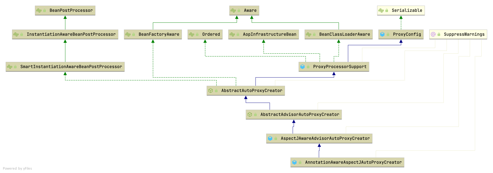

## Introduction


Aspect Oriented Programming


### AOP Hierarchy


## start

### Example:

```java
@Configuration
@EnableAspectJAutoProxy
public class AppConfig {

  @Bean
  public FooService fooService() {
    return new FooService();
  }

  @Bean
  public MyAspect myAspect() {
    return new MyAspect();
  }
}

 public class FooService {
  
       // various methods
   }
   @Aspect
   public class MyAspect {
  
       @Before("execution(* FooService+.*(..))")
       public void advice() {
           // advise FooService methods as appropriate
       }
   }
```


```java
Target(ElementType.TYPE)
@Retention(RetentionPolicy.RUNTIME)
@Documented
@Import(AspectJAutoProxyRegistrar.class)
public @interface EnableAspectJAutoProxy {

   /**
    * Indicate whether subclass-based (CGLIB) proxies are to be created as opposed
    * to standard Java interface-based proxies. The default is {@code false}.
    */
   boolean proxyTargetClass() default false;

   /**
    * Indicate that the proxy should be exposed by the AOP framework as a ThreadLocal
    * for retrieval via the AopContext class.
    * Off by default, i.e. no guarantees that {@code AopContext} access will work.
    */
   boolean exposeProxy() default false;

}
```

### registerBeanDefinitions

Registers an **AnnotationAwareAspectJAutoProxyCreator** against the current `BeanDefinitionRegistry` as appropriate based on a given `@EnableAspectJAutoProxy` annotation.

```java
class AspectJAutoProxyRegistrar implements ImportBeanDefinitionRegistrar {

   /**
    * Register, escalate, and configure the AspectJ auto proxy creator based on the value
    * of the EnableAspectJAutoProxy#proxyTargetClass() attribute on the importing
    * {@code @Configuration} class.
    */
   @Override
   public void registerBeanDefinitions(
         AnnotationMetadata importingClassMetadata, BeanDefinitionRegistry registry) {

      AopConfigUtils.registerAspectJAnnotationAutoProxyCreatorIfNecessary(registry);

      AnnotationAttributes enableAspectJAutoProxy =
            AnnotationConfigUtils.attributesFor(importingClassMetadata, EnableAspectJAutoProxy.class);
      if (enableAspectJAutoProxy != null) {
         if (enableAspectJAutoProxy.getBoolean("proxyTargetClass")) {
            AopConfigUtils.forceAutoProxyCreatorToUseClassProxying(registry);
         }
         if (enableAspectJAutoProxy.getBoolean("exposeProxy")) {
            AopConfigUtils.forceAutoProxyCreatorToExposeProxy(registry);
         }
      }
   }

}
```


#### AnnotationAwareAspectJAutoProxyCreator

```java
// AnnotationAwareAspectJAutoProxyCreator
@Nullable
private List<Pattern> includePatterns;

@Nullable
private AspectJAdvisorFactory aspectJAdvisorFactory;

@Nullable
private BeanFactoryAspectJAdvisorsBuilder aspectJAdvisorsBuilder;

@Override
protected void initBeanFactory(ConfigurableListableBeanFactory beanFactory) {
   super.initBeanFactory(beanFactory);
   if (this.aspectJAdvisorFactory == null) {
      this.aspectJAdvisorFactory = new ReflectiveAspectJAdvisorFactory(beanFactory);
   }
   this.aspectJAdvisorsBuilder =
         new BeanFactoryAspectJAdvisorsBuilderAdapter(beanFactory, this.aspectJAdvisorFactory);
}
```


*AspectJAwareAdvisorAutoProxyCreator subclass that processes all **AspectJ annotation aspects** in the current application context, as well as Spring Advisors.*
Any AspectJ annotated classes will automatically be recognized, and their advice applied if Spring AOP's proxy-based model is capable of applying it. This covers method execution joinpoints.
If the <aop:include> element is used, only @AspectJ beans with names matched by an include pattern will be considered as defining aspects to use for Spring auto-proxying.

Processing of Spring Advisors follows the rules established in `org.springframework.aop.framework.autoproxy.AbstractAdvisorAutoProxyCreator`.


```java
// AbstractAdvisorAutoProxyCreator
protected List<Advisor> findEligibleAdvisors(Class<?> beanClass, String beanName) {
   List<Advisor> candidateAdvisors = findCandidateAdvisors();
   List<Advisor> eligibleAdvisors = findAdvisorsThatCanApply(candidateAdvisors, beanClass, beanName);
   extendAdvisors(eligibleAdvisors);
   if (!eligibleAdvisors.isEmpty()) {
      eligibleAdvisors = sortAdvisors(eligibleAdvisors);
   }
   return eligibleAdvisors;
}

// AbstractAdvisorAutoProxyCreator
protected List<Advisor> findCandidateAdvisors() {
		return this.advisorRetrievalHelper.findAdvisorBeans();
	}

// AbstractAdvisorAutoProxyCreator
protected List<Advisor> findAdvisorsThatCanApply(
			List<Advisor> candidateAdvisors, Class<?> beanClass, String beanName) {

		ProxyCreationContext.setCurrentProxiedBeanName(beanName);
		try {
			return AopUtils.findAdvisorsThatCanApply(candidateAdvisors, beanClass);
		}
		finally {
			ProxyCreationContext.setCurrentProxiedBeanName(null);
		}
	}

//  AnnotationAwareAspectJAutoProxyCreator
@Override
protected List<Advisor> findCandidateAdvisors() {
   // Add all the Spring advisors found according to superclass rules.
   List<Advisor> advisors = super.findCandidateAdvisors();
   // Build Advisors for all AspectJ aspects in the bean factory.
   if (this.aspectJAdvisorsBuilder != null) {
      advisors.addAll(this.aspectJAdvisorsBuilder.buildAspectJAdvisors());
   }
   return advisors;
}


// BeanFactoryAdvisorRetrievalHelper
// Helper for retrieving standard Spring Advisors from a BeanFactory, 
// for use with auto-proxying.
public List<Advisor> findAdvisorBeans() {
		// Determine list of advisor bean names, if not cached already.
		String[] advisorNames = this.cachedAdvisorBeanNames;
		if (advisorNames == null) {
			// Do not initialize FactoryBeans here: We need to leave all regular beans
			// uninitialized to let the auto-proxy creator apply to them!
			advisorNames = BeanFactoryUtils.beanNamesForTypeIncludingAncestors(
					this.beanFactory, Advisor.class, true, false);
			this.cachedAdvisorBeanNames = advisorNames;
		}
		if (advisorNames.length == 0) {
			return new ArrayList<>();
		}

		List<Advisor> advisors = new ArrayList<>();
		for (String name : advisorNames) {
			if (isEligibleBean(name)) {
				if (this.beanFactory.isCurrentlyInCreation(name)) {}
				else {
					try {
						advisors.add(this.beanFactory.getBean(name, Advisor.class));
					}
					catch (BeanCreationException ex) {
						Throwable rootCause = ex.getMostSpecificCause();
						if (rootCause instanceof BeanCurrentlyInCreationException) {
							BeanCreationException bce = (BeanCreationException) rootCause;
							String bceBeanName = bce.getBeanName();
							if (bceBeanName != null && this.beanFactory.isCurrentlyInCreation(bceBeanName)) {
								// Ignore: indicates a reference back to the bean we're trying to advise.
								// We want to find advisors other than the currently created bean itself.
								continue;
							}
						}
						throw ex;
					}
				}
			}
		}
		return advisors;
	}
```


## createProxy




`AbstractAutoProxyCreator` implements [BeanPostProcessor](/docs/CS/Java/Spring/IoC.md?id=BeanPostProcessor)

### postProcessBeforeInstantiation

```java
// AbstractAutoProxyCreator
@Override
public Object postProcessBeforeInstantiation(Class<?> beanClass, String beanName) {
   Object cacheKey = getCacheKey(beanClass, beanName);

   if (!StringUtils.hasLength(beanName) || !this.targetSourcedBeans.contains(beanName)) {
      if (this.advisedBeans.containsKey(cacheKey)) {
         return null;
      }
      if (isInfrastructureClass(beanClass) || shouldSkip(beanClass, beanName)) {
         this.advisedBeans.put(cacheKey, Boolean.FALSE);
         return null;
      }
   }

   // Create proxy here if we have a custom TargetSource.
   // Suppresses unnecessary default instantiation of the target bean:
   // The TargetSource will handle target instances in a custom fashion.
   TargetSource targetSource = getCustomTargetSource(beanClass, beanName);
   if (targetSource != null) {
      if (StringUtils.hasLength(beanName)) {
         this.targetSourcedBeans.add(beanName);
      }
      Object[] specificInterceptors = getAdvicesAndAdvisorsForBean(beanClass, beanName, targetSource);
      Object proxy = createProxy(beanClass, beanName, specificInterceptors, targetSource);
      this.proxyTypes.put(cacheKey, proxy.getClass());
      return proxy;
   }

   return null;
}
```

### postProcessAfterInitialization

Create a proxy with the configured interceptors if the bean is identified as one to proxy by the subclass.

```java
@Override
public Object postProcessAfterInitialization(@Nullable Object bean, String beanName) {
   if (bean != null) {
      Object cacheKey = getCacheKey(bean.getClass(), beanName);
      if (this.earlyProxyReferences.remove(cacheKey) != bean) {
         return wrapIfNecessary(bean, beanName, cacheKey);
      }
   }
   return bean;
}
```

### wrapIfNecessary

Wrap the given bean if necessary, i.e. if it is eligible for being proxied.

```java
protected Object wrapIfNecessary(Object bean, String beanName, Object cacheKey) {
   if (StringUtils.hasLength(beanName) && this.targetSourcedBeans.contains(beanName)) {
      return bean;
   }
   if (Boolean.FALSE.equals(this.advisedBeans.get(cacheKey))) {
      return bean;
   }
   if (isInfrastructureClass(bean.getClass()) || shouldSkip(bean.getClass(), beanName)) {
      this.advisedBeans.put(cacheKey, Boolean.FALSE);
      return bean;
   }

   // Create proxy if we have advice.
   Object[] specificInterceptors = getAdvicesAndAdvisorsForBean(bean.getClass(), beanName, null);
   if (specificInterceptors != DO_NOT_PROXY) {
      this.advisedBeans.put(cacheKey, Boolean.TRUE);
      Object proxy = createProxy(
            bean.getClass(), beanName, specificInterceptors, new SingletonTargetSource(bean));
      this.proxyTypes.put(cacheKey, proxy.getClass());
      return proxy;
   }

   this.advisedBeans.put(cacheKey, Boolean.FALSE);
   return bean;
}
```


Create an AOP proxy for the given bean.

```java
protected Object createProxy(Class<?> beanClass, @Nullable String beanName,
      @Nullable Object[] specificInterceptors, TargetSource targetSource) {

   if (this.beanFactory instanceof ConfigurableListableBeanFactory) {
      AutoProxyUtils.exposeTargetClass((ConfigurableListableBeanFactory) this.beanFactory, beanName, beanClass);
   }

   ProxyFactory proxyFactory = new ProxyFactory();
   proxyFactory.copyFrom(this);

   if (!proxyFactory.isProxyTargetClass()) {
      if (shouldProxyTargetClass(beanClass, beanName)) {
         proxyFactory.setProxyTargetClass(true);
      }
      else {
         evaluateProxyInterfaces(beanClass, proxyFactory);
      }
   }

   Advisor[] advisors = buildAdvisors(beanName, specificInterceptors);
   proxyFactory.addAdvisors(advisors);
   proxyFactory.setTargetSource(targetSource);
   customizeProxyFactory(proxyFactory);

   proxyFactory.setFrozen(this.freezeProxy);
   if (advisorsPreFiltered()) {
      proxyFactory.setPreFiltered(true);
   }

   // Use original ClassLoader if bean class not locally loaded in overriding class loader
   ClassLoader classLoader = getProxyClassLoader();
   if (classLoader instanceof SmartClassLoader && classLoader != beanClass.getClassLoader()) {
      classLoader = ((SmartClassLoader) classLoader).getOriginalClassLoader();
   }
   return proxyFactory.getProxy(classLoader);
}
```


### ProxyFactory

Create a new proxy according to the settings in this factory.
Can be called repeatedly. Effect will vary if we've added or removed interfaces. Can add and remove interceptors.
Uses the given class loader (if necessary for proxy creation).

```java
// ProxyFactory
public Object getProxy(@Nullable ClassLoader classLoader) {
   return createAopProxy().getProxy(classLoader);
}

// DefaultAopProxyFactory
@Override
public AopProxy createAopProxy(AdvisedSupport config) throws AopConfigException {
  if (!NativeDetector.inNativeImage() &&
      (config.isOptimize() || config.isProxyTargetClass() || hasNoUserSuppliedProxyInterfaces(config))) {
    Class<?> targetClass = config.getTargetClass();
    if (targetClass == null) {
      throw new AopConfigException("TargetSource cannot determine target class: " +
                                   "Either an interface or a target is required for proxy creation.");
    }
    if (targetClass.isInterface() || Proxy.isProxyClass(targetClass)) {
      return new JdkDynamicAopProxy(config);
    }
    return new ObjenesisCglibAopProxy(config);
  }
  else {
    return new JdkDynamicAopProxy(config);
  }
}
```


### CglibAopProxy

```java
// CglibAopProxy
@Override
public Object getProxy(@Nullable ClassLoader classLoader) {
   try {
      Class<?> rootClass = this.advised.getTargetClass();
      Assert.state(rootClass != null, "Target class must be available for creating a CGLIB proxy");

      Class<?> proxySuperClass = rootClass;
      if (rootClass.getName().contains(ClassUtils.CGLIB_CLASS_SEPARATOR)) {
         proxySuperClass = rootClass.getSuperclass();
         Class<?>[] additionalInterfaces = rootClass.getInterfaces();
         for (Class<?> additionalInterface : additionalInterfaces) {
            this.advised.addInterface(additionalInterface);
         }
      }

      // Validate the class, writing log messages as necessary.
      validateClassIfNecessary(proxySuperClass, classLoader);

      // Configure CGLIB Enhancer...
      Enhancer enhancer = createEnhancer();
      if (classLoader != null) {
         enhancer.setClassLoader(classLoader);
         if (classLoader instanceof SmartClassLoader &&
               ((SmartClassLoader) classLoader).isClassReloadable(proxySuperClass)) {
            enhancer.setUseCache(false);
         }
      }
      enhancer.setSuperclass(proxySuperClass);
      enhancer.setInterfaces(AopProxyUtils.completeProxiedInterfaces(this.advised));
      enhancer.setNamingPolicy(SpringNamingPolicy.INSTANCE);
      enhancer.setStrategy(new ClassLoaderAwareGeneratorStrategy(classLoader));

      Callback[] callbacks = getCallbacks(rootClass);
      Class<?>[] types = new Class<?>[callbacks.length];
      for (int x = 0; x < types.length; x++) {
         types[x] = callbacks[x].getClass();
      }
      // fixedInterceptorMap only populated at this point, after getCallbacks call above
      enhancer.setCallbackFilter(new ProxyCallbackFilter(
            this.advised.getConfigurationOnlyCopy(), this.fixedInterceptorMap, this.fixedInterceptorOffset));
      enhancer.setCallbackTypes(types);

      // Generate the proxy class and create a proxy instance.
      return createProxyClassAndInstance(enhancer, callbacks);
   }
   catch (CodeGenerationException | IllegalArgumentException ex) {
      throw new AopConfigException("");
   }
   catch (Throwable ex) {
      // TargetSource.getTarget() failed
      throw new AopConfigException("Unexpected AOP exception", ex);
   }
}

```

### JdkDynamicAopProxy


```java
// JdkDynamicAopProxy
@Override
public Object getProxy(@Nullable ClassLoader classLoader) {
  return Proxy.newProxyInstance(classLoader, this.proxiedInterfaces, this);
}

/**
	 * Implementation of {@code InvocationHandler.invoke}.
	 * <p>Callers will see exactly the exception thrown by the target,
	 * unless a hook method throws an exception.
	 */
	@Override
	@Nullable
	public Object invoke(Object proxy, Method method, Object[] args) throws Throwable {
		Object oldProxy = null;
		boolean setProxyContext = false;

		TargetSource targetSource = this.advised.targetSource;
		Object target = null;

		try {
			if (!this.equalsDefined && AopUtils.isEqualsMethod(method)) {
				// The target does not implement the equals(Object) method itself.
				return equals(args[0]);
			}
			else if (!this.hashCodeDefined && AopUtils.isHashCodeMethod(method)) {
				// The target does not implement the hashCode() method itself.
				return hashCode();
			}
			else if (method.getDeclaringClass() == DecoratingProxy.class) {
				// There is only getDecoratedClass() declared -> dispatch to proxy config.
				return AopProxyUtils.ultimateTargetClass(this.advised);
			}
			else if (!this.advised.opaque && method.getDeclaringClass().isInterface() &&
					method.getDeclaringClass().isAssignableFrom(Advised.class)) {
				// Service invocations on ProxyConfig with the proxy config...
				return AopUtils.invokeJoinpointUsingReflection(this.advised, method, args);
			}

			Object retVal;

			if (this.advised.exposeProxy) {
				// Make invocation available if necessary.
				oldProxy = AopContext.setCurrentProxy(proxy);
				setProxyContext = true;
			}

			// Get as late as possible to minimize the time we "own" the target,
			// in case it comes from a pool.
			target = targetSource.getTarget();
			Class<?> targetClass = (target != null ? target.getClass() : null);

			// Get the interception chain for this method.
			List<Object> chain = this.advised.getInterceptorsAndDynamicInterceptionAdvice(method, targetClass);

			// Check whether we have any advice. If we don't, we can fallback on direct
			// reflective invocation of the target, and avoid creating a MethodInvocation.
			if (chain.isEmpty()) {
				// We can skip creating a MethodInvocation: just invoke the target directly
				// Note that the final invoker must be an InvokerInterceptor so we know it does
				// nothing but a reflective operation on the target, and no hot swapping or fancy proxying.
				Object[] argsToUse = AopProxyUtils.adaptArgumentsIfNecessary(method, args);
				retVal = AopUtils.invokeJoinpointUsingReflection(target, method, argsToUse);
			}
			else {
				// We need to create a method invocation...
				MethodInvocation invocation =
						new ReflectiveMethodInvocation(proxy, target, method, args, targetClass, chain);
				// Proceed to the joinpoint through the interceptor chain.
				retVal = invocation.proceed();
			}

			// Massage return value if necessary.
			Class<?> returnType = method.getReturnType();
			if (retVal != null && retVal == target &&
					returnType != Object.class && returnType.isInstance(proxy) &&
					!RawTargetAccess.class.isAssignableFrom(method.getDeclaringClass())) {
				// Special case: it returned "this" and the return type of the method
				// is type-compatible. Note that we can't help if the target sets
				// a reference to itself in another returned object.
				retVal = proxy;
			}
			else if (retVal == null && returnType != Void.TYPE && returnType.isPrimitive()) {
				throw new AopInvocationException(
						"Null return value from advice does not match primitive return type for: " + method);
			}
			return retVal;
		}
		finally {
			if (target != null && !targetSource.isStatic()) {
				// Must have come from TargetSource.
				targetSource.releaseTarget(target);
			}
			if (setProxyContext) {
				// Restore old proxy.
				AopContext.setCurrentProxy(oldProxy);
			}
		}
	}

```


Determine a list of org.aopalliance.intercept.MethodInterceptor objects for the given method, based on this configuration.

```java
public List<Object> getInterceptorsAndDynamicInterceptionAdvice(Method method, @Nullable Class<?> targetClass) {
   MethodCacheKey cacheKey = new MethodCacheKey(method);
   List<Object> cached = this.methodCache.get(cacheKey);
   if (cached == null) {
      cached = this.advisorChainFactory.getInterceptorsAndDynamicInterceptionAdvice(
            this, method, targetClass);
      this.methodCache.put(cacheKey, cached);
   }
   return cached;
}
```


```java
// DefaultAdvisorChainFactory
@Override
public List<Object> getInterceptorsAndDynamicInterceptionAdvice(
      Advised config, Method method, @Nullable Class<?> targetClass) {

   // This is somewhat tricky... We have to process introductions first,
   // but we need to preserve order in the ultimate list.
   AdvisorAdapterRegistry registry = GlobalAdvisorAdapterRegistry.getInstance();
   Advisor[] advisors = config.getAdvisors();
   List<Object> interceptorList = new ArrayList<>(advisors.length);
   Class<?> actualClass = (targetClass != null ? targetClass : method.getDeclaringClass());
   Boolean hasIntroductions = null;

   for (Advisor advisor : advisors) {
      if (advisor instanceof PointcutAdvisor) {
         // Add it conditionally.
         PointcutAdvisor pointcutAdvisor = (PointcutAdvisor) advisor;
         if (config.isPreFiltered() || pointcutAdvisor.getPointcut().getClassFilter().matches(actualClass)) {
            MethodMatcher mm = pointcutAdvisor.getPointcut().getMethodMatcher();
            boolean match;
            if (mm instanceof IntroductionAwareMethodMatcher) {
               if (hasIntroductions == null) {
                  hasIntroductions = hasMatchingIntroductions(advisors, actualClass);
               }
               match = ((IntroductionAwareMethodMatcher) mm).matches(method, actualClass, hasIntroductions);
            }
            else {
               match = mm.matches(method, actualClass);
            }
            if (match) {
               MethodInterceptor[] interceptors = registry.getInterceptors(advisor);
               if (mm.isRuntime()) {
                  // Creating a new object instance in the getInterceptors() method
                  // isn't a problem as we normally cache created chains.
                  for (MethodInterceptor interceptor : interceptors) {
                     interceptorList.add(new InterceptorAndDynamicMethodMatcher(interceptor, mm));
                  }
               }
               else {
                  interceptorList.addAll(Arrays.asList(interceptors));
               }
            }
         }
      }
      else if (advisor instanceof IntroductionAdvisor) {
         IntroductionAdvisor ia = (IntroductionAdvisor) advisor;
         if (config.isPreFiltered() || ia.getClassFilter().matches(actualClass)) {
            Interceptor[] interceptors = registry.getInterceptors(advisor);
            interceptorList.addAll(Arrays.asList(interceptors));
         }
      }
      else {
         Interceptor[] interceptors = registry.getInterceptors(advisor);
         interceptorList.addAll(Arrays.asList(interceptors));
      }
   }

   return interceptorList;
}
```

## ProxyFactoryBean

ProxyFactoryBean is a FactoryBean implementation that builds an AOP proxy based on beans in Spring BeanFactory.


MethodInterceptors and Advisors are identified by a list of bean names in the current bean factory, specified through the "interceptorNames" property. The last entry in the list can be the name of a target bean or a TargetSource; however, it is normally preferable to use the "targetName"/"target"/"targetSource" properties instead.


Return a proxy. Invoked when clients obtain beans from this factory bean. Create an instance of the AOP proxy to be returned by this factory. The instance will be cached for a singleton, and create on each call to getObject() for a proxy.

```java
@Override
@Nullable
public Object getObject() throws BeansException {
   initializeAdvisorChain();
   if (isSingleton()) {
      return getSingletonInstance();
   }
   else {
      return newPrototypeInstance();
   }
}
```

Create the advisor (interceptor) chain. Advisors that are sourced from a BeanFactory will be refreshed each time a new prototype instance is added. Interceptors added programmatically through the factory API are unaffected by such changes.

```java
private synchronized void initializeAdvisorChain() throws AopConfigException, BeansException {
   if (this.advisorChainInitialized) {
      return;
   }

   if (!ObjectUtils.isEmpty(this.interceptorNames)) {
      if (this.beanFactory == null) {
         throw new IllegalStateException("");
      }

      // Globals can't be last unless we specified a targetSource using the property...
      if (this.interceptorNames[this.interceptorNames.length - 1].endsWith(GLOBAL_SUFFIX) &&
            this.targetName == null && this.targetSource == EMPTY_TARGET_SOURCE) {
         throw new AopConfigException("Target required after globals");
      }

      // Materialize interceptor chain from bean names.
      for (String name : this.interceptorNames) {
         if (name.endsWith(GLOBAL_SUFFIX)) {
            if (!(this.beanFactory instanceof ListableBeanFactory)) {
               throw new AopConfigException("");
            }
            addGlobalAdvisors((ListableBeanFactory) this.beanFactory,
                  name.substring(0, name.length() - GLOBAL_SUFFIX.length()));
         }

         else {
            // If we get here, we need to add a named interceptor.
            // We must check if it's a singleton or prototype.
            Object advice;
            if (this.singleton || this.beanFactory.isSingleton(name)) {
               // Add the real Advisor/Advice to the chain.
               advice = this.beanFactory.getBean(name);
            }
            else {
               // It's a prototype Advice or Advisor: replace with a prototype.
               // Avoid unnecessary creation of prototype bean just for advisor chain initialization.
               advice = new PrototypePlaceholderAdvisor(name);
            }
            addAdvisorOnChainCreation(advice);
         }
      }
   }

   this.advisorChainInitialized = true;
}
```


```java
private synchronized Object getSingletonInstance() {
   if (this.singletonInstance == null) {
      this.targetSource = freshTargetSource();
      if (this.autodetectInterfaces && getProxiedInterfaces().length == 0 && !isProxyTargetClass()) {
         // Rely on AOP infrastructure to tell us what interfaces to proxy.
         Class<?> targetClass = getTargetClass();
         if (targetClass == null) {
            throw new FactoryBeanNotInitializedException("Cannot determine target class for proxy");
         }
         setInterfaces(ClassUtils.getAllInterfacesForClass(targetClass, this.proxyClassLoader));
      }
      // Initialize the shared singleton instance.
      super.setFrozen(this.freezeProxy);
      this.singletonInstance = getProxy(createAopProxy());
   }
   return this.singletonInstance;
}
```


```java
private synchronized Object newPrototypeInstance() {
   // In the case of a prototype, we need to give the proxy
   // an independent instance of the configuration.
   // In this case, no proxy will have an instance of this object's configuration,
   // but will have an independent copy.
   ProxyCreatorSupport copy = new ProxyCreatorSupport(getAopProxyFactory());

   // The copy needs a fresh advisor chain, and a fresh TargetSource.
   TargetSource targetSource = freshTargetSource();
   copy.copyConfigurationFrom(this, targetSource, freshAdvisorChain());
   if (this.autodetectInterfaces && getProxiedInterfaces().length == 0 && !isProxyTargetClass()) {
      // Rely on AOP infrastructure to tell us what interfaces to proxy.
      Class<?> targetClass = targetSource.getTargetClass();
      if (targetClass != null) {
         copy.setInterfaces(ClassUtils.getAllInterfacesForClass(targetClass, this.proxyClassLoader));
      }
   }
   copy.setFrozen(this.freezeProxy);

   return getProxy(copy.createAopProxy());
}
```


## proceed

Proceed to the next interceptor in the chain.
The implementation and the semantics of this method depends on the actual joinpoint type (see the children interfaces).

```java
// ReflectiveMethodInvocation
@Override
@Nullable
public Object proceed() throws Throwable {
   // We start with an index of -1 and increment early.
   if (this.currentInterceptorIndex == this.interceptorsAndDynamicMethodMatchers.size() - 1) {
      return invokeJoinpoint();
   }

   Object interceptorOrInterceptionAdvice =
         this.interceptorsAndDynamicMethodMatchers.get(++this.currentInterceptorIndex);
   if (interceptorOrInterceptionAdvice instanceof InterceptorAndDynamicMethodMatcher) {
      // Evaluate dynamic method matcher here: static part will already have
      // been evaluated and found to match.
      InterceptorAndDynamicMethodMatcher dm =
            (InterceptorAndDynamicMethodMatcher) interceptorOrInterceptionAdvice;
      Class<?> targetClass = (this.targetClass != null ? this.targetClass : this.method.getDeclaringClass());
      if (dm.methodMatcher.matches(this.method, targetClass, this.arguments)) {
         return dm.interceptor.invoke(this);
      }
      else {
         // Dynamic matching failed.
         // Skip this interceptor and invoke the next in the chain.
         return proceed();
      }
   }
   else {
      // It's an interceptor, so we just invoke it: The pointcut will have
      // been evaluated statically before this object was constructed.
      return ((MethodInterceptor) interceptorOrInterceptionAdvice).invoke(this);
   }
}
```


`DefaultAdvisorAdapterRegistry#getInterceptors()`

```java
/**
 * Create a new DefaultAdvisorAdapterRegistry, registering well-known adapters.
 */
public DefaultAdvisorAdapterRegistry() {
   registerAdvisorAdapter(new MethodBeforeAdviceAdapter());
   registerAdvisorAdapter(new AfterReturningAdviceAdapter());
   registerAdvisorAdapter(new ThrowsAdviceAdapter());
}
```

```java
@Override
public MethodInterceptor[] getInterceptors(Advisor advisor) throws UnknownAdviceTypeException {
   List<MethodInterceptor> interceptors = new ArrayList<>(3);
   Advice advice = advisor.getAdvice();
   if (advice instanceof MethodInterceptor) {
      interceptors.add((MethodInterceptor) advice);
   }
   for (AdvisorAdapter adapter : this.adapters) {
      if (adapter.supportsAdvice(advice)) {
         interceptors.add(adapter.getInterceptor(advisor));
      }
   }
   if (interceptors.isEmpty()) {
      throw new UnknownAdviceTypeException(advisor.getAdvice());
   }
   return interceptors.toArray(new MethodInterceptor[0]);
}
```


### MethodBeforeAdviceInterceptor

Interceptor to wrap a MethodBeforeAdvice.
Used internally by the AOP framework; application developers should not need to use this class directly.

```java
@SuppressWarnings("serial")
public class MethodBeforeAdviceInterceptor implements MethodInterceptor, BeforeAdvice, Serializable {

   private final MethodBeforeAdvice advice;

   /**
    * Create a new MethodBeforeAdviceInterceptor for the given advice.
    * @param advice the MethodBeforeAdvice to wrap
    */
   public MethodBeforeAdviceInterceptor(MethodBeforeAdvice advice) {
      Assert.notNull(advice, "Advice must not be null");
      this.advice = advice;
   }


   @Override
   @Nullable
   public Object invoke(MethodInvocation mi) throws Throwable {
      this.advice.before(mi.getMethod(), mi.getArguments(), mi.getThis());
      return mi.proceed();
   }

}
```


## Summary

|               | Cglib     | JDK       |
| ------------- | --------- | --------- |
| Create Proxy  | Slow      | Fast      |
| Invoke method | Fast      | Slow      |
| Prefer        | Singleton | Prototype |


### Unsupported
1. use this

### Extension
`AopContext` with `@EnableAspectJAutoProxy(exposeProxy=true)`, a ThreadLocal. Using `AopContext.currentProxy()`


`spring.objenesis.ignore`  if ignore init Proxy class fields

1. `java.lang.Class.newInstance()`
2. `java.lang.reflect.Constructor.newInstance()`
3. `sun.reflect.ReflectionFactory.newConstructorForSerialization().newInstance()`

## References
1. [Spring AOP APIs](https://docs.spring.io/spring-framework/docs/current/reference/html/core.html#aop-api)