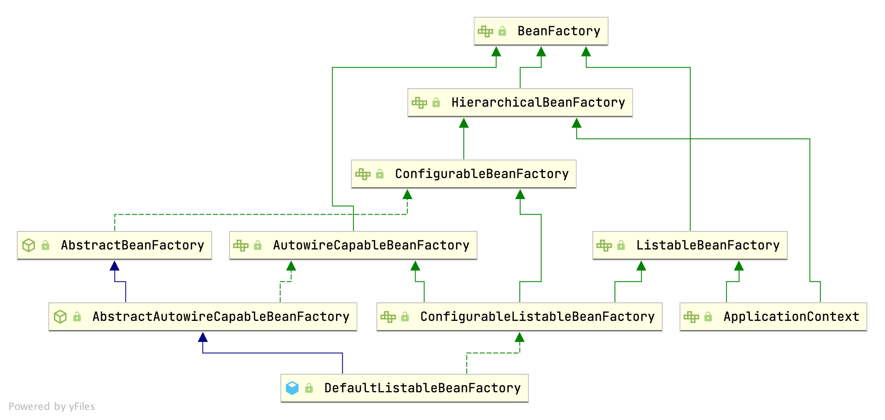

## Introduction

We'll introduce the concepts of `IoC` (Inversion of Control) and `DI` (Dependency Injection), as well as take a look at how these are implemented in the Spring framework.

Inversion of Control is a principle in software engineering which transfers the control of objects or portions of a program to a container or framework. We most often use it in the context of `OOP`(object-oriented programming).

n contrast with traditional programming, in which our custom code makes calls to a library, IoC enables a framework to take control of the flow of a program and make calls to our custom code. To enable this, frameworks use abstractions with additional behavior built in. **If we want to add our own behavior, we need to extend the classes of the framework or plugin our own classes.**

The advantages of this architecture are:

- decoupling the execution of a task from its implementation
- making it easier to switch between different implementations
- greater modularity of a program
- greater ease in testing a program by isolating a component or mocking its dependencies, and allowing components to communicate through contracts

We can achieve Inversion of Control through various mechanisms such as: Strategy design pattern, Service Locator pattern, Factory pattern, and Dependency Injection (DI).

### DI

Dependency injection is a pattern we can use to implement IoC, where the control being inverted is setting an object's dependencies.

**Dependency Injection in Spring can be done through constructors, setters or fields.**

- Constructor-Based Dependency Injection
- Setter-Based Dependency Injection
- Field-Based Dependency Injection @Autowired/ @Resource @Inject

*javax.annotation.Resource*

*javax.inject.Inject*

*org.springframework.beans.factory.annotation.Autowired*


The table below summarizes our discussion.

| Scenario                                                     | @Resource | @Inject | @Autowired |
| :----------------------------------------------------------- | --------- | ------- | ---------- |
| Application-wide use of singletons through polymorphism      | ✗         | ✔       | ✔          |
| Fine-grained application behavior configuration through polymorphism | ✔         | ✗       | ✗          |
| Dependency injection should be handled solely by the Jakarta EE platform | ✔         | ✔       | ✗          |
| Dependency injection should be handled solely by the Spring Framework | ✗         | ✗       | ✔          |


**using constructors to create object instances is more natural from the OOP standpoint.**

**with** **field injection, we can't enforce class-level invariants.**

Spring doesn't support constructor injection in an abstract class.


### BeanFactory Hierarchy



The interfaces *BeanFactory* and *ApplicationContext* **represent the Spring IoC container**. Here, *BeanFactory* is the root interface for accessing the Spring container. It provides basic functionalities for managing beans.

On the other hand, the *ApplicationContext* is a sub-interface of the *BeanFactory*. Hence, it offers all the functionalities of *BeanFactory.*

Furthermore, it **provides** **more enterprise-specific functionalities**. The important features of *ApplicationContext* are **resolving messages, supporting internationalization, publishing events, and application-layer specific contexts**. This is why we use it as the default Spring container.

In Spring, a [bean](https://www.baeldung.com/spring-bean) is **an object that the Spring container instantiates, assembles, and manages**.

So, should we configure all the objects of our application as Spring beans? Well, as a best practice, we should not.

As per [Spring documentation](https://docs.spring.io/spring/docs/current/spring-framework-reference/core.html#beans-factory-metadata), in general, we should define beans for service layer objects, data access objects (DAOs), presentation objects, infrastructure objects such as Hibernate *SessionFactories,* JMS Queues, and so forth.

Also, typically, we should not configure fine-grained domain objects in the container. It's usually the responsibility of DAOs and business logic to create and load domain objects.


### BeanFactory

BeanFactory接口定义了IoC容器最基本的形式 并且提供了IoC容器所应该遵守的最基本的服务契约 这也是我们使用IoC容器所应遵守的最底层和最基本的编程规范 这些接口定义勾画出了IoC的基本轮廓

```java
public interface BeanFactory {

	String FACTORY_BEAN_PREFIX = "&";

	Object getBean(String name) throws BeansException;

	<T> T getBean(String name, Class<T> requiredType) throws BeansException;

	Object getBean(String name, Object... args) throws BeansException;

	<T> T getBean(Class<T> requiredType) throws BeansException;

	<T> T getBean(Class<T> requiredType, Object... args) throws BeansException;

	<T> ObjectProvider<T> getBeanProvider(Class<T> requiredType);

	<T> ObjectProvider<T> getBeanProvider(ResolvableType requiredType);

	boolean containsBean(String name);

	boolean isSingleton(String name) throws NoSuchBeanDefinitionException;

	boolean isPrototype(String name) throws NoSuchBeanDefinitionException;

	boolean isTypeMatch(String name, ResolvableType typeToMatch) throws NoSuchBeanDefinitionException;

	boolean isTypeMatch(String name, Class<?> typeToMatch) throws NoSuchBeanDefinitionException;

	@Nullable
	Class<?> getType(String name) throws NoSuchBeanDefinitionException;

	@Nullable
	Class<?> getType(String name, boolean allowFactoryBeanInit) throws NoSuchBeanDefinitionException;

	String[] getAliases(String name);

}
```


### ApplicationContext

The Spring framework provides several implementations of the *ApplicationContext* interface: 

*ClassPathXmlApplicationContext* and *FileSystemXmlApplicationContext* for standalone applications, and *WebApplicationContext* for web applications.


### FactoryBean
Interface to be implemented by objects used within a BeanFactory which are themselves factories for individual objects. If a bean implements this interface, it is used as a factory for an object to expose, not directly as a bean instance that will be exposed itself.

**NB: A bean that implements this interface cannot be used as a normal bean.** A FactoryBean is defined in a bean style, but **the object exposed for bean references (getObject()) is always the object that it creates**.

FactoryBeans can support singletons and prototypes, and can either create objects lazily on demand or eagerly on startup. The SmartFactoryBean interface allows for exposing more fine-grained behavioral metadata.

This interface is heavily used within the framework itself, for example for the AOP org.springframework.aop.framework.ProxyFactoryBean or the org.springframework.jndi.JndiObjectFactoryBean. It can be used for custom components as well; however, this is only common for infrastructure code.

FactoryBean is a programmatic contract. Implementations are not supposed to rely on annotation-driven injection or other reflective facilities. getObjectType() getObject() invocations may arrive early in the bootstrap process, even ahead of any post-processor setup. If you need access to other beans, implement BeanFactoryAware and obtain them programmatically.

The container is only responsible for managing the lifecycle of the FactoryBean instance, not the lifecycle of the objects created by the FactoryBean. Therefore, a destroy method on an exposed bean object (such as java.io.Closeable.close() will not be called automatically. Instead, a FactoryBean should implement DisposableBean and delegate any such close call to the underlying object.

Finally, FactoryBean objects participate in the containing BeanFactory's synchronization of bean creation. There is usually no need for internal synchronization other than for purposes of lazy initialization within the FactoryBean itself (or the like).

```java
public interface FactoryBean<T> {

	String OBJECT_TYPE_ATTRIBUTE = "factoryBeanObjectType";

	@Nullable
	T getObject() throws Exception;

	@Nullable
	Class<?> getObjectType();

	default boolean isSingleton() {
		return true;
	}
}

```


## getBean
1. resolve aliases to canonical beanName
2. [eagerly check singleton cache](/docs/CS/Java/Spring/IoC.md?id=getSingleton), allows for an early reference to a currently created singleton (resolving a [circular reference](/docs/CS/Java/Spring/IoC.md?id=circular-references)). 
   1. [Get the object if the non-null bean instance](/docs/CS/Java/Spring/IoC.md?id=getObjectForBeanInstance)
3. or else check isPrototypeCurrentlyInCreation 
4. getBean from parentBeanFactory
5. merge BeanDefinition
6. check dependOn
7. [createBean](/docs/CS/Java/Spring/IoC.md?id=createBean)

```java
public abstract class AbstractBeanFactory extends FactoryBeanRegistrySupport implements ConfigurableBeanFactory {
 
  @Override
  public Object getBean(String name, Object... args) throws BeansException {
   return doGetBean(name, null, args, false);
  }
 
 
  protected <T> T doGetBean(
          String name, @Nullable Class<T> requiredType, @Nullable Object[] args, boolean typeCheckOnly)
          throws BeansException {
   // Return the bean name, stripping out the factory dereference prefix if necessary, and resolving aliases to canonical names.
   String beanName = transformedBeanName(name);
   Object bean;
 
   // Eagerly check singleton cache for manually registered singletons.
   Object sharedInstance = getSingleton(beanName);
   if (sharedInstance != null && args == null) {
    bean = getObjectForBeanInstance(sharedInstance, name, beanName, null);
   } else {
    // Fail if we're already creating this bean instance:
    // We're assumably within a circular reference.
    if (isPrototypeCurrentlyInCreation(beanName)) {
     throw new BeanCurrentlyInCreationException(beanName);
    }
 
    // Check if bean definition exists in this factory.
    BeanFactory parentBeanFactory = getParentBeanFactory();
    if (parentBeanFactory != null && !containsBeanDefinition(beanName)) {
     // Not found -> check parent.
     String nameToLookup = originalBeanName(name);
     if (parentBeanFactory instanceof AbstractBeanFactory) {
      return ((AbstractBeanFactory) parentBeanFactory).doGetBean(
              nameToLookup, requiredType, args, typeCheckOnly);
     } else if (args != null) {
      // Delegation to parent with explicit args.
      return (T) parentBeanFactory.getBean(nameToLookup, args);
     } else if (requiredType != null) {
      // No args -> delegate to standard getBean method.
      return parentBeanFactory.getBean(nameToLookup, requiredType);
     } else {
      return (T) parentBeanFactory.getBean(nameToLookup);
     }
    }
 
    if (!typeCheckOnly) {
     markBeanAsCreated(beanName);
    }
 
    try {
     RootBeanDefinition mbd = getMergedLocalBeanDefinition(beanName);
     checkMergedBeanDefinition(mbd, beanName, args);
 
     // Guarantee initialization of beans that the current bean depends on.
     String[] dependsOn = mbd.getDependsOn();
     if (dependsOn != null) {
      for (String dep : dependsOn) {
       if (isDependent(beanName, dep)) {
        throw new BeanCreationException(mbd.getResourceDescription(), beanName,
                "Circular depends-on relationship between '" + beanName + "' and '" + dep + "'");
       }
       registerDependentBean(dep, beanName);
       try {
        getBean(dep);
       } catch (NoSuchBeanDefinitionException ex) {
        throw new BeanCreationException(mbd.getResourceDescription(), beanName,
                "'" + beanName + "' depends on missing bean '" + dep + "'", ex);
       }
      }
     }
 
     // Create bean instance.
     if (mbd.isSingleton()) {
      sharedInstance = getSingleton(beanName, () -> {
       try {
        return createBean(beanName, mbd, args);
       } catch (BeansException ex) {
        // Explicitly remove instance from singleton cache: It might have been put there
        // eagerly by the creation process, to allow for circular reference resolution.
        // Also remove any beans that received a temporary reference to the bean.
        destroySingleton(beanName);
        throw ex;
       }
      });
      bean = getObjectForBeanInstance(sharedInstance, name, beanName, mbd);
     } else if (mbd.isPrototype()) {
      // It's a prototype -> create a new instance.
      Object prototypeInstance = null;
      try {
       beforePrototypeCreation(beanName);
       prototypeInstance = createBean(beanName, mbd, args);
      } finally {
       afterPrototypeCreation(beanName);
      }
      bean = getObjectForBeanInstance(prototypeInstance, name, beanName, mbd);
     } else {
      String scopeName = mbd.getScope();
      if (!StringUtils.hasLength(scopeName)) {
       throw new IllegalStateException("No scope name defined for bean ´" + beanName + "'");
      }
      Scope scope = this.scopes.get(scopeName);
      if (scope == null) {
       throw new IllegalStateException("No Scope registered for scope name '" + scopeName + "'");
      }
      try {
       Object scopedInstance = scope.get(beanName, () -> {
        beforePrototypeCreation(beanName);
        try {
         return createBean(beanName, mbd, args);
        } finally {
         afterPrototypeCreation(beanName);
        }
       });
       bean = getObjectForBeanInstance(scopedInstance, name, beanName, mbd);
      } catch (IllegalStateException ex) {
       throw new BeanCreationException(beanName,
               "Scope '" + scopeName + "' is not active for the current thread; consider " +
                       "defining a scoped proxy for this bean if you intend to refer to it from a singleton",
               ex);
      }
     }
    } catch (BeansException ex) {
     cleanupAfterBeanCreationFailure(beanName);
     throw ex;
    }
   }
 
   // Check if required type matches the type of the actual bean instance.
   if (requiredType != null && !requiredType.isInstance(bean)) {
    try {
     T convertedBean = getTypeConverter().convertIfNecessary(bean, requiredType);
     if (convertedBean == null) {
      throw new BeanNotOfRequiredTypeException(name, requiredType, bean.getClass());
     }
     return convertedBean;
    } catch (TypeMismatchException ex) {
     throw new BeanNotOfRequiredTypeException(name, requiredType, bean.getClass());
    }
   }
   return (T) bean;
  }
}
```


### getSingleton
Return the (raw) singleton object registered under the given name.
Checks already instantiated singletons and also allows for an early reference to a currently created singleton (resolving a circular reference).

1. get from singletonObjects
2. get from earlySingletonObjects, or null & allowEarlyReference
3. get singletonFactory from singletonFactories, use it create singletonObject to earlySingletonObjects, remove singletonFactory from singletonFactories

```java
// DefaultSingletonBeanRegistry
/** Cache of singleton objects: bean name to bean instance. */
private final Map<String, Object> singletonObjects = new ConcurrentHashMap<>(256);

/** Cache of singleton factories: bean name to ObjectFactory. */
private final Map<String, ObjectFactory<?>> singletonFactories = new HashMap<>(16);

/** Cache of early singleton objects: bean name to bean instance. */
private final Map<String, Object> earlySingletonObjects = new HashMap<>(16);

@Nullable
protected Object getSingleton(String beanName, boolean allowEarlyReference) {
   Object singletonObject = this.singletonObjects.get(beanName);
   if (singletonObject == null && isSingletonCurrentlyInCreation(beanName)) {
      synchronized (this.singletonObjects) {
         singletonObject = this.earlySingletonObjects.get(beanName);
         if (singletonObject == null && allowEarlyReference) {
            ObjectFactory<?> singletonFactory = this.singletonFactories.get(beanName);
            if (singletonFactory != null) {
               singletonObject = singletonFactory.getObject();
               this.earlySingletonObjects.put(beanName, singletonObject);
               this.singletonFactories.remove(beanName);
            }
         }
      }
   }
   return singletonObject;
}
```

#### circular references


```java
// DefaultSingletonBeanRegistry is superClass of AbstractBeanFactory
/**
 * Add the given singleton factory for building the specified singleton
 * if necessary.
 * <p>To be called for eager registration of singletons, e.g. to be able to
 * resolve circular references.
 */
 protected void addSingletonFactory(String beanName, ObjectFactory<?> singletonFactory) {
     Assert.notNull(singletonFactory, "Singleton factory must not be null");
     synchronized (this.singletonObjects) {
         if (!this.singletonObjects.containsKey(beanName)) {
             this.singletonFactories.put(beanName, singletonFactory);
             this.earlySingletonObjects.remove(beanName);
             this.registeredSingletons.add(beanName);
         }
     }
 }
```


1. isSingleton
2. allowCircularReferences
3. isSingletonCurrentlyInCreation

```java
// AbstractAutowireCapableBeanFactory#doCreateBean()
// Eagerly cache singletons to be able to resolve circular references
// even when triggered by lifecycle interfaces like BeanFactoryAware.
boolean earlySingletonExposure = (mbd.isSingleton() && this.allowCircularReferences &&
      isSingletonCurrentlyInCreation(beanName));
if (earlySingletonExposure) {
   addSingletonFactory(beanName, () -> getEarlyBeanReference(beanName, mbd, bean));
}

// Initialize the bean instance.
Object exposedObject = bean;
try {
   populateBean(beanName, mbd, instanceWrapper);
   exposedObject = initializeBean(beanName, exposedObject, mbd);
}
catch (Throwable ex) {
  ...
}

if (earlySingletonExposure) {
   Object earlySingletonReference = getSingleton(beanName, false);
   if (earlySingletonReference != null) {
      if (exposedObject == bean) {
         exposedObject = earlySingletonReference; // check proxy instance
      }
      else if (!this.allowRawInjectionDespiteWrapping && hasDependentBean(beanName)) {
         String[] dependentBeans = getDependentBeans(beanName);
         Set<String> actualDependentBeans = new LinkedHashSet<>(dependentBeans.length);
         for (String dependentBean : dependentBeans) {
            if (!removeSingletonIfCreatedForTypeCheckOnly(dependentBean)) {
               actualDependentBeans.add(dependentBean);
            }
         }
         if (!actualDependentBeans.isEmpty()) {
            throw new BeanCurrentlyInCreationException("");
         }
      }
   }
}
```

proxy instance circular reference
by checking different instance


@DependsOn circular reference
check isDependent in `doGetBean()`


@Lazy
@DependsOn
change load bean order


### getObjectForBeanInstance

Get the object for the given bean instance, either the bean instance itself or its created object in case of a FactoryBean.
```java
protected Object getObjectForBeanInstance(
      Object beanInstance, String name, String beanName, @Nullable RootBeanDefinition mbd) {

   // Don't let calling code try to dereference the factory if the bean isn't a factory.
   if (BeanFactoryUtils.isFactoryDereference(name)) {
      if (beanInstance instanceof NullBean) {
         return beanInstance;
      }
      if (!(beanInstance instanceof FactoryBean)) {
         throw new BeanIsNotAFactoryException(beanName, beanInstance.getClass());
      }
      if (mbd != null) {
         mbd.isFactoryBean = true;
      }
      return beanInstance;
   }

   // Now we have the bean instance, which may be a normal bean or a FactoryBean.
   // If it's a FactoryBean, we use it to create a bean instance, unless the
   // caller actually wants a reference to the factory.
   if (!(beanInstance instanceof FactoryBean)) {
      return beanInstance;
   }

   Object object = null;
   if (mbd != null) {
      mbd.isFactoryBean = true;
   }
   else {
      object = getCachedObjectForFactoryBean(beanName);
   }
   if (object == null) {
      // Return bean instance from factory.
      FactoryBean<?> factory = (FactoryBean<?>) beanInstance;
      // Caches object obtained from FactoryBean if it is a singleton.
      if (mbd == null && containsBeanDefinition(beanName)) {
         mbd = getMergedLocalBeanDefinition(beanName);
      }
      boolean synthetic = (mbd != null && mbd.isSynthetic());
      object = getObjectFromFactoryBean(factory, beanName, !synthetic);
   }
   return object;
}
```

#### getObjectFromFactoryBean

```java
/**
 * Obtain an object to expose from the given FactoryBean.
 * @param factory the FactoryBean instance
 * @param beanName the name of the bean
 * @param shouldPostProcess whether the bean is subject to post-processing
 * @return the object obtained from the FactoryBean
 * @throws BeanCreationException if FactoryBean object creation failed
 * @see org.springframework.beans.factory.FactoryBean#getObject()
 */
protected Object getObjectFromFactoryBean(FactoryBean<?> factory, String beanName, boolean shouldPostProcess) {
   if (factory.isSingleton() && containsSingleton(beanName)) {
      synchronized (getSingletonMutex()) {
         Object object = this.factoryBeanObjectCache.get(beanName);
         if (object == null) {
            object = doGetObjectFromFactoryBean(factory, beanName);
            // Only post-process and store if not put there already during getObject() call above
            // (e.g. because of circular reference processing triggered by custom getBean calls)
            Object alreadyThere = this.factoryBeanObjectCache.get(beanName);
            if (alreadyThere != null) {
               object = alreadyThere;
            }
            else {
               if (shouldPostProcess) {
                  if (isSingletonCurrentlyInCreation(beanName)) {
                     // Temporarily return non-post-processed object, not storing it yet..
                     return object;
                  }
                  beforeSingletonCreation(beanName);
                  try {
                     object = postProcessObjectFromFactoryBean(object, beanName);
                  }
                  catch (Throwable ex) {
                     throw new BeanCreationException(beanName,
                           "Post-processing of FactoryBean's singleton object failed", ex);
                  }
                  finally {
                     afterSingletonCreation(beanName);
                  }
               }
               if (containsSingleton(beanName)) {
                  this.factoryBeanObjectCache.put(beanName, object);
               }
            }
         }
         return object;
      }
   }
   else {
      Object object = doGetObjectFromFactoryBean(factory, beanName);
      if (shouldPostProcess) {
         try {
            object = postProcessObjectFromFactoryBean(object, beanName);
         }
         catch (Throwable ex) {
            throw new BeanCreationException(beanName, "Post-processing of FactoryBean's object failed", ex);
         }
      }
      return object;
   }
}
```


```java
/**
 * Callback before singleton creation.
 * <p>The default implementation register the singleton as currently in creation.
 * @param beanName the name of the singleton about to be created
 * @see #isSingletonCurrentlyInCreation
 */
protected void beforeSingletonCreation(String beanName) {
   if (!this.inCreationCheckExclusions.contains(beanName) && !this.singletonsCurrentlyInCreation.add(beanName)) {
      throw new BeanCurrentlyInCreationException(beanName);
   }
}

/**
 * Callback after singleton creation.
 * <p>The default implementation marks the singleton as not in creation anymore.
 * @param beanName the name of the singleton that has been created
 * @see #isSingletonCurrentlyInCreation
 */
protected void afterSingletonCreation(String beanName) {
   if (!this.inCreationCheckExclusions.contains(beanName) && !this.singletonsCurrentlyInCreation.remove(beanName)) {
      throw new IllegalStateException("Singleton '" + beanName + "' isn't currently in creation");
   }
}
```


#### postProcessObjectFromFactoryBean

call [BeanPostProcessor](/docs/CS/Java/Spring/IoC.md?id=PostBean)

```java
/**
 * Applies the {@code postProcessAfterInitialization} callback of all
 * registered BeanPostProcessors, giving them a chance to post-process the
 * object obtained from FactoryBeans (for example, to auto-proxy them).
 * @see #applyBeanPostProcessorsAfterInitialization
 */
@Override
protected Object postProcessObjectFromFactoryBean(Object object, String beanName) {
   return applyBeanPostProcessorsAfterInitialization(object, beanName);
}
```

#### postBean
```java
public abstract class AbstractAutowireCapableBeanFactory extends AbstractBeanFactory
        implements AutowireCapableBeanFactory {
    
  @Override
  public Object applyBeanPostProcessorsAfterInitialization(Object existingBean, String beanName)
          throws BeansException {
 
   Object result = existingBean;
   for (BeanPostProcessor processor : getBeanPostProcessors()) {
    Object current = processor.postProcessAfterInitialization(result, beanName);
    if (current == null) {
     return result;
    }
    result = current;
   }
   return result;
  }
 }
```


##### BeanPostProcessor

Factory hook that allows for custom modification of new bean instances — for example, checking for marker interfaces or [wrapping beans with proxies(AOP)](/docs/CS/Java/Spring/AOP.md?id=createProxy).

Typically, post-processors that populate beans via marker interfaces or the like will implement postProcessBeforeInitialization, while post-processors that wrap beans with proxies will normally implement postProcessAfterInitialization.

Registration
An ApplicationContext can autodetect BeanPostProcessor beans in its bean definitions and apply those post-processors to any beans subsequently created. A plain BeanFactory allows for programmatic registration of post-processors, applying them to all beans created through the bean factory.

Ordering
BeanPostProcessor beans that are autodetected in an ApplicationContext will be ordered according to `org.springframework.core.PriorityOrdered` and `org.springframework.core.Ordered` semantics. In contrast, BeanPostProcessor beans that are registered programmatically with a BeanFactory will be applied in the order of registration; any ordering semantics expressed through implementing the PriorityOrdered or Ordered interface will be ignored for programmatically registered post-processors. Furthermore, the @Order annotation is not taken into account for BeanPostProcessor beans.

```java
public interface BeanPostProcessor {
    
   @Nullable
   default Object postProcessBeforeInitialization(Object bean, String beanName) throws BeansException {
      return bean;
   }
   
   @Nullable
   default Object postProcessAfterInitialization(Object bean, String beanName) throws BeansException {
      return bean;
   }

}
```


### createBean
1. Prepare method overrides
2. resolveBeforeInstantiation(AOP) if bean not null
3. doCreateBean

```java
// AbstractAutowireCapableBeanFactory
protected Object createBean(String beanName, RootBeanDefinition mbd, @Nullable Object[] args)
			throws BeanCreationException {
		RootBeanDefinition mbdToUse = mbd;

		// Make sure bean class is actually resolved at this point, and
		// clone the bean definition in case of a dynamically resolved Class
		// which cannot be stored in the shared merged bean definition.
		Class<?> resolvedClass = resolveBeanClass(mbd, beanName);
		if (resolvedClass != null && !mbd.hasBeanClass() && mbd.getBeanClassName() != null) {
			mbdToUse = new RootBeanDefinition(mbd);
			mbdToUse.setBeanClass(resolvedClass);
		}

		// Prepare method overrides.
		try {
			mbdToUse.prepareMethodOverrides();
		}
		catch (BeanDefinitionValidationException ex) {
			throw new BeanDefinitionStoreException(mbdToUse.getResourceDescription(),
					beanName, "Validation of method overrides failed", ex);
		}

		try {
			// Give BeanPostProcessors a chance to return a proxy instead of the target bean instance.
			Object bean = resolveBeforeInstantiation(beanName, mbdToUse);
			if (bean != null) {
				return bean;
			}
		}
		catch (Throwable ex) {
			throw new BeanCreationException(mbdToUse.getResourceDescription(), beanName,
					"BeanPostProcessor before instantiation of bean failed", ex);
		}

		try {
			Object beanInstance = doCreateBean(beanName, mbdToUse, args);
			return beanInstance;
		}
		catch (BeanCreationException | ImplicitlyAppearedSingletonException ex) {
			// A previously detected exception with proper bean creation context already,
			// or illegal singleton state to be communicated up to DefaultSingletonBeanRegistry.
			throw ex;
		}
		catch (Throwable ex) {
			throw new BeanCreationException(
					mbdToUse.getResourceDescription(), beanName, "Unexpected exception during bean creation", ex);
		}
	}
```

#### resolveBeforeInstantiation
Apply before-instantiation post-processors, resolving whether there is a before-instantiation shortcut for the specified bean.

call [BeanPostProcessor](/docs/CS/Java/Spring/IoC.md?id=postBean) if bean != null.
```java
@Nullable
protected Object resolveBeforeInstantiation(String beanName, RootBeanDefinition mbd) {
   Object bean = null;
   if (!Boolean.FALSE.equals(mbd.beforeInstantiationResolved)) {
      // Make sure bean class is actually resolved at this point.
      if (!mbd.isSynthetic() && hasInstantiationAwareBeanPostProcessors()) {
         Class<?> targetType = determineTargetType(beanName, mbd);
         if (targetType != null) {
            bean = applyBeanPostProcessorsBeforeInstantiation(targetType, beanName);
            if (bean != null) {
               bean = applyBeanPostProcessorsAfterInitialization(bean, beanName);
            }
         }
      }
      mbd.beforeInstantiationResolved = (bean != null);
   }
   return bean;
}
```


#### isSingleton

```java
@Override
public boolean isSingleton(String name) throws NoSuchBeanDefinitionException {
   String beanName = transformedBeanName(name);

   Object beanInstance = getSingleton(beanName, false);
   if (beanInstance != null) {
      if (beanInstance instanceof FactoryBean) {
         return (BeanFactoryUtils.isFactoryDereference(name) || ((FactoryBean<?>) beanInstance).isSingleton());
      }
      else {
         return !BeanFactoryUtils.isFactoryDereference(name);
      }
   }

   // No singleton instance found -> check bean definition.
   BeanFactory parentBeanFactory = getParentBeanFactory();
   if (parentBeanFactory != null && !containsBeanDefinition(beanName)) {
      // No bean definition found in this factory -> delegate to parent.
      return parentBeanFactory.isSingleton(originalBeanName(name));
   }

   RootBeanDefinition mbd = getMergedLocalBeanDefinition(beanName);

   // In case of FactoryBean, return singleton status of created object if not a dereference.
   if (mbd.isSingleton()) {
      if (isFactoryBean(beanName, mbd)) {
         if (BeanFactoryUtils.isFactoryDereference(name)) {
            return true;
         }
         FactoryBean<?> factoryBean = (FactoryBean<?>) getBean(FACTORY_BEAN_PREFIX + beanName);
         return factoryBean.isSingleton();
      }
      else {
         return !BeanFactoryUtils.isFactoryDereference(name);
      }
   }
   else {
      return false;
   }
}
```


#### doCreateBean

1. createBeanInstance
2. postProcessor
3. populateBean
```java
protected Object doCreateBean(String beanName, RootBeanDefinition mbd, @Nullable Object[] args)
			throws BeanCreationException {

		// Instantiate the bean.
		BeanWrapper instanceWrapper = null;
		if (mbd.isSingleton()) {
			instanceWrapper = this.factoryBeanInstanceCache.remove(beanName);
		}
		if (instanceWrapper == null) {
			instanceWrapper = createBeanInstance(beanName, mbd, args);
		}
		Object bean = instanceWrapper.getWrappedInstance();
		Class<?> beanType = instanceWrapper.getWrappedClass();
		if (beanType != NullBean.class) {
			mbd.resolvedTargetType = beanType;
		}

		// Allow post-processors to modify the merged bean definition.
		synchronized (mbd.postProcessingLock) {
			if (!mbd.postProcessed) {
				try {
					applyMergedBeanDefinitionPostProcessors(mbd, beanType, beanName);
				}
				catch (Throwable ex) {
					throw new BeanCreationException(mbd.getResourceDescription(), beanName,
							"Post-processing of merged bean definition failed", ex);
				}
				mbd.postProcessed = true;
			}
		}

		// Eagerly cache singletons to be able to resolve circular references
		// even when triggered by lifecycle interfaces like BeanFactoryAware.
		boolean earlySingletonExposure = (mbd.isSingleton() && this.allowCircularReferences &&
				isSingletonCurrentlyInCreation(beanName));
		if (earlySingletonExposure) {
			if (logger.isTraceEnabled()) {
				logger.trace("Eagerly caching bean '" + beanName +
						"' to allow for resolving potential circular references");
			}
			addSingletonFactory(beanName, () -> getEarlyBeanReference(beanName, mbd, bean));
		}

		// Initialize the bean instance.
		Object exposedObject = bean;
		try {
			populateBean(beanName, mbd, instanceWrapper);
			exposedObject = initializeBean(beanName, exposedObject, mbd);
		}
		catch (Throwable ex) {
			if (ex instanceof BeanCreationException && beanName.equals(((BeanCreationException) ex).getBeanName())) {
				throw (BeanCreationException) ex;
			}
			else {
				throw new BeanCreationException(
						mbd.getResourceDescription(), beanName, "Initialization of bean failed", ex);
			}
		}

		if (earlySingletonExposure) {
			Object earlySingletonReference = getSingleton(beanName, false);
			if (earlySingletonReference != null) {
				if (exposedObject == bean) {
					exposedObject = earlySingletonReference;
				}
				else if (!this.allowRawInjectionDespiteWrapping && hasDependentBean(beanName)) {
					String[] dependentBeans = getDependentBeans(beanName);
					Set<String> actualDependentBeans = new LinkedHashSet<>(dependentBeans.length);
					for (String dependentBean : dependentBeans) {
						if (!removeSingletonIfCreatedForTypeCheckOnly(dependentBean)) {
							actualDependentBeans.add(dependentBean);
						}
					}
					if (!actualDependentBeans.isEmpty()) {
						throw new BeanCurrentlyInCreationException(beanName,
								"Bean with name '" + beanName + "' has been injected into other beans [" +
								StringUtils.collectionToCommaDelimitedString(actualDependentBeans) +
								"] in its raw version as part of a circular reference, but has eventually been " +
								"wrapped. This means that said other beans do not use the final version of the " +
								"bean. This is often the result of over-eager type matching - consider using " +
								"'getBeanNamesForType' with the 'allowEagerInit' flag turned off, for example.");
					}
				}
			}
		}

		// Register bean as disposable.
		try {
			registerDisposableBeanIfNecessary(beanName, bean, mbd);
		}
		catch (BeanDefinitionValidationException ex) {
			throw new BeanCreationException(
					mbd.getResourceDescription(), beanName, "Invalid destruction signature", ex);
		}

		return exposedObject;
	}
```


#### createBeanInstance

```java
protected BeanWrapper createBeanInstance(String beanName, RootBeanDefinition mbd, @Nullable Object[] args) {
		// Make sure bean class is actually resolved at this point.
		Class<?> beanClass = resolveBeanClass(mbd, beanName);

		if (beanClass != null && !Modifier.isPublic(beanClass.getModifiers()) && !mbd.isNonPublicAccessAllowed()) {
			throw new BeanCreationException(mbd.getResourceDescription(), beanName,
					"Bean class isn't public, and non-public access not allowed: " + beanClass.getName());
		}

		Supplier<?> instanceSupplier = mbd.getInstanceSupplier();
		if (instanceSupplier != null) {
			return obtainFromSupplier(instanceSupplier, beanName);
		}

		if (mbd.getFactoryMethodName() != null) {
			return instantiateUsingFactoryMethod(beanName, mbd, args);
		}

		// Shortcut when re-creating the same bean...
		boolean resolved = false;
		boolean autowireNecessary = false;
		if (args == null) {
			synchronized (mbd.constructorArgumentLock) {
				if (mbd.resolvedConstructorOrFactoryMethod != null) {
					resolved = true;
					autowireNecessary = mbd.constructorArgumentsResolved;
				}
			}
		}
		if (resolved) {
			if (autowireNecessary) {
				return autowireConstructor(beanName, mbd, null, null);
			}
			else {
				return instantiateBean(beanName, mbd);
			}
		}

		// Candidate constructors for autowiring?
		Constructor<?>[] ctors = determineConstructorsFromBeanPostProcessors(beanClass, beanName);
		if (ctors != null || mbd.getResolvedAutowireMode() == AUTOWIRE_CONSTRUCTOR ||
				mbd.hasConstructorArgumentValues() || !ObjectUtils.isEmpty(args)) {
			return autowireConstructor(beanName, mbd, ctors, args);
		}

		// Preferred constructors for default construction?
		ctors = mbd.getPreferredConstructors();
		if (ctors != null) {
			return autowireConstructor(beanName, mbd, ctors, null);
		}

		// No special handling: simply use no-arg constructor.
		return instantiateBean(beanName, mbd);
	}
```

#### instantiateBean

```java
protected BeanWrapper instantiateBean(String beanName, RootBeanDefinition mbd) {
		try {
			Object beanInstance;
			if (System.getSecurityManager() != null) {
				beanInstance = AccessController.doPrivileged(
						(PrivilegedAction<Object>) () -> getInstantiationStrategy().instantiate(mbd, beanName, this),
						getAccessControlContext());
			}
			else {
				beanInstance = getInstantiationStrategy().instantiate(mbd, beanName, this);
			}
			BeanWrapper bw = new BeanWrapperImpl(beanInstance);
			initBeanWrapper(bw);
			return bw;
		}
		catch (Throwable ex) {
			throw new BeanCreationException(
					mbd.getResourceDescription(), beanName, "Instantiation of bean failed", ex);
		}
	}
```


```java
// SimpleInstantiationStrategy
	@Override
	public Object instantiate(RootBeanDefinition bd, @Nullable String beanName, BeanFactory owner) {
		// Don't override the class with CGLIB if no overrides.
		if (!bd.hasMethodOverrides()) {
			Constructor<?> constructorToUse;
			synchronized (bd.constructorArgumentLock) {
				constructorToUse = (Constructor<?>) bd.resolvedConstructorOrFactoryMethod;
				if (constructorToUse == null) {
					final Class<?> clazz = bd.getBeanClass();
					if (clazz.isInterface()) {
						throw new BeanInstantiationException(clazz, "Specified class is an interface");
					}
					try {
						if (System.getSecurityManager() != null) {
							constructorToUse = AccessController.doPrivileged(
									(PrivilegedExceptionAction<Constructor<?>>) clazz::getDeclaredConstructor);
						}
						else {
							constructorToUse = clazz.getDeclaredConstructor();
						}
						bd.resolvedConstructorOrFactoryMethod = constructorToUse;
					}
					catch (Throwable ex) {
						throw new BeanInstantiationException(clazz, "No default constructor found", ex);
					}
				}
			}
			return BeanUtils.instantiateClass(constructorToUse);
		}
		else {
			// Must generate CGLIB subclass. or else throw new UnsupportedOperationException
			return instantiateWithMethodInjection(bd, beanName, owner);
		}
	}
```


```java
// CglibSubclassingInstantiationStrategy
@Override
	protected Object instantiateWithMethodInjection(RootBeanDefinition bd, @Nullable String beanName, BeanFactory owner,
			@Nullable Constructor<?> ctor, Object... args) {

		// Must generate CGLIB subclass...
		return new CglibSubclassCreator(bd, owner).instantiate(ctor, args);
	}
```


```java
/** CglibSubclassingInstantiationStrategy.CglibSubclassCreator
 * Create a new instance of a dynamically generated subclass implementing the
 * required lookups.
 * @param ctor constructor to use. If this is {@code null}, use the
 * no-arg constructor (no parameterization, or Setter Injection)
 * @param args arguments to use for the constructor.
 * Ignored if the {@code ctor} parameter is {@code null}.
 * @return new instance of the dynamically generated subclass
 */
public Object instantiate(@Nullable Constructor<?> ctor, Object... args) {
   Class<?> subclass = createEnhancedSubclass(this.beanDefinition);
   Object instance;
   if (ctor == null) {
      instance = BeanUtils.instantiateClass(subclass);
   }
   else {
      try {
         Constructor<?> enhancedSubclassConstructor = subclass.getConstructor(ctor.getParameterTypes());
         instance = enhancedSubclassConstructor.newInstance(args);
      }
      catch (Exception ex) {
         throw new BeanInstantiationException(this.beanDefinition.getBeanClass(),
               "Failed to invoke constructor for CGLIB enhanced subclass [" + subclass.getName() + "]", ex);
      }
   }
   // SPR-10785: set callbacks directly on the instance instead of in the
   // enhanced class (via the Enhancer) in order to avoid memory leaks.
   Factory factory = (Factory) instance;
   factory.setCallbacks(new Callback[] {NoOp.INSTANCE,
         new LookupOverrideMethodInterceptor(this.beanDefinition, this.owner),
         new ReplaceOverrideMethodInterceptor(this.beanDefinition, this.owner)});
   return instance;
}

/**
 * Create an enhanced subclass of the bean class for the provided bean
 * definition, using CGLIB.
 */
private Class<?> createEnhancedSubclass(RootBeanDefinition beanDefinition) {
   Enhancer enhancer = new Enhancer();
   enhancer.setSuperclass(beanDefinition.getBeanClass());
   enhancer.setNamingPolicy(SpringNamingPolicy.INSTANCE);
   if (this.owner instanceof ConfigurableBeanFactory) {
      ClassLoader cl = ((ConfigurableBeanFactory) this.owner).getBeanClassLoader();
      enhancer.setStrategy(new ClassLoaderAwareGeneratorStrategy(cl));
   }
   enhancer.setCallbackFilter(new MethodOverrideCallbackFilter(beanDefinition));
   enhancer.setCallbackTypes(CALLBACK_TYPES);
   return enhancer.createClass();
}
```

#### markBeanAsCreated

```java
/**
 * Mark the specified bean as already created (or about to be created).
 * <p>This allows the bean factory to optimize its caching for repeated
 * creation of the specified bean.
 * @param beanName the name of the bean
 */
protected void markBeanAsCreated(String beanName) {
   if (!this.alreadyCreated.contains(beanName)) {
      synchronized (this.mergedBeanDefinitions) {
         if (!this.alreadyCreated.contains(beanName)) {
            // Let the bean definition get re-merged now that we're actually creating
            // the bean... just in case some of its metadata changed in the meantime.
            clearMergedBeanDefinition(beanName);
            this.alreadyCreated.add(beanName);
         }
      }
   }
}


/**
	 * Remove the merged bean definition for the specified bean,
	 * recreating it on next access.
	 * @param beanName the bean name to clear the merged definition for
	 */
protected void clearMergedBeanDefinition(String beanName) {
  RootBeanDefinition bd = this.mergedBeanDefinitions.get(beanName);
  if (bd != null) {
    bd.stale = true;
  }
}


/** Determines if the definition needs to be re-merged. */
volatile boolean stale;
```


#### getMergedLocalBeanDefinition

```java
/**
 * Return a merged RootBeanDefinition, traversing the parent bean definition
 * if the specified bean corresponds to a child bean definition.
 * @param beanName the name of the bean to retrieve the merged definition for
 * @return a (potentially merged) RootBeanDefinition for the given bean
 * @throws NoSuchBeanDefinitionException if there is no bean with the given name
 * @throws BeanDefinitionStoreException in case of an invalid bean definition
 */
protected RootBeanDefinition getMergedLocalBeanDefinition(String beanName) throws BeansException {
   // Quick check on the concurrent map first, with minimal locking.
   RootBeanDefinition mbd = this.mergedBeanDefinitions.get(beanName);
   if (mbd != null && !mbd.stale) {
      return mbd;
   }
   return getMergedBeanDefinition(beanName, getBeanDefinition(beanName));
}

```


```java
/**
 * Return a RootBeanDefinition for the given top-level bean, by merging with
 * the parent if the given bean's definition is a child bean definition.
 * @param beanName the name of the bean definition
 * @param bd the original bean definition (Root/ChildBeanDefinition)
 * @return a (potentially merged) RootBeanDefinition for the given bean
 * @throws BeanDefinitionStoreException in case of an invalid bean definition
 */
protected RootBeanDefinition getMergedBeanDefinition(String beanName, BeanDefinition bd)
      throws BeanDefinitionStoreException {

   return getMergedBeanDefinition(beanName, bd, null);
}
```


```java
/**
 * Return a RootBeanDefinition for the given bean, by merging with the
 * parent if the given bean's definition is a child bean definition.
 * @param beanName the name of the bean definition
 * @param bd the original bean definition (Root/ChildBeanDefinition)
 * @param containingBd the containing bean definition in case of inner bean,
 * or {@code null} in case of a top-level bean
 * @return a (potentially merged) RootBeanDefinition for the given bean
 * @throws BeanDefinitionStoreException in case of an invalid bean definition
 */
protected RootBeanDefinition getMergedBeanDefinition(
      String beanName, BeanDefinition bd, @Nullable BeanDefinition containingBd)
      throws BeanDefinitionStoreException {

   synchronized (this.mergedBeanDefinitions) {
      RootBeanDefinition mbd = null;
      RootBeanDefinition previous = null;

      // Check with full lock now in order to enforce the same merged instance.
      if (containingBd == null) {
         mbd = this.mergedBeanDefinitions.get(beanName);
      }

      if (mbd == null || mbd.stale) {
         previous = mbd;
         if (bd.getParentName() == null) {
            // Use copy of given root bean definition.
            if (bd instanceof RootBeanDefinition) {
               mbd = ((RootBeanDefinition) bd).cloneBeanDefinition();
            }
            else {
               mbd = new RootBeanDefinition(bd);
            }
         }
         else {
            // Child bean definition: needs to be merged with parent.
            BeanDefinition pbd;
            try {
               String parentBeanName = transformedBeanName(bd.getParentName());
               if (!beanName.equals(parentBeanName)) {
                  pbd = getMergedBeanDefinition(parentBeanName);
               }
               else {
                  BeanFactory parent = getParentBeanFactory();
                  if (parent instanceof ConfigurableBeanFactory) {
                     pbd = ((ConfigurableBeanFactory) parent).getMergedBeanDefinition(parentBeanName);
                  }
                  else {
                     throw new NoSuchBeanDefinitionException(parentBeanName,
                           "Parent name '" + parentBeanName + "' is equal to bean name '" + beanName +
                           "': cannot be resolved without a ConfigurableBeanFactory parent");
                  }
               }
            }
            catch (NoSuchBeanDefinitionException ex) {
               throw new BeanDefinitionStoreException(bd.getResourceDescription(), beanName,
                     "Could not resolve parent bean definition '" + bd.getParentName() + "'", ex);
            }
            // Deep copy with overridden values.
            mbd = new RootBeanDefinition(pbd);
            mbd.overrideFrom(bd);
         }

         // Set default singleton scope, if not configured before.
         if (!StringUtils.hasLength(mbd.getScope())) {
            mbd.setScope(SCOPE_SINGLETON);
         }

         // A bean contained in a non-singleton bean cannot be a singleton itself.
         // Let's correct this on the fly here, since this might be the result of
         // parent-child merging for the outer bean, in which case the original inner bean
         // definition will not have inherited the merged outer bean's singleton status.
         if (containingBd != null && !containingBd.isSingleton() && mbd.isSingleton()) {
            mbd.setScope(containingBd.getScope());
         }

         // Cache the merged bean definition for the time being
         // (it might still get re-merged later on in order to pick up metadata changes)
         if (containingBd == null && isCacheBeanMetadata()) {
            this.mergedBeanDefinitions.put(beanName, mbd);
         }
      }
      if (previous != null) {
         copyRelevantMergedBeanDefinitionCaches(previous, mbd);
      }
      return mbd;
   }
}
```


#### checkMergedBeanDefinition


```java
/**
 * Check the given merged bean definition,
 * potentially throwing validation exceptions.
 * @param mbd the merged bean definition to check
 * @param beanName the name of the bean
 * @param args the arguments for bean creation, if any
 * @throws BeanDefinitionStoreException in case of validation failure
 */
protected void checkMergedBeanDefinition(RootBeanDefinition mbd, String beanName, @Nullable Object[] args)
      throws BeanDefinitionStoreException {

   if (mbd.isAbstract()) {
      throw new BeanIsAbstractException(beanName);
   }
}
```


#### registerDependentBean

```java
/**
 * Register a dependent bean for the given bean,
 * to be destroyed before the given bean is destroyed.
 * @param beanName the name of the bean
 * @param dependentBeanName the name of the dependent bean
 */
public void registerDependentBean(String beanName, String dependentBeanName) {
   String canonicalName = canonicalName(beanName);

   synchronized (this.dependentBeanMap) {
      Set<String> dependentBeans =
            this.dependentBeanMap.computeIfAbsent(canonicalName, k -> new LinkedHashSet<>(8));
      if (!dependentBeans.add(dependentBeanName)) {
         return;
      }
   }

   synchronized (this.dependenciesForBeanMap) {
      Set<String> dependenciesForBean =
            this.dependenciesForBeanMap.computeIfAbsent(dependentBeanName, k -> new LinkedHashSet<>(8));
      dependenciesForBean.add(canonicalName);
   }
}
```

#### isDependent

```java

/** Map between dependent bean names: bean name to Set of dependent bean names. */
private final Map<String, Set<String>> dependentBeanMap = new ConcurrentHashMap<>(64);

/**
 * Determine whether the specified dependent bean has been registered as
 * dependent on the given bean or on any of its transitive dependencies.
 * @param beanName the name of the bean to check
 * @param dependentBeanName the name of the dependent bean
 * @since 4.0
 */
protected boolean isDependent(String beanName, String dependentBeanName) {
   synchronized (this.dependentBeanMap) {
      return isDependent(beanName, dependentBeanName, null);
   }
}


private boolean isDependent(String beanName, String dependentBeanName, @Nullable Set<String> alreadySeen) {
  if (alreadySeen != null && alreadySeen.contains(beanName)) {
    return false;
  }
  String canonicalName = canonicalName(beanName);
  Set<String> dependentBeans = this.dependentBeanMap.get(canonicalName);
  if (dependentBeans == null) {
    return false;
  }
  if (dependentBeans.contains(dependentBeanName)) {
    return true;
  }
  for (String transitiveDependency : dependentBeans) {
    if (alreadySeen == null) {
      alreadySeen = new HashSet<>();
    }
    alreadySeen.add(beanName);
    if (isDependent(transitiveDependency, dependentBeanName, alreadySeen)) {
      return true;
    }
  }
  return false;
}
```


#### populateBean


```java
/**
 * Populate the bean instance in the given BeanWrapper with the property values
 * from the bean definition.
 * @param beanName the name of the bean
 * @param mbd the bean definition for the bean
 * @param bw the BeanWrapper with bean instance
 */
@SuppressWarnings("deprecation")  // for postProcessPropertyValues
protected void populateBean(String beanName, RootBeanDefinition mbd, @Nullable BeanWrapper bw) {
   if (bw == null) {
      if (mbd.hasPropertyValues()) {
         throw new BeanCreationException(
               mbd.getResourceDescription(), beanName, "Cannot apply property values to null instance");
      }
      else {
         // Skip property population phase for null instance.
         return;
      }
   }

   // Give any InstantiationAwareBeanPostProcessors the opportunity to modify the
   // state of the bean before properties are set. This can be used, for example,
   // to support styles of field injection.
   if (!mbd.isSynthetic() && hasInstantiationAwareBeanPostProcessors()) {
      for (InstantiationAwareBeanPostProcessor bp : getBeanPostProcessorCache().instantiationAware) {
         if (!bp.postProcessAfterInstantiation(bw.getWrappedInstance(), beanName)) {
            return;
         }
      }
   }

   PropertyValues pvs = (mbd.hasPropertyValues() ? mbd.getPropertyValues() : null);

   int resolvedAutowireMode = mbd.getResolvedAutowireMode();
   if (resolvedAutowireMode == AUTOWIRE_BY_NAME || resolvedAutowireMode == AUTOWIRE_BY_TYPE) {
      MutablePropertyValues newPvs = new MutablePropertyValues(pvs);
      // Add property values based on autowire by name if applicable.
      if (resolvedAutowireMode == AUTOWIRE_BY_NAME) {
         autowireByName(beanName, mbd, bw, newPvs);
      }
      // Add property values based on autowire by type if applicable.
      if (resolvedAutowireMode == AUTOWIRE_BY_TYPE) {
         autowireByType(beanName, mbd, bw, newPvs);
      }
      pvs = newPvs;
   }

   boolean hasInstAwareBpps = hasInstantiationAwareBeanPostProcessors();
   boolean needsDepCheck = (mbd.getDependencyCheck() != AbstractBeanDefinition.DEPENDENCY_CHECK_NONE);

   PropertyDescriptor[] filteredPds = null;
   if (hasInstAwareBpps) {
      if (pvs == null) {
         pvs = mbd.getPropertyValues();
      }
      for (InstantiationAwareBeanPostProcessor bp : getBeanPostProcessorCache().instantiationAware) {
         PropertyValues pvsToUse = bp.postProcessProperties(pvs, bw.getWrappedInstance(), beanName);
         if (pvsToUse == null) {
            if (filteredPds == null) {
               filteredPds = filterPropertyDescriptorsForDependencyCheck(bw, mbd.allowCaching);
            }
            pvsToUse = bp.postProcessPropertyValues(pvs, filteredPds, bw.getWrappedInstance(), beanName);
            if (pvsToUse == null) {
               return;
            }
         }
         pvs = pvsToUse;
      }
   }
   if (needsDepCheck) {
      if (filteredPds == null) {
         filteredPds = filterPropertyDescriptorsForDependencyCheck(bw, mbd.allowCaching);
      }
      checkDependencies(beanName, mbd, filteredPds, pvs);
   }

   if (pvs != null) {
      applyPropertyValues(beanName, mbd, bw, pvs);
   }
}
```


#### InstantiationAwareBeanPostProcessor

Subinterface of BeanPostProcessor that adds a before-instantiation callback, and a callback after instantiation but before explicit properties are set or autowiring occurs.
Typically used to suppress default instantiation for specific target beans, for example to create proxies with special TargetSources (pooling targets, lazily initializing targets, etc), or to implement additional injection strategies such as field injection.
NOTE: This interface is a special purpose interface, mainly for internal use within the framework. It is recommended to implement the plain BeanPostProcessor interface as far as possible, or to derive from InstantiationAwareBeanPostProcessorAdapter in order to be shielded from extensions to this interface.

```java

@Nullable
default PropertyValues postProcessProperties(PropertyValues pvs, Object bean, String beanName)
      throws BeansException {

   return null;
}

@Deprecated
@Nullable
default PropertyValues postProcessPropertyValues(
  PropertyValues pvs, PropertyDescriptor[] pds, Object bean, String beanName) throws BeansException {

  return pvs;
}
```


```java
/**
 * Apply the given property values, resolving any runtime references
 * to other beans in this bean factory. Must use deep copy, so we
 * don't permanently modify this property.
 * @param beanName the bean name passed for better exception information
 * @param mbd the merged bean definition
 * @param bw the BeanWrapper wrapping the target object
 * @param pvs the new property values
 */
protected void applyPropertyValues(String beanName, BeanDefinition mbd, BeanWrapper bw, PropertyValues pvs) {
   if (pvs.isEmpty()) {
      return;
   }

   if (System.getSecurityManager() != null && bw instanceof BeanWrapperImpl) {
      ((BeanWrapperImpl) bw).setSecurityContext(getAccessControlContext());
   }

   MutablePropertyValues mpvs = null;
   List<PropertyValue> original;

   if (pvs instanceof MutablePropertyValues) {
      mpvs = (MutablePropertyValues) pvs;
      if (mpvs.isConverted()) {
         // Shortcut: use the pre-converted values as-is.
         try {
            bw.setPropertyValues(mpvs);
            return;
         }
         catch (BeansException ex) {
            throw new BeanCreationException(
                  mbd.getResourceDescription(), beanName, "Error setting property values", ex);
         }
      }
      original = mpvs.getPropertyValueList();
   }
   else {
      original = Arrays.asList(pvs.getPropertyValues());
   }

   TypeConverter converter = getCustomTypeConverter();
   if (converter == null) {
      converter = bw;
   }
   BeanDefinitionValueResolver valueResolver = new BeanDefinitionValueResolver(this, beanName, mbd, converter);

   // Create a deep copy, resolving any references for values.
   List<PropertyValue> deepCopy = new ArrayList<>(original.size());
   boolean resolveNecessary = false;
   for (PropertyValue pv : original) {
      if (pv.isConverted()) {
         deepCopy.add(pv);
      }
      else {
         String propertyName = pv.getName();
         Object originalValue = pv.getValue();
         if (originalValue == AutowiredPropertyMarker.INSTANCE) {
            Method writeMethod = bw.getPropertyDescriptor(propertyName).getWriteMethod();
            if (writeMethod == null) {
               throw new IllegalArgumentException("Autowire marker for property without write method: " + pv);
            }
            originalValue = new DependencyDescriptor(new MethodParameter(writeMethod, 0), true);
         }
         Object resolvedValue = valueResolver.resolveValueIfNecessary(pv, originalValue);
         Object convertedValue = resolvedValue;
         boolean convertible = bw.isWritableProperty(propertyName) &&
               !PropertyAccessorUtils.isNestedOrIndexedProperty(propertyName);
         if (convertible) {
            convertedValue = convertForProperty(resolvedValue, propertyName, bw, converter);
         }
         // Possibly store converted value in merged bean definition,
         // in order to avoid re-conversion for every created bean instance.
         if (resolvedValue == originalValue) {
            if (convertible) {
               pv.setConvertedValue(convertedValue);
            }
            deepCopy.add(pv);
         }
         else if (convertible && originalValue instanceof TypedStringValue &&
               !((TypedStringValue) originalValue).isDynamic() &&
               !(convertedValue instanceof Collection || ObjectUtils.isArray(convertedValue))) {
            pv.setConvertedValue(convertedValue);
            deepCopy.add(pv);
         }
         else {
            resolveNecessary = true;
            deepCopy.add(new PropertyValue(pv, convertedValue));
         }
      }
   }
   if (mpvs != null && !resolveNecessary) {
      mpvs.setConverted();
   }

   // Set our (possibly massaged) deep copy.
   try {
      bw.setPropertyValues(new MutablePropertyValues(deepCopy));
   }
   catch (BeansException ex) {
      throw new BeanCreationException(
            mbd.getResourceDescription(), beanName, "Error setting property values", ex);
   }
}
```


#### resolveValueIfNecessary

```java
/** BeanDefinitionValueResolver
 * Given a PropertyValue, return a value, resolving any references to other
 * beans in the factory if necessary. The value could be:
 * <li>A BeanDefinition, which leads to the creation of a corresponding
 * new bean instance. Singleton flags and names of such "inner beans"
 * are always ignored: Inner beans are anonymous prototypes.
 * <li>A RuntimeBeanReference, which must be resolved.
 * <li>A ManagedList. This is a special collection that may contain
 * RuntimeBeanReferences or Collections that will need to be resolved.
 * <li>A ManagedSet. May also contain RuntimeBeanReferences or
 * Collections that will need to be resolved.
 * <li>A ManagedMap. In this case the value may be a RuntimeBeanReference
 * or Collection that will need to be resolved.
 * <li>An ordinary object or {@code null}, in which case it's left alone.
 * @param argName the name of the argument that the value is defined for
 * @param value the value object to resolve
 * @return the resolved object
 */
@Nullable
public Object resolveValueIfNecessary(Object argName, @Nullable Object value) {
   // We must check each value to see whether it requires a runtime reference
   // to another bean to be resolved.
   if (value instanceof RuntimeBeanReference) {
      RuntimeBeanReference ref = (RuntimeBeanReference) value;
      return resolveReference(argName, ref);
   }
   else if (value instanceof RuntimeBeanNameReference) {
      String refName = ((RuntimeBeanNameReference) value).getBeanName();
      refName = String.valueOf(doEvaluate(refName));
      if (!this.beanFactory.containsBean(refName)) {
         throw new BeanDefinitionStoreException(
               "Invalid bean name '" + refName + "' in bean reference for " + argName);
      }
      return refName;
   }
   else if (value instanceof BeanDefinitionHolder) {
      // Resolve BeanDefinitionHolder: contains BeanDefinition with name and aliases.
      BeanDefinitionHolder bdHolder = (BeanDefinitionHolder) value;
      return resolveInnerBean(argName, bdHolder.getBeanName(), bdHolder.getBeanDefinition());
   }
   else if (value instanceof BeanDefinition) {
      // Resolve plain BeanDefinition, without contained name: use dummy name.
      BeanDefinition bd = (BeanDefinition) value;
      String innerBeanName = "(inner bean)" + BeanFactoryUtils.GENERATED_BEAN_NAME_SEPARATOR +
            ObjectUtils.getIdentityHexString(bd);
      return resolveInnerBean(argName, innerBeanName, bd);
   }
   else if (value instanceof DependencyDescriptor) {
      Set<String> autowiredBeanNames = new LinkedHashSet<>(4);
      Object result = this.beanFactory.resolveDependency(
            (DependencyDescriptor) value, this.beanName, autowiredBeanNames, this.typeConverter);
      for (String autowiredBeanName : autowiredBeanNames) {
         if (this.beanFactory.containsBean(autowiredBeanName)) {
            this.beanFactory.registerDependentBean(autowiredBeanName, this.beanName);
         }
      }
      return result;
   }
   else if (value instanceof ManagedArray) {
      // May need to resolve contained runtime references.
      ManagedArray array = (ManagedArray) value;
      Class<?> elementType = array.resolvedElementType;
      if (elementType == null) {
         String elementTypeName = array.getElementTypeName();
         if (StringUtils.hasText(elementTypeName)) {
            try {
               elementType = ClassUtils.forName(elementTypeName, this.beanFactory.getBeanClassLoader());
               array.resolvedElementType = elementType;
            }
            catch (Throwable ex) {
               // Improve the message by showing the context.
               throw new BeanCreationException(
                     this.beanDefinition.getResourceDescription(), this.beanName,
                     "Error resolving array type for " + argName, ex);
            }
         }
         else {
            elementType = Object.class;
         }
      }
      return resolveManagedArray(argName, (List<?>) value, elementType);
   }
   else if (value instanceof ManagedList) {
      // May need to resolve contained runtime references.
      return resolveManagedList(argName, (List<?>) value);
   }
   else if (value instanceof ManagedSet) {
      // May need to resolve contained runtime references.
      return resolveManagedSet(argName, (Set<?>) value);
   }
   else if (value instanceof ManagedMap) {
      // May need to resolve contained runtime references.
      return resolveManagedMap(argName, (Map<?, ?>) value);
   }
   else if (value instanceof ManagedProperties) {
      Properties original = (Properties) value;
      Properties copy = new Properties();
      original.forEach((propKey, propValue) -> {
         if (propKey instanceof TypedStringValue) {
            propKey = evaluate((TypedStringValue) propKey);
         }
         if (propValue instanceof TypedStringValue) {
            propValue = evaluate((TypedStringValue) propValue);
         }
         if (propKey == null || propValue == null) {
            throw new BeanCreationException(
                  this.beanDefinition.getResourceDescription(), this.beanName,
                  "Error converting Properties key/value pair for " + argName + ": resolved to null");
         }
         copy.put(propKey, propValue);
      });
      return copy;
   }
   else if (value instanceof TypedStringValue) {
      // Convert value to target type here.
      TypedStringValue typedStringValue = (TypedStringValue) value;
      Object valueObject = evaluate(typedStringValue);
      try {
         Class<?> resolvedTargetType = resolveTargetType(typedStringValue);
         if (resolvedTargetType != null) {
            return this.typeConverter.convertIfNecessary(valueObject, resolvedTargetType);
         }
         else {
            return valueObject;
         }
      }
      catch (Throwable ex) {
         // Improve the message by showing the context.
         throw new BeanCreationException(
               this.beanDefinition.getResourceDescription(), this.beanName,
               "Error converting typed String value for " + argName, ex);
      }
   }
   else if (value instanceof NullBean) {
      return null;
   }
   else {
      return evaluate(value);
   }
}
```


#### setPropertyValues

```java
// AbstractPropertyAccessor
@Override
public void setPropertyValues(PropertyValues pvs, boolean ignoreUnknown, boolean ignoreInvalid)
      throws BeansException {

   List<PropertyAccessException> propertyAccessExceptions = null;
   List<PropertyValue> propertyValues = (pvs instanceof MutablePropertyValues ?
         ((MutablePropertyValues) pvs).getPropertyValueList() : Arrays.asList(pvs.getPropertyValues()));

   if (ignoreUnknown) {
      this.suppressNotWritablePropertyException = true;
   }
   try {
      for (PropertyValue pv : propertyValues) {
         // setPropertyValue may throw any BeansException, which won't be caught
         // here, if there is a critical failure such as no matching field.
         // We can attempt to deal only with less serious exceptions.
         try {
            setPropertyValue(pv);
         }
         catch (NotWritablePropertyException ex) {
            if (!ignoreUnknown) {
               throw ex;
            }
            // Otherwise, just ignore it and continue...
         }
         catch (NullValueInNestedPathException ex) {
            if (!ignoreInvalid) {
               throw ex;
            }
            // Otherwise, just ignore it and continue...
         }
         catch (PropertyAccessException ex) {
            if (propertyAccessExceptions == null) {
               propertyAccessExceptions = new ArrayList<>();
            }
            propertyAccessExceptions.add(ex);
         }
      }
   }
   finally {
      if (ignoreUnknown) {
         this.suppressNotWritablePropertyException = false;
      }
   }

   // If we encountered individual exceptions, throw the composite exception.
   if (propertyAccessExceptions != null) {
      PropertyAccessException[] paeArray = propertyAccessExceptions.toArray(new PropertyAccessException[0]);
      throw new PropertyBatchUpdateException(paeArray);
   }
}
```


```java
// AbstractNestablePropertyAccessor
@Override
public void setPropertyValue(String propertyName, @Nullable Object value) throws BeansException {
   AbstractNestablePropertyAccessor nestedPa;
   try {
      nestedPa = getPropertyAccessorForPropertyPath(propertyName);
   }
   catch (NotReadablePropertyException ex) {
      throw new NotWritablePropertyException(getRootClass(), this.nestedPath + propertyName,
            "Nested property in path '" + propertyName + "' does not exist", ex);
   }
   PropertyTokenHolder tokens = getPropertyNameTokens(getFinalPath(nestedPa, propertyName));
   nestedPa.setPropertyValue(tokens, new PropertyValue(propertyName, value));
}

@SuppressWarnings("unchecked")
private void processKeyedProperty(PropertyTokenHolder tokens, PropertyValue pv) {
  Object propValue = getPropertyHoldingValue(tokens);
  PropertyHandler ph = getLocalPropertyHandler(tokens.actualName);
  if (ph == null) {
    throw new InvalidPropertyException(
      getRootClass(), this.nestedPath + tokens.actualName, "No property handler found");
  }
  Assert.state(tokens.keys != null, "No token keys");
  String lastKey = tokens.keys[tokens.keys.length - 1];

  if (propValue.getClass().isArray()) {
    Class<?> requiredType = propValue.getClass().getComponentType();
    int arrayIndex = Integer.parseInt(lastKey);
    Object oldValue = null;
    try {
      if (isExtractOldValueForEditor() && arrayIndex < Array.getLength(propValue)) {
        oldValue = Array.get(propValue, arrayIndex);
      }
      Object convertedValue = convertIfNecessary(tokens.canonicalName, oldValue, pv.getValue(),
                                                 requiredType, ph.nested(tokens.keys.length));
      int length = Array.getLength(propValue);
      if (arrayIndex >= length && arrayIndex < this.autoGrowCollectionLimit) {
        Class<?> componentType = propValue.getClass().getComponentType();
        Object newArray = Array.newInstance(componentType, arrayIndex + 1);
        System.arraycopy(propValue, 0, newArray, 0, length);
        int lastKeyIndex = tokens.canonicalName.lastIndexOf('[');
        String propName = tokens.canonicalName.substring(0, lastKeyIndex);
        setPropertyValue(propName, newArray);
        propValue = getPropertyValue(propName);
      }
      Array.set(propValue, arrayIndex, convertedValue);
    }
    catch (IndexOutOfBoundsException ex) {
      throw new InvalidPropertyException(getRootClass(), this.nestedPath + tokens.canonicalName,
                                         "Invalid array index in property path '" + tokens.canonicalName + "'", ex);
    }
  }

  else if (propValue instanceof List) {
    Class<?> requiredType = ph.getCollectionType(tokens.keys.length);
    List<Object> list = (List<Object>) propValue;
    int index = Integer.parseInt(lastKey);
    Object oldValue = null;
    if (isExtractOldValueForEditor() && index < list.size()) {
      oldValue = list.get(index);
    }
    Object convertedValue = convertIfNecessary(tokens.canonicalName, oldValue, pv.getValue(),
                                               requiredType, ph.nested(tokens.keys.length));
    int size = list.size();
    if (index >= size && index < this.autoGrowCollectionLimit) {
      for (int i = size; i < index; i++) {
        try {
          list.add(null);
        }
        catch (NullPointerException ex) {
          throw new InvalidPropertyException(getRootClass(), this.nestedPath + tokens.canonicalName,
                                             "Cannot set element with index " + index + " in List of size " +
                                             size + ", accessed using property path '" + tokens.canonicalName +
                                             "': List does not support filling up gaps with null elements");
        }
      }
      list.add(convertedValue);
    }
    else {
      try {
        list.set(index, convertedValue);
      }
      catch (IndexOutOfBoundsException ex) {
        throw new InvalidPropertyException(getRootClass(), this.nestedPath + tokens.canonicalName,
                                           "Invalid list index in property path '" + tokens.canonicalName + "'", ex);
      }
    }
  }

  else if (propValue instanceof Map) {
    Class<?> mapKeyType = ph.getMapKeyType(tokens.keys.length);
    Class<?> mapValueType = ph.getMapValueType(tokens.keys.length);
    Map<Object, Object> map = (Map<Object, Object>) propValue;
    // IMPORTANT: Do not pass full property name in here - property editors
    // must not kick in for map keys but rather only for map values.
    TypeDescriptor typeDescriptor = TypeDescriptor.valueOf(mapKeyType);
    Object convertedMapKey = convertIfNecessary(null, null, lastKey, mapKeyType, typeDescriptor);
    Object oldValue = null;
    if (isExtractOldValueForEditor()) {
      oldValue = map.get(convertedMapKey);
    }
    // Pass full property name and old value in here, since we want full
    // conversion ability for map values.
    Object convertedMapValue = convertIfNecessary(tokens.canonicalName, oldValue, pv.getValue(),
                                                  mapValueType, ph.nested(tokens.keys.length));
    map.put(convertedMapKey, convertedMapValue);
  }

  else {
    throw new InvalidPropertyException(getRootClass(), this.nestedPath + tokens.canonicalName,
                                       "Property referenced in indexed property path '" + tokens.canonicalName +
                                       "' is neither an array nor a List nor a Map; returned value was [" + propValue + "]");
  }
}
```


在 bean 的实例化和依赖注入的过程中，需要依据 BeanDefinition 中的信息来递归地完成依赖注入。另外，在此过程中存在许多递归调用，一个递归是在上下文体系中查找 当前 bean 依赖的 bean 和创建 当前 bean 依赖的 bean 的递归调用；另一个是在依赖注入时，通过递归调用容器的 getBean() 方法，得到当前 bean 的依赖 bean，同时也触发对依赖 bean 的创建和注入；在对 bean 的属性进行依赖注入时，解析的过程也是递归的。这样，根据依赖关系，从最末层的依赖 bean 开始，一层一层地完成 bean 的创建和注入，直到最后完成当前 bean 的创建

BeanDefinitionValueResolver

AbstractPropertyAccessor

### ApplicationContext

ApplicationContext refresh ⽅法⾥⾯的操作不只是 IoC，是⾼级容器的所有功能（包括 IoC），
IoC 的功能在低级容器⾥就可以实现

 ApplicationContext继承接口图
 由上图可知ApplicationContext在BeanFactory 简单IoC容器的基础上 增加了许多面向框架的特性 同时对应用环境作了许多适配

> - **支持不同的信息源** 我们看到ApplicationContext扩展了MessageSource接口 这些信息源的扩展功能可以支持国际化的实现 为开发多语言版本的应用提供服务
> - **访问资源** 这一特性体现在对ResourceLoader和Resource的支持上 可以从不同地方得到Bean定义资源 灵活地定义Bean定义信息 尤其是从不同的I/O途径得到Bean定义信息
> - **支持应用事件** 继承了接口ApplicationEventPublisher 从而在上下文中引入了事件机制 这些事件和Bean的生命周期的结合为Bean的管理提供了便利
> - **其它附加服务** 这些服务使得基本IoC容器的功能更丰富

## refresh

```java
// AbstractApplicationContext#refresh()
@Override
	public void refresh() throws BeansException, IllegalStateException {
		synchronized (this.startupShutdownMonitor) {
			// Prepare this context for refreshing.
			prepareRefresh();

			// Tell the subclass to refresh the internal bean factory.
			ConfigurableListableBeanFactory beanFactory = obtainFreshBeanFactory();

			// Prepare the bean factory for use in this context.
			prepareBeanFactory(beanFactory);

			try {
				// Allows post-processing of the bean factory in context subclasses.
				postProcessBeanFactory(beanFactory);

				// Invoke factory processors registered as beans in the context.
				invokeBeanFactoryPostProcessors(beanFactory);

				// Register bean processors that intercept bean creation.
				registerBeanPostProcessors(beanFactory);

				// Initialize message source for this context.
				initMessageSource();

				// Initialize event multicaster for this context.
				initApplicationEventMulticaster();

				// Initialize other special beans in specific context subclasses.
				onRefresh();

				// Check for listener beans and register them.
				registerListeners();

				// Instantiate all remaining (non-lazy-init) singletons.
				finishBeanFactoryInitialization(beanFactory);

				// Last step: publish corresponding event.
				finishRefresh();
			}

			catch (BeansException ex) {

				// Destroy already created singletons to avoid dangling resources.
				destroyBeans();

				// Reset 'active' flag.
				cancelRefresh(ex);

				// Propagate exception to caller.
				throw ex;
			}

			finally {
				// Reset common introspection caches in Spring's core, since we
				// might not ever need metadata for singleton beans anymore...
				resetCommonCaches();
			}
		}
	}
```

### prepareRefresh

Prepare this context for refreshing, setting its startup date and active flag as well as performing any initialization of property sources.

```java
protected void prepareRefresh() {
   // Switch to active.
   this.startupDate = System.currentTimeMillis();
   this.closed.set(false);
   this.active.set(true);

   // Initialize any placeholder property sources in the context environment.
   initPropertySources();

   // Validate that all properties marked as required are resolvable:
   // see ConfigurablePropertyResolver#setRequiredProperties
   getEnvironment().validateRequiredProperties();

   // Store pre-refresh ApplicationListeners...
   if (this.earlyApplicationListeners == null) {
      this.earlyApplicationListeners = new LinkedHashSet<>(this.applicationListeners);
   }
   else {
      // Reset local application listeners to pre-refresh state.
      this.applicationListeners.clear();
      this.applicationListeners.addAll(this.earlyApplicationListeners);
   }

   // Allow for the collection of early ApplicationEvents,
   // to be published once the multicaster is available...
   this.earlyApplicationEvents = new LinkedHashSet<>();
}
```


### obtainFreshBeanFactory

Tell the subclass to refresh and return the internal bean factory.

```java
protected ConfigurableListableBeanFactory obtainFreshBeanFactory() {
		refreshBeanFactory();
		return getBeanFactory();
	}

/**
 * This implementation performs an actual refresh of this context's underlying
 * bean factory, shutting down the previous bean factory (if any) and
 * initializing a fresh bean factory for the next phase of the context's lifecycle.
 */
// AbstractRefreshableApplicationContext::refreshBeanFactory()
@Override
protected final void refreshBeanFactory() throws BeansException {
   if (hasBeanFactory()) {
      destroyBeans();
      closeBeanFactory();
   }
   try {
      DefaultListableBeanFactory beanFactory = createBeanFactory();
      beanFactory.setSerializationId(getId());
      customizeBeanFactory(beanFactory);
      loadBeanDefinitions(beanFactory);
      this.beanFactory = beanFactory;
   }
   catch (IOException ex) {
      throw new ApplicationContextException("");
   }
}
```

#### customizeBeanFactory

Customize the internal bean factory used by this context. Called for each refresh() attempt.
The default implementation applies this context's "*allowBeanDefinitionOverriding*" and "*allowCircularReferences*" settings, if specified. Can be overridden in subclasses to customize any of DefaultListableBeanFactory's settings.


#### loadBeanDefinitions

##### BeanDefintion

A *BeanDefinition* describes a bean instance, which has property values, constructor argument values, and further information supplied by concrete implementations.
This is just a minimal interface: The main intention is to allow a `BeanFactoryPostProcessor` to introspect and modify property values and other bean metadata.

```java
public interface BeanDefinition extends AttributeAccessor, BeanMetadataElement {

   String SCOPE_SINGLETON = ConfigurableBeanFactory.SCOPE_SINGLETON;

   String SCOPE_PROTOTYPE = ConfigurableBeanFactory.SCOPE_PROTOTYPE;

   int ROLE_APPLICATION = 0;

   int ROLE_SUPPORT = 1;

   int ROLE_INFRASTRUCTURE = 2;


   // Modifiable attributes

   void setParentName(@Nullable String parentName);

   @Nullable
   String getParentName();

   void setBeanClassName(@Nullable String beanClassName);

   @Nullable
   String getBeanClassName();

   void setScope(@Nullable String scope);

   @Nullable
   String getScope();

  
   void setLazyInit(boolean lazyInit);

   boolean isLazyInit();

   void setDependsOn(@Nullable String... dependsOn);

   @Nullable
   String[] getDependsOn();

   void setAutowireCandidate(boolean autowireCandidate);

   boolean isAutowireCandidate();

   void setPrimary(boolean primary);

   boolean isPrimary();

   void setFactoryBeanName(@Nullable String factoryBeanName);

   @Nullable
   String getFactoryBeanName();

   void setFactoryMethodName(@Nullable String factoryMethodName);

   /**
    * Return a factory method, if any.
    */
   @Nullable
   String getFactoryMethodName();

   /**
    * Return the constructor argument values for this bean.
    * <p>The returned instance can be modified during bean factory post-processing.
    * @return the ConstructorArgumentValues object (never {@code null})
    */
   ConstructorArgumentValues getConstructorArgumentValues();

   default boolean hasConstructorArgumentValues() {
      return !getConstructorArgumentValues().isEmpty();
   }

   MutablePropertyValues getPropertyValues();

   default boolean hasPropertyValues() {
      return !getPropertyValues().isEmpty();
   }

   void setInitMethodName(@Nullable String initMethodName);

   @Nullable
   String getInitMethodName();

   void setDestroyMethodName(@Nullable String destroyMethodName);

   @Nullable
   String getDestroyMethodName();

   void setRole(int role);

   int getRole();

   void setDescription(@Nullable String description);

   @Nullable
   String getDescription();


   // Read-only attributes

   ResolvableType getResolvableType();

   boolean isSingleton();

   boolean isPrototype();

   boolean isAbstract();

   @Nullable
   String getResourceDescription();

   @Nullable
   BeanDefinition getOriginatingBeanDefinition();

}
```


**loadBeanDefinitions**


```java
// AbstractXmlApplicationContext
// Loads the bean definitions via an XmlBeanDefinitionReader.
@Override
protected void loadBeanDefinitions(DefaultListableBeanFactory beanFactory) throws BeansException, IOException {
   // Create a new XmlBeanDefinitionReader for the given BeanFactory.
   XmlBeanDefinitionReader beanDefinitionReader = new XmlBeanDefinitionReader(beanFactory);

   // Configure the bean definition reader with this context's
   // resource loading environment.
   beanDefinitionReader.setEnvironment(this.getEnvironment());
   beanDefinitionReader.setResourceLoader(this);
   beanDefinitionReader.setEntityResolver(new ResourceEntityResolver(this));

   // Allow a subclass to provide custom initialization of the reader,
   // then proceed with actually loading the bean definitions.
   initBeanDefinitionReader(beanDefinitionReader);
   loadBeanDefinitions(beanDefinitionReader);
}

protected void loadBeanDefinitions(XmlBeanDefinitionReader reader) throws IOException {
		String[] configLocations = getConfigLocations();
		if (configLocations != null) {
			for (String configLocation : configLocations) {
				reader.loadBeanDefinitions(configLocation);
			}
		}
	}
```


```java
// AbstractBeanDefinitionReader
@Override
public int loadBeanDefinitions(Resource... resources) throws BeanDefinitionStoreException {
   int count = 0;
   for (Resource resource : resources) {
      count += loadBeanDefinitions(resource);
   }
   return count;
}

// XmlBeanDefinitionReader
public int loadBeanDefinitions(EncodedResource encodedResource) throws BeanDefinitionStoreException {
		Set<EncodedResource> currentResources = this.resourcesCurrentlyBeingLoaded.get();

		if (!currentResources.add(encodedResource)) {
			throw new BeanDefinitionStoreException(""");
		}

		try (InputStream inputStream = encodedResource.getResource().getInputStream()) {
			InputSource inputSource = new InputSource(inputStream);
			if (encodedResource.getEncoding() != null) {
				inputSource.setEncoding(encodedResource.getEncoding());
			}
			return doLoadBeanDefinitions(inputSource, encodedResource.getResource());
		}
		catch (IOException ex) {
			throw new BeanDefinitionStoreException("");
		}
		finally {
			currentResources.remove(encodedResource);
			if (currentResources.isEmpty()) {
				this.resourcesCurrentlyBeingLoaded.remove();
			}
		}
	}
```


```java
// XmlBeanDefinitionReader
protected int doLoadBeanDefinitions(InputSource inputSource, Resource resource)
  throws BeanDefinitionStoreException {
  Document doc = doLoadDocument(inputSource, resource);
  int count = registerBeanDefinitions(doc, resource);
  return count;
}

public int registerBeanDefinitions(Document doc, Resource resource) throws BeanDefinitionStoreException {
		BeanDefinitionDocumentReader documentReader = createBeanDefinitionDocumentReader();
		int countBefore = getRegistry().getBeanDefinitionCount();
		documentReader.registerBeanDefinitions(doc, createReaderContext(resource));
		return getRegistry().getBeanDefinitionCount() - countBefore;
	}

// DefaultBeanDefinitionDocumentReader
// Register each bean definition within the given root <beans/> element.
@Override
public void registerBeanDefinitions(Document doc, XmlReaderContext readerContext) {
  this.readerContext = readerContext;
  doRegisterBeanDefinitions(doc.getDocumentElement());
}
```


```java
/** BeanDefinitionReaderUtils#registerBeanDefinition
 * Register the given bean definition with the given bean factory.
 */
public static void registerBeanDefinition(
      BeanDefinitionHolder definitionHolder, BeanDefinitionRegistry registry)
      throws BeanDefinitionStoreException {

   // Register bean definition under primary name.
   String beanName = definitionHolder.getBeanName();
   registry.registerBeanDefinition(beanName, definitionHolder.getBeanDefinition());

   // Register aliases for bean name, if any.
   String[] aliases = definitionHolder.getAliases();
   if (aliases != null) {
      for (String alias : aliases) {
         registry.registerAlias(beanName, alias);
      }
   }
}
```


```java
// DefaultListableBeanFactory
@Override
public void registerBeanDefinition(String beanName, BeanDefinition beanDefinition)
      throws BeanDefinitionStoreException {
   if (beanDefinition instanceof AbstractBeanDefinition) {
      try {
         ((AbstractBeanDefinition) beanDefinition).validate();
      }
      catch (BeanDefinitionValidationException ex) {
         throw new BeanDefinitionStoreException(beanDefinition.getResourceDescription(), beanName,
               "Validation of bean definition failed", ex);
      }
   }

   BeanDefinition existingDefinition = this.beanDefinitionMap.get(beanName);
   if (existingDefinition != null) {
      if (!isAllowBeanDefinitionOverriding()) {
         throw new BeanDefinitionOverrideException(beanName, beanDefinition, existingDefinition);
      }
      else if (existingDefinition.getRole() < beanDefinition.getRole()) {
         // e.g. was ROLE_APPLICATION, now overriding with ROLE_SUPPORT or ROLE_INFRASTRUCTURE
      }
      else if (!beanDefinition.equals(existingDefinition)) {
      }
      else {
      }
      this.beanDefinitionMap.put(beanName, beanDefinition);
   }
   else {
      if (hasBeanCreationStarted()) {
         // Cannot modify startup-time collection elements anymore (for stable iteration)
         synchronized (this.beanDefinitionMap) {
            this.beanDefinitionMap.put(beanName, beanDefinition);
            List<String> updatedDefinitions = new ArrayList<>(this.beanDefinitionNames.size() + 1);
            updatedDefinitions.addAll(this.beanDefinitionNames);
            updatedDefinitions.add(beanName);
            this.beanDefinitionNames = updatedDefinitions;
            removeManualSingletonName(beanName);
         }
      }
      else {
         // Still in startup registration phase
         this.beanDefinitionMap.put(beanName, beanDefinition);
         this.beanDefinitionNames.add(beanName);
         removeManualSingletonName(beanName);
      }
      this.frozenBeanDefinitionNames = null;
   }

   if (existingDefinition != null || containsSingleton(beanName)) {
      resetBeanDefinition(beanName);
   }
   else if (isConfigurationFrozen()) {
      clearByTypeCache();
   }
}
```


### prepareBeanFactory

Configure the factory's standard context characteristics, such as the context's ClassLoader and post-processors.

```java
protected void prepareBeanFactory(ConfigurableListableBeanFactory beanFactory) {
   // Tell the internal bean factory to use the context's class loader etc.
   beanFactory.setBeanClassLoader(getClassLoader());
   if (!shouldIgnoreSpel) {
      beanFactory.setBeanExpressionResolver(new StandardBeanExpressionResolver(beanFactory.getBeanClassLoader()));
   }
   beanFactory.addPropertyEditorRegistrar(new ResourceEditorRegistrar(this, getEnvironment()));

   // Configure the bean factory with context callbacks.
   beanFactory.addBeanPostProcessor(new ApplicationContextAwareProcessor(this));
   beanFactory.ignoreDependencyInterface(EnvironmentAware.class);
   beanFactory.ignoreDependencyInterface(EmbeddedValueResolverAware.class);
   beanFactory.ignoreDependencyInterface(ResourceLoaderAware.class);
   beanFactory.ignoreDependencyInterface(ApplicationEventPublisherAware.class);
   beanFactory.ignoreDependencyInterface(MessageSourceAware.class);
   beanFactory.ignoreDependencyInterface(ApplicationContextAware.class);
   beanFactory.ignoreDependencyInterface(ApplicationStartupAware.class);

   // BeanFactory interface not registered as resolvable type in a plain factory.
   // MessageSource registered (and found for autowiring) as a bean.
   beanFactory.registerResolvableDependency(BeanFactory.class, beanFactory);
   beanFactory.registerResolvableDependency(ResourceLoader.class, this);
   beanFactory.registerResolvableDependency(ApplicationEventPublisher.class, this);
   beanFactory.registerResolvableDependency(ApplicationContext.class, this);

   // Register early post-processor for detecting inner beans as ApplicationListeners.
   beanFactory.addBeanPostProcessor(new ApplicationListenerDetector(this));

   // Detect a LoadTimeWeaver and prepare for weaving, if found.
   if (!NativeDetector.inNativeImage() && beanFactory.containsBean(LOAD_TIME_WEAVER_BEAN_NAME)) {
      beanFactory.addBeanPostProcessor(new LoadTimeWeaverAwareProcessor(beanFactory));
      // Set a temporary ClassLoader for type matching.
      beanFactory.setTempClassLoader(new ContextTypeMatchClassLoader(beanFactory.getBeanClassLoader()));
   }

   // Register default environment beans.
   if (!beanFactory.containsLocalBean(ENVIRONMENT_BEAN_NAME)) {
      beanFactory.registerSingleton(ENVIRONMENT_BEAN_NAME, getEnvironment());
   }
   if (!beanFactory.containsLocalBean(SYSTEM_PROPERTIES_BEAN_NAME)) {
      beanFactory.registerSingleton(SYSTEM_PROPERTIES_BEAN_NAME, getEnvironment().getSystemProperties());
   }
   if (!beanFactory.containsLocalBean(SYSTEM_ENVIRONMENT_BEAN_NAME)) {
      beanFactory.registerSingleton(SYSTEM_ENVIRONMENT_BEAN_NAME, getEnvironment().getSystemEnvironment());
   }
   if (!beanFactory.containsLocalBean(APPLICATION_STARTUP_BEAN_NAME)) {
      beanFactory.registerSingleton(APPLICATION_STARTUP_BEAN_NAME, getApplicationStartup());
   }
}
```


### BeanFactoryPostProcessor


```java
// AbstractApplicationContext
protected void invokeBeanFactoryPostProcessors(ConfigurableListableBeanFactory beanFactory) {
		PostProcessorRegistrationDelegate.invokeBeanFactoryPostProcessors(beanFactory, getBeanFactoryPostProcessors());

		// Detect a LoadTimeWeaver and prepare for weaving, if found in the meantime
		// (e.g. through an @Bean method registered by ConfigurationClassPostProcessor)
		if (beanFactory.getTempClassLoader() == null && beanFactory.containsBean(LOAD_TIME_WEAVER_BEAN_NAME)) {
			beanFactory.addBeanPostProcessor(new LoadTimeWeaverAwareProcessor(beanFactory));
			beanFactory.setTempClassLoader(new ContextTypeMatchClassLoader(beanFactory.getBeanClassLoader()));
		}
	}
```

```java
@FunctionalInterface
public interface BeanFactoryPostProcessor {

	void postProcessBeanFactory(ConfigurableListableBeanFactory beanFactory) throws BeansException;

}
```

### onRefresh


### finishBeanFactoryInitialization

lazy-init false in refresh()->finishBeanFactoryInitialization

```java
/**
 * Finish the initialization of this context's bean factory,
 * initializing all remaining singleton beans.
 */
protected void finishBeanFactoryInitialization(ConfigurableListableBeanFactory beanFactory) {
   // Initialize conversion service for this context.
   if (beanFactory.containsBean(CONVERSION_SERVICE_BEAN_NAME) &&
         beanFactory.isTypeMatch(CONVERSION_SERVICE_BEAN_NAME, ConversionService.class)) {
      beanFactory.setConversionService(
            beanFactory.getBean(CONVERSION_SERVICE_BEAN_NAME, ConversionService.class));
   }

   // Register a default embedded value resolver if no BeanFactoryPostProcessor
   // (such as a PropertySourcesPlaceholderConfigurer bean) registered any before:
   // at this point, primarily for resolution in annotation attribute values.
   if (!beanFactory.hasEmbeddedValueResolver()) {
      beanFactory.addEmbeddedValueResolver(strVal -> getEnvironment().resolvePlaceholders(strVal));
   }

   // Initialize LoadTimeWeaverAware beans early to allow for registering their transformers early.
   String[] weaverAwareNames = beanFactory.getBeanNamesForType(LoadTimeWeaverAware.class, false, false);
   for (String weaverAwareName : weaverAwareNames) {
      getBean(weaverAwareName);
   }

   // Stop using the temporary ClassLoader for type matching.
   beanFactory.setTempClassLoader(null);

   // Allow for caching all bean definition metadata, not expecting further changes.
   beanFactory.freezeConfiguration();

   // Instantiate all remaining (non-lazy-init) singletons.
   beanFactory.preInstantiateSingletons();
}
```


## Close

Register a shutdown hook named SpringContextShutdownHook with the JVM runtime, closing this context on [JVM shutdown](/docs/CS/Java/JDK/JVM/destroy.md?id=shutdown-hooks) unless it has already been closed at that time.

Delegates to doClose() for the actual closing procedure.
```java
public abstract class AbstractApplicationContext extends DefaultResourceLoader implements ConfigurableApplicationContext {
    @Override
    public void registerShutdownHook() {
        if (this.shutdownHook == null) {
            // No shutdown hook registered yet.
            this.shutdownHook = new Thread(SHUTDOWN_HOOK_THREAD_NAME) {
                @Override
                public void run() {
                    synchronized (startupShutdownMonitor) {
                        doClose();
                    }
                }
            };
            Runtime.getRuntime().addShutdownHook(this.shutdownHook);
        }
    }
    
    protected void doClose() {
        // Check whether an actual close attempt is necessary...
        if (this.active.get() && this.closed.compareAndSet(false, true)) {
            LiveBeansView.unregisterApplicationContext(this);

            try {
                // Publish shutdown event.
                publishEvent(new ContextClosedEvent(this));
            } catch (Throwable ex) {
                logger.warn("Exception thrown from ApplicationListener handling ContextClosedEvent", ex);
            }

            // Stop all Lifecycle beans, to avoid delays during individual destruction.
            if (this.lifecycleProcessor != null) {
                try {
                    this.lifecycleProcessor.onClose();
                } catch (Throwable ex) {
                    logger.warn("Exception thrown from LifecycleProcessor on context close", ex);
                }
            }

            // Destroy all cached singletons in the context's BeanFactory.
            destroyBeans();

            // Close the state of this context itself.
            closeBeanFactory();

            // Let subclasses do some final clean-up if they wish...
            onClose();

            // Reset local application listeners to pre-refresh state.
            if (this.earlyApplicationListeners != null) {
                this.applicationListeners.clear();
                this.applicationListeners.addAll(this.earlyApplicationListeners);
            }

            // Switch to inactive.
            this.active.set(false);
        }
    }
}
```

## Bean Lifecycle

- create
- populate
- init
- using
- destroy

用户可声明Bean的init-method和destroy-method

在调用Bean的初始化方法之前 会调用一系列的aware接口实现 把相关的BeanName BeanClassLoader  以及BeanFactoy注入到Bean中去 

对invokeInitMethods的调用   启动afterPropertiesSet需要Bean实现InitializingBean的接口  对应的初始化处理可以在InitializingBean接口的afterPropertiesSet方法中实现 这里同样是对Bean的一个回调


Bean的销毁过程 首先对postProcessBeforeDestruction进行调用 然后调用Bean的destroy方法 最后是对Bean的自定义销毁方法的调用
 


## EventListener

### Example

#### ApplicationEvent 
```java
public class BlockedListEvent extends ApplicationEvent {

    private final String address;
    private final String content;

    public BlockedListEvent(Object source, String address, String content) {
        super(source);
        this.address = address;
        this.content = content;
    }

    // accessor and other methods...
}
```
#### EventPublisher
```java
public class EmailService implements ApplicationEventPublisherAware {

    private List<String> blockedList;
    private ApplicationEventPublisher publisher;

    public void setBlockedList(List<String> blockedList) {
        this.blockedList = blockedList;
    }

    public void setApplicationEventPublisher(ApplicationEventPublisher publisher) {
        this.publisher = publisher;
    }

    public void sendEmail(String address, String content) {
        if (blockedList.contains(address)) {
            publisher.publishEvent(new BlockedListEvent(this, address, content));
            return;
        }
        // send email...
    }
}
```

#### EventListener 
```java
public class BlockedListNotifier {

    private String notificationAddress;

    public void setNotificationAddress(String notificationAddress) {
        this.notificationAddress = notificationAddress;
    }

    @EventListener
    public void processBlockedListEvent(BlockedListEvent event) {
        // notify appropriate parties via notificationAddress...
    }
}
```

### Usage Example
- ZuulRefreshListener


## Message Resolution

Furthermore, Spring provides two *MessageSource* implementations, [*ResourceBundleMessageSource*](https://docs.spring.io/spring-framework/docs/current/javadoc-api/org/springframework/context/support/ResourceBundleMessageSource.html) and [*StaticMessageSource*](https://docs.spring.io/spring-framework/docs/current/javadoc-api/org/springframework/context/support/StaticMessageSource.html).


## BeanFactory vs ApplicationContext


|                | BeanFactory | ApplicationContext |
| :------------: | :---------: | :----------------: |
|                |      -      |                    |
|     Event      |      -      |                    |
| ResourceLoader |      -      | multiple Resources |
|                |             |                    |
|                |             |                    |
|                |             |                    |

## Usage Example

ObjectProvider： a factory get defined type instances

### Prototype

Using `@Autowired` to get prototype beans will always get same bean because `AutowiredAnnotationBeanPostProcessor` only inject once
1. use `ApplicationContext.getBean()`
2. use `@Lookup` Annotation a getBean method(No matter what it actually does), see `CglibSubclassingInstantiationStrategy.LookupOverrideMethodInterceptor`
3. set `proxyMode = ScopedProxyMode.TARGET_CLASS` in `@Scope`


### inject

#### multiple implements
see `BeanPostProcessor.postProcessProperties()`
1. `@Primary` at defining Bean
2. `@Qualifier` at injecting bean
3. InnerClass Bean
    1. `Qualifier` outerBean.innerClass
    2. set beanName at defining Bean
    3. override BeanNameGenerator
    
#### multiple beans
`DefaultListableBeanFactory.resolveMultipleBeans`

#### @Value
1. allows bean
2. allows properties(probably override by default properties)


### Lifecycle

1. implements `InitializingBean`
2. use init method with `@PostConstruct`

Disposable


## References

1. [Intro to Inversion of Control and Dependency Injection with Spring](https://www.baeldung.com/inversion-control-and-dependency-injection-in-spring#what-is-inversion-of-control)
2. [Inversion of Control Containers and the Dependency Injection pattern](https://martinfowler.com/articles/injection.html)
3. [Standard and Custom Events - Spring](https://docs.spring.io/spring-framework/docs/current/reference/html/core.html#context-functionality-events)