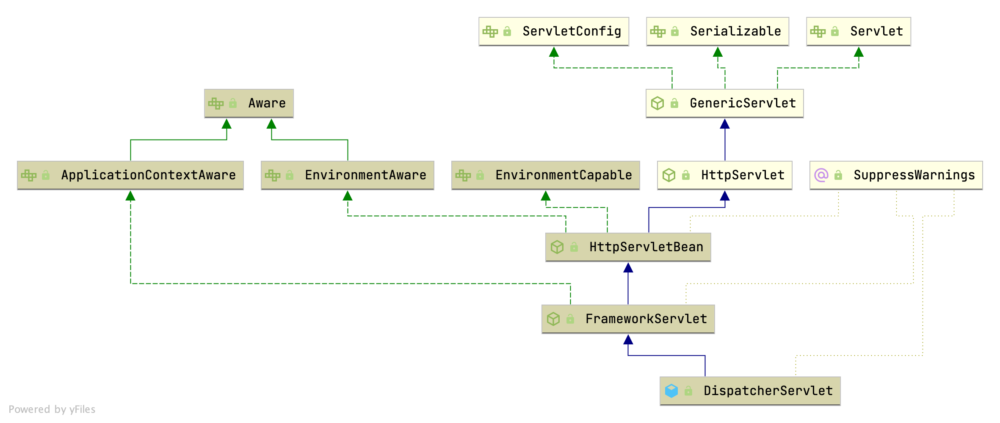

## Introduction

Spring Web MVC is the original web framework built on the Servlet API and has been included in the Spring Framework from the very beginning. 
The formal name, “Spring Web MVC,” comes from the name of its source module (spring-webmvc), but it is more commonly known as “Spring MVC”.

Parallel to Spring Web MVC, Spring Framework 5.0 introduced a reactive-stack web framework whose name, [“Spring WebFlux”](/docs/CS/Java/Spring/webflux.md) is also based on its source module (spring-webflux).

Spring MVC, as many other web frameworks, is designed around the front controller pattern where a central Servlet, the [DispatcherServlet], provides a shared algorithm for request processing, while actual work is performed by configurable delegate components. 
This model is flexible and supports diverse workflows.

### Context Hierarchy

DispatcherServlet expects a WebApplicationContext (an extension of a plain ApplicationContext) for its own configuration. WebApplicationContext has a link to the ServletContext and the Servlet with which it is associated. 
It is also bound to the ServletContext such that applications can use static methods on RequestContextUtils to look up the WebApplicationContext if they need access to it.

The root WebApplicationContext typically contains infrastructure beans, such as data repositories and business services that need to be shared across multiple Servlet instances. 
Those beans are effectively inherited and can be overridden (that is, re-declared) in the Servlet-specific child WebApplicationContext, which typically contains beans local to the given Servlet. 

The following image shows this relationship:


## Init


### ContextLoaderListener

Bootstrap listener to start up and shut down Spring's **root WebApplicationContext**. Simply delegates to ContextLoader as well as to ContextCleanupListener.
As of Spring 3.1, ContextLoaderListener supports injecting the root web application context via the ContextLoaderListener(WebApplicationContext) constructor, allowing for programmatic configuration in Servlet 3.0+ environments. See org.springframework.web.WebApplicationInitializer for usage examples.

```java
public class ContextLoaderListener extends ContextLoader implements ServletContextListener {
...
   // Initialize the root web application context.
   @Override
   public void contextInitialized(ServletContextEvent event) {
      initWebApplicationContext(event.getServletContext());
   }


   // Close the root web application context.
   @Override
   public void contextDestroyed(ServletContextEvent event) {
      closeWebApplicationContext(event.getServletContext());
      ContextCleanupListener.cleanupAttributes(event.getServletContext());
   }

}
```


### initWebApplicationContext

Initialize Spring's web application context for the given servlet context, using the application context provided at construction time, or creating a new one according to the "*contextClass*" and "*contextConfigLocation*" context-params.

```java
// ContextLoader
public WebApplicationContext initWebApplicationContext(ServletContext servletContext) {
   if (servletContext.getAttribute(WebApplicationContext.ROOT_WEB_APPLICATION_CONTEXT_ATTRIBUTE) != null) {
      throw new IllegalStateException("");
   }

   servletContext.log("Initializing Spring root WebApplicationContext");
   try {
      // Store context in local instance variable, to guarantee that
      // it is available on ServletContext shutdown.
      if (this.context == null) {
         this.context = createWebApplicationContext(servletContext);
      }
      if (this.context instanceof ConfigurableWebApplicationContext) {
         ConfigurableWebApplicationContext cwac = (ConfigurableWebApplicationContext) this.context;
         if (!cwac.isActive()) {
            // The context has not yet been refreshed -> provide services such as
            // setting the parent context, setting the application context id, etc
            if (cwac.getParent() == null) {
               // The context instance was injected without an explicit parent ->
               // determine parent for root web application context, if any.
               ApplicationContext parent = loadParentContext(servletContext);
               cwac.setParent(parent);
            }
            configureAndRefreshWebApplicationContext(cwac, servletContext);
         }
      }
      servletContext.setAttribute(WebApplicationContext.ROOT_WEB_APPLICATION_CONTEXT_ATTRIBUTE, this.context);

      ClassLoader ccl = Thread.currentThread().getContextClassLoader();
      if (ccl == ContextLoader.class.getClassLoader()) {
         currentContext = this.context;
      }
      else if (ccl != null) {
         currentContextPerThread.put(ccl, this.context);
      }
      return this.context;
   }
   catch (RuntimeException | Error ex) {
      servletContext.setAttribute(WebApplicationContext.ROOT_WEB_APPLICATION_CONTEXT_ATTRIBUTE, ex);
      throw ex;
   }
}
```


#### createWebApplicationContext

```java
protected WebApplicationContext createWebApplicationContext(ServletContext sc) {
   Class<?> contextClass = determineContextClass(sc);
   if (!ConfigurableWebApplicationContext.class.isAssignableFrom(contextClass)) {
      throw new ApplicationContextException("");
   }
   return (ConfigurableWebApplicationContext) BeanUtils.instantiateClass(contextClass);
}
```

```java
/**
 * Return the WebApplicationContext implementation class to use, either the
 * default XmlWebApplicationContext or a custom context class if specified.
 */
protected Class<?> determineContextClass(ServletContext servletContext) {
   String contextClassName = servletContext.getInitParameter(CONTEXT_CLASS_PARAM);
   if (contextClassName != null) {
      try {
         return ClassUtils.forName(contextClassName, ClassUtils.getDefaultClassLoader());
      }
      catch (ClassNotFoundException ex) {
         throw new ApplicationContextException("");
      }
   }
   else {
      contextClassName = defaultStrategies.getProperty(WebApplicationContext.class.getName());
      try {
         return ClassUtils.forName(contextClassName, ContextLoader.class.getClassLoader());
      }
      catch (ClassNotFoundException ex) {
         throw new ApplicationContextException(
               "Failed to load default context class [" + contextClassName + "]", ex);
      }
   }
}
```

#### configureAndRefreshWebApplicationContext

```java
// ContextLoader
protected void configureAndRefreshWebApplicationContext(ConfigurableWebApplicationContext wac, ServletContext sc) {
   if (ObjectUtils.identityToString(wac).equals(wac.getId())) {
      // The application context id is still set to its original default value
      // -> assign a more useful id based on available information
      String idParam = sc.getInitParameter(CONTEXT_ID_PARAM);
      if (idParam != null) {
         wac.setId(idParam);
      }
      else {
         // Generate default id...
         wac.setId(ConfigurableWebApplicationContext.APPLICATION_CONTEXT_ID_PREFIX +
               ObjectUtils.getDisplayString(sc.getContextPath()));
      }
   }

   wac.setServletContext(sc);
   String configLocationParam = sc.getInitParameter(CONFIG_LOCATION_PARAM);
   if (configLocationParam != null) {
      wac.setConfigLocation(configLocationParam);
   }

   // The wac environment's #initPropertySources will be called in any case when the context
   // is refreshed; do it eagerly here to ensure servlet property sources are in place for
   // use in any post-processing or initialization that occurs below prior to #refresh
   ConfigurableEnvironment env = wac.getEnvironment();
   if (env instanceof ConfigurableWebEnvironment) {
      ((ConfigurableWebEnvironment) env).initPropertySources(sc, null);
   }

   customizeContext(sc, wac);
   wac.refresh();
}
```




org.springframework.web.servlet


```java
/**
 * Initialize and publish the WebApplicationContext for this servlet.
 * <p>Delegates to {@link #createWebApplicationContext} for actual creation
 * of the context. Can be overridden in subclasses.
 * @return the WebApplicationContext instance
 * @see #FrameworkServlet(WebApplicationContext)
 * @see #setContextClass
 * @see #setContextConfigLocation
 */
protected WebApplicationContext initWebApplicationContext() {
   WebApplicationContext rootContext =
         WebApplicationContextUtils.getWebApplicationContext(getServletContext());
   WebApplicationContext wac = null;

   if (this.webApplicationContext != null) {
      // A context instance was injected at construction time -> use it
      wac = this.webApplicationContext;
      if (wac instanceof ConfigurableWebApplicationContext) {
         ConfigurableWebApplicationContext cwac = (ConfigurableWebApplicationContext) wac;
         if (!cwac.isActive()) {
            // The context has not yet been refreshed -> provide services such as
            // setting the parent context, setting the application context id, etc
            if (cwac.getParent() == null) {
               // The context instance was injected without an explicit parent -> set
               // the root application context (if any; may be null) as the parent
               cwac.setParent(rootContext);
            }
            configureAndRefreshWebApplicationContext(cwac);
         }
      }
   }
   if (wac == null) {
      // No context instance was injected at construction time -> see if one
      // has been registered in the servlet context. If one exists, it is assumed
      // that the parent context (if any) has already been set and that the
      // user has performed any initialization such as setting the context id
      wac = findWebApplicationContext();
   }
   if (wac == null) {
      // No context instance is defined for this servlet -> create a local one
      wac = createWebApplicationContext(rootContext);
   }

   if (!this.refreshEventReceived) {
      // Either the context is not a ConfigurableApplicationContext with refresh
      // support or the context injected at construction time had already been
      // refreshed -> trigger initial onRefresh manually here.
      synchronized (this.onRefreshMonitor) {
         onRefresh(wac);
      }
   }

   if (this.publishContext) {
      // Publish the context as a servlet context attribute.
      String attrName = getServletContextAttributeName();
      getServletContext().setAttribute(attrName, wac);
   }

   return wac;
}
```


### HttpServletBean

Simple extension of HttpServlet which treats its config parameters (init-param entries within the servlet tag in web.xml) as bean properties.
A handy superclass for any type of servlet. Type conversion of config parameters is automatic, with the corresponding setter method getting invoked with the converted value. It is also possible for subclasses to specify required properties. Parameters without matching bean property setter will simply be ignored.
This servlet leaves request handling to subclasses, inheriting the default behavior of HttpServlet (doGet, doPost, etc).
This generic servlet base class has no dependency on the Spring org.springframework.context.ApplicationContext concept. Simple servlets usually don't load their own context but rather access service beans from the Spring root application context, accessible via the filter's ServletContext (see org.springframework.web.context.support.WebApplicationContextUtils).
The FrameworkServlet class is a more specific servlet base class which loads its own application context. FrameworkServlet serves as direct base class of Spring's full-fledged DispatcherServlet.


Map config parameters onto bean properties of this servlet, and invoke subclass initialization.

```java
// org.springframework.web.servlet.HttpServletBean
@Override
public final void init() throws ServletException {

   // Set bean properties from init parameters.
   PropertyValues pvs = new ServletConfigPropertyValues(getServletConfig(), this.requiredProperties);
   if (!pvs.isEmpty()) {
      try {
         BeanWrapper bw = PropertyAccessorFactory.forBeanPropertyAccess(this);
         ResourceLoader resourceLoader = new ServletContextResourceLoader(getServletContext());
         bw.registerCustomEditor(Resource.class, new ResourceEditor(resourceLoader, getEnvironment()));
         initBeanWrapper(bw);
         bw.setPropertyValues(pvs, true);
      }
      catch (BeansException ex) {
         throw ex;
      }
   }

   // Let subclasses do whatever initialization they like.
   initServletBean();
}

// FrameworkServlet
/**
 * Overridden method of {@link HttpServletBean}, invoked after any bean properties
 * have been set. Creates this servlet's WebApplicationContext.
 */
@Override
protected final void initServletBean() throws ServletException {
   long startTime = System.currentTimeMillis();
   try {
      this.webApplicationContext = initWebApplicationContext();
      initFrameworkServlet();
   }
   catch (ServletException | RuntimeException ex) {
      throw ex;
   }
}
```


Initialize and publish the WebApplicationContext for this servlet.
Delegates to createWebApplicationContext for actual creation of the context. Can be overridden in subclasses.

```java
// FrameworkServlet
protected WebApplicationContext initWebApplicationContext() {
   WebApplicationContext rootContext =
         WebApplicationContextUtils.getWebApplicationContext(getServletContext());
   WebApplicationContext wac = null;

   if (this.webApplicationContext != null) {
      // A context instance was injected at construction time -> use it
      wac = this.webApplicationContext;
      if (wac instanceof ConfigurableWebApplicationContext) {
         ConfigurableWebApplicationContext cwac = (ConfigurableWebApplicationContext) wac;
         if (!cwac.isActive()) {
            // The context has not yet been refreshed -> provide services such as
            // setting the parent context, setting the application context id, etc
            if (cwac.getParent() == null) {
               // The context instance was injected without an explicit parent -> set
               // the root application context (if any; may be null) as the parent
               cwac.setParent(rootContext);
            }
            configureAndRefreshWebApplicationContext(cwac);
         }
      }
   }
   if (wac == null) {
      // No context instance was injected at construction time -> see if one
      // has been registered in the servlet context. If one exists, it is assumed
      // that the parent context (if any) has already been set and that the
      // user has performed any initialization such as setting the context id
      wac = findWebApplicationContext();
   }
   if (wac == null) {
      // No context instance is defined for this servlet -> create a local one
      wac = createWebApplicationContext(rootContext);
   }

   if (!this.refreshEventReceived) {
      // Either the context is not a ConfigurableApplicationContext with refresh
      // support or the context injected at construction time had already been
      // refreshed -> trigger initial onRefresh manually here.
      synchronized (this.onRefreshMonitor) {
         onRefresh(wac);
      }
   }

   if (this.publishContext) {
      // Publish the context as a servlet context attribute.
      String attrName = getServletContextAttributeName();
      getServletContext().setAttribute(attrName, wac);
   }

   return wac;
}
```


Instantiate the WebApplicationContext for this servlet, either a default XmlWebApplicationContext or a custom context class, if set.
This implementation expects custom contexts to implement the ConfigurableWebApplicationContext interface. Can be overridden in subclasses.
Do not forget to register this servlet instance as application listener on the created context (for triggering its callback, and to call ConfigurableApplicationContext.refresh() before returning the context instance.

```java
// FrameworkServlet
protected WebApplicationContext createWebApplicationContext(@Nullable ApplicationContext parent) {
   Class<?> contextClass = getContextClass();
   if (!ConfigurableWebApplicationContext.class.isAssignableFrom(contextClass)) {
      throw new ApplicationContextException("");
   }
   ConfigurableWebApplicationContext wac =
         (ConfigurableWebApplicationContext) BeanUtils.instantiateClass(contextClass);

   wac.setEnvironment(getEnvironment());
   wac.setParent(parent);
   String configLocation = getContextConfigLocation();
   if (configLocation != null) {
      wac.setConfigLocation(configLocation);
   }
   configureAndRefreshWebApplicationContext(wac);

   return wac;
}
```


### onRefresh

```java
// DispatcherServlet
// This implementation calls {@link #initStrategies}.
@Override
protected void onRefresh(ApplicationContext context) {
   initStrategies(context);
}

/**
 * Initialize the strategy objects that this servlet uses.
 * <p>May be overridden in subclasses in order to initialize further strategy objects.
 */
protected void initStrategies(ApplicationContext context) {
   initMultipartResolver(context);
   initLocaleResolver(context);
   initThemeResolver(context);
   initHandlerMappings(context);
   initHandlerAdapters(context);
   initHandlerExceptionResolvers(context);
   initRequestToViewNameTranslator(context);
   initViewResolvers(context);
   initFlashMapManager(context);
}
```


## dispatch

All HTTP requests  call `processRequest`
```java
public abstract class FrameworkServlet extends HttpServletBean implements ApplicationContextAware {
    @Override
    protected final void doPost(HttpServletRequest request, HttpServletResponse response)
            throws ServletException, IOException {

        processRequest(request, response);
    }
}
```
### processRequest
Process this request, publishing an event regardless of the outcome.
The actual event handling is performed by the abstract doService template method.

```java
public abstract class FrameworkServlet extends HttpServletBean implements ApplicationContextAware {
    protected final void processRequest(HttpServletRequest request, HttpServletResponse response)
            throws ServletException, IOException {

        long startTime = System.currentTimeMillis();
        Throwable failureCause = null;

        LocaleContext previousLocaleContext = LocaleContextHolder.getLocaleContext();
        LocaleContext localeContext = buildLocaleContext(request);

        RequestAttributes previousAttributes = RequestContextHolder.getRequestAttributes();
        ServletRequestAttributes requestAttributes = buildRequestAttributes(request, response, previousAttributes);

        WebAsyncManager asyncManager = WebAsyncUtils.getAsyncManager(request);
        asyncManager.registerCallableInterceptor(FrameworkServlet.class.getName(), new RequestBindingInterceptor());

        initContextHolders(request, localeContext, requestAttributes);

        doService(request, response); // doService
  
   finally{
            resetContextHolders(request, previousLocaleContext, previousAttributes);
            if (requestAttributes != null) {
                requestAttributes.requestCompleted();
            }

            publishRequestHandledEvent(request, response, startTime, failureCause);
        }
    }
}
```

### doService

Exposes the DispatcherServlet-specific request attributes and delegates to doDispatch for the actual dispatching.

```java
@Override
protected void doService(HttpServletRequest request, HttpServletResponse response) throws Exception {
   // Keep a snapshot of the request attributes in case of an include,
   // to be able to restore the original attributes after the include.
   Map<String, Object> attributesSnapshot = null;
   if (WebUtils.isIncludeRequest(request)) {
      attributesSnapshot = new HashMap<>();
      Enumeration<?> attrNames = request.getAttributeNames();
      while (attrNames.hasMoreElements()) {
         String attrName = (String) attrNames.nextElement();
         if (this.cleanupAfterInclude || attrName.startsWith(DEFAULT_STRATEGIES_PREFIX)) {
            attributesSnapshot.put(attrName, request.getAttribute(attrName));
         }
      }
   }

   // Make framework objects available to handlers and view objects.
   request.setAttribute(WEB_APPLICATION_CONTEXT_ATTRIBUTE, getWebApplicationContext());
   request.setAttribute(LOCALE_RESOLVER_ATTRIBUTE, this.localeResolver);
   request.setAttribute(THEME_RESOLVER_ATTRIBUTE, this.themeResolver);
   request.setAttribute(THEME_SOURCE_ATTRIBUTE, getThemeSource());

   if (this.flashMapManager != null) {
      FlashMap inputFlashMap = this.flashMapManager.retrieveAndUpdate(request, response);
      if (inputFlashMap != null) {
         request.setAttribute(INPUT_FLASH_MAP_ATTRIBUTE, Collections.unmodifiableMap(inputFlashMap));
      }
      request.setAttribute(OUTPUT_FLASH_MAP_ATTRIBUTE, new FlashMap());
      request.setAttribute(FLASH_MAP_MANAGER_ATTRIBUTE, this.flashMapManager);
   }

   RequestPath previousRequestPath = null;
   if (this.parseRequestPath) {
      previousRequestPath = (RequestPath) request.getAttribute(ServletRequestPathUtils.PATH_ATTRIBUTE);
      ServletRequestPathUtils.parseAndCache(request);
   }

   try {
      doDispatch(request, response);
   }
   finally {
      if (!WebAsyncUtils.getAsyncManager(request).isConcurrentHandlingStarted()) {
         // Restore the original attribute snapshot, in case of an include.
         if (attributesSnapshot != null) {
            restoreAttributesAfterInclude(request, attributesSnapshot);
         }
      }
      ServletRequestPathUtils.setParsedRequestPath(previousRequestPath, request);
   }
}
```

### doDispatch

Process the actual dispatching to the handler.
The handler will be obtained by applying the servlet's HandlerMappings in order. The HandlerAdapter will be obtained by querying the servlet's installed HandlerAdapters to find the first that supports the handler class.
All HTTP methods are handled by this method. It's up to HandlerAdapters or handlers themselves to decide which methods are acceptable.

```java
protected void doDispatch(HttpServletRequest request, HttpServletResponse response) throws Exception {
   HttpServletRequest processedRequest = request;
   HandlerExecutionChain mappedHandler = null;
   boolean multipartRequestParsed = false;

   WebAsyncManager asyncManager = WebAsyncUtils.getAsyncManager(request);

   try {
      ModelAndView mv = null;
      Exception dispatchException = null;

      try {
         processedRequest = checkMultipart(request);
         multipartRequestParsed = (processedRequest != request);

         // Determine handler for the current request.
         mappedHandler = getHandler(processedRequest);
         if (mappedHandler == null) {
            noHandlerFound(processedRequest, response);
            return;
         }

         // Determine handler adapter for the current request.
         HandlerAdapter ha = getHandlerAdapter(mappedHandler.getHandler());

         // Process last-modified header, if supported by the handler.
         String method = request.getMethod();
         boolean isGet = "GET".equals(method);
         if (isGet || "HEAD".equals(method)) {
            long lastModified = ha.getLastModified(request, mappedHandler.getHandler());
            if (new ServletWebRequest(request, response).checkNotModified(lastModified) && isGet) {
               return;
            }
         }

         if (!mappedHandler.applyPreHandle(processedRequest, response)) {
            return;
         }

         // Actually invoke the handler.
         mv = ha.handle(processedRequest, response, mappedHandler.getHandler());

         if (asyncManager.isConcurrentHandlingStarted()) {
            return;
         }

         applyDefaultViewName(processedRequest, mv);
         mappedHandler.applyPostHandle(processedRequest, response, mv);
      }
      catch (Exception ex) {
         dispatchException = ex;
      }
      catch (Throwable err) {
         // As of 4.3, we're processing Errors thrown from handler methods as well,
         // making them available for @ExceptionHandler methods and other scenarios.
         dispatchException = new NestedServletException("Handler dispatch failed", err);
      }
      processDispatchResult(processedRequest, response, mappedHandler, mv, dispatchException);
   }
   catch (Exception ex) {
      triggerAfterCompletion(processedRequest, response, mappedHandler, ex);
   }
   catch (Throwable err) {
      triggerAfterCompletion(processedRequest, response, mappedHandler,
            new NestedServletException("Handler processing failed", err));
   }
   finally {
      if (asyncManager.isConcurrentHandlingStarted()) {
         // Instead of postHandle and afterCompletion
         if (mappedHandler != null) {
            mappedHandler.applyAfterConcurrentHandlingStarted(processedRequest, response);
         }
      }
      else {
         // Clean up any resources used by a multipart request.
         if (multipartRequestParsed) {
            cleanupMultipart(processedRequest);
         }
      }
   }
}
```


1. match HandlerMapping
2. interceptor preHandler
3. HandlerMethodArgumentResolver resolve params
4. call method in *Controller
5. HandlerMethodReturnValueHandler resolve returnValue
6. modelAndView wrap returnValue
7. interceptor postHandler
8. HandlerExceptionResolver hande Exception
9. View
10. interceptor afterCompletion

## Filter

1. @WebFilter @ServletComponentScan FilterRegistration
2. @Component + implements Filter

see [FilterChain.doFilter() in Tomcat](/docs/CS/Java/Tomcat/Connector.md?id=doFilter)


Spring MVC provides fine-grained support for CORS configuration through annotations on controllers. 
However, when used with [Spring Security](/docs/CS/Java/Spring/Security.md), we advise relying on the built-in CorsFilter that must be ordered ahead of Spring Security’s chain of filters.

## Asynchronous Requests

Spring MVC has an extensive integration with Servlet 3.0 asynchronous request processing:
- DeferredResult and Callable return values in controller methods provide basic support for a single asynchronous return value.
- Controllers can stream multiple values, including SSE and raw data.
- Controllers can use reactive clients and return reactive types for response handling.


The Servlet API was originally built for making a single pass through the Filter-Servlet chain. 
Asynchronous request processing, added in Servlet 3.0, lets applications exit the Filter-Servlet chain but leave the response open for further processing. 
The Spring MVC asynchronous support is built around that mechanism. When a controller returns a DeferredResult, the Filter-Servlet chain is exited, and the Servlet container thread is released.
Later, when the DeferredResult is set, an ASYNC dispatch (to the same URL) is made, during which the controller is mapped again but, rather than invoking it, the DeferredResult value is used (as if the controller returned it) to resume processing.

From a programming model perspective, both Spring MVC and Spring WebFlux support asynchronous and Reactive Types as return values in controller methods. 
Spring MVC even supports streaming, including reactive back pressure. 
However, **individual writes to the response remain blocking (and are performed on a separate thread)**, unlike WebFlux, which relies on non-blocking I/O and does not need an extra thread for each write.

Another fundamental difference is that **Spring MVC does not support asynchronous or reactive types in controller method arguments (for example, @RequestBody, @RequestPart, and others)**, 
nor does it have any explicit support for asynchronous and reactive types as model attributes. 
Spring WebFlux does support all that.

## Extension
1. must declare @PathVariable @RequestParam or @RequestBody
2. Nested Validation need to add `@Valid` at field


Init DispatchServlet when startup

```yml
spring:
  mvc:
    servlet:
      load-on-startup: 1
```

Other servlet

```yml
spring:
  webservices:
    servlet:
      load-on-startup: 1
```

### Resolver

```java
public interface WebMvcConfigurer {
    default void addArgumentResolvers(List<HandlerMethodArgumentResolver> resolvers) {
    }
}
```

### Converter

Avoid response can not cast to String Exception when we transform response String to Object

```java
@EnableWebMvc
@Configuration
public class WebConfiguration implements WebMvcConfigurer {

    @Override
    public void configureMessageConverters(List<HttpMessageConverter<?>> converters) {
        converters.add(0, new MappingJackson2HttpMessageConverter());
    }
}
```


## Links

- [Spring](/docs/CS/Java/Spring/Spring.md)


## References

1. [Spring Web MVC](https://docs.spring.io/spring-framework/docs/current/reference/html/web.html#mvc)