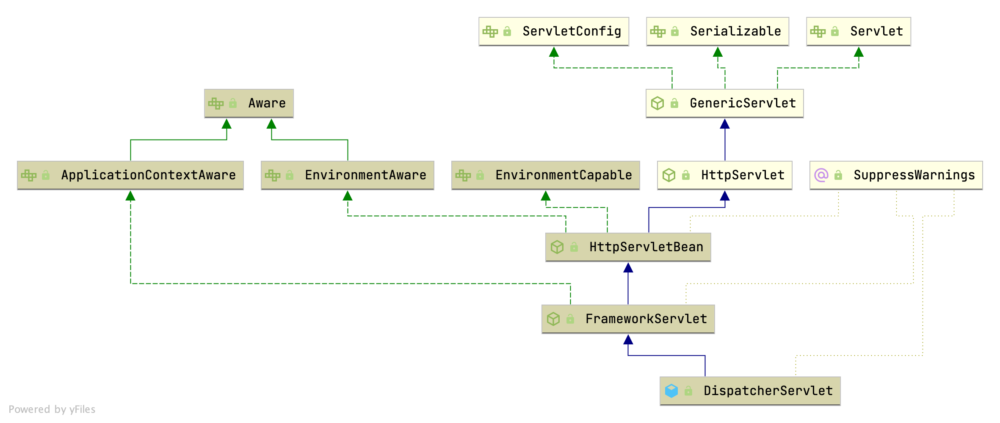

## Introduction

[Spring Web MVC](https://docs.spring.io/spring-framework/docs/current/reference/html/web.html#mvc) is the original web framework built on the Servlet API and has been included in the Spring Framework from the very beginning.
The formal name, “Spring Web MVC,” comes from the name of its source module (spring-webmvc), but it is more commonly known as “Spring MVC”.

Parallel to Spring Web MVC, Spring Framework 5.0 introduced a reactive-stack web framework whose name, [“Spring WebFlux”](/docs/CS/Java/Spring/webflux.md) is also based on its source module (spring-webflux).

Spring MVC, as many other web frameworks, is designed around the front controller pattern where a central Servlet, the [DispatcherServlet], provides a shared algorithm for request processing, while actual work is performed by configurable delegate components.
This model is flexible and supports diverse workflows.

### Context Hierarchy

DispatcherServlet expects a WebApplicationContext (an extension of a plain ApplicationContext) for its own configuration. WebApplicationContext has a link to the ServletContext and the Servlet with which it is associated.
It is also bound to the ServletContext such that applications can use static methods on RequestContextUtils to look up the WebApplicationContext if they need access to it.

The root WebApplicationContext typically contains infrastructure beans, such as data repositories and business services that need to be shared across multiple Servlet instances.
Those beans are effectively inherited and can be overridden (that is, re-declared) in the Servlet-specific child WebApplicationContext, which typically contains beans local to the given Servlet.

The following image shows this relationship:


## Init

### ContextLoaderListener

Bootstrap listener to start up and shut down Spring's **root WebApplicationContext**.
Simply delegates to ContextLoader as well as to ContextCleanupListener.
As of Spring 3.1, ContextLoaderListener supports injecting the root web application context via the ContextLoaderListener(WebApplicationContext) constructor, allowing for programmatic configuration in Servlet 3.0+ environments.
See org.springframework.web.WebApplicationInitializer for usage examples.

```java
public class ContextLoaderListener extends ContextLoader implements ServletContextListener {

   // Initialize the root web application context.
   @Override
   public void contextInitialized(ServletContextEvent event) {
      initWebApplicationContext(event.getServletContext());
   }


   // Close the root web application context.
   @Override
   public void contextDestroyed(ServletContextEvent event) {
      closeWebApplicationContext(event.getServletContext());
      ContextCleanupListener.cleanupAttributes(event.getServletContext());
   }
}
```

Initialize Spring's web application context for the given servlet context, using the application context provided at construction time,
or creating a new one according to the "*contextClass*" and "*contextConfigLocation*" context-params.

```java
public class ContextLoaderListener extends ContextLoader implements ServletContextListener {
    public WebApplicationContext initWebApplicationContext(ServletContext servletContext) {
        servletContext.log("Initializing Spring root WebApplicationContext");
        try {
            // Store context in local instance variable, to guarantee that it is available on ServletContext shutdown.
            if (this.context == null) {
                this.context = createWebApplicationContext(servletContext);
            }
            if (this.context instanceof ConfigurableWebApplicationContext) {
                ConfigurableWebApplicationContext cwac = (ConfigurableWebApplicationContext) this.context;
                if (!cwac.isActive()) {
                    // The context has not yet been refreshed -> provide services such as setting the parent context, setting the application context id, etc
                    if (cwac.getParent() == null) {
                        // The context instance was injected without an explicit parent ->
                        // determine parent for root web application context, if any.
                        ApplicationContext parent = loadParentContext(servletContext);
                        cwac.setParent(parent);
                    }
                    configureAndRefreshWebApplicationContext(cwac, servletContext);
                }
            }
            servletContext.setAttribute(WebApplicationContext.ROOT_WEB_APPLICATION_CONTEXT_ATTRIBUTE, this.context);

            ClassLoader ccl = Thread.currentThread().getContextClassLoader();
            if (ccl == ContextLoader.class.getClassLoader()) {
                currentContext = this.context;
            } else if (ccl != null) {
                currentContextPerThread.put(ccl, this.context);
            }
            return this.context;
        } catch (RuntimeException | Error ex) {
            servletContext.setAttribute(WebApplicationContext.ROOT_WEB_APPLICATION_CONTEXT_ATTRIBUTE, ex);
            throw ex;
        }
    }
}
```

#### createWebApplicationContext

```
protected WebApplicationContext createWebApplicationContext(ServletContext sc) {
    // Return the WebApplicationContext implementation class to use, either the default XmlWebApplicationContext or a custom context class if specified.
   Class<?> contextClass = determineContextClass(sc);
   if (!ConfigurableWebApplicationContext.class.isAssignableFrom(contextClass)) {
      throw new ApplicationContextException("");
   }
   return (ConfigurableWebApplicationContext) BeanUtils.instantiateClass(contextClass);
}
```

#### configureAndRefreshWebApplicationContext

```java
public class ContextLoaderListener extends ContextLoader implements ServletContextListener {
    protected void configureAndRefreshWebApplicationContext(ConfigurableWebApplicationContext wac, ServletContext sc) {
        wac.setServletContext(sc);
        String configLocationParam = sc.getInitParameter(CONFIG_LOCATION_PARAM);

        // The wac environment's #initPropertySources will be called in any case when the context
        // is refreshed; do it eagerly here to ensure servlet property sources are in place for
        // use in any post-processing or initialization that occurs below prior to #refresh
        ConfigurableEnvironment env = wac.getEnvironment();
        if (env instanceof ConfigurableWebEnvironment) {
            ((ConfigurableWebEnvironment) env).initPropertySources(sc, null);
        }

        customizeContext(sc, wac);
        wac.refresh();
    }
}
```

### ServletContainerInitializer

A Spring-provided ServletContainerInitializer designed to support code-based configuration of the servlet container using Spring's WebApplicationInitializer SPI as
opposed to (or possibly in combination with) the traditional web.xml-based approach.

This class will be loaded and instantiated and have its onStartup method invoked by any Servlet-compliant container during container startup assuming that the spring-web module JAR is present on the classpath.
This occurs through the JAR Services API ServiceLoader.load(Class) method detecting the spring-web module's META-INF/services/jakarta.servlet.ServletContainerInitializer service provider configuration file.

```java
public interface ServletContainerInitializer {
    void onStartup(Set<Class<?>> c, ServletContext ctx) throws ServletException;
}
```

#### SpringBootServletInitializer

```java
public abstract class SpringBootServletInitializer implements WebApplicationInitializer {

    @Override
    public void onStartup(ServletContext servletContext) throws ServletException {
        // Logger initialization is deferred in case an ordered
        // LogServletContextInitializer is being used
        this.logger = LogFactory.getLog(getClass());
        WebApplicationContext rootApplicationContext = createRootApplicationContext(servletContext);
        if (rootApplicationContext != null) {
            servletContext.addListener(new SpringBootContextLoaderListener(rootApplicationContext, servletContext));
        } else {
            this.logger.debug("No ContextLoaderListener registered, as createRootApplicationContext() did not "
                    + "return an application context");
        }
    }

    protected WebApplicationContext createRootApplicationContext(ServletContext servletContext) {
        SpringApplicationBuilder builder = createSpringApplicationBuilder();
        builder.main(getClass());
        ApplicationContext parent = getExistingRootWebApplicationContext(servletContext);
        if (parent != null) {
            this.logger.info("Root context already created (using as parent).");
            servletContext.setAttribute(WebApplicationContext.ROOT_WEB_APPLICATION_CONTEXT_ATTRIBUTE, null);
            builder.initializers(new ParentContextApplicationContextInitializer(parent));
        }
        builder.initializers(new ServletContextApplicationContextInitializer(servletContext));
        builder.contextClass(AnnotationConfigServletWebServerApplicationContext.class);
        builder = configure(builder);
        builder.listeners(new WebEnvironmentPropertySourceInitializer(servletContext));
        SpringApplication application = builder.build();
        if (application.getAllSources().isEmpty()
                && MergedAnnotations.from(getClass(), SearchStrategy.TYPE_HIERARCHY).isPresent(Configuration.class)) {
            application.addPrimarySources(Collections.singleton(getClass()));
        }
        Assert.state(!application.getAllSources().isEmpty(),
                "No SpringApplication sources have been defined. Either override the "
                        + "configure method or add an @Configuration annotation");
        // Ensure error pages are registered
        if (this.registerErrorPageFilter) {
            application.addPrimarySources(Collections.singleton(ErrorPageFilterConfiguration.class));
        }
        application.setRegisterShutdownHook(false);
        return run(application);
    }
}
```

Apps externds SpringBootServletInitializer and start

```java
public class IngredientServiceServletInitializer extends SpringBootServletInitializer {
  @Override
  protected SpringApplicationBuilder configure(SpringApplicationBuilder builder) {
    return builder.sources(IngredientServiceApplication.class);
  }
}
```

### Init Servlet



HttpServletBean.init -> initServletBean -> initWebApplicationContext -> onRefresh -> DispatcherServlet.initStrategies

#### initWebApplicationContext

```java
public abstract class FrameworkServlet extends HttpServletBean implements ApplicationContextAware {
    protected WebApplicationContext initWebApplicationContext() {
        // get rootContext which created at ContextLoaderListener
        WebApplicationContext rootContext =
                WebApplicationContextUtils.getWebApplicationContext(getServletContext());
        WebApplicationContext wac = null;

        if (this.webApplicationContext != null) {
            // A context instance was injected at construction time -> use it
            wac = this.webApplicationContext;
            if (wac instanceof ConfigurableWebApplicationContext) {
                ConfigurableWebApplicationContext cwac = (ConfigurableWebApplicationContext) wac;
                if (!cwac.isActive()) {
                    // The context has not yet been refreshed -> provide services such as
                    // setting the parent context, setting the application context id, etc
                    if (cwac.getParent() == null) {
                        // The context instance was injected without an explicit parent -> set
                        // the root application context (if any; may be null) as the parent
                        cwac.setParent(rootContext);
                    }
                    configureAndRefreshWebApplicationContext(cwac);
                }
            }
        }
        if (wac == null) {
            // No context instance was injected at construction time -> see if one
            // has been registered in the servlet context. If one exists, it is assumed
            // that the parent context (if any) has already been set and that the
            // user has performed any initialization such as setting the context id
            wac = findWebApplicationContext();
        }
        if (wac == null) {
            // No context instance is defined for this servlet -> create a local one
            wac = createWebApplicationContext(rootContext);
        }

        if (!this.refreshEventReceived) {
            // Either the context is not a ConfigurableApplicationContext with refresh
            // support or the context injected at construction time had already been
            // refreshed -> trigger initial onRefresh manually here.
            synchronized (this.onRefreshMonitor) {
                onRefresh(wac);
            }
        }

        if (this.publishContext) {
            // Publish the context as a servlet context attribute.
            String attrName = getServletContextAttributeName();
            getServletContext().setAttribute(attrName, wac);
        }

        return wac;
    }
}
```

#### initStrategies

```java
public class DispatcherServlet extends FrameworkServlet {

    @Override
    protected void onRefresh(ApplicationContext context) {
        initStrategies(context);
    }

    protected void initStrategies(ApplicationContext context) {
        initMultipartResolver(context);
        initLocaleResolver(context);
        initThemeResolver(context);
        initHandlerMappings(context);
        initHandlerAdapters(context);
        initHandlerExceptionResolvers(context);
        initRequestToViewNameTranslator(context);
        initViewResolvers(context);
        initFlashMapManager(context);
    }
}
```

## dispatch

All HTTP requests  call `processRequest` -> doService -> doDispatch

```java
public abstract class FrameworkServlet extends HttpServletBean implements ApplicationContextAware {
    @Override
    protected final void doPost(HttpServletRequest request, HttpServletResponse response)
            throws ServletException, IOException {

        processRequest(request, response);
    }
}
```

### doDispatch

Process the actual dispatching to the handler.
The handler will be obtained by applying the servlet's HandlerMappings in order. The HandlerAdapter will be obtained by querying the servlet's installed HandlerAdapters to find the first that supports the handler class.
All HTTP methods are handled by this method.
It's up to HandlerAdapters or handlers themselves to decide which methods are acceptable.

```java
public class DispatcherServlet extends FrameworkServlet {
    protected void doDispatch(HttpServletRequest request, HttpServletResponse response) throws Exception {
        HttpServletRequest processedRequest = request;
        HandlerExecutionChain mappedHandler = null;
        boolean multipartRequestParsed = false;

        WebAsyncManager asyncManager = WebAsyncUtils.getAsyncManager(request);

        try {
            ModelAndView mv = null;
            Exception dispatchException = null;

            try {
                processedRequest = checkMultipart(request);
                multipartRequestParsed = (processedRequest != request);

                // Determine handler for the current request.
                mappedHandler = getHandler(processedRequest);
                if (mappedHandler == null) {
                    noHandlerFound(processedRequest, response);
                    return;
                }

                // Determine handler adapter for the current request.
                HandlerAdapter ha = getHandlerAdapter(mappedHandler.getHandler());

                // Process last-modified header, if supported by the handler.
                String method = request.getMethod();
                boolean isGet = "GET".equals(method);
                if (isGet || "HEAD".equals(method)) {
                    long lastModified = ha.getLastModified(request, mappedHandler.getHandler());
                    if (new ServletWebRequest(request, response).checkNotModified(lastModified) && isGet) {
                        return;
                    }
                }

                if (!mappedHandler.applyPreHandle(processedRequest, response)) {
                    return;
                }

                // Actually invoke the handler.
                mv = ha.handle(processedRequest, response, mappedHandler.getHandler());

                if (asyncManager.isConcurrentHandlingStarted()) {
                    return;
                }

                applyDefaultViewName(processedRequest, mv);
                mappedHandler.applyPostHandle(processedRequest, response, mv);
            } catch (Exception ex) {
                dispatchException = ex;
            } catch (Throwable err) {
                // As of 4.3, we're processing Errors thrown from handler methods as well,
                // making them available for @ExceptionHandler methods and other scenarios.
                dispatchException = new NestedServletException("Handler dispatch failed", err);
            }
            processDispatchResult(processedRequest, response, mappedHandler, mv, dispatchException);
        } catch (Exception ex) {
            triggerAfterCompletion(processedRequest, response, mappedHandler, ex);
        } catch (Throwable err) {
            triggerAfterCompletion(processedRequest, response, mappedHandler,
                    new NestedServletException("Handler processing failed", err));
        } finally {
            if (asyncManager.isConcurrentHandlingStarted()) {
                // Instead of postHandle and afterCompletion
                if (mappedHandler != null) {
                    mappedHandler.applyAfterConcurrentHandlingStarted(processedRequest, response);
                }
            } else {
                // Clean up any resources used by a multipart request.
                if (multipartRequestParsed) {
                    cleanupMultipart(processedRequest);
                }
            }
        }
    }
}
```

1. RequestMappingHandlerMapping.mapping
2. interceptor preHandler
3. HandlerMethodArgumentResolver resolve params
4. call method in Controller
5. HandlerMethodReturnValueHandler resolve returnValue
6. modelAndView wrap returnValue
7. interceptor postHandler
8. HandlerExceptionResolver handle Exception
9. View
10. interceptor afterCompletion

## Filter

1. @WebFilter @ServletComponentScan FilterRegistration
2. @Component + implements Filter

see [FilterChain.doFilter() in Tomcat](/docs/CS/Java/Tomcat/Connector.md?id=doFilter)

Spring MVC provides fine-grained support for CORS configuration through annotations on controllers.
However, when used with [Spring Security](/docs/CS/Java/Spring/Security.md), we advise relying on the built-in CorsFilter that must be ordered ahead of Spring Security’s chain of filters.

## Asynchronous Requests

Spring MVC has an extensive integration with Servlet 3.0 asynchronous request processing:

- DeferredResult and Callable return values in controller methods provide basic support for a single asynchronous return value.
- Controllers can stream multiple values, including SSE and raw data.
- Controllers can use reactive clients and return reactive types for response handling.

The Servlet API was originally built for making a single pass through the Filter-Servlet chain.
Asynchronous request processing, added in Servlet 3.0, lets applications exit the Filter-Servlet chain but leave the response open for further processing.
The Spring MVC asynchronous support is built around that mechanism. When a controller returns a DeferredResult, the Filter-Servlet chain is exited, and the Servlet container thread is released.
Later, when the DeferredResult is set, an ASYNC dispatch (to the same URL) is made, during which the controller is mapped again but, rather than invoking it, the DeferredResult value is used (as if the controller returned it) to resume processing.

From a programming model perspective, both Spring MVC and Spring WebFlux support asynchronous and Reactive Types as return values in controller methods.
Spring MVC even supports streaming, including reactive back pressure.
However, **individual writes to the response remain blocking (and are performed on a separate thread)**, unlike WebFlux, which relies on non-blocking I/O and does not need an extra thread for each write.

Another fundamental difference is that **Spring MVC does not support asynchronous or reactive types in controller method arguments (for example, @RequestBody, @RequestPart, and others)**,
nor does it have any explicit support for asynchronous and reactive types as model attributes.
Spring WebFlux does support all that.

## Extension

1. must declare @PathVariable @RequestParam or @RequestBody
2. Nested Validation need to add `@Valid` at field

Init DispatchServlet when startup

```yml
spring:
  mvc:
    servlet:
      load-on-startup: 1
```

Other servlet

```yml
spring:
  webservices:
    servlet:
      load-on-startup: 1
```

### Resolver

```java
public interface WebMvcConfigurer {
    default void addArgumentResolvers(List<HandlerMethodArgumentResolver> resolvers) {
    }
}
```

### Converter

Avoid response can not cast to String Exception when we transform response String to Object

```java
@EnableWebMvc
@Configuration
public class WebConfiguration implements WebMvcConfigurer {

    @Override
    public void configureMessageConverters(List<HttpMessageConverter<?>> converters) {
        converters.add(0, new MappingJackson2HttpMessageConverter());
    }
}
```

#### MessageConverter

Create the method argument value of the expected parameter type by reading from the given HttpInputMessage.

```java
public class RequestResponseBodyMethodProcessor extends AbstractMessageConverterMethodProcessor {
  
    @Override
    public boolean supportsParameter(MethodParameter parameter) {
        return parameter.hasParameterAnnotation(RequestBody.class);
    }
  
    @Override
    public boolean supportsReturnType(MethodParameter returnType) {
        return (AnnotatedElementUtils.hasAnnotation(returnType.getContainingClass(), ResponseBody.class) ||
                returnType.hasMethodAnnotation(ResponseBody.class));
    }

    @Override
    public Object resolveArgument(MethodParameter parameter, @Nullable ModelAndViewContainer mavContainer,
                                  NativeWebRequest webRequest, @Nullable WebDataBinderFactory binderFactory) throws Exception {

        parameter = parameter.nestedIfOptional();
        Object arg = readWithMessageConverters(webRequest, parameter, parameter.getNestedGenericParameterType());
        String name = Conventions.getVariableNameForParameter(parameter);

        if (binderFactory != null) {
            WebDataBinder binder = binderFactory.createBinder(webRequest, arg, name);
            if (arg != null) {
                validateIfApplicable(binder, parameter);
                if (binder.getBindingResult().hasErrors() && isBindExceptionRequired(binder, parameter)) {
                    throw new MethodArgumentNotValidException(parameter, binder.getBindingResult());
                }
            }
            if (mavContainer != null) {
                mavContainer.addAttribute(BindingResult.MODEL_KEY_PREFIX + name, binder.getBindingResult());
            }
        }

        return adaptArgumentIfNecessary(arg, parameter);
    }
}
```

### Request

log http request

```yaml
logging:
  level:
    org.apache.coyote.http11.Http11InputBuffer: debug
```

test

```yaml
logging:
  level:
    org.springframework.web.servlet.mvc.method.annotation.RequestResponseBodyMethodProcessor: debug
```

## Links

- [Spring](/docs/CS/Java/Spring/Spring.md)

## References

1. [Spring Web MVC](https://docs.spring.io/spring-framework/docs/current/reference/html/web.html#mvc)
