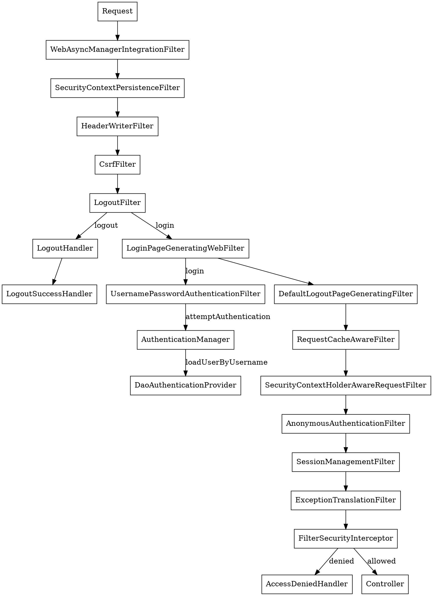

## Introduction

[Spring Security](https://spring.io/projects/spring-security) is a powerful and highly customizable authentication and access-control framework.
It is the de-facto standard for securing Spring-based applications.
Spring Security is a framework that focuses on providing both authentication and authorization to Java applications.

## Architecture

Spring Security’s Servlet support is based on Servlet Filters, so it is helpful to look at the role of Filters generally first.
The client sends a request to the application, and the container creates a FilterChain which contains the Filters and Servlet that should process the HttpServletRequest based on the path of the request URI. 
In a Spring MVC application the Servlet is an instance of DispatcherServlet. 
At most one Servlet can handle a single HttpServletRequest and HttpServletResponse. 
However, more than one Filter can be used to:
- Prevent downstream Filters or the Servlet from being invoked. In this instance the Filter will typically write the HttpServletResponse.
- Modify the HttpServletRequest or HttpServletResponse used by the downstream Filters and Servlet

Since a Filter only impacts downstream Filters and the Servlet, the order each Filter is invoked is extremely important.


### DelegatingFilterProxy

Spring provides a Filter implementation named DelegatingFilterProxy that allows bridging between the Servlet container’s lifecycle and Spring’s ApplicationContext. 
The Servlet container allows registering Filters using its own standards, but it is not aware of Spring defined Beans. 
DelegatingFilterProxy can be registered via standard Servlet container mechanisms, but delegate all the work to a Spring Bean that implements Filter.

Here is a picture of how DelegatingFilterProxy fits into the Filters and the FilterChain.


DelegatingFilterProxy looks up *Bean Filter0* from the ApplicationContext and then invokes *Bean Filter0*.

Another benefit of DelegatingFilterProxy is that it allows **delaying looking Filter bean instances**. 
This is important because the container needs to register the Filter instances before the container can startup. 
However, Spring typically uses a ContextLoaderListener to load the Spring Beans which will not be done until after the Filter instances need to be registered.


### FilterChainProxy

Spring Security’s Servlet support is contained within FilterChainProxy. 
FilterChainProxy is a special Filter provided by Spring Security that allows delegating to many Filter instances through SecurityFilterChain. 
Since FilterChainProxy is a Bean, it is typically wrapped in a DelegatingFilterProxy.


SecurityFilterChain is used by FilterChainProxy to determine which Spring Security Filters should be invoked for this request.

> [!TIP]
> 
> See [Security Filters](https://docs.spring.io/spring-security/reference/servlet/architecture.html#servlet-security-filters)


FilterChainProxy provides a number of advantages to registering directly with the Servlet container or DelegatingFilterProxy. 
- First, it provides a starting point for all of Spring Security’s Servlet support.
- Second, since FilterChainProxy is central to Spring Security usage it can perform tasks that are not viewed as optional.
- In addition, it provides more flexibility in determining when a SecurityFilterChain should be invoked.



## Authentication

At the heart of Spring Security’s authentication model is the SecurityContextHolder. It contains the SecurityContext.


### Authentication Filters

#### SecurityContextPersistenceFilter

SecurityContextPersistenceFilter MUST be executed BEFORE any authentication processing mechanisms.
Authentication processing mechanisms (e.g. BASIC, CAS processing filters etc) expect the SecurityContextHolder(default to using [MODE_THREADLOCAL](/docs/CS/Java/JDK/Concurrency/ThreadLocal.md)) to contain a valid SecurityContext by the time they execute.

SecurityContextPersistenceFilter populates the SecurityContextHolder with information obtained from the configured SecurityContextRepository prior to the request and stores it back in the repository once the request has completed and clearing the context holder.
By default it uses an HttpSessionSecurityContextRepository. See this class for information HttpSession related configuration options.
This filter will only execute once per request, to resolve servlet container (specifically Weblogic) incompatibilities.


#### AuthenticationProcessingFilter

AuthenticationProcessingFilter

The filter requires that you set the authenticationManager property. 
An AuthenticationManager is required to process the authentication request tokens created by implementing classes.
This filter will intercept a request and attempt to perform authentication from that request if the request matches the setRequiresAuthenticationRequestMatcher(RequestMatcher).
Authentication is performed by the `attemptAuthentication` method.


UsernamePasswordAuthenticationFilter

Wrap `UsernamePasswordAuthenticationToken` to AuthenticationManager
```java
public class UsernamePasswordAuthenticationFilter extends
        AbstractAuthenticationProcessingFilter {
    public UsernamePasswordAuthenticationFilter() {
        super(new AntPathRequestMatcher("/login", "POST"));
    }

    public Authentication attemptAuthentication(HttpServletRequest request,
                                                HttpServletResponse response) throws AuthenticationException {
        if (postOnly && !request.getMethod().equals("POST")) {
            throw new AuthenticationServiceException(
                    "Authentication method not supported: " + request.getMethod());
        }

        String username = obtainUsername(request);
        String password = obtainPassword(request);

        if (username == null) {
            username = "";
        }

        if (password == null) {
            password = "";
        }

        username = username.trim();

        UsernamePasswordAuthenticationToken authRequest = new UsernamePasswordAuthenticationToken(
                username, password);

        // Allow subclasses to set the "details" property
        setDetails(request, authRequest);

        return this.getAuthenticationManager().authenticate(authRequest);
    }
}
```


#### authenticate

Attempts to authenticate the passed Authentication object, returning a fully populated Authentication object (including granted authorities) if successful.
An AuthenticationManager must honour the following contract concerning exceptions:

- A DisabledException must be thrown if an account is disabled and the AuthenticationManager can test for this state.
- A LockedException must be thrown if an account is locked and the AuthenticationManager can test for account locking.
- A BadCredentialsException must be thrown if incorrect credentials are presented. Whilst the above exceptions are optional, an AuthenticationManager must always test credentials.

Exceptions should be tested for and if applicable thrown in the order expressed above (i.e. if an account is disabled or locked, the authentication request is immediately rejected and the credentials testing process is not performed). 
This prevents credentials being tested against disabled or locked accounts.

```java
public class ProviderManager implements AuthenticationManager, MessageSourceAware, InitializingBean {

    public Authentication authenticate(Authentication authentication)
            throws AuthenticationException {
        Class<? extends Authentication> toTest = authentication.getClass();
        AuthenticationException lastException = null;
        AuthenticationException parentException = null;
        Authentication result = null;
        Authentication parentResult = null;
        boolean debug = logger.isDebugEnabled();

        for (AuthenticationProvider provider : getProviders()) {
            if (!provider.supports(toTest)) {
                continue;
            }

            try {
                result = provider.authenticate(authentication);

                if (result != null) {
                    copyDetails(authentication, result);
                    break;
                }
            }
            catch (AccountStatusException | InternalAuthenticationServiceException e) {
                prepareException(e, authentication);
                // SEC-546: Avoid polling additional providers if auth failure is due to
                // invalid account status
                throw e;
            } catch (AuthenticationException e) {
                lastException = e;
            }
        }

        if (result == null && parent != null) {
            // Allow the parent to try.
            try {
                result = parentResult = parent.authenticate(authentication);
            }
            catch (ProviderNotFoundException e) {
                // ignore as we will throw below if no other exception occurred prior to
                // calling parent and the parent
                // may throw ProviderNotFound even though a provider in the child already
                // handled the request
            }
            catch (AuthenticationException e) {
                lastException = parentException = e;
            }
        }

        if (result != null) {
            if (eraseCredentialsAfterAuthentication
                    && (result instanceof CredentialsContainer)) {
                // Authentication is complete. Remove credentials and other secret data
                // from authentication
                ((CredentialsContainer) result).eraseCredentials();
            }

            // If the parent AuthenticationManager was attempted and successful then it will publish an AuthenticationSuccessEvent
            // This check prevents a duplicate AuthenticationSuccessEvent if the parent AuthenticationManager already published it
            if (parentResult == null) {
                eventPublisher.publishAuthenticationSuccess(result);
            }
            return result;
        }

        // Parent was null, or didn't authenticate (or throw an exception).

        if (lastException == null) {
            lastException = new ProviderNotFoundException(messages.getMessage(
                    "ProviderManager.providerNotFound",
                    new Object[] { toTest.getName() },
                    "No AuthenticationProvider found for {0}"));
        }

        // If the parent AuthenticationManager was attempted and failed then it will publish an AbstractAuthenticationFailureEvent
        // This check prevents a duplicate AbstractAuthenticationFailureEvent if the parent AuthenticationManager already published it
        if (parentException == null) {
            prepareException(lastException, authentication);
        }

        throw lastException;
    }
}
```


### Username/Password


UserDetailService

```java
public interface UserDetails extends Serializable {

	Collection<? extends GrantedAuthority> getAuthorities();

	String getPassword();

	String getUsername();

	boolean isAccountNonExpired();

	boolean isAccountNonLocked();

	boolean isCredentialsNonExpired();

	boolean isEnabled();
}
```

PasswordEncoder


## Authorization

Spring Security provides interceptors which control access to secure objects such as method invocations or web requests. 
A pre-invocation decision on whether the invocation is allowed to proceed is made by the AccessDecisionManager.


### AccessDecisionManager

```java
public interface AccessDecisionManager {

	void decide(Authentication authentication, Object object,
			Collection<ConfigAttribute> configAttributes) throws AccessDeniedException,
			InsufficientAuthenticationException;

	boolean supports(ConfigAttribute attribute);

	boolean supports(Class<?> clazz);
}
```


```java
public abstract class AbstractAccessDecisionManager implements AccessDecisionManager, InitializingBean, MessageSourceAware {

    private List<AccessDecisionVoter<?>> decisionVoters;

    protected MessageSourceAccessor messages = SpringSecurityMessageSource.getAccessor();
    
    public boolean supports(ConfigAttribute attribute) {
        for (AccessDecisionVoter voter : this.decisionVoters) {
            if (voter.supports(attribute)) {
                return true;
            }
        }

        return false;
    }
}
```


### SecurityInterceptor


The AbstractSecurityInterceptor will ensure the proper startup configuration of the security interceptor.
It will also implement the proper handling of secure object invocations, namely:

1. Obtain the Authentication object from the SecurityContextHolder.
2. Determine if the request relates to a secured or public invocation by looking up the secure object request against the SecurityMetadataSource.
3. For an invocation that is secured (there is a list of ConfigAttributes for the secure object invocation):
    1. If either the Authentication.isAuthenticated() returns false, or the alwaysReauthenticate is true, authenticate the request against the configured AuthenticationManager.
       When authenticated, replace the Authentication object on the SecurityContextHolder with the returned value.
    2. Authorize the request against the configured AccessDecisionManager.
    3. Perform any run-as replacement via the configured RunAsManager.
    4. Pass control back to the concrete subclass, which will actually proceed with executing the object.
       A InterceptorStatusToken is returned so that after the subclass has finished proceeding with execution of the object,
       its finally clause can ensure the AbstractSecurityInterceptor is re-called and tidies up correctly using finallyInvocation(InterceptorStatusToken).
    5. The concrete subclass will re-call the AbstractSecurityInterceptor via the afterInvocation(InterceptorStatusToken, Object) method.
    6. If the RunAsManager replaced the Authentication object, return the SecurityContextHolder to the object that existed after the call to AuthenticationManager.
    7. If an AfterInvocationManager is defined, invoke the invocation manager and allow it to replace the object due to be returned to the caller.
4. For an invocation that is public (there are no ConfigAttributes for the secure object invocation):
    1. As described above, the concrete subclass will be returned an InterceptorStatusToken which is subsequently re-presented to the AbstractSecurityInterceptor after the secure object has been executed.
       The AbstractSecurityInterceptor will take no further action when its afterInvocation(InterceptorStatusToken, Object) is called.
5. Control again returns to the concrete subclass, along with the Object that should be returned to the caller. The subclass will then return that result or exception to the original caller.

## OAuth

Spring Security supports protecting endpoints using two forms of OAuth 2.0 Bearer Tokens:
- JWT
- Opaque Tokens


### Authorization Grants

### Resource Server


## Init

```java
public abstract class AbstractSecurityWebApplicationInitializer implements WebApplicationInitializer {
    public final void onStartup(ServletContext servletContext) {
        beforeSpringSecurityFilterChain(servletContext);
        if (this.configurationClasses != null) {
            AnnotationConfigWebApplicationContext rootAppContext = new AnnotationConfigWebApplicationContext();
            rootAppContext.register(this.configurationClasses);
            servletContext.addListener(new ContextLoaderListener(rootAppContext));
        }
        if (enableHttpSessionEventPublisher()) {
            servletContext.addListener("org.springframework.security.web.session.HttpSessionEventPublisher");
        }
        servletContext.setSessionTrackingModes(getSessionTrackingModes());
        insertSpringSecurityFilterChain(servletContext);
        afterSpringSecurityFilterChain(servletContext);
    }
    
    private void insertSpringSecurityFilterChain(ServletContext servletContext) {
        String filterName = DEFAULT_FILTER_NAME;
        DelegatingFilterProxy springSecurityFilterChain = new DelegatingFilterProxy(
                filterName);
        String contextAttribute = getWebApplicationContextAttribute();
        if (contextAttribute != null) {
            springSecurityFilterChain.setContextAttribute(contextAttribute);
        }
        registerFilter(servletContext, true, filterName, springSecurityFilterChain);
    }
}
```


## Links

- [Spring](/docs/CS/Java/Spring/Spring.md)
- [OAuth](/docs/CS/CN/OAuth.md)
