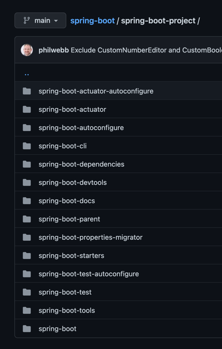

## Introduction

[Spring Boot](https://spring.io/projects/spring-boot) makes it easy to create stand-alone, production-grade Spring based Applications that you can "just run".

- [How to start Spring Boot Application?](/docs/CS/Java/Spring_Boot/Start.md)
- [actuator](/docs/CS/Java/Spring_Boot/actuator.md)


## Architecture



**Convention Over Configuration**

spring-boot
spring-boot-autoconfigure

spring-boot-starters

spring-boot-test


## AutoConfiguration

- Cache
- Log - LoggingApplicationListener

- JdbcTemplateAutoConfiguration
- DataSourceAutoConfiguration
- DispatcherServletAutoConfiguration
- WebMvcAutoConfiguration


## [How to start Spring Boot Application?](/docs/CS/Java/Spring_Boot/Start.md)


## YAML


How to bind the properties 

```groovy
annotationProcessor 'org.springframework.boot:spring-boot-configuration-processor'
```


## Tools

### DevTool

### SpringInitializer


### Lombok


## Web

resolve request order:

-  dynamic controller
- static resources

## Test


### Junit5

It's need JDK15 to build Junit5,.

#### Condition

#### Extension

#### Annotations

@DisplayName


##### @Timeout

##### @Isolated

##### @SpringBootTest

> [!TIP]
> 
> If you are using JUnit 4, do not forget to also add @RunWith(SpringRunner.class) to your test, otherwise the annotations will be ignored.

@AutoConfigureMockMvc

| Junit5                                      | Junit4                                  |
| ------------------------------------------- | --------------------------------------- |
| @Disabled                                   | @Ignore                                 |
| @ExtendWith                                 | @RunWith                                |
| @Tag                                        | @Category                               |
| @BeforeEach @AfterEach @BeforeAll @AfterAll | @Before @After @BeforeClass @AfterClass |


#### Assertions

static methods

Nest Test 

Inner test invoke Outer test.

##### Paramterized Test

Use different parameters to run test.

- @ParamterizedTest
- @ValueSource
- @CsvValueSource
- @MethodSource
- @EnumSource
- @NullSource


### WebMock

By default, @SpringBootTest does not start the server but instead sets up a mock environment for testing web endpoints.
With Spring MVC, we can query our web endpoints using MockMvc or WebTestClient, as shown in the following example:

```java
import org.junit.jupiter.api.Test;

import org.springframework.beans.factory.annotation.Autowired;
import org.springframework.boot.test.autoconfigure.web.servlet.AutoConfigureMockMvc;
import org.springframework.boot.test.context.SpringBootTest;
import org.springframework.test.web.reactive.server.WebTestClient;
import org.springframework.test.web.servlet.MockMvc;

import static org.springframework.test.web.servlet.request.MockMvcRequestBuilders.get;
import static org.springframework.test.web.servlet.result.MockMvcResultMatchers.content;
import static org.springframework.test.web.servlet.result.MockMvcResultMatchers.status;

@SpringBootTest
@AutoConfigureMockMvc
class MyMockMvcTests {

    @Test
    void testWithMockMvc(@Autowired MockMvc mvc) throws Exception {
        mvc.perform(get("/")).andExpect(status().isOk()).andExpect(content().string("Hello World"));
    }

    // If Spring WebFlux is on the classpath, you can drive MVC tests with a WebTestClient
    @Test
    void testWithWebTestClient(@Autowired WebTestClient webClient) {
        webClient
                .get().uri("/")
                .exchange()
                .expectStatus().isOk()
                .expectBody(String.class).isEqualTo("Hello World");
    }

}
```

> [!TIP]
> 
> If you want to focus only on the web layer and not start a complete ApplicationContext, consider using @WebMvcTest instead.


```java
@RunWith(SpringRunner.class)
@WebMvcTest(HelloController.class)
public class HelloTest {

    @Autowired
    private MockMvc mockMvc;

    @Test
    public void testHello() throws Exception {
        mockMvc.perform(MockMvcRequestBuilders.get("/hello"))
                .andExpect(MockMvcResultMatchers.status().isOk())
                .andExpect(MockMvcResultMatchers.content().string(containsString("Hello ")));
    }

}
```


## Actuator

Admin


```java
@ControllerAdvice
@ResponseBody
@Slf4j
public class GlobalExceptionHandler {

    @ExceptionHandler(NullPointerException.class) // set handle Exception 
    @ResponseStatus(value = HttpStatus.INTERNAL_SERVER_ERROR) // set Response Http Status
    public JsonResult handleTypeMismatchException(NullPointerException ex) {
        log.error("NullPointer，{}", ex.getMessage());
        return new JsonResult("500", "NullPointer");
    }
}
```

## Starter


## Links

- [Spring Framework](/docs/CS/Java/Spring/Spring.md)
- [Spring Cloud](/docs/CS/Java/Spring_Cloud/Spring_Cloud.md)

