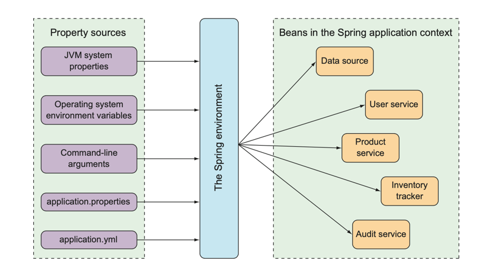

## Introduction

[Spring Boot](https://spring.io/projects/spring-boot) makes it easy to create stand-alone, production-grade Spring based Applications that you can "just run".

- [How to start Spring Boot Application?](/docs/CS/Java/Spring_Boot/Start.md)
- [actuator](/docs/CS/Java/Spring_Boot/actuator.md)

## Architecture


**Convention Over Configuration**

spring-boot
spring-boot-autoconfigure

spring-boot-starters

spring-boot-test

## AutoConfiguration

- Cache
- Log - LoggingApplicationListener
- JdbcTemplateAutoConfiguration
- DataSourceAutoConfiguration
- DispatcherServletAutoConfiguration
- WebMvcAutoConfiguration

## [How to start Spring Boot Application?](/docs/CS/Java/Spring_Boot/Start.md)

### Configuration properties

The Spring environment abstraction is a one-stop shop for any configurable property. It abstracts the origins of properties so that beans needing those properties can con- sume them from Spring itself. The Spring environment pulls from several property sources, including the following:

- JVM system properties
- Operating system environment variables
- Command-line arguments
- Application property configuration files

It then aggregates those properties into a single source from which Spring beans can be injected.
Figure 4 illustrates how properties from property sources flow through the Spring environment abstraction to Spring beans.

<div style="text-align: center;">



</div>

<p style="text-align: center;">
Fig.4. The Spring environment pulls properties from property sources and makes them available to beans in the application context.
</p>


```java
package tacos.web;
import org.springframework.boot.context.properties.
                    ConfigurationProperties;
import org.springframework.stereotype.Component;
import lombok.Data;

@Component
@ConfigurationProperties(prefix="taco.orders")
@Data
public class OrderProps {

  private int pageSize = 20;

}
```

## YAML

How to bind the properties

```groovy
annotationProcessor 'org.springframework.boot:spring-boot-configuration-processor'
```

## Tools

### DevTools

DevTools provides Spring developers with some handy develop-ment-time tools.
Among those are the following:

- Automatic application restart when code changes
- Automatic browser refresh when browser-destined resources (such as templates, JavaScript, stylesheets, and so on) change
- Automatic disabling of template caches
- Built in H2 Console, if the H2 database is in use

More precisely, when DevTools is active, the application is loaded into two separate class loaders in the Java virtual machine (JVM). One class loader is loaded with your Java code, property files, and pretty much anything that’s in the src/main/ path of the project. These are items that are likely to change frequently. The other class loader is loaded with dependency libraries, which aren’t likely to change as often.

When a change is detected, DevTools reloads only the class loader containing your project code and restarts the Spring application context but leaves the other class loader and the JVM intact. Although subtle, this strategy affords a small reduction in the time it takes to start the application.

The downside of this strategy is that changes to dependencies won’t be available in automatic restarts. That’s because the class loader containing dependency libraries isn’t automatically reloaded. Any time you add, change, or remove a dependency in your build specification, you’ll need to do a hard restart of the application for those changes to take effect.

### SpringInitializer

### Lombok

## Web

resolve request order:

- dynamic controller
- static resources

## Test

### Junit5

It's need JDK15 to build Junit5,.

#### Condition

#### Extension

#### Annotations

@DisplayName

##### @Timeout

##### @Isolated

##### @SpringBootTest

> [!TIP]
>
> If you are using JUnit 4, do not forget to also add @RunWith(SpringRunner.class) to your test, otherwise the annotations will be ignored.

@AutoConfigureMockMvc


| Junit5                                      | Junit4                                  |
| ------------------------------------------- | --------------------------------------- |
| @Disabled                                   | @Ignore                                 |
| @ExtendWith                                 | @RunWith                                |
| @Tag                                        | @Category                               |
| @BeforeEach @AfterEach @BeforeAll @AfterAll | @Before @After @BeforeClass @AfterClass |

#### Assertions

static methods

Nest Test

Inner test invoke Outer test.

##### Paramterized Test

Use different parameters to run test.

- @ParamterizedTest
- @ValueSource
- @CsvValueSource
- @MethodSource
- @EnumSource
- @NullSource

### WebMock

By default, @SpringBootTest does not start the server but instead sets up a mock environment for testing web endpoints.
With Spring MVC, we can query our web endpoints using MockMvc or WebTestClient, as shown in the following example:

```java
import org.junit.jupiter.api.Test;

import org.springframework.beans.factory.annotation.Autowired;
import org.springframework.boot.test.autoconfigure.web.servlet.AutoConfigureMockMvc;
import org.springframework.boot.test.context.SpringBootTest;
import org.springframework.test.web.reactive.server.WebTestClient;
import org.springframework.test.web.servlet.MockMvc;

import static org.springframework.test.web.servlet.request.MockMvcRequestBuilders.get;
import static org.springframework.test.web.servlet.result.MockMvcResultMatchers.content;
import static org.springframework.test.web.servlet.result.MockMvcResultMatchers.status;

@SpringBootTest
@AutoConfigureMockMvc
class MyMockMvcTests {

    @Test
    void testWithMockMvc(@Autowired MockMvc mvc) throws Exception {
        mvc.perform(get("/")).andExpect(status().isOk()).andExpect(content().string("Hello World"));
    }

    // If Spring WebFlux is on the classpath, you can drive MVC tests with a WebTestClient
    @Test
    void testWithWebTestClient(@Autowired WebTestClient webClient) {
        webClient
                .get().uri("/")
                .exchange()
                .expectStatus().isOk()
                .expectBody(String.class).isEqualTo("Hello World");
    }

}
```

> [!TIP]
>
> If you want to focus only on the web layer and not start a complete ApplicationContext, consider using @WebMvcTest instead.

```java
@RunWith(SpringRunner.class)
@WebMvcTest(HelloController.class)
public class HelloTest {

    @Autowired
    private MockMvc mockMvc;

    @Test
    public void testHello() throws Exception {
        mockMvc.perform(MockMvcRequestBuilders.get("/hello"))
                .andExpect(MockMvcResultMatchers.status().isOk())
                .andExpect(MockMvcResultMatchers.content().string(containsString("Hello ")));
    }

}
```

## Actuator

Admin

```java
@ControllerAdvice
@ResponseBody
@Slf4j
public class GlobalExceptionHandler {

    @ExceptionHandler(NullPointerException.class) // set handle Exception 
    @ResponseStatus(value = HttpStatus.INTERNAL_SERVER_ERROR) // set Response Http Status
    public JsonResult handleTypeMismatchException(NullPointerException ex) {
        log.error("NullPointer，{}", ex.getMessage());
        return new JsonResult("500", "NullPointer");
    }
}
```

## Starter

## Links

- [Spring Framework](/docs/CS/Java/Spring/Spring.md)
- [Spring Cloud](/docs/CS/Java/Spring_Cloud/Spring_Cloud.md)
