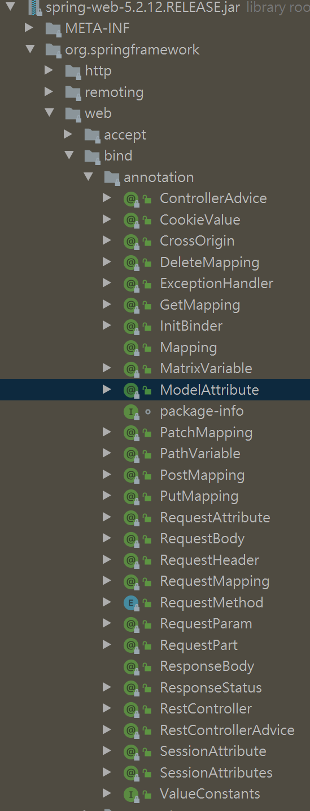

# Spring Boot


### [How to start Spring Boot Application?](/docs/CS/Java/Spring_Boot/Start.md)

## Web



## YAML


How to bind the properties 

```groovy
annotationProcessor 'org.springframework.boot:spring-boot-configuration-processor'
```


## Tools

### DevTool

### SpringInitializer


### Lombok


## Web

resolve request order:

-  dynamic controller
- static resources

## Test


### Junit5

It's need JDK15 to build Junit5,.

#### Condition

#### Extension

#### Annotations

@DisplayName


##### @Timeout

##### @Isolated

##### @SpringBootTest


| Junit5                                      | Junit4                                  |
| ------------------------------------------- | --------------------------------------- |
| @Disabled                                   | @Ignore                                 |
| @ExtendWith                                 | @RunWith                                |
| @Tag                                        | @Category                               |
| @BeforeEach @AfterEach @BeforeAll @AfterAll | @Before @After @BeforeClass @AfterClass |


#### Assertions

static methods

Nest Test 

Inner test invoke Outer test.

##### Paramterized Test

Use different parameters to run test.

- @ParamterizedTest
- @ValueSource
- @CsvValueSource
- @MethodSource
- @EnumSource
- @NullSource


#### Actuator

Admin


Starter


