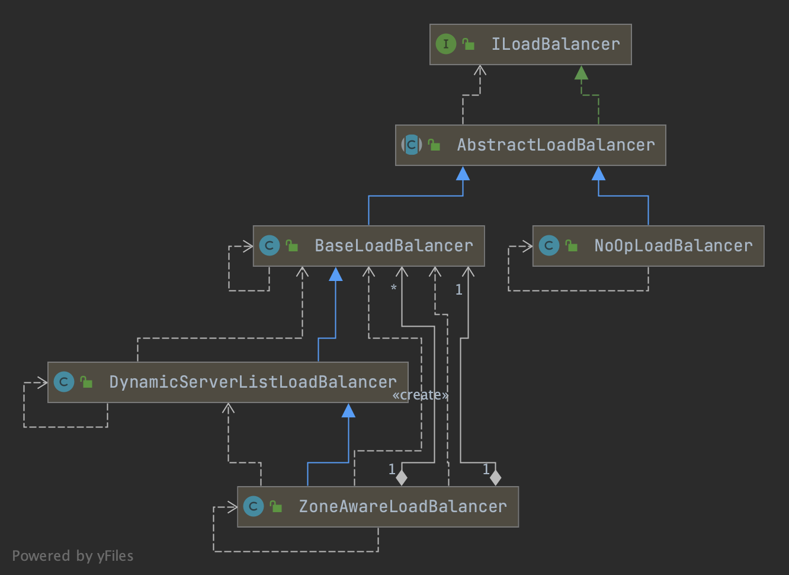
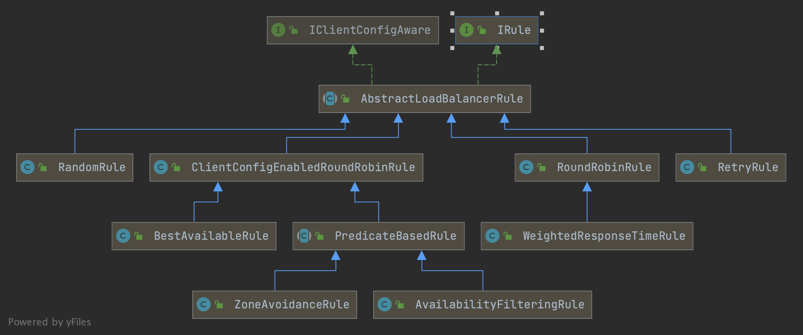

## LoadBalancerClient
```java
// org.springframework.cloud.client.loadbalancer.LoadBalancerClient
public interface LoadBalancerClient extends ServiceInstanceChooser {

    /**
     * Executes request using a ServiceInstance from the LoadBalancer for the specified
     * service.
     * @param serviceId The service ID to look up the LoadBalancer.
     * @param request Allows implementations to execute pre and post actions, such as
     * incrementing metrics.
     * @param <T> type of the response
     * @throws IOException in case of IO issues.
     * @return The result of the LoadBalancerRequest callback on the selected
     * ServiceInstance.
     */
    <T> T execute(String serviceId, LoadBalancerRequest<T> request) throws IOException;

    /**
     * Executes request using a ServiceInstance from the LoadBalancer for the specified
     * service.
     * @param serviceId The service ID to look up the LoadBalancer.
     * @param serviceInstance The service to execute the request to.
     * @param request Allows implementations to execute pre and post actions, such as
     * incrementing metrics.
     * @param <T> type of the response
     * @throws IOException in case of IO issues.
     * @return The result of the LoadBalancerRequest callback on the selected
     * ServiceInstance.
     */
    <T> T execute(String serviceId, ServiceInstance serviceInstance,
                  LoadBalancerRequest<T> request) throws IOException;

    /**
     * Creates a proper URI with a real host and port for systems to utilize. Some systems
     * use a URI with the logical service name as the host, such as
     * http://myservice/path/to/service. This will replace the service name with the
     * host:port from the ServiceInstance.
     * @param instance service instance to reconstruct the URI
     * @param original A URI with the host as a logical service name.
     * @return A reconstructed URI.
     */
    URI reconstructURI(ServiceInstance instance, URI original);

}

// org.springframework.cloud.client.loadbalancer.ServiceInstanceChooser
// Implemented by classes which use a load balancer to choose a server to send a request to.
public interface ServiceInstanceChooser {

    /**
     * Chooses a ServiceInstance from the LoadBalancer for the specified service.
     * @param serviceId The service ID to look up the LoadBalancer.
     * @return A ServiceInstance that matches the serviceId.
     */
    ServiceInstance choose(String serviceId);

}
```

Auto-configuration for blocking client-side load balancing.


loadBalancerInterceptor
RestTemplateCustomizer set interceptors to RestTemplate

```java
@Configuration(proxyBeanMethods = false)
@ConditionalOnClass(RestTemplate.class)
@ConditionalOnBean(LoadBalancerClient.class)
@EnableConfigurationProperties(LoadBalancerRetryProperties.class)
public class LoadBalancerAutoConfiguration {

    @LoadBalanced
    @Autowired(required = false)
    private List<RestTemplate> restTemplates = Collections.emptyList();


    @Bean
    public LoadBalancerInterceptor loadBalancerInterceptor(
        LoadBalancerClient loadBalancerClient,
        LoadBalancerRequestFactory requestFactory) {
    return new LoadBalancerInterceptor(loadBalancerClient, requestFactory);
    }
    
    @Bean
    @ConditionalOnMissingBean
    public RestTemplateCustomizer restTemplateCustomizer(
            final LoadBalancerInterceptor loadBalancerInterceptor) {
        return restTemplate -> {
            List<ClientHttpRequestInterceptor> list = new ArrayList<>(
                    restTemplate.getInterceptors());
            list.add(loadBalancerInterceptor);
            restTemplate.setInterceptors(list);
        };
    }    
...
}
```


### RibbonLoadBalancerClient

#### execute
1. [ILoadBalancer#chooseServer()](/docs/CS/Java/Spring_Cloud/Ribbon.md?id=chooseserver)
2. LoadBalancerRequest#apply() -> AsyncLoadBalancerInterceptor#intercept()
```java
    // RibbonLoadBalancerClient
    @Override
	public <T> T execute(String serviceId, ServiceInstance serviceInstance,
			LoadBalancerRequest<T> request) throws IOException {
		Server server = null;
		if (serviceInstance instanceof RibbonServer) {
			server = ((RibbonServer) serviceInstance).getServer();
		}
		if (server == null) {
			throw new IllegalStateException("No instances available for " + serviceId);
		}

		RibbonLoadBalancerContext context = this.clientFactory
				.getLoadBalancerContext(serviceId);
		RibbonStatsRecorder statsRecorder = new RibbonStatsRecorder(context, server);

		try {
			T returnVal = request.apply(serviceInstance);
			statsRecorder.recordStats(returnVal);
			return returnVal;
		}
		// catch IOException and rethrow so RestTemplate behaves correctly
		catch (IOException ex) {
			statsRecorder.recordStats(ex);
			throw ex;
		}
		catch (Exception ex) {
			statsRecorder.recordStats(ex);
			ReflectionUtils.rethrowRuntimeException(ex);
		}
		return null;
	}
```

```java
protected Server getServer(ILoadBalancer loadBalancer, Object hint) {
		if (loadBalancer == null) {
			return null;
		}
		// Use 'default' on a null hint, or just pass it on?
		return loadBalancer.chooseServer(hint != null ? hint : "default");
	}
```


AsyncLoadBalancerInterceptor#intercept() wrap request to `ServiceRequestWrapper` then executeAsync by `org.springframework.http.client.AsyncClientHttpRequestExecution`
```java
// org.springframework.cloud.client.loadbalancer.AsyncLoadBalancerInterceptor
    public ListenableFuture<ClientHttpResponse> intercept(final HttpRequest request, final byte[] body, final AsyncClientHttpRequestExecution execution) throws IOException {
        URI originalUri = request.getURI();
        String serviceName = originalUri.getHost();
        return (ListenableFuture)this.loadBalancer.execute(serviceName, new LoadBalancerRequest<ListenableFuture<ClientHttpResponse>>() {
            public ListenableFuture<ClientHttpResponse> apply(final ServiceInstance instance) throws Exception {
                HttpRequest serviceRequest = new ServiceRequestWrapper(request, instance, AsyncLoadBalancerInterceptor.this.loadBalancer);
                return execution.executeAsync(serviceRequest, body);
            }
        });
    }

```

## ILoadBalancer




Default use `ZoneAwareLoadBalancer` which can avoid a zone as a whole when choosing server.
```java
// org.springframework.cloud.netflix.ribbon
@Configuration(proxyBeanMethods = false)
@EnableConfigurationProperties
// Order is important here, last should be the default, first should be optional
// see
// https://github.com/spring-cloud/spring-cloud-netflix/issues/2086#issuecomment-316281653
@Import({ HttpClientConfiguration.class, OkHttpRibbonConfiguration.class,
		RestClientRibbonConfiguration.class, HttpClientRibbonConfiguration.class })
public class RibbonClientConfiguration {

    @Bean
    @ConditionalOnMissingBean
    public ILoadBalancer ribbonLoadBalancer(IClientConfig config,
                                            ServerList<Server> serverList, ServerListFilter<Server> serverListFilter,
                                            IRule rule, IPing ping, ServerListUpdater serverListUpdater) {
        if (this.propertiesFactory.isSet(ILoadBalancer.class, name)) {
            return this.propertiesFactory.get(ILoadBalancer.class, config, name);
        }
        return new ZoneAwareLoadBalancer<>(config, rule, ping, serverList,
                serverListFilter, serverListUpdater);
    }
}
```

#### chooseServer
default `RoundRobinRule`
```java
// ZoneAwareLoadBalancer
@Override
public Server chooseServer(Object key) {
    if (!ENABLED.get() || getLoadBalancerStats().getAvailableZones().size() <= 1) {
    logger.debug("Zone aware logic disabled or there is only one zone");
    return super.chooseServer(key);
    }
    Server server = null;
    try {
    LoadBalancerStats lbStats = getLoadBalancerStats();
    Map<String, ZoneSnapshot> zoneSnapshot = ZoneAvoidanceRule.createSnapshot(lbStats);
    logger.debug("Zone snapshots: {}", zoneSnapshot);
    if (triggeringLoad == null) {
    triggeringLoad = DynamicPropertyFactory.getInstance().getDoubleProperty(
    "ZoneAwareNIWSDiscoveryLoadBalancer." + this.getName() + ".triggeringLoadPerServerThreshold", 0.2d);
    }

    if (triggeringBlackoutPercentage == null) {
    triggeringBlackoutPercentage = DynamicPropertyFactory.getInstance().getDoubleProperty(
    "ZoneAwareNIWSDiscoveryLoadBalancer." + this.getName() + ".avoidZoneWithBlackoutPercetage", 0.99999d);
    }
    Set<String> availableZones = ZoneAvoidanceRule.getAvailableZones(zoneSnapshot, triggeringLoad.get(), triggeringBlackoutPercentage.get());
    logger.debug("Available zones: {}", availableZones);
    if (availableZones != null &&  availableZones.size() < zoneSnapshot.keySet().size()) {
    String zone = ZoneAvoidanceRule.randomChooseZone(zoneSnapshot, availableZones);
    logger.debug("Zone chosen: {}", zone);
    if (zone != null) {
    BaseLoadBalancer zoneLoadBalancer = getLoadBalancer(zone);
    server = zoneLoadBalancer.chooseServer(key);
    }
    }
    } catch (Exception e) {
    logger.error("Error choosing server using zone aware logic for load balancer={}", name, e);
    }
    if (server != null) {
    return server;
    } else {
    logger.debug("Zone avoidance logic is not invoked.");
    return super.chooseServer(key);
    }
    }
   
    // BaseLoadBalancer
    private final static IRule DEFAULT_RULE = new RoundRobinRule();
    // Get the alive server dedicated to key
    public Server chooseServer(Object key) {
        if (counter == null) {
            counter = createCounter();
        }
        counter.increment();
        if (rule == null) {
            return null;
        } else {
            try {
                return rule.choose(key);
            } catch (Exception e) {
                logger.warn("LoadBalancer [{}]:  Error choosing server for key {}", name, key, e);
                return null;
            }
        }
    }
```

## IRule



