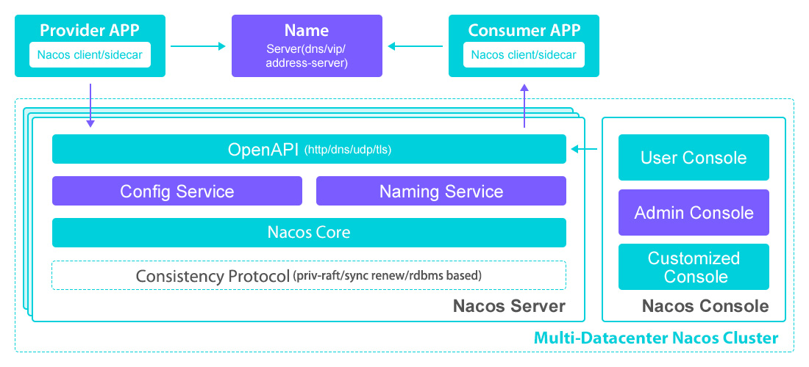

## Introduction

Nacos `/nɑ:kəʊs/` 是 Dynamic Naming and Configuration Service的首字母简称，一个更易于构建云原生应用的动态服务发现、配置管理和服务管理平台 

来源于阿里内部三个产品（Configserver 非持久注册中心， VIPServer 持久化注册中心， Diamond 配置中心 最早⼀个产品逐步演化成 3 个产品的）   

Nacos 支持将注册中心(Service Registry）与配置中心(Config Center) 在一个进程合并部署或者将2者分离部署的两种模式


服务（Service）是 Nacos 世界的一等公民。Nacos 支持几乎所有主流类型的“服务”的发现、配置和管理

Nacos 的关键特性包括:

- **Service Discovery And Service Health Check**
  Nacos supports both DNS-based and RPC-based (Dubbo/gRPC) [service discovery](/docs/CS/Java/Spring_Cloud/nacos/registry.md). 
  After a service provider registers a service with native, OpenAPI, or a dedicated agent, a consumer can discover the service with either DNS or HTTP.
  Nacos provides real-time health check to prevent services from sending requests to unhealthy hosts or service instances. 
  Nacos supports both transport layer (PING or TCP) health check and application layer (such as HTTP, Redis, MySQL, and user-defined protocol) health check. 
  For the health check of complex clouds and network topologies(such as VPC, Edge Service etc), Nacos provides both agent mode and server mode health check. 
  Nacos also provide a unity service health dashboard to help you manage the availability and traffic of services.
- **Dynamic configuration management**
  [Dynamic configuration](/docs/CS/Java/Spring_Cloud/nacos/config.md) service allows you to manage the configuration of all applications and services in a centralized, externalized and dynamic manner across all environments.
  Dynamic configuration eliminates the need to redeploy applications and services when configurations are updated.
  Centralized management of configuration makes it more convenient for you to achieve stateless services and elastic expansion of service instances on-demand.
  Nacos provides an easy-to-use UI (DEMO) to help you manage all of your application or services's configurations. 
  It provides some out-of-box features including configuration version tracking, canary/beta release, configuration rollback, and client configuration update status tracking to ensure the safety and control the risk of configuration change.

- **Dynamic DNS service**
  Dynamic DNS service which supports weighted routing makes it easier for you to implement mid-tier load balancing, flexible routing policies, traffic control, and simple DNS resolution services in your production environment within your data center. 
  Dynamic DNS service makes it easier for you to implement DNS-based Service discovery.
  Nacos provides some simple DNS APIs TODO for you to manage your DNS domain names and IPs.
- **Service governance and metadata management**
  Nacos allows you to manage all of your services and metadata from the perspective of a microservices platform builder. 
  This includes managing service description, life cycle, service static dependencies analysis, service health status, service traffic management，routing and security rules, service SLA, and first line metrics.


## Architecture

整体架构分为用户层、 业务层、 内核层和插件， 用户层主要解决用户使用的易用性问题， 业务层主要解决服务发现和配置管理的功能问题， 内核层解决分布式系统⼀致性、 存储、 高可用等核心问题，插件解决扩展性问题。  



采⽤了阿⾥巴巴内部⾃研的 Distro 协议来实现数据弱⼀致性同步。其中
所有节点都将存储集群内所有服务元数据，因此都可以提供数据读取服务，但每个节点只负责
⼀部分客户端的数据写服务


## Service Registry

Nacos 作为注册中心，用来接收客户端（服务实例）发起的注册请求，并将注册信息存放到注册中心进行管理


```java
public interface NamingClientProxy extends Closeable {
  void registerService(String serviceName, String groupName, Instance instance) throws NacosException;
    
}

public class NamingClientProxyDelegate implements NamingClientProxy {
    private NamingClientProxy getExecuteClientProxy(Instance instance) {
        if (instance.isEphemeral() || grpcClientProxy.isAbilitySupportedByServer(AbilityKey.SERVER_SUPPORT_PERSISTENT_INSTANCE_BY_GRPC)) {
            return grpcClientProxy;
        }
        return httpClientProxy;
    }
}
```


grpc


```java
@Override
    public void registerService(String serviceName, String groupName, Instance instance) throws NacosException {
        NAMING_LOGGER.info("[REGISTER-SERVICE] {} registering service {} with instance {}", namespaceId, serviceName,
                instance);
        if (instance.isEphemeral()) {
            registerServiceForEphemeral(serviceName, groupName, instance);
        } else {
            doRegisterServiceForPersistent(serviceName, groupName, instance);
        }
    }

```

临时服务实例就是我们默认使用的 Nacos 注册中心模式，客户端注册后，客户端需要定时上报心跳信息来进行服务实例续约。这个在注册的时候，可以通过传参设置是否是临时实例。

持久化服务实例就是不需要上报心跳信息的，不会被自动摘除，除非手动移除实例，如果实例宕机了，Nacos 只会将这个客户端标记为不健康。


Ephemeral

```java
private void registerServiceForEphemeral(String serviceName, String groupName, Instance instance)
            throws NacosException {
        redoService.cacheInstanceForRedo(serviceName, groupName, instance);
        doRegisterService(serviceName, groupName, instance);
    }
    
public void doRegisterService(String serviceName, String groupName, Instance instance) throws NacosException {
        InstanceRequest request = new InstanceRequest(namespaceId, serviceName, groupName,
                NamingRemoteConstants.REGISTER_INSTANCE, instance);
        requestToServer(request, Response.class);
  			// Instance register successfully, mark registered status as true.
        redoService.instanceRegistered(serviceName, groupName);
    }
```

Persistent


```java
public void doRegisterServiceForPersistent(String serviceName, String groupName, Instance instance)
            throws NacosException {
        PersistentInstanceRequest request = new PersistentInstanceRequest(namespaceId, serviceName, groupName,
                NamingRemoteConstants.REGISTER_INSTANCE, instance);
        requestToServer(request, Response.class);
    }


 private <T extends Response> T requestToServer(AbstractNamingRequest request, Class<T> responseClass)
            throws NacosException {
        Response response = null;
        try {
            request.putAllHeader(
                    getSecurityHeaders(request.getNamespace(), request.getGroupName(), request.getServiceName()));
            response = requestTimeout < 0 ? rpcClient.request(request) : rpcClient.request(request, requestTimeout);
            if (ResponseCode.SUCCESS.getCode() != response.getResultCode()) {
                throw new NacosException(response.getErrorCode(), response.getMessage());
            }
            if (responseClass.isAssignableFrom(response.getClass())) {
                return (T) response;
            }
            NAMING_LOGGER.error("Server return unexpected response '{}', expected response should be '{}'",
                    response.getClass().getName(), responseClass.getName());
            throw new NacosException(NacosException.SERVER_ERROR, "Server return invalid response");
        } catch (NacosException e) {
            recordRequestFailedMetrics(request, e, response);
            throw e;
        } catch (Exception e) {
            recordRequestFailedMetrics(request, e, response);
            throw new NacosException(NacosException.SERVER_ERROR, "Request nacos server failed: ", e);
        }
    }
```


RPC client

```java
public final void start() throws NacosException {
        
        boolean success = rpcClientStatus.compareAndSet(RpcClientStatus.INITIALIZED, RpcClientStatus.STARTING);
        if (!success) {
            return;
        }
        
        clientEventExecutor = new ScheduledThreadPoolExecutor(2,
                new NameThreadFactory("com.alibaba.nacos.client.remote.worker"));
        
        // connection event consumer.
        clientEventExecutor.submit(() -> {
            while (!clientEventExecutor.isTerminated() && !clientEventExecutor.isShutdown()) {
                ConnectionEvent take;
                try {
                    take = eventLinkedBlockingQueue.take();
                    if (take.isConnected()) {
                        notifyConnected(take.connection);
                    } else if (take.isDisConnected()) {
                        notifyDisConnected(take.connection);
                    }
                } catch (Throwable e) {
                    // Do nothing
                }
            }
        });
        
        clientEventExecutor.submit(() -> {
            while (true) {
                try {
                    if (isShutdown()) {
                        break;
                    }
                    ReconnectContext reconnectContext = reconnectionSignal
                            .poll(rpcClientConfig.connectionKeepAlive(), TimeUnit.MILLISECONDS);
                    if (reconnectContext == null) {
                        // check alive time.
                        if (System.currentTimeMillis() - lastActiveTimeStamp >= rpcClientConfig.connectionKeepAlive()) {
                            boolean isHealthy = healthCheck();
                            if (!isHealthy) {
                                if (currentConnection == null) {
                                    continue;
                                }
                                LoggerUtils.printIfInfoEnabled(LOGGER,
                                        "[{}] Server healthy check fail, currentConnection = {}",
                                        rpcClientConfig.name(), currentConnection.getConnectionId());
                                
                                RpcClientStatus rpcClientStatus = RpcClient.this.rpcClientStatus.get();
                                if (RpcClientStatus.SHUTDOWN.equals(rpcClientStatus)) {
                                    break;
                                }
                                
                                boolean statusFLowSuccess = RpcClient.this.rpcClientStatus
                                        .compareAndSet(rpcClientStatus, RpcClientStatus.UNHEALTHY);
                                if (statusFLowSuccess) {
                                    reconnectContext = new ReconnectContext(null, false);
                                } else {
                                    continue;
                                }
                                
                            } else {
                                lastActiveTimeStamp = System.currentTimeMillis();
                                continue;
                            }
                        } else {
                            continue;
                        }
                        
                    }
                    
                    if (reconnectContext.serverInfo != null) {
                        // clear recommend server if server is not in server list.
                        boolean serverExist = false;
                        for (String server : getServerListFactory().getServerList()) {
                            ServerInfo serverInfo = resolveServerInfo(server);
                            if (serverInfo.getServerIp().equals(reconnectContext.serverInfo.getServerIp())) {
                                serverExist = true;
                                reconnectContext.serverInfo.serverPort = serverInfo.serverPort;
                                break;
                            }
                        }
                        if (!serverExist) {
                            LoggerUtils.printIfInfoEnabled(LOGGER,
                                    "[{}] Recommend server is not in server list, ignore recommend server {}",
                                    rpcClientConfig.name(), reconnectContext.serverInfo.getAddress());
                            
                            reconnectContext.serverInfo = null;
                            
                        }
                    }
                    reconnect(reconnectContext.serverInfo, reconnectContext.onRequestFail);
                } catch (Throwable throwable) {
                    // Do nothing
                }
            }
        });
        
        // connect to server, try to connect to server sync retryTimes times, async starting if failed.
        Connection connectToServer = null;
        rpcClientStatus.set(RpcClientStatus.STARTING);
        
        int startUpRetryTimes = rpcClientConfig.retryTimes();
        while (startUpRetryTimes >= 0 && connectToServer == null) {
            try {
                startUpRetryTimes--;
                ServerInfo serverInfo = nextRpcServer();
                
                LoggerUtils.printIfInfoEnabled(LOGGER, "[{}] Try to connect to server on start up, server: {}",
                        rpcClientConfig.name(), serverInfo);
                
                connectToServer = connectToServer(serverInfo);
            } catch (Throwable e) {
                LoggerUtils.printIfWarnEnabled(LOGGER,
                        "[{}] Fail to connect to server on start up, error message = {}, start up retry times left: {}",
                        rpcClientConfig.name(), e.getMessage(), startUpRetryTimes, e);
            }
            
        }
        
        if (connectToServer != null) {
            LoggerUtils
                    .printIfInfoEnabled(LOGGER, "[{}] Success to connect to server [{}] on start up, connectionId = {}",
                            rpcClientConfig.name(), connectToServer.serverInfo.getAddress(),
                            connectToServer.getConnectionId());
            this.currentConnection = connectToServer;
            rpcClientStatus.set(RpcClientStatus.RUNNING);
            eventLinkedBlockingQueue.offer(new ConnectionEvent(ConnectionEvent.CONNECTED, currentConnection));
        } else {
            switchServerAsync();
        }
        
        registerServerRequestHandler(new ConnectResetRequestHandler());
        
        // register client detection request.
        registerServerRequestHandler((request, connection) -> {
            if (request instanceof ClientDetectionRequest) {
                return new ClientDetectionResponse();
            }
            
            return null;
        });
    }
```


Abstract Connection

```java
public abstract class Connection implements Requester {
}
```


### server louter forward

#### DistroFilter


```java
public class DistroFilter implements Filter {

    @Override
    public void doFilter(ServletRequest servletRequest, ServletResponse servletResponse, FilterChain filterChain)
            throws IOException, ServletException {
        ReuseHttpServletRequest req = new ReuseHttpServletRequest((HttpServletRequest) servletRequest);
        HttpServletResponse resp = (HttpServletResponse) servletResponse;

        String urlString = req.getRequestURI();
        if (StringUtils.isNotBlank(req.getQueryString())) {
            urlString += ”?“+req.getQueryString();
        }

        try {
            Method method = controllerMethodsCache.getMethod(req);

            String path = new URI(req.getRequestURI()).getPath();
            if (!method.isAnnotationPresent(CanDistro.class)) {
                filterChain.doFilter(req, resp);
                return;
            }
            String distroTag = distroTagGenerator.getResponsibleTag(req);

            if (distroMapper.responsible(distroTag)) {
                filterChain.doFilter(req, resp);
                return;
            }

            // proxy request to other server if necessary:
            String userAgent = req.getHeader(HttpHeaderConsts.USER_AGENT_HEADER);

            if (StringUtils.isNotBlank(userAgent) && userAgent.contains(UtilsAndCommons.NACOS_SERVER_HEADER)) {
                // This request is sent from peer server, should not be redirected again:
                Loggers.SRV_LOG.error(”receive invalid redirect request from peer {
                }“,req.getRemoteAddr());
                resp.sendError(HttpServletResponse.SC_BAD_REQUEST,
                        ”receive invalid redirect request from peer “ + req.getRemoteAddr());
                return;
            }

            final String targetServer = distroMapper.mapSrv(distroTag);

            List<String> headerList = new ArrayList<>(16);
            Enumeration<String> headers = req.getHeaderNames();
            while (headers.hasMoreElements()) {
                String headerName = headers.nextElement();
                headerList.add(headerName);
                headerList.add(req.getHeader(headerName));
            }

            final String body = IoUtils.toString(req.getInputStream(), StandardCharsets.UTF_8.name());
            final Map<String, String> paramsValue = HttpClient.translateParameterMap(req.getParameterMap());

            RestResult<String> result = HttpClient
                    .request(HTTP_PREFIX + targetServer + req.getRequestURI(), headerList, paramsValue, body,
                            PROXY_CONNECT_TIMEOUT, PROXY_READ_TIMEOUT, StandardCharsets.UTF_8.name(), req.getMethod());
            String data = result.ok() ? result.getData() : result.getMessage();
            try {
                WebUtils.response(resp, data, result.getCode());
            } catch (Exception ignore) {
                Loggers.SRV_LOG.warn(”[DISTRO - FILTER] request failed: “+distroMapper.mapSrv(distroTag) + urlString);
            }
        } catch (AccessControlException e) {
            resp.sendError(HttpServletResponse.SC_FORBIDDEN, ”access denied: “+ExceptionUtil.getAllExceptionMsg(e));
        } catch (NoSuchMethodException e) {
            resp.sendError(HttpServletResponse.SC_NOT_IMPLEMENTED,
                    ”no such api:“+req.getMethod() + ”:“+req.getRequestURI());
        } catch (Exception e) {
            Loggers.SRV_LOG.warn(”[DISTRO - FILTER] Server failed: “,e);
            resp.sendError(HttpServletResponse.SC_INTERNAL_SERVER_ERROR,
                    ”Server failed, “ + ExceptionUtil.getAllExceptionMsg(e));
        }
    }
}
```


register

```java 
    @CanDistro
    @PostMapping
    @TpsControl(pointName = ”NamingInstanceRegister“, name = ”HttpNamingInstanceRegister“)
    @Secured(action = ActionTypes.WRITE)
    public String register(HttpServletRequest request) throws Exception {
        
        final String namespaceId = WebUtils.optional(request, CommonParams.NAMESPACE_ID,
                Constants.DEFAULT_NAMESPACE_ID);
        final String serviceName = WebUtils.required(request, CommonParams.SERVICE_NAME);
        NamingUtils.checkServiceNameFormat(serviceName);
        
        final Instance instance = HttpRequestInstanceBuilder.newBuilder()
                .setDefaultInstanceEphemeral(switchDomain.isDefaultInstanceEphemeral()).setRequest(request).build();
        
        getInstanceOperator().registerInstance(namespaceId, serviceName, instance);
        NotifyCenter.publishEvent(new RegisterInstanceTraceEvent(System.currentTimeMillis(), ”“, false, namespaceId,
                NamingUtils.getGroupName(serviceName), NamingUtils.getServiceName(serviceName), instance.getIp(),
                instance.getPort()));
        return ”ok“;
    }

@Override
    public void registerInstance(String namespaceId, String serviceName, Instance instance) throws NacosException {
        NamingUtils.checkInstanceIsLegal(instance);
        
        boolean ephemeral = instance.isEphemeral();
        String clientId = IpPortBasedClient.getClientId(instance.toInetAddr(), ephemeral);
        createIpPortClientIfAbsent(clientId);
        Service service = getService(namespaceId, serviceName, ephemeral);
        clientOperationService.registerInstance(service, instance, clientId);
    }

@Override
    public void registerInstance(Service service, Instance instance, String clientId) throws NacosException {
        final ClientOperationService operationService = chooseClientOperationService(instance);
        operationService.registerInstance(service, instance, clientId);
    }


@Component(”persistentClientOperationServiceImpl“)
public class PersistentClientOperationServiceImpl extends RequestProcessor4CP implements ClientOperationService {
@Override
    public void registerInstance(Service service, Instance instance, String clientId) {
        Service singleton = ServiceManager.getInstance().getSingleton(service);
        if (singleton.isEphemeral()) {
            throw new NacosRuntimeException(NacosException.INVALID_PARAM,
                    String.format(”Current service %s is ephemeral service, can‘t register persistent instance.“,
                            singleton.getGroupedServiceName()));
        }
        final InstanceStoreRequest request = new InstanceStoreRequest();
        request.setService(service);
        request.setInstance(instance);
        request.setClientId(clientId);
        final WriteRequest writeRequest = WriteRequest.newBuilder().setGroup(group())
                .setData(ByteString.copyFrom(serializer.serialize(request))).setOperation(DataOperation.ADD.name())
                .build();
        
        try {
            protocol.write(writeRequest);
            Loggers.RAFT.info(”Client registered. service={}, clientId={}, instance={}“, service, clientId, instance);
        } catch (Exception e) {
            throw new NacosRuntimeException(NacosException.SERVER_ERROR, e);
        }
    }
}
```


### HTTP


## Config


## Consistency


### JRaft

A concrete implementation of CP protocol: JRaft.

```java
/**
 * <pre>
 *                                           ┌──────────────────────┐
 *            ┌──────────────────────┐       │                      ▼
 *            │   ProtocolManager    │       │        ┌───────────────────────────┐
 *            └──────────────────────┘       │        │for p in [LogProcessor4CP] │
 *                        │                  │        └───────────────────────────┘
 *                        ▼                  │                      │
 *      ┌──────────────────────────────────┐ │                      ▼
 *      │    discovery LogProcessor4CP     │ │             ┌─────────────────┐
 *      └──────────────────────────────────┘ │             │  get p.group()  │
 *                        │                  │             └─────────────────┘
 *                        ▼                  │                      │
 *                 ┌─────────────┐           │                      │
 *                 │ RaftConfig  │           │                      ▼
 *                 └─────────────┘           │      ┌──────────────────────────────┐
 *                        │                  │      │  create raft group service   │
 *                        ▼                  │      └──────────────────────────────┘
 *              ┌──────────────────┐         │
 *              │  JRaftProtocol   │         │
 *              └──────────────────┘         │
 *                        │                  │
 *                     init()                │
 *                        │                  │
 *                        ▼                  │
 *               ┌─────────────────┐         │
 *               │   JRaftServer   │         │
 *               └─────────────────┘         │
 *                        │                  │
 *                        │                  │
 *                        ▼                  │
 *             ┌────────────────────┐        │
 *             │JRaftServer.start() │        │
 *             └────────────────────┘        │
 *                        │                  │
 *                        └──────────────────┘
 * </pre>
 *
 */
```


## Links

- [Spring Cloud](/docs/CS/Java/Spring_Cloud/Spring_Cloud.md)

## References
1. [Quick Start for Nacos Spring Boot Projects](https://nacos.io/en-us/docs/quick-start-spring-boot.html)