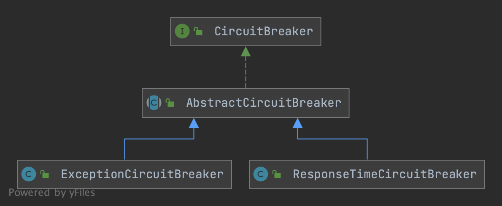

## Overview


```java
public interface CircuitBreaker {

    /**
     * Get the associated circuit breaking rule.
     */
    DegradeRule getRule();

    /**
     * Acquires permission of an invocation only if it is available at the time of invoking.
     */
    boolean tryPass(Context context);

    /**
     * Get current state of the circuit breaker.
     */
    State currentState();

    /**
     * <p>Record a completed request with the context and handle state transformation of the circuit breaker.</p>
     * <p>Called when a <strong>passed</strong> invocation finished.</p>
     */
    void onRequestComplete(Context context);

    /**
     * Circuit breaker state.
     */
    enum State {
        /**
         * In {@code OPEN} state, all requests will be rejected until the next recovery time point.
         */
        OPEN,
        /**
         * In {@code HALF_OPEN} state, the circuit breaker will allow a "probe" invocation.
         * If the invocation is abnormal according to the strategy (e.g. it's slow), the circuit breaker
         * will re-transform to the {@code OPEN} state and wait for the next recovery time point;
         * otherwise the resource will be regarded as "recovered" and the circuit breaker
         * will cease cutting off requests and transform to {@code CLOSED} state.
         */
        HALF_OPEN,
        /**
         * In {@code CLOSED} state, all requests are permitted. When current metric value exceeds the threshold,
         * the circuit breaker will transform to {@code OPEN} state.
         */
        CLOSED
    }
}

public abstract class AbstractCircuitBreaker implements CircuitBreaker {

    protected final DegradeRule rule;
    protected final int recoveryTimeoutMs;

    private final EventObserverRegistry observerRegistry;

    protected final AtomicReference<State> currentState = new AtomicReference<>(State.CLOSED);
    protected volatile long nextRetryTimestamp;
}
```