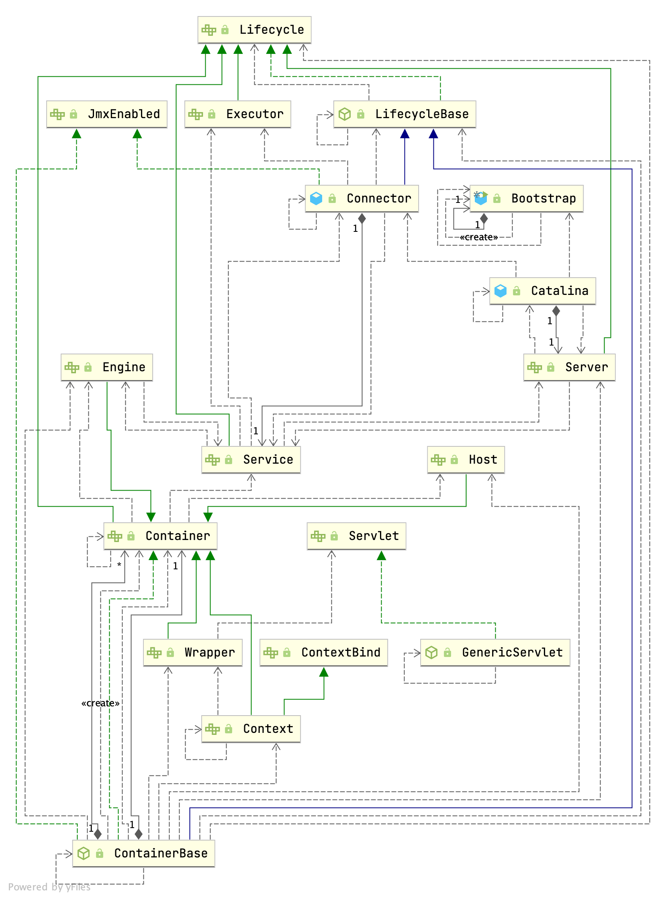

## Introduction




## Bootstrap

startup.sh -> catalina.sh start ->java -jar org.apache.catalina.startup.Bootstrap.main()

invoke `org.apache.catalina.startup.Catalina` by Reflection

```java
//Bootstrap.java
public static void main(String[] args) {
    synchronized(daemonLock) {
        if (daemon == null) {
            Bootstrap bootstrap = new Bootstrap();

            try {
                bootstrap.init();
            } catch (Throwable var5) {
                handleThrowable(var5);
                var5.printStackTrace();
                return;
            }

            daemon = bootstrap;
        } else {
            Thread.currentThread().setContextClassLoader(daemon.catalinaLoader);
        }
    }

    try {
        String command = "start";
        if (args.length > 0) {
            command = args[args.length - 1];
        }

        if (command.equals("startd")) {
            args[args.length - 1] = "start";
            daemon.load(args);
            daemon.start();
        } else if (command.equals("stopd")) {
            args[args.length - 1] = "stop";
            daemon.stop();
        } else if (command.equals("start")) {
            daemon.setAwait(true);
            daemon.load(args);
            daemon.start();
            if (null == daemon.getServer()) {
                System.exit(1);
            }
        } else if (command.equals("stop")) {
            daemon.stopServer(args);
        } else if (command.equals("configtest")) {
            daemon.load(args);
            if (null == daemon.getServer()) {
                System.exit(1);
            }

            System.exit(0);
        } else {
            log.warn("Bootstrap: command \"" + command + "\" does not exist.");
        }
    } catch (Throwable var7) {
        Throwable t = var7;
        if (var7 instanceof InvocationTargetException && var7.getCause() != null) {
            t = var7.getCause();
        }

        handleThrowable(t);
        t.printStackTrace();
        System.exit(1);
    }

}
```

Initialize daemon.

[initClassLoaders](/docs/CS/Java/Tomcat/ClassLoader.md?id=initClassLoaders)

```java
//Bootstrap.java
public void init() throws Exception {

    initClassLoaders();

    Thread.currentThread().setContextClassLoader(catalinaLoader);

    SecurityClassLoad.securityClassLoad(catalinaLoader);

    // Load our startup class and call its process() method
    Class<?> startupClass = catalinaLoader.loadClass("org.apache.catalina.startup.Catalina");
    Object startupInstance = startupClass.getConstructor().newInstance();

    // Set the shared extensions class loader
    String methodName = "setParentClassLoader";
    Class<?> paramTypes[] = new Class[1];
    paramTypes[0] = Class.forName("java.lang.ClassLoader");
    Object paramValues[] = new Object[1];
    paramValues[0] = sharedLoader;
    Method method =
        startupInstance.getClass().getMethod(methodName, paramTypes);
    method.invoke(startupInstance, paramValues);

    catalinaDaemon = startupInstance;
}
```


## Catalina

#### load()

```java
//org.apache.catalina.startup.Catalina.java
public void load() {

    if (loaded) {
        return;
    }
    loaded = true;

    long t1 = System.nanoTime();

    initDirs();

    // Before digester - it may be needed
    initNaming();

    // Set configuration source
    ConfigFileLoader.setSource(new CatalinaBaseConfigurationSource(Bootstrap.getCatalinaBaseFile(), getConfigFile()));
    File file = configFile();

    // Create and execute our Digester
    Digester digester = createStartDigester();

    try (ConfigurationSource.Resource resource = ConfigFileLoader.getSource().getServerXml()) {
        InputStream inputStream = resource.getInputStream();
        InputSource inputSource = new InputSource(resource.getURI().toURL().toString());
        inputSource.setByteStream(inputStream);
        digester.push(this);
        digester.parse(inputSource);
    } catch (Exception e) {
        return;
    }

    getServer().setCatalina(this);
    getServer().setCatalinaHome(Bootstrap.getCatalinaHomeFile());
    getServer().setCatalinaBase(Bootstrap.getCatalinaBaseFile());

    // Stream redirection
    initStreams();

    // Start the new server
    try {
        getServer().init();
    } catch (LifecycleException e) {
        if (Boolean.getBoolean("org.apache.catalina.startup.EXIT_ON_INIT_FAILURE")) {
            throw new java.lang.Error(e);
        } else {
        }
    }

    long t2 = System.nanoTime();
    if(log.isInfoEnabled()) {
        log.info(sm.getString("catalina.init", Long.valueOf((t2 - t1) / 1000000)));
    }
}
```


#### start()

1. start Server
2. start Service
3. start [Connector](/docs/CS/Java/Tomcat/Connector.md)
```java
//org.apache.catalina.startup.Catalina.java
public void start() {
    if (this.getServer() == null) {
        this.load();
    }

    if (this.getServer() == null) {
        log.fatal(sm.getString("catalina.noServer"));
    } else {
        long t1 = System.nanoTime();

        try {
            this.getServer().start();
        } catch (LifecycleException var6) {
            try {
                this.getServer().destroy();
            } catch (LifecycleException var5) {
            }

            return;
        }

        if (this.generateCode) {
            this.generateLoader();
        }

        if (this.useShutdownHook) {
            if (this.shutdownHook == null) {
                this.shutdownHook = new Catalina.CatalinaShutdownHook();
            }

            Runtime.getRuntime().addShutdownHook(this.shutdownHook);
            LogManager logManager = LogManager.getLogManager();
            if (logManager instanceof ClassLoaderLogManager) {
                ((ClassLoaderLogManager)logManager).setUseShutdownHook(false);
            }
        }

        if (this.await) {
            this.await();
            this.stop();
        }

    }
}
```

## LifecycleBase

Prepare the component for starting. This method should perform any initialization required post object creation. The following LifecycleEvents will be fired in the following order:

1. INIT_EVENT: On the successful completion of component initialization.

```java
// LifecycleBase
@Override
public final synchronized void init() throws LifecycleException {
    if (!state.equals(LifecycleState.NEW)) {
        invalidTransition(Lifecycle.BEFORE_INIT_EVENT);
    }

    try {
        setStateInternal(LifecycleState.INITIALIZING, null, false);
        initInternal();
        setStateInternal(LifecycleState.INITIALIZED, null, false);
    } catch (Throwable t) {
        handleSubClassException(t, "lifecycleBase.initFail", toString());
    }
}
```


Prepare for the beginning of active use of the public methods other than property getters/setters and life cycle methods of this component. This method should be called before any of the public methods other than property getters/setters and life cycle methods of this component are utilized. The following LifecycleEvents will be fired in the following order:

1. BEFORE_START_EVENT: At the beginning of the method. It is as this point the state transitions to LifecycleState.STARTING_PREP.
2. START_EVENT: During the method once it is safe to call start() for any child components. It is at this point that the state transitions to LifecycleState.STARTING and that the public methods other than property getters/setters and life cycle methods may be used.
3. AFTER_START_EVENT: At the end of the method, immediately before it returns. It is at this point that the state transitions to LifecycleState.STARTED.

```java
// LifecycleBase
@Override
public final synchronized void start() throws LifecycleException {

    if (LifecycleState.STARTING_PREP.equals(state) || LifecycleState.STARTING.equals(state) ||
            LifecycleState.STARTED.equals(state)) {

        if (log.isDebugEnabled()) {
            Exception e = new LifecycleException();
            log.debug(sm.getString("lifecycleBase.alreadyStarted", toString()), e);
        } else if (log.isInfoEnabled()) {
            log.info(sm.getString("lifecycleBase.alreadyStarted", toString()));
        }

        return;
    }

    if (state.equals(LifecycleState.NEW)) {
        init();
    } else if (state.equals(LifecycleState.FAILED)) {
        stop();
    } else if (!state.equals(LifecycleState.INITIALIZED) &&
            !state.equals(LifecycleState.STOPPED)) {
        invalidTransition(Lifecycle.BEFORE_START_EVENT);
    }

    try {
        setStateInternal(LifecycleState.STARTING_PREP, null, false);
        startInternal();
        if (state.equals(LifecycleState.FAILED)) {
            // This is a 'controlled' failure. The component put itself into the
            // FAILED state so call stop() to complete the clean-up.
            stop();
        } else if (!state.equals(LifecycleState.STARTING)) {
            // Shouldn't be necessary but acts as a check that sub-classes are
            // doing what they are supposed to.
            invalidTransition(Lifecycle.AFTER_START_EVENT);
        } else {
            setStateInternal(LifecycleState.STARTED, null, false);
        }
    } catch (Throwable t) {
        // This is an 'uncontrolled' failure so put the component into the
        // FAILED state and throw an exception.
        handleSubClassException(t, "lifecycleBase.startFail", toString());
    }
}
```


Gracefully terminate the active use of the public methods other than property getters/setters and life cycle methods of this component. Once the STOP_EVENT is fired, the public methods other than property getters/setters and life cycle methods should not be used. The following LifecycleEvents will be fired in the following order:
BEFORE_STOP_EVENT: At the beginning of the method. It is at this point that the state transitions to LifecycleState.STOPPING_PREP.
STOP_EVENT: During the method once it is safe to call stop() for any child components. It is at this point that the state transitions to LifecycleState.STOPPING and that the public methods other than property getters/setters and life cycle methods may no longer be used.
AFTER_STOP_EVENT: At the end of the method, immediately before it returns. It is at this point that the state transitions to LifecycleState.STOPPED.
Note that if transitioning from LifecycleState.FAILED then the three events above will be fired but the component will transition directly from LifecycleState.FAILED to LifecycleState.STOPPING, bypassing LifecycleState.STOPPING_PREP

```java
// // LifecycleBase
@Override
public final synchronized void stop() throws LifecycleException {

    if (LifecycleState.STOPPING_PREP.equals(state) || LifecycleState.STOPPING.equals(state) ||
            LifecycleState.STOPPED.equals(state)) {

        if (log.isDebugEnabled()) {
            Exception e = new LifecycleException();
            log.debug(sm.getString("lifecycleBase.alreadyStopped", toString()), e);
        } else if (log.isInfoEnabled()) {
            log.info(sm.getString("lifecycleBase.alreadyStopped", toString()));
        }

        return;
    }

    if (state.equals(LifecycleState.NEW)) {
        state = LifecycleState.STOPPED;
        return;
    }

    if (!state.equals(LifecycleState.STARTED) && !state.equals(LifecycleState.FAILED)) {
        invalidTransition(Lifecycle.BEFORE_STOP_EVENT);
    }

    try {
        if (state.equals(LifecycleState.FAILED)) {
            // Don't transition to STOPPING_PREP as that would briefly mark the
            // component as available but do ensure the BEFORE_STOP_EVENT is
            // fired
            fireLifecycleEvent(BEFORE_STOP_EVENT, null);
        } else {
            setStateInternal(LifecycleState.STOPPING_PREP, null, false);
        }

        stopInternal();

        // Shouldn't be necessary but acts as a check that sub-classes are
        // doing what they are supposed to.
        if (!state.equals(LifecycleState.STOPPING) && !state.equals(LifecycleState.FAILED)) {
            invalidTransition(Lifecycle.AFTER_STOP_EVENT);
        }

        setStateInternal(LifecycleState.STOPPED, null, false);
    } catch (Throwable t) {
        handleSubClassException(t, "lifecycleBase.stopFail", toString());
    } finally {
        if (this instanceof Lifecycle.SingleUse) {
            // Complete stop process first
            setStateInternal(LifecycleState.STOPPED, null, false);
            destroy();
        }
    }
}
```


### initInternal

#### StanardServer#initInternal()

```java
//StanardServer
protected void initInternal() throws LifecycleException {
    super.initInternal();
    this.reconfigureUtilityExecutor(getUtilityThreadsInternal(this.utilityThreads));
    this.register(this.utilityExecutor, "type=UtilityExecutor");
    this.onameStringCache = this.register(new StringCache(), "type=StringCache");
    MBeanFactory factory = new MBeanFactory();
    factory.setContainer(this);
    this.onameMBeanFactory = this.register(factory, "type=MBeanFactory");
    this.globalNamingResources.init();
    if (this.getCatalina() != null) {
        for(ClassLoader cl = this.getCatalina().getParentClassLoader(); cl != null && cl != ClassLoader.getSystemClassLoader(); cl = cl.getParent()) {
            if (cl instanceof URLClassLoader) {
                URL[] urls = ((URLClassLoader)cl).getURLs();
                URL[] var4 = urls;
                int var5 = urls.length;

                for(int var6 = 0; var6 < var5; ++var6) {
                    URL url = var4[var6];
                    if (url.getProtocol().equals("file")) {
                        try {
                            File f = new File(url.toURI());
                            if (f.isFile() && f.getName().endsWith(".jar")) {
                                ExtensionValidator.addSystemResource(f);
                            }
                        } catch (URISyntaxException var9) {
                        } catch (IOException var10) {
                        }
                    }
                }
            }
        }
    }

    Service[] var11 = this.services;
    int var12 = var11.length;

    for(int var13 = 0; var13 < var12; ++var13) {
        Service service = var11[var13];
        service.init();
    }

}
```


```java
public void addService(Service service) {
    service.setServer(this);
    synchronized(this.servicesLock) {
        Service[] results = new Service[this.services.length + 1];
        System.arraycopy(this.services, 0, results, 0, this.services.length);
        results[this.services.length] = service;
        this.services = results;
        if (this.getState().isAvailable()) {
            try {
                service.start();
            } catch (LifecycleException var6) {
            }
        }

        this.support.firePropertyChange("service", (Object)null, service);
    }
}
```

#### StandardService#startInternal()

```java
//StandardService
protected void startInternal() throws LifecycleException {
    if (log.isInfoEnabled()) {
        log.info(sm.getString("standardService.start.name", new Object[]{this.name}));
    }

    this.setState(LifecycleState.STARTING);
    if (this.engine != null) {
        synchronized(this.engine) {
            this.engine.start();
        }
    }

    synchronized(this.executors) {
        Iterator var2 = this.executors.iterator();

        while(true) {
            if (!var2.hasNext()) {
                break;
            }

            Executor executor = (Executor)var2.next();
            executor.start();
        }
    }

    this.mapperListener.start();
    synchronized(this.connectorsLock) {
        Connector[] var10 = this.connectors;
        int var11 = var10.length;

        for(int var4 = 0; var4 < var11; ++var4) {
            Connector connector = var10[var4];
            if (connector.getState() != LifecycleState.FAILED) {
                connector.start();
            }
        }

    }
}
```

## References
1. [Tomcat 高并发之道原理拆解与性能调优 - 码哥字节](https://mp.weixin.qq.com/s?__biz=MzkzMDI1NjcyOQ==&mid=2247487712&idx=1&sn=a77efe0871bf0c5d1dc9d0a3ae138d5e&source=41#wechat_redirect)