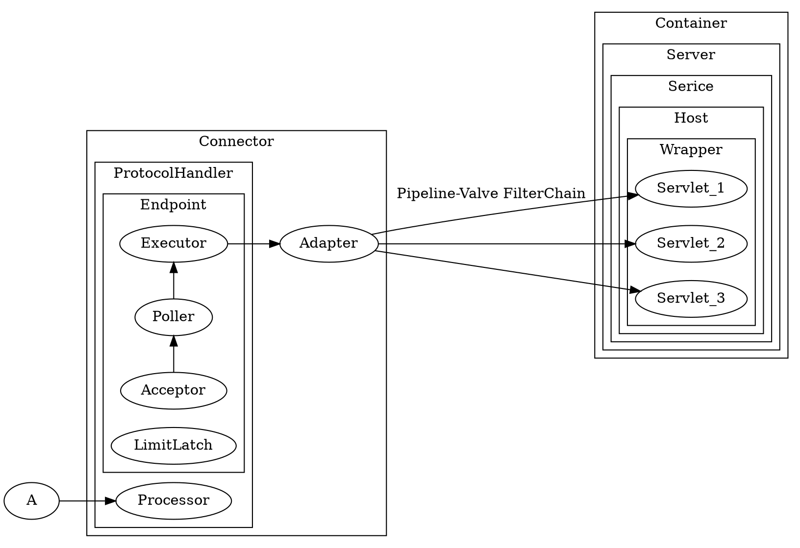

## Introduction


- [start](/docs/CS/Java/Tomcat/Start.md)
- [ClassLoader](/docs/CS/Java/Tomcat/ClassLoader.md)
- [Connector](/docs/CS/Java/Tomcat/Connector.md)

## Lifecycle

```java
package org.apache.catalina;

public interface Lifecycle {
    String BEFORE_INIT_EVENT = "before_init";
    String AFTER_INIT_EVENT = "after_init";
    String START_EVENT = "start";
    String BEFORE_START_EVENT = "before_start";
    String AFTER_START_EVENT = "after_start";
    String STOP_EVENT = "stop";
    String BEFORE_STOP_EVENT = "before_stop";
    String AFTER_STOP_EVENT = "after_stop";
    String AFTER_DESTROY_EVENT = "after_destroy";
    String BEFORE_DESTROY_EVENT = "before_destroy";
    String PERIODIC_EVENT = "periodic";
    String CONFIGURE_START_EVENT = "configure_start";
    String CONFIGURE_STOP_EVENT = "configure_stop";

    void addLifecycleListener(LifecycleListener var1);

    LifecycleListener[] findLifecycleListeners();

    void removeLifecycleListener(LifecycleListener var1);

    void init() throws LifecycleException;

    void start() throws LifecycleException;

    void stop() throws LifecycleException;

    void destroy() throws LifecycleException;

    LifecycleState getState();

    String getStateName();

    public interface SingleUse {
    }
}
```

1. 管理socket连接, 转换Request/Response和网络字节流
2. 加载管理Servlet, 处理Request请求


Connector

Container


create 

Bootstrap

ContextConfig

Parse web.xml




### Connector

IO:

- NIO
- NIO2
- APR

Protocol

- HTTP/1.1
- AJP
- HTTP2


1. 网络通信	- EndPoint
2. 协议解析    - Processor
3. `Tomcat Request/Response` 与 `ServletRequest/ServletResponse` 的转化 -  Adapter


ProtocolHandler = EndPoint + Processor


### EndPoint

`NioEndpoint` 则是 `AbstractEndpoint` 的具体实现，里面组件虽然很多，但是处理逻辑还是前面两步。它一共包含 `LimitLatch`、`Acceptor`、`Poller`、`SocketProcessor`和 `Executor` 共 5 个组件，分别分工合作实现整个 TCP/IP 协议的处理。

- LimitLatch 是连接控制器，它负责控制最大连接数，NIO 模式下默认是 10000，达到这个阈值后，连接请求被拒绝。
- `Acceptor`跑在一个单独的线程里，它在一个死循环里调用 `accept`方法来接收新连接，一旦有新的连接请求到来，`accept`方法返回一个 `Channel` 对象，接着把 `Channel`对象交给 Poller 去处理。
- `Poller` 的本质是一个 `Selector`，也跑在单独线程里。`Poller`在内部维护一个 `Channel`数组，它在一个死循环里不断检测 `Channel`的数据就绪状态，一旦有 `Channel`可读，就生成一个 `SocketProcessor`任务对象扔给 `Executor`去处理。
- SocketProcessor 实现了 Runnable 接口，其中 run 方法中的 `getHandler().process(socketWrapper, SocketEvent.CONNECT_FAIL);` 代码则是获取 handler 并执行处理 socketWrapper，最后通过 socket 获取合适应用层协议处理器，也就是调用 Http11Processor 组件来处理请求。Http11Processor 读取 Channel 的数据来生成 ServletRequest 对象，Http11Processor 并不是直接读取 Channel 的。这是因为 Tomcat 支持同步非阻塞 I/O 模型和异步 I/O 模型，在 Java API 中，相应的 Channel 类也是不一样的，比如有 AsynchronousSocketChannel 和 SocketChannel，为了对 Http11Processor 屏蔽这些差异，Tomcat 设计了一个包装类叫作 SocketWrapper，Http11Processor 只调用 SocketWrapper 的方法去读写数据。
- `Executor`就是线程池，负责运行 `SocketProcessor`任务类，`SocketProcessor` 的 `run`方法会调用 `Http11Processor` 来读取和解析请求数据。我们知道，`Http11Processor`是应用层协议的封装，它会调用容器获得响应，再把响应通过 `Channel`写出。

 

#### Processor

**HttpProcessor**


#### Executor

#### Adapter

CoyoteAdapter


### Container

Container`接口拓展了 `Lifecycle

Tomcat 设计了 4 种容器，分别是 `Engine`、`Host`、`Context`和 `Wrapper`。`Server` 代表 Tomcat 实例。

组合模式


#### Tomcat 热加载

Tomcat 本质是通过一个后台线程做周期性的任务，定期检测类文件的变化，如果有变化就重新加载类。我们来看 `ContainerBackgroundProcessor`


```java
/**
 * Private runnable class to invoke the backgroundProcess method
 * of this container and its children after a fixed delay.
 */
protected class ContainerBackgroundProcessor implements Runnable {

    @Override
    public void run() {
        processChildren(ContainerBase.this);
    }

    protected void processChildren(Container container) {
        ClassLoader originalClassLoader = null;

        try {
            if (container instanceof Context) {
                Loader loader = ((Context) container).getLoader();
                // Loader will be null for FailedContext instances
                if (loader == null) {
                    return;
                }

                // Ensure background processing for Contexts and Wrappers
                // is performed under the web app's class loader
                originalClassLoader = ((Context) container).bind(false, null);
            }
            container.backgroundProcess();
            Container[] children = container.findChildren();
            for (int i = 0; i < children.length; i++) {
                if (children[i].getBackgroundProcessorDelay() <= 0) {
                    processChildren(children[i]);
                }
            }
        } catch (Throwable t) {
            ExceptionUtils.handleThrowable(t);
            log.error(sm.getString("containerBase.backgroundProcess.error"), t);
        } finally {
            if (container instanceof Context) {
                ((Context) container).unbind(false, originalClassLoader);
            }
        }
    }
}
```

一个 Context 容器对应一个类加载器，类加载器在销毁的过程中会把它加载的所有类也全部销毁。Context 容器在启动过程中，会创建一个新的类加载器来加载新的类文件

## Upgrade

Comet

Websocket
