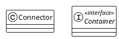
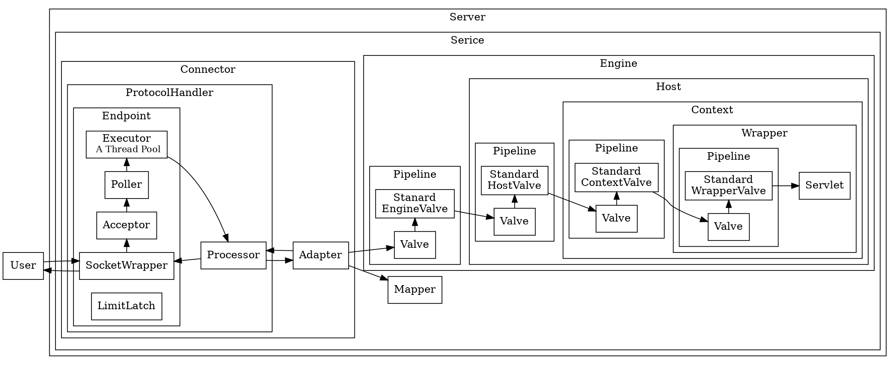
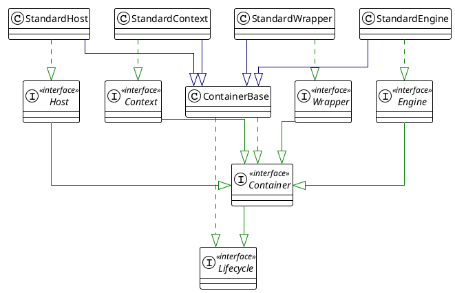

## Introduction

[The Apache Tomcat® software](https://tomcat.apache.org/) is an open source implementation of the Jakarta [Servlet](/docs/CS/Java/JDK/Servlet.md), Jakarta Server Pages, Jakarta Expression Language, Jakarta WebSocket, Jakarta Annotations and Jakarta Authentication specifications. These specifications are part of the Jakarta EE platform.

Different versions of Apache Tomcat are available for different versions of the specifications.
The mapping between the specifications and the respective [Apache Tomcat Versions](https://tomcat.apache.org/whichversion.html).


### Debug Tomcat


```shell
git clone git@github.com:apache/tomcat.git

git switch -c origin/10.1.x

# edit build.properties
base.path={project.absolute.path}/tomcat-build-libs

ant ide-intellij
```

change password in conf/tomcat-users.xml

## Architecture

```plantuml
@startuml

!theme plain
top to bottom direction
skinparam linetype ortho

class AbstractEndpoint<S, U>
class AbstractProtocol<S>
interface Adapter << interface >>
class ApplicationFilterChain
class Catalina
class Connector
interface Container << interface >>
interface Context << interface >>
class CoyoteAdapter
interface Engine << interface >>
interface Executor << interface >>
interface Host << interface >>
interface Lifecycle << interface >>
class Mapper
class MapperListener
interface Pipeline << interface >>
interface Processor << interface >>
interface ProtocolHandler << interface >>
interface Server << interface >>
interface Service << interface >>
interface Servlet << interface >>
class StandardPipeline
class StandardWrapper
interface Valve << interface >>
interface Wrapper << interface >>

AbstractProtocol       "1" *-[#595959,plain]-> "endpoint\n1" AbstractEndpoint   
AbstractProtocol       "1" *-[#595959,plain]-> "adapter\n1" Adapter            
AbstractProtocol       "1" *-[#595959,plain]-> "waitingProcessors\n*" Processor          
AbstractProtocol        -[#008200,dashed]-^  ProtocolHandler    
ApplicationFilterChain "1" *-[#595959,plain]-> "servlet\n1" Servlet            
Catalina               "1" *-[#595959,plain]-> "server\n1" Server             
Connector              "1" *-[#595959,plain]-> "adapter\n1" Adapter            
Connector               -[#595959,dashed]->  CoyoteAdapter          : "«create»"
Connector               -[#008200,dashed]-^  Lifecycle          
Connector              "1" *-[#595959,plain]-> "protocolHandler\n1" ProtocolHandler    
Connector              "1" *-[#595959,plain]-> "service\n1" Service            
Container               -[#008200,plain]-^  Lifecycle          
Context                 -[#008200,plain]-^  Container          
CoyoteAdapter           -[#008200,dashed]-^  Adapter            
CoyoteAdapter          "1" *-[#595959,plain]-> "connector\n1" Connector          
Engine                  -[#008200,plain]-^  Container          
Executor                -[#008200,plain]-^  Lifecycle          
Host                    -[#008200,plain]-^  Container          
Mapper                  -[#595959,dashed]->  Context                : "«create»"
Mapper                 "1" *-[#595959,plain]-> "contextObjectToContextVersionMap\n*" Context            
MapperListener          -[#008200,dashed]-^  Lifecycle          
MapperListener         "1" *-[#595959,plain]-> "mapper\n1" Mapper             
MapperListener         "1" *-[#595959,plain]-> "service\n1" Service            
Server                  -[#008200,plain]-^  Lifecycle          
Service                 -[#008200,plain]-^  Lifecycle          
StandardPipeline       "1" *-[#595959,plain]-> "container\n1" Container          
StandardPipeline        -[#008200,dashed]-^  Lifecycle          
StandardPipeline        -[#008200,dashed]-^  Pipeline           
StandardPipeline        -[#595959,dashed]->  Valve                  : "«create»"
StandardPipeline       "1" *-[#595959,plain]-> "basic\n1" Valve              
StandardWrapper         -[#008200,dashed]-^  Container          
StandardWrapper         -[#008200,dashed]-^  Lifecycle          
StandardWrapper        "1" *-[#595959,plain]-> "instance\n1" Servlet            
StandardWrapper         -[#008200,dashed]-^  Wrapper            
Wrapper                 -[#008200,plain]-^  Container          
@enduml

```



Catalina is a very sophisticated piece of software, which was elegantly designed and developed.
It is also modular too.<br>
Catalina is consisting of two main modules: the [connector](/docs/CS/Java/Tomcat/Connector.md) and the [container](/docs/CS/Java/Tomcat/Tomcat.md?id=Container).



- [start](/docs/CS/Java/Tomcat/Start.md)
- [ClassLoader](/docs/CS/Java/Tomcat/ClassLoader.md)



### Container

A container must implement `org.apache.catalina.Container`.

The first thing to note about containers in Catalina is that there are four types of containers at different conceptual levels:

- **Engine**. Represents the entire Catalina servlet engine.
- **Host**. Represents a virtual host with a number of contexts.
- **Context**. Represents a web application. A context contains one or more wrappers.
- **Wrapper**. Represents an individual servlet.

Each conceptual level above is represented by an interface in the org.apache.catalina package.
These interfaces are Engine, Host, Context, and Wrapper. All the four extends the Container interface.
Standard implementations of the four containers are StandardEngine, StandardHost, StandardContext, and StandardWrapper, respectively, all of which are part of the org.apache.catalina.core package.



Note All implementation classes derive from the abstract class ContainerBase.

A container can have zero or more child containers of the lower level.
For instance, a context normally has one or more wrappers and a host can have zero or more contexts.
However, a wrapper, being the lowest in the 'hierarchy', cannot contain a child container.
To add a child container to a container, you use the Container interface's addChild method whose signature is as follows.

```java
public interface Container extends Lifecycle {
    void addChild(Container child);

    void removeChild(Container child);

    Container findChild(String name);

    Container[] findChildren();
}
```

A container can also contain a number of support components such as Loader, Logger, Manager, Realm, and Resources.
One thing worth noting here is that the Container interface provides the get and set methods for associating itself with those components.
These methods include getLoader and setLoader, getLogger and setLogger, getManager and
setManager, getRealm and setRealm, and getResources and setResources.
More interestingly, the Container interface has been designed in such a way that at the time of deployment a Tomcat administrator can determine what a container performs by editing the configuration file (server.xml).
This is achieved by introducing a pipeline and a set of valves in a container.

#### Engine

An Engine is a Container that represents the entire Catalina servlet engine. It is useful in the following types of scenarios:

- You wish to use Interceptors that see every single request processed by the entire engine.
- You wish to run Catalina in with a standalone HTTP connector, but still want support for multiple virtual hosts.

In general, you would not use an Engine when deploying Catalina connected to a web server (such as Apache), because the Connector will have utilized the web server's facilities to determine which Context (or perhaps even which Wrapper) should be utilized to process this request.
The child containers attached to an Engine are generally implementations of Host (representing a virtual host) or Context (representing individual an individual servlet context), depending upon the Engine implementation.
If used, an Engine is always the top level Container in a Catalina hierarchy. Therefore, the implementation's setParent() method should throw IllegalArgumentException.

#### Context

A Context is a Container that represents a servlet context, and therefore an individual web application, in the Catalina servlet engine.
It is therefore useful in almost every deployment of Catalina (even if a Connector attached to a web server (such as Apache) uses the web server's facilities to identify the appropriate Wrapper to handle this request.
It also provides a convenient mechanism to use Interceptors that see every request processed by this particular web application.
**The parent Container attached to a Context is generally a Host, but may be some other implementation, or may be omitted if it is not necessary.**
The child containers attached to a Context are generally implementations of Wrapper (representing individual servlet definitions).

#### Wrapper

A Wrapper is a Container that represents an individual servlet definition from the deployment descriptor of the web application.
It provides a convenient mechanism to use Interceptors that see every single request to the servlet represented by this definition.
Implementations of Wrapper are responsible for managing the servlet life cycle for their underlying servlet class, including calling init() and destroy() at appropriate times.
The parent Container attached to a Wrapper will generally be an implementation of Context, representing the servlet context (and therefore the web application) within which this servlet executes.
Since a wrapper is the lowest level of container, you must not add a child to it.
Child Containers are not allowed on Wrapper implementations, so the addChild() method should throw an IllegalArgumentException.

### Server and Service

A Server element represents the entire Catalina servlet container.
Its attributes represent the characteristics of the servlet container as a whole.
A Server may contain one or more Services, and the top level set of naming resources.
Normally, an implementation of this interface will also implement Lifecycle, such that when the start() and stop() methods are called, all of the defined Services are also started or stopped.
In between, the implementation must open a server socket on the port number specified by the port property. When a connection is accepted, the first line is read and compared with the specified shutdown command.
If the command matches, shutdown of the server is initiated.

- `JreMemoryLeakPreventionListener` Provide a workaround for known places where the Java Runtime environment can cause a memory leak or lock files.
  Memory leaks occur when JRE code uses the context class loader to load a singleton as this will cause a memory leak if a web application class loader happens to be the context class loader at the time. 
  The work-around is to initialise these singletons when Tomcat's common class loader is the context class loader.
  Locked files usually occur when a resource inside a JAR is accessed without first disabling Jar URL connection caching. The workaround is to disable this caching by default.
- `ThreadLocalLeakPreventionListener` A LifecycleListener that triggers the renewal of threads in Executor pools when a Context is being stopped to avoid thread-local related memory leaks.
  Note : active threads will be renewed one by one when they come back to the pool after executing their task, see ThreadPoolExecutor.afterExecute().

A service component encapsulates a container and one or many connectors.

The `org.apache.catalina.core.StandardService` class is the standard implementation of Service.
The StandardService class's initialize method initializes all the connectors added to the service.
StandardService implements Service as well as the `org.apache.catalina.Lifecycle` interface.
Its start method starts the container and all the connectors.

A StandardService instance contains two types of components: a container and one or more connectors.
Being able to have multiple connectors enable Tomcat to service multiple protocols.
One connector can be used to service HTTP requests, and another for servicing HTTPS requests.

Standard implementation of the Service interface. The associated Container is generally an instance of Engine, but this is not required.

```java
public class StandardService extends LifecycleMBeanBase implements Service {

    protected Connector connectors[] = new Connector[0];

    private Engine engine = null;
}
```

### Pipeline

A pipeline contains tasks that the container will invoke.
A valve represents a specific task.
There is one basic valve in a container's pipeline, but you can add as many valves as you want.
The number of valves is defined to be the number of additional valves, i.e. not including the basic valve.
Interestingly, valves can be added dynamically by editing Tomcat's configuration file (server.xml).

If you understand servlet filters, it is not hard to imagine how a pipeline and its valve work.
A pipeline is like a filter chain and each valve is a filter. Like a filter, a valve can manipulate the request and response objects passed to it.
After a valve finishes processing, it calls the next valve in the pipeline. The basic valve is always called the last.

A container can have one pipeline.
When a container's invoke method is called, the container passes processing to its pipeline and the pipeline invokes the first valve in it, which will then invoke the next valve, and so on, until there is no more valve in the pipeline.

A container does not hard code what it is supposed to do when its invoke method is called by the connector.
Instead, the container calls its pipeline's invoke method.

```java
public interface Valve {
    void invoke(Request request, Response response) throws IOException, ServletException;
}
```

A Valve is a request processing component associated with a particular Container.
A series of Valves are generally associated with each other into a Pipeline.
The detailed contract for a Valve is included in the description of the invoke() method below.
HISTORICAL NOTE: The "Valve" name was assigned to this concept because a valve is what you use in a real world pipeline to control and/or modify flows through it.

```java
public class CoyoteAdapter implements Adapter {
    @Override
    public boolean asyncDispatch(org.apache.coyote.Request req, org.apache.coyote.Response res, SocketEvent status) throws Exception {
        // ...
        connector.getService().getContainer().getPipeline().getFirst().invoke(request, response);
        // ...
    }
}
```


## BackgroundProcess

Private runnable class to invoke the backgroundProcess method of this container and its children after a fixed delay.

```java
protected class ContainerBackgroundProcessor implements Runnable {

    @Override
    public void run() {
        processChildren(ContainerBase.this);
    }

    protected void processChildren(Container container) {
        ClassLoader originalClassLoader = null;

        try {
            if (container instanceof Context) {
                Loader loader = ((Context) container).getLoader();
                // Loader will be null for FailedContext instances
                if (loader == null) {
                    return;
                }

                // Ensure background processing for Contexts and Wrappers is performed under the web app's class loader
                originalClassLoader = ((Context) container).bind(false, null);
            }
            container.backgroundProcess();
            Container[] children = container.findChildren();
            for (int i = 0; i < children.length; i++) {
                if (children[i].getBackgroundProcessorDelay() <= 0) {
                    processChildren(children[i]);
                }
            }
        } catch (Throwable t) {
            ExceptionUtils.handleThrowable(t);
            log.error(sm.getString("containerBase.backgroundProcess.error"), t);
        } finally {
            if (container instanceof Context) {
                ((Context) container).unbind(false, originalClassLoader);
            }
        }
    }
}
```

backgroundProcess

```java
public class StandardContext extends ContainerBase implements Context, NotificationEmitter {
    @Override
    public void backgroundProcess() {
        Loader loader = getLoader();
        if (loader != null) {
            loader.backgroundProcess();
        }
        // ...
    }
}
```

Execute a periodic task, such as reloading, etc. This method will be invoked inside the classloading context of this container. Unexpected throwables will be caught and logged.

```java
public class WebappLoader extends LifecycleMBeanBase implements Loader {
    @Override
    public void backgroundProcess() {
        Context context = getContext();
        if (context != null) {
            if (context.getReloadable() && modified()) {
                ClassLoader originalTccl = Thread.currentThread().getContextClassLoader();
                try {
                    Thread.currentThread().setContextClassLoader(WebappLoader.class.getClassLoader());
                    context.reload();
                } finally {
                    Thread.currentThread().setContextClassLoader(originalTccl);
                }
            }
        }
    }
}
```

### reload

Reload this web application, if reloading is supported.
**This method is designed to deal with reloads required by changes to classes in the underlying repositories of our class loader and changes to the web.xml file.**
It does not handle changes to any context.xml file.
If the context.xml has changed, you should stop this Context and create (and start) a new Context instance instead.
Note that there is additional code in CoyoteAdapter#postParseRequest() to handle mapping requests to paused Contexts.

```java
public class StandardContext extends ContainerBase implements Context, NotificationEmitter {
  @Override
    public synchronized void reload() {

    // Validate our current component state

    // Stop accepting requests temporarily.
    setPaused(true);

    stop();

    start();

    setPaused(false);
  }
}
```

## Log

## DefaultServlet

The default resource-serving servlet for most web applications, used to serve static resources such as HTML pages and images.

This servlet is intended to be mapped to /e.g.:

```xml
<servlet-mapping>
    <servlet-name>default</servlet-name>
    <url-pattern>/</url-pattern>
</servlet-mapping>
```

input output buffer

```java
protected void serveResource(HttpServletRequest request,
                               HttpServletResponse response,
                               boolean content,
                               String inputEncoding)
          throws IOException, ServletException {
      // omitted 
      // Check if the conditions specified in the optional If headers are
      // satisfied.
      if (resource.isFile()) {
        // Checking If headers
        included = (request.getAttribute(
                RequestDispatcher.INCLUDE_CONTEXT_PATH) != null);
        if (!included && !isError && !checkIfHeaders(request, response, resource)) {
          return;
        }
      }
}
```

checkIfHeaders

- Etag : If-None-Match
- Last-Modified : If-Modified-Since

```java
public class DefaultServlet {
  protected boolean checkIfHeaders(HttpServletRequest request,
                                   HttpServletResponse response,
                                   WebResource resource)
          throws IOException {

    return checkIfMatch(request, response, resource)
            && checkIfModifiedSince(request, response, resource)
            && checkIfNoneMatch(request, response, resource)
            && checkIfUnmodifiedSince(request, response, resource);

  }

  protected boolean checkIfNoneMatch(HttpServletRequest request, HttpServletResponse response, WebResource resource)
          throws IOException {

    String headerValue = request.getHeader("If-None-Match");
    if (headerValue != null) {

      boolean conditionSatisfied;

      String resourceETag = generateETag(resource);
      if (!headerValue.equals("*")) {
        if (resourceETag == null) {
          conditionSatisfied = false;
        } else {
          // RFC 7232 requires weak comparison for If-None-Match headers
          Boolean matched = EntityTag.compareEntityTag(new StringReader(headerValue), true, resourceETag);
          if (matched == null) {
            if (debug > 10) {
              log("DefaultServlet.checkIfNoneMatch:  Invalid header value [" + headerValue + "]");
            }
            response.sendError(HttpServletResponse.SC_BAD_REQUEST);
            return false;
          }
          conditionSatisfied = matched.booleanValue();
        }
      } else {
        conditionSatisfied = true;
      }

      if (conditionSatisfied) {
        // For GET and HEAD, we should respond with
        // 304 Not Modified.
        // For every other method, 412 Precondition Failed is sent
        // back.
        if ("GET".equals(request.getMethod()) || "HEAD".equals(request.getMethod())) {
          response.setStatus(HttpServletResponse.SC_NOT_MODIFIED);
          response.setHeader("ETag", resourceETag);
        } else {
          response.sendError(HttpServletResponse.SC_PRECONDITION_FAILED);
        }
        return false;
      }
    }
    return true;
  }
}
```

CacheResource

If the `cachingAllowed` flag is true, the cache for static resources will be used.
If not specified, the default value of the flag is true.
This value may be changed while the web application is running (e.g. via JMX).
When the cache is disabled any resources currently in the cache are cleared from the cache.

The maximum size of the static resource cache in kilobytes.
If `cacheMaxSize` not specified, the default value is 10240(10 megabytes).
This value may be changed while the web application is running (e.g. via JMX).
If the cache is using more memory than the new limit the cache will attempt to reduce in size over time to meet the new limit.
If necessary, cacheObjectMaxSize will be reduced to ensure that it is no larger than cacheMaxSize/20.

The amount of time in milliseconds between the revalidation of cache entries.
If `cacheTtl` not specified, the default value is 5000 (5 seconds).
This value may be changed while the web application is running(e.g. via JMX).
When a resource is cached it will inherit the TTL in force at the time it was cached and retain that TTL until the resource is evicted from the cache regardless of any subsequent changes that may be made to this attribute.

```java
public class StandardRoot extends LifecycleMBeanBase implements WebResourceRoot {
  protected WebResource getResource(String path, boolean validate,
                                    boolean useClassLoaderResources) {
    if (validate) {
      path = validate(path);
    }

    if (isCachingAllowed()) {
      return cache.getResource(path, useClassLoaderResources);
    } else {
      return getResourceInternal(path, useClassLoaderResources);
    }
  }
}
```

## Links

## References

1. [JSR 356, Java API for WebSocket](https://www.oracle.com/technical-resources/articles/java/jsr356.html)
