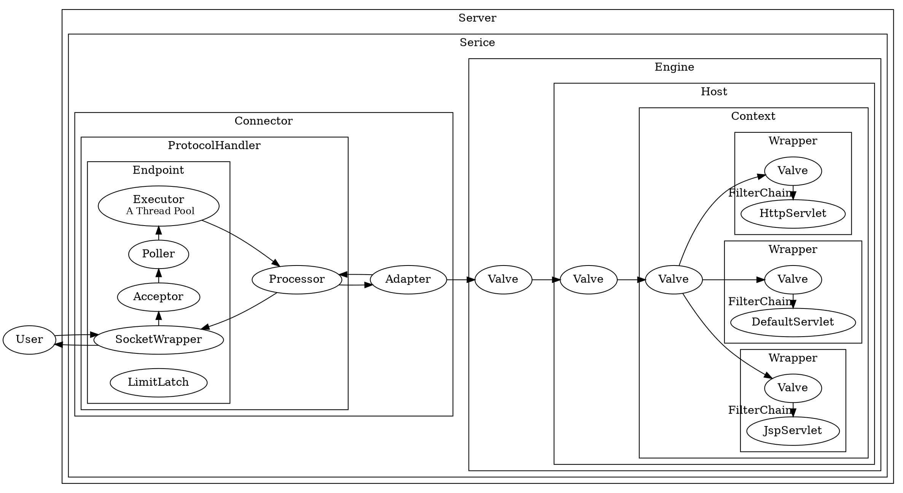

## Introduction

[The Apache Tomcat® software](https://tomcat.apache.org/) is an open source implementation of the Jakarta [Servlet](/docs/CS/Java/Tomcat/Servlet.md), Jakarta Server Pages, Jakarta Expression Language, Jakarta WebSocket, Jakarta Annotations and Jakarta Authentication specifications. These specifications are part of the Jakarta EE platform.

> [Apache Tomcat Versions](https://tomcat.apache.org/whichversion.html)


Different versions of Apache Tomcat are available for different versions of the specifications. The mapping between the specifications and the respective Apache Tomcat versions is:

| **Servlet Spec** | **JSP Spec** | **EL Spec** | **WebSocket Spec** | **Authentication (JASPIC) Spec** | **Apache Tomcat Version** | **Latest Released Version** | **Supported Java Versions**                 |
| ------------------ | -------------- | ------------- | -------------------- | ---------------------------------- | --------------------------- | ----------------------------- | --------------------------------------------- |
| 6.0              | 3.1          | 5.0         | 2.1                | 3.0                              | 10.1.x                    | 10.1.1                      | 11 and later                                |
| 5.0              | 3.0          | 4.0         | 2.0                | 2.0                              | 10.0.x (superseded)       | 10.0.27 (superseded)        | 8 and later                                 |
| 4.0              | 2.3          | 3.0         | 1.1                | 1.1                              | 9.0.x                     | 9.0.68                      | 8 and later                                 |
| 3.1              | 2.3          | 3.0         | 1.1                | 1.1                              | 8.5.x                     | 8.5.83                      | 7 and later                                 |
| 3.1              | 2.3          | 3.0         | 1.1                | N/A                              | 8.0.x (superseded)        | 8.0.53 (superseded)         | 7 and later                                 |
| 3.0              | 2.2          | 2.2         | 1.1                | N/A                              | 7.0.x (archived)          | 7.0.109 (archived)          | 6 and later<br/>(7 and later for WebSocket) |
| 2.5              | 2.1          | 2.1         | N/A                | N/A                              | 6.0.x (archived)          | 6.0.53 (archived)           | 5 and later                                 |
| 2.4              | 2.0          | N/A         | N/A                | N/A                              | 5.5.x (archived)          | 5.5.36 (archived)           | 1.4 and later                               |
| 2.3              | 1.2          | N/A         | N/A                | N/A                              | 4.1.x (archived)          | 4.1.40 (archived)           | 1.3 and later                               |
| 2.2              | 1.1          | N/A         | N/A                | N/A                              | 3.3.x (archived)          | 3.3.2 (archived)            | 1.1 and later                               |


Debug Tomcat
1. git clone git@github.com:apache/tomcat.git
2. add pom.xml
```xml
<?xml version="1.0" encoding="UTF-8"?>
<project xmlns="http://maven.apache.org/POM/4.0.0"
         xmlns:xsi="http://www.w3.org/2001/XMLSchema-instance"
         xsi:schemaLocation="http://maven.apache.org/POM/4.0.0 http://maven.apache.org/xsd/maven-4.0.0.xsd">

  <modelVersion>4.0.0</modelVersion>

  <groupId>org.apache.tomcat</groupId>
  <artifactId>tomcat</artifactId>
  <name>tomcat</name>
  <version>10.1.1</version>

  <dependencies>
    <!-- https://mvnrepository.com/artifact/biz.aQute.bnd/biz.aQute.bndlib -->
    <dependency>
      <groupId>biz.aQute.bnd</groupId>
      <artifactId>biz.aQute.bndlib</artifactId>
      <version>6.3.1</version>
    </dependency>

    <!-- https://mvnrepository.com/artifact/org.apache.tomcat/jakartaee-migration -->
    <dependency>
      <groupId>org.apache.tomcat</groupId>
      <artifactId>jakartaee-migration</artifactId>
      <version>1.0.5</version>
    </dependency>


    <dependency>
      <groupId>junit</groupId>
      <artifactId>junit</artifactId>
      <version>4.13.2</version>
      <scope>test</scope>
    </dependency>

    <dependency>
      <groupId>org.apache.ant</groupId>
      <artifactId>ant</artifactId>
      <version>1.10.11</version>
    </dependency>
    <dependency>
      <groupId>wsdl4j</groupId>
      <artifactId>wsdl4j</artifactId>
      <version>1.6.3</version>
    </dependency>

    <dependency>
      <groupId>org.apache.geronimo.specs</groupId>
      <artifactId>geronimo-jaxrpc_1.1_spec</artifactId>
      <version>2.1</version>
    </dependency>

    <dependency>
      <groupId>org.eclipse.jdt</groupId>
      <artifactId>ecj</artifactId>
      <version>3.31.0</version>
    </dependency>


    <dependency>
      <groupId>org.easymock</groupId>
      <artifactId>easymock</artifactId>
      <version>5.0.1</version>
      <scope>test</scope>
    </dependency>
  </dependencies>

  <build>
    <plugins>
      <plugin>
        <groupId>org.apache.maven.plugins</groupId>
        <artifactId>maven-compiler-plugin</artifactId>
        <configuration>
          <source>11</source>
          <target>11</target>
          <encoding>UTF-8</encoding>
        </configuration>
      </plugin>
      <plugin>
        <groupId>org.apache.maven.plugins</groupId>
        <artifactId>maven-resources-plugin</artifactId>
        <configuration>
          <encoding>UTF-8</encoding>
        </configuration>
      </plugin>
    </plugins>
  </build>
</project>
```
3. set Project Structure

## Architecture


- [start](/docs/CS/Java/Tomcat/Start.md)
- [ClassLoader](/docs/CS/Java/Tomcat/ClassLoader.md)
- [Connector](/docs/CS/Java/Tomcat/Connector.md)



### Container

A container must implement `org.apache.catalina.Container`.

The first thing to note about containers in Catalina is that there are four types of containers at different conceptual levels:

- Engine. Represents the entire Catalina servlet engine.
- Host. Represents a virtual host with a number of contexts.
- Context. Represents a web application. A context contains one or more wrappers.
- Wrapper. Represents an individual servlet.

Each conceptual level above is represented by an interface in the org.apache.catalina package.
These interfaces are Engine, Host, Context, and Wrapper. All the four extends the Container interface.
Standard implementations of the four containers are StandardEngine, StandardHost, StandardContext, and StandardWrapper, respectively, all of which are part of the org.apache.catalina.core package.

Note All implementation classes derive from the abstract class ContainerBase.


## HotSwap

Tomcat 本质是通过一个后台线程做周期性的任务，定期检测类文件的变化，如果有变化就重新加载类。我们来看 `ContainerBackgroundProcessor`

```java
/**
 * Private runnable class to invoke the backgroundProcess method
 * of this container and its children after a fixed delay.
 */
protected class ContainerBackgroundProcessor implements Runnable {

    @Override
    public void run() {
        processChildren(ContainerBase.this);
    }

    protected void processChildren(Container container) {
        ClassLoader originalClassLoader = null;

        try {
            if (container instanceof Context) {
                Loader loader = ((Context) container).getLoader();
                // Loader will be null for FailedContext instances
                if (loader == null) {
                    return;
                }

                // Ensure background processing for Contexts and Wrappers
                // is performed under the web app's class loader
                originalClassLoader = ((Context) container).bind(false, null);
            }
            container.backgroundProcess();
            Container[] children = container.findChildren();
            for (int i = 0; i < children.length; i++) {
                if (children[i].getBackgroundProcessorDelay() <= 0) {
                    processChildren(children[i]);
                }
            }
        } catch (Throwable t) {
            ExceptionUtils.handleThrowable(t);
            log.error(sm.getString("containerBase.backgroundProcess.error"), t);
        } finally {
            if (container instanceof Context) {
                ((Context) container).unbind(false, originalClassLoader);
            }
        }
    }
}
```

一个 Context 容器对应一个类加载器，类加载器在销毁的过程中会把它加载的所有类也全部销毁。Context 容器在启动过程中，会创建一个新的类加载器来加载新的类文件

## Upgrade

Comet

Websocket
