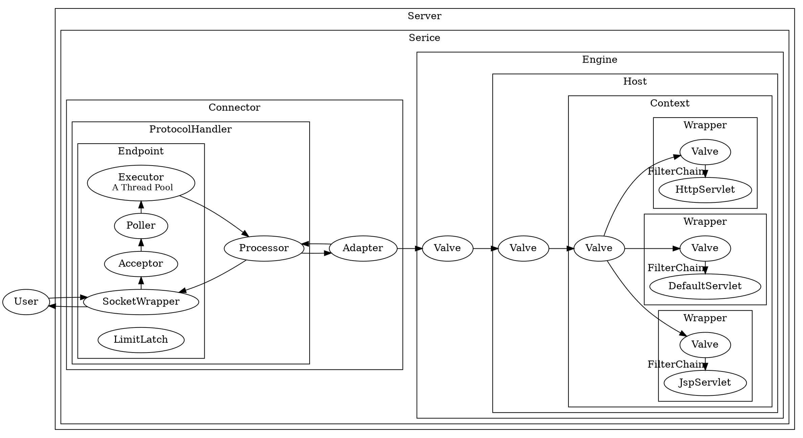

## Introduction

[The Apache Tomcat® software](https://tomcat.apache.org/) is an open source implementation of the Jakarta Servlet, Jakarta Server Pages, Jakarta Expression Language, Jakarta WebSocket, Jakarta Annotations and Jakarta Authentication specifications. These specifications are part of the Jakarta EE platform.

## Architecture


- [start](/docs/CS/Java/Tomcat/Start.md)
- [ClassLoader](/docs/CS/Java/Tomcat/ClassLoader.md)
- [Connector](/docs/CS/Java/Tomcat/Connector.md)





### Container

Container`接口拓展了 `Lifecycle

Tomcat 设计了 4 种容器，分别是 `Engine`、`Host`、`Context`和 `Wrapper`。`Server` 代表 Tomcat 实例。

组合模式


## HotSwap

Tomcat 本质是通过一个后台线程做周期性的任务，定期检测类文件的变化，如果有变化就重新加载类。我们来看 `ContainerBackgroundProcessor`


```java
/**
 * Private runnable class to invoke the backgroundProcess method
 * of this container and its children after a fixed delay.
 */
protected class ContainerBackgroundProcessor implements Runnable {

    @Override
    public void run() {
        processChildren(ContainerBase.this);
    }

    protected void processChildren(Container container) {
        ClassLoader originalClassLoader = null;

        try {
            if (container instanceof Context) {
                Loader loader = ((Context) container).getLoader();
                // Loader will be null for FailedContext instances
                if (loader == null) {
                    return;
                }

                // Ensure background processing for Contexts and Wrappers
                // is performed under the web app's class loader
                originalClassLoader = ((Context) container).bind(false, null);
            }
            container.backgroundProcess();
            Container[] children = container.findChildren();
            for (int i = 0; i < children.length; i++) {
                if (children[i].getBackgroundProcessorDelay() <= 0) {
                    processChildren(children[i]);
                }
            }
        } catch (Throwable t) {
            ExceptionUtils.handleThrowable(t);
            log.error(sm.getString("containerBase.backgroundProcess.error"), t);
        } finally {
            if (container instanceof Context) {
                ((Context) container).unbind(false, originalClassLoader);
            }
        }
    }
}
```

一个 Context 容器对应一个类加载器，类加载器在销毁的过程中会把它加载的所有类也全部销毁。Context 容器在启动过程中，会创建一个新的类加载器来加载新的类文件

## Upgrade

Comet

Websocket
