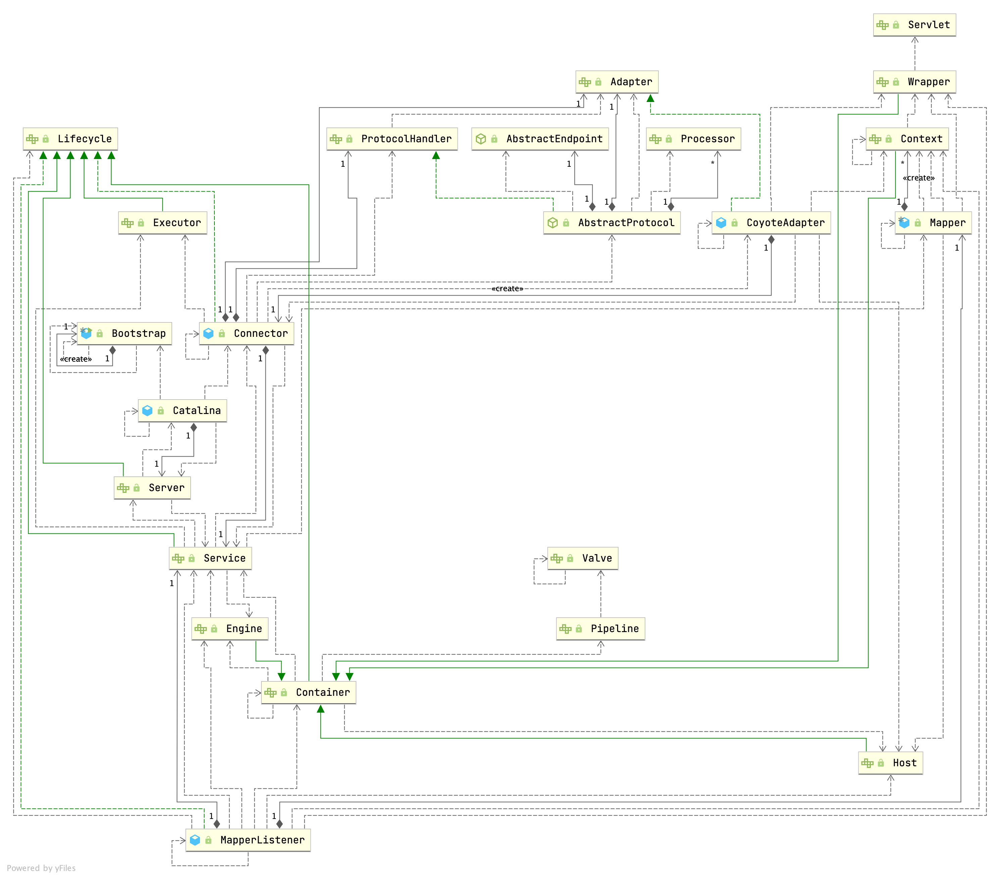

## Introduction

[The Apache Tomcat® software](https://tomcat.apache.org/) is an open source implementation of the Jakarta [Servlet](/docs/CS/Java/Tomcat/Servlet.md), Jakarta Server Pages, Jakarta Expression Language, Jakarta WebSocket, Jakarta Annotations and Jakarta Authentication specifications. These specifications are part of the Jakarta EE platform.

> [Apache Tomcat Versions](https://tomcat.apache.org/whichversion.html)


Different versions of Apache Tomcat are available for different versions of the specifications. The mapping between the specifications and the respective Apache Tomcat versions is:

| **Servlet Spec** | **JSP Spec** | **EL Spec** | **WebSocket Spec** | **Authentication (JASPIC) Spec** | **Apache Tomcat Version** | **Latest Released Version** | **Supported Java Versions**                 |
| ------------------ | -------------- | ------------- | -------------------- | ---------------------------------- | --------------------------- | ----------------------------- | --------------------------------------------- |
| 6.0              | 3.1          | 5.0         | 2.1                | 3.0                              | 10.1.x                    | 10.1.1                      | 11 and later                                |
| 5.0              | 3.0          | 4.0         | 2.0                | 2.0                              | 10.0.x (superseded)       | 10.0.27 (superseded)        | 8 and later                                 |
| 4.0              | 2.3          | 3.0         | 1.1                | 1.1                              | 9.0.x                     | 9.0.68                      | 8 and later                                 |
| 3.1              | 2.3          | 3.0         | 1.1                | 1.1                              | 8.5.x                     | 8.5.83                      | 7 and later                                 |
| 3.1              | 2.3          | 3.0         | 1.1                | N/A                              | 8.0.x (superseded)        | 8.0.53 (superseded)         | 7 and later                                 |
| 3.0              | 2.2          | 2.2         | 1.1                | N/A                              | 7.0.x (archived)          | 7.0.109 (archived)          | 6 and later<br/>(7 and later for WebSocket) |
| 2.5              | 2.1          | 2.1         | N/A                | N/A                              | 6.0.x (archived)          | 6.0.53 (archived)           | 5 and later                                 |
| 2.4              | 2.0          | N/A         | N/A                | N/A                              | 5.5.x (archived)          | 5.5.36 (archived)           | 1.4 and later                               |
| 2.3              | 1.2          | N/A         | N/A                | N/A                              | 4.1.x (archived)          | 4.1.40 (archived)           | 1.3 and later                               |
| 2.2              | 1.1          | N/A         | N/A                | N/A                              | 3.3.x (archived)          | 3.3.2 (archived)            | 1.1 and later                               |


## Architecture



- [start](/docs/CS/Java/Tomcat/Start.md)
- [ClassLoader](/docs/CS/Java/Tomcat/ClassLoader.md)
- [Connector](/docs/CS/Java/Tomcat/Connector.md)


### Container

A container must implement `org.apache.catalina.Container`.

The first thing to note about containers in Catalina is that there are four types of containers at different conceptual levels:

- Engine. Represents the entire Catalina servlet engine.
- Host. Represents a virtual host with a number of contexts.
- Context. Represents a web application. A context contains one or more wrappers.
- Wrapper. Represents an individual servlet.

## HotSwap

Tomcat 本质是通过一个后台线程做周期性的任务，定期检测类文件的变化，如果有变化就重新加载类。我们来看 `ContainerBackgroundProcessor`

```java
/**
 * Private runnable class to invoke the backgroundProcess method
 * of this container and its children after a fixed delay.
 */
protected class ContainerBackgroundProcessor implements Runnable {

    @Override
    public void run() {
        processChildren(ContainerBase.this);
    }

    protected void processChildren(Container container) {
        ClassLoader originalClassLoader = null;

        try {
            if (container instanceof Context) {
                Loader loader = ((Context) container).getLoader();
                // Loader will be null for FailedContext instances
                if (loader == null) {
                    return;
                }

                // Ensure background processing for Contexts and Wrappers
                // is performed under the web app's class loader
                originalClassLoader = ((Context) container).bind(false, null);
            }
            container.backgroundProcess();
            Container[] children = container.findChildren();
            for (int i = 0; i < children.length; i++) {
                if (children[i].getBackgroundProcessorDelay() <= 0) {
                    processChildren(children[i]);
                }
            }
        } catch (Throwable t) {
            ExceptionUtils.handleThrowable(t);
            log.error(sm.getString("containerBase.backgroundProcess.error"), t);
        } finally {
            if (container instanceof Context) {
                ((Context) container).unbind(false, originalClassLoader);
            }
        }
    }
}
```

一个 Context 容器对应一个类加载器，类加载器在销毁的过程中会把它加载的所有类也全部销毁。Context 容器在启动过程中，会创建一个新的类加载器来加载新的类文件

## Upgrade

Comet

Websocket
