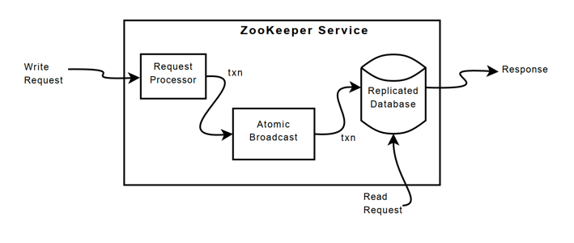

## Introduction

ZooKeeper is a centralized service for maintaining configuration information, naming, providing distributed synchronization, and providing group services.
All of these kinds of services are used in some form or another by distributed applications.
Each time they are implemented there is a lot of work that goes into fixing the bugs and race conditions that are inevitable.
Because of the difficulty of implementing these kinds of services, applications initially usually skimp on them, which make them brittle in the presence of change and difficult to manage.
Even when done correctly, different implementations of these services lead to management complexity when the applications are deployed.

ZooKeeper aims at distilling the essence of these different services into a very simple interface to a centralized coordination service.
The service itself is distributed and highly reliable.
Consensus, group management, and presence protocols will be implemented by the service so that the applications do not need to implement them on their own.
Application specific uses of these will consist of a mixture of specific components of Zoo Keeper and application specific conventions.

ZooKeeper provides a per client guarantee of FIFO execution of requests and linearizability for all requests that change the ZooKeeper state.

To guarantee that update operations satisfy linearizability, Zookeeper implements a leader-based atomic broadcast protocol, called **Zab**.

In ZooKeeper, servers process read operations locally, and we do not use Zab to totally order them.

Caching data on the client side is an important technique to increase the performance of reads.
For example, it is useful for a process to cache the identifier of the current leader instead of probing ZooKeeper every time it needs to know the leader.
ZooKeeper uses a watch mechanism to enable clients to cache data without managing the client cache directly.
With this mechanism, a client can watch for an update to a given data object, and receive a notification upon an update.
Chubby manages the client cache directly.

ZooKeeper provides to its clients the abstraction of a set of data nodes (znodes), organized according to a hierarchical name space.

ZooKeeper also has the following two liveness and durability guarantees: if a majority of ZooKeeper servers are active and communicating the service will be available;
and if the ZooKeeper service responds successfully to a change request, that change persists across any number of failures as long as a quorum of servers is eventually able to recover.

### ZooKeeper guarantees

ZooKeeper has two basic ordering guarantees:

- **Linearizable writes:** all requests that update the state of ZooKeeper are serializable and respect precedence;
- **FIFO client order:** all requests from a given client are executed in the order that they were sent by the client.

ecause only update requests are Alinearizable, ZooKeeper processes read requests locally at each replica.
This allows the service to scale linearly as servers are added to the system.

## Data Model

ZooKeeper has a hierarchal name space, much like a distributed file system.
The only difference is that each node in the namespace can have data associated with it as well as children.
It is like having a file system that allows a file to also be a directory.
Paths to nodes are always expressed as canonical, absolute, slash-separated paths; there are no relative reference.

ZooKeeper's Hierarchical Namespace

### ZNodes

Unlike files in file systems, znodes are not designed for general data storage.
Instead, znodes map to abstractions of the client application, typically corresponding to meta-data used for coordination purposes.

Although znodes have not been designed for general data storage, ZooKeeper does allow clients to store some information that can be used for meta-data or configuration in a distributed computation.
For example, in a leader-based application, it is useful for an application server that is just starting to learn which other server is currently the leader.
To accomplish this goal, we can have the current leader write this information in a known location in the znode space.

Znodes also have associated meta-data with time stamps and version counters, which allow clients to track changes to znodes and execute conditional updates based on the version of the znode.

Unlike standard file systems, each node in a ZooKeeper namespace can have data associated with it as well as children.
It is like having a file-system that allows a file to also be a directory.
(ZooKeeper was designed to store coordination data: status information, configuration, location information, etc., so the data stored at each node is usually small, in the byte to kilobyte range.)
We use the term znode to make it clear that we are talking about ZooKeeper data nodes.

Znodes maintain a stat structure that includes version numbers for data changes, ACL changes, and timestamps, to allow cache validations and coordinated updates.
Each time a znode's data changes, the version number increases.
For instance, whenever a client retrieves data it also receives the version of the data.

The data stored at each znode in a namespace is read and written atomically. Reads get all the data bytes associated with a znode and a write replaces all the data.
Each node has an Access Control List (ACL) that restricts who can do what.

ZooKeeper also has the notion of ephemeral nodes. These znodes exists as long as the session that created the znode is active. When the session ends the znode is deleted.

Container node

TTL time to live

#### Watches

Clients can set watches on znodes. Changes to that znode trigger the watch and then clear the watch. When a watch triggers, ZooKeeper sends the client a notification.

**New in 3.6.0:** Clients can also set permanent, recursive watches on a znode that are not removed when triggered and that trigger for changes on the registered znode as well as any children znodes recursively.

#### Ephemeral Nodes

ZooKeeper also has the notion of ephemeral nodes.
These znodes exists as long as the session that created the znode is active.
When the session ends the znode is deleted. Because of this behavior ephemeral znodes are not allowed to have children.

### Guarantees

ZooKeeper is very fast and very simple. Since its goal, though, is to be a basis for the construction of more complicated services, such as synchronization, it provides a set of guarantees. These are:

- Sequential Consistency - Updates from a client will be applied in the order that they were sent.
- Atomicity - Updates either succeed or fail. No partial results.
- Single System Image - A client will see the same view of the service regardless of the server that it connects to. i.e., a client will never see an older view of the system even if the client fails over to a different server with the same session.
- Reliability - Once an update has been applied, it will persist from that time forward until a client overwrites the update.
- Timeliness - The clients view of the system is guaranteed to be up-to-date within a certain time bound.

### Simple API

One of the design goals of ZooKeeper is providing a very simple programming interface. As a result, it supports only these operations:

- *create* : creates a node at a location in the tree
- *delete* : deletes a node
- *exists* : tests if a node exists at a location
- *get data* : reads the data from a node
- *set data* : writes data to a node
- *get children* : retrieves a list of children of a node
- *sync* : waits for data to be propagated

### 队列管理

6.Zookeeper命名服务在zookeeper的文件系统里创建一个目录，即有唯一的path。在我们使用tborg无法确定上游程序的部署机器时即可与下游程序约定好path，通过path即能互相探索发现。

7.Zookeeper的配置管理程序总是需要配置的，如果程序分散部署在多台机器上，要逐个改变配置就变得困难。现在把这些配置全部放到zookeeper上去，保存在 Zookeeper 的某个目录节点中，然后所有相关应用程序对这个目录节点进行监听，一旦配置信息发生变化，每个应用程序就会收到 Zookeeper 的通知，然后从 Zookeeper 获取新的配置信息应用到系统中就好<ignore_js_op>

8.Zookeeper集群管理所谓集群管理无在乎两点：是否有机器退出和加入、选举master。 对于第一点，所有机器约定在父目录GroupMembers下创建临时目录节点，然后监听父目录节点的子节点变化消息。一旦有机器挂掉，该机器与 zookeeper的连接断开，其所创建的临时目录节点被删除，所有其他机器都收到通知：某个兄弟目录被删除，于是，所有人都知道：它上船了。新机器加入也是类似，所有机器收到通知：新兄弟目录加入，highcount又有了，对于第二点，我们稍微改变一下，所有机器创建临时顺序编号目录节点，每次选取编号最小的机器作为master就好。9.Zookeeper分布式锁有了zookeeper的一致性文件系统，锁的问题变得容易。锁服务可以分为两类，一个是保持独占，另一个是控制时序。 对于第一类，我们将zookeeper上的一个znode看作是一把锁，通过createznode的方式来实现。所有客户端都去创建 /distribute_lock 节点，最终成功创建的那个客户端也即拥有了这把锁。用完删除掉自己创建的distribute_lock 节点就释放出锁。 对于第二类， /distribute_lock 已经预先存在，所有客户端在它下面创建临时顺序编号目录节点，和选master一样，编号最小的获得锁，用完删除，依次方便。

### 队列

1. 同步队列，当一个队列的成员都聚齐时，这个队列才可用，否则一直等待所有成员到达
2. 队列按照 FIFO 方式进行入队和出队操作。 第一类，在约定目录下创建临时目录节点，监听节点数目是否是我们要求的数目。 第二类，和分布式锁服务中的控制时序场景基本原理一致，入列有编号，出列按编号。

### 数据复制

的好处：

1、容错：一个节点出错，不致于让整个系统停止工作，别的节点可以接管它的工作； 2、提高系统的扩展能力 ：把负载分布到多个节点上，或者增加节点来提高系统的负载能力； 3、提高性能：让客户端本地访问就近的节点，提高用户访问速度。 从客户端读写访问的透明度来看，数据复制集群系统分下面两种：

1、写主(WriteMaster) ：对数据的修改提交给指定的节点。读无此限制，可以读取任何一个节点。这种情况下客户端需要对读与写进行区别，俗称读写分离；

、写任意(Write Any)：对数据的修改可提交给任意的节点，跟读一样。这种情况下，客户端对集群节点的角色与变化透明。对zookeeper来说，它采用的方式是写任意。通过增加机器，它的读吞吐能力和响应能力扩展性非常好，而写，随着机器的增多吞吐能力肯定下降（这也是它建立observer的原因），而响应能力则取决于具体实现方式，是延迟复制保持最终一致性，还是立即复制快速响应。

1.最终一致性：client不论连接到哪个Server，展示给它都是同一个视图，这是zookeeper最重要的性能。

2.可靠性：具有简单、健壮、良好的性能，如果消息被到一台服务器接受，那么它将被所有的服务器接受。

3.实时性：Zookeeper保证客户端将在一个时间间隔范围内获得服务器的更新信息，或者服务器失效的信息。但由于网络延时等原因，Zookeeper不能保证两个客户端能同时得到刚更新的数据，如果需要最新数据，应该在读数据之前调用sync()接口。

4.等待无关（wait-free）：慢的或者失效的client不得干预快速的client的请求，使得每个client都能有效的等待。

5.原子性：更新只能成功或者失败，没有中间状态。

6.顺序性：包括全局有序和偏序两种：全局有序是指如果在一台服务器上消息a在消息b前发布，则在所有Server上消息a都将在消息b前被发布；偏序是指如果一个消息b在消息a后被同一个发送者发布，a必将排在b前面。

### 工作原理

Zookeeper 的核心是原子广播，这个机制保证了各个Server之间的同步。实现这个机制的协议叫做Zab协议。Zab协议有两种模式，它们分别是恢复模式（选主）和广播模式（同步）。当服务启动或者在领导者崩溃后，Zab就进入了恢复模式，当领导者被选举出来，且大多数Server完成了和 leader的状态同步以后，恢复模式就结束了。状态同步保证了leader和Server具有相同的系统状态。 为了保证事务的顺序一致性，zookeeper采用了递增的事务id号（zxid）来标识事务。所有的提议（proposal）都在被提出的时候加上了zxid。实现中zxid是一个64位的数字，它高32位是epoch用来标识leader关系是否改变，每次一个leader被选出来，它都会有一个新的epoch，标识当前属于那个leader的统治时期。低32位用于递增计数。

16.Zookeeper 下 Server工作状态每个Server在工作过程中有三种状态： LOOKING：当前Server不知道leader是谁，正在搜寻LEADING：当前Server即为选举出来的leaderFOLLOWING：leader已经选举出来，当前Server与之同步

17.Zookeeper选主流程(basic paxos)当leader崩溃或者leader失去大多数的follower，这时候zk进入恢复模式，恢复模式需要重新选举出一个新的leader，让所有的Server都恢复到一个正确的状态。Zk的选举算法有两种：一种是基于basic paxos实现的，另外一种是基于fast paxos算法实现的。

系统默认的选举算法为fast paxos。

1. 选举线程由当前Server发起选举的线程担任，其主要功能是对投票结果进行统计，并选出推荐的Server；
2. 选举线程首先向所有Server发起一次询问(包括自己)；

3.选举线程收到回复后，验证是否是自己发起的询问(验证zxid是否一致)，然后获取对方的id(myid)，并存储到当前询问对象列表中，最后获取对方提议的leader相关信息(id,zxid)，并将这些信息存储到当次选举的投票记录表中；

4.收到所有Server回复以后，就计算出zxid最大的那个Server，并将这个Server相关信息设置成下一次要投票的Server；

5.线程将当前zxid最大的Server设置为当前Server要推荐的Leader，如果此时获胜的Server获得n/2 + 1的Server票数，设置当前推荐的leader为获胜的Server，将根据获胜的Server相关信息设置自己的状态，否则，继续这个过程，直到leader被选举出来。 通过流程分析我们可以得出：要使Leader获得多数Server的支持，则Server总数必须是奇数2n+1，且存活的Server的数目不得少于n+1. 每个Server启动后都会重复以上流程。在恢复模式下，如果是刚从崩溃状态恢复的或者刚启动的server还会从磁盘快照中恢复数据和会话信息，zk会记录事务日志并定期进行快照，方便在恢复时进行状态恢复。选主的具体流程图所示：

18.Zookeeper选主流程（fast paxos）fast paxos流程是在选举过程中，某Server首先向所有Server提议自己要成为leader，当其它Server收到提议以后，解决epoch和 zxid的冲突，并接受对方的提议，然后向对方发送接受提议完成的消息，重复这个流程，最后一定能选举出Leader。

19.Zookeeper同步流程选完Leader以后，zk就进入状态同步过程。

1. Leader等待server连接；

2 .Follower连接leader，将最大的zxid发送给leader；

3 .Leader根据follower的zxid确定同步点；

4 .完成同步后通知follower 已经成为uptodate状态；

5 .Follower收到uptodate消息后，又可以重新接受client的请求进行服务了。20.Zookeeper工作流程-Leader1 .恢复数据；

2 .维持与Learner的心跳，接收Learner请求并判断Learner的请求消息类型；

3 .Learner的消息类型主要有PING消息、REQUEST消息、ACK消息、REVALIDATE消息，根据不同的消息类型，进行不同的处理。 PING 消息是指Learner的心跳信息；REQUEST消息是Follower发送的提议信息，包括写请求及同步请求；ACK消息是 Follower的对提议的回复，超过半数的Follower通过，则commit该提议；REVALIDATE消息是用来延长SESSION有效时间。

21.Zookeeper工作流程-FollowerFollower主要有四个功能：

1.向Leader发送请求（PING消息、REQUEST消息、ACK消息、REVALIDATE消息）；

2.接收Leader消息并进行处理；

3.接收Client的请求，如果为写请求，发送给Leader进行投票；

4.返回Client结果。

Follower的消息循环处理如下几种来自Leader的消息：

1. PING消息： 心跳消息
2. PROPOSAL消息：Leader发起的提案，要求Follower投票
3. COMMIT消息：服务器端最新一次提案的信息
4. UPTODATE消息：表明同步完成
5. REVALIDATE消息：根据Leader的REVALIDATE结果，关闭待revalidate的session还是允许其接受消息
6. SYNC消息：返回SYNC结果到客户端，这个消息最初由客户端发起，用来强制得到最新的更新。

### Leader Election

A simple way of doing leader election with ZooKeeper is to use the **SEQUENCE|EPHEMERAL** flags when creating znodes that represent "proposals" of clients. The idea is to have a znode, say "/election", such that each znode creates a child znode "/election/n_" with both flags SEQUENCE|EPHEMERAL. With the sequence flag, ZooKeeper automatically appends a sequence number that is greater that any one previously appended to a child of "/election". The process that created the znode with the smallest appended sequence number is the leader.

That's not all, though. It is important to watch for failures of the leader, so that a new client arises as the new leader in the case the current leader fails. A trivial solution is to have all application processes watching upon the current smallest znode, and checking if they are the new leader when the smallest znode goes away (note that the smallest znode will go away if the leader fails because the node is ephemeral). But this causes a herd effect: upon of failure of the current leader, all other processes receive a notification, and execute getChildren on "/election" to obtain the current list of children of "/election". If the number of clients is large, it causes a spike on the number of operations that ZooKeeper servers have to process. To avoid the herd effect, it is sufficient to watch for the next znode down on the sequence of znodes. If a client receives a notification that the znode it is watching is gone, then it becomes the new leader in the case that there is no smaller znode. Note that this avoids the herd effect by not having all clients watching the same znode.

Here's the pseudo code:

Let ELECTION be a path of choice of the application. To volunteer to be a leader:

1. Create znode z with path "ELECTION/n_" with both SEQUENCE and EPHEMERAL flags;
2. Let C be the children of "ELECTION", and i be the sequence number of z;
3. Watch for changes on "ELECTION/n_j", where j is the largest sequence number such that j < i and n_j is a znode in C;

Upon receiving a notification of znode deletion:

1. Let C be the new set of children of ELECTION;
2. If z is the smallest node in C, then execute leader procedure;
3. Otherwise, watch for changes on "ELECTION/n_j", where j is the largest sequence number such that j < i and n_j is a znode in C;

Note that the znode having no preceding znode on the list of children does not imply that the creator of this znode is aware that it is the current leader. Applications may consider creating a separate znode to acknowledge that the leader has executed the leader procedure.

The components of the ZooKeeper service.

## Atomic Broadcast

At the heart of ZooKeeper is an atomic messaging system that keeps all of the servers in sync.

**All requests that update ZooKeeper state are forwarded to the leader.**
The leader executes the request and broadcasts the change to the ZooKeeper state through Zab, an atomic broadcast protocol.
The server that receives the client request responds to the client when it delivers the corresponding state change.
Zab uses by default simple majority quorums to decide on a proposal, so Zab and thus ZooKeeper can only work if a majority of servers are correct (i.e., with $2f + 1$ server we can tolerate $f$ failures).

Read requests are handled locally at each server.
Each read request is processed and tagged with a zxid that corresponds to the last transaction seen by the server.
This zxid defines the partial order of the read requests with respect to the write requests.
By processing reads locally, we obtain excellent read performance because it is just an in-memory operation on the local server, and there is no disk activity or agreement protocol to run.
This design choice is key to achieving our goal of excellent performance with read-dominant workloads.

One drawback of using fast reads is not guaranteeing precedence order for read operations.
That is, a read operation may return a stale value, even though a more recent update to the same znode has been committed.
Not all of our applications require precedence order, but for applications that do require it, we have implemented sync.
This primitive executes asynchronously and is ordered by the leader after all pending writes to its local replica.
To guarantee that a given read operation returns the latest updated value, a client calls sync followed by the read operation.

The FIFO order guarantee of client operations together with the global guarantee of sync enables the result of the read operation to reflect any changes that happened before the sync was issued.
In our implementation, we do not need to atomically broadcast sync as we use a leader-based algorithm, and we simply place the sync operation at the end of the queue of requests between the leader and the server executing the call to sync.
In order for this to work, the follower must be sure that the leader is still the leader.
If there are pending transactions that commit, then the server does not suspect the leader.
If the pending queue is empty, the leader needs to issue a null transaction to commit and orders the sync after that transaction.
This has the nice property that when the leader is under load, no extra broadcast traffic is generated.
In our implementation, timeouts are set such that leaders realize they are not leaders before followers abandon them, so we do not issue the null transaction.

ZooKeeper servers process requests from clients in FIFO order.
Responses include the zxid that the response is relative to.
Even heartbeat messages during intervals of no activity include the last zxid seen by the server that the client is connected to.
If the client connects to a new server, that new server ensures that its view of the ZooKeeper data is at least as recent as the view of the client by checking the last zxid of the client against its last zxid.
If the client has a more recent view than the server, the server does not reestablish the session with the client until the server has caught up.
The client is guaranteed to be able to find another server that has a recent view of the
system since the client only sees changes that have been
replicated to a majority of the ZooKeeper servers. This
behavior is important to guarantee durability.

To detect client session failures, ZooKeeper uses timeouts.
The leader determines that there has been a failure if no other server receives anything from a client session within the session timeout.
If the client sends requests frequently enough, then there is no need to send any other message.
Otherwise, the client sends heartbeat messages during periods of low activity.
If the client cannot communicate with a server to send a request or heartbeat, it connects to a different ZooKeeper server to re-establish its session.
To prevent the session from timing out, the ZooKeeper client library sends a heartbeat after the session has been idle for s=3 ms and switch to a new server if it has not heard from a server for 2s=3 ms, where s is the session timeout in milliseconds.

### Guarantees, Properties, and Definitions

The specific guarantees provided by the messaging system used by ZooKeeper are the following:

- Reliable delivery
  If a message, m, is delivered by one server, it will be eventually delivered by all servers.
- Total order
  If a message is delivered before message b by one server, a will be delivered before b by all servers. If a and b are delivered messages, either a will be delivered before b or b will be delivered before a.
- Causal order
  If a message b is sent after a message a has been delivered by the sender of b, a must be ordered before b. If a sender sends c after sending b, c must be ordered after b.

Our protocol assumes that we can construct point-to-point FIFO channels between the servers.
While similar services usually assume message delivery that can lose or reorder messages, our assumption of FIFO channels is very practical given that we use TCP for communication.
Specifically we rely on the following property of TCP:

- Ordered delivery
  Data is delivered in the same order it is sent and a message m is delivered only after all messages sent before m have been delivered. (The corollary to this is that if message m is lost all messages after m will be lost.)
- No message after close
  Once a FIFO channel is closed, no messages will be received from it.

As stated above, ZooKeeper guarantees a total order of messages, and it also guarantees a total order of proposals.
ZooKeeper exposes the total ordering using a ZooKeeper transaction id (zxid). All proposals will be stamped with a zxid when it is proposed and exactly reflects the total ordering.
Proposals are sent to all ZooKeeper servers and committed when a quorum of them acknowledge the proposal. If a proposal contains a message, the message will be delivered when the proposal is committed.
Acknowledgement means the server has recorded the proposal to persistent storage.
Our quorums have the requirement that any pair of quorum must have at least one server in common.
We ensure this by requiring that all quorums have size (n/2+1) where n is the number of servers that make up a ZooKeeper service.

The zxid has two parts: the epoch and a counter. In our implementation the zxid is a 64-bit number.
We use the high order 32-bits for the epoch and the low order 32-bits for the counter.
Because it has two parts represent the zxid both as a number and as a pair of integers, (epoch, count). The epoch number represents a change in leadership.
Each time a new leader comes into power it will have its own epoch number.
We have a simple algorithm to assign a unique zxid to a proposal: the leader simply increments the zxid to obtain a unique zxid for each proposal.
Leadership activation will ensure that only one leader uses a given epoch, so our simple algorithm guarantees that every proposal will have a unique id.

### Messaging

ZooKeeper messaging consists of two phases:

- *Leader activation*
  In this phase a leader establishes the correct state of the system and gets ready to start making proposals.
- *Active messaging*
  In this phase a leader accepts messages to propose and coordinates message delivery.

#### Leader Activation

Leader activation includes leader election.
We currently have two leader election algorithms in ZooKeeper: LeaderElection and FastLeaderElection (AuthFastLeaderElection is a variant of FastLeaderElection that uses UDP and allows servers to perform a simple form of authentication to avoid IP spoofing).
ZooKeeper messaging doesn't care about the exact method of electing a leader has long as the following holds:

- The leader has seen the highest zxid of all the followers.
- A quorum of servers have committed to following the leader.

Of these two requirements only the first, the highest zxid amoung the followers needs to hold for correct operation.
The second requirement, a quorum of followers, just needs to hold with high probability.
We are going to recheck the second requirement, so if a failure happens during or after the leader election and quorum is lost, we will recover by abandoning leader activation and running another election.

After leader election a single server will be designated as a leader and start waiting for followers to connect.
The rest of the servers will try to connect to the leader.
The leader will sync up with followers by sending any proposals they are missing, or if a follower is missing too many proposals, it will send a full snapshot of the state to the follower.

There is a corner case in which a follower that has proposals, U, not seen by a leader arrives.
Proposals are seen in order, so the proposals of U will have a zxids higher than zxids seen by the leader.
The follower must have arrived after the leader election, otherwise the follower would have been elected leader given that it has seen a higher zxid.
Since committed proposals must be seen by a quorum of servers, and a quorum of servers that elected the leader did not see U, the proposals of you have not been committed, so they can be discarded.
When the follower connects to the leader, the leader will tell the follower to discard U.

A new leader establishes a zxid to start using for new proposals by getting the epoch, e, of the highest zxid it has seen and setting the next zxid to use to be (e+1, 0), after the leader syncs with a follower, it will propose a NEW_LEADER proposal.
Once the NEW_LEADER proposal has been committed, the leader will activate and start receiving and issuing proposals.

It all sounds complicated but here are the basic rules of operation during leader activation:

- A follower will ACK the NEW_LEADER proposal after it has synced with the leader.
- A follower will only ACK a NEW_LEADER proposal with a given zxid from a single server.
- A new leader will COMMIT the NEW_LEADER proposal when a quorum of followers have ACKed it.
- A follower will commit any state it received from the leader when the NEW_LEADER proposal is COMMIT.
- A new leader will not accept new proposals until the NEW_LEADER proposal has been COMMITED.

If leader election terminates erroneously, we don't have a problem since the NEW_LEADER proposal will not be committed since the leader will not have quorum. When this happens, the leader and any remaining followers will timeout and go back to leader election.

#### Active Messaging

Leader Activation does all the heavy lifting. Once the leader is coronated he can start blasting out proposals.
As long as he remains the leader no other leader can emerge since no other leader will be able to get a quorum of followers.
If a new leader does emerge, it means that the leader has lost quorum, and the new leader will clean up any mess left over during her leadership activation.

ZooKeeper messaging operates similar to a classic two-phase commit.

All communication channels are FIFO, so everything is done in order.
Specifically the following operating constraints are observed:

- The leader sends proposals to all followers using the same order.
  Moreover, this order follows the order in which requests have been received.
  Because we use FIFO channels this means that followers also receive proposals in order.
- Followers process messages in the order they are received.
  This means that messages will be ACKed in order and the leader will receive ACKs from followers in order, due to the FIFO channels.
  It also means that if message $m$ has been written to non-volatile storage, all messages that were proposed before $m$ have been written to non-volatile storage.
- The leader will issue a COMMIT to all followers as soon as a quorum of followers have ACKed a message.
  Since messages are ACKed in order, COMMITs will be sent by the leader as received by the followers in order.
- COMMITs are processed in order. Followers deliver a proposals message when that proposal is committed.

### Quorums

## ZAB

[A simple totally ordered broadcast protocol](https://www.datadoghq.com/pdf/zab.totally-ordered-broadcast-protocol.2008.pdf)

## Examples of primitives

- Configuration Management
- Rendezvous
- Group Membership
- Simple Locks
- Read/Write Locks

The replicated database is an in-memory database containing the entire data tree.
Each znode in the tree stores a maximum of 1MB of data by default, but this maximum value is a configuration parameter that can be changed in specific cases.
For recoverability, we efficiently log updates to disk, and we force writes to be on the disk media before they are applied to the in-memory database.
In fact, as Chubby, we keep a replay log (a write-ahead log, in our case) of committed operations and generate periodic snapshots of the in-memory database.

Every ZooKeeper server services clients. Clients connect to exactly one server to submit its requests.
As we noted earlier, read requests are serviced from the local replica of each server database.
Requests that change the state of the service, write requests, are processed by an agreement protocol.

As part of the agreement protocol write requests are forwarded to a single server, called the leader1.
The rest of the ZooKeeper servers, called followers, receive message proposals consisting of state changes from the leader and agree upon state changes.

Since the messaging layer is atomic, we guarantee that the local replicas never diverge, although at any point in time some servers may have applied more transactions than others.
Unlike the requests sent from clients, the transactions are *idempotent*.
When the leader receives a write request, it calculates what the state of the system will be when the write is applied and transforms it into a transaction that captures this new state.
The future state must be calculated because there may be outstanding transactions that have not yet been applied to the database.
For example, if a client does a conditional setData and the version number in the request matches the future version number of the znode being updated, the service generates a setDataTXN that contains the new data, the new version number, and updated time stamps.
If an error occurs, such as mismatched version numbers or the znode to be updated does not exist, an errorTXN is generated instead.

During normal operation Zab does deliver all messages in order and exactly once, but since Zab does not
persistently record the id of every message delivered,
Zab may redeliver a message during recovery. Because
we use idempotent transactions, multiple delivery is acceptable as long as they are delivered in order. In fact,
ZooKeeper requires Zab to redeliver at least all messages
that were delivered after the start of the last snapshot.

## Recipes

### Barriers

### Queues

### Locks

See [Zookeeper Locks](https://zookeeper.apache.org/doc/current/recipes.html)

Here are a few things to notice:

- The removal of a node will only cause one client to wake up since each node is watched by exactly one client. In this way, you avoid the herd effect.
- There is no polling or timeouts.
- Because of the way you implement locking, it is easy to see the amount of lock contention, break locks, debug locking problems, etc.

### Two-phased Commit

A two-phase commit protocol is an algorithm that lets all clients in a distributed system agree either to commit a transaction or abort.

In ZooKeeper, you can implement a two-phased commit by having a coordinator create a transaction node, say "/app/Tx", and one child node per participating site, say "/app/Tx/s_i".
When coordinator creates the child node, it leaves the content undefined. Once each site involved in the transaction receives the transaction from the coordinator, the site reads each child node and sets a watch.
Each site then processes the query and votes "commit" or "abort" by writing to its respective node.
Once the write completes, the other sites are notified, and as soon as all sites have all votes, they can decide either "abort" or "commit". Note that a node can decide "abort" earlier if some site votes for "abort".

An interesting aspect of this implementation is that the only role of the coordinator is to decide upon the group of sites, to create the ZooKeeper nodes, and to propagate the transaction to the corresponding sites.
In fact, even propagating the transaction can be done through ZooKeeper by writing it in the transaction node.

There are two important drawbacks of the approach described above. One is the message complexity, which is O(n²). The second is the impossibility of detecting failures of sites through ephemeral nodes.
To detect the failure of a site using ephemeral nodes, it is necessary that the site create the node.

To solve the first problem, you can have only the coordinator notified of changes to the transaction nodes, and then notify the sites once coordinator reaches a decision.
Note that this approach is scalable, but it's is slower too, as it requires all communication to go through the coordinator.

To address the second problem, you can have the coordinator propagate the transaction to the sites, and have each site creating its own ephemeral node.

### Leader Election

A simple way of doing leader election with ZooKeeper is to use the *SEQUENCE|EPHEMERAL* flags when creating znodes that represent "proposals" of clients. 
The idea is to have a znode, say "/election", such that each znode creates a child znode "/election/n_" with both flags SEQUENCE|EPHEMERAL. 
With the sequence flag, ZooKeeper automatically appends a sequence number that is greater that any one previously appended to a child of "/election". 
The process that created the znode with the smallest appended sequence number is the leader.

To avoid the herd effect, it is sufficient to watch for the next znode down on the sequence of znodes. 
If a client receives a notification that the znode it is watching is gone, then it becomes the new leader in the case that there is no smaller znode. 
Note that this avoids the herd effect by not having all clients watching the same znode.

## Logging

Zookeeper uses slf4j as an abstraction layer for logging.

## References

1. [ZooKeeper: Wait-free coordination for Internet-scale systems](https://www.usenix.org/legacy/event/atc10/tech/full_papers/Hunt.pdf)
2. [How to do distributed locking](https://martin.kleppmann.com/2016/02/08/how-to-do-distributed-locking.html)
3. [Distributed Locks are Dead; Long Live Distributed Locks!](https://hazelcast.com/blog/long-live-distributed-locks/)
4. [ZooKeeper Programmer's Guide](https://zookeeper.apache.org/doc/current/zookeeperProgrammers.html)
5. [Dynamic Reconfiguration of Primary/Backup Clusters](https://www.usenix.org/system/files/conference/atc12/atc12-final74.pdf)
