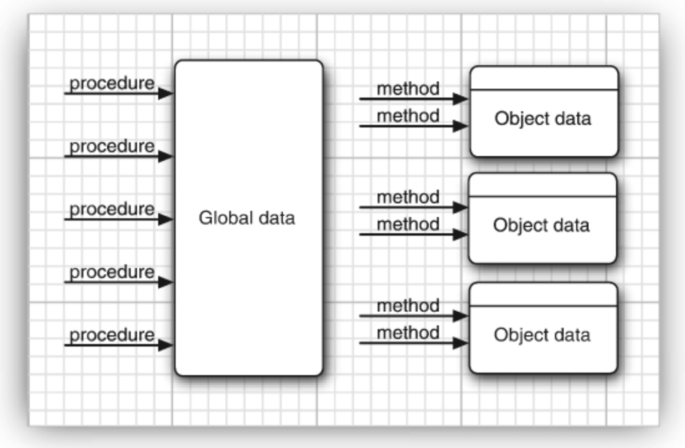

> Once a language is out in the field, the ugly reality of compatibility with existing code sets in.

The object-oriented features of Java are comparable to those of C++. 
The major difference between Java and C++ lies in multiple inheritance, which Java has replaced with a simpler concept of interfaces.
Java has a richer capacity for runtime introspection than C++.

Fig.1. Procedural vs. OO programming.

Architecture-Neutral