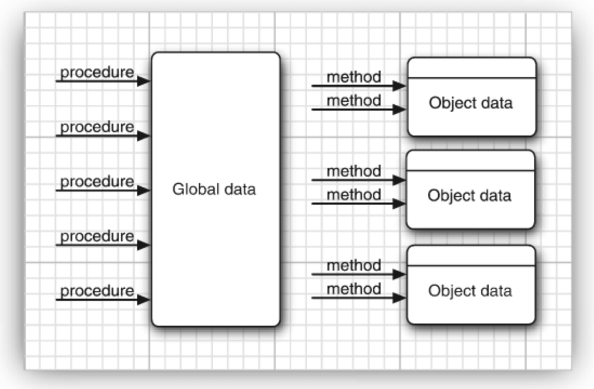

## Introduction

> Once a language is out in the field, the ugly reality of compatibility with existing code sets in.

面向对象程序由对象组成。
每个对象都有特定的功能，向用户公开，并有隐藏的实现。
程序中的许多对象将来自库中的"现成"组件；其他对象则是自定义设计的。
无论是构建对象还是购买对象，可能取决于预算或时间。
但基本上，只要对象满足需求，你并不关心功能是如何实现的。

传统结构化编程包括设计一组过程（或算法）来解决问题。
一旦确定了过程，传统的下一步就是找到合适的方式来存储数据。
这就是为什么 Pascal 语言的设计者 Niklaus Wirth 将其著名的编程书籍命名为 **算法 + 数据结构 = 程序**（Prentice Hall, 1976）。
注意在 Wirth 的书名中，算法在先，数据结构在后。
这反映了当时程序员的工作方式。
首先，他们决定操作数据的程序；然后，他们决定对数据施加什么结构以使操作更容易。
OOP 颠倒顺序：将数据放在第一位，然后寻找操作数据的算法。

"类指定了如何制造对象。
把类想象成饼干模具，对象就是饼干本身。
当你从类构造对象时，你就创建了该类的一个实例。"

"封装（有时称为信息隐藏）是使用对象的关键概念。
形式上，封装只是将数据和行为组合在一个包中，并向对象用户隐藏实现细节。
对象中的数据位称为实例字段，操作数据的过程称为方法。
作为类实例的特定对象将具有其实例字段的特定值。
这些值的集合就是对象的当前状态。
每当你调用对象上的方法时，其状态可能会发生变化。
使封装工作的关键在于方法永远不应直接访问自身类之外的实例字段。
程序应仅通过对象的方法与对象数据交互。
封装是赋予对象"黑盒"行为的方式，这是实现复用和可靠性的关键。
这意味着一个类可以完全改变其存储数据的方式，但只要它继续使用相同的方法来操作数据，其他对象就不会知道或关心。"

"当你开始在 Java 中编写自己的类时，OOP 的另一条原则将使这更容易：类可以通过扩展其他类来构建。
实际上，Java 带有一个称为 Object 的"宇宙超类"。
所有其他类都继承自这个类。
你将在下一章中了解更多关于 Object 类的信息。"

当你扩展现有类时，新类拥有所扩展类的所有属性和方法。
然后，你提供仅适用于新类的新方法和实例字段。
扩展类以获得另一个类的概念称为继承。

"要使用 OOP，你应该能够识别对象的三个关键特征：
• 对象的行为——你能对这个对象做什么，或者可以对其应用什么方法？
• 对象的状态——当你调用这些方法时，对象如何反应？
• 对象的身份——如何将对象与可能具有相同行为和状态的其他对象区分开来？"

"所有相同类的实例都通过支持相同的行为而具有家族相似性。
对象的行为由你可调用的方法定义。"

"接下来，每个对象存储关于其当前外观的信息。
这就是对象的状态。
对象的状态可能随时间变化，但不是自发的。
对象状态的改变必须是方法调用的结果。
（如果对象的状态在没有对该对象进行方法调用的情况下发生变化，那么有人破坏了封装。）"

"然而，对象的状态并不能完全描述它，因为每个对象都有独特的身份。
例如，在订单处理系统中，即使两个订单请求相同的物品，它们也是不同的。
注意，作为类实例的各个对象总是在身份上不同，并且通常在状态上不同。"

"这些关键特征可以相互影响。
例如，对象的状态可以影响其行为。
（如果订单是"已发货"或"已付款"，它可能会拒绝对其添加或删除物品的方法调用。
相反，如果订单是"空的"——即尚未订购任何物品——它不应允许自己被发货。）"

### Relationships between Classes
"类之间最常见的关系是：
• 依赖关系（"uses–a"）
• 聚合关系（"has–a"）
• 继承关系（"is–a"）
依赖关系（或"uses–a"关系）是最明显也是最通用的。
例如，Order 类使用 Account 类，因为 Order 对象需要访问 Account 对象来检查信用状态。
但 Item 类不依赖 Account 类，因为 Item 对象从不需要关心客户账户。
因此，如果一个类的方法使用或操作另一个类的对象，则该类依赖于另一个类。
尽量减少相互依赖的类数量。
关键是，如果类 A 不知道类 B 的存在，那么它也不关心 B 的任何变化。
（这意味着 B 的变化不会将 bug 引入 A。）
在软件工程术语中，我们希望最小化类之间的耦合。
聚合关系（或"has–a"关系）很容易理解，因为它是具体的；例如，Order 对象包含 Item 对象。
包含意味着类 A 的对象包含类 B 的对象。"

#### Inheritance

继承关系（或"is–a"关系）表达了一个更特殊的类和一个更通用的类之间的关系。
例如，RushOrder 类继承自 Order 类。
专门的 RushOrder 类具有用于优先级处理的特殊方法和不同的运费计算方法，但其其他方法（如添加物品和计费）继承自 Order 类。
一般来说，如果类 D 扩展了类 C，则类 D 继承类 C 的方法，但具有更多能力。
许多程序员使用 UML（统一建模语言）符号绘制类图来描述类之间的关系。
类绘制为矩形，关系绘制为带有各种修饰的箭头。"

在 C++ 中，如果希望动态绑定，需要将成员函数声明为 virtual。
在 Java 中，动态绑定是默认行为；如果不想让方法是 virtual 的，则将其标记为 final。

#### Objects and Object Variables

要使用对象，首先构造它们并指定其初始状态。
然后将方法应用于对象。

Java 的面向对象特性与 C++ 相当。
Java 和 C++ 之间的主要区别在于多重继承，Java 用更简单的接口概念取代了它。
Java 具有比 C++ 更丰富的运行时内省能力。

应将 Java 对象变量视为类似于 C++ 中的对象指针。
Java 的 null 引用等价于 C++ 的 NULL 指针。

Fig.1. Procedural vs. OO programming.

Architecture-Neutral