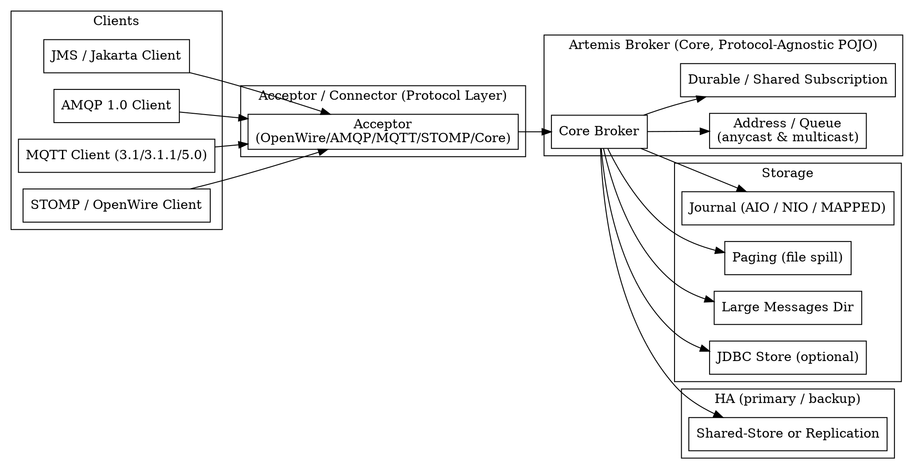

## Introduction

Apache ActiveMQ Artemis 是 ActiveMQ 项目的「下一代」消息代理（broker），其代码源自 JBoss HornetQ 捐赠。官方当前稳定版本为 **2.57.0，发布于 2026-09-09**（经 activemq.apache.org 新闻页与文档 latest=2.57.0 核实；GitHub releases 页面未使用该功能，故以官网为准）。自 2.50.0 起 groupId 切换为 `org.apache.artemis`，并成为独立的 Apache Artemis 顶级项目（TLP）。

Artemis 本质是一个**协议无关（protocol-agnostic）**的 Core broker：broker 内部只处理 Core API 交互，JMS、AMQP、MQTT、STOMP、OpenWire 等协议由各自的协议层翻译到 Core。它是一款**以 JMS 为中心、协议极其丰富**的企业级消息中间件，面向 Java/Jakarta EE 生态、需要严格 JMS 语义与多种协议互操作的场景。

与常见对比项的差异：
- **vs Apache Kafka**：Kafka 是分布式日志（log）系统，以分区有序、拉取（pull）消费、高吞吐流式处理著称，原生无 JMS 概念与队列/主题语义；Artemis 是传统 broker，支持丰富的协议与 JMS 目的地语义、服务端推送、事务与按需持久化，吞吐通常低于 Kafka 但协议/语义更完整。
- **vs RocketMQ**：RocketMQ 源自阿里、面向极致吞吐与万亿级消息，其「队列」模型与 JMS 模型不同，且强调削峰填谷与事务消息；Artemis 更偏标准 JMS/多协议互操作。
- **vs Pulsar**：Pulsar 采用存储（BookKeeper）与计算分离的架构、原生多租户与分层存储；Artemis 为单体 broker + 本地/共享存储，架构更轻量。

> 与 ActiveMQ Classic（原 5.x）的关系：两者并存且均长期维护。Classic 基于 KahaDB/LevelDB，Artemis 基于自研高性能 journal。Artemis 并非 Classic 的「替代品」，二者用户群与开发者基本不重叠（经 Apache 董事会纪要核实）。

## Architecture

Artemis broker 被设计为一组 Plain Old Java Objects（POJOs），可独立运行、嵌入应用或与 Java/Jakarta EE 应用服务器通过 JCA 适配器集成（供 MDB 消费消息）。每个 broker 拥有自己的**高性能持久化 journal**。

- **Acceptor**：服务端监听入口，绑定端口并启用协议（`protocols=AMQP,MQTT` 等；省略则启用全部协议）。每个协议模块在启动时由 classpath 加载。
- **Connector**：客户端侧连接配置（transport 参数如 `tcp://host:port?...`）。
- **地址与队列（Address / Queue）**：Artemis 以 Address 为路由单位，支持 `ANYCAST`（对应队列/点对点）与 `MULTICAST`（对应主题/发布订阅）两种路由类型。
- **Journal / Paging / Swapping**：消息主通道为 journal；当内存不足时触发 **paging**（换出到磁盘分页区），属应急溢出机制；**large messages** 则存储于 journal 之外的独立目录（详见 Storage）。

## Protocol Support

Artemis 以「协议丰富、JMS 为中心」著称，开箱内置 5 个协议模块（经 protocols-interoperability 文档核实）：

- **AMQP 1.0**：任意支持 AMQP 1.0 规范的客户端均可互通。
- **OpenWire**：兼容 ActiveMQ 5.12.x+ 的 OpenWire JMS 客户端（便于从 Classic 迁移）。
- **MQTT**：支持 3.1、3.1.1、5.0 规范。
- **STOMP**：支持 1.0、1.1、1.2 规范。
- **Core**：Artemis 自带线协议，JMS/Jakarta 客户端均构建于 Core 协议之上；另支持遗留 **HornetQ** 客户端协议。
- **JMS / Jakarta Messaging**：客户端 API 兼容 **JMS 2.0** 与 **Jakarta Messaging 2.0 / 3.1**（包名 `jakarta` 取代 `javax`）；JMS 1.1 的明确支持**未查到**（文档以 2.0 为主）。需注意：broker 不「理解」JMS，JMS 语义由客户端 facade 层翻译为 Core 操作。

## Storage

持久化默认采用**文件 journal**（仅追加 append-only，由固定大小文件组成，写满切换，配合压缩/GC 复用），提供三种实现（经 persistence 文档核实）：

- **AIO（Linux 异步 IO）**：通过 libaio 的轻量 JNI，性能通常最优；条件不满足时自动回退 NIO。
- **NIO（Java 标准）**：跨平台，兼容性最好。
- **MAPPED（内存映射）**：READ_WRITE 内存映射，近乎零拷贝。

broker 使用两个 journal 实例：**Bindings Journal**（队列绑定/属性，固定 NIO，1MB）与 **Message Journal**（消息与去重缓存，默认 AIO 回退 NIO，默认 10MiB，路径 `data/journal`，前缀 `activemq-data`）。

- **JDBC Store**：将 broker 状态存入数据库（PostgreSQL、MySQL、MSSQL、Oracle、DB2、Derby），官方推荐仍以文件 journal 性能最高，JDBC 在分页与大消息上明显较弱。
- **Paging（文件分页）**：内存紧张时把消息换出到磁盘分页区，是 journal 之外的辅助溢出机制。
- **Large Messages**：超过 `minLargeMessageSize`（Core 默认 100KiB，AMQP 经 `amqpMinLargeMessageSize` 默认 102400）的消息不进 message journal，仅在队列保留瘦对象 + 磁盘引用（默认目录 `data/largemessages`）；支持 ZIP 压缩与流式收发。设为 -1 可禁用。
- 零持久化：`persistence-enabled=false` 时所有数据不落盘。

## Delivery Semantics

JMS 标准三种确认模式：**AUTO_ACKNOWLEDGE、CLIENT_ACKNOWLEDGE、DUPS_OK_ACKNOWLEDGE**；Artemis 额外提供 **PRE_ACKNOWLEDGE**（服务端投递前即确认，失败会丢消息且丧失事务语义）与 **INDIVIDUAL_ACKNOWLEDGE**（逐条确认，MDB 不支持）。

- **At-least-once（至少一次）**：默认由客户端确认机制保证，故障重投可能导致重复消费。
- **Exactly-once（精确一次）**：仅靠 **XA 事务**实现；或通过 **Duplicate Detection**（去重）达到「once and only once」——发送端设置 `_AMQ_DUPL_ID`（`HDR_DUPLICATE_DETECTION_ID`）唯一属性，broker 维护按地址的循环去重缓存（默认 `id-cache-size=20000`，默认持久化 `persist-id-cache=true`），重复消息被直接丢弃。文档明确：去重 + 事务重试可提供与 XA 同级的精确一次保证，且开销更低。

## Consumption Model

基于 JMS 目的地语义：

- **Queue（队列 / ANYCAST）**：点对点，多消费者竞争（round-robin），消息仅被一个消费者消费一次。
- **Topic（主题 / MULTICAST）**：发布订阅，每条消息投递给所有订阅者。
- **Durable Subscription（持久订阅）**：订阅者离线期间消息不丢失，重连后继续消费。
- **Shared Subscription（JMS 2.0 共享订阅）**：多个消费者共享同一订阅、竞争消费，兼顾 pub/sub 与负载均衡。
- **Message Groups（消息分组）**：同一 `JMSXGroupID`（Core 为 `_AMQ_GROUP_ID`）的消息被「钉」到同一消费者，实现组内有序（见 Key Features）。

## Clustering and HA

HA 必须建立在 cluster 配置之上（经 ha 文档核实）。两种主备（primary/backup）模式：

- **Shared-Store（共享存储）**：主备共享同一完整数据目录（paging/journal/large messages/bindings），通常挂载 SAN/NFS。主故障释放文件锁，备获取锁并接管；天然防脑裂，无复制开销，但共享盘读延迟较高。
- **Replication（复制）**：主备各自本地盘，数据经网络安全同步。备需先全量同步方可完全可用；防脑裂依赖 **quorum voting** 或 **pluggable lock manager（如 ZooKeeper）**。若备未找到主，默认不单方面激活（避免数据不一致）。

两种模式均支持 `allow-failback` 回切。Core 客户端可感知主备并自动重连、重建 session/consumer（非 100% 无缝：故障前在途未落盘消息可能丢失）。

## Key Features

- **Message Groups**：通过 `JMSXGroupID` 将同组消息固定到同一消费者，保证组内顺序处理；支持分组 rebalance、group buckets（有界内存、`-1` 为默认不限制）、集群分组（但不推荐，因有序与水平扩展本质冲突）。
- **Scheduled Messages（延时消息）**：发送前设置属性 `_AMQ_SCHED_DELIVERY`（`HDR_SCHEDULED_DELIVERY_TIME`）为未来毫秒时间戳，到点前不投递；JMS 也可用 `JMSDeliveryTime`。
- **Large Messages**：超阈值消息存于 journal 外目录，支持流式收发与压缩，避免占满内存。

其他特性（经新闻/文档核实，未逐一展开）：AMQP Broker Connections Mirroring（数据中心迁移/容灾）、OIDC 支持、Lock Coordinator、Web Console（HawtIO/PatternFly）。

## Pitfalls

- **Artemis 与 Classic 混淆**：二者长期并存、并非替代关系；Classic 用 KahaDB/OpenWire 为主，Artemis 用自研 journal、默认端口/协议配置不同，迁移时不要混用客户端与配置。
- **顺序性误区**：Artemis 仅保证单队列 FIFO 与消息组内有序，**不提供全局跨队列顺序**；消息分组与集群水平扩展本质冲突，集群分组官方不推荐。
- **持久化配置陷阱**：默认 `journal-sync-transactional/non-transactional=true` 才保证电源故障持久化；改 NIO/MAPPED 或关闭 `journal-datasync` 会牺牲可靠性换取性能。JDBC 后端在分页与大消息上性能明显弱于文件 journal。
- **PRE_ACKNOWLEDGE 陷阱**：服务端投递前即确认，崩溃会丢消息且**丧失消费端事务语义**。
- **Exactly-once 误解**：普通 Client Ack 只能做到 at-least-once；没有 XA 或去重 ID 就不会有精确一次。
- **HA 脑裂**：Replication 模式必须配合 quorum/lock manager，否则备节点可能误激活。

## Links

- [MQ 总纲](/docs/CS/MQ/MQ.md)
- [消息代理与数据库的对比](/docs/CS/MQ/MQ.md?id=message-brokers)
- [RabbitMQ（同为AMQP 系JMS 之外的轻量选择）](/docs/CS/MQ/RabbitMQ.md)
- [Kafka（ActiveMQ Artemis 之于 RocketMQ 的角色类比）](/docs/CS/MQ/Kafka/Kafka.md)
- [CS 主题总纲](/docs/CS/CS.md)

## References
1. Apache ActiveMQ Artemis 官网：https://activemq.apache.org/components/artemis/
2. Artemis 下载/版本页：https://activemq.apache.org/components/artemis/download
3. Architecture 文档：https://activemq.apache.org/components/artemis/documentation/latest/architecture.html
4. Protocols & Interoperability：https://activemq.apache.org/components/artemis/documentation/latest/protocols-interoperability.html
5. Persistence 文档：https://activemq.apache.org/components/artemis/documentation/latest/persistence.html
6. HA 文档：https://activemq.apache.org/components/artemis/documentation/latest/ha.html
7. Duplicate Detection：https://activemq.apache.org/components/artemis/documentation/latest/duplicate-detection.html
8. Message Grouping：https://activemq.apache.org/components/artemis/documentation/latest/message-grouping.html
9. Scheduled Messages：https://activemq.apache.org/components/artemis/documentation/latest/scheduled-messages.html
10. Large Messages：https://activemq.apache.org/components/artemis/documentation/latest/large-messages.html
11. GitHub 仓库：https://github.com/apache/activemq-artemis
