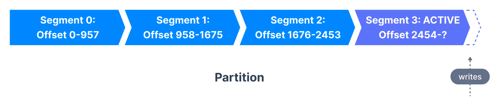
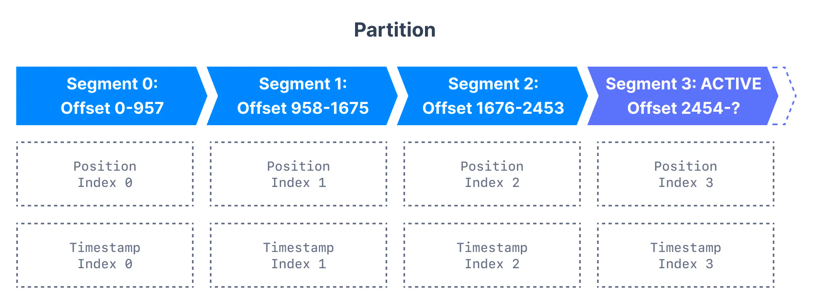
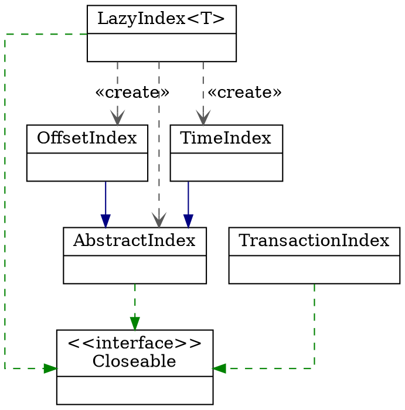

## Introduction

A single Kafka server is called a `broker`.
The broker receives messages from producers, assigns offsets to them, and commits the messages to storage on disk.
It also services consumers, responding to fetch requests for partitions and responding with the messages that have been committed to disk.

Kafka brokers are designed to operate as part of a cluster.
Within a cluster of brokers, one broker will also function as the cluster controller (elected automatically from the live members of the cluster).
The controller is responsible for administrative operations, including assigning partitions to brokers and monitoring for broker failures.
A partition is owned by a single broker in the cluster, and that broker is called the leader of the partition.
A partition may be assigned to multiple brokers, which will result in the partition being replicated.
This provides redundancy of messages in the partition, such that another broker can take over leadership if there is a broker failure.
However, all consumers and producers operating on that partition must connect to the leader.


| NAME                            | DESCRIPTION                                                                                                                                                         | TYPE | DEFAULT             | VALID VALUES | IMPORTANCE |
| ------------------------------- | ------------------------------------------------------------------------------------------------------------------------------------------------------------------- | ---- | ------------------- | ------------ | ---------- |
| log.flush.interval.messages     | The number of messages accumulated on a log partition before messages are flushed to disk                                                                           | long | 9223372036854775807 | [1,...]      | high       |
| log.flush.interval.ms           | The maximum time in ms that a message in any topic is kept in memory before flushed to disk. <br />If not set, the value in log.flush.scheduler.interval.ms is used | long | null                |              | high       |
| log.flush.scheduler.interval.ms | The frequency in ms that the log flusher checks whether any log needs to be flushed to disk                                                                         | long | 9223372036854775807 |              | high       |

```scala
private def append(...): LogAppendInfo = {
      // ...
      lock synchronized {
        // ...
        if (localLog.unflushedMessages >= config.flushInterval) 
          flush(false)
        appendInfo
        }
  }
```

```scala
private def append(...): LogAppendInfo = {
      // ...
      lock synchronized {
        // ...
        // Append the records, and increment the local log end offset immediately after the append because a
        // write to the transaction index below may fail and we want to ensure that the offsets
        // of future appends still grow monotonically. The resulting transaction index inconsistency
        // will be cleaned up after the log directory is recovered. Note that the end offset of the
        // ProducerStateManager will not be updated and the last stable offset will not advance
        // if the append to the transaction index fails.
        localLog.append(appendInfo.lastOffset, appendInfo.maxTimestamp, appendInfo.offsetOfMaxTimestamp, validRecords)
        // ...
        }
  }
// FileRecords
public int append(MemoryRecords records) throws IOException {
  if (records.sizeInBytes() > Integer.MAX_VALUE - size.get())
    throw new IllegalArgumentException("Append of size " + records.sizeInBytes() +
            " bytes is too large for segment with current file position at " + size.get());

  int written = records.writeFullyTo(channel);
  size.getAndAdd(written);
  return written;
}

// MemoryRecords
public int writeFullyTo(GatheringByteChannel channel) throws IOException {
  buffer.mark();
  int written = 0;
  while (written < sizeInBytes())
    written += channel.write(buffer);
  buffer.reset();
  return written;
}
```

## Structure

- kafkaScheduler
- socketServer
  - Acceptor
  - Processor
  - KafkaRequestHandler
- replicaManager
- kafkaController
- groupCoordinator
- transactionCoordinator
- dynamicConfigManager
- quotaManagers
- logManager

```scala
object Kafka extends Logging {
  def main(args: Array[String]): Unit = {
    try {
      val serverProps = getPropsFromArgs(args)
      val server = buildServer(serverProps)

      try {
        if (!OperatingSystem.IS_WINDOWS && !Java.isIbmJdk)
          new LoggingSignalHandler().register()
      } catch {
        case e: ReflectiveOperationException =>
          warn("Failed to register optional signal handler that logs a message when the process is terminated " +
            s"by a signal. Reason for registration failure is: $e", e)
      }

      // attach shutdown handler to catch terminating signals as well as normal termination
      Exit.addShutdownHook("kafka-shutdown-hook", {
        try server.shutdown()
        catch {
          case _: Throwable =>
            fatal("Halting Kafka.")
            // Calling exit() can lead to deadlock as exit() can be called multiple times. Force exit.
            Exit.halt(1)
        }
      })

      try server.startup()
      catch {
        case e: Throwable =>
          // KafkaServer.startup() calls shutdown() in case of exceptions, so we invoke `exit` to set the status code
          fatal("Exiting Kafka due to fatal exception during startup.", e)
          Exit.exit(1)
      }

      server.awaitShutdown()
    }
    catch {
      case e: Throwable =>
        fatal("Exiting Kafka due to fatal exception", e)
        Exit.exit(1)
    }
    Exit.exit(0)
  }

  private def buildServer(props: Properties): Server = {
    val config = KafkaConfig.fromProps(props, false)
    if (config.requiresZookeeper) {
      new KafkaServer(
        config,
        Time.SYSTEM,
        threadNamePrefix = None,
        enableForwarding = false
      )
    } else {
      new KafkaRaftServer(
        config,
        Time.SYSTEM,
        threadNamePrefix = None
      )
    }
  }
}
```

Raft

```scala
class KafkaRaftServer(
                       config: KafkaConfig,
                       time: Time,
                       threadNamePrefix: Option[String]
                     ) extends Server with Logging {
  override def startup(): Unit = {
    Mx4jLoader.maybeLoad()
    // Note that we startup `RaftManager` first so that the controller and broker
    // can register listeners during initialization.
    raftManager.startup()
    controller.foreach(_.startup())
    broker.foreach(_.startup())
    AppInfoParser.registerAppInfo(Server.MetricsPrefix, config.brokerId.toString, metrics, time.milliseconds())
    info(KafkaBroker.STARTED_MESSAGE)
  }
}
```

Server

```scala
class KafkaServer(
                   val config: KafkaConfig,
                   time: Time = Time.SYSTEM,
                   threadNamePrefix: Option[String] = None,
                   enableForwarding: Boolean = false
                 ) extends KafkaBroker with Server {
  override def startup(): Unit = {
    try {
      info("starting")

      if (isShuttingDown.get)
        throw new IllegalStateException("Kafka server is still shutting down, cannot re-start!")

      if (startupComplete.get)
        return

      val canStartup = isStartingUp.compareAndSet(false, true)
      if (canStartup) {
        _brokerState = BrokerState.STARTING

        /* setup zookeeper */
        initZkClient(time)
        configRepository = new ZkConfigRepository(new AdminZkClient(zkClient))

        /* Get or create cluster_id */
        _clusterId = getOrGenerateClusterId(zkClient)
        info(s"Cluster ID = $clusterId")

        /* load metadata */
        val (preloadedBrokerMetadataCheckpoint, initialOfflineDirs) =
          BrokerMetadataCheckpoint.getBrokerMetadataAndOfflineDirs(config.logDirs, ignoreMissing = true)

        if (preloadedBrokerMetadataCheckpoint.version != 0) {
          throw new RuntimeException(s"Found unexpected version in loaded `meta.properties`: " +
                  s"$preloadedBrokerMetadataCheckpoint. Zk-based brokers only support version 0 " +
                  "(which is implicit when the `version` field is missing).")
        }

        /* check cluster id */
        if (preloadedBrokerMetadataCheckpoint.clusterId.isDefined && preloadedBrokerMetadataCheckpoint.clusterId.get != clusterId)
          throw new InconsistentClusterIdException(
            s"The Cluster ID $clusterId doesn't match stored clusterId ${preloadedBrokerMetadataCheckpoint.clusterId} in meta.properties. " +
                    s"The broker is trying to join the wrong cluster. Configured zookeeper.connect may be wrong.")

        /* generate brokerId */
        config.brokerId = getOrGenerateBrokerId(preloadedBrokerMetadataCheckpoint)
        logContext = new LogContext(s"[KafkaServer id=${config.brokerId}] ")
        this.logIdent = logContext.logPrefix

        // initialize dynamic broker configs from ZooKeeper. Any updates made after this will be
        // applied after ZkConfigManager starts.
        config.dynamicConfig.initialize(Some(zkClient))

        /* start scheduler */
        kafkaScheduler = new KafkaScheduler(config.backgroundThreads)
        kafkaScheduler.startup()

        /* create and configure metrics */
        kafkaYammerMetrics = KafkaYammerMetrics.INSTANCE
        kafkaYammerMetrics.configure(config.originals)
        metrics = Server.initializeMetrics(config, time, clusterId)

        /* register broker metrics */
        _brokerTopicStats = new BrokerTopicStats

        quotaManagers = QuotaFactory.instantiate(config, metrics, time, threadNamePrefix.getOrElse(""))
        KafkaBroker.notifyClusterListeners(clusterId, kafkaMetricsReporters ++ metrics.reporters.asScala)

        logDirFailureChannel = new LogDirFailureChannel(config.logDirs.size)

        /* start log manager */
        _logManager = LogManager(
          config,
          initialOfflineDirs,
          configRepository,
          kafkaScheduler,
          time,
          brokerTopicStats,
          logDirFailureChannel,
          config.usesTopicId)
        _brokerState = BrokerState.RECOVERY
        logManager.startup(zkClient.getAllTopicsInCluster())

        metadataCache = MetadataCache.zkMetadataCache(config.brokerId, config.interBrokerProtocolVersion, brokerFeatures)
        val controllerNodeProvider = MetadataCacheControllerNodeProvider(config, metadataCache)

        /* initialize feature change listener */
        _featureChangeListener = new FinalizedFeatureChangeListener(metadataCache, _zkClient)
        if (config.isFeatureVersioningSupported) {
          _featureChangeListener.initOrThrow(config.zkConnectionTimeoutMs)
        }

        // Enable delegation token cache for all SCRAM mechanisms to simplify dynamic update.
        // This keeps the cache up-to-date if new SCRAM mechanisms are enabled dynamically.
        tokenCache = new DelegationTokenCache(ScramMechanism.mechanismNames)
        credentialProvider = new CredentialProvider(ScramMechanism.mechanismNames, tokenCache)

        clientToControllerChannelManager = BrokerToControllerChannelManager(
          controllerNodeProvider = controllerNodeProvider,
          time = time,
          metrics = metrics,
          config = config,
          channelName = "forwarding",
          threadNamePrefix = threadNamePrefix,
          retryTimeoutMs = config.requestTimeoutMs.longValue
        )
        clientToControllerChannelManager.start()

        /* start forwarding manager */
        var autoTopicCreationChannel = Option.empty[BrokerToControllerChannelManager]
        if (enableForwarding) {
          this.forwardingManager = Some(ForwardingManager(clientToControllerChannelManager))
          autoTopicCreationChannel = Some(clientToControllerChannelManager)
        }

        val apiVersionManager = ApiVersionManager(
          ListenerType.ZK_BROKER,
          config,
          forwardingManager,
          brokerFeatures,
          metadataCache
        )
      }
    }
  }
}
```

### SocketServer

Handles new connections, requests and responses to and from broker. 
Kafka supports two types of request planes :
- data-plane :
  - Handles requests from clients and other brokers in the cluster.
  - The threading model is 1 Acceptor thread per listener, that handles new connections. It is possible to configure multiple data-planes by specifying multiple "," separated endpoints for "listeners" in KafkaConfig. Acceptor has N Processor threads that each have their own selector and read requests from sockets M Handler threads that handle requests and produce responses back to the processor threads for writing.
- control-plane :
  - Handles requests from controller. This is optional and can be configured by specifying "control.plane.listener.name". If not configured, the controller requests are handled by the data-plane.
  - The threading model is 1 Acceptor thread that handles new connections Acceptor has 1 Processor thread that has its own selector and read requests from the socket. 1 Handler thread that handles requests and produces responses back to the processor thread for writing.


Create and start the socket server acceptor threads so that the bound port is known.
Delay starting processors until the end of the initialization sequence to ensure that credentials have been loaded before processing authentications.

Note that we allow the use of KRaft mode controller APIs when forwarding is enabled so that the Envelope request is exposed. This is only used in testing currently.

num.network.threads 3
num.io.threads 8

请求队列是所有网络线程共享的，而响应队列则是每个网络线程专属的

Purgatory

数据类请求和控制类请求的分离


```scala
        socketServer = new SocketServer(config, metrics, time, credentialProvider, apiVersionManager)

        // Start alter partition manager based on the IBP version
        alterPartitionManager = if (config.interBrokerProtocolVersion.isAlterPartitionSupported) {
          AlterPartitionManager(
            config = config,
            metadataCache = metadataCache,
            scheduler = kafkaScheduler,
            controllerNodeProvider,
            time = time,
            metrics = metrics,
            threadNamePrefix = threadNamePrefix,
            brokerEpochSupplier = () => kafkaController.brokerEpoch
          )
        } else {
          AlterPartitionManager(kafkaScheduler, time, zkClient)
        }
        alterPartitionManager.start()

        // Start replica manager
        _replicaManager = createReplicaManager(isShuttingDown)
        replicaManager.startup()

        val brokerInfo = createBrokerInfo
        val brokerEpoch = zkClient.registerBroker(brokerInfo)

        // Now that the broker is successfully registered, checkpoint its metadata
        checkpointBrokerMetadata(ZkMetaProperties(clusterId, config.brokerId))

        /* start token manager */
        tokenManager = new DelegationTokenManager(config, tokenCache, time, zkClient)
        tokenManager.startup()

        /* start kafka controller */
        _kafkaController = new KafkaController(config, zkClient, time, metrics, brokerInfo, brokerEpoch, tokenManager, brokerFeatures, metadataCache, threadNamePrefix)
        kafkaController.startup()

        adminManager = new ZkAdminManager(config, metrics, metadataCache, zkClient)

        /* start group coordinator */
        // Hardcode Time.SYSTEM for now as some Streams tests fail otherwise, it would be good to fix the underlying issue
        groupCoordinator = GroupCoordinator(config, replicaManager, Time.SYSTEM, metrics)
        groupCoordinator.startup(() => zkClient.getTopicPartitionCount(Topic.GROUP_METADATA_TOPIC_NAME).getOrElse(config.offsetsTopicPartitions))

        /* create producer ids manager */
        val producerIdManager = if (config.interBrokerProtocolVersion.isAllocateProducerIdsSupported) {
          ProducerIdManager.rpc(
            config.brokerId,
            brokerEpochSupplier = () => kafkaController.brokerEpoch,
            clientToControllerChannelManager,
            config.requestTimeoutMs
          )
        } else {
          ProducerIdManager.zk(config.brokerId, zkClient)
        }
        /* start transaction coordinator, with a separate background thread scheduler for transaction expiration and log loading */
        // Hardcode Time.SYSTEM for now as some Streams tests fail otherwise, it would be good to fix the underlying issue
        transactionCoordinator = TransactionCoordinator(config, replicaManager, new KafkaScheduler(threads = 1, threadNamePrefix = "transaction-log-manager-"),
          () => producerIdManager, metrics, metadataCache, Time.SYSTEM)
        transactionCoordinator.startup(
          () => zkClient.getTopicPartitionCount(Topic.TRANSACTION_STATE_TOPIC_NAME).getOrElse(config.transactionTopicPartitions))

        /* start auto topic creation manager */
        this.autoTopicCreationManager = AutoTopicCreationManager(
          config,
          metadataCache,
          threadNamePrefix,
          autoTopicCreationChannel,
          Some(adminManager),
          Some(kafkaController),
          groupCoordinator,
          transactionCoordinator
        )

        /* Get the authorizer and initialize it if one is specified.*/
        authorizer = config.createNewAuthorizer()
        authorizer.foreach(_.configure(config.originals))
        val authorizerFutures: Map[Endpoint, CompletableFuture[Void]] = authorizer match {
          case Some(authZ) =>
            authZ.start(brokerInfo.broker.toServerInfo(clusterId, config)).asScala.map { case (ep, cs) =>
              ep -> cs.toCompletableFuture
            }
          case None =>
            brokerInfo.broker.endPoints.map { ep =>
              ep.toJava -> CompletableFuture.completedFuture[Void](null)
            }.toMap
        }

        val fetchManager = new FetchManager(Time.SYSTEM,
          new FetchSessionCache(config.maxIncrementalFetchSessionCacheSlots,
            KafkaServer.MIN_INCREMENTAL_FETCH_SESSION_EVICTION_MS))

        /* start processing requests */
        val zkSupport = ZkSupport(adminManager, kafkaController, zkClient, forwardingManager, metadataCache)

        def createKafkaApis(requestChannel: RequestChannel): KafkaApis = new KafkaApis(
          requestChannel = requestChannel,
          metadataSupport = zkSupport,
          replicaManager = replicaManager,
          groupCoordinator = groupCoordinator,
          txnCoordinator = transactionCoordinator,
          autoTopicCreationManager = autoTopicCreationManager,
          brokerId = config.brokerId,
          config = config,
          configRepository = configRepository,
          metadataCache = metadataCache,
          metrics = metrics,
          authorizer = authorizer,
          quotas = quotaManagers,
          fetchManager = fetchManager,
          brokerTopicStats = brokerTopicStats,
          clusterId = clusterId,
          time = time,
          tokenManager = tokenManager,
          apiVersionManager = apiVersionManager)

        dataPlaneRequestProcessor = createKafkaApis(socketServer.dataPlaneRequestChannel)

        dataPlaneRequestHandlerPool = new KafkaRequestHandlerPool(config.brokerId, socketServer.dataPlaneRequestChannel, dataPlaneRequestProcessor, time,
          config.numIoThreads, s"${DataPlaneAcceptor.MetricPrefix}RequestHandlerAvgIdlePercent", DataPlaneAcceptor.ThreadPrefix)

        socketServer.controlPlaneRequestChannelOpt.foreach { controlPlaneRequestChannel =>
          controlPlaneRequestProcessor = createKafkaApis(controlPlaneRequestChannel)
          controlPlaneRequestHandlerPool = new KafkaRequestHandlerPool(config.brokerId, socketServer.controlPlaneRequestChannelOpt.get, controlPlaneRequestProcessor, time,
            1, s"${ControlPlaneAcceptor.MetricPrefix}RequestHandlerAvgIdlePercent", ControlPlaneAcceptor.ThreadPrefix)
        }

        Mx4jLoader.maybeLoad()

        /* Add all reconfigurables for config change notification before starting config handlers */
        config.dynamicConfig.addReconfigurables(this)
        Option(logManager.cleaner).foreach(config.dynamicConfig.addBrokerReconfigurable)

        /* start dynamic config manager */
        dynamicConfigHandlers = Map[String, ConfigHandler](ConfigType.Topic -> new TopicConfigHandler(logManager, config, quotaManagers, Some(kafkaController)),
          ConfigType.Client -> new ClientIdConfigHandler(quotaManagers),
          ConfigType.User -> new UserConfigHandler(quotaManagers, credentialProvider),
          ConfigType.Broker -> new BrokerConfigHandler(config, quotaManagers),
          ConfigType.Ip -> new IpConfigHandler(socketServer.connectionQuotas))

        // Create the config manager. start listening to notifications
        dynamicConfigManager = new ZkConfigManager(zkClient, dynamicConfigHandlers)
        dynamicConfigManager.startup()

        socketServer.enableRequestProcessing(authorizerFutures)

        _brokerState = BrokerState.RUNNING
        shutdownLatch = new CountDownLatch(1)
        startupComplete.set(true)
        isStartingUp.set(false)
        AppInfoParser.registerAppInfo(Server.MetricsPrefix, config.brokerId.toString, metrics, time.milliseconds())
        info("started")
      }
    }
    catch {
      case e: Throwable =>
        fatal("Fatal error during KafkaServer startup. Prepare to shutdown", e)
        isStartingUp.set(false)
        shutdown()
        throw e
    }
  }
}
```

Processor#run

```scala

  override def run(): Unit = {
    try {
      while (shouldRun.get()) {
        try {
          // setup any new connections that have been queued up
          configureNewConnections()
          // register any new responses for writing
          processNewResponses()
          poll()
          processCompletedReceives()
          processCompletedSends()
          processDisconnected()
          closeExcessConnections()
        } catch {
          // We catch all the throwables here to prevent the processor thread from exiting. We do this because
          // letting a processor exit might cause a bigger impact on the broker. This behavior might need to be
          // reviewed if we see an exception that needs the entire broker to stop. Usually the exceptions thrown would
          // be either associated with a specific socket channel or a bad request. These exceptions are caught and
          // processed by the individual methods above which close the failing channel and continue processing other
          // channels. So this catch block should only ever see ControlThrowables.
          case e: Throwable => processException("Processor got uncaught exception.", e)
        }
      }
    } finally {
      debug(s"Closing selector - processor $id")
      CoreUtils.swallow(closeAll(), this, Level.ERROR)
    }
  }

```

### createTopics

ZkAdminManager#createTopics

Create topics and wait until the topics have been completely created.
The callback function will be triggered either when timeout, error or the topics are created.

```scala
  def createTopics(timeout: Int,
                   validateOnly: Boolean,
                   toCreate: Map[String, CreatableTopic],
                   includeConfigsAndMetadata: Map[String, CreatableTopicResult],
                   controllerMutationQuota: ControllerMutationQuota,
                   responseCallback: Map[String, ApiError] => Unit): Unit = {

    // 1. map over topics creating assignment and calling zookeeper
    val brokers = metadataCache.getAliveBrokers()
    val metadata = toCreate.values.map(topic =>
      try {
        if (metadataCache.contains(topic.name))
          throw new TopicExistsException(s"Topic '${topic.name}' already exists.")

        val nullConfigs = topic.configs.asScala.filter(_.value == null).map(_.name)
        if (nullConfigs.nonEmpty)
          throw new InvalidConfigurationException(s"Null value not supported for topic configs: ${nullConfigs.mkString(",")}")

        if ((topic.numPartitions != NO_NUM_PARTITIONS || topic.replicationFactor != NO_REPLICATION_FACTOR)
            && !topic.assignments().isEmpty) {
          throw new InvalidRequestException("Both numPartitions or replicationFactor and replicasAssignments were set. " +
            "Both cannot be used at the same time.")
        }

        val resolvedNumPartitions = if (topic.numPartitions == NO_NUM_PARTITIONS)
          defaultNumPartitions else topic.numPartitions
        val resolvedReplicationFactor = if (topic.replicationFactor == NO_REPLICATION_FACTOR)
          defaultReplicationFactor else topic.replicationFactor

        val assignments = if (topic.assignments.isEmpty) {
          AdminUtils.assignReplicasToBrokers(
            brokers, resolvedNumPartitions, resolvedReplicationFactor)
        } else {
          val assignments = new mutable.HashMap[Int, Seq[Int]]
          // Note: we don't check that replicaAssignment contains unknown brokers - unlike in add-partitions case,
          // this follows the existing logic in TopicCommand
          topic.assignments.forEach { assignment =>
            assignments(assignment.partitionIndex) = assignment.brokerIds.asScala.map(a => a: Int)
          }
          assignments
        }
        trace(s"Assignments for topic $topic are $assignments ")

        val configs = new Properties()
        topic.configs.forEach(entry => configs.setProperty(entry.name, entry.value))
        adminZkClient.validateTopicCreate(topic.name, assignments, configs)
        validateTopicCreatePolicy(topic, resolvedNumPartitions, resolvedReplicationFactor, assignments)

        // For responses with DescribeConfigs permission, populate metadata and configs. It is
        // safe to populate it before creating the topic because the values are unset if the
        // creation fails.
        maybePopulateMetadataAndConfigs(includeConfigsAndMetadata, topic.name, configs, assignments)

        if (validateOnly) {
          CreatePartitionsMetadata(topic.name, assignments.keySet)
        } else {
          controllerMutationQuota.record(assignments.size)
          adminZkClient.createTopicWithAssignment(topic.name, configs, assignments, validate = false, config.usesTopicId)
          populateIds(includeConfigsAndMetadata, topic.name)
          CreatePartitionsMetadata(topic.name, assignments.keySet)
        }
      } catch {
        // Log client errors at a lower level than unexpected exceptions
        case e: Exceptions =>
          CreatePartitionsMetadata(topic.name, e)
      }).toBuffer

    // 2. if timeout <= 0, validateOnly or no topics can proceed return immediately
    if (timeout <= 0 || validateOnly || !metadata.exists(_.error.is(Errors.NONE))) {
      val results = metadata.map { createTopicMetadata =>
        // ignore topics that already have errors
        if (createTopicMetadata.error.isSuccess && !validateOnly) {
          (createTopicMetadata.topic, new ApiError(Errors.REQUEST_TIMED_OUT, null))
        } else {
          (createTopicMetadata.topic, createTopicMetadata.error)
        }
      }.toMap
      responseCallback(results)
    } else {
      // 3. else pass the assignments and errors to the delayed operation and set the keys
      val delayedCreate = new DelayedCreatePartitions(timeout, metadata, this,
        responseCallback)
      val delayedCreateKeys = toCreate.values.map(topic => TopicKey(topic.name)).toBuffer
      // try to complete the request immediately, otherwise put it into the purgatory
      topicPurgatory.tryCompleteElseWatch(delayedCreate, delayedCreateKeys)
    }
  }
```

#### assignReplicasToBrokersRackAware

AdminUtils#assignReplicasToBrokersRackAware

```scala
  
  private def assignReplicasToBrokersRackAware(nPartitions: Int,
                                               replicationFactor: Int,
                                               brokerMetadatas: Iterable[BrokerMetadata],
                                               fixedStartIndex: Int,
                                               startPartitionId: Int): Map[Int, Seq[Int]] = {
    val brokerRackMap = brokerMetadatas.collect { case BrokerMetadata(id, Some(rack)) =>
      id -> rack
    }.toMap
    val numRacks = brokerRackMap.values.toSet.size
    val arrangedBrokerList = getRackAlternatedBrokerList(brokerRackMap)
    val numBrokers = arrangedBrokerList.size
    val ret = mutable.Map[Int, Seq[Int]]()
    val startIndex = if (fixedStartIndex >= 0) fixedStartIndex else rand.nextInt(arrangedBrokerList.size)
    var currentPartitionId = math.max(0, startPartitionId)
    var nextReplicaShift = if (fixedStartIndex >= 0) fixedStartIndex else rand.nextInt(arrangedBrokerList.size)
    for (_ <- 0 until nPartitions) {
      if (currentPartitionId > 0 && (currentPartitionId % arrangedBrokerList.size == 0))
        nextReplicaShift += 1
      val firstReplicaIndex = (currentPartitionId + startIndex) % arrangedBrokerList.size
      val leader = arrangedBrokerList(firstReplicaIndex)
      val replicaBuffer = mutable.ArrayBuffer(leader)
      val racksWithReplicas = mutable.Set(brokerRackMap(leader))
      val brokersWithReplicas = mutable.Set(leader)
      var k = 0
      for (_ <- 0 until replicationFactor - 1) {
        var done = false
        while (!done) {
          val broker = arrangedBrokerList(replicaIndex(firstReplicaIndex, nextReplicaShift * numRacks, k, arrangedBrokerList.size))
          val rack = brokerRackMap(broker)
          // Skip this broker if
          // 1. there is already a broker in the same rack that has assigned a replica AND there is one or more racks
          //    that do not have any replica, or
          // 2. the broker has already assigned a replica AND there is one or more brokers that do not have replica assigned
          if ((!racksWithReplicas.contains(rack) || racksWithReplicas.size == numRacks)
              && (!brokersWithReplicas.contains(broker) || brokersWithReplicas.size == numBrokers)) {
            replicaBuffer += broker
            racksWithReplicas += rack
            brokersWithReplicas += broker
            done = true
          }
          k += 1
        }
      }
      ret.put(currentPartitionId, replicaBuffer)
      currentPartitionId += 1
    }
    ret
  }

```

replicaIndex

```scala
  private def replicaIndex(firstReplicaIndex: Int, secondReplicaShift: Int, replicaIndex: Int, nBrokers: Int): Int = {
    val shift = 1 + (secondReplicaShift + replicaIndex) % (nBrokers - 1)
    (firstReplicaIndex + shift) % nBrokers
  }
```

AdminZkClient

```scala
  def createTopic(topic: String,
                  partitions: Int,
                  replicationFactor: Int,
                  topicConfig: Properties = new Properties,
                  rackAwareMode: RackAwareMode = RackAwareMode.Enforced,
                  usesTopicId: Boolean = false): Unit = {
    val brokerMetadatas = getBrokerMetadatas(rackAwareMode)
    val replicaAssignment = AdminUtils.assignReplicasToBrokers(brokerMetadatas, partitions, replicationFactor)
    createTopicWithAssignment(topic, topicConfig, replicaAssignment, usesTopicId = usesTopicId)
  }
```

Create topic and optionally validate its parameters. Note that this method is used by the TopicCommand as well.

```scala
  def createTopicWithAssignment(topic: String,
                                config: Properties,
                                partitionReplicaAssignment: Map[Int, Seq[Int]],
                                validate: Boolean = true,
                                usesTopicId: Boolean = false): Unit = {
    if (validate)
      validateTopicCreate(topic, partitionReplicaAssignment, config)

    // write out the config if there is any, this isn't transactional with the partition assignments
    zkClient.setOrCreateEntityConfigs(ConfigType.Topic, topic, config)

    // create the partition assignment
    writeTopicPartitionAssignment(topic, partitionReplicaAssignment.map { case (k, v) => k -> ReplicaAssignment(v) },
      isUpdate = false, usesTopicId)
  }
```

## write

Kafka brokers splits each partition into segments.
Each segment is stored in a single data file on the disk attached to the broker.
By default, each segment contains either 1 GB of data or a week of data, whichever limit is attained first.
When the Kafka broker receives data for a partition, as the segment limit is reached, it will close the file and start a new one:

<div style="text-align: center;">



</div>

<p style="text-align: center;">
Fig.1. Topic Partitions & Segments
</p>

Only one segment is ACTIVE at any point in time - the one data is being written to.
A segment can only be deleted if it has been closed beforehand.
The size of a segment is controlled by two Broker configurations (which can be modified at the topic level too)

- log.segment.bytes: the max size of a single segment in bytes (default 1 GB)
  - A smaller segment size means that files must be closed and allocated more often, which reduces the overall efficiency of disk writes.
  - Once a segment has been closed, it can be considered for expiration.
    Adjusting the size of the segments can be important if topics have a low produce rate.
    Having a small segment size would mean Kafka has to keep a lot of files open which may lead to Too many open files error.
- log.segment.ms: the time Kafka will wait before committing the segment if not full (default 1 week)
  Kafka will close a segment either when the size limit is reached or when the time limit is reached, whichever comes first. log.segment.ms
  - When using a time-based segment limit, it is important to consider the impact on disk performance when multiple segments are closed simultaneously.
  - Decide if you want daily compaction instead of weekly

A Kafka broker keeps an open file handle to every segment in every partition - even inactive segments.
This leads to a usually high number of open file handles, and the OS must be tuned accordingly.

Kafka allows consumers to start fetching messages from any available offset. In order to help brokers quickly locate the message for a given offset, Kafka maintains two indexes for each segment:

- An offset to position index - It helps Kafka know what part of a segment to read to find a message
- A timestamp to offset index - It allows Kafka to find messages with a specific timestamp

<div style="text-align: center;">



</div>

<p style="text-align: center;">
Fig.2. Topic Segments and Indexes
</p>

Kafka stores all of its data in a directory on the broker disk. This directory is specified using the property log.dirs in the broker's configuration file.

### appendRecords

`request.required.acks` = 0  Send the response immediately.

```scala
  def handleProduceRequest(request: RequestChannel.Request, requestLocal: RequestLocal): Unit = {
    val produceRequest = request.body[ProduceRequest]
    val requestSize = request.sizeInBytes

    if (RequestUtils.hasTransactionalRecords(produceRequest)) {
      val isAuthorizedTransactional = produceRequest.transactionalId != null &&
        authHelper.authorize(request.context, WRITE, TRANSACTIONAL_ID, produceRequest.transactionalId)
      if (!isAuthorizedTransactional) {
        requestHelper.sendErrorResponseMaybeThrottle(request, Errors.TRANSACTIONAL_ID_AUTHORIZATION_FAILED.exception)
        return
      }
    }

    val unauthorizedTopicResponses = mutable.Map[TopicPartition, PartitionResponse]()
    val nonExistingTopicResponses = mutable.Map[TopicPartition, PartitionResponse]()
    val invalidRequestResponses = mutable.Map[TopicPartition, PartitionResponse]()
    val authorizedRequestInfo = mutable.Map[TopicPartition, MemoryRecords]()
    // cache the result to avoid redundant authorization calls
    val authorizedTopics = authHelper.filterByAuthorized(request.context, WRITE, TOPIC,
      produceRequest.data().topicData().asScala)(_.name())

    produceRequest.data.topicData.forEach(topic => topic.partitionData.forEach { partition =>
      val topicPartition = new TopicPartition(topic.name, partition.index)
      // This caller assumes the type is MemoryRecords and that is true on current serialization
      // We cast the type to avoid causing big change to code base.
      // https://issues.apache.org/jira/browse/KAFKA-10698
      val memoryRecords = partition.records.asInstanceOf[MemoryRecords]
      if (!authorizedTopics.contains(topicPartition.topic))
        unauthorizedTopicResponses += topicPartition -> new PartitionResponse(Errors.TOPIC_AUTHORIZATION_FAILED)
      else if (!metadataCache.contains(topicPartition))
        nonExistingTopicResponses += topicPartition -> new PartitionResponse(Errors.UNKNOWN_TOPIC_OR_PARTITION)
      else
        try {
          ProduceRequest.validateRecords(request.header.apiVersion, memoryRecords)
          authorizedRequestInfo += (topicPartition -> memoryRecords)
        } catch {
          case e: ApiException =>
            invalidRequestResponses += topicPartition -> new PartitionResponse(Errors.forException(e))
        }
    })

    // the callback for sending a produce response
    // The construction of ProduceResponse is able to accept auto-generated protocol data so
    // KafkaApis#handleProduceRequest should apply auto-generated protocol to avoid extra conversion.
    // https://issues.apache.org/jira/browse/KAFKA-10730
    @nowarn("cat=deprecation")
    def sendResponseCallback(responseStatus: Map[TopicPartition, PartitionResponse]): Unit = {
      val mergedResponseStatus = responseStatus ++ unauthorizedTopicResponses ++ nonExistingTopicResponses ++ invalidRequestResponses
      var errorInResponse = false

      mergedResponseStatus.forKeyValue { (topicPartition, status) =>
        if (status.error != Errors.NONE) {
          errorInResponse = true
          debug("Produce request with correlation id %d from client %s on partition %s failed due to %s".format(
            request.header.correlationId,
            request.header.clientId,
            topicPartition,
            status.error.exceptionName))
        }
      }

      // Record both bandwidth and request quota-specific values and throttle by muting the channel if any of the quotas
      // have been violated. If both quotas have been violated, use the max throttle time between the two quotas. Note
      // that the request quota is not enforced if acks == 0.
      val timeMs = time.milliseconds()
      val bandwidthThrottleTimeMs = quotas.produce.maybeRecordAndGetThrottleTimeMs(request, requestSize, timeMs)
      val requestThrottleTimeMs =
        if (produceRequest.acks == 0) 0
        else quotas.request.maybeRecordAndGetThrottleTimeMs(request, timeMs)
      val maxThrottleTimeMs = Math.max(bandwidthThrottleTimeMs, requestThrottleTimeMs)
      if (maxThrottleTimeMs > 0) {
        request.apiThrottleTimeMs = maxThrottleTimeMs
        if (bandwidthThrottleTimeMs > requestThrottleTimeMs) {
          requestHelper.throttle(quotas.produce, request, bandwidthThrottleTimeMs)
        } else {
          requestHelper.throttle(quotas.request, request, requestThrottleTimeMs)
        }
      }

      // Send the response immediately. In case of throttling, the channel has already been muted.
      if (produceRequest.acks == 0) {
        // no operation needed if producer request.required.acks = 0; however, if there is any error in handling
        // the request, since no response is expected by the producer, the server will close socket server so that
        // the producer client will know that some error has happened and will refresh its metadata
        if (errorInResponse) {
          val exceptionsSummary = mergedResponseStatus.map { case (topicPartition, status) =>
            topicPartition -> status.error.exceptionName
          }.mkString(", ")
          info(
            s"Closing connection due to error during produce request with correlation id ${request.header.correlationId} " +
              s"from client id ${request.header.clientId} with ack=0\n" +
              s"Topic and partition to exceptions: $exceptionsSummary"
          )
          requestChannel.closeConnection(request, new ProduceResponse(mergedResponseStatus.asJava).errorCounts)
        } else {
          // Note that although request throttling is exempt for acks == 0, the channel may be throttled due to
          // bandwidth quota violation.
          requestHelper.sendNoOpResponseExemptThrottle(request)
        }
      } else {
        requestChannel.sendResponse(request, new ProduceResponse(mergedResponseStatus.asJava, maxThrottleTimeMs), None)
      }
    }

    def processingStatsCallback(processingStats: FetchResponseStats): Unit = {
      processingStats.forKeyValue { (tp, info) =>
        updateRecordConversionStats(request, tp, info)
      }
    }

    if (authorizedRequestInfo.isEmpty)
      sendResponseCallback(Map.empty)
    else {
      val internalTopicsAllowed = request.header.clientId == AdminUtils.AdminClientId

      // call the replica manager to append messages to the replicas
      replicaManager.appendRecords(
        timeout = produceRequest.timeout.toLong,
        requiredAcks = produceRequest.acks,
        internalTopicsAllowed = internalTopicsAllowed,
        origin = AppendOrigin.Client,
        entriesPerPartition = authorizedRequestInfo,
        requestLocal = requestLocal,
        responseCallback = sendResponseCallback,
        recordConversionStatsCallback = processingStatsCallback)

      // if the request is put into the purgatory, it will have a held reference and hence cannot be garbage collected;
      // hence we clear its data here in order to let GC reclaim its memory since it is already appended to log
      produceRequest.clearPartitionRecords()
    }
  }
```

Append messages to leader replicas of the partition, and wait for them to be replicated to other replicas; the callback function will be triggered either when timeout or the required acks are satisfied;
if the callback function itself is already synchronized on some object then pass this object to avoid deadlock.
Noted that all pending [delayed](/docs/CS/MQ/Kafka/Broker.md?id=delay) check operations are stored in a queue.
All callers to ReplicaManager.appendRecords() are expected to call `ActionQueue.tryCompleteActions` for all affected partitions, without holding any conflicting locks.

```scala
  def appendRecords(timeout: Long,
                    requiredAcks: Short,
                    internalTopicsAllowed: Boolean,
                    origin: AppendOrigin,
                    entriesPerPartition: Map[TopicPartition, MemoryRecords],
                    responseCallback: Map[TopicPartition, PartitionResponse] => Unit,
                    delayedProduceLock: Option[Lock] = None,
                    recordConversionStatsCallback: Map[TopicPartition, RecordConversionStats] => Unit = _ => (),
                    requestLocal: RequestLocal = RequestLocal.NoCaching): Unit = {
    if (isValidRequiredAcks(requiredAcks)) {
      val sTime = time.milliseconds
      val localProduceResults = appendToLocalLog(internalTopicsAllowed = internalTopicsAllowed,
        origin, entriesPerPartition, requiredAcks, requestLocal)
      debug("Produce to local log in %d ms".format(time.milliseconds - sTime))

      val produceStatus = localProduceResults.map { case (topicPartition, result) =>
        topicPartition -> ProducePartitionStatus(
          result.info.lastOffset + 1, // required offset
          new PartitionResponse(
            result.error,
            result.info.firstOffset.map(_.messageOffset).getOrElse(-1),
            result.info.logAppendTime,
            result.info.logStartOffset,
            result.info.recordErrors.asJava,
            result.info.errorMessage
          )
        ) // response status
      }

      actionQueue.add {
        () =>
          localProduceResults.foreach {
            case (topicPartition, result) =>
              val requestKey = TopicPartitionOperationKey(topicPartition)
              result.info.leaderHwChange match {
                case LeaderHwChange.Increased =>
                  // some delayed operations may be unblocked after HW changed
                  delayedProducePurgatory.checkAndComplete(requestKey)
                  delayedFetchPurgatory.checkAndComplete(requestKey)
                  delayedDeleteRecordsPurgatory.checkAndComplete(requestKey)
                case LeaderHwChange.Same =>
                  // probably unblock some follower fetch requests since log end offset has been updated
                  delayedFetchPurgatory.checkAndComplete(requestKey)
                case LeaderHwChange.None =>
                  // nothing
              }
          }
      }

      recordConversionStatsCallback(localProduceResults.map { case (k, v) => k -> v.info.recordConversionStats })

      if (delayedProduceRequestRequired(requiredAcks, entriesPerPartition, localProduceResults)) {
        // create delayed produce operation
        val produceMetadata = ProduceMetadata(requiredAcks, produceStatus)
        val delayedProduce = new DelayedProduce(timeout, produceMetadata, this, responseCallback, delayedProduceLock)

        // create a list of (topic, partition) pairs to use as keys for this delayed produce operation
        val producerRequestKeys = entriesPerPartition.keys.map(TopicPartitionOperationKey(_)).toSeq

        // try to complete the request immediately, otherwise put it into the purgatory
        // this is because while the delayed produce operation is being created, new
        // requests may arrive and hence make this operation completable.
        delayedProducePurgatory.tryCompleteElseWatch(delayedProduce, producerRequestKeys)

      } else {
        // we can respond immediately
        val produceResponseStatus = produceStatus.map { case (k, status) => k -> status.responseStatus }
        responseCallback(produceResponseStatus)
      }
    } else {
      // If required.acks is outside accepted range, something is wrong with the client
      // Just return an error and don't handle the request at all
      val responseStatus = entriesPerPartition.map { case (topicPartition, _) =>
        topicPartition -> new PartitionResponse(
          Errors.INVALID_REQUIRED_ACKS,
          LogAppendInfo.UnknownLogAppendInfo.firstOffset.map(_.messageOffset).getOrElse(-1),
          RecordBatch.NO_TIMESTAMP,
          LogAppendInfo.UnknownLogAppendInfo.logStartOffset
        )
      }
      responseCallback(responseStatus)
    }
  }
```

#### appendToLocalLog

```scala
class ReplicaManager {
  private def appendToLocalLog(internalTopicsAllowed: Boolean,
                               origin: AppendOrigin,
                               entriesPerPartition: Map[TopicPartition, MemoryRecords],
                               requiredAcks: Short,
                               requestLocal: RequestLocal): Map[TopicPartition, LogAppendResult] = {
    val traceEnabled = isTraceEnabled

    def processFailedRecord(topicPartition: TopicPartition, t: Throwable) = {
      val logStartOffset = onlinePartition(topicPartition).map(_.logStartOffset).getOrElse(-1L)
      brokerTopicStats.topicStats(topicPartition.topic).failedProduceRequestRate.mark()
      brokerTopicStats.allTopicsStats.failedProduceRequestRate.mark()
      error(s"Error processing append operation on partition $topicPartition", t)

      logStartOffset
    }

    entriesPerPartition.map { case (topicPartition, records) =>
      brokerTopicStats.topicStats(topicPartition.topic).totalProduceRequestRate.mark()
      brokerTopicStats.allTopicsStats.totalProduceRequestRate.mark()

      // reject appending to internal topics if it is not allowed
      if (Topic.isInternal(topicPartition.topic) && !internalTopicsAllowed) {
        (topicPartition, LogAppendResult(
          LogAppendInfo.UnknownLogAppendInfo,
          Some(new InvalidTopicException(s"Cannot append to internal topic ${topicPartition.topic}"))))
      } else {
        try {
          val partition = getPartitionOrException(topicPartition)
          val info = partition.appendRecordsToLeader(records, origin, requiredAcks, requestLocal)
          val numAppendedMessages = info.numMessages

          // update stats for successfully appended bytes and messages as bytesInRate and messageInRate
          brokerTopicStats.topicStats(topicPartition.topic).bytesInRate.mark(records.sizeInBytes)
          brokerTopicStats.allTopicsStats.bytesInRate.mark(records.sizeInBytes)
          brokerTopicStats.topicStats(topicPartition.topic).messagesInRate.mark(numAppendedMessages)
          brokerTopicStats.allTopicsStats.messagesInRate.mark(numAppendedMessages)

          (topicPartition, LogAppendResult(info))
        } catch {
          // NOTE: Failed produce requests metric is not incremented for known exceptions
          // it is supposed to indicate un-expected failures of a broker in handling a produce request
          case e@(_: UnknownTopicOrPartitionException |
                  _: NotLeaderOrFollowerException |
                  _: RecordTooLargeException |
                  _: RecordBatchTooLargeException |
```

#### appendRecordsToLeader

```scala
  
  def appendRecordsToLeader(records: MemoryRecords, origin: AppendOrigin, requiredAcks: Int,
                            requestLocal: RequestLocal): LogAppendInfo = {
    val (info, leaderHWIncremented) = inReadLock(leaderIsrUpdateLock) {
      leaderLogIfLocal match {
        case Some(leaderLog) =>
          val minIsr = leaderLog.config.minInSyncReplicas
          val inSyncSize = partitionState.isr.size

          // Avoid writing to leader if there are not enough insync replicas to make it safe
          if (inSyncSize < minIsr && requiredAcks == -1) {
            throw new NotEnoughReplicasException(s"The size of the current ISR ${partitionState.isr} " +
              s"is insufficient to satisfy the min.isr requirement of $minIsr for partition $topicPartition")
          }

          val info = leaderLog.appendAsLeader(records, leaderEpoch = this.leaderEpoch, origin,
            interBrokerProtocolVersion, requestLocal)

          // we may need to increment high watermark since ISR could be down to 1
          (info, maybeIncrementLeaderHW(leaderLog))

        case None =>
          throw new NotLeaderOrFollowerException("Leader not local for partition %s on broker %d"
            .format(topicPartition, localBrokerId))
      }
    }

    info.copy(leaderHwChange = if (leaderHWIncremented) LeaderHwChange.Increased else LeaderHwChange.Same)
  }
```

Append this message set to the active segment of the local log, assigning offsets and Partition Leader Epochs

```scala
  def appendAsLeader(records: MemoryRecords,
                     leaderEpoch: Int,
                     origin: AppendOrigin = AppendOrigin.Client,
                     interBrokerProtocolVersion: MetadataVersion = MetadataVersion.latest,
                     requestLocal: RequestLocal = RequestLocal.NoCaching): LogAppendInfo = {
    val validateAndAssignOffsets = origin != AppendOrigin.RaftLeader
    append(records, origin, interBrokerProtocolVersion, validateAndAssignOffsets, leaderEpoch, Some(requestLocal), ignoreRecordSize = false)
  }
```

### UnifiedLog#append

Append this message set to the active segment of the local log, rolling over to a fresh segment if necessary.

This method will generally be responsible for assigning offsets to the messages, however if the assignOffsets=false flag is passed we will only check that the existing offsets are valid.

```scala
  private def append(records: MemoryRecords,
                     origin: AppendOrigin,
                     interBrokerProtocolVersion: MetadataVersion,
                     validateAndAssignOffsets: Boolean,
                     leaderEpoch: Int,
                     requestLocal: Option[RequestLocal],
                     ignoreRecordSize: Boolean): LogAppendInfo = {
    // We want to ensure the partition metadata file is written to the log dir before any log data is written to disk.
    // This will ensure that any log data can be recovered with the correct topic ID in the case of failure.
    maybeFlushMetadataFile()

    val appendInfo = analyzeAndValidateRecords(records, origin, ignoreRecordSize, leaderEpoch)

    // return if we have no valid messages or if this is a duplicate of the last appended entry
    if (appendInfo.shallowCount == 0) appendInfo
    else {

      // trim any invalid bytes or partial messages before appending it to the on-disk log
      var validRecords = trimInvalidBytes(records, appendInfo)

      // they are valid, insert them in the log
      lock synchronized {
        maybeHandleIOException(s"Error while appending records to $topicPartition in dir ${dir.getParent}") {
          localLog.checkIfMemoryMappedBufferClosed()
          if (validateAndAssignOffsets) {
            // assign offsets to the message set
            val offset = new LongRef(localLog.logEndOffset)
            appendInfo.firstOffset = Some(LogOffsetMetadata(offset.value))
            val now = time.milliseconds
            val validateAndOffsetAssignResult = try {
              LogValidator.validateMessagesAndAssignOffsets(validRecords,
                topicPartition,
                offset,
                time,
                now,
                appendInfo.sourceCodec,
                appendInfo.targetCodec,
                config.compact,
                config.recordVersion.value,
                config.messageTimestampType,
                config.messageTimestampDifferenceMaxMs,
                leaderEpoch,
                origin,
                interBrokerProtocolVersion,
                brokerTopicStats,
                requestLocal.getOrElse(throw new IllegalArgumentException(
                  "requestLocal should be defined if assignOffsets is true")))
            } catch {
              case e: IOException =>
                throw new KafkaException(s"Error validating messages while appending to log $name", e)
            }
            validRecords = validateAndOffsetAssignResult.validatedRecords
            appendInfo.maxTimestamp = validateAndOffsetAssignResult.maxTimestamp
            appendInfo.offsetOfMaxTimestamp = validateAndOffsetAssignResult.shallowOffsetOfMaxTimestamp
            appendInfo.lastOffset = offset.value - 1
            appendInfo.recordConversionStats = validateAndOffsetAssignResult.recordConversionStats
            if (config.messageTimestampType == TimestampType.LOG_APPEND_TIME)
              appendInfo.logAppendTime = now

            // re-validate message sizes if there's a possibility that they have changed (due to re-compression or message
            // format conversion)
            if (!ignoreRecordSize && validateAndOffsetAssignResult.messageSizeMaybeChanged) {
              validRecords.batches.forEach { batch =>
                if (batch.sizeInBytes > config.maxMessageSize) {
                  // we record the original message set size instead of the trimmed size
                  // to be consistent with pre-compression bytesRejectedRate recording
                  brokerTopicStats.topicStats(topicPartition.topic).bytesRejectedRate.mark(records.sizeInBytes)
                  brokerTopicStats.allTopicsStats.bytesRejectedRate.mark(records.sizeInBytes)
                  throw new RecordTooLargeException(s"Message batch size is ${batch.sizeInBytes} bytes in append to" +
                    s"partition $topicPartition which exceeds the maximum configured size of ${config.maxMessageSize}.")
                }
              }
            }
          } else {
            // we are taking the offsets we are given
            if (!appendInfo.offsetsMonotonic)
              throw new OffsetsOutOfOrderException(s"Out of order offsets found in append to $topicPartition: " +
                records.records.asScala.map(_.offset))

            if (appendInfo.firstOrLastOffsetOfFirstBatch < localLog.logEndOffset) {
              // we may still be able to recover if the log is empty
              // one example: fetching from log start offset on the leader which is not batch aligned,
              // which may happen as a result of AdminClient#deleteRecords()
              val firstOffset = appendInfo.firstOffset match {
                case Some(offsetMetadata) => offsetMetadata.messageOffset
                case None => records.batches.asScala.head.baseOffset()
              }

              val firstOrLast = if (appendInfo.firstOffset.isDefined) "First offset" else "Last offset of the first batch"
              throw new UnexpectedAppendOffsetException(
                s"Unexpected offset in append to $topicPartition. $firstOrLast " +
                  s"${appendInfo.firstOrLastOffsetOfFirstBatch} is less than the next offset ${localLog.logEndOffset}. " +
                  s"First 10 offsets in append: ${records.records.asScala.take(10).map(_.offset)}, last offset in" +
                  s" append: ${appendInfo.lastOffset}. Log start offset = $logStartOffset",
                firstOffset, appendInfo.lastOffset)
            }
          }

          // update the epoch cache with the epoch stamped onto the message by the leader
          validRecords.batches.forEach { batch =>
            if (batch.magic >= RecordBatch.MAGIC_VALUE_V2) {
              maybeAssignEpochStartOffset(batch.partitionLeaderEpoch, batch.baseOffset)
            } else {
              // In partial upgrade scenarios, we may get a temporary regression to the message format. In
              // order to ensure the safety of leader election, we clear the epoch cache so that we revert
              // to truncation by high watermark after the next leader election.
              leaderEpochCache.filter(_.nonEmpty).foreach { cache =>
                warn(s"Clearing leader epoch cache after unexpected append with message format v${batch.magic}")
                cache.clearAndFlush()
              }
            }
          }

          // check messages set size may be exceed config.segmentSize
          if (validRecords.sizeInBytes > config.segmentSize) {
            throw new RecordBatchTooLargeException(s"Message batch size is ${validRecords.sizeInBytes} bytes in append " +
              s"to partition $topicPartition, which exceeds the maximum configured segment size of ${config.segmentSize}.")
          }

          // maybe roll the log if this segment is full
          val segment = maybeRoll(validRecords.sizeInBytes, appendInfo)

          val logOffsetMetadata = LogOffsetMetadata(
            messageOffset = appendInfo.firstOrLastOffsetOfFirstBatch,
            segmentBaseOffset = segment.baseOffset,
            relativePositionInSegment = segment.size)

          // now that we have valid records, offsets assigned, and timestamps updated, we need to
          // validate the idempotent/transactional state of the producers and collect some metadata
          val (updatedProducers, completedTxns, maybeDuplicate) = analyzeAndValidateProducerState(
            logOffsetMetadata, validRecords, origin)

          maybeDuplicate match {
            case Some(duplicate) =>
              appendInfo.firstOffset = Some(LogOffsetMetadata(duplicate.firstOffset))
              appendInfo.lastOffset = duplicate.lastOffset
              appendInfo.logAppendTime = duplicate.timestamp
              appendInfo.logStartOffset = logStartOffset
            case None =>
              // Before appending update the first offset metadata to include segment information
              appendInfo.firstOffset = appendInfo.firstOffset.map { offsetMetadata =>
                offsetMetadata.copy(segmentBaseOffset = segment.baseOffset, relativePositionInSegment = segment.size)
              }

              // Append the records, and increment the local log end offset immediately after the append because a
              // write to the transaction index below may fail and we want to ensure that the offsets
              // of future appends still grow monotonically. The resulting transaction index inconsistency
              // will be cleaned up after the log directory is recovered. Note that the end offset of the
              // ProducerStateManager will not be updated and the last stable offset will not advance
              // if the append to the transaction index fails.
              localLog.append(appendInfo.lastOffset, appendInfo.maxTimestamp, appendInfo.offsetOfMaxTimestamp, validRecords)
              updateHighWatermarkWithLogEndOffset()

              // update the producer state
              updatedProducers.values.foreach(producerAppendInfo => producerStateManager.update(producerAppendInfo))

              // update the transaction index with the true last stable offset. The last offset visible
              // to consumers using READ_COMMITTED will be limited by this value and the high watermark.
              completedTxns.foreach { completedTxn =>
                val lastStableOffset = producerStateManager.lastStableOffset(completedTxn)
                segment.updateTxnIndex(completedTxn, lastStableOffset)
                producerStateManager.completeTxn(completedTxn)
              }

              // always update the last producer id map offset so that the snapshot reflects the current offset
              // even if there isn't any idempotent data being written
              producerStateManager.updateMapEndOffset(appendInfo.lastOffset + 1)

              // update the first unstable offset (which is used to compute LSO)
              maybeIncrementFirstUnstableOffset()

              if (localLog.unflushedMessages >= config.flushInterval) flush(false)
          }
          appendInfo
        }
      }
    }
  }

```

### LogSegment#append

Append the given messages starting with the given offset. Add an entry to the index if needed.

```scala
  def append(largestOffset: Long,
             largestTimestamp: Long,
             shallowOffsetOfMaxTimestamp: Long,
             records: MemoryRecords): Unit = {
    if (records.sizeInBytes > 0) {
      val physicalPosition = log.sizeInBytes()
      if (physicalPosition == 0)
        rollingBasedTimestamp = Some(largestTimestamp)

      ensureOffsetInRange(largestOffset)

      // append the messages
      val appendedBytes = log.append(records)
      // Update the in memory max timestamp and corresponding offset.
      if (largestTimestamp > maxTimestampSoFar) {
        maxTimestampAndOffsetSoFar = TimestampOffset(largestTimestamp, shallowOffsetOfMaxTimestamp)
      }
      // append an entry to the index (if needed)
      if (bytesSinceLastIndexEntry > indexIntervalBytes) {
        offsetIndex.append(largestOffset, physicalPosition)
        timeIndex.maybeAppend(maxTimestampSoFar, offsetOfMaxTimestampSoFar)
        bytesSinceLastIndexEntry = 0
      }
      bytesSinceLastIndexEntry += records.sizeInBytes
    }
  }

```

## request

### RequestChannel

```scala

class RequestChannel(val queueSize: Int,
                     val metricNamePrefix: String,
                     time: Time,
                     val metrics: RequestChannel.Metrics) {
  private val requestQueue = new ArrayBlockingQueue[BaseRequest](queueSize)
  private val processors = new ConcurrentHashMap[Int, Processor]()
  private val callbackQueue = new ArrayBlockingQueue[BaseRequest](queueSize)
}
```


Processor 线程仅仅是网络接收线程，不会执行真正的 Request 请求处理逻辑，那是 I/O 线程负责的
```scala
def sendRequest(request: RequestChannel.Request): Unit = {
  requestQueue.put(request)
}

def receiveRequest(timeout: Long): RequestChannel.BaseRequest = {
  val callbackRequest = callbackQueue.poll()
  if (callbackRequest != null)
    callbackRequest
  else {
    val request = requestQueue.poll(timeout, TimeUnit.MILLISECONDS)
    request match {
      case WakeupRequest => callbackQueue.poll()
      case _ => request
    }
  }
}

def receiveRequest(): RequestChannel.BaseRequest =
  requestQueue.take()
```


### sendResponse

```scala
private[network] def sendResponse(response: RequestChannel.Response): Unit = {
  response match {
    // We should only send one of the following per request
    case _: SendResponse | _: NoOpResponse | _: CloseConnectionResponse =>
      val request = response.request
      val timeNanos = time.nanoseconds()
      request.responseCompleteTimeNanos = timeNanos
      if (request.apiLocalCompleteTimeNanos == -1L)
        request.apiLocalCompleteTimeNanos = timeNanos
      // If this callback was executed after KafkaApis returned we will need to adjust the callback completion time here.
      if (request.callbackRequestDequeueTimeNanos.isDefined && request.callbackRequestCompleteTimeNanos.isEmpty)
        request.callbackRequestCompleteTimeNanos = Some(time.nanoseconds())
    // For a given request, these may happen in addition to one in the previous section, skip updating the metrics
    case _: StartThrottlingResponse | _: EndThrottlingResponse => ()
  }

  val processor = processors.get(response.processor)
  // The processor may be null if it was shutdown. In this case, the connections
  // are closed, so the response is dropped.
  if (processor != null) {
    processor.enqueueResponse(response)
  }
} 
```

## read log

### handleFetchRequest

```scala
  def handleFetchRequest(request: RequestChannel.Request): Unit = {
    val versionId = request.header.apiVersion
    val clientId = request.header.clientId
    val fetchRequest = request.body[FetchRequest]
    val topicNames =
      if (fetchRequest.version() >= 13)
        metadataCache.topicIdsToNames()
      else
        Collections.emptyMap[Uuid, String]()

    val fetchData = fetchRequest.fetchData(topicNames)
    val forgottenTopics = fetchRequest.forgottenTopics(topicNames)

    val fetchContext = fetchManager.newContext(
      fetchRequest.version,
      fetchRequest.metadata,
      fetchRequest.isFromFollower,
      fetchData,
      forgottenTopics,
      topicNames)

    val erroneous = mutable.ArrayBuffer[(TopicIdPartition, FetchResponseData.PartitionData)]()
    val interesting = mutable.ArrayBuffer[(TopicIdPartition, FetchRequest.PartitionData)]()
    if (fetchRequest.isFromFollower) {
      // The follower must have ClusterAction on ClusterResource in order to fetch partition data.
      if (authHelper.authorize(request.context, CLUSTER_ACTION, CLUSTER, CLUSTER_NAME)) {
        fetchContext.foreachPartition { (topicIdPartition, data) =>
          if (topicIdPartition.topic == null)
            erroneous += topicIdPartition -> FetchResponse.partitionResponse(topicIdPartition, Errors.UNKNOWN_TOPIC_ID)
          else if (!metadataCache.contains(topicIdPartition.topicPartition))
            erroneous += topicIdPartition -> FetchResponse.partitionResponse(topicIdPartition, Errors.UNKNOWN_TOPIC_OR_PARTITION)
          else
            interesting += topicIdPartition -> data
        }
      } else {
        fetchContext.foreachPartition { (topicIdPartition, _) =>
          erroneous += topicIdPartition -> FetchResponse.partitionResponse(topicIdPartition, Errors.TOPIC_AUTHORIZATION_FAILED)
        }
      }
    } else {
      // Regular Kafka consumers need READ permission on each partition they are fetching.
      val partitionDatas = new mutable.ArrayBuffer[(TopicIdPartition, FetchRequest.PartitionData)]
      fetchContext.foreachPartition { (topicIdPartition, partitionData) =>
        if (topicIdPartition.topic == null)
          erroneous += topicIdPartition -> FetchResponse.partitionResponse(topicIdPartition, Errors.UNKNOWN_TOPIC_ID)
        else
          partitionDatas += topicIdPartition -> partitionData
      }
      val authorizedTopics = authHelper.filterByAuthorized(request.context, READ, TOPIC, partitionDatas)(_._1.topicPartition.topic)
      partitionDatas.foreach { case (topicIdPartition, data) =>
        if (!authorizedTopics.contains(topicIdPartition.topic))
          erroneous += topicIdPartition -> FetchResponse.partitionResponse(topicIdPartition, Errors.TOPIC_AUTHORIZATION_FAILED)
        else if (!metadataCache.contains(topicIdPartition.topicPartition))
          erroneous += topicIdPartition -> FetchResponse.partitionResponse(topicIdPartition, Errors.UNKNOWN_TOPIC_OR_PARTITION)
        else
          interesting += topicIdPartition -> data
      }
    }

    def maybeDownConvertStorageError(error: Errors): Errors = {
      // If consumer sends FetchRequest V5 or earlier, the client library is not guaranteed to recognize the error code
      // for KafkaStorageException. In this case the client library will translate KafkaStorageException to
      // UnknownServerException which is not retriable. We can ensure that consumer will update metadata and retry
      // by converting the KafkaStorageException to NotLeaderOrFollowerException in the response if FetchRequest version <= 5
      if (error == Errors.KAFKA_STORAGE_ERROR && versionId <= 5) {
        Errors.NOT_LEADER_OR_FOLLOWER
      } else {
        error
      }
    }

    def maybeConvertFetchedData(tp: TopicIdPartition,
                                partitionData: FetchResponseData.PartitionData): FetchResponseData.PartitionData = {
      // We will never return a logConfig when the topic is unresolved and the name is null. This is ok since we won't have any records to convert.
      val logConfig = replicaManager.getLogConfig(tp.topicPartition)

      if (logConfig.exists(_.compressionType == ZStdCompressionCodec.name) && versionId < 10) {
        trace(s"Fetching messages is disabled for ZStandard compressed partition $tp. Sending unsupported version response to $clientId.")
        FetchResponse.partitionResponse(tp, Errors.UNSUPPORTED_COMPRESSION_TYPE)
      } else {
        // Down-conversion of fetched records is needed when the on-disk magic value is greater than what is
        // supported by the fetch request version.
        // If the inter-broker protocol version is `3.0` or higher, the log config message format version is
        // always `3.0` (i.e. magic value is `v2`). As a result, we always go through the down-conversion
        // path if the fetch version is 3 or lower (in rare cases the down-conversion may not be needed, but
        // it's not worth optimizing for them).
        // If the inter-broker protocol version is lower than `3.0`, we rely on the log config message format
        // version as a proxy for the on-disk magic value to maintain the long-standing behavior originally
        // introduced in Kafka 0.10.0. An important implication is that it's unsafe to downgrade the message
        // format version after a single message has been produced (the broker would return the message(s)
        // without down-conversion irrespective of the fetch version).
        val unconvertedRecords = FetchResponse.recordsOrFail(partitionData)
        val downConvertMagic =
          logConfig.map(_.recordVersion.value).flatMap { magic =>
            if (magic > RecordBatch.MAGIC_VALUE_V0 && versionId <= 1)
              Some(RecordBatch.MAGIC_VALUE_V0)
            else if (magic > RecordBatch.MAGIC_VALUE_V1 && versionId <= 3)
              Some(RecordBatch.MAGIC_VALUE_V1)
            else
              None
          }

        downConvertMagic match {
          case Some(magic) =>
            // For fetch requests from clients, check if down-conversion is disabled for the particular partition
            if (!fetchRequest.isFromFollower && !logConfig.forall(_.messageDownConversionEnable)) {
              trace(s"Conversion to message format ${downConvertMagic.get} is disabled for partition $tp. Sending unsupported version response to $clientId.")
              FetchResponse.partitionResponse(tp, Errors.UNSUPPORTED_VERSION)
            } else {
              try {
                trace(s"Down converting records from partition $tp to message format version $magic for fetch request from $clientId")
                // Because down-conversion is extremely memory intensive, we want to try and delay the down-conversion as much
                // as possible. With KIP-283, we have the ability to lazily down-convert in a chunked manner. The lazy, chunked
                // down-conversion always guarantees that at least one batch of messages is down-converted and sent out to the
                // client.
                new FetchResponseData.PartitionData()
                  .setPartitionIndex(tp.partition)
                  .setErrorCode(maybeDownConvertStorageError(Errors.forCode(partitionData.errorCode)).code)
                  .setHighWatermark(partitionData.highWatermark)
                  .setLastStableOffset(partitionData.lastStableOffset)
                  .setLogStartOffset(partitionData.logStartOffset)
                  .setAbortedTransactions(partitionData.abortedTransactions)
                  .setRecords(new LazyDownConversionRecords(tp.topicPartition, unconvertedRecords, magic, fetchContext.getFetchOffset(tp).get, time))
                  .setPreferredReadReplica(partitionData.preferredReadReplica())
              } catch {
                case e: UnsupportedCompressionTypeException =>
                  trace("Received unsupported compression type error during down-conversion", e)
                  FetchResponse.partitionResponse(tp, Errors.UNSUPPORTED_COMPRESSION_TYPE)
              }
            }
          case None =>
            new FetchResponseData.PartitionData()
              .setPartitionIndex(tp.partition)
              .setErrorCode(maybeDownConvertStorageError(Errors.forCode(partitionData.errorCode)).code)
              .setHighWatermark(partitionData.highWatermark)
              .setLastStableOffset(partitionData.lastStableOffset)
              .setLogStartOffset(partitionData.logStartOffset)
              .setAbortedTransactions(partitionData.abortedTransactions)
              .setRecords(unconvertedRecords)
              .setPreferredReadReplica(partitionData.preferredReadReplica)
              .setDivergingEpoch(partitionData.divergingEpoch)
        }
      }
    }

    // the callback for process a fetch response, invoked before throttling
    def processResponseCallback(responsePartitionData: Seq[(TopicIdPartition, FetchPartitionData)]): Unit = {
      val partitions = new util.LinkedHashMap[TopicIdPartition, FetchResponseData.PartitionData]
      val reassigningPartitions = mutable.Set[TopicIdPartition]()
      responsePartitionData.foreach { case (tp, data) =>
        val abortedTransactions = data.abortedTransactions.map(_.asJava).orNull
        val lastStableOffset = data.lastStableOffset.getOrElse(FetchResponse.INVALID_LAST_STABLE_OFFSET)
        if (data.isReassignmentFetch) reassigningPartitions.add(tp)
        val partitionData = new FetchResponseData.PartitionData()
          .setPartitionIndex(tp.partition)
          .setErrorCode(maybeDownConvertStorageError(data.error).code)
          .setHighWatermark(data.highWatermark)
          .setLastStableOffset(lastStableOffset)
          .setLogStartOffset(data.logStartOffset)
          .setAbortedTransactions(abortedTransactions)
          .setRecords(data.records)
          .setPreferredReadReplica(data.preferredReadReplica.getOrElse(FetchResponse.INVALID_PREFERRED_REPLICA_ID))
        data.divergingEpoch.foreach(partitionData.setDivergingEpoch)
        partitions.put(tp, partitionData)
      }
      erroneous.foreach { case (tp, data) => partitions.put(tp, data) }

      var unconvertedFetchResponse: FetchResponse = null

      def createResponse(throttleTimeMs: Int): FetchResponse = {
        // Down-convert messages for each partition if required
        val convertedData = new util.LinkedHashMap[TopicIdPartition, FetchResponseData.PartitionData]
        unconvertedFetchResponse.data().responses().forEach { topicResponse =>
          topicResponse.partitions().forEach { unconvertedPartitionData =>
            val tp = new TopicIdPartition(topicResponse.topicId, new TopicPartition(topicResponse.topic, unconvertedPartitionData.partitionIndex()))
            val error = Errors.forCode(unconvertedPartitionData.errorCode)
            if (error != Errors.NONE)
              debug(s"Fetch request with correlation id ${request.header.correlationId} from client $clientId " +
                s"on partition $tp failed due to ${error.exceptionName}")
            convertedData.put(tp, maybeConvertFetchedData(tp, unconvertedPartitionData))
          }
        }

        // Prepare fetch response from converted data
        val response =
          FetchResponse.of(unconvertedFetchResponse.error, throttleTimeMs, unconvertedFetchResponse.sessionId, convertedData)
        // record the bytes out metrics only when the response is being sent
        response.data.responses.forEach { topicResponse =>
          topicResponse.partitions.forEach { data =>
            // If the topic name was not known, we will have no bytes out.
            if (topicResponse.topic != null) {
              val tp = new TopicIdPartition(topicResponse.topicId, new TopicPartition(topicResponse.topic, data.partitionIndex))
              brokerTopicStats.updateBytesOut(tp.topic, fetchRequest.isFromFollower, reassigningPartitions.contains(tp), FetchResponse.recordsSize(data))
            }
          }
        }
        response
      }

      def updateConversionStats(send: Send): Unit = {
        send match {
          case send: MultiRecordsSend if send.recordConversionStats != null =>
            send.recordConversionStats.asScala.toMap.foreach {
              case (tp, stats) => updateRecordConversionStats(request, tp, stats)
            }
          case _ =>
        }
      }

      if (fetchRequest.isFromFollower) {
        // We've already evaluated against the quota and are good to go. Just need to record it now.
        unconvertedFetchResponse = fetchContext.updateAndGenerateResponseData(partitions)
        val responseSize = KafkaApis.sizeOfThrottledPartitions(versionId, unconvertedFetchResponse, quotas.leader)
        quotas.leader.record(responseSize)
        val responsePartitionsSize = unconvertedFetchResponse.data().responses().stream().mapToInt(_.partitions().size()).sum()
        trace(s"Sending Fetch response with partitions.size=$responsePartitionsSize, " +
          s"metadata=${unconvertedFetchResponse.sessionId}")
        requestHelper.sendResponseExemptThrottle(request, createResponse(0), Some(updateConversionStats))
      } else {
        // Fetch size used to determine throttle time is calculated before any down conversions.
        // This may be slightly different from the actual response size. But since down conversions
        // result in data being loaded into memory, we should do this only when we are not going to throttle.
        //
        // Record both bandwidth and request quota-specific values and throttle by muting the channel if any of the
        // quotas have been violated. If both quotas have been violated, use the max throttle time between the two
        // quotas. When throttled, we unrecord the recorded bandwidth quota value
        val responseSize = fetchContext.getResponseSize(partitions, versionId)
        val timeMs = time.milliseconds()
        val requestThrottleTimeMs = quotas.request.maybeRecordAndGetThrottleTimeMs(request, timeMs)
        val bandwidthThrottleTimeMs = quotas.fetch.maybeRecordAndGetThrottleTimeMs(request, responseSize, timeMs)

        val maxThrottleTimeMs = math.max(bandwidthThrottleTimeMs, requestThrottleTimeMs)
        if (maxThrottleTimeMs > 0) {
          request.apiThrottleTimeMs = maxThrottleTimeMs
          // Even if we need to throttle for request quota violation, we should "unrecord" the already recorded value
          // from the fetch quota because we are going to return an empty response.
          quotas.fetch.unrecordQuotaSensor(request, responseSize, timeMs)
          if (bandwidthThrottleTimeMs > requestThrottleTimeMs) {
            requestHelper.throttle(quotas.fetch, request, bandwidthThrottleTimeMs)
          } else {
            requestHelper.throttle(quotas.request, request, requestThrottleTimeMs)
          }
          // If throttling is required, return an empty response.
          unconvertedFetchResponse = fetchContext.getThrottledResponse(maxThrottleTimeMs)
        } else {
          // Get the actual response. This will update the fetch context.
          unconvertedFetchResponse = fetchContext.updateAndGenerateResponseData(partitions)
          val responsePartitionsSize = unconvertedFetchResponse.data().responses().stream().mapToInt(_.partitions().size()).sum()
          trace(s"Sending Fetch response with partitions.size=$responsePartitionsSize, " +
            s"metadata=${unconvertedFetchResponse.sessionId}")
        }

        // Send the response immediately.
        requestChannel.sendResponse(request, createResponse(maxThrottleTimeMs), Some(updateConversionStats))
      }
    }

    if (interesting.isEmpty) {
      processResponseCallback(Seq.empty)
    } else {
      // for fetch from consumer, cap fetchMaxBytes to the maximum bytes that could be fetched without being throttled given
      // no bytes were recorded in the recent quota window
      // trying to fetch more bytes would result in a guaranteed throttling potentially blocking consumer progress
      val maxQuotaWindowBytes = if (fetchRequest.isFromFollower)
        Int.MaxValue
      else
        quotas.fetch.getMaxValueInQuotaWindow(request.session, clientId).toInt

      val fetchMaxBytes = Math.min(Math.min(fetchRequest.maxBytes, config.fetchMaxBytes), maxQuotaWindowBytes)
      val fetchMinBytes = Math.min(fetchRequest.minBytes, fetchMaxBytes)

      val clientMetadata: Option[ClientMetadata] = if (versionId >= 11) {
        // Fetch API version 11 added preferred replica logic
        Some(new DefaultClientMetadata(
          fetchRequest.rackId,
          clientId,
          request.context.clientAddress,
          request.context.principal,
          request.context.listenerName.value))
      } else {
        None
      }

      val params = FetchParams(
        requestVersion = versionId,
        replicaId = fetchRequest.replicaId,
        maxWaitMs = fetchRequest.maxWait,
        minBytes = fetchMinBytes,
        maxBytes = fetchMaxBytes,
        isolation = FetchIsolation(fetchRequest),
        clientMetadata = clientMetadata
      )

      // call the replica manager to fetch messages from the local replica
      replicaManager.fetchMessages(
        params = params,
        fetchInfos = interesting,
        quota = replicationQuota(fetchRequest),
        responseCallback = processResponseCallback
      )
    }
  }
```

Fetch messages from a replica, and wait until enough data can be fetched and return; the callback function will be triggered either when timeout or required fetch info is satisfied.
Consumers may fetch from any replica, but followers can only fetch from the leader.

```scala
  def fetchMessages(
    params: FetchParams,
    fetchInfos: Seq[(TopicIdPartition, PartitionData)],
    quota: ReplicaQuota,
    responseCallback: Seq[(TopicIdPartition, FetchPartitionData)] => Unit
  ): Unit = {
    // check if this fetch request can be satisfied right away
    val logReadResults = readFromLocalLog(params, fetchInfos, quota, readFromPurgatory = false)
    var bytesReadable: Long = 0
    var errorReadingData = false
    var hasDivergingEpoch = false
    var hasPreferredReadReplica = false
    val logReadResultMap = new mutable.HashMap[TopicIdPartition, LogReadResult]

    logReadResults.foreach { case (topicIdPartition, logReadResult) =>
      brokerTopicStats.topicStats(topicIdPartition.topicPartition.topic).totalFetchRequestRate.mark()
      brokerTopicStats.allTopicsStats.totalFetchRequestRate.mark()
      if (logReadResult.error != Errors.NONE)
        errorReadingData = true
      if (logReadResult.divergingEpoch.nonEmpty)
        hasDivergingEpoch = true
      if (logReadResult.preferredReadReplica.nonEmpty)
        hasPreferredReadReplica = true
      bytesReadable = bytesReadable + logReadResult.info.records.sizeInBytes
      logReadResultMap.put(topicIdPartition, logReadResult)
    }

    // respond immediately if 1) fetch request does not want to wait
    //                        2) fetch request does not require any data
    //                        3) has enough data to respond
    //                        4) some error happens while reading data
    //                        5) we found a diverging epoch
    //                        6) has a preferred read replica
    if (params.maxWaitMs <= 0 || fetchInfos.isEmpty || bytesReadable >= params.minBytes || errorReadingData ||
      hasDivergingEpoch || hasPreferredReadReplica) {
      val fetchPartitionData = logReadResults.map { case (tp, result) =>
        val isReassignmentFetch = params.isFromFollower && isAddingReplica(tp.topicPartition, params.replicaId)
        tp -> result.toFetchPartitionData(isReassignmentFetch)
      }
      responseCallback(fetchPartitionData)
    } else {
      // construct the fetch results from the read results
      val fetchPartitionStatus = new mutable.ArrayBuffer[(TopicIdPartition, FetchPartitionStatus)]
      fetchInfos.foreach { case (topicIdPartition, partitionData) =>
        logReadResultMap.get(topicIdPartition).foreach(logReadResult => {
          val logOffsetMetadata = logReadResult.info.fetchOffsetMetadata
          fetchPartitionStatus += (topicIdPartition -> FetchPartitionStatus(logOffsetMetadata, partitionData))
        })
      }
      val delayedFetch = new DelayedFetch(
        params = params,
        fetchPartitionStatus = fetchPartitionStatus,
        replicaManager = this,
        quota = quota,
        responseCallback = responseCallback
      )

      // create a list of (topic, partition) pairs to use as keys for this delayed fetch operation
      val delayedFetchKeys = fetchPartitionStatus.map { case (tp, _) => TopicPartitionOperationKey(tp) }

      // try to complete the request immediately, otherwise put it into the purgatory;
      // this is because while the delayed fetch operation is being created, new requests
      // may arrive and hence make this operation completable.
      delayedFetchPurgatory.tryCompleteElseWatch(delayedFetch, delayedFetchKeys)
    }
  }
```

ConsumerCoordinator#poll

```java
public final class ConsumerCoordinator extends AbstractCoordinator {
    public boolean poll(Timer timer, boolean waitForJoinGroup) {
        maybeUpdateSubscriptionMetadata();

        invokeCompletedOffsetCommitCallbacks();

        if (subscriptions.hasAutoAssignedPartitions()) {
            if (protocol == null) {
                throw new IllegalStateException("User configured " + ConsumerConfig.PARTITION_ASSIGNMENT_STRATEGY_CONFIG +
                        " to empty while trying to subscribe for group protocol to auto assign partitions");
            }
            // Always update the heartbeat last poll time so that the heartbeat thread does not leave the
            // group proactively due to application inactivity even if (say) the coordinator cannot be found.
            pollHeartbeat(timer.currentTimeMs());
            if (coordinatorUnknownAndUnreadySync(timer)) {
                return false;
            }

            if (rejoinNeededOrPending()) {
                // due to a race condition between the initial metadata fetch and the initial rebalance,
                // we need to ensure that the metadata is fresh before joining initially. This ensures
                // that we have matched the pattern against the cluster's topics at least once before joining.
                if (subscriptions.hasPatternSubscription()) {
                    // For consumer group that uses pattern-based subscription, after a topic is created,
                    // any consumer that discovers the topic after metadata refresh can trigger rebalance
                    // across the entire consumer group. Multiple rebalances can be triggered after one topic
                    // creation if consumers refresh metadata at vastly different times. We can significantly
                    // reduce the number of rebalances caused by single topic creation by asking consumer to
                    // refresh metadata before re-joining the group as long as the refresh backoff time has
                    // passed.
                    if (this.metadata.timeToAllowUpdate(timer.currentTimeMs()) == 0) {
                        this.metadata.requestUpdate();
                    }

                    if (!client.ensureFreshMetadata(timer)) {
                        return false;
                    }

                    maybeUpdateSubscriptionMetadata();
                }

                // if not wait for join group, we would just use a timer of 0
                if (!ensureActiveGroup(waitForJoinGroup ? timer : time.timer(0L))) {
                    // since we may use a different timer in the callee, we'd still need
                    // to update the original timer's current time after the call
                    timer.update(time.milliseconds());

                    return false;
                }
            }
        } else {
            // For manually assigned partitions, we do not try to pro-actively lookup coordinator;
            // instead we only try to refresh metadata when necessary.
            // If connections to all nodes fail, wakeups triggered while attempting to send fetch
            // requests result in polls returning immediately, causing a tight loop of polls. Without
            // the wakeup, poll() with no channels would block for the timeout, delaying re-connection.
            // awaitMetadataUpdate() in ensureCoordinatorReady initiates new connections with configured backoff and avoids the busy loop.
            if (metadata.updateRequested() && !client.hasReadyNodes(timer.currentTimeMs())) {
                client.awaitMetadataUpdate(timer);
            }

            // if there is pending coordinator requests, ensure they have a chance to be transmitted.
            client.pollNoWakeup();
        }

        maybeAutoCommitOffsetsAsync(timer.currentTimeMs());
        return true;
    }
}
```

### read

Read from multiple topic partitions at the given offset up to maxSize bytes

not use synchronized

查看一下读取隔离级别设置。
- 普通消费者能够看到[Log Start Offset, LEO)之间的消息
- 事务型消费者只能看到[Log Start Offset, Log Stable Offset]之间的消息。Log St
- Follower副本消费者能够看到[Log Start Offset，高水位值]之间的消息

```scala
def read(startOffset: Long,
         maxLength: Int,
         isolation: FetchIsolation,
         minOneMessage: Boolean): FetchDataInfo = {
  checkLogStartOffset(startOffset)
  val maxOffsetMetadata = isolation match {
    case FetchIsolation.LOG_END => localLog.logEndOffsetMetadata
    case FetchIsolation.HIGH_WATERMARK => fetchHighWatermarkMetadata
    case FetchIsolation.TXN_COMMITTED => fetchLastStableOffsetMetadata
  }
  localLog.read(startOffset, maxLength, minOneMessage, maxOffsetMetadata, isolation == FetchIsolation.TXN_COMMITTED)
}

def read(startOffset: Long,
         maxLength: Int,
         minOneMessage: Boolean,
         maxOffsetMetadata: LogOffsetMetadata,
         includeAbortedTxns: Boolean): FetchDataInfo = {
  maybeHandleIOException(s"Exception while reading from $topicPartition in dir ${dir.getParent}") {

    val endOffsetMetadata = nextOffsetMetadata
    val endOffset = endOffsetMetadata.messageOffset
    var segmentOpt = segments.floorSegment(startOffset)

    // return error on attempt to read beyond the log end offset
    if (startOffset > endOffset || !segmentOpt.isPresent)
      throw new OffsetOutOfRangeException(s"Received request for offset $startOffset for partition $topicPartition, " +
              s"but we only have log segments upto $endOffset.")

    if (startOffset == maxOffsetMetadata.messageOffset)
      emptyFetchDataInfo(maxOffsetMetadata, includeAbortedTxns)
    else if (startOffset > maxOffsetMetadata.messageOffset)
      emptyFetchDataInfo(convertToOffsetMetadataOrThrow(startOffset), includeAbortedTxns)
    else {
      // Do the read on the segment with a base offset less than the target offset
      // but if that segment doesn't contain any messages with an offset greater than that
      // continue to read from successive segments until we get some messages or we reach the end of the log
      var fetchDataInfo: FetchDataInfo = null
      while (fetchDataInfo == null && segmentOpt.isPresent) {
        val segment = segmentOpt.get
        val baseOffset = segment.baseOffset

        val maxPosition =
          // Use the max offset position if it is on this segment; otherwise, the segment size is the limit.
          if (maxOffsetMetadata.segmentBaseOffset == segment.baseOffset) maxOffsetMetadata.relativePositionInSegment
          else segment.size

        fetchDataInfo = segment.read(startOffset, maxLength, maxPosition, minOneMessage)
        if (fetchDataInfo != null) {
          if (includeAbortedTxns)
            fetchDataInfo = addAbortedTransactions(startOffset, segment, fetchDataInfo)
        } else segmentOpt = segments.higherSegment(baseOffset)
      }

      if (fetchDataInfo != null) fetchDataInfo
      else {
        // okay we are beyond the end of the last segment with no data fetched although the start offset is in range,
        // this can happen when all messages with offset larger than start offsets have been deleted.
        // In this case, we will return the empty set with log end offset metadata
        new FetchDataInfo(nextOffsetMetadata, MemoryRecords.EMPTY)
      }
    }
  }
}
```

Partition#readRecords


## recover
Run recovery on the given segment. 
**This will rebuild the index from the log file and lop off any invalid bytes from the end of the log and index.**


```java
    public int recover(ProducerStateManager producerStateManager, Optional<LeaderEpochFileCache> leaderEpochCache) throws IOException {
        offsetIndex().reset();
        timeIndex().reset();
        txnIndex.reset();
        int validBytes = 0;
        int lastIndexEntry = 0;
        maxTimestampAndOffsetSoFar = TimestampOffset.UNKNOWN;
        try {
            for (RecordBatch batch : log.batches()) {
                batch.ensureValid();
                ensureOffsetInRange(batch.lastOffset());

                // The max timestamp is exposed at the batch level, so no need to iterate the records
                if (batch.maxTimestamp() > maxTimestampSoFar()) {
                    maxTimestampAndOffsetSoFar = new TimestampOffset(batch.maxTimestamp(), batch.lastOffset());
                }

                // Build offset index
                if (validBytes - lastIndexEntry > indexIntervalBytes) {
                    offsetIndex().append(batch.lastOffset(), validBytes);
                    timeIndex().maybeAppend(maxTimestampSoFar(), offsetOfMaxTimestampSoFar());
                    lastIndexEntry = validBytes;
                }
                validBytes += batch.sizeInBytes();

                if (batch.magic() >= RecordBatch.MAGIC_VALUE_V2) {
                    leaderEpochCache.ifPresent(cache -> {
                        if (batch.partitionLeaderEpoch() >= 0 &&
                                (!cache.latestEpoch().isPresent() || batch.partitionLeaderEpoch() > cache.latestEpoch().getAsInt()))
                            cache.assign(batch.partitionLeaderEpoch(), batch.baseOffset());
                    });
                    updateProducerState(producerStateManager, batch);
                }
            }
        } catch (CorruptRecordException | InvalidRecordException e) {
            LOGGER.warn("Found invalid messages in log segment {} at byte offset {}.", log.file().getAbsolutePath(),
                validBytes, e);
        }
        int truncated = log.sizeInBytes() - validBytes;
        if (truncated > 0)
            LOGGER.debug("Truncated {} invalid bytes at the end of segment {} during recovery", truncated, log.file().getAbsolutePath());

        log.truncateTo(validBytes);
        offsetIndex().trimToValidSize();
        // A normally closed segment always appends the biggest timestamp ever seen into log segment, we do this as well.
        timeIndex().maybeAppend(maxTimestampSoFar(), offsetOfMaxTimestampSoFar(), true);
        timeIndex().trimToValidSize();
        return truncated;
    }
```

## Controller

ControlPlaneAcceptorAndProcessor


Zookeeper

第一个成功创建 /controller 节点的 Broker 会被指定为控制器


It is also important to optimize the leadership election process as that is the critical window of unavailability.
A naive implementation of leader election would end up running an election per partition for all partitions a node hosted when that node failed.
As discussed above in the section on replication, Kafka clusters have a special role known as the "controller" which is responsible for managing the registration of brokers.
If the controller detects the failure of a broker, it is responsible for electing one of the remaining members of the ISR to serve as the new leader.
The result is that we are able to batch together many of the required leadership change notifications which makes the election process far cheaper and faster for a large number of partitions.
If the controller itself fails, then another controller will be elected.


QuorumController implements the main logic of the KRaft (Kafka Raft Metadata) mode controller.
The node which is the leader of the metadata log becomes the active controller.
All other nodes remain in standby mode.
Standby controllers cannot create new metadata log entries.
They just replay the metadata log entries that the current active controller has created.
The QuorumController is **single-threaded**. 
A single event handler thread performs most operations.
This avoids the need for complex locking.
The controller exposes an *asynchronous, futures-based API* to the world.
This reflects the fact that the controller may have several operations in progress at any given point.
The future associated with each operation will not be completed until the results of the operation have been made durable to the metadata log.

1. Register Brokers
2. Register Topics
3. load Balance


Controller Context
ControllerChannelManager
ControllerEventManager

Lead election

metadata manager

```scala
  private def elect(): Unit = {
    activeControllerId = zkClient.getControllerId.getOrElse(-1)
    /*
     * We can get here during the initial startup and the handleDeleted ZK callback. Because of the potential race condition,
     * it's possible that the controller has already been elected when we get here. This check will prevent the following
     * createEphemeralPath method from getting into an infinite loop if this broker is already the controller.
     */
    if (activeControllerId != -1) {
      return
    }

    val (epoch, epochZkVersion) = zkClient.registerControllerAndIncrementControllerEpoch(config.brokerId)
    controllerContext.epoch = epoch
    controllerContext.epochZkVersion = epochZkVersion
    activeControllerId = config.brokerId

    onControllerFailover()
  }
```

### Leader election

LeaderElectionStrategy
```scala
sealed trait PartitionLeaderElectionStrategy
final case class OfflinePartitionLeaderElectionStrategy(allowUnclean: Boolean) extends PartitionLeaderElectionStrategy
final case object ReassignPartitionLeaderElectionStrategy extends PartitionLeaderElectionStrategy
final case object PreferredReplicaPartitionLeaderElectionStrategy extends PartitionLeaderElectionStrategy
final case object ControlledShutdownPartitionLeaderElectionStrategy extends PartitionLeaderElectionStrategy

```

handleLeader

```scala
  def handleLeaderAndIsrRequest(request: RequestChannel.Request): Unit = {
    val zkSupport = metadataSupport.requireZkOrThrow(KafkaApis.shouldNeverReceive(request))
    // ensureTopicExists is only for client facing requests
    // We can't have the ensureTopicExists check here since the controller sends it as an advisory to all brokers so they
    // stop serving data to clients for the topic being deleted
    val correlationId = request.header.correlationId
    val leaderAndIsrRequest = request.body[LeaderAndIsrRequest]

    authHelper.authorizeClusterOperation(request, CLUSTER_ACTION)
    if (isBrokerEpochStale(zkSupport, leaderAndIsrRequest.brokerEpoch)) {
      // When the broker restarts very quickly, it is possible for this broker to receive request intended
      // for its previous generation so the broker should skip the stale request.
      info("Received LeaderAndIsr request with broker epoch " +
        s"${leaderAndIsrRequest.brokerEpoch} smaller than the current broker epoch ${zkSupport.controller.brokerEpoch}")
      requestHelper.sendResponseExemptThrottle(request, leaderAndIsrRequest.getErrorResponse(0, Errors.STALE_BROKER_EPOCH.exception))
    } else {
      val response = replicaManager.becomeLeaderOrFollower(correlationId, leaderAndIsrRequest,
        RequestHandlerHelper.onLeadershipChange(groupCoordinator, txnCoordinator, _, _))
      requestHelper.sendResponseExemptThrottle(request, response)
    }
  }
```

#### becomeLeaderOrFollower

```scala
  
  def becomeLeaderOrFollower(correlationId: Int,
                             leaderAndIsrRequest: LeaderAndIsrRequest,
                             onLeadershipChange: (Iterable[Partition], Iterable[Partition]) => Unit): LeaderAndIsrResponse = {
    val startMs = time.milliseconds()
    replicaStateChangeLock synchronized {
      val controllerId = leaderAndIsrRequest.controllerId
      val requestPartitionStates = leaderAndIsrRequest.partitionStates.asScala
      stateChangeLogger.info(s"Handling LeaderAndIsr request correlationId $correlationId from controller " +
        s"$controllerId for ${requestPartitionStates.size} partitions")
      if (stateChangeLogger.isTraceEnabled)
        requestPartitionStates.foreach { partitionState =>
          stateChangeLogger.trace(s"Received LeaderAndIsr request $partitionState " +
            s"correlation id $correlationId from controller $controllerId " +
            s"epoch ${leaderAndIsrRequest.controllerEpoch}")
        }
      val topicIds = leaderAndIsrRequest.topicIds()
      def topicIdFromRequest(topicName: String): Option[Uuid] = {
        val topicId = topicIds.get(topicName)
        // if invalid topic ID return None
        if (topicId == null || topicId == Uuid.ZERO_UUID)
          None
        else
          Some(topicId)
      }

      val response = {
        if (leaderAndIsrRequest.controllerEpoch < controllerEpoch) {
          stateChangeLogger.warn(s"Ignoring LeaderAndIsr request from controller $controllerId with " +
            s"correlation id $correlationId since its controller epoch ${leaderAndIsrRequest.controllerEpoch} is old. " +
            s"Latest known controller epoch is $controllerEpoch")
          leaderAndIsrRequest.getErrorResponse(0, Errors.STALE_CONTROLLER_EPOCH.exception)
        } else {
          val responseMap = new mutable.HashMap[TopicPartition, Errors]
          controllerEpoch = leaderAndIsrRequest.controllerEpoch

          val partitions = new mutable.HashSet[Partition]()
          val partitionsToBeLeader = new mutable.HashMap[Partition, LeaderAndIsrPartitionState]()
          val partitionsToBeFollower = new mutable.HashMap[Partition, LeaderAndIsrPartitionState]()
          val topicIdUpdateFollowerPartitions = new mutable.HashSet[Partition]()

          // First create the partition if it doesn't exist already
          requestPartitionStates.foreach { partitionState =>
            val topicPartition = new TopicPartition(partitionState.topicName, partitionState.partitionIndex)
            val partitionOpt = getPartition(topicPartition) match {
              case HostedPartition.Offline =>
                stateChangeLogger.warn(s"Ignoring LeaderAndIsr request from " +
                  s"controller $controllerId with correlation id $correlationId " +
                  s"epoch $controllerEpoch for partition $topicPartition as the local replica for the " +
                  "partition is in an offline log directory")
                responseMap.put(topicPartition, Errors.KAFKA_STORAGE_ERROR)
                None

              case HostedPartition.Online(partition) =>
                Some(partition)

              case HostedPartition.None =>
                val partition = Partition(topicPartition, time, this)
                allPartitions.putIfNotExists(topicPartition, HostedPartition.Online(partition))
                Some(partition)
            }

            // Next check the topic ID and the partition's leader epoch
            partitionOpt.foreach { partition =>
              val currentLeaderEpoch = partition.getLeaderEpoch
              val requestLeaderEpoch = partitionState.leaderEpoch
              val requestTopicId = topicIdFromRequest(topicPartition.topic)
              val logTopicId = partition.topicId

              if (!hasConsistentTopicId(requestTopicId, logTopicId)) {
                stateChangeLogger.error(s"Topic ID in memory: ${logTopicId.get} does not" +
                  s" match the topic ID for partition $topicPartition received: " +
                  s"${requestTopicId.get}.")
                responseMap.put(topicPartition, Errors.INCONSISTENT_TOPIC_ID)
              } else if (requestLeaderEpoch > currentLeaderEpoch) {
                // If the leader epoch is valid record the epoch of the controller that made the leadership decision.
                // This is useful while updating the isr to maintain the decision maker controller's epoch in the zookeeper path
                if (partitionState.replicas.contains(localBrokerId)) {
                  partitions += partition
                  if (partitionState.leader == localBrokerId) {
                    partitionsToBeLeader.put(partition, partitionState)
                  } else {
                    partitionsToBeFollower.put(partition, partitionState)
                  }
                } else {
                  stateChangeLogger.warn(s"Ignoring LeaderAndIsr request from controller $controllerId with " +
                    s"correlation id $correlationId epoch $controllerEpoch for partition $topicPartition as itself is not " +
                    s"in assigned replica list ${partitionState.replicas.asScala.mkString(",")}")
                  responseMap.put(topicPartition, Errors.UNKNOWN_TOPIC_OR_PARTITION)
                }
              } else if (requestLeaderEpoch < currentLeaderEpoch) {
                stateChangeLogger.warn(s"Ignoring LeaderAndIsr request from " +
                  s"controller $controllerId with correlation id $correlationId " +
                  s"epoch $controllerEpoch for partition $topicPartition since its associated " +
                  s"leader epoch $requestLeaderEpoch is smaller than the current " +
                  s"leader epoch $currentLeaderEpoch")
                responseMap.put(topicPartition, Errors.STALE_CONTROLLER_EPOCH)
              } else {
                val error = requestTopicId match {
                  case Some(topicId) if logTopicId.isEmpty =>
                    // The controller may send LeaderAndIsr to upgrade to using topic IDs without bumping the epoch.
                    // If we have a matching epoch, we expect the log to be defined.
                    val log = localLogOrException(partition.topicPartition)
                    log.assignTopicId(topicId)
                    stateChangeLogger.info(s"Updating log for $topicPartition to assign topic ID " +
                      s"$topicId from LeaderAndIsr request from controller $controllerId with correlation " +
                      s"id $correlationId epoch $controllerEpoch")
                    if (partitionState.leader != localBrokerId)
                      topicIdUpdateFollowerPartitions.add(partition)
                    Errors.NONE
                  case None if logTopicId.isDefined && partitionState.leader != localBrokerId =>
                    // If we have a topic ID in the log but not in the request, we must have previously had topic IDs but
                    // are now downgrading. If we are a follower, remove the topic ID from the PartitionFetchState.
                    stateChangeLogger.info(s"Updating PartitionFetchState for $topicPartition to remove log topic ID " +
                      s"${logTopicId.get} since LeaderAndIsr request from controller $controllerId with correlation " +
                      s"id $correlationId epoch $controllerEpoch did not contain a topic ID")
                    topicIdUpdateFollowerPartitions.add(partition)
                    Errors.NONE
                  case _ =>
                    stateChangeLogger.info(s"Ignoring LeaderAndIsr request from " +
                      s"controller $controllerId with correlation id $correlationId " +
                      s"epoch $controllerEpoch for partition $topicPartition since its associated " +
                      s"leader epoch $requestLeaderEpoch matches the current leader epoch")
                    Errors.STALE_CONTROLLER_EPOCH
                }
                responseMap.put(topicPartition, error)
              }
            }
          }

          val highWatermarkCheckpoints = new LazyOffsetCheckpoints(this.highWatermarkCheckpoints)
          val partitionsBecomeLeader = if (partitionsToBeLeader.nonEmpty)
            makeLeaders(controllerId, controllerEpoch, partitionsToBeLeader, correlationId, responseMap,
              highWatermarkCheckpoints, topicIdFromRequest)
          else
            Set.empty[Partition]
          val partitionsBecomeFollower = if (partitionsToBeFollower.nonEmpty)
            makeFollowers(controllerId, controllerEpoch, partitionsToBeFollower, correlationId, responseMap,
              highWatermarkCheckpoints, topicIdFromRequest)
          else
            Set.empty[Partition]

          val followerTopicSet = partitionsBecomeFollower.map(_.topic).toSet
          updateLeaderAndFollowerMetrics(followerTopicSet)

          if (topicIdUpdateFollowerPartitions.nonEmpty)
            updateTopicIdForFollowers(controllerId, controllerEpoch, topicIdUpdateFollowerPartitions, correlationId, topicIdFromRequest)

          // We initialize highwatermark thread after the first LeaderAndIsr request. This ensures that all the partitions
          // have been completely populated before starting the checkpointing there by avoiding weird race conditions
          startHighWatermarkCheckPointThread()

          maybeAddLogDirFetchers(partitions, highWatermarkCheckpoints, topicIdFromRequest)

          replicaFetcherManager.shutdownIdleFetcherThreads()
          replicaAlterLogDirsManager.shutdownIdleFetcherThreads()
          onLeadershipChange(partitionsBecomeLeader, partitionsBecomeFollower)

          val data = new LeaderAndIsrResponseData().setErrorCode(Errors.NONE.code)
          if (leaderAndIsrRequest.version < 5) {
            responseMap.forKeyValue { (tp, error) =>
              data.partitionErrors.add(new LeaderAndIsrPartitionError()
                .setTopicName(tp.topic)
                .setPartitionIndex(tp.partition)
                .setErrorCode(error.code))
            }
          } else {
            responseMap.forKeyValue { (tp, error) =>
              val topicId = topicIds.get(tp.topic)
              var topic = data.topics.find(topicId)
              if (topic == null) {
                topic = new LeaderAndIsrTopicError().setTopicId(topicId)
                data.topics.add(topic)
              }
              topic.partitionErrors.add(new LeaderAndIsrPartitionError()
                .setPartitionIndex(tp.partition)
                .setErrorCode(error.code))
            }
          }
          new LeaderAndIsrResponse(data, leaderAndIsrRequest.version)
        }
      }
      val endMs = time.milliseconds()
      val elapsedMs = endMs - startMs
      stateChangeLogger.info(s"Finished LeaderAndIsr request in ${elapsedMs}ms correlationId $correlationId from controller " +
        s"$controllerId for ${requestPartitionStates.size} partitions")
      response
    }
  }

```

#### makeLeaders

Make the current broker to become leader for a given set of partitions by:

1. Stop fetchers for these partitions
2. Update the partition metadata in cache
3. Add these partitions to the leader partitions set

If an unexpected error is thrown in this function, it will be propagated to KafkaApis where the error message will be set on each partition since we do not know which partition caused it.
Otherwise, return the set of partitions that are made leader due to this method

TODO: the above may need to be fixed later

```scala
  private def makeLeaders(controllerId: Int,
                          controllerEpoch: Int,
                          partitionStates: Map[Partition, LeaderAndIsrPartitionState],
                          correlationId: Int,
                          responseMap: mutable.Map[TopicPartition, Errors],
                          highWatermarkCheckpoints: OffsetCheckpoints,
                          topicIds: String => Option[Uuid]): Set[Partition] = {
    val traceEnabled = stateChangeLogger.isTraceEnabled
    partitionStates.keys.foreach { partition =>
      if (traceEnabled)
        stateChangeLogger.trace(s"Handling LeaderAndIsr request correlationId $correlationId from " +
          s"controller $controllerId epoch $controllerEpoch starting the become-leader transition for " +
          s"partition ${partition.topicPartition}")
      responseMap.put(partition.topicPartition, Errors.NONE)
    }

    val partitionsToMakeLeaders = mutable.Set[Partition]()

    try {
      // First stop fetchers for all the partitions
      replicaFetcherManager.removeFetcherForPartitions(partitionStates.keySet.map(_.topicPartition))
      stateChangeLogger.info(s"Stopped fetchers as part of LeaderAndIsr request correlationId $correlationId from " +
        s"controller $controllerId epoch $controllerEpoch as part of the become-leader transition for " +
        s"${partitionStates.size} partitions")
      // Update the partition information to be the leader
      partitionStates.forKeyValue { (partition, partitionState) =>
        try {
          if (partition.makeLeader(partitionState, highWatermarkCheckpoints, topicIds(partitionState.topicName))) {
            partitionsToMakeLeaders += partition
          }
        } catch {
          case e: KafkaStorageException =>
            stateChangeLogger.error(s"Skipped the become-leader state change with " +
              s"correlation id $correlationId from controller $controllerId epoch $controllerEpoch for partition ${partition.topicPartition} " +
              s"(last update controller epoch ${partitionState.controllerEpoch}) since " +
              s"the replica for the partition is offline due to storage error $e")
            // If there is an offline log directory, a Partition object may have been created and have been added
            // to `ReplicaManager.allPartitions` before `createLogIfNotExists()` failed to create local replica due
            // to KafkaStorageException. In this case `ReplicaManager.allPartitions` will map this topic-partition
            // to an empty Partition object. We need to map this topic-partition to OfflinePartition instead.
            markPartitionOffline(partition.topicPartition)
            responseMap.put(partition.topicPartition, Errors.KAFKA_STORAGE_ERROR)
        }
      }

    } catch {
      case e: Throwable =>
        partitionStates.keys.foreach { partition =>
          stateChangeLogger.error(s"Error while processing LeaderAndIsr request correlationId $correlationId received " +
            s"from controller $controllerId epoch $controllerEpoch for partition ${partition.topicPartition}", e)
        }
        // Re-throw the exception for it to be caught in KafkaApis
        throw e
    }

    if (traceEnabled)
      partitionStates.keys.foreach { partition =>
        stateChangeLogger.trace(s"Completed LeaderAndIsr request correlationId $correlationId from controller $controllerId " +
          s"epoch $controllerEpoch for the become-leader transition for partition ${partition.topicPartition}")
      }

    partitionsToMakeLeaders
  }
```

### followers

```scala
  
  def addFetcherForPartitions(partitionAndOffsets: Map[TopicPartition, InitialFetchState]): Unit = {
    lock synchronized {
      val partitionsPerFetcher = partitionAndOffsets.groupBy { case (topicPartition, brokerAndInitialFetchOffset) =>
        BrokerAndFetcherId(brokerAndInitialFetchOffset.leader, getFetcherId(topicPartition))
      }

      def addAndStartFetcherThread(brokerAndFetcherId: BrokerAndFetcherId,
                                   brokerIdAndFetcherId: BrokerIdAndFetcherId): T = {
        val fetcherThread = createFetcherThread(brokerAndFetcherId.fetcherId, brokerAndFetcherId.broker)
        fetcherThreadMap.put(brokerIdAndFetcherId, fetcherThread)
        fetcherThread.start()
        fetcherThread
      }

      for ((brokerAndFetcherId, initialFetchOffsets) <- partitionsPerFetcher) {
        val brokerIdAndFetcherId = BrokerIdAndFetcherId(brokerAndFetcherId.broker.id, brokerAndFetcherId.fetcherId)
        val fetcherThread = fetcherThreadMap.get(brokerIdAndFetcherId) match {
          case Some(currentFetcherThread) if currentFetcherThread.leader.brokerEndPoint() == brokerAndFetcherId.broker =>
            // reuse the fetcher thread
            currentFetcherThread
          case Some(f) =>
            f.shutdown()
            addAndStartFetcherThread(brokerAndFetcherId, brokerIdAndFetcherId)
          case None =>
            addAndStartFetcherThread(brokerAndFetcherId, brokerIdAndFetcherId)
        }
        // failed partitions are removed when added partitions to thread
        addPartitionsToFetcherThread(fetcherThread, initialFetchOffsets)
      }
    }
  }
```

Make the current broker to become follower for a given set of partitions by:

1. Remove these partitions from the leader partitions set.
2. Mark the replicas as followers so that no more data can be added from the producer clients.
3. Stop fetchers for these partitions so that no more data can be added by the replica fetcher threads.
4. Truncate the log and checkpoint offsets for these partitions.
5. Clear the produce and fetch requests in the purgatory
6. If the broker is not shutting down, add the fetcher to the new leaders.

The ordering of doing these steps make sure that the replicas in transition will not take any more messages before checkpointing offsets so that all messages before the checkpoint are guaranteed to be flushed to disks.

If an unexpected error is thrown in this function, it will be propagated to KafkaApis where he error message will be set on each partition since we do not know which partition caused it.
Otherwise, return the set of partitions that are made follower due to this method

ReplicaManager#makeFollowers -> addFetcherForPartitions

```scala
  def addFetcherForPartitions(partitionAndOffsets: Map[TopicPartition, InitialFetchState]): Unit = {
    lock synchronized {
      val partitionsPerFetcher = partitionAndOffsets.groupBy { case (topicPartition, brokerAndInitialFetchOffset) =>
        BrokerAndFetcherId(brokerAndInitialFetchOffset.leader, getFetcherId(topicPartition))
      }

      def addAndStartFetcherThread(brokerAndFetcherId: BrokerAndFetcherId,
                                   brokerIdAndFetcherId: BrokerIdAndFetcherId): T = {
        val fetcherThread = createFetcherThread(brokerAndFetcherId.fetcherId, brokerAndFetcherId.broker)
        fetcherThreadMap.put(brokerIdAndFetcherId, fetcherThread)
        fetcherThread.start()
        fetcherThread
      }

      for ((brokerAndFetcherId, initialFetchOffsets) <- partitionsPerFetcher) {
        val brokerIdAndFetcherId = BrokerIdAndFetcherId(brokerAndFetcherId.broker.id, brokerAndFetcherId.fetcherId)
        val fetcherThread = fetcherThreadMap.get(brokerIdAndFetcherId) match {
          case Some(currentFetcherThread) if currentFetcherThread.leader.brokerEndPoint() == brokerAndFetcherId.broker =>
            // reuse the fetcher thread
            currentFetcherThread
          case Some(f) =>
            f.shutdown()
            addAndStartFetcherThread(brokerAndFetcherId, brokerIdAndFetcherId)
          case None =>
            addAndStartFetcherThread(brokerAndFetcherId, brokerIdAndFetcherId)
        }
        // failed partitions are removed when added partitions to thread
        addPartitionsToFetcherThread(fetcherThread, initialFetchOffsets)
      }
    }
  }

```

ReplicaFetcherManager#addFetcherForPartitions

```scala
  override def doWork(): Unit = {
    maybeTruncate()
    maybeFetch()
  }
```

maybeFetch -> processFetchRequest

```scala
  
  private def processFetchRequest(sessionPartitions: util.Map[TopicPartition, FetchRequest.PartitionData],
                                  fetchRequest: FetchRequest.Builder): Unit = {
    val partitionsWithError = mutable.Set[TopicPartition]()
    val divergingEndOffsets = mutable.Map.empty[TopicPartition, EpochEndOffset]
    var responseData: Map[TopicPartition, FetchData] = Map.empty

    try {
      trace(s"Sending fetch request $fetchRequest")
      responseData = leader.fetch(fetchRequest)
    } catch {
      case t: Throwable =>
        if (isRunning) {
          warn(s"Error in response for fetch request $fetchRequest", t)
          inLock(partitionMapLock) {
            partitionsWithError ++= partitionStates.partitionSet.asScala
          }
        }
    }
    fetcherStats.requestRate.mark()

    if (responseData.nonEmpty) {
      // process fetched data
      inLock(partitionMapLock) {
        responseData.forKeyValue { (topicPartition, partitionData) =>
          Option(partitionStates.stateValue(topicPartition)).foreach { currentFetchState =>
            // It's possible that a partition is removed and re-added or truncated when there is a pending fetch request.
            // In this case, we only want to process the fetch response if the partition state is ready for fetch and
            // the current offset is the same as the offset requested.
            val fetchPartitionData = sessionPartitions.get(topicPartition)
            if (fetchPartitionData != null && fetchPartitionData.fetchOffset == currentFetchState.fetchOffset && currentFetchState.isReadyForFetch) {
              Errors.forCode(partitionData.errorCode) match {
                case Errors.NONE =>
                  try {
                    // Once we hand off the partition data to the subclass, we can't mess with it any more in this thread
                    val logAppendInfoOpt = processPartitionData(topicPartition, currentFetchState.fetchOffset,
                      partitionData)

                    logAppendInfoOpt.foreach { logAppendInfo =>
                      val validBytes = logAppendInfo.validBytes
                      val nextOffset = if (validBytes > 0) logAppendInfo.lastOffset + 1 else currentFetchState.fetchOffset
                      val lag = Math.max(0L, partitionData.highWatermark - nextOffset)
                      fetcherLagStats.getAndMaybePut(topicPartition).lag = lag

                      // ReplicaDirAlterThread may have removed topicPartition from the partitionStates after processing the partition data
                      if (validBytes > 0 && partitionStates.contains(topicPartition)) {
                        // Update partitionStates only if there is no exception during processPartitionData
                        val newFetchState = PartitionFetchState(currentFetchState.topicId, nextOffset, Some(lag),
                          currentFetchState.currentLeaderEpoch, state = Fetching,
                          logAppendInfo.lastLeaderEpoch)
                        partitionStates.updateAndMoveToEnd(topicPartition, newFetchState)
                        fetcherStats.byteRate.mark(validBytes)
                      }
                    }
                    if (leader.isTruncationOnFetchSupported) {
                      FetchResponse.divergingEpoch(partitionData).ifPresent { divergingEpoch =>
                        divergingEndOffsets += topicPartition -> new EpochEndOffset()
                          .setPartition(topicPartition.partition)
                          .setErrorCode(Errors.NONE.code)
                          .setLeaderEpoch(divergingEpoch.epoch)
                          .setEndOffset(divergingEpoch.endOffset)
                      }
                    }
                  } catch {
                    case ime@(_: CorruptRecordException | _: InvalidRecordException) =>
                      // we log the error and continue. This ensures two things
                      // 1. If there is a corrupt message in a topic partition, it does not bring the fetcher thread
                      //    down and cause other topic partition to also lag
                      // 2. If the message is corrupt due to a transient state in the log (truncation, partial writes
                      //    can cause this), we simply continue and should get fixed in the subsequent fetches
                      error(s"Found invalid messages during fetch for partition $topicPartition " +
                        s"offset ${currentFetchState.fetchOffset}", ime)
                      partitionsWithError += topicPartition
                    case e: KafkaStorageException =>
                      error(s"Error while processing data for partition $topicPartition " +
                        s"at offset ${currentFetchState.fetchOffset}", e)
                      markPartitionFailed(topicPartition)
                    case t: Throwable =>
                      // stop monitoring this partition and add it to the set of failed partitions
                      error(s"Unexpected error occurred while processing data for partition $topicPartition " +
                        s"at offset ${currentFetchState.fetchOffset}", t)
                      markPartitionFailed(topicPartition)
                  }
                case Errors.OFFSET_OUT_OF_RANGE =>
                  if (handleOutOfRangeError(topicPartition, currentFetchState, fetchPartitionData.currentLeaderEpoch))
                    partitionsWithError += topicPartition

                case Errors.UNKNOWN_LEADER_EPOCH =>
                  debug(s"Remote broker has a smaller leader epoch for partition $topicPartition than " +
                    s"this replica's current leader epoch of ${currentFetchState.currentLeaderEpoch}.")
                  partitionsWithError += topicPartition

                case Errors.FENCED_LEADER_EPOCH =>
                  if (onPartitionFenced(topicPartition, fetchPartitionData.currentLeaderEpoch))
                    partitionsWithError += topicPartition

                case Errors.NOT_LEADER_OR_FOLLOWER =>
                  debug(s"Remote broker is not the leader for partition $topicPartition, which could indicate " +
                    "that the partition is being moved")
                  partitionsWithError += topicPartition

                case Errors.UNKNOWN_TOPIC_OR_PARTITION =>
                  warn(s"Received ${Errors.UNKNOWN_TOPIC_OR_PARTITION} from the leader for partition $topicPartition. " +
                    "This error may be returned transiently when the partition is being created or deleted, but it is not " +
                    "expected to persist.")
                  partitionsWithError += topicPartition

                case Errors.UNKNOWN_TOPIC_ID =>
                  warn(s"Received ${Errors.UNKNOWN_TOPIC_ID} from the leader for partition $topicPartition. " +
                    "This error may be returned transiently when the partition is being created or deleted, but it is not " +
                    "expected to persist.")
                  partitionsWithError += topicPartition

                case Errors.INCONSISTENT_TOPIC_ID =>
                  warn(s"Received ${Errors.INCONSISTENT_TOPIC_ID} from the leader for partition $topicPartition. " +
                    "This error may be returned transiently when the partition is being created or deleted, but it is not " +
                    "expected to persist.")
                  partitionsWithError += topicPartition

                case partitionError =>
                  error(s"Error for partition $topicPartition at offset ${currentFetchState.fetchOffset}", partitionError.exception)
                  partitionsWithError += topicPartition
              }
            }
          }
        }
      }
    }

    if (divergingEndOffsets.nonEmpty)
      truncateOnFetchResponse(divergingEndOffsets)
    if (partitionsWithError.nonEmpty) {
      handlePartitionsWithErrors(partitionsWithError, "processFetchRequest")
    }
  }
```

### scenarios

某些核心业务的主题分区一直处于“不可用”状态。

通过使用“kafka-topics”命令查询，我们发现，这些分区的Leader显示是-1。之前，这些Leader所在的Broker机器因为负载高宕机了，当Broker重启回来后，Controller竟然无法成功地为这些分区选举Leader，因此，它们一直处于“不可用”状态。


## Metadata as an Event Log

We often talk about the benefits of managing state as a stream of events.
A single number, the offset, describes a consumer's position in the stream.
Multiple consumers can quickly catch up to the latest state simply by replaying all the events newer than their current offset.
The log establishes a clear ordering between events, and ensures that the consumers always move along a single timeline.

However, although our users enjoy these benefits, Kafka itself has been left out.  We treat changes to metadata as isolated changes with no relationship to each other.
When the controller pushes out state change notifications (such as LeaderAndIsrRequest) to other brokers in the cluster, it is possible for brokers to get some of the changes, but not all.
Although the controller retries several times, it eventually give up.  This can leave brokers in a divergent state.

Worse still, although ZooKeeper is the store of record, the state in ZooKeeper often doesn't match the state that is held in memory in the controller.
For example, when a partition leader changes its ISR in ZK, the controller will typically not learn about these changes for many seconds.
There is no generic way for the controller to follow the ZooKeeper event log.
Although the controller can set one-shot watches, the number of watches is limited for performance reasons.
When a watch triggers, it doesn't tell the controller the current state-- only that the state has changed.
By the time the controller re-reads the znode and sets up a new watch, the state may have changed from what it was when the watch originally fired.
If there is no watch set, the controller may not learn about the change at all.  In some cases, restarting the controller is the only way to resolve the discrepancy.

Rather than being stored in a separate system, metadata should be stored in Kafka itself.  This will avoid all the problems associated with discrepancies between the controller state and the Zookeeper state.
Rather than pushing out notifications to brokers, brokers should simply consume metadata events from the event log.  This ensures that metadata changes will always arrive in the same order.
Brokers will be able to store metadata locally in a file.  When they start up, they will only need to read what has changed from the controller, not the full state.
This will let us support more partitions with less CPU consumption.

#### The Controller Quorum

The controller nodes comprise a Raft quorum which manages the metadata log.  This log contains information about each change to the cluster metadata.  Everything that is currently stored in ZooKeeper, such as topics, partitions, ISRs, configurations, and so on, will be stored in this log.

Using the Raft algorithm, the controller nodes will elect a leader from amongst themselves, without relying on any external system.  The leader of the metadata log is called the active controller.  The active controller handles all RPCs made from the brokers.  The follower controllers replicate the data which is written to the active controller, and serve as hot standbys if the active controller should fail.  Because the controllers will now all track the latest state, controller failover will not require a lengthy reloading period where we transfer all the state to the new controller.

Just like ZooKeeper, Raft requires a majority of nodes to be running in order to continue running.  Therefore, a three-node controller cluster can survive one failure.  A five-node controller cluster can survive two failures, and so on.

Periodically, the controllers will write out a snapshot of the metadata to disk.  While this is conceptually similar to compaction, the code path will be a bit different because we can simply read the state from memory rather than re-reading the log from disk.

#### Broker Metadata Management

Instead of the controller pushing out updates to the other brokers, those brokers will fetch updates from the active controller via the new MetadataFetch API.

A MetadataFetch is similar to a fetch request.  Just like with a fetch request, the broker will track the offset of the last updates it fetched, and only request newer updates from the active controller.

The broker will persist the metadata it fetched to disk.
This will allow the broker to start up very quickly, even if there are hundreds of thousands or even millions of partitions.
(Note that since this persistence is an optimization, we can leave it out of the first version, if it makes development easier.)

Most of the time, the broker should only need to fetch the deltas, not the full state.
However, if the broker is too far behind the active controller, or if the broker has no cached metadata at all, the controller will send a full metadata image rather than a series of deltas.

## HW

high watermark <= Log End Offset

Kafka 副本机制在运行过程中，会更新 Broker 1 上 Follower 副本的高水位和 LEO 值，同时也会更新 Broker 0 上 Leader 副本的高水位和 LEO 以及所有远程副本的 LEO，但它不会更新远程副本的高水位值


更新HW 取最小值
- leader, min(currentHW, followers LEO)
- followers, min(currentHW from leader, currentLEO)


Leader Epoch
即副本是否执行日志截断不再依赖于高水位进行判断

Keep track of the current high watermark in order to ensure that segments containing offsets at or above it are not eligible for deletion. 
This means that the active segment is only eligible for deletion if the high watermark equals the log end offset (which may never happen for a partition under consistent load). 
This is needed to prevent the log start offset (which is exposed in fetch responses) from getting ahead of the high watermark.
The new high watermark will be lower bounded by the log start offset and upper bounded by the log end offset.

并发访问 使用synchronized

update:
- follower maybeUpdateHighWatermark
- leader maybeIncrementHighWatermark
```scala
  @volatile private var highWatermarkMetadata: LogOffsetMetadata = new LogOffsetMetadata(logStartOffset)

  private def fetchHighWatermarkMetadata: LogOffsetMetadata = {
    localLog.checkIfMemoryMappedBufferClosed()

    val offsetMetadata = highWatermarkMetadata
    if (offsetMetadata.messageOffsetOnly) {
      lock.synchronized {
        val fullOffset = convertToOffsetMetadataOrThrow(highWatermark)
        updateHighWatermarkMetadata(fullOffset)
        fullOffset
      }
    } else {
      offsetMetadata
    }
  }
```


## Delay

An operation whose processing needs to be delayed for at most the given delayMs.
For example a delayed produce operation could be waiting for specified number of acks; or a delayed fetch operation could be waiting for a given number of bytes to accumulate.
The logic upon completing a delayed operation is defined in onComplete() and will be called exactly once.
Once an operation is completed, isCompleted() will return true. onComplete() can be triggered by either forceComplete(),
which forces calling onComplete() after delayMs if the operation is not yet completed, or tryComplete(), which first checks if the operation can be completed or not now, and if yes calls forceComplete().
A subclass of DelayedOperation needs to provide an implementation of both onComplete() and tryComplete().
Noted that if you add a future delayed operation that calls ReplicaManager.appendRecords() in onComplete() like DelayedJoin, you must be aware that this operation's onExpiration() needs to call actionQueue.tryCompleteAction().

Check if the operation can be completed, if not watch it based on the given watch keys
Note that a delayed operation can be watched on multiple keys. It is possible that an operation is completed after it has been added to the watch list for some, but not all of the keys. In this case, the operation is considered completed and won't be added to the watch list of the remaining keys. The expiration reaper thread will remove this operation from any watcher list in which the operation exists.

```scala
  def tryCompleteElseWatch(operation: T, watchKeys: Seq[Any]): Boolean = {
    assert(watchKeys.nonEmpty, "The watch key list can't be empty")

    // The cost of tryComplete() is typically proportional to the number of keys. Calling tryComplete() for each key is
    // going to be expensive if there are many keys. Instead, we do the check in the following way through safeTryCompleteOrElse().
    // If the operation is not completed, we just add the operation to all keys. Then we call tryComplete() again. At
    // this time, if the operation is still not completed, we are guaranteed that it won't miss any future triggering
    // event since the operation is already on the watcher list for all keys.
    //
    // ==============[story about lock]==============
    // Through safeTryCompleteOrElse(), we hold the operation's lock while adding the operation to watch list and doing
    // the tryComplete() check. This is to avoid a potential deadlock between the callers to tryCompleteElseWatch() and
    // checkAndComplete(). For example, the following deadlock can happen if the lock is only held for the final tryComplete()
    // 1) thread_a holds readlock of stateLock from TransactionStateManager
    // 2) thread_a is executing tryCompleteElseWatch()
    // 3) thread_a adds op to watch list
    // 4) thread_b requires writelock of stateLock from TransactionStateManager (blocked by thread_a)
    // 5) thread_c calls checkAndComplete() and holds lock of op
    // 6) thread_c is waiting readlock of stateLock to complete op (blocked by thread_b)
    // 7) thread_a is waiting lock of op to call the final tryComplete() (blocked by thread_c)
    //
    // Note that even with the current approach, deadlocks could still be introduced. For example,
    // 1) thread_a calls tryCompleteElseWatch() and gets lock of op
    // 2) thread_a adds op to watch list
    // 3) thread_a calls op#tryComplete and tries to require lock_b
    // 4) thread_b holds lock_b and calls checkAndComplete()
    // 5) thread_b sees op from watch list
    // 6) thread_b needs lock of op
    // To avoid the above scenario, we recommend DelayedOperationPurgatory.checkAndComplete() be called without holding
    // any exclusive lock. Since DelayedOperationPurgatory.checkAndComplete() completes delayed operations asynchronously,
    // holding a exclusive lock to make the call is often unnecessary.
    if (operation.safeTryCompleteOrElse {
      watchKeys.foreach(key => watchForOperation(key, operation))
      if (watchKeys.nonEmpty) estimatedTotalOperations.incrementAndGet()
    }) return true

    // if it cannot be completed by now and hence is watched, add to the expire queue also
    if (!operation.isCompleted) {
      if (timerEnabled)
        timeoutTimer.add(operation)
      if (operation.isCompleted) {
        // cancel the timer task
        operation.cancel()
      }
    }

    false
  }
```

### Timing Wheel

Hierarchical Timing Wheels

A simple timing wheel is a circular list of buckets of timer tasks. Let u be the time unit.
A timing wheel with size n has n buckets and can hold timer tasks in n * u time interval.
Each bucket holds timer tasks that fall into the corresponding time range.
At the beginning, the first bucket holds tasks for [0, u), the second bucket holds tasks for [u, 2u), …, the n-th bucket for [u * (n -1), u * n).
Every interval of time unit u, the timer ticks and moved to the next bucket then expire all timer tasks in it. So, the timer never insert a task into the bucket for the current time since it is already expired. The timer immediately runs the expired task.
The emptied bucket is then available for the next round, so if the current bucket is for the time t, it becomes the bucket for [t + u * n, t + (n + 1) * u) after a tick.
A timing wheel has O(1) cost for insert/delete (start-timer/stop-timer) whereas priority queue based timers, such as java.util.concurrent.DelayQueue and java.util.Timer, have O(log n) insert/delete cost.

A major drawback of a simple timing wheel is that it assumes that a timer request is within the time interval of n * u from the current time.
If a timer request is out of this interval, it is an overflow. A hierarchical timing wheel deals with such overflows.
It is a hierarchically organized timing wheels. The lowest level has the finest time resolution.
As moving up the hierarchy, time resolutions become coarser.
If the resolution of a wheel at one level is u and the size is n, the resolution of the next level should be n * u.
At each level overflows are delegated to the wheel in one level higher.
When the wheel in the higher level ticks, it reinsert timer tasks to the lower level. An overflow wheel can be created on-demand.
When a bucket in an overflow bucket expires, all tasks in it are reinserted into the timer recursively.
The tasks are then moved to the finer grain wheels or be executed.
The insert (start-timer) cost is O(m) where m is the number of wheels, which is usually very small compared to the number of requests in the system, and the delete (stop-timer) cost is still O(1).

Example
Let's say that u is 1 and n is 3. If the start time is c, then the buckets at different levels are:
level    buckets
1        [c,c]   [c+1,c+1]  [c+2,c+2]
2        [c,c+2] [c+3,c+5]  [c+6,c+8]
3        [c,c+8] [c+9,c+17] [c+18,c+26]

The bucket expiration is at the time of bucket beginning.
So at time = c+1, buckets [c,c], [c,c+2] and [c,c+8] are expired.
Level 1's clock moves to c+1, and [c+3,c+3] is created.
Level 2 and level3's clock stay at c since their clocks move in unit of 3 and 9, respectively.
So, no new buckets are created in level 2 and 3.

Note that bucket [c,c+2] in level 2 won't receive any task since that range is already covered in level 1.
The same is true for the bucket [c,c+8] in level 3 since its range is covered in level 2.
This is a bit wasteful, but simplifies the implementation.

1        [c+1,c+1]  [c+2,c+2]  [c+3,c+3]
2        [c,c+2]    [c+3,c+5]  [c+6,c+8]
3        [c,c+8]    [c+9,c+17] [c+18,c+26]
At time = c+2, [c+1,c+1] is newly expired.
Level 1 moves to c+2, and [c+4,c+4] is created,
1        [c+2,c+2]  [c+3,c+3]  [c+4,c+4]
2        [c,c+2]    [c+3,c+5]  [c+6,c+8]
3        [c,c+8]    [c+9,c+17] [c+18,c+26]
At time = c+3, [c+2,c+2] is newly expired.
Level 2 moves to c+3, and [c+5,c+5] and [c+9,c+11] are created.
Level 3 stay at c.
1        [c+3,c+3]  [c+4,c+4]  [c+5,c+5]
2        [c+3,c+5]  [c+6,c+8]  [c+9,c+11]
3        [c,c+8]    [c+9,c+17] [c+18,c+26]

The hierarchical timing wheels works especially well when operations are completed before they time out.
Even when everything times out, it still has advantageous when there are many items in the timer.
Its insert cost (including reinsert) and delete cost are O(m) and O(1), respectively while priority queue based timers takes O(log N) for both insert and delete where N is the number of items in the queue.

This class is not thread-safe. There should not be any add calls while advanceClock is executing.
It is caller's responsibility to enforce it. Simultaneous add calls are thread-safe.

```scala
@nonthreadsafe
private[timer] class TimingWheel(tickMs: Long, wheelSize: Int, startMs: Long, taskCounter: AtomicInteger, queue: DelayQueue[TimerTaskList]) {

  private[this] val interval = tickMs * wheelSize
  private[this] val buckets = Array.tabulate[TimerTaskList](wheelSize) { _ => new TimerTaskList(taskCounter) }

  private[this] var currentTime = startMs - (startMs % tickMs) // rounding down to multiple of tickMs

  // overflowWheel can potentially be updated and read by two concurrent threads through add().
  // Therefore, it needs to be volatile due to the issue of Double-Checked Locking pattern with JVM
  @volatile private[this] var overflowWheel: TimingWheel = null

  private[this] def addOverflowWheel(): Unit = {
    synchronized {
      if (overflowWheel == null) {
        overflowWheel = new TimingWheel(
          tickMs = interval,
          wheelSize = wheelSize,
          startMs = currentTime,
          taskCounter = taskCounter,
          queue
        )
      }
    }
  }

  def add(timerTaskEntry: TimerTaskEntry): Boolean = {
    val expiration = timerTaskEntry.expirationMs

    if (timerTaskEntry.cancelled) {
      // Cancelled
      false
    } else if (expiration < currentTime + tickMs) {
      // Already expired
      false
    } else if (expiration < currentTime + interval) {
      // Put in its own bucket
      val virtualId = expiration / tickMs
      val bucket = buckets((virtualId % wheelSize.toLong).toInt)
      bucket.add(timerTaskEntry)

      // Set the bucket expiration time
      if (bucket.setExpiration(virtualId * tickMs)) {
        // The bucket needs to be enqueued because it was an expired bucket
        // We only need to enqueue the bucket when its expiration time has changed, i.e. the wheel has advanced
        // and the previous buckets gets reused; further calls to set the expiration within the same wheel cycle
        // will pass in the same value and hence return false, thus the bucket with the same expiration will not
        // be enqueued multiple times.
        queue.offer(bucket)
      }
      true
    } else {
      // Out of the interval. Put it into the parent timer
      if (overflowWheel == null) addOverflowWheel()
      overflowWheel.add(timerTaskEntry)
    }
  }

  // Try to advance the clock
  def advanceClock(timeMs: Long): Unit = {
    if (timeMs >= currentTime + tickMs) {
      currentTime = timeMs - (timeMs % tickMs)

      // Try to advance the clock of the overflow wheel if present
      if (overflowWheel != null) overflowWheel.advanceClock(currentTime)
    }
  }
}
```

## File


Apache Kafka is a commit-log system.
The records are appended at the end of each Partition, and each Partition is also split into segments.
Segments help delete older records through Compaction, improve performance, and much more.

A partition is a logical unit of work in Kafka where records get appended but it is not the unit of storage.
Partitions are further split into Segments which are the actual files on the file system.
For better performance and maintainability, multiple segments get created, and rather than reading from one huge Partition,
Consumers can now read faster from a smaller segment file.
A directory with the partition name gets created and maintains all the segments for that partition as various files.

[Log layer refactor for KIP-405](https://docs.google.com/document/d/1dQJL4MCwqQJSPmZkVmVzshFZKuFy_bCPtubav4wBfHQ/edit#heading=h.wra20vi9sku9)

KAFKA-13068: Rename Log to UnifiedLog (#11154)

In this PR, I've renamed kafka.log.Log to kafka.log.UnifiedLog. With the advent of KIP-405, going forward the existing Log class would present a unified view of local and tiered log segments, so we rename it to UnifiedLog. The motivation for this PR is also the same as outlined in this design document:

A segment of the log. Each segment has two components: a log and an index.
The log is a FileRecords containing the actual messages. 
The index is an OffsetIndex that maps from logical offsets to physical file positions. 
Each segment has a base offset which is an offset <= the least offset of any message in this segment and > any offset in any previous segment. 
A segment with a base offset of [base_offset] would be stored in two files, a [base_offset].index and a [base_offset].log file.

```scala
 public LogSegment(FileRecords log,
                      LazyIndex<OffsetIndex> lazyOffsetIndex,
                      LazyIndex<TimeIndex> lazyTimeIndex,
                      TransactionIndex txnIndex,
                      long baseOffset,
                      int indexIntervalBytes,
                      long rollJitterMs,
                      Time time) {
        this.log = log;
        this.lazyOffsetIndex = lazyOffsetIndex;
        this.lazyTimeIndex = lazyTimeIndex;
        this.txnIndex = txnIndex;
        this.baseOffset = baseOffset;
        this.indexIntervalBytes = indexIntervalBytes; // log.index.interval.bytes
        this.rollJitterMs = rollJitterMs;
        this.time = time;
        this.created = time.milliseconds();
    }
```

Here is a sample directory structure for Topic my-topic and its partition my-topic-0.

- .log file - This file contains the actual records and maintains the records up to a specific offset.
  The name of the file depicts the starting offset added to this file.
- .index file - This file has an index that maps a record offset to the byte offset of the record within the
- .log file. This mapping is used to read the record from any specific offset.
- .timeindex file - This file contains the mapping of the timestamp to record offset, which internally maps to the byte offset of the record usingthe
- .index file. This helps in accessing the records from the specific timestamp.
- .snapshot file - contains a snapshot of the producer state regarding sequence IDs used to avoid duplicate records. It is used when, after a new leader is elected, the preferred one comes back and needs such a state to become a leader again. This is only available for the active segment (log file).
- leader-epoch-checkpoint - It refers to the number of leaders previously assigned by the controller. The replicas use the leader epoch as a means of verifying the current leader. The leader-epoch-checkpoint file contains two columns: epochs and offsets. Each row is a checkpoint for the latest recorded leader epoch and the leader's latest offset upon becoming leader


From the structure, we could see that the first log segment 00000000000000000000.log contains the records from offset 0 to offset 1006.
The next segment 00000000000000001007.log has the records starting from offset 1007, and this is called the active segment.

The active segment is the only file available for reading and writing while consumers can use other log segments (non-active) to read data.
When the active segment becomes full (configured by log.segment.bytes, default 1 GB) or the configured time (log.roll.hours or log.roll.ms, default 7 days) passes, the segment gets rolled.
This means that the active segment gets closed and re-opens with read-only mode and a new segment file (active segment) will be created in read-write mode.

### FileSuffix
```scala
object UnifiedLog extends Logging {
  val LogFileSuffix = LogFileUtils.LOG_FILE_SUFFIX
  val IndexFileSuffix = LogFileUtils.INDEX_FILE_SUFFIX
  val TimeIndexFileSuffix = LogFileUtils.TIME_INDEX_FILE_SUFFIX
  val TxnIndexFileSuffix = LogFileUtils.TXN_INDEX_FILE_SUFFIX
  val CleanedFileSuffix = LocalLog.CleanedFileSuffix
  val SwapFileSuffix = LocalLog.SwapFileSuffix
  val DeleteDirSuffix = LocalLog.DeleteDirSuffix
  val StrayDirSuffix = LocalLog.StrayDirSuffix
  val FutureDirSuffix = LocalLog.FutureDirSuffix
  }
```

### LocalLog

```scala
class LocalLog(@volatile private var _dir: File,
               @volatile private[log] var config: LogConfig,
               private[log] val segments: LogSegments,
               @volatile private[log] var recoveryPoint: Long,
               @volatile private var nextOffsetMetadata: LogOffsetMetadata,
               private[log] val scheduler: Scheduler,
               private[log] val time: Time,
               private[log] val topicPartition: TopicPartition,
               private[log] val logDirFailureChannel: LogDirFailureChannel) extends Logging {}
```

This class encapsulates a thread-safe navigable map of LogSegment instances and provides the required read and write behavior on the map.
```java
public class LogSegments {
  private final TopicPartition topicPartition;
  /* the segments of the log with key being LogSegment base offset and value being a LogSegment */
  private final ConcurrentNavigableMap<Long, LogSegment> segments = new ConcurrentSkipListMap<>();
}
```

## index




Indexing helps consumers to read data starting from any specific offset or using any time range. 
As mentioned previously, the .index file contains an index that maps the logical offset to the byte offset of the record within the .log file.
You might expect that this mapping is available for each record, but it doesn’t work this way.

How these entries are added inside the index file is defined by the log.index.interval.bytes parameter, which is 4096 bytes by default. 
This means that after every 4096 bytes added to the log, an entry gets added to the index file. 
Suppose the producer is sending records of 100 bytes each to a Kafka topic. 
In this case, a new index entry will be added to the .index file after every 41 records (41*100 = 4100 bytes) appended to the log file.


As we can see in the above diagram, the offset with id 41 is at 4100 bytes in the log file, offset 82 is at 8200 bytes in the log file, and so on.

If a consumer wants to read starting at a specific offset, a search for the record is made as follows:

Search for the .index file based on its name. For e.g. If the offset is 1191, the index file will be searched whose name has a value less than 1191. 
The naming convention for the index file is the same as that of the log file

Search for an entry in the .index file where the requested offset falls.

Use the mapped byte offset to access the .log file and start consuming the records from that byte offset.

As we mentioned, consumers may also want to read the records from a specific timestamp. This is where the .timeindex file comes into the picture. It maintains a timestamp and offset mapping (which maps to the corresponding entry in the .index file), which maps to the actual byte offset in the .log file.


### readIndex

#### warmEntry


Kafka mmaps index files into memory, and all the read / write operations of the index is through OS page cache. 
This avoids blocked disk I/O in most cases.

To the extent of our knowledge, all the modern operating systems use LRU policy or its variants to manage page cache.
Kafka always appends to the end of the index file, and almost all the index lookups (typically from in-sync followers or consumers) are very close to the end of the index. 
So, the LRU cache replacement policy should work very well with Kafka's index access pattern.

However, when looking up index, the standard binary search algorithm is not cache friendly, and can cause unnecessary page faults 
(the thread is blocked to wait for reading some index entries from hard disk, as those entries are not cached in the page cache).

 For example, in an index with 13 pages, to lookup an entry in the last page (page #12), the standard binary search algorithm will read index entries in page #0, 6, 9, 11, and 12.

 page number: |0|1|2|3|4|5|6|7|8|9|10|11|12 |
 steps:       |1| | | | | |3| | |4|  |5 |2/6|

 In each page, there are hundreds of log entries, corresponding to hundreds to thousands of kafka messages. 
 When the index gradually grows from the 1st entry in page #12 to the last entry in page #12, all the write (append) operations are in page #12, and all the in-sync follower / consumer lookups read page #0,6,9,11,12. 
 As these pages are always used in each in-sync lookup, we can assume these pages are fairly recently used, and are very likely to be in the page cache. 
 When the index grows to page #13, the pages needed in a in-sync lookup change to #0, 7, 10, 12, and 13:

 page number: |0|1|2|3|4|5|6|7|8|9|10|11|12|13 |
 steps:       |1| | | | | | |3| | | 4|5 | 6|2/7|

 Page #7 and page #10 have not been used for a very long time. 
 They are much less likely to be in the page cache, than the other pages. 
 The 1st lookup, after the 1st index entry in page #13 is appended, is likely to have to read page #7 and page #10 from disk (page fault), which can take up to more than a second. 
 In our test, this can cause the at-least-once produce latency to jump to about 1 second from a few ms.
 
 Here, we use a more cache-friendly lookup algorithm:
 if (target > indexEntry[end - N]) // if the target is in the last N entries of the index
    binarySearch(end - N, end)
 else
    binarySearch(begin, end - N)
 
 If possible, we only look up in the last N entries of the index. By choosing a proper constant N, all the in-sync
 lookups should go to the 1st branch. We call the last N entries the "warm" section. As we frequently look up in this
 relatively small section, the pages containing this section are more likely to be in the page cache.
 
**We set N (_warmEntries) to 8192, because**
1. This number is small enough to guarantee all the pages of the "warm" section is touched in every warm-section lookup. So that, the entire warm section is really "warm".
   When doing warm-section lookup, following 3 entries are always touched: indexEntry(end), indexEntry(end-N), and indexEntry((end*2 -N)/2). 
   If page size >= 4096, all the warm-section pages (3 or fewer) are touched, when we touch those 3 entries. 
   As of 2018, 4096 is the smallest page size for all the processors (x86-32, x86-64, MIPS, SPARC, Power, ARM etc.).
2. This number is large enough to guarantee most of the in-sync lookups are in the warm-section. 
   With default Kafka settings, 8KB index corresponds to about 4MB (offset index) or 2.7MB (time index) log messages.

 We can't set make N (_warmEntries) to be larger than 8192, as there is no simple way to guarantee all the "warm"
 section pages are really warm (touched in every lookup) on a typical 4KB-page host.

In there future, we may use a backend thread to periodically touch the entire warm section. So that, we can
1) support larger warm section
2) make sure the warm section of low QPS topic-partitions are really warm.

```scala
protected final int warmEntries() {
    return 8192 / entrySize();
}
```

```scala
private int indexSlotRangeFor(ByteBuffer idx, long target, IndexSearchType searchEntity,
                                  SearchResultType searchResultType) {
        // check if the index is empty
        if (entries == 0)
            return -1;

        int firstHotEntry = Math.max(0, entries - 1 - warmEntries());
        // check if the target offset is in the warm section of the index
        if (compareIndexEntry(parseEntry(idx, firstHotEntry), target, searchEntity) < 0) {
            return binarySearch(idx, target, searchEntity,
                searchResultType, firstHotEntry, entries - 1);
        }

        // check if the target offset is smaller than the least offset
        if (compareIndexEntry(parseEntry(idx, 0), target, searchEntity) > 0) {
            switch (searchResultType) {
                case LARGEST_LOWER_BOUND:
                    return -1;
                case SMALLEST_UPPER_BOUND:
                    return 0;
            }
        }

        return binarySearch(idx, target, searchEntity, searchResultType, 0, firstHotEntry);
    }
```

### roll

the active segment gets rolled once any of these conditions are met-

1. Maximum segment size - configured by log.segment.bytes, defaults to 1 Gb 
2. Rolling segment time - configured by log.roll.ms and log.roll.hours, defaults to 7 days 
3. Index/timeindex is full - The index and timeindex share the same maximum size, which is defined by the log.index.size.max.bytes, defaults to 10 MB

The 3rd condition is not well known but it also impacts the segment rolling. We know that because log.index.interval.bytes is 4096 bytes by default, an entry is added in the index every 4096 bytes of records. It means that for a 1 GiB segment size, 1 GiB / 4096 bytes = 262144 entries are added to the index. One entry in the index file takes 8 bytes so this equals 2 MB of the index (262144 * 8 bytes). The default index size of 10 MB is enough to handle a segment size of 5 GiB.


Kafka mmaps index files into memory, and all the read / write operations of the index is through OS page cache. 
This avoids blocked disk I/O in most cases.


`segment.index.bytes` default 10M


```scala
public AbstractIndex(File file, long baseOffset, int maxIndexSize, boolean writable) throws IOException {
  Objects.requireNonNull(file);
  this.file = file;
  this.baseOffset = baseOffset;
  this.maxIndexSize = maxIndexSize;
  this.writable = writable;

  createAndAssignMmap();
  this.maxEntries = mmap.limit() / entrySize();
  this.entries = mmap.position() / entrySize();
}

private void createAndAssignMmap() throws IOException {
  boolean newlyCreated = file.createNewFile();
  RandomAccessFile raf;
  if (writable)
    raf = new RandomAccessFile(file, "rw");
  else
    raf = new RandomAccessFile(file, "r");

  try {
    /* pre-allocate the file if necessary */
    if (newlyCreated) {
      if (maxIndexSize < entrySize())
        throw new IllegalArgumentException("Invalid max index size: " + maxIndexSize);
      raf.setLength(roundDownToExactMultiple(maxIndexSize, entrySize()));
    }

    long length = raf.length();
    MappedByteBuffer mmap = createMappedBuffer(raf, newlyCreated, length, writable, entrySize());

    this.length = length;
    this.mmap = mmap;
  } finally {
    Utils.closeQuietly(raf, "index " + file.getName());
  }
}
private static MappedByteBuffer createMappedBuffer(RandomAccessFile raf, boolean newlyCreated, long length, boolean writable, int entrySize) throws IOException {
    MappedByteBuffer idx;
    if (writable)
        idx = raf.getChannel().map(FileChannel.MapMode.READ_WRITE, 0, length);
    else
        idx = raf.getChannel().map(FileChannel.MapMode.READ_ONLY, 0, length);

    /* set the position in the index for the next entry */
    if (newlyCreated)
        idx.position(0);
    else
        // if this is a pre-existing index, assume it is valid and set position to last entry
        idx.position(roundDownToExactMultiple(idx.limit(), entrySize));

    return idx;
}
```
### OffsetIndex

**An index that maps offsets to physical file locations for a particular log segment.**
This index may be sparse: that is it may not hold an entry for all messages in the log. 
The index is stored in a file that is pre-allocated to hold a fixed maximum number of 8-byte entries.

The index supports lookups against a memory-map of this file.
These lookups are done using a simple binary search variant to locate the offset/location pair for the greatest offset less than or equal to the target offset.
Index files can be opened in two ways: either as an empty, mutable index that allows appends or an immutable read-only index file that has previously been populated. 
The makeReadOnly method will turn a mutable file into an immutable one and truncate off any extra bytes. This is done when the index file is rolled over. 
No attempt is made to checksum the contents of this file, in the event of a crash it is rebuilt.
The file format is a series of entries. The physical format is a 4 byte "relative" offset and a 4 byte file location for the message with that offset. 
The offset stored is relative to the base offset of the index file.
So, for example, if the base offset was 50, then the offset 55 would be stored as 5. Using relative offsets in this way let's us use only 4 bytes for the offset. 
The frequency of entries is up to the user of this class.
All external APIs translate from relative offsets to full offsets, so users of this class do not interact with the internal storage format.

### timeIndex

**An index that maps from the timestamp to the logical offsets of the messages in a segment.**
This index might be sparse, i.e. it may not hold an entry for all the messages in the segment.

The index is stored in a file that is preallocated to hold a fixed maximum amount of 12-byte time index entries. 
The file format is a series of time index entries. 
The physical format is a 8 bytes timestamp and a 4 bytes "relative" offset used in the [[OffsetIndex]]. 
A time index entry (TIMESTAMP, OFFSET) means that the biggest timestamp seen before OFFSET is TIMESTAMP. i.e. 
Any message whose timestamp is greater than TIMESTAMP must come after OFFSET. 

All external APIs translate from relative offsets to full offsets, so users of this class do not interact with the internal storage format.
The timestamps in the same time index file are guaranteed to be monotonically increasing. 
The index supports timestamp lookup for a memory map of this file.
The lookup is done using a binary search to find the offset of the message whose indexed timestamp is closest but smaller or equals to the target timestamp. 
Time index files can be opened in two ways: either as an empty, mutable index that allows appending or an immutable read-only index file that has previously been populated.
The makeReadOnly method will turn a mutable file into an immutable one and truncate off any extra bytes. 
This is done when the index file is rolled over. 
No attempt is made to checksum the contents of this file, in the event of a crash it is rebuilt.

## Log


Flush any log which has exceeded its flush interval and has unwritten messages.
 
```scala
// LogManager
def startup(topicNames: Set[String]): Unit = {
  startupWithConfigOverrides(defaultConfig, fetchTopicConfigOverrides(defaultConfig, topicNames))
}

private[log] def startupWithConfigOverrides(defaultConfig: LogConfig, topicConfigOverrides: Map[String, LogConfig]): Unit = {

  /* Schedule the cleanup task to delete old logs */
  if (scheduler != null) {
    info("Starting log flusher with a default period of %d ms.".format(flushCheckMs))
    scheduler.schedule("kafka-log-flusher",
                       flushDirtyLogs _,
                       delay = InitialTaskDelayMs,
                       period = flushCheckMs, // log.flush.scheduler.interval.ms
                       TimeUnit.MILLISECONDS)
    // ...
  }
  // ...
}

private def flushDirtyLogs(): Unit = {
  for ((topicPartition, log) <- currentLogs.toList ++ futureLogs.toList) {
    try {
      val timeSinceLastFlush = time.milliseconds - log.lastFlushTime
      if(timeSinceLastFlush >= log.config.flushMs)  // log.flush.interval.ms 
        log.flush(false)
    } catch {
      case e: Throwable =>
        error(s"Error flushing topic ${topicPartition.topic}", e)
    }
  }
}
```

```scala
// LogSegement
 @threadsafe
  def flush(): Unit = {
    LogFlushStats.logFlushTimer.time {
      log.flush()
      offsetIndex.flush()
      timeIndex.flush()
      txnIndex.flush()
    }
  }

// FileRecords
public void flush() throws IOException {
  channel.force(true);
}

// AbstractIndex
def flush(): Unit = {
  inLock(lock) {
    mmap.force()
  }
}
```

The most common configuration for how long Kafka will retain messages is by time.
The default is specified in the configuration file using the parameter `log.retention.hours`, and it is set to 168 hours, the equivalent of one week.

Setting it to a higher value will result in more disk space being used on brokers for that particular topic.
On the other hand, setting it to a very small value will make data available for less time.
Consumers that are not available for a long time may miss the data.

There are two other parameters allowed, `log.retention.minutes` and `log.retention.ms`.
All three of these specify the same configuration - the amount of time after which messages may be deleted.
If more than one is specified, the smaller unit size will take precedence.

Another way to expire messages is based on the total number of bytes of messages retained.
This value is set using the log.retention.bytes parameter, and it is applied per partition.

The default is -1, meaning that there is no limit and only a time limit is applied.
This parameter is useful to set a to positive value if you want to keep the size of a log under a threshold.

One can mix the retention in bytes and in hours to ensure the log is never older than a certain amount of time and never larger than a certain size.
This all depends on your use case and storage requirements.

It is important to note these are minimum guarantees, not hard limits.
The active segment does not count toward the Byte limit, and the Time limit can be much greater than expected if the segment is very big (few messages per day in a 1GB segment).

### Log Cleanup Policies

Kafka stores messages for a set amount of time and purge messages older than the retention period.
This expiration happens due to a policy called log.cleanup.policy.
There are two cleanup policies:

- `log.cleanup.policy=delete<br/>`
  This is the default for all the user topics.
  With this policy configured for a topic, Kafka deletes events older than the configured retention time.
  The default retention period is a week. Log Cleanup Policy delete has already been discussed here.
- `log.cleanup.policy=compact<br/>`
  This policy is the default for Kafka‘s __consumer_offsets topic.
  With this policy on a topic, Kafka only stores the most recent value for each key in the topic.
  Setting the policy to compact only makes sense on topics for which applications produce events that contain both a key and a value.

Cleanup should happen often enough to ensure the files are deleted, but not so often as to affect the broker and disk performance.
Smaller log retention sizes might require more frequent checks.

### Log Compaction Guarantees

[](https://www.conduktor.io/kafka/kafka-topic-configuration-log-compaction/#Kafka-Log-Compaction-Guarantees-3)

There are some important guarantees that Kafka provides for messages produced on the log-compacted topics.

* Any consumer that is reading from the tail of a log, i.e., the most current data, will still see all the messages sent to the topic. It does not matter whether a topic is log-compacted or not, consumers subscribed to the topic will see messages as they are produced on the topic.
* Ordering of messages at the key level and partition level is kept, log compaction only removes some messages, but does not re-order them. The offsets are kept, only some messages are deleted.
* The offset of a message is immutable (it never changes). Offsets are just skipped if a message is missing
* Deleted records can still be seen by consumers for a period of `log.cleaner.delete.retention.ms` (default is 24 hours). This gives some heads-up time for the consumers to catch up on the messages that will be deleted.

If compaction is enabled when Kafka starts, each broker will start a compaction manager thread and a number of compaction threads. These are responsible for performing the compaction tasks.

* Cleaner threads start with the oldest segment and check their contents. The active segments are left untouched by the cleaner threads.
* If the message it has just read is still the latest for a key, it copies over the message to a replacement segment. Otherwise it omits the message because there is a message with an identical key but a newer value later in the partition.
* Once the cleaner thread has copied over all the messages that still contain the latest value for their key, we swap the replacement segment for the original and move on to the next segment.
* At the end of the process, we are left with one message per key - the one with the latest value.

```scala
  private[log] def startupWithConfigOverrides(defaultConfig: LogConfig, topicConfigOverrides: Map[String, LogConfig]): Unit = {
    loadLogs(defaultConfig, topicConfigOverrides) // this could take a while if shutdown was not clean

    /* Schedule the cleanup task to delete old logs */
    if (scheduler != null) {
      info("Starting log cleanup with a period of %d ms.".format(retentionCheckMs))
      scheduler.schedule("kafka-log-retention",
                         cleanupLogs _,
                         delay = InitialTaskDelayMs,
                         period = retentionCheckMs,
                         TimeUnit.MILLISECONDS)
      info("Starting log flusher with a default period of %d ms.".format(flushCheckMs))
      scheduler.schedule("kafka-log-flusher",
                         flushDirtyLogs _,
                         delay = InitialTaskDelayMs,
                         period = flushCheckMs,
                         TimeUnit.MILLISECONDS)
      scheduler.schedule("kafka-recovery-point-checkpoint",
                         checkpointLogRecoveryOffsets _,
                         delay = InitialTaskDelayMs,
                         period = flushRecoveryOffsetCheckpointMs,
                         TimeUnit.MILLISECONDS)
      scheduler.schedule("kafka-log-start-offset-checkpoint",
                         checkpointLogStartOffsets _,
                         delay = InitialTaskDelayMs,
                         period = flushStartOffsetCheckpointMs,
                         TimeUnit.MILLISECONDS)
      scheduler.schedule("kafka-delete-logs", // will be rescheduled after each delete logs with a dynamic period
                         deleteLogs _,
                         delay = InitialTaskDelayMs,
                         unit = TimeUnit.MILLISECONDS)
    }
    if (cleanerConfig.enableCleaner) {
      _cleaner = new LogCleaner(cleanerConfig, liveLogDirs, currentLogs, logDirFailureChannel, time = time)
      _cleaner.startup()
    }
  }
```

The cleaner threads do the actual log cleaning. Each thread processes does its cleaning repeatedly by choosing the dirtiest log, cleaning it, and then swapping in the cleaned segments.

```scala
  def startup(): Unit = {
    info("Starting the log cleaner")
    (0 until config.numThreads).foreach { i =>
      val cleaner = new CleanerThread(i)
      cleaners += cleaner
      cleaner.start()
    }
  }
```

run -> doWork -> tryCleanFilthiestLog -> cleanFilthiestLog -> cleanLog

### doClean

group the segments and clean the groups

```scala
  
  private[log] def doClean(cleanable: LogToClean, currentTime: Long): (Long, CleanerStats) = {
    info("Beginning cleaning of log %s".format(cleanable.log.name))

    // figure out the timestamp below which it is safe to remove delete tombstones
    // this position is defined to be a configurable time beneath the last modified time of the last clean segment
    // this timestamp is only used on the older message formats older than MAGIC_VALUE_V2
    val legacyDeleteHorizonMs =
      cleanable.log.logSegments(0, cleanable.firstDirtyOffset).lastOption match {
        case None => 0L
        case Some(seg) => seg.lastModified - cleanable.log.config.deleteRetentionMs
      }

    val log = cleanable.log
    val stats = new CleanerStats()

    // build the offset map
    info("Building offset map for %s...".format(cleanable.log.name))
    val upperBoundOffset = cleanable.firstUncleanableOffset
    buildOffsetMap(log, cleanable.firstDirtyOffset, upperBoundOffset, offsetMap, stats)
    val endOffset = offsetMap.latestOffset + 1
    stats.indexDone()

    // determine the timestamp up to which the log will be cleaned
    // this is the lower of the last active segment and the compaction lag
    val cleanableHorizonMs = log.logSegments(0, cleanable.firstUncleanableOffset).lastOption.map(_.lastModified).getOrElse(0L)

    // group the segments and clean the groups
    val transactionMetadata = new CleanedTransactionMetadata

    val groupedSegments = groupSegmentsBySize(log.logSegments(0, endOffset), log.config.segmentSize,
      log.config.maxIndexSize, cleanable.firstUncleanableOffset)
    for (group <- groupedSegments)
      cleanSegments(log, group, offsetMap, currentTime, stats, transactionMetadata, legacyDeleteHorizonMs)

    // record buffer utilization
    stats.bufferUtilization = offsetMap.utilization

    stats.allDone()

    (endOffset, stats)
  }

```

### write

### read

### compact

```scala
  
  private[log] def doClean(cleanable: LogToClean, currentTime: Long): (Long, CleanerStats) = {
    // figure out the timestamp below which it is safe to remove delete tombstones
    // this position is defined to be a configurable time beneath the last modified time of the last clean segment
    // this timestamp is only used on the older message formats older than MAGIC_VALUE_V2
    val legacyDeleteHorizonMs =
      cleanable.log.logSegments(0, cleanable.firstDirtyOffset).lastOption match {
        case None => 0L
        case Some(seg) => seg.lastModified - cleanable.log.config.deleteRetentionMs
      }

    val log = cleanable.log
    val stats = new CleanerStats()

    // build the offset map
    val upperBoundOffset = cleanable.firstUncleanableOffset
    buildOffsetMap(log, cleanable.firstDirtyOffset, upperBoundOffset, offsetMap, stats)
    val endOffset = offsetMap.latestOffset + 1
    stats.indexDone()

    // determine the timestamp up to which the log will be cleaned
    // this is the lower of the last active segment and the compaction lag
    val cleanableHorizonMs = log.logSegments(0, cleanable.firstUncleanableOffset).lastOption.map(_.lastModified).getOrElse(0L)

    // group the segments and clean the groups
    val transactionMetadata = new CleanedTransactionMetadata

    val groupedSegments = groupSegmentsBySize(log.logSegments(0, endOffset), log.config.segmentSize,
      log.config.maxIndexSize, cleanable.firstUncleanableOffset)
    for (group <- groupedSegments)
      cleanSegments(log, group, offsetMap, currentTime, stats, transactionMetadata, legacyDeleteHorizonMs)

    // record buffer utilization
    stats.bufferUtilization = offsetMap.utilization

    stats.allDone()

    (endOffset, stats)
  }
```

## GroupCoordinator

GroupCoordinator handles general group membership and offset management.
Each Kafka server instantiates a coordinator which is responsible for a set of groups. Groups are assigned to coordinators based on their group names.

Delayed operation locking notes: Delayed operations in GroupCoordinator use group as the delayed operation lock. ReplicaManager.appendRecords may be invoked while holding the group lock used by its callback. The delayed callback may acquire the group lock since the delayed operation is completed only if the group lock can be acquired.

## Membership

Zookeeper is used to track cluster state, membership, and leadership
Zookeeper Being Eliminated from Kafka v4.x

- Kafka 0.x, 1.x & 2.x must use Zookeeper
- Kafka 3.x can work without Zookeeper (KIP-500) but is not production ready yet
- Kafka 4.x will not have Zookeeper

### ZooKeeper

Connect to Zookeeper through `bin/zookeeper-shell.sh 127.0.0.1:2181`

- admin,
- brokers,
- cluster,
- config,
- consumers,
- controller,
- controller_epoch,
- feature,
- isr_change_notification,
- latest_producer_id_block,
- log_dir_event_notification

ZooKeeper adds an extra layer of management.

```scala
 def registerBroker(brokerInfo: BrokerInfo): Long = {
    val path = brokerInfo.path
    val stat = checkedEphemeralCreate(path, brokerInfo.toJsonBytes)
    info(s"Registered broker ${brokerInfo.broker.id} at path $path with addresses: " +
      s"${brokerInfo.broker.endPoints.map(_.connectionString).mkString(",")}, czxid (broker epoch): ${stat.getCzxid}")
    stat.getCzxid
  }
```

### KRaft

Replacing ZooKeeper with a Metadata Quorum will enable us to manage metadata in a more scalable and robust way, enabling support for more partitions.
It will also simplify the deployment and configuration of Kafka.

We treat changes to metadata as isolated changes with no relationship to each other.
When the controller pushes out state change notifications (such as LeaderAndIsrRequest) to other brokers in the cluster, it is possible for brokers to get some of the changes, but not all.
Although the controller retries several times, it eventually give up.
This can leave brokers in a divergent state.

Worse still, although ZooKeeper is the store of record, the state in ZooKeeper often doesn't match the state that is held in memory in the controller.
For example, when a partition leader changes its ISR in ZK, the controller will typically not learn about these changes for many seconds.
There is no generic way for the controller to follow the ZooKeeper event log.
Although the controller can set one-shot watches, the number of watches is limited for performance reasons.
When a watch triggers, it doesn't tell the controller the current state-- only that the state has changed.
By the time the controller re-reads the znode and sets up a new watch, the state may have changed from what it was when the watch originally fired.
If there is no watch set, the controller may not learn about the change at all.
In some cases, restarting the controller is the only way to resolve the discrepancy.

Rather than being stored in a separate system, metadata should be stored in Kafka itself.
This will avoid all the problems associated with discrepancies between the controller state and the Zookeeper state.
Rather than pushing out notifications to brokers, brokers should simply consume metadata events from the event log.
This ensures that metadata changes will always arrive in the same order.
Brokers will be able to store metadata locally in a file.
When they start up, they will only need to read what has changed from the controller, not the full state.
This will let us support more partitions with less CPU consumption.

## Fault tolerance

### follower

remove from ISR

after recovery, drop data > local HW, sync data from leader util the LEO > partition HW and join ISR

### leader

leader election

followers drop the data > local HW and sync from the new leader


## Tuning

performance

- OS fast file system ZFS, mount -o noatime swappiness low  Big pagecache log.segment.bytes
- JVM 6-8G
- Broker keep the same version with clients. num.repclia.fetchers
- producer batch size linger.ms compress acks retries buffer
- consumer fetch.min.bytes

For throutput

broker incr num.repclia.fetchers

procuder:
incr batch.size
incr linger.ms
compression
acks=0/1
retries=0
incr buffer.memory

multi-thread consume
incr fetch.min.bytes

for delay

broker incr num.repclia.fetchers

linger.ms=0
none compression
acks=1

fetch.min.bytes=1


### log

大面积日志段同时间切分，导致瞬时打满磁盘 I/O带宽

segment.jitter.ms
The maximum random jitter subtracted from the scheduled segment roll time to avoid thundering herds of segment rolling

Server Default Property:	log.roll.jitter.ms


log.roll.jitter.ms > 0 通过给日志段切分执行时间加一个扰动值的方式，来避免大量日志段在同一时刻执行切分动作，从而显著降低磁盘 I/O
```java
    public boolean shouldRoll(RollParams rollParams) throws IOException {
        boolean reachedRollMs = timeWaitedForRoll(rollParams.now, rollParams.maxTimestampInMessages) > rollParams.maxSegmentMs - rollJitterMs;
        int size = size();
        return size > rollParams.maxSegmentBytes - rollParams.messagesSize ||
            (size > 0 && reachedRollMs) ||
            offsetIndex().isFull() || timeIndex().isFull() || !canConvertToRelativeOffset(rollParams.maxOffsetInMessages);
    }
```

## Links

- [Kafka](/docs/CS/MQ/Kafka/Kafka.md)


## References

1. [Kafka服务端之网络层源码分析](https://mp.weixin.qq.com/s/-VzDU0V8J2guNXwhiBEEyg)