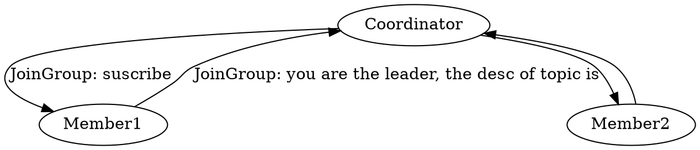

## Introduction


**The Kafka consumer is NOT thread-safe.**
All network I/O happens in the thread of the application making the call.
It is the responsibility of the user to ensure that multi-threaded access is properly synchronized.
Un-synchronized access will result in ConcurrentModificationException.

1. One Consumer Per Thread
2. Decouple Consumption and Processing

Create Connections

- FindCoordinator
- connect Coordinator
- consume records


```java
public static void main(String[]args){
    Properties props = new Properties();
    props.setProperty("bootstrap.servers", "localhost:9092");
    props.setProperty("group.id", "aaa");
    props.setProperty("enable.auto.commit", "true");
    props.setProperty("auto.commit.interval.ms", "1000");
    props.setProperty("key.deserializer", "org.apache.kafka.common.serialization.StringDeserializer");
    props.setProperty("value.deserializer", "org.apache.kafka.common.serialization.StringDeserializer");
    try (KafkaConsumer<String, String> consumer = new KafkaConsumer<>(props)) {
        consumer.subscribe(Arrays.asList("quickstart-events", "bar"), new NoOpConsumerRebalanceListener());
        while (true) {
            ConsumerRecords<String, String> records = consumer.poll(Duration.ofMillis(100));
            for (TopicPartition partition : records.partitions()) {
                List<ConsumerRecord<String, String>> partitionRecords = records.records(partition);
                for (ConsumerRecord<String, String> record : partitionRecords)
                    System.out.printf("offset = %d, key = %s, value = %s%n", record.offset(), record.key(), record.value());
                long lastOffset = partitionRecords.get(partitionRecords.size() - 1).offset();
                consumer.commitSync(Collections.singletonMap(partition, new OffsetAndMetadata(lastOffset + 1)));
            }
        }
    }
}
```
### Consumer Group

The consumer group state.

```java
public enum ConsumerGroupState {
   PREPARING_REBALANCE("PreparingRebalance"),
   COMPLETING_REBALANCE("CompletingRebalance"),
   STABLE("Stable"),
   DEAD("Dead"),
   EMPTY("Empty");
}
```

Best Practice: Consumer Number == Partition Number


### commit offset
Kafka consumer tracks the maximum offset it has consumed in each partition and has the capability to commit offsets so that it can resume from those offsets in the event of a restart.
Kafka provides the option to store all the offsets for a given consumer group in a designated broker (for that group) called the group coordinator.
i.e., any consumer instance in that consumer group should send its offset commits and fetches to that group coordinator (broker).
Consumer groups are assigned to coordinators based on their group names.
A consumer can look up its coordinator by issuing a FindCoordinatorRequest to any Kafka broker and reading the FindCoordinatorResponse which will contain the coordinator details.
The consumer can then proceed to commit or fetch offsets from the coordinator broker.
In case the coordinator moves, the consumer will need to rediscover the coordinator.
Offset commits can be done automatically or manually by consumer instance.

When the group coordinator receives an OffsetCommitRequest, it appends the request to a special compacted Kafka topic named `__consumer_offsets`.
The broker sends a successful offset commit response to the consumer only after all the replicas of the offsets topic receive the offsets.
In case the offsets fail to replicate within a configurable timeout, the offset commit will fail and the consumer may retry the commit after backing off.
The brokers periodically compact the offsets topic since it only needs to maintain the most recent offset commit per partition.
The coordinator also caches the offsets in an in-memory table in order to serve offset fetches quickly.

When the coordinator receives an offset fetch request, it simply returns the last committed offset vector from the offsets cache.
In case coordinator was just started or if it just became the coordinator for a new set of consumer groups (by becoming a leader for a partition of the offsets topic), it may need to load the offsets topic partition into the cache.
In this case, the offset fetch will fail with an CoordinatorLoadInProgressException and the consumer may retry the OffsetFetchRequest after backing off.

```java

 try{
      while (true) {
         ConsumerRecords<String, String> records = consumer.poll(Duration.ofSeconds(1));
         process(records); // 处理消息
         commitAysnc(); // 使用异步提交规避阻塞
      }
   } catch(Exception e){
      handle(e); // 处理异常
   } finally{
      try {
         consumer.commitSync(); // 最后一次提交使用同步阻塞式提交
      } finally {
         consumer.close();
      }
   }

```

Standalone consumer must use different groupId

#### Latency

High latency will cause records not in page cache and can not use Zero Copy

```shell
bin/kafka-consumer-groups.sh --bootstrap-server localhost:9092 --describe --group <group name>
```

##### JMX

### Partition

The "Round-Robin" partitioner This partitioning strategy can be used when user wants to distribute the writes to all partitions equally. This is the behaviour regardless of record key hash.

NOTE this partitioner is deprecated and shouldn't be used. To use default partitioning logic remove partitioner.class configuration setting. See KIP-794 for more info. The default partitioning strategy:

- If a partition is specified in the record, use it
- If no partition is specified but a key is present choose a partition based on a hash of the key
- If no partition or key is present choose the sticky partition that changes when the batch is full. See KIP-480 for details about sticky partitioning.

NOTE this partitioner is deprecated and shouldn't be used. To use default partitioning logic remove partitioner.class configuration setting and set partitioner.ignore.keys=true.
See KIP-794 for more info. The partitioning strategy:

- If a partition is specified in the record, use it
- Otherwise choose the sticky partition that changes when the batch is full. NOTE: In contrast to the DefaultPartitioner, the record key is NOT used as part of the partitioning strategy in this partitioner.
  Records with the same key are not guaranteed to be sent to the same partition. See KIP-480 for details about sticky partitioning.

### poll


## Rebalance

1. Partitions
2. Topics
3. Consumers

All consumers stop and wait until rebalanced finished.

Coordinator

partitionId=Math.abs(groupId.hashCode() % offsetsTopicPartitionCount)

- session.timeout.ms = 6s。
- heartbeat.interval.ms = 2s
  max.poll.interval.ms
  Full GC STW

Choose a leader of consumers and let leader selects strategy.


- JOIN_GROUP
- HEARTBEAT
- LEAVE_GROUP
- SYNC_GROUP
- DESCRIBE_GROUPS


JOIN_GROUP -> SYNC_GROUP




prepareRebalance
```scala
  private[group] def prepareRebalance(group: GroupMetadata, reason: String): Unit = {
    // if any members are awaiting sync, cancel their request and have them rejoin
    if (group.is(CompletingRebalance))
      resetAndPropagateAssignmentError(group, Errors.REBALANCE_IN_PROGRESS)

    // if a sync expiration is pending, cancel it.
    removeSyncExpiration(group)

    val delayedRebalance = if (group.is(Empty))
      new InitialDelayedJoin(this,
        rebalancePurgatory,
        group,
        groupConfig.groupInitialRebalanceDelayMs,
        groupConfig.groupInitialRebalanceDelayMs,
        max(group.rebalanceTimeoutMs - groupConfig.groupInitialRebalanceDelayMs, 0))
    else
      new DelayedJoin(this, group, group.rebalanceTimeoutMs)

    group.transitionTo(PreparingRebalance)

    info(s"Preparing to rebalance group ${group.groupId} in state ${group.currentState} with old generation " +
      s"${group.generationId} (${Topic.GROUP_METADATA_TOPIC_NAME}-${partitionFor(group.groupId)}) (reason: $reason)")

    val groupKey = GroupJoinKey(group.groupId)
    rebalancePurgatory.tryCompleteElseWatch(delayedRebalance, Seq(groupKey))
  }
```
onCompleteJoin

```scala
  def onCompleteJoin(group: GroupMetadata): Unit = {
    group.inLock {
      val notYetRejoinedDynamicMembers = group.notYetRejoinedMembers.filterNot(_._2.isStaticMember)
      if (notYetRejoinedDynamicMembers.nonEmpty) {
        info(s"Group ${group.groupId} removed dynamic members " +
          s"who haven't joined: ${notYetRejoinedDynamicMembers.keySet}")

        notYetRejoinedDynamicMembers.values.foreach { failedMember =>
          group.remove(failedMember.memberId)
          removeHeartbeatForLeavingMember(group, failedMember.memberId)
        }
      }

      if (group.is(Dead)) {
        info(s"Group ${group.groupId} is dead, skipping rebalance stage")
      } else if (!group.maybeElectNewJoinedLeader() && group.allMembers.nonEmpty) {
        // If all members are not rejoining, we will postpone the completion
        // of rebalance preparing stage, and send out another delayed operation
        // until session timeout removes all the non-responsive members.
        error(s"Group ${group.groupId} could not complete rebalance because no members rejoined")
        rebalancePurgatory.tryCompleteElseWatch(
          new DelayedJoin(this, group, group.rebalanceTimeoutMs),
          Seq(GroupJoinKey(group.groupId)))
      } else {
        group.initNextGeneration()
        if (group.is(Empty)) {
          info(s"Group ${group.groupId} with generation ${group.generationId} is now empty " +
            s"(${Topic.GROUP_METADATA_TOPIC_NAME}-${partitionFor(group.groupId)})")

          groupManager.storeGroup(group, Map.empty, error => {
            if (error != Errors.NONE) {
              // we failed to write the empty group metadata. If the broker fails before another rebalance,
              // the previous generation written to the log will become active again (and most likely timeout).
              // This should be safe since there are no active members in an empty generation, so we just warn.
              warn(s"Failed to write empty metadata for group ${group.groupId}: ${error.message}")
            }
          }, RequestLocal.NoCaching)
        } else {
          info(s"Stabilized group ${group.groupId} generation ${group.generationId} " +
            s"(${Topic.GROUP_METADATA_TOPIC_NAME}-${partitionFor(group.groupId)}) with ${group.size} members")

          // trigger the awaiting join group response callback for all the members after rebalancing
          for (member <- group.allMemberMetadata) {
            val joinResult = JoinGroupResult(
              members = if (group.isLeader(member.memberId)) {
                group.currentMemberMetadata
              } else {
                List.empty
              },
              memberId = member.memberId,
              generationId = group.generationId,
              protocolType = group.protocolType,
              protocolName = group.protocolName,
              leaderId = group.leaderOrNull,
              skipAssignment = false,
              error = Errors.NONE)

            group.maybeInvokeJoinCallback(member, joinResult)
            completeAndScheduleNextHeartbeatExpiration(group, member)
            member.isNew = false

            group.addPendingSyncMember(member.memberId)
          }

          schedulePendingSync(group)
        }
      }
    }
  }
```

### Consumer Offset

K,V

K: Topic, Partition, GroupId

offsets.topic.num.partitions

Compact commmitted ack


#### listener

```java
public interface ConsumerRebalanceListener {

    void onPartitionsRevoked(Collection<TopicPartition> partitions);

    void onPartitionsAssigned(Collection<TopicPartition> partitions);

    default void onPartitionsLost(Collection<TopicPartition> partitions) {
        onPartitionsRevoked(partitions);
    }
}

```


## Links

- [Kafka](/docs/CS/MQ/Kafka/Kafka.md)