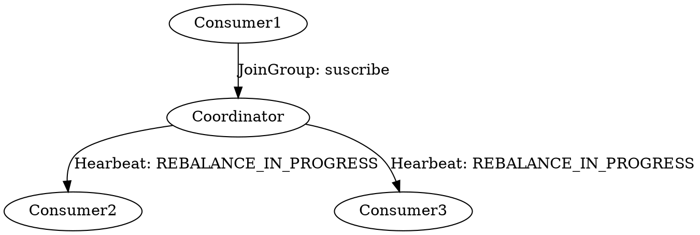
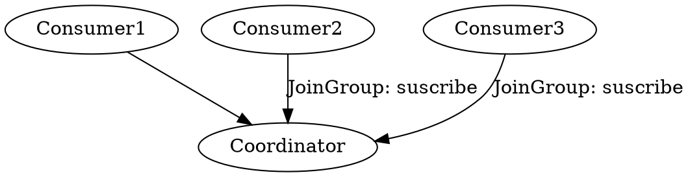
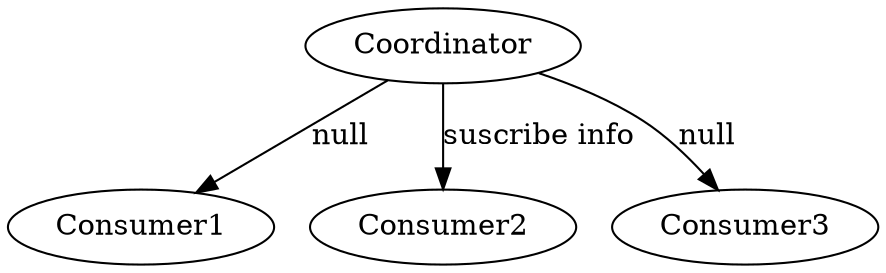
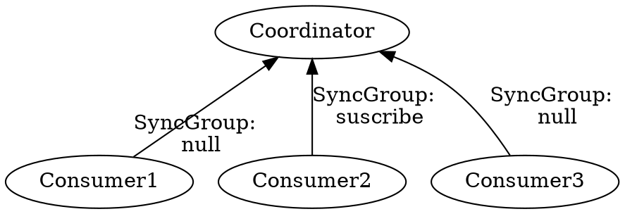
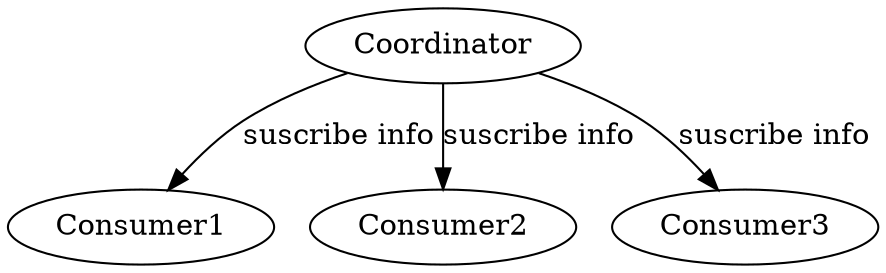

## Introduction

**The Kafka consumer is NOT thread-safe.**
All network I/O happens in the thread of the application making the call.
It is the responsibility of the user to ensure that multi-threaded access is properly synchronized.
Un-synchronized access will result in ConcurrentModificationException.

1. One Consumer Per Thread
2. Decouple Consumption and Processing

Create Connections

- FindCoordinator
- connect Coordinator
- consume records

```java
public static void main(String[]args){
    Properties props = new Properties();
    props.setProperty("bootstrap.servers", "localhost:9092");
    props.setProperty("group.id", "aaa");
    props.setProperty("enable.auto.commit", "true");
    props.setProperty("auto.commit.interval.ms", "1000");
    props.setProperty("key.deserializer", "org.apache.kafka.common.serialization.StringDeserializer");
    props.setProperty("value.deserializer", "org.apache.kafka.common.serialization.StringDeserializer");
    try (KafkaConsumer<String, String> consumer = new KafkaConsumer<>(props)) {
        consumer.subscribe(Arrays.asList("quickstart-events", "bar"), new NoOpConsumerRebalanceListener());
        while (true) {
            ConsumerRecords<String, String> records = consumer.poll(Duration.ofMillis(100));
            for (TopicPartition partition : records.partitions()) {
                List<ConsumerRecord<String, String>> partitionRecords = records.records(partition);
                for (ConsumerRecord<String, String> record : partitionRecords)
                    System.out.printf("offset = %d, key = %s, value = %s%n", record.offset(), record.key(), record.value());
                long lastOffset = partitionRecords.get(partitionRecords.size() - 1).offset();
                consumer.commitSync(Collections.singletonMap(partition, new OffsetAndMetadata(lastOffset + 1)));
            }
        }
    }
}
```

### Consumer Group

The consumer group state.

```java
public enum ConsumerGroupState {
   PREPARING_REBALANCE("PreparingRebalance"),
   COMPLETING_REBALANCE("CompletingRebalance"),
   STABLE("Stable"),
   DEAD("Dead"),
   EMPTY("Empty");
}
```

Best Practice: Consumer Number == Partition Number

## ConsumerPartitionAssignor

This interface is used to define custom partition assignment for use in KafkaConsumer.
Members of the consumer group subscribe to the topics they are interested in and forward their subscriptions to a Kafka broker serving as the group coordinator.
The coordinator selects one member to perform the group assignment and propagates the subscriptions of all members to it.
Then assign(Cluster, ConsumerPartitionAssignor.GroupSubscription) is called to perform the assignment and the results are forwarded back to each respective members In some cases, it is useful to forward additional metadata to the assignor in order to make assignment decisions.
For this, you can override subscriptionUserData(Set) and provide custom userData in the returned Subscription.
For example, to have a rack-aware assignor, an implementation can use this user data to forward the rackId belonging to each member.

- RangeAssignor
- RoundRobinAssignor
- StickyAssignor
- CooperativeStickyAssignor

### strategy

partition.assignment.strategy

A list of class names or class types, ordered by preference, of supported partition assignment strategies that the client will use to distribute partition ownership amongst consumer instances when group management is used.
Available options are:

- org.apache.kafka.clients.consumer.RangeAssignor: Assigns partitions on a per-topic basis.
- org.apache.kafka.clients.consumer.RoundRobinAssignor: Assigns partitions to consumers in a round-robin fashion.
- org.apache.kafka.clients.consumer.StickyAssignor: Guarantees an assignment that is maximally balanced while preserving as many existing partition assignments as possible.
- org.apache.kafka.clients.consumer.CooperativeStickyAssignor: Follows the same StickyAssignor logic, but allows for cooperative rebalancing.

The default assignor is [RangeAssignor, CooperativeStickyAssignor], which will use the RangeAssignor by default, but allows upgrading to the CooperativeStickyAssignor with just a single rolling bounce that removes the RangeAssignor from the list.

Implementing the `org.apache.kafka.clients.consumer.ConsumerPartitionAssignor` interface allows you to plug in a custom assignment strategy.

### commit offset

Kafka consumer tracks the maximum offset it has consumed in each partition and has the capability to commit offsets so that it can resume from those offsets in the event of a restart.
Kafka provides the option to store all the offsets for a given consumer group in a designated broker (for that group) called the group coordinator.
i.e., any consumer instance in that consumer group should send its offset commits and fetches to that group coordinator (broker).
Consumer groups are assigned to coordinators based on their group names.
A consumer can look up its coordinator by issuing a FindCoordinatorRequest to any Kafka broker and reading the FindCoordinatorResponse which will contain the coordinator details.
The consumer can then proceed to commit or fetch offsets from the coordinator broker.
In case the coordinator moves, the consumer will need to rediscover the coordinator.
Offset commits can be done automatically or manually by consumer instance.

When the group coordinator receives an OffsetCommitRequest, it appends the request to a special compacted Kafka topic named `__consumer_offsets`.
The broker sends a successful offset commit response to the consumer only after all the replicas of the offsets topic receive the offsets.
In case the offsets fail to replicate within a configurable timeout, the offset commit will fail and the consumer may retry the commit after backing off.
The brokers periodically compact the offsets topic since it only needs to maintain the most recent offset commit per partition.
The coordinator also caches the offsets in an in-memory table in order to serve offset fetches quickly.

When the coordinator receives an offset fetch request, it simply returns the last committed offset vector from the offsets cache.
In case coordinator was just started or if it just became the coordinator for a new set of consumer groups (by becoming a leader for a partition of the offsets topic), it may need to load the offsets topic partition into the cache.
In this case, the offset fetch will fail with an CoordinatorLoadInProgressException and the consumer may retry the OffsetFetchRequest after backing off.

```java

 try{
      while (true) {
         ConsumerRecords<String, String> records = consumer.poll(Duration.ofSeconds(1));
         process(records); // 处理消息
         commitAysnc(); // 使用异步提交规避阻塞
      }
   } catch(Exception e){
      handle(e); // 处理异常
   } finally{
      try {
         consumer.commitSync(); // 最后一次提交使用同步阻塞式提交
      } finally {
         consumer.close();
      }
   }

```

Standalone consumer must use different groupId

#### Latency

High latency will cause records not in page cache and can not use Zero Copy

```shell
bin/kafka-consumer-groups.sh --bootstrap-server localhost:9092 --describe --group <group name>
```

##### JMX

### Partition

The "Round-Robin" partitioner This partitioning strategy can be used when user wants to distribute the writes to all partitions equally. This is the behaviour regardless of record key hash.

NOTE this partitioner is deprecated and shouldn't be used. To use default partitioning logic remove partitioner.class configuration setting. See KIP-794 for more info. The default partitioning strategy:

- If a partition is specified in the record, use it
- If no partition is specified but a key is present choose a partition based on a hash of the key
- If no partition or key is present choose the sticky partition that changes when the batch is full. See KIP-480 for details about sticky partitioning.

NOTE this partitioner is deprecated and shouldn't be used. To use default partitioning logic remove partitioner.class configuration setting and set partitioner.ignore.keys=true.
See KIP-794 for more info. The partitioning strategy:

- If a partition is specified in the record, use it
- Otherwise choose the sticky partition that changes when the batch is full. NOTE: In contrast to the DefaultPartitioner, the record key is NOT used as part of the partitioning strategy in this partitioner.
  Records with the same key are not guaranteed to be sent to the same partition. See KIP-480 for details about sticky partitioning.

## fetch

```java
public class KafkaConsumer<K, V> implements Consumer<K, V> {
  private Fetch<K, V> pollForFetches(Timer timer) {
    long pollTimeout = coordinator == null ? timer.remainingMs() :
            Math.min(coordinator.timeToNextPoll(timer.currentTimeMs()), timer.remainingMs());

    // if data is available already, return it immediately
    final Fetch<K, V> fetch = fetcher.collectFetch();
    if (!fetch.isEmpty()) {
      return fetch;
    }

    // send any new fetches (won't resend pending fetches)
    fetcher.sendFetches();

    // We do not want to be stuck blocking in poll if we are missing some positions
    // since the offset lookup may be backing off after a failure

    // NOTE: the use of cachedSubscriptionHasAllFetchPositions means we MUST call
    // updateAssignmentMetadataIfNeeded before this method.
    if (!cachedSubscriptionHasAllFetchPositions && pollTimeout > retryBackoffMs) {
      pollTimeout = retryBackoffMs;
    }

    Timer pollTimer = time.timer(pollTimeout);
    client.poll(pollTimer, () -> {
      // since a fetch might be completed by the background thread, we need this poll condition
      // to ensure that we do not block unnecessarily in poll()
      return !fetcher.hasAvailableFetches();
    });
    timer.update(pollTimer.currentTimeMs());

    return fetcher.collectFetch();
  }
}
```

#### sendFetches

```java
public class Fetcher<K, V> implements Closeable {
  public synchronized int sendFetches() {
    // Update metrics in case there was an assignment change
    sensors.maybeUpdateAssignment(subscriptions);

    Map<Node, FetchSessionHandler.FetchRequestData> fetchRequestMap = prepareFetchRequests();
    for (Map.Entry<Node, FetchSessionHandler.FetchRequestData> entry : fetchRequestMap.entrySet()) {
      final Node fetchTarget = entry.getKey();
      final FetchSessionHandler.FetchRequestData data = entry.getValue();
      final short maxVersion;
      if (!data.canUseTopicIds()) {
        maxVersion = (short) 12;
      } else {
        maxVersion = ApiKeys.FETCH.latestVersion();
      }
      final FetchRequest.Builder request = FetchRequest.Builder
              .forConsumer(maxVersion, this.maxWaitMs, this.minBytes, data.toSend())
              .isolationLevel(isolationLevel)
              .setMaxBytes(this.maxBytes)
              .metadata(data.metadata())
              .removed(data.toForget())
              .replaced(data.toReplace())
              .rackId(clientRackId);

      RequestFuture<ClientResponse> future = client.send(fetchTarget, request);
      // We add the node to the set of nodes with pending fetch requests before adding the
      // listener because the future may have been fulfilled on another thread (e.g. during a
      // disconnection being handled by the heartbeat thread) which will mean the listener
      // will be invoked synchronously.
      this.nodesWithPendingFetchRequests.add(entry.getKey().id());
      future.addListener(new RequestFutureListener<ClientResponse>() {
        @Override
        public void onSuccess(ClientResponse resp) {
          synchronized (Fetcher.this) {
            try {
              FetchResponse response = (FetchResponse) resp.responseBody();
              FetchSessionHandler handler = sessionHandler(fetchTarget.id());
              if (handler == null) {
                log.error("Unable to find FetchSessionHandler for node {}. Ignoring fetch response.",
                        fetchTarget.id());
                return;
              }
              if (!handler.handleResponse(response, resp.requestHeader().apiVersion())) {
                if (response.error() == Errors.FETCH_SESSION_TOPIC_ID_ERROR) {
                  metadata.requestUpdate();
                }
                return;
              }

              Map<TopicPartition, FetchResponseData.PartitionData> responseData = response.responseData(handler.sessionTopicNames(), resp.requestHeader().apiVersion());
              Set<TopicPartition> partitions = new HashSet<>(responseData.keySet());
              FetchResponseMetricAggregator metricAggregator = new FetchResponseMetricAggregator(sensors, partitions);

              for (Map.Entry<TopicPartition, FetchResponseData.PartitionData> entry : responseData.entrySet()) {
                TopicPartition partition = entry.getKey();
                FetchRequest.PartitionData requestData = data.sessionPartitions().get(partition);
                if (requestData == null) {
                  String message;
                  if (data.metadata().isFull()) {
                    message = MessageFormatter.arrayFormat(
                            "Response for missing full request partition: partition={}; metadata={}",
                            new Object[]{partition, data.metadata()}).getMessage();
                  } else {
                    message = MessageFormatter.arrayFormat(
                            "Response for missing session request partition: partition={}; metadata={}; toSend={}; toForget={}; toReplace={}",
                            new Object[]{partition, data.metadata(), data.toSend(), data.toForget(), data.toReplace()}).getMessage();
                  }

                  // Received fetch response for missing session partition
                  throw new IllegalStateException(message);
                } else {
                  long fetchOffset = requestData.fetchOffset;
                  FetchResponseData.PartitionData partitionData = entry.getValue();

                  log.debug("Fetch {} at offset {} for partition {} returned fetch data {}",
                          isolationLevel, fetchOffset, partition, partitionData);

                  Iterator<? extends RecordBatch> batches = FetchResponse.recordsOrFail(partitionData).batches().iterator();
                  short responseVersion = resp.requestHeader().apiVersion();

                  completedFetches.add(new CompletedFetch(partition, partitionData,
                          metricAggregator, batches, fetchOffset, responseVersion));
                }
              }

              sensors.fetchLatency.record(resp.requestLatencyMs());
            } finally {
              nodesWithPendingFetchRequests.remove(fetchTarget.id());
            }
          }
        }

        @Override
        public void onFailure(RuntimeException e) {
          synchronized (Fetcher.this) {
            try {
              FetchSessionHandler handler = sessionHandler(fetchTarget.id());
              if (handler != null) {
                handler.handleError(e);
              }
            } finally {
              nodesWithPendingFetchRequests.remove(fetchTarget.id());
            }
          }
        }
      });

    }
    return fetchRequestMap.size();
  }
}
```

## Rebalance

1. Partitions
2. Topics
3. Consumers

All consumers stop and wait until rebalanced finished.

Coordinator

partitionId=Math.abs(groupId.hashCode() % offsetsTopicPartitionCount)

- session.timeout.ms = 6s。
- heartbeat.interval.ms = 2s
  max.poll.interval.ms
  Full GC STW

Choose a leader of consumers and let leader selects strategy.

- JOIN_GROUP
- HEARTBEAT
- LEAVE_GROUP
- SYNC_GROUP
- DESCRIBE_GROUPS

JOIN_GROUP -> SYNC_GROUP


new Consumer1 subscribes and the Coordinator sends REBALANCE_IN_PROGRESS through Heartbeat


All consumers send subscribe info


choose a leader




syncGroup



learning



Poll for coordinator events. This ensures that the coordinator is known and that the consumer has joined the group (if it is using group management). This also handles periodic offset commits if they are enabled.
Returns early if the timeout expires or if waiting on rejoin is not required

```java
public final class ConsumerCoordinator extends AbstractCoordinator {
  public boolean poll(Timer timer, boolean waitForJoinGroup) {
    maybeUpdateSubscriptionMetadata();

    invokeCompletedOffsetCommitCallbacks();

    if (subscriptions.hasAutoAssignedPartitions()) {
      if (protocol == null) {
        throw new IllegalStateException("User configured " + ConsumerConfig.PARTITION_ASSIGNMENT_STRATEGY_CONFIG +
                " to empty while trying to subscribe for group protocol to auto assign partitions");
      }
      // Always update the heartbeat last poll time so that the heartbeat thread does not leave the
      // group proactively due to application inactivity even if (say) the coordinator cannot be found.
      pollHeartbeat(timer.currentTimeMs());
      if (coordinatorUnknownAndUnreadySync(timer)) {
        return false;
      }

      if (rejoinNeededOrPending()) {
        // due to a race condition between the initial metadata fetch and the initial rebalance,
        // we need to ensure that the metadata is fresh before joining initially. This ensures
        // that we have matched the pattern against the cluster's topics at least once before joining.
        if (subscriptions.hasPatternSubscription()) {
          // For consumer group that uses pattern-based subscription, after a topic is created,
          // any consumer that discovers the topic after metadata refresh can trigger rebalance
          // across the entire consumer group. Multiple rebalances can be triggered after one topic
          // creation if consumers refresh metadata at vastly different times. We can significantly
          // reduce the number of rebalances caused by single topic creation by asking consumer to
          // refresh metadata before re-joining the group as long as the refresh backoff time has
          // passed.
          if (this.metadata.timeToAllowUpdate(timer.currentTimeMs()) == 0) {
            this.metadata.requestUpdate();
          }

          if (!client.ensureFreshMetadata(timer)) {
            return false;
          }

          maybeUpdateSubscriptionMetadata();
        }

        // if not wait for join group, we would just use a timer of 0
        if (!ensureActiveGroup(waitForJoinGroup ? timer : time.timer(0L))) {
          // since we may use a different timer in the callee, we'd still need
          // to update the original timer's current time after the call
          timer.update(time.milliseconds());

          return false;
        }
      }
    } else {
      // For manually assigned partitions, we do not try to pro-actively lookup coordinator;
      // instead we only try to refresh metadata when necessary.
      // If connections to all nodes fail, wakeups triggered while attempting to send fetch
      // requests result in polls returning immediately, causing a tight loop of polls. Without
      // the wakeup, poll() with no channels would block for the timeout, delaying re-connection.
      // awaitMetadataUpdate() in ensureCoordinatorReady initiates new connections with configured backoff and avoids the busy loop.
      if (metadata.updateRequested() && !client.hasReadyNodes(timer.currentTimeMs())) {
        client.awaitMetadataUpdate(timer);
      }

      // if there is pending coordinator requests, ensure they have a chance to be transmitted.
      client.pollNoWakeup();
    }

    maybeAutoCommitOffsetsAsync(timer.currentTimeMs());
    return true;
  }
}
```

ensureActiveGroup

```java
boolean ensureActiveGroup(final Timer timer) {
        // always ensure that the coordinator is ready because we may have been disconnected
        // when sending heartbeats and does not necessarily require us to rejoin the group.
        if (!ensureCoordinatorReady(timer)) {
            return false;
        }

        startHeartbeatThreadIfNeeded();
        return joinGroupIfNeeded(timer);
    }

        boolean joinGroupIfNeeded(final Timer timer) {
        while (rejoinNeededOrPending()) {
        if (!ensureCoordinatorReady(timer)) {
        return false;
        }

        // call onJoinPrepare if needed. We set a flag to make sure that we do not call it a second
        // time if the client is woken up before a pending rebalance completes. This must be called
        // on each iteration of the loop because an event requiring a rebalance (such as a metadata
        // refresh which changes the matched subscription set) can occur while another rebalance is
        // still in progress.
        if (needsJoinPrepare) {
        // need to set the flag before calling onJoinPrepare since the user callback may throw
        // exception, in which case upon retry we should not retry onJoinPrepare either.
        needsJoinPrepare = false;
        // return false when onJoinPrepare is waiting for committing offset
        if (!onJoinPrepare(timer, generation.generationId, generation.memberId)) {
        needsJoinPrepare = true;
        //should not initiateJoinGroup if needsJoinPrepare still is true
        return false;
        }
        }

final RequestFuture<ByteBuffer> future = initiateJoinGroup();
        client.poll(future, timer);
        if (!future.isDone()) {
        // we ran out of time
        return false;
        }

        if (future.succeeded()) {
        Generation generationSnapshot;
        MemberState stateSnapshot;

// Generation data maybe concurrently cleared by Heartbeat thread.
// Can't use synchronized for {@code onJoinComplete}, because it can be long enough
// and shouldn't block heartbeat thread.
// See {@link PlaintextConsumerTest#testMaxPollIntervalMsDelayInAssignment}
synchronized (AbstractCoordinator.this) {
        generationSnapshot = this.generation;
        stateSnapshot = this.state;
        }

        if (!hasGenerationReset(generationSnapshot) && stateSnapshot == MemberState.STABLE) {
        // Duplicate the buffer in case `onJoinComplete` does not complete and needs to be retried.
        ByteBuffer memberAssignment = future.value().duplicate();

        onJoinComplete(generationSnapshot.generationId, generationSnapshot.memberId, generationSnapshot.protocolName, memberAssignment);

        // Generally speaking we should always resetJoinGroupFuture once the future is done, but here
        // we can only reset the join group future after the completion callback returns. This ensures
        // that if the callback is woken up, we will retry it on the next joinGroupIfNeeded.
        // And because of that we should explicitly trigger resetJoinGroupFuture in other conditions below.
        resetJoinGroupFuture();
        needsJoinPrepare = true;
        } else {
final String reason = String.format("rebalance failed since the generation/state was " +
        "modified by heartbeat thread to %s/%s before the rebalance callback triggered",
        generationSnapshot, stateSnapshot);

        resetStateAndRejoin(reason, true);
        resetJoinGroupFuture();
        }
        } else {
final RuntimeException exception = future.exception();

        resetJoinGroupFuture();
synchronized (AbstractCoordinator.this) {
final String simpleName = exception.getClass().getSimpleName();
final String shortReason = String.format("rebalance failed due to %s", simpleName);
final String fullReason = String.format("rebalance failed due to '%s' (%s)",
        exception.getMessage(),
        simpleName);
        requestRejoin(shortReason, fullReason);
        }

        if (exception instanceof UnknownMemberIdException ||
        exception instanceof IllegalGenerationException ||
        exception instanceof RebalanceInProgressException ||
        exception instanceof MemberIdRequiredException)
        continue;
        else if (!future.isRetriable())
        throw exception;

        timer.sleep(rebalanceConfig.retryBackoffMs);
        }
        }
        return true;
        }

```

#### joinGroupIfNeeded

Joins the group without starting the heartbeat thread. If this function returns true, the state must always be in STABLE and heartbeat enabled. If this function returns false, the state can be in one of the following: * UNJOINED: got error response but times out before being able to re-join, heartbeat disabled * PREPARING_REBALANCE: not yet received join-group response before timeout, heartbeat disabled * COMPLETING_REBALANCE: not yet received sync-group response before timeout, heartbeat enabled Visible for testing.

```java
public abstract class AbstractCoordinator implements Closeable {
  boolean joinGroupIfNeeded(final Timer timer) {
    while (rejoinNeededOrPending()) {
      if (!ensureCoordinatorReady(timer)) {
        return false;
      }

      // call onJoinPrepare if needed. We set a flag to make sure that we do not call it a second
      // time if the client is woken up before a pending rebalance completes. This must be called
      // on each iteration of the loop because an event requiring a rebalance (such as a metadata
      // refresh which changes the matched subscription set) can occur while another rebalance is
      // still in progress.
      if (needsJoinPrepare) {
        // need to set the flag before calling onJoinPrepare since the user callback may throw
        // exception, in which case upon retry we should not retry onJoinPrepare either.
        needsJoinPrepare = false;
        // return false when onJoinPrepare is waiting for committing offset
        if (!onJoinPrepare(timer, generation.generationId, generation.memberId)) {
          needsJoinPrepare = true;
          //should not initiateJoinGroup if needsJoinPrepare still is true
          return false;
        }
      }

      final RequestFuture<ByteBuffer> future = initiateJoinGroup();
      client.poll(future, timer);
      if (!future.isDone()) {
        // we ran out of time
        return false;
      }

      if (future.succeeded()) {
        Generation generationSnapshot;
        MemberState stateSnapshot;

        // Generation data maybe concurrently cleared by Heartbeat thread.
        // Can't use synchronized for {@code onJoinComplete}, because it can be long enough
        // and shouldn't block heartbeat thread.
        // See {@link PlaintextConsumerTest#testMaxPollIntervalMsDelayInAssignment}
        synchronized (AbstractCoordinator.this) {
          generationSnapshot = this.generation;
          stateSnapshot = this.state;
        }

        if (!hasGenerationReset(generationSnapshot) && stateSnapshot == MemberState.STABLE) {
          // Duplicate the buffer in case `onJoinComplete` does not complete and needs to be retried.
          ByteBuffer memberAssignment = future.value().duplicate();

          onJoinComplete(generationSnapshot.generationId, generationSnapshot.memberId, generationSnapshot.protocolName, memberAssignment);

          // Generally speaking we should always resetJoinGroupFuture once the future is done, but here
          // we can only reset the join group future after the completion callback returns. This ensures
          // that if the callback is woken up, we will retry it on the next joinGroupIfNeeded.
          // And because of that we should explicitly trigger resetJoinGroupFuture in other conditions below.
          resetJoinGroupFuture();
          needsJoinPrepare = true;
        } else {
          final String reason = String.format("rebalance failed since the generation/state was " +
                          "modified by heartbeat thread to %s/%s before the rebalance callback triggered",
                  generationSnapshot, stateSnapshot);

          resetStateAndRejoin(reason, true);
          resetJoinGroupFuture();
        }
      } else {
        final RuntimeException exception = future.exception();

        resetJoinGroupFuture();
        synchronized (AbstractCoordinator.this) {
          final String simpleName = exception.getClass().getSimpleName();
          final String shortReason = String.format("rebalance failed due to %s", simpleName);
          final String fullReason = String.format("rebalance failed due to '%s' (%s)",
                  exception.getMessage(),
                  simpleName);
          requestRejoin(shortReason, fullReason);
        }

        if (exception instanceof UnknownMemberIdException ||
                exception instanceof IllegalGenerationException ||
                exception instanceof RebalanceInProgressException ||
                exception instanceof MemberIdRequiredException)
          continue;
        else if (!future.isRetriable())
          throw exception;

        timer.sleep(rebalanceConfig.retryBackoffMs);
      }
    }
    return true;
  }
}
```

#### getCoordinator

```scala
  
  private def getCoordinator(request: RequestChannel.Request, keyType: Byte, key: String): (Errors, Node) = {
    if (keyType == CoordinatorType.GROUP.id &&
        !authHelper.authorize(request.context, DESCRIBE, GROUP, key))
      (Errors.GROUP_AUTHORIZATION_FAILED, Node.noNode)
    else if (keyType == CoordinatorType.TRANSACTION.id &&
        !authHelper.authorize(request.context, DESCRIBE, TRANSACTIONAL_ID, key))
      (Errors.TRANSACTIONAL_ID_AUTHORIZATION_FAILED, Node.noNode)
    else {
      val (partition, internalTopicName) = CoordinatorType.forId(keyType) match {
        case CoordinatorType.GROUP =>
          (groupCoordinator.partitionFor(key), GROUP_METADATA_TOPIC_NAME)

        case CoordinatorType.TRANSACTION =>
          (txnCoordinator.partitionFor(key), TRANSACTION_STATE_TOPIC_NAME)
      }

      val topicMetadata = metadataCache.getTopicMetadata(Set(internalTopicName), request.context.listenerName)

      if (topicMetadata.headOption.isEmpty) {
        val controllerMutationQuota = quotas.controllerMutation.newPermissiveQuotaFor(request)
        autoTopicCreationManager.createTopics(Seq(internalTopicName).toSet, controllerMutationQuota, None)
        (Errors.COORDINATOR_NOT_AVAILABLE, Node.noNode)
      } else {
        if (topicMetadata.head.errorCode != Errors.NONE.code) {
          (Errors.COORDINATOR_NOT_AVAILABLE, Node.noNode)
        } else {
          val coordinatorEndpoint = topicMetadata.head.partitions.asScala
            .find(_.partitionIndex == partition)
            .filter(_.leaderId != MetadataResponse.NO_LEADER_ID)
            .flatMap(metadata => metadataCache.
                getAliveBrokerNode(metadata.leaderId, request.context.listenerName))

          coordinatorEndpoint match {
            case Some(endpoint) =>
              (Errors.NONE, endpoint)
            case _ =>
              (Errors.COORDINATOR_NOT_AVAILABLE, Node.noNode)
          }
        }
      }
    }
  }

```

#### handleJoinGroup

```scala
  
  def handleJoinGroup(groupId: String,
                      memberId: String,
                      groupInstanceId: Option[String],
                      requireKnownMemberId: Boolean,
                      supportSkippingAssignment: Boolean,
                      clientId: String,
                      clientHost: String,
                      rebalanceTimeoutMs: Int,
                      sessionTimeoutMs: Int,
                      protocolType: String,
                      protocols: List[(String, Array[Byte])],
                      responseCallback: JoinCallback,
                      reason: Option[String] = None,
                      requestLocal: RequestLocal = RequestLocal.NoCaching): Unit = {
    validateGroupStatus(groupId, ApiKeys.JOIN_GROUP).foreach { error =>
      responseCallback(JoinGroupResult(memberId, error))
      return
    }

    if (sessionTimeoutMs < groupConfig.groupMinSessionTimeoutMs ||
      sessionTimeoutMs > groupConfig.groupMaxSessionTimeoutMs) {
      responseCallback(JoinGroupResult(memberId, Errors.INVALID_SESSION_TIMEOUT))
    } else {
      val isUnknownMember = memberId == JoinGroupRequest.UNKNOWN_MEMBER_ID
      // group is created if it does not exist and the member id is UNKNOWN. if member
      // is specified but group does not exist, request is rejected with UNKNOWN_MEMBER_ID
      groupManager.getOrMaybeCreateGroup(groupId, isUnknownMember) match {
        case None =>
          responseCallback(JoinGroupResult(memberId, Errors.UNKNOWN_MEMBER_ID))
        case Some(group) =>
          group.inLock {
            val joinReason = reason.getOrElse("not provided")
            if (!acceptJoiningMember(group, memberId)) {
              group.remove(memberId)
              responseCallback(JoinGroupResult(JoinGroupRequest.UNKNOWN_MEMBER_ID, Errors.GROUP_MAX_SIZE_REACHED))
            } else if (isUnknownMember) {
              doNewMemberJoinGroup(
                group,
                groupInstanceId,
                requireKnownMemberId,
                supportSkippingAssignment,
                clientId,
                clientHost,
                rebalanceTimeoutMs,
                sessionTimeoutMs,
                protocolType,
                protocols,
                responseCallback,
                requestLocal,
                joinReason
              )
            } else {
              doCurrentMemberJoinGroup(
                group,
                memberId,
                groupInstanceId,
                clientId,
                clientHost,
                rebalanceTimeoutMs,
                sessionTimeoutMs,
                protocolType,
                protocols,
                responseCallback,
                joinReason
              )
            }

            // attempt to complete JoinGroup
            if (group.is(PreparingRebalance)) {
              rebalancePurgatory.checkAndComplete(GroupJoinKey(group.groupId))
            }
          }
      }
    }
  }
```

prepareRebalance

```scala
  private[group] def prepareRebalance(group: GroupMetadata, reason: String): Unit = {
    // if any members are awaiting sync, cancel their request and have them rejoin
    if (group.is(CompletingRebalance))
      resetAndPropagateAssignmentError(group, Errors.REBALANCE_IN_PROGRESS)

    // if a sync expiration is pending, cancel it.
    removeSyncExpiration(group)

    val delayedRebalance = if (group.is(Empty))
      new InitialDelayedJoin(this,
        rebalancePurgatory,
        group,
        groupConfig.groupInitialRebalanceDelayMs,
        groupConfig.groupInitialRebalanceDelayMs,
        max(group.rebalanceTimeoutMs - groupConfig.groupInitialRebalanceDelayMs, 0))
    else
      new DelayedJoin(this, group, group.rebalanceTimeoutMs)

    group.transitionTo(PreparingRebalance)

    info(s"Preparing to rebalance group ${group.groupId} in state ${group.currentState} with old generation " +
      s"${group.generationId} (${Topic.GROUP_METADATA_TOPIC_NAME}-${partitionFor(group.groupId)}) (reason: $reason)")

    val groupKey = GroupJoinKey(group.groupId)
    rebalancePurgatory.tryCompleteElseWatch(delayedRebalance, Seq(groupKey))
  }
```

onCompleteJoin

```scala
  def onCompleteJoin(group: GroupMetadata): Unit = {
    group.inLock {
      val notYetRejoinedDynamicMembers = group.notYetRejoinedMembers.filterNot(_._2.isStaticMember)
      if (notYetRejoinedDynamicMembers.nonEmpty) {
        info(s"Group ${group.groupId} removed dynamic members " +
          s"who haven't joined: ${notYetRejoinedDynamicMembers.keySet}")

        notYetRejoinedDynamicMembers.values.foreach { failedMember =>
          group.remove(failedMember.memberId)
          removeHeartbeatForLeavingMember(group, failedMember.memberId)
        }
      }

      if (group.is(Dead)) {
        info(s"Group ${group.groupId} is dead, skipping rebalance stage")
      } else if (!group.maybeElectNewJoinedLeader() && group.allMembers.nonEmpty) {
        // If all members are not rejoining, we will postpone the completion
        // of rebalance preparing stage, and send out another delayed operation
        // until session timeout removes all the non-responsive members.
        error(s"Group ${group.groupId} could not complete rebalance because no members rejoined")
        rebalancePurgatory.tryCompleteElseWatch(
          new DelayedJoin(this, group, group.rebalanceTimeoutMs),
          Seq(GroupJoinKey(group.groupId)))
      } else {
        group.initNextGeneration()
        if (group.is(Empty)) {
          info(s"Group ${group.groupId} with generation ${group.generationId} is now empty " +
            s"(${Topic.GROUP_METADATA_TOPIC_NAME}-${partitionFor(group.groupId)})")

          groupManager.storeGroup(group, Map.empty, error => {
            if (error != Errors.NONE) {
              // we failed to write the empty group metadata. If the broker fails before another rebalance,
              // the previous generation written to the log will become active again (and most likely timeout).
              // This should be safe since there are no active members in an empty generation, so we just warn.
              warn(s"Failed to write empty metadata for group ${group.groupId}: ${error.message}")
            }
          }, RequestLocal.NoCaching)
        } else {
          info(s"Stabilized group ${group.groupId} generation ${group.generationId} " +
            s"(${Topic.GROUP_METADATA_TOPIC_NAME}-${partitionFor(group.groupId)}) with ${group.size} members")

          // trigger the awaiting join group response callback for all the members after rebalancing
          for (member <- group.allMemberMetadata) {
            val joinResult = JoinGroupResult(
              members = if (group.isLeader(member.memberId)) {
                group.currentMemberMetadata
              } else {
                List.empty
              },
              memberId = member.memberId,
              generationId = group.generationId,
              protocolType = group.protocolType,
              protocolName = group.protocolName,
              leaderId = group.leaderOrNull,
              skipAssignment = false,
              error = Errors.NONE)

            group.maybeInvokeJoinCallback(member, joinResult)
            completeAndScheduleNextHeartbeatExpiration(group, member)
            member.isNew = false

            group.addPendingSyncMember(member.memberId)
          }

          schedulePendingSync(group)
        }
      }
    }
  }
```

### Consumer Offset

K,V

K: Topic, Partition, GroupId

offsets.topic.num.partitions

Compact commmitted ack

#### listener

```java
public interface ConsumerRebalanceListener {

    void onPartitionsRevoked(Collection<TopicPartition> partitions);

    void onPartitionsAssigned(Collection<TopicPartition> partitions);

    default void onPartitionsLost(Collection<TopicPartition> partitions) {
        onPartitionsRevoked(partitions);
    }
}

```

## Links

- [Kafka](/docs/CS/MQ/Kafka/Kafka.md)
