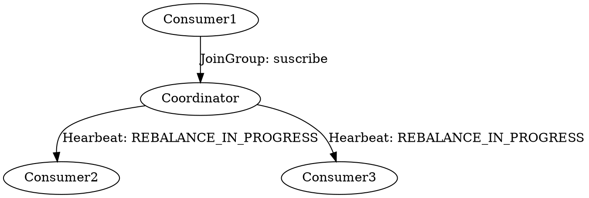
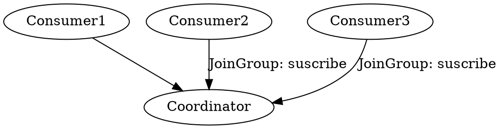
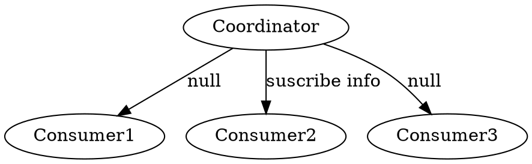
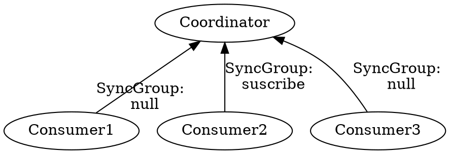
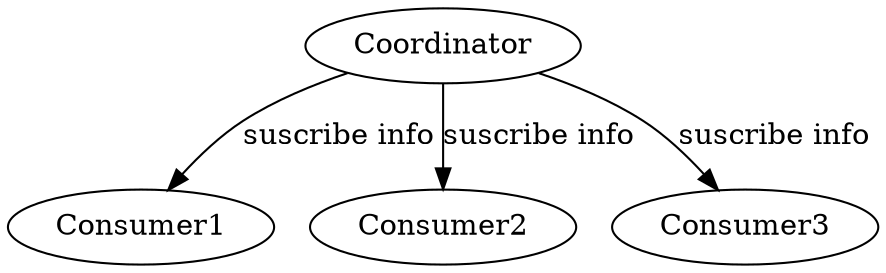

## Introduction


Consumers read messages. In other publish/subscribe systems, these clients may be called subscribers or readers. 
The consumer subscribes to one or more topics and reads the messages in the order in which they were produced. 
The consumer keeps track of which messages it has already consumed by keeping track of the offset of messages.
The offset is another bit of metadata—an integer value that continually increases—that Kafka adds to each message as it is produced. Each message in a given partition has a unique offset.
By storing the offset of the last consumed message for each partition, either in Zookeeper or in Kafka itself, a consumer can stop and restart without losing its place.

Consumers work as part of a consumer group, which is one or more consumers that work together to consume a topic. The group assures that each partition is only consumed by one member.
The mapping of a consumer to a partition is often called ownership of the partition by the consumer.”

In this way, consumers can horizontally scale to consume topics with a large number of messages.
Additionally, if a single consumer fails, the remaining members of the group will rebalance the partitions being consumed to take over for the missing member. 


> [!WARNING]
> 
> **The Kafka consumer is NOT thread-safe.** 
>
> You can’t have multiple consumers that belong to the same group in one thread and you can’t have multiple threads safely use the same consumer. 
> One consumer per thread is the rule. 
> To run multiple consumers in the same group in one application, you will need to run each in its own thread. 
> It is useful to wrap the consumer logic in its own object and then use Java’s ExecutorService to start multiple threads each with its own consumer.

All network I/O happens in the thread of the application making the call.
It is the responsibility of the user to ensure that multi-threaded access is properly synchronized.
Un-synchronized access will result in ConcurrentModificationException.

1. One Consumer Per Thread
2. Decouple Consumption and Processing

Create Connections

- FindCoordinator
- connect Coordinator
- consume records


The first step to start consuming records is to create a `KafkaConsumer` instance. 
Creating a `KafkaConsumer` is very similar to creating a `KafkaProducer`—you create a Java `Properties` instance with the properties you want to pass to the consumer.
```
Properties props = new Properties();
    props.setProperty("bootstrap.servers", "localhost:9092");
    props.setProperty("group.id", "aaa");
    props.setProperty("enable.auto.commit", "true");
    props.setProperty("auto.commit.interval.ms", "1000");
    props.setProperty("key.deserializer", "org.apache.kafka.common.serialization.StringDeserializer");
    props.setProperty("value.deserializer", "org.apache.kafka.common.serialization.StringDeserializer");
    KafkaConsumer<String, String> consumer = new KafkaConsumer<>(props);
```

Once we create a consumer, the next step is to subscribe to one or more topics. The `subcribe()` method takes a list of topics as a parameter.
```
consumer.subscribe(Arrays.asList("quickstart-events", "bar"), new NoOpConsumerRebalanceListener());
```

At the heart of the consumer API is a simple loop for polling the server for more data. Once the consumer subscribes to topics, the poll loop handles all details of coordina‐ tion, partition rebalances, heartbeats, and data fetching, leaving the developer with a clean API that simply returns available data from the assigned partitions. <br/>
The main body of a consumer will look as follows:


```
try {
  while (true) {
      ConsumerRecords<String, String> records = consumer.poll(100);
      for (ConsumerRecord<String, String> record : records)
      {
          log.debug("topic = %s, partition = %s, offset = %d, customer = %s,
             country = %s\n",
             record.topic(), record.partition(), record.offset(),
             record.key(), record.value());

          int updatedCount = 1;
          if (custCountryMap.countainsValue(record.value())) {
              updatedCount = custCountryMap.get(record.value()) + 1;
          }
          custCountryMap.put(record.value(), updatedCount)

          JSONObject json = new JSONObject(custCountryMap);
          System.out.println(json.toString(4))
      }
  }
} finally {
  consumer.close();
}
```
The poll loop does a lot more than just get data. 
The first time you call poll() with a new consumer, it is responsible for finding the `GroupCoordinator`, joining the con‐ sumer group, and receiving a partition assignment. If a rebalance is triggered, it will be handled inside the poll loop as well. 
And of course the heartbeats that keep con‐ sumers alive are sent from within the poll loop.
For this reason, we try to make sure that whatever processing we do between iterations is fast and efficient.
 

### Consumer Group

Consumers label themselves with a consumer group name,and each record published to a topic is delivered to one consumer instance within each subscribing consumer group.

The consumer group state.

```java
public enum ConsumerGroupState {
   PREPARING_REBALANCE("PreparingRebalance"),
   COMPLETING_REBALANCE("CompletingRebalance"),
   STABLE("Stable"),
   DEAD("Dead"),
   EMPTY("Empty");
}
```

Best Practice: Consumer Number == Partition Number

The group is ignored for the manually assign partitions, but is still used to track offsets, if needed.
Mutual exclusivity between consumers in a consumer group is lost due to more than 1 consumer is listening same partitions.
You must use group management and let Kafka do the partition assignment for you, or assign the partitions manually for each instance.


## ConsumerPartitionAssignor

This interface is used to define custom partition assignment for use in KafkaConsumer.
Members of the consumer group subscribe to the topics they are interested in and forward their subscriptions to a Kafka broker serving as the group coordinator.
The coordinator selects one member to perform the group assignment and propagates the subscriptions of all members to it.
Then assign(Cluster, ConsumerPartitionAssignor.GroupSubscription) is called to perform the assignment and the results are forwarded back to each respective members In some cases, it is useful to forward additional metadata to the assignor in order to make assignment decisions.
For this, you can override subscriptionUserData(Set) and provide custom userData in the returned Subscription.
For example, to have a rack-aware assignor, an implementation can use this user data to forward the rackId belonging to each member.

- RangeAssignor
- RoundRobinAssignor
- StickyAssignor
- CooperativeStickyAssignor

### strategy

partition.assignment.strategy

A list of class names or class types, ordered by preference, of supported partition assignment strategies that the client will use to distribute partition ownership amongst consumer instances when group management is used.
Available options are:

- org.apache.kafka.clients.consumer.RangeAssignor: Assigns partitions on a per-topic basis.
- org.apache.kafka.clients.consumer.RoundRobinAssignor: Assigns partitions to consumers in a round-robin fashion.
- org.apache.kafka.clients.consumer.StickyAssignor: Guarantees an assignment that is maximally balanced while preserving as many existing partition assignments as possible.
- org.apache.kafka.clients.consumer.CooperativeStickyAssignor: Follows the same StickyAssignor logic, but allows for cooperative rebalancing.

The default assignor is [RangeAssignor, CooperativeStickyAssignor], which will use the RangeAssignor by default, but allows upgrading to the CooperativeStickyAssignor with just a single rolling bounce that removes the RangeAssignor from the list.

Implementing the `org.apache.kafka.clients.consumer.ConsumerPartitionAssignor` interface allows you to plug in a custom assignment strategy.

### commit offset

Kafka consumer tracks the maximum offset it has consumed in each partition and has the capability to commit offsets so that it can resume from those offsets in the event of a restart.
Kafka provides the option to store all the offsets for a given consumer group in a designated broker (for that group) called the group coordinator.
i.e., any consumer instance in that consumer group should send its offset commits and fetches to that group coordinator (broker).
Consumer groups are assigned to coordinators based on their group names.
A consumer can look up its coordinator by issuing a FindCoordinatorRequest to any Kafka broker and reading the FindCoordinatorResponse which will contain the coordinator details.
The consumer can then proceed to commit or fetch offsets from the coordinator broker.
In case the coordinator moves, the consumer will need to rediscover the coordinator.
Offset commits can be done automatically or manually by consumer instance.

When the group coordinator receives an OffsetCommitRequest, it appends the request to a special compacted Kafka topic named `__consumer_offsets`.
The broker sends a successful offset commit response to the consumer only after all the replicas of the offsets topic receive the offsets.
In case the offsets fail to replicate within a configurable timeout, the offset commit will fail and the consumer may retry the commit after backing off.
The brokers periodically compact the offsets topic since it only needs to maintain the most recent offset commit per partition.
The coordinator also caches the offsets in an in-memory table in order to serve offset fetches quickly.

When the coordinator receives an offset fetch request, it simply returns the last committed offset vector from the offsets cache.
In case coordinator was just started or if it just became the coordinator for a new set of consumer groups (by becoming a leader for a partition of the offsets topic), it may need to load the offsets topic partition into the cache.
In this case, the offset fetch will fail with an CoordinatorLoadInProgressException and the consumer may retry the OffsetFetchRequest after backing off.


```properties
group.id+topic+partitionId=offset
```

Deafult 50 log filles.


```java

 try{
      while (true) {
         ConsumerRecords<String, String> records = consumer.poll(Duration.ofSeconds(1));
         process(records); // 处理消息
         commitAysnc(); // 使用异步提交规避阻塞
      }
   } catch(Exception e){
      handle(e); // 处理异常
   } finally{
      try {
         consumer.commitSync(); // 最后一次提交使用同步阻塞式提交
      } finally {
         consumer.close();
      }
   }

```

Standalone consumer must use different groupId

#### Latency

High latency will cause records not in page cache and can not use Zero Copy

```shell
bin/kafka-consumer-groups.sh --bootstrap-server localhost:9092 --describe --group <group name>
```

##### JMX

### Partition

The "Round-Robin" partitioner 
This partitioning strategy can be used when user wants to distribute the writes to all partitions equally. 
This is the behaviour regardless of record key hash.

NOTE this partitioner is deprecated and shouldn't be used. 
To use default partitioning logic remove partitioner.class configuration setting. 
See KIP-794 for more info. The default partitioning strategy:

- If a partition is specified in the record, use it
- If no partition is specified but a key is present choose a partition based on a hash of the key
- If no partition or key is present choose the sticky partition that changes when the batch is full. 
  See KIP-480 for details about sticky partitioning.

NOTE this partitioner is deprecated and shouldn't be used. To use default partitioning logic remove partitioner.class configuration setting and set partitioner.ignore.keys=true.
See KIP-794 for more info. The partitioning strategy:

- If a partition is specified in the record, use it
- Otherwise choose the sticky partition that changes when the batch is full. 
  NOTE: In contrast to the DefaultPartitioner, the record key is NOT used as part of the partitioning strategy in this partitioner.
  Records with the same key are not guaranteed to be sent to the same partition. See KIP-480 for details about sticky partitioning.

## poll

Kafka consumers poll the Kafka broker to receive batches of data.
Once the consumer is subscribed to Kafka topics, the poll loop handles all details of coordination, partition rebalances, heartbeats, and data fetching, 
leaving the developer with a clean API that simply returns available data from the assigned partitions.

Consumers poll brokers periodically using the .poll() method. 
If two .poll() calls are separated by more than max.poll.interval.ms time, then the consumer will be disconnected from the group.

- `max.poll.interval.ms`: (default 5 minutes) 
  The maximum delay between invocations of poll() when using consumer group management. 
  This places an upper bound on the amount of time that the consumer can be idle before fetching more records. 
  If poll() is not called before expiration of this timeout, then the consumer is considered failed and the group will rebalance in order to reassign the partitions to another member.
-  `max.poll.records`: (default 500)
- This controls the maximum number of records that a single call to poll() will return. 
  This is useful to help control the amount of data your application will receive in your processing loop. 
  A lower max.poll.records ensure you will call you next .poll() before the max.poll.interval.ms delay is reached.


Upon calling .poll() the consumer will fetch data from the Kafka partitions.
The consumer then processes the data in the main thread and the consumer proceeds to an optimization of pre-fetching the next batch of data to pipeline data faster and reduce processing latency.

The fetch requests from the consumer to the Kafka broker can be controlled by the following configurations:

- `fetch.min.bytes` 
  This property allows a consumer to specify the minimum amount of data that it wants to receive from the broker when fetching records. 
  If a broker receives a request for records from a consumer but the new records amount to fewer bytes than fetch.min.bytes, 
  the broker will wait until more messages are available before sending the records back to the consumer (based on the fetch.max.wait.ms setting)
  his reduces the load on both the consumer and the broker as they have to handle fewer back-and-forth messages and optimizes for a minimum fetch size.
- `fetch.max.wait.ms` 
  The maximum amount of time the Kafka broker will block before answering the fetch request if there isn't sufficient data to immediately satisfy the requirement given by fetch.min.bytes.
  This means that until the requirement of fetch.min.bytes to be satisfied, you will have up to 500 ms of latency before the fetch returns data to the consumer (e.g. introducing a potential delay to be more efficient in requests)
- `max.partition.fetch.bytes`
  The maximum amount of data per partition the server will return. Records are fetched in batches by the consumer.
  If the first record batch in the first non-empty partition of the fetch is larger than this limit, the batch will still be returned to ensure that the consumer can make progress.
- `fetch.max.bytes`
  Maximum data returned for each fetch request. If you have available memory, try increasing fetch.max.bytes to allow the consumer to read more data in each request.
- `max.poll.records`
  This controls the maximum number of records that a single call to poll() will return.
  This is useful to help control the amount of data your application will receive in your processing loop.
  This setting does not impact the underlying fetching behavior.
  The consumer will cache the records from each fetch request and returns them incrementally from each poll.


### Commit

A consumer is expected to read from a log continuously.

Kafka consumers have a configuration for how to behave when they don’t have a previously committed offset.
This can happen if the consumer application has a bug and it is down.
For example, if Kafka has a retention of 7 days, and your consumer is down for more than 7 days, the offsets are "invalid" as they will be deleted.

In this case, consumers have a choice to either start reading from the beginning of the partition or from the end of the partition.
This is controlled by the consumer configuration - `auto.offset.reset`

Three possible values:

- latest (default) which means consumers will read messages from the tail of the partition
- earliest which means reading from the oldest offset in the partition
- none throw exception to the consumer if no previous offset is found for the consumer's group

offset.retention.minutes

The default retention period for message offsets in Kafka (version >= 2.0) is one week (7 days).
It is a broker level setting. It is the offset retention period for the __consumer_offsets topic (in minutes).

> This setting is particularly helpful to increase in case you expect your consumers to be down for more than 1 week (and therefore lose their committed offsets),
> or if your topics are low-throughput topics and the consumer has not processed data for more than 1 week. 
> In that case, if the consumer did lose its offset, the `auto.reset.offset` setting would kick in. 
> If you would like to avoid that case, increase the value of `offset.retention.minutes` to something like 1 month.


Replaying data 

<!-- tabs:start -->

##### **CLI**

- Make sure all the consumers from a specific group down
- Set offset with `--reset-offsets` option to what you want
- Restart consumers

##### **Java**

The .seek() and .assign() API are also helpful to replay data from a specific offset.

- Remove the group.id from the consumer properties (we don't use consumer groups anymore)
- Remove the subscription to the topic
- Use consumer assign() and seek() APIs

<!-- tabs:end -->

The easiest way to commit offsets is to allow the consumer to do it for you.
If you configure enable.auto.commit=true, then every five seconds the consumer will commit the largest offset your client received from poll(). 
The five-second interval is the default and is controlled by setting `auto.commit.interval.ms`. 
Just like everything else in the consumer, the automatic commits are driven by the poll loop. 
Whenever you poll, the consumer checks if it is time to commit, and if it is, it will commit the offsets it returned in the last poll.

With autocommit enabled, a call to poll will always commit the last offset returned by the previous poll.
It doesn’t know which events were actually processed, so it is critical to always process all the events returned by poll() before calling poll() again.
(Just like poll(), close() also commits offsets automatically.) 
This is usually not an issue, but pay attention when you handle exceptions or exit the poll loop prematurely.

Automatic commits are convenient, but they don’t give developers enough control to avoid duplicate messages.

Most developers exercise more control over the time at which offsets are committed both to eliminate the possibility of missing messages and to reduce the number of messages duplicated during rebalancing. The consumer API has the option of com‐ mitting the current offset at a point that makes sense to the application developer rather than based on a timer.

By setting `auto.commit.offset=false`, offsets will only be committed when the application explicitly chooses to do so. 
The simplest and most reliable of the commit APIs is commitSync(). 
This API will commit the latest offset returned by poll() and return once the offset is committed, throwing an exception if commit fails for some reason.

One drawback of manual commit is that the application is blocked until the broker responds to the commit request.
This will limit the throughput of the application. 
Throughput can be improved by committing less frequently, but then we are increasing the number of potential duplicates that a rebalance will create.

> [!NOTE]
> 
> A simple pattern to get commit order right for asynchronous retries is to use a monotonically increasing sequence number. 
> Increase the sequence number every time you commit and add the sequence number at the time of the commit to the commitAsync callback. 
> When you’re getting ready to send a retry, check if the commit sequence number the callback got is equal to the instance variable; 
> if it is, there was no newer commit and it is safe to retry. 
> If the instance sequence number is higher, don’t retry because a newer commit was already sent.


Fetch data for the topics or partitions specified using one of the subscribe/assign APIs. 
It is an error to not have subscribed to any topics or partitions before polling for data.

On each poll, consumer will try to use the last consumed offset as the starting offset and fetch sequentially.
The last consumed offset can be manually set through seek(TopicPartition, long) or automatically set as the last committed offset for the subscribed list of partitions

This method returns immediately if there are records available or if the position advances past control records or aborted transactions when isolation.level=read_committed.
Otherwise, it will await the passed timeout. If the timeout expires, an empty record set will be returned.
Note that this method may block beyond the timeout in order to execute custom ConsumerRebalanceListener callbacks.

```java
public class KafkaConsumer<K, V> implements Consumer<K, V> {
  private ConsumerRecords<K, V> poll(final Timer timer, final boolean includeMetadataInTimeout) {
    try {
      do {
        final Fetch<K, V> fetch = pollForFetches(timer);
        if (!fetch.isEmpty()) {
          // before returning the fetched records, we can send off the next round of fetches
          // and avoid block waiting for their responses to enable pipelining while the user
          // is handling the fetched records.
          //
          // NOTE: since the consumed position has already been updated, we must not allow
          // wakeups or any other errors to be triggered prior to returning the fetched records.
          if (fetcher.sendFetches() > 0 || client.hasPendingRequests()) {
            client.transmitSends();
          }

          return this.interceptors.onConsume(new ConsumerRecords<>(fetch.records()));
        }
      } while (timer.notExpired());
      return ConsumerRecords.empty();
    }
  }
}
```

### pollForFetches

```java
public class KafkaConsumer<K, V> implements Consumer<K, V> {
  private Fetch<K, V> pollForFetches(Timer timer) {
    long pollTimeout = coordinator == null ? timer.remainingMs() :
            Math.min(coordinator.timeToNextPoll(timer.currentTimeMs()), timer.remainingMs());

    // if data is available already, return it immediately
    final Fetch<K, V> fetch = fetcher.collectFetch();
    if (!fetch.isEmpty()) {
      return fetch;
    }

    // send any new fetches (won't resend pending fetches)
    fetcher.sendFetches();

    // We do not want to be stuck blocking in poll if we are missing some positions
    // since the offset lookup may be backing off after a failure

    // NOTE: the use of cachedSubscriptionHasAllFetchPositions means we MUST call
    // updateAssignmentMetadataIfNeeded before this method.
    if (!cachedSubscriptionHasAllFetchPositions && pollTimeout > retryBackoffMs) {
      pollTimeout = retryBackoffMs;
    }

    Timer pollTimer = time.timer(pollTimeout);
    client.poll(pollTimer, () -> {
      // since a fetch might be completed by the background thread, we need this poll condition
      // to ensure that we do not block unnecessarily in poll()
      return !fetcher.hasAvailableFetches();
    });
    timer.update(pollTimer.currentTimeMs());

    return fetcher.collectFetch();
  }
}
```

#### sendFetches

```java
public class Fetcher<K, V> implements Closeable {
  public synchronized int sendFetches() {
    // Update metrics in case there was an assignment change
    sensors.maybeUpdateAssignment(subscriptions);

    Map<Node, FetchSessionHandler.FetchRequestData> fetchRequestMap = prepareFetchRequests();
    for (Map.Entry<Node, FetchSessionHandler.FetchRequestData> entry : fetchRequestMap.entrySet()) {
      final Node fetchTarget = entry.getKey();
      final FetchSessionHandler.FetchRequestData data = entry.getValue();
      final short maxVersion;
      if (!data.canUseTopicIds()) {
        maxVersion = (short) 12;
      } else {
        maxVersion = ApiKeys.FETCH.latestVersion();
      }
      final FetchRequest.Builder request = FetchRequest.Builder
              .forConsumer(maxVersion, this.maxWaitMs, this.minBytes, data.toSend())
              .isolationLevel(isolationLevel)
              .setMaxBytes(this.maxBytes)
              .metadata(data.metadata())
              .removed(data.toForget())
              .replaced(data.toReplace())
              .rackId(clientRackId);

      RequestFuture<ClientResponse> future = client.send(fetchTarget, request);
      // We add the node to the set of nodes with pending fetch requests before adding the
      // listener because the future may have been fulfilled on another thread (e.g. during a
      // disconnection being handled by the heartbeat thread) which will mean the listener
      // will be invoked synchronously.
      this.nodesWithPendingFetchRequests.add(entry.getKey().id());
      future.addListener(new RequestFutureListener<ClientResponse>() {
        @Override
        public void onSuccess(ClientResponse resp) {
          synchronized (Fetcher.this) {
            try {
              FetchResponse response = (FetchResponse) resp.responseBody();
              FetchSessionHandler handler = sessionHandler(fetchTarget.id());
              if (handler == null) {
                log.error("Unable to find FetchSessionHandler for node {}. Ignoring fetch response.",
                        fetchTarget.id());
                return;
              }
              if (!handler.handleResponse(response, resp.requestHeader().apiVersion())) {
                if (response.error() == Errors.FETCH_SESSION_TOPIC_ID_ERROR) {
                  metadata.requestUpdate();
                }
                return;
              }

              Map<TopicPartition, FetchResponseData.PartitionData> responseData = response.responseData(handler.sessionTopicNames(), resp.requestHeader().apiVersion());
              Set<TopicPartition> partitions = new HashSet<>(responseData.keySet());
              FetchResponseMetricAggregator metricAggregator = new FetchResponseMetricAggregator(sensors, partitions);

              for (Map.Entry<TopicPartition, FetchResponseData.PartitionData> entry : responseData.entrySet()) {
                TopicPartition partition = entry.getKey();
                FetchRequest.PartitionData requestData = data.sessionPartitions().get(partition);
                if (requestData == null) {
                  String message;
                  if (data.metadata().isFull()) {
                    message = MessageFormatter.arrayFormat(
                            "Response for missing full request partition: partition={}; metadata={}",
                            new Object[]{partition, data.metadata()}).getMessage();
                  } else {
                    message = MessageFormatter.arrayFormat(
                            "Response for missing session request partition: partition={}; metadata={}; toSend={}; toForget={}; toReplace={}",
                            new Object[]{partition, data.metadata(), data.toSend(), data.toForget(), data.toReplace()}).getMessage();
                  }

                  // Received fetch response for missing session partition
                  throw new IllegalStateException(message);
                } else {
                  long fetchOffset = requestData.fetchOffset;
                  FetchResponseData.PartitionData partitionData = entry.getValue();

                  Iterator<? extends RecordBatch> batches = FetchResponse.recordsOrFail(partitionData).batches().iterator();
                  short responseVersion = resp.requestHeader().apiVersion();

                  completedFetches.add(new CompletedFetch(partition, partitionData,
                          metricAggregator, batches, fetchOffset, responseVersion));
                }
              }

              sensors.fetchLatency.record(resp.requestLatencyMs());
            } finally {
              nodesWithPendingFetchRequests.remove(fetchTarget.id());
            }
          }
        }

        @Override
        public void onFailure(RuntimeException e) {
          synchronized (Fetcher.this) {
            try {
              FetchSessionHandler handler = sessionHandler(fetchTarget.id());
              if (handler != null) {
                handler.handleError(e);
              }
            } finally {
              nodesWithPendingFetchRequests.remove(fetchTarget.id());
            }
          }
        }
      });

    }
    return fetchRequestMap.size();
  }
}
```

#### ConsumerNetworkClient#poll

```java
public class ConsumerNetworkClient implements Closeable {
  public void poll(Timer timer, PollCondition pollCondition, boolean disableWakeup) {
    // there may be handlers which need to be invoked if we woke up the previous call to poll
    firePendingCompletedRequests();

    lock.lock();
    try {
      // Handle async disconnects prior to attempting any sends
      handlePendingDisconnects();

      // send all the requests we can send now
      long pollDelayMs = trySend(timer.currentTimeMs());

      // check whether the poll is still needed by the caller. Note that if the expected completion
      // condition becomes satisfied after the call to shouldBlock() (because of a fired completion
      // handler), the client will be woken up.
      if (pendingCompletion.isEmpty() && (pollCondition == null || pollCondition.shouldBlock())) {
        // if there are no requests in flight, do not block longer than the retry backoff
        long pollTimeout = Math.min(timer.remainingMs(), pollDelayMs);
        if (client.inFlightRequestCount() == 0)
          pollTimeout = Math.min(pollTimeout, retryBackoffMs);
        client.poll(pollTimeout, timer.currentTimeMs());
      } else {
        client.poll(0, timer.currentTimeMs());
      }
      timer.update();

      // handle any disconnects by failing the active requests. note that disconnects must
      // be checked immediately following poll since any subsequent call to client.ready()
      // will reset the disconnect status
      checkDisconnects(timer.currentTimeMs());
      if (!disableWakeup) {
        // trigger wakeups after checking for disconnects so that the callbacks will be ready
        // to be fired on the next call to poll()
        maybeTriggerWakeup();
      }
      // throw InterruptException if this thread is interrupted
      maybeThrowInterruptException();

      // try again to send requests since buffer space may have been
      // cleared or a connect finished in the poll
      trySend(timer.currentTimeMs());

      // fail requests that couldn't be sent if they have expired
      failExpiredRequests(timer.currentTimeMs());

      // clean unsent requests collection to keep the map from growing indefinitely
      unsent.clean();
    } finally {
      lock.unlock();
    }

    // called without the lock to avoid deadlock potential if handlers need to acquire locks
    firePendingCompletedRequests();

    metadata.maybeThrowAnyException();
  }
}
```


## Heartbeat

Heartbeats help to determine consumer liveliness.

The consumer heartbeat thread sends heartbeat messages to the consumer coordinator periodically. This behavior is controlled by two of the consumer configurations:

- `heartbeat.interval.ms` (default is 3 seconds) The expected time between heartbeats to the consumer coordinator when using Kafka's group management facilities. 
  Heartbeats are used to ensure that the consumer's session stays active and to facilitate rebalancing when new consumers join or leave the group.
- `session.timeout.ms` (Kafka v3.0+: 45 seconds, Kafka up to v2.8: 10 seconds) 
  The amount of time a consumer can be out of contact with the brokers while still considered alive. 
  If more than session.timeout.ms passes without the consumer sending a heartbeat to the group coordinator, 
  it is considered dead and the group coordinator will trigger a rebalance of the consumer group to allocate partitions from the dead consumer to the other consumers in the group.

These two properties are typically modified together—heartbeat.interval.ms must be lower than session.timeout.ms, and is usually set to no more than one-third of the timeout value.
So if session.timeout.ms is 3 seconds, heartbeat.interval.ms should be at most 1 second.

```
boolean ensureActiveGroup(final Timer timer) {  
    // always ensure that the coordinator is ready because we may have been disconnected  
    // when sending heartbeats and does not necessarily require us to rejoin the group.    if (!ensureCoordinatorReady(timer)) {  
        return false;  
    }  
  
    startHeartbeatThreadIfNeeded();  
    return joinGroupIfNeeded(timer);  
}
```


```
private class HeartbeatThread extends KafkaThread implements AutoCloseable {
	@Override  
	public void run() {  
	    try {  
	        while (true) {  
	            synchronized (AbstractCoordinator.this) {  
	                if (closed)  
	                    return;  
	  
	                if (!enabled) {  
	                    AbstractCoordinator.this.wait();  
	                    continue;                }  
	  
	                // we do not need to heartbeat we are not part of a group yet;  
	                // also if we already have fatal error, the client will be                // crashed soon, hence we do not need to continue heartbeating either                if (state.hasNotJoinedGroup() || hasFailed()) {  
	                    disable();  
	                    continue;                }  
	  
	                client.pollNoWakeup();  
	                long now = time.milliseconds();  
	  
	                if (coordinatorUnknown()) {  
	                    if (findCoordinatorFuture != null) {  
	                        // clear the future so that after the backoff, if the hb still sees coordinator unknown in  
	                        // the next iteration it will try to re-discover the coordinator in case the main thread cannot                        clearFindCoordinatorFuture();  
	  
	                        // backoff properly  
	                        AbstractCoordinator.this.wait(rebalanceConfig.retryBackoffMs);  
	                    } else {  
	                        lookupCoordinator();  
	                    }  
	                } else if (heartbeat.sessionTimeoutExpired(now)) {  
	                    // the session timeout has expired without seeing a successful heartbeat, so we should  
	                    // probably make sure the coordinator is still healthy.                    markCoordinatorUnknown("session timed out without receiving a "  
	                            + "heartbeat response");  
	                } else if (heartbeat.pollTimeoutExpired(now)) {  
	                    // the poll timeout has expired, which means that the foreground thread has stalled  
	                    // in between calls to poll().                    log.warn("consumer poll timeout has expired. This means the time between subsequent calls to poll() " +  
	                        "was longer than the configured max.poll.interval.ms, which typically implies that " +  
	                        "the poll loop is spending too much time processing messages. You can address this " +  
	                        "either by increasing max.poll.interval.ms or by reducing the maximum size of batches " +  
	                        "returned in poll() with max.poll.records.");  
	  
	                    maybeLeaveGroup("consumer poll timeout has expired.");  
	                } else if (!heartbeat.shouldHeartbeat(now)) {  
	                    // poll again after waiting for the retry backoff in case the heartbeat failed or the  
	                    // coordinator disconnected                    AbstractCoordinator.this.wait(rebalanceConfig.retryBackoffMs);  
	                } else {  
	                    heartbeat.sentHeartbeat(now);  
	                    final RequestFuture<Void> heartbeatFuture = sendHeartbeatRequest();  
	                    heartbeatFuture.addListener(new RequestFutureListener<Void>() {  
	                        @Override  
	                        public void onSuccess(Void value) {  
	                            synchronized (AbstractCoordinator.this) {  
	                                heartbeat.receiveHeartbeat();  
	                            }  
	                        }  
	  
	                        @Override  
	                        public void onFailure(RuntimeException e) {  
	                            synchronized (AbstractCoordinator.this) {  
	                                if (e instanceof RebalanceInProgressException) {  
	                                    // it is valid to continue heartbeating while the group is rebalancing. This  
	                                    // ensures that the coordinator keeps the member in the group for as long                                    // as the duration of the rebalance timeout. If we stop sending heartbeats,                                    // however, then the session timeout may expire before we can rejoin.                                    heartbeat.receiveHeartbeat();  
	                                } else if (e instanceof FencedInstanceIdException) {  
	                                    log.error("Caught fenced group.instance.id {} error in heartbeat thread", rebalanceConfig.groupInstanceId);  
	                                    heartbeatThread.failed.set(e);  
	                                } else {  
	                                    heartbeat.failHeartbeat();  
	                                    // wake up the thread if it's sleeping to reschedule the heartbeat  
	                                    AbstractCoordinator.this.notify();  
	                                }  
	                            }  
	                        }  
	                    });  
	                }  
	            }  
	        }  
	    } catch (Throwable e) { 
	        this.failed.set(new Exception(e));  
	    } 
	}
}
```

## Rebalance

Moving partition ownership from one consumer to another is called a _rebalance_.<br/>
Rebalances are important because they provide the consumer group with high availability and scalability (allowing us to easily and safely add and remove consumers), but in the normal course of events they are fairly undesirable. 

- During a rebalance, consumers can’t consume messages, so a rebalance is basically a short window of unavailability of the entire consumer group. 
- In addition, when partitions are moved from one consumer to another, the consumer loses its current state; if it was caching any data, it will need to refresh its caches—slowing down the application until the consumer sets up its state again.

The way consumers maintain membership in a consumer group and ownership of the partitions assigned to them is by sending heartbeats to a Kafka broker designated as the group coordinator (this broker can be different for different consumer groups).
As long as the consumer is sending heartbeats at regular intervals, it is assumed to be alive, well, and processing messages from its partitions. Heartbeats are sent when the consumer polls (i.e., retrieves records) and when it commits records it has consumed.

If the consumer stops sending heartbeats for long enough, its session will time out and the group coordinator will consider it dead and trigger a rebalance.
If a consumer crashed and stopped processing messages, it will take the group coordinator a few seconds without heartbeats to decide it is dead and trigger the rebalance. 
During those seconds, no messages will be processed from the partitions owned by the dead consumer. 
When closing a consumer cleanly, the consumer will notify the group coordinator that it is leaving, and the group coordinator will trigger a rebalance immediately, reducing the gap in processing.


When a consumer wants to join a group, it sends a JoinGroup request to the group coordinator. The first consumer to join the group becomes the group leader. The leader receives a list of all consumers in the group from the group coordinator (this will include all consumers that sent a heartbeat recently and which are therefore considered alive) and is responsible for assigning a subset of partitions to each consumer. It uses an implementation of Parti tionAssignor to decide which partitions should be handled by which consumer.


1. Partitions
2. Topics
3. Consumers


partitionId=Math.abs(groupId.hashCode() % offsetsTopicPartitionCount)

- session.timeout.ms = 6s。
- heartbeat.interval.ms = 2s
- max.poll.interval.ms
- Full GC STW

Choose a leader of consumers and let leader selects strategy.

- JOIN_GROUP
- HEARTBEAT
- LEAVE_GROUP
- SYNC_GROUP
- DESCRIBE_GROUPS

JOIN_GROUP -> SYNC_GROUP

new Consumer1 subscribes and the Coordinator sends REBALANCE_IN_PROGRESS through Heartbeat



All consumers send subscribe info



choose a leader



syncGroup



learning




sendFindCoordinatorRequest


### Static membership

On client side, we add a new config called `group.instance.id` in ConsumerConfig. On consumer service init, if the `group.instance.id` config is set, we will put it in the initial join group request to identify itself as a static member. Note that it is user's responsibility to assign unique `group.instance.id` for each consumers. This could be in service discovery hostname, unique IP address, etc. We also have logic handling duplicate `group.instance.id` in case client configuration contains duplicates.

For the effectiveness of the KIP, consumer with `group.instance.id` set will **not send leave group request** when they go offline, which means we shall only rely on **session.timeout** to trigger group rebalance. It is because the proposed rebalance protocol will trigger rebalance with this intermittent in-and-out which is not ideal. In static membership we leverage the consumer group health management to client application such as k8s. Therefore, it is also advised to make the session timeout large enough so that broker side will not trigger rebalance too frequently due to member come and go. By having a handful admin tool, user could proactively remove members if session timeout is too long in runtime.

Since the member id is randomly generated by broker, the persistence behavior of static membership will be hindered since the leader doesn't know whether this member is new or old. For leader to make better assignment decision,  we are attaching `group.instance.id` on response members within the join group response.

### Incremental Cooperative Rebalancing

 A quick recap of eager rebalance semantics on KStream: when rebalance starts, all stream threads would

1.  Join group with all currently assigned tasks revoked.
2.  Wait until group assignment finish to get assigned tasks and resume working.
3.  Replay the assigned tasks state.
4.  Once all replay jobs finish, stream thread transits to running mode.

The rebalance protocol defines partition assignment and revocation semantics. The purpose is to establish a consistent set of rules that all consumers in a group follow in order to transfer ownership of a partition. ConsumerPartitionAssignor implementors can claim supporting one or more rebalance protocols via the supportedProtocols(), and it is their responsibility to respect the rules of those protocols in their assign(Cluster, ConsumerPartitionAssignor.GroupSubscription) implementations. Failures to follow the rules of the supported protocols would lead to runtime error or undefined behavior. The EAGER rebalance protocol requires a consumer to always revoke all its owned partitions before participating in a rebalance event. It therefore allows a complete reshuffling of the assignment. COOPERATIVE rebalance protocol allows a consumer to retain its currently owned partitions before participating in a rebalance event. The assignor should not reassign any owned partitions immediately, but instead may indicate consumers the need for partition revocation so that the revoked partitions can be reassigned to other consumers in the next rebalance event. This is designed for sticky assignment logic which attempts to minimize partition reassignment with cooperative adjustments.

### ConsumerCoordinator#poll

Poll for coordinator events.
This ensures that the coordinator is known and that the consumer has joined the group (if it is using group management).
This also handles periodic offset commits if they are enabled.
Returns early if the timeout expires or if waiting on rejoin is not required

DistributedHerder

```java
public class WorkerCoordinator extends AbstractCoordinator implements Closeable {
  public void poll(long timeout) {
    // poll for io until the timeout expires
    final long start = time.milliseconds();
    long now = start;
    long remaining;

    do {
      if (rejoinNeededOrPending()) {
        ensureActiveGroup();
      }

      long elapsed = now - start;
      remaining = timeout - elapsed;

      long pollTimeout = Math.min(Math.max(0, remaining), timeToNextHeartbeat(now));
      client.poll(time.timer(pollTimeout));

      now = time.milliseconds();
      elapsed = now - start;
      remaining = timeout - elapsed;
    } while (remaining > 0);
  }

  boolean ensureActiveGroup(final Timer timer) {
    // always ensure that the coordinator is ready because we may have been disconnected
    // when sending heartbeats and does not necessarily require us to rejoin the group.
    if (!ensureCoordinatorReady(timer)) {
      return false;
    }

    startHeartbeatThreadIfNeeded();
    return joinGroupIfNeeded(timer);
  }
}
```

### joinGroupIfNeeded

AbstractCoordinator implements group management for a single group member by interacting with a designated Kafka broker (the coordinator).
Group semantics are provided by extending this class. See ConsumerCoordinator for example usage.
From a high level, Kafka's group management protocol consists of the following sequence of actions:

1. Group Registration: Group members register with the coordinator providing their own metadata (such as the set of topics they are interested in).
2. Group/Leader Selection: The coordinator select the members of the group and chooses one member as the leader.
3. State Assignment: The leader collects the metadata from all the members of the group and assigns state.
4. Group Stabilization: Each member receives the state assigned by the leader and begins processing.

To leverage this protocol, an implementation must define the format of metadata provided by each member for group registration in metadata() and
the format of the state assignment provided by the leader in onLeaderElected(String, String, List, boolean) and becomes available to members in onJoinComplete(int, String, String, ByteBuffer).
Note on locking: this class shares state between the caller and a background thread which is used for sending heartbeats after the client has joined the group.
All mutable state as well as state transitions are protected with the class's monitor.
Generally this means acquiring the lock before reading or writing the state of the group (e.g. generation, memberId) and holding the lock when sending a request that affects the state of the group (e.g. JoinGroup, LeaveGroup).


| State                | Description                                                                   |
| -------------------- | ----------------------------------------------------------------------------- |
| UNJOINED             | the client is not part of a group                                             |
| PREPARING_REBALANCE  | the client has sent the join group request, but have not received response    |
| COMPLETING_REBALANCE | the client has received join group response, but have not received assignment |


Joins the group without starting the heartbeat thread.<br/>
If this function returns true, the state must always be in STABLE and heartbeat enabled.
If this function returns false, the state can be in one of the following:


```java
public abstract class AbstractCoordinator implements Closeable {
  boolean joinGroupIfNeeded(final Timer timer) {
    while (rejoinNeededOrPending()) {
      if (!ensureCoordinatorReady(timer)) {
        return false;
      }

      // call onJoinPrepare if needed. We set a flag to make sure that we do not call it a second
      // time if the client is woken up before a pending rebalance completes. This must be called
      // on each iteration of the loop because an event requiring a rebalance (such as a metadata
      // refresh which changes the matched subscription set) can occur while another rebalance is
      // still in progress.
      if (needsJoinPrepare) {
        // need to set the flag before calling onJoinPrepare since the user callback may throw
        // exception, in which case upon retry we should not retry onJoinPrepare either.
        needsJoinPrepare = false;
        // return false when onJoinPrepare is waiting for committing offset
        if (!onJoinPrepare(timer, generation.generationId, generation.memberId)) {
          needsJoinPrepare = true;
          //should not initiateJoinGroup if needsJoinPrepare still is true
          return false;
        }
      }

      final RequestFuture<ByteBuffer> future = initiateJoinGroup();
      client.poll(future, timer);
      if (!future.isDone()) {
        // we ran out of time
        return false;
      }

      if (future.succeeded()) {
        Generation generationSnapshot;
        MemberState stateSnapshot;

        // Generation data maybe concurrently cleared by Heartbeat thread.
        // Can't use synchronized for {@code onJoinComplete}, because it can be long enough
        // and shouldn't block heartbeat thread.
        // See {@link PlaintextConsumerTest#testMaxPollIntervalMsDelayInAssignment}
        synchronized (AbstractCoordinator.this) {
          generationSnapshot = this.generation;
          stateSnapshot = this.state;
        }

        if (!hasGenerationReset(generationSnapshot) && stateSnapshot == MemberState.STABLE) {
          // Duplicate the buffer in case `onJoinComplete` does not complete and needs to be retried.
          ByteBuffer memberAssignment = future.value().duplicate();

          onJoinComplete(generationSnapshot.generationId, generationSnapshot.memberId, generationSnapshot.protocolName, memberAssignment);

          // Generally speaking we should always resetJoinGroupFuture once the future is done, but here
          // we can only reset the join group future after the completion callback returns. This ensures
          // that if the callback is woken up, we will retry it on the next joinGroupIfNeeded.
          // And because of that we should explicitly trigger resetJoinGroupFuture in other conditions below.
          resetJoinGroupFuture();
          needsJoinPrepare = true;
        } else {
          final String reason = String.format("rebalance failed since the generation/state was " +
                          "modified by heartbeat thread to %s/%s before the rebalance callback triggered",
                  generationSnapshot, stateSnapshot);

          resetStateAndRejoin(reason, true);
          resetJoinGroupFuture();
        }
      } else {
        final RuntimeException exception = future.exception();

        resetJoinGroupFuture();
        synchronized (AbstractCoordinator.this) {
          final String simpleName = exception.getClass().getSimpleName();
          final String shortReason = String.format("rebalance failed due to %s", simpleName);
          final String fullReason = String.format("rebalance failed due to '%s' (%s)",
                  exception.getMessage(),
                  simpleName);
          requestRejoin(shortReason, fullReason);
        }

        if (exception instanceof UnknownMemberIdException ||
                exception instanceof IllegalGenerationException ||
                exception instanceof RebalanceInProgressException ||
                exception instanceof MemberIdRequiredException)
          continue;
        else if (!future.isRetriable())
          throw exception;

        timer.sleep(rebalanceConfig.retryBackoffMs);
      }
    }
    return true;
  }
}
```

#### initiateJoinGroup

sending PREPARING_REBALANCE JoinGroupRequest

```java
public abstract class AbstractCoordinator implements Closeable {
  private synchronized RequestFuture<ByteBuffer> initiateJoinGroup() {
    // we store the join future in case we are woken up by the user after beginning the
    // rebalance in the call to poll below. This ensures that we do not mistakenly attempt
    // to rejoin before the pending rebalance has completed.
    if (joinFuture == null) {
      state = MemberState.PREPARING_REBALANCE;
      // a rebalance can be triggered consecutively if the previous one failed,
      // in this case we would not update the start time.
      if (lastRebalanceStartMs == -1L)
        lastRebalanceStartMs = time.milliseconds();
      joinFuture = sendJoinGroupRequest();
    }
    return joinFuture;
  }
}
```

### getCoordinator

KafkaApis

```scala
  
  private def getCoordinator(request: RequestChannel.Request, keyType: Byte, key: String): (Errors, Node) = {
    if (keyType == CoordinatorType.GROUP.id &&
        !authHelper.authorize(request.context, DESCRIBE, GROUP, key))
      (Errors.GROUP_AUTHORIZATION_FAILED, Node.noNode)
    else if (keyType == CoordinatorType.TRANSACTION.id &&
        !authHelper.authorize(request.context, DESCRIBE, TRANSACTIONAL_ID, key))
      (Errors.TRANSACTIONAL_ID_AUTHORIZATION_FAILED, Node.noNode)
    else {
      val (partition, internalTopicName) = CoordinatorType.forId(keyType) match {
        case CoordinatorType.GROUP =>
          (groupCoordinator.partitionFor(key), GROUP_METADATA_TOPIC_NAME)

        case CoordinatorType.TRANSACTION =>
          (txnCoordinator.partitionFor(key), TRANSACTION_STATE_TOPIC_NAME)
      }

      val topicMetadata = metadataCache.getTopicMetadata(Set(internalTopicName), request.context.listenerName)

      if (topicMetadata.headOption.isEmpty) {
        val controllerMutationQuota = quotas.controllerMutation.newPermissiveQuotaFor(request)
        autoTopicCreationManager.createTopics(Seq(internalTopicName).toSet, controllerMutationQuota, None)
        (Errors.COORDINATOR_NOT_AVAILABLE, Node.noNode)
      } else {
        if (topicMetadata.head.errorCode != Errors.NONE.code) {
          (Errors.COORDINATOR_NOT_AVAILABLE, Node.noNode)
        } else {
          // choose the leader partition
          val coordinatorEndpoint = topicMetadata.head.partitions.asScala
            .find(_.partitionIndex == partition)
            .filter(_.leaderId != MetadataResponse.NO_LEADER_ID)
            .flatMap(metadata => metadataCache.getAliveBrokerNode(metadata.leaderId, request.context.listenerName))

          coordinatorEndpoint match {
            case Some(endpoint) =>
              (Errors.NONE, endpoint)
            case _ =>
              (Errors.COORDINATOR_NOT_AVAILABLE, Node.noNode)
          }
        }
      }
    }
  }

```

### handleJoinGroup

```scala
  
  def handleJoinGroup(groupId: String): Unit = {
    if (sessionTimeoutMs < groupConfig.groupMinSessionTimeoutMs ||
      sessionTimeoutMs > groupConfig.groupMaxSessionTimeoutMs) {
      responseCallback(JoinGroupResult(memberId, Errors.INVALID_SESSION_TIMEOUT))
    } else {
      val isUnknownMember = memberId == JoinGroupRequest.UNKNOWN_MEMBER_ID
      // group is created if it does not exist and the member id is UNKNOWN. if member
      // is specified but group does not exist, request is rejected with UNKNOWN_MEMBER_ID
      groupManager.getOrMaybeCreateGroup(groupId, isUnknownMember) match {
        case None =>
          responseCallback(JoinGroupResult(memberId, Errors.UNKNOWN_MEMBER_ID))
        case Some(group) =>
          group.inLock {
            val joinReason = reason.getOrElse("not provided")
            if (!acceptJoiningMember(group, memberId)) {
              group.remove(memberId)
              responseCallback(JoinGroupResult(JoinGroupRequest.UNKNOWN_MEMBER_ID, Errors.GROUP_MAX_SIZE_REACHED))
            } else if (isUnknownMember) {
              doNewMemberJoinGroup(group)
            } else {
              doCurrentMemberJoinGroup(group)
            }

            // attempt to complete JoinGroup
            if (group.is(PreparingRebalance)) {
              rebalancePurgatory.checkAndComplete(GroupJoinKey(group.groupId))
            }
          }
      }
    }
  }
```


```scala
private def doNewMemberJoinGroup(  
  group: GroupMetadata,  
  groupInstanceId: Option[String],  
  requireKnownMemberId: Boolean,  
  supportSkippingAssignment: Boolean,  
  clientId: String,  
  clientHost: String,  
  rebalanceTimeoutMs: Int,  
  sessionTimeoutMs: Int,  
  protocolType: String,  
  protocols: List[(String, Array[Byte])],  
  responseCallback: JoinCallback,  
  requestLocal: RequestLocal,  
  reason: String  
): Unit = {  
  group.inLock {  
    if (group.is(Dead)) {  
      // if the group is marked as dead, it means some other thread has just removed the group  
      // from the coordinator metadata; it is likely that the group has migrated to some other      // coordinator OR the group is in a transient unstable phase. Let the member retry      // finding the correct coordinator and rejoin.      responseCallback(JoinGroupResult(JoinGroupRequest.UNKNOWN_MEMBER_ID, Errors.COORDINATOR_NOT_AVAILABLE))  
    } else if (!group.supportsProtocols(protocolType, MemberMetadata.plainProtocolSet(protocols))) {  
      responseCallback(JoinGroupResult(JoinGroupRequest.UNKNOWN_MEMBER_ID, Errors.INCONSISTENT_GROUP_PROTOCOL))  
    } else {  
      val newMemberId = group.generateMemberId(clientId, groupInstanceId)  
      groupInstanceId match {  
        case Some(instanceId) =>  
          doStaticNewMemberJoinGroup(  
            group,  
            instanceId,  
            newMemberId,  
            clientId,  
            clientHost,  
            supportSkippingAssignment,  
            rebalanceTimeoutMs,  
            sessionTimeoutMs,  
            protocolType,  
            protocols,  
            responseCallback,  
            requestLocal,  
            reason  
          )  
        case None =>  
          doDynamicNewMemberJoinGroup(  
            group,  
            requireKnownMemberId,  
            newMemberId,  
            clientId,  
            clientHost,  
            rebalanceTimeoutMs,  
            sessionTimeoutMs,  
            protocolType,  
            protocols,  
            responseCallback,  
            reason  
          )  
      }  
    }  
  }  
}
```
doStaticNewMemberJoinGroup

```scala
private def doStaticNewMemberJoinGroup(  
  group: GroupMetadata,  
  groupInstanceId: String,  
  newMemberId: String,  
  clientId: String,  
  clientHost: String,  
  supportSkippingAssignment: Boolean,  
  rebalanceTimeoutMs: Int,  
  sessionTimeoutMs: Int,  
  protocolType: String,  
  protocols: List[(String, Array[Byte])],  
  responseCallback: JoinCallback,  
  requestLocal: RequestLocal,  
  reason: String  
): Unit = {  
  group.currentStaticMemberId(groupInstanceId) match {  
    case Some(oldMemberId) =>  
      info(s"Static member with groupInstanceId=$groupInstanceId and unknown member id joins " +  
        s"group ${group.groupId} in ${group.currentState} state. Replacing previously mapped " +  
        s"member $oldMemberId with this groupInstanceId.")  
      updateStaticMemberAndRebalance(  
        group,  
        oldMemberId,  
        newMemberId,  
        groupInstanceId,  
        protocols,  
        rebalanceTimeoutMs,  
        sessionTimeoutMs,  
        responseCallback,  
        requestLocal,  
        reason,  
        supportSkippingAssignment  
      )  
  
    case None =>  
      info(s"Static member with groupInstanceId=$groupInstanceId and unknown member id joins " +  
        s"group ${group.groupId} in ${group.currentState} state. Created a new member id $newMemberId " +  
        s"for this member and add to the group.")  
      addMemberAndRebalance(rebalanceTimeoutMs, sessionTimeoutMs, newMemberId, Some(groupInstanceId),  
        clientId, clientHost, protocolType, protocols, group, responseCallback, reason)  
  }  
}
```
doDynamicNewMemberJoinGroup


```scala
  
private def doDynamicNewMemberJoinGroup(  
  group: GroupMetadata,  
  requireKnownMemberId: Boolean,  
  newMemberId: String,  
  clientId: String,  
  clientHost: String,  
  rebalanceTimeoutMs: Int,  
  sessionTimeoutMs: Int,  
  protocolType: String,  
  protocols: List[(String, Array[Byte])],  
  responseCallback: JoinCallback,  
  reason: String  
): Unit = {  
  if (requireKnownMemberId) {  
    // If member id required, register the member in the pending member list and send  
    // back a response to call for another join group request with allocated member id.    info(s"Dynamic member with unknown member id joins group ${group.groupId} in " +  
      s"${group.currentState} state. Created a new member id $newMemberId and request the " +  
      s"member to rejoin with this id.")  
    group.addPendingMember(newMemberId)  
    addPendingMemberExpiration(group, newMemberId, sessionTimeoutMs)  
    responseCallback(JoinGroupResult(newMemberId, Errors.MEMBER_ID_REQUIRED))  
  } else {  
    info(s"Dynamic Member with unknown member id joins group ${group.groupId} in " +  
      s"${group.currentState} state. Created a new member id $newMemberId for this member " +  
      s"and add to the group.")  
    addMemberAndRebalance(rebalanceTimeoutMs, sessionTimeoutMs, newMemberId, None,  
      clientId, clientHost, protocolType, protocols, group, responseCallback, reason)  
  }  
}
```


addMemberAndRebalance
```scala
  
private def addMemberAndRebalance(rebalanceTimeoutMs: Int,  
                                  sessionTimeoutMs: Int,  
                                  memberId: String,  
                                  groupInstanceId: Option[String],  
                                  clientId: String,  
                                  clientHost: String,  
                                  protocolType: String,  
                                  protocols: List[(String, Array[Byte])],  
                                  group: GroupMetadata,  
                                  callback: JoinCallback,  
                                  reason: String): Unit = {  
  val member = new MemberMetadata(memberId, groupInstanceId, clientId, clientHost,  
    rebalanceTimeoutMs, sessionTimeoutMs, protocolType, protocols)  
  
  member.isNew = true  
  
  // update the newMemberAdded flag to indicate that the join group can be further delayed  
  if (group.is(PreparingRebalance) && group.generationId == 0)  
    group.newMemberAdded = true  
  
  group.add(member, callback)  
  
  // The session timeout does not affect new members since they do not have their memberId and  
  // cannot send heartbeats. Furthermore, we cannot detect disconnects because sockets are muted  // while the JoinGroup is in purgatory. If the client does disconnect (e.g. because of a request  // timeout during a long rebalance), they may simply retry which will lead to a lot of defunct  // members in the rebalance. To prevent this going on indefinitely, we timeout JoinGroup requests  // for new members. If the new member is still there, we expect it to retry.  completeAndScheduleNextExpiration(group, member, NewMemberJoinTimeoutMs)  
  
  maybePrepareRebalance(group, s"Adding new member $memberId with group instance id $groupInstanceId; client reason: $reason")  
}

private def maybePrepareRebalance(group: GroupMetadata, reason: String): Unit = {  
  group.inLock {  
    if (group.canRebalance)  
      prepareRebalance(group, reason)  
  }  
}
```

#### prepareRebalance

```scala
  private[group] def prepareRebalance(group: GroupMetadata, reason: String): Unit = {
    // if any members are awaiting sync, cancel their request and have them rejoin
    if (group.is(CompletingRebalance))
      resetAndPropagateAssignmentError(group, Errors.REBALANCE_IN_PROGRESS)

    // if a sync expiration is pending, cancel it.
    removeSyncExpiration(group)

    val delayedRebalance = if (group.is(Empty))
      new InitialDelayedJoin(this,
        rebalancePurgatory,
        group,
        groupConfig.groupInitialRebalanceDelayMs,
        groupConfig.groupInitialRebalanceDelayMs,
        max(group.rebalanceTimeoutMs - groupConfig.groupInitialRebalanceDelayMs, 0))
    else
      new DelayedJoin(this, group, group.rebalanceTimeoutMs)

    group.transitionTo(PreparingRebalance)

    info(s"Preparing to rebalance group ${group.groupId} in state ${group.currentState} with old generation " +
      s"${group.generationId} (${Topic.GROUP_METADATA_TOPIC_NAME}-${partitionFor(group.groupId)}) (reason: $reason)")

    val groupKey = GroupJoinKey(group.groupId)
    rebalancePurgatory.tryCompleteElseWatch(delayedRebalance, Seq(groupKey))
  }
```

onCompleteJoin

```scala
  def onCompleteJoin(group: GroupMetadata): Unit = {
    group.inLock {
      val notYetRejoinedDynamicMembers = group.notYetRejoinedMembers.filterNot(_._2.isStaticMember)
      if (notYetRejoinedDynamicMembers.nonEmpty) {
        info(s"Group ${group.groupId} removed dynamic members " +
          s"who haven't joined: ${notYetRejoinedDynamicMembers.keySet}")

        notYetRejoinedDynamicMembers.values.foreach { failedMember =>
          group.remove(failedMember.memberId)
          removeHeartbeatForLeavingMember(group, failedMember.memberId)
        }
      }

      if (group.is(Dead)) {
        info(s"Group ${group.groupId} is dead, skipping rebalance stage")
      } else if (!group.maybeElectNewJoinedLeader() && group.allMembers.nonEmpty) {
        // If all members are not rejoining, we will postpone the completion
        // of rebalance preparing stage, and send out another delayed operation
        // until session timeout removes all the non-responsive members.
        error(s"Group ${group.groupId} could not complete rebalance because no members rejoined")
        rebalancePurgatory.tryCompleteElseWatch(
          new DelayedJoin(this, group, group.rebalanceTimeoutMs),
          Seq(GroupJoinKey(group.groupId)))
      } else {
        group.initNextGeneration()
        if (group.is(Empty)) {
          info(s"Group ${group.groupId} with generation ${group.generationId} is now empty " +
            s"(${Topic.GROUP_METADATA_TOPIC_NAME}-${partitionFor(group.groupId)})")

          groupManager.storeGroup(group, Map.empty, error => {
            if (error != Errors.NONE) {
              // we failed to write the empty group metadata. If the broker fails before another rebalance,
              // the previous generation written to the log will become active again (and most likely timeout).
              // This should be safe since there are no active members in an empty generation, so we just warn.
              warn(s"Failed to write empty metadata for group ${group.groupId}: ${error.message}")
            }
          }, RequestLocal.NoCaching)
        } else {
          info(s"Stabilized group ${group.groupId} generation ${group.generationId} " +
            s"(${Topic.GROUP_METADATA_TOPIC_NAME}-${partitionFor(group.groupId)}) with ${group.size} members")

          // trigger the awaiting join group response callback for all the members after rebalancing
          for (member <- group.allMemberMetadata) {
            val joinResult = JoinGroupResult(
              members = if (group.isLeader(member.memberId)) {
                group.currentMemberMetadata
              } else {
                List.empty
              },
              memberId = member.memberId,
              generationId = group.generationId,
              protocolType = group.protocolType,
              protocolName = group.protocolName,
              leaderId = group.leaderOrNull,
              skipAssignment = false,
              error = Errors.NONE)

            group.maybeInvokeJoinCallback(member, joinResult)
            completeAndScheduleNextHeartbeatExpiration(group, member)
            member.isNew = false

            group.addPendingSyncMember(member.memberId)
          }

          schedulePendingSync(group)
        }
      }
    }
  }
```

### handleSyncGroupRequest

```scala
  
  def handleSyncGroupRequest(request: RequestChannel.Request, requestLocal: RequestLocal): Unit = {
    val syncGroupRequest = request.body[SyncGroupRequest]

    def sendResponseCallback(syncGroupResult: SyncGroupResult): Unit = {
      requestHelper.sendResponseMaybeThrottle(request, requestThrottleMs =>
        new SyncGroupResponse(
          new SyncGroupResponseData()
            .setErrorCode(syncGroupResult.error.code)
            .setProtocolType(syncGroupResult.protocolType.orNull)
            .setProtocolName(syncGroupResult.protocolName.orNull)
            .setAssignment(syncGroupResult.memberAssignment)
            .setThrottleTimeMs(requestThrottleMs)
        ))
    }

    if (syncGroupRequest.data.groupInstanceId != null && config.interBrokerProtocolVersion.isLessThan(IBP_2_3_IV0)) {
      // Only enable static membership when IBP >= 2.3, because it is not safe for the broker to use the static member logic
      // until we are sure that all brokers support it. If static group being loaded by an older coordinator, it will discard
      // the group.instance.id field, so static members could accidentally become "dynamic", which leads to wrong states.
      sendResponseCallback(SyncGroupResult(Errors.UNSUPPORTED_VERSION))
    } else if (!syncGroupRequest.areMandatoryProtocolTypeAndNamePresent()) {
      // Starting from version 5, ProtocolType and ProtocolName fields are mandatory.
      sendResponseCallback(SyncGroupResult(Errors.INCONSISTENT_GROUP_PROTOCOL))
    } else if (!authHelper.authorize(request.context, READ, GROUP, syncGroupRequest.data.groupId)) {
      sendResponseCallback(SyncGroupResult(Errors.GROUP_AUTHORIZATION_FAILED))
    } else {
      val assignmentMap = immutable.Map.newBuilder[String, Array[Byte]]
      syncGroupRequest.data.assignments.forEach { assignment =>
        assignmentMap += (assignment.memberId -> assignment.assignment)
      }

      groupCoordinator.handleSyncGroup(
        syncGroupRequest.data.groupId,
        syncGroupRequest.data.generationId,
        syncGroupRequest.data.memberId,
        Option(syncGroupRequest.data.protocolType),
        Option(syncGroupRequest.data.protocolName),
        Option(syncGroupRequest.data.groupInstanceId),
        assignmentMap.result(),
        sendResponseCallback,
        requestLocal
      )
    }
  }


  def handleSyncGroup(groupId: String,
                      generation: Int,
                      memberId: String,
                      protocolType: Option[String],
                      protocolName: Option[String],
                      groupInstanceId: Option[String],
                      groupAssignment: Map[String, Array[Byte]],
                      responseCallback: SyncCallback,
                      requestLocal: RequestLocal = RequestLocal.NoCaching): Unit = {
    validateGroupStatus(groupId, ApiKeys.SYNC_GROUP) match {
      case Some(error) if error == Errors.COORDINATOR_LOAD_IN_PROGRESS =>
        // The coordinator is loading, which means we've lost the state of the active rebalance and the
        // group will need to start over at JoinGroup. By returning rebalance in progress, the consumer
        // will attempt to rejoin without needing to rediscover the coordinator. Note that we cannot
        // return COORDINATOR_LOAD_IN_PROGRESS since older clients do not expect the error.
        responseCallback(SyncGroupResult(Errors.REBALANCE_IN_PROGRESS))

      case Some(error) => responseCallback(SyncGroupResult(error))

      case None =>
        groupManager.getGroup(groupId) match {
          case None => responseCallback(SyncGroupResult(Errors.UNKNOWN_MEMBER_ID))
          case Some(group) => doSyncGroup(group, generation, memberId, protocolType, protocolName,
            groupInstanceId, groupAssignment, requestLocal, responseCallback)
        }
    }
  }
```

### Consumer Offset

K,V

K: Topic, Partition, GroupId

offsets.topic.num.partitions

Compact commmitted ack
### handleCommitOffsets

```scala
def handleCommitOffsets(groupId: String,  
                        memberId: String,  
                        groupInstanceId: Option[String],  
                        generationId: Int,  
                        offsetMetadata: immutable.Map[TopicPartition, OffsetAndMetadata],  
                        responseCallback: immutable.Map[TopicPartition, Errors] => Unit,  
                        requestLocal: RequestLocal = RequestLocal.NoCaching): Unit = {  
  validateGroupStatus(groupId, ApiKeys.OFFSET_COMMIT) match {  
    case Some(error) => responseCallback(offsetMetadata.map { case (k, _) => k -> error })  
    case None =>  
      groupManager.getGroup(groupId) match {  
        case None =>  
          if (generationId < 0) {  
            // the group is not relying on Kafka for group management, so allow the commit  
            val group = groupManager.addGroup(new GroupMetadata(groupId, Empty, time))  
            doCommitOffsets(group, memberId, groupInstanceId, generationId, offsetMetadata,  
              responseCallback, requestLocal)  
          } else {  
            // or this is a request coming from an older generation. either way, reject the commit  
            responseCallback(offsetMetadata.map { case (k, _) => k -> Errors.ILLEGAL_GENERATION })  
          }  
  
        case Some(group) =>  
          doCommitOffsets(group, memberId, groupInstanceId, generationId, offsetMetadata,  
            responseCallback, requestLocal)  
      }  
  }  
}
```


```scala
private def doCommitOffsets(group: GroupMetadata,  
                            memberId: String,  
                            groupInstanceId: Option[String],  
                            generationId: Int,  
                            offsetMetadata: immutable.Map[TopicPartition, OffsetAndMetadata],  
                            responseCallback: immutable.Map[TopicPartition, Errors] => Unit,  
                            requestLocal: RequestLocal): Unit = {  
  group.inLock {  
    val validationErrorOpt = validateOffsetCommit(  
      group,  
      generationId,  
      memberId,  
      groupInstanceId,  
      isTransactional = false  
    )  
  
    if (validationErrorOpt.isDefined) {  
      responseCallback(offsetMetadata.map { case (k, _) => k -> validationErrorOpt.get })  
    } else {  
      group.currentState match {  
        case Empty =>  
          groupManager.storeOffsets(group, memberId, offsetMetadata, responseCallback)  
  
        case Stable | PreparingRebalance =>  
          // During PreparingRebalance phase, we still allow a commit request since we rely  
          // on heartbeat response to eventually notify the rebalance in progress signal to the consumer          val member = group.get(memberId)  
          completeAndScheduleNextHeartbeatExpiration(group, member)  
          groupManager.storeOffsets(group, memberId, offsetMetadata, responseCallback, requestLocal = requestLocal)  
  
        case CompletingRebalance =>  
          // We should not receive a commit request if the group has not completed rebalance;  
          // but since the consumer's member.id and generation is valid, it means it has received          // the latest group generation information from the JoinResponse.          // So let's return a REBALANCE_IN_PROGRESS to let consumer handle it gracefully.          responseCallback(offsetMetadata.map { case (k, _) => k -> Errors.REBALANCE_IN_PROGRESS })  
  
        case _ =>  
          throw new RuntimeException(s"Logic error: unexpected group state ${group.currentState}")  
      }  
    }  
  }  
}
```

#### listener

```java
public interface ConsumerRebalanceListener {

    void onPartitionsRevoked(Collection<TopicPartition> partitions);

    void onPartitionsAssigned(Collection<TopicPartition> partitions);

    default void onPartitionsLost(Collection<TopicPartition> partitions) {
        onPartitionsRevoked(partitions);
    }
}

```

## Links

- [Kafka](/docs/CS/MQ/Kafka/Kafka.md)
