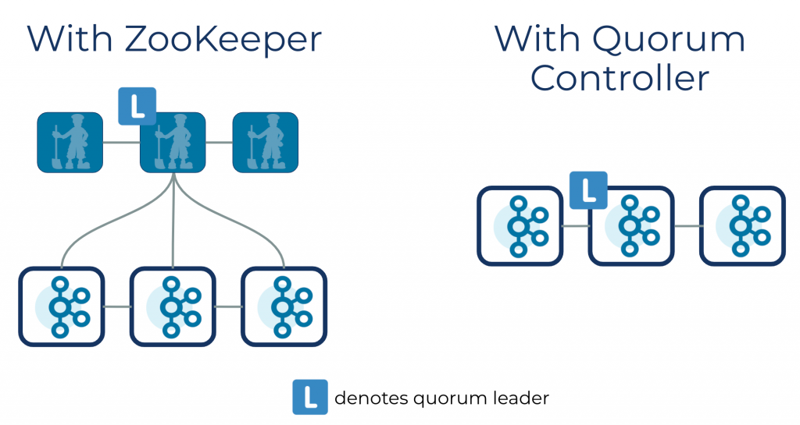

## Introduction


If you opt to run Kafka using the new quorum controller,
all metadata responsibilities previously undertaken by the Kafka controller and ZooKeeper are merged into this one new service, running inside the Kafka cluster itself. 
The quorum controller can also run on dedicated hardware should you have a use case that demands it.

<div style="text-align: center;">



</div>

<p style="text-align: center;">
Fig.1. Quorum Controller
</p>

```scala
  override def startup(): Unit = {
    Mx4jLoader.maybeLoad()
    // Note that we startup `RaftManager` first so that the controller and broker
    // can register listeners during initialization.
    raftManager.startup()
    controller.foreach(_.startup())
    broker.foreach(_.startup())
    AppInfoParser.registerAppInfo(Server.MetricsPrefix, config.brokerId.toString, metrics, time.milliseconds())
    info(KafkaBroker.STARTED_MESSAGE)
  }
```

RaftManager
```scala
  def startup(): Unit = {
    // Update the voter endpoints (if valid) with what's in RaftConfig
    val voterAddresses: util.Map[Integer, AddressSpec] = controllerQuorumVotersFuture.get()
    for (voterAddressEntry <- voterAddresses.entrySet.asScala) {
      voterAddressEntry.getValue match {
        case spec: InetAddressSpec =>
          netChannel.updateEndpoint(voterAddressEntry.getKey, spec)
        case _: UnknownAddressSpec =>
          info(s"Skipping channel update for destination ID: ${voterAddressEntry.getKey} " +
            s"because of non-routable endpoint: ${NON_ROUTABLE_ADDRESS.toString}")
        case invalid: AddressSpec =>
          warn(s"Unexpected address spec (type: ${invalid.getClass}) for channel update for " +
            s"destination ID: ${voterAddressEntry.getKey}")
      }
    }
    netChannel.start()
    raftIoThread.start()
  }
```

### state

This class is responsible for managing the current state of this node and ensuring
only valid state transitions. Below we define the possible state transitions and
how they are triggered:

Unattached|Resigned transitions to:
Unattached: After learning of a new election with a higher epoch
Voted: After granting a vote to a candidate
Candidate: After expiration of the election timeout
Follower: After discovering a leader with an equal or larger epoch

Voted transitions to:
Unattached: After learning of a new election with a higher epoch
Candidate: After expiration of the election timeout

Candidate transitions to:
Unattached: After learning of a new election with a higher epoch
Candidate: After expiration of the election timeout
Leader: After receiving a majority of votes

Leader transitions to:
Unattached: After learning of a new election with a higher epoch
Resigned: When shutting down gracefully

Follower transitions to:
Unattached: After learning of a new election with a higher epoch
Candidate: After expiration of the fetch timeout
Follower: After discovering a leader with a larger epoch

Observers follow a simpler state machine. The Voted/Candidate/Leader/Resigned
states are not possible for observers, so the only transitions that are possible
are between Unattached and Follower.

Unattached transitions to:
Unattached: After learning of a new election with a higher epoch
Follower: After discovering a leader with an equal or larger epoch

Follower transitions to:
Unattached: After learning of a new election with a higher epoch
Follower: After discovering a leader with a larger epoch


```scala
class KafkaRaftClient {
  public void poll() {
    pollListeners();
    
    long pollStateTimeoutMs = pollCurrentState(currentTimeMs);
    
    long cleaningTimeoutMs = snapshotCleaner.maybeClean(currentTimeMs);

    RaftMessage message = messageQueue.poll(pollTimeoutMs);

    if (message != null) {
      handleInboundMessage(message, currentTimeMs);
    }
  }
}
```
#### pollCurrentState

```java
class KafkaRaftClient {
    private long pollCurrentState(long currentTimeMs) {
        if (quorum.isLeader()) {
            return pollLeader(currentTimeMs);
        } else if (quorum.isCandidate()) {
            return pollCandidate(currentTimeMs);
        } else if (quorum.isFollower()) {
            return pollFollower(currentTimeMs);
        } else if (quorum.isVoted()) {
            return pollVoted(currentTimeMs);
        } else if (quorum.isUnattached()) {
            return pollUnattached(currentTimeMs);
        } else if (quorum.isResigned()) {
            return pollResigned(currentTimeMs);
        } else {
            throw new IllegalStateException("Unexpected quorum state " + quorum);
        }
    }
}
```

##### pollLeader
```java
  private long pollLeader(long currentTimeMs) {
        LeaderState<T> state = quorum.leaderStateOrThrow();
        maybeFireLeaderChange(state);

        if (shutdown.get() != null || state.isResignRequested()) {
            transitionToResigned(state.nonLeaderVotersByDescendingFetchOffset());
            return 0L;
        }

        long timeUntilFlush = maybeAppendBatches(
            state,
            currentTimeMs
        );

        long timeUntilSend = maybeSendRequests(
            currentTimeMs,
            state.nonAcknowledgingVoters(),
            this::buildBeginQuorumEpochRequest
        );

        return Math.min(timeUntilFlush, timeUntilSend);
    }
```

##### pollFollower

```java
private long pollFollower(long currentTimeMs) {
        FollowerState state = quorum.followerStateOrThrow();
        if (quorum.isVoter()) {
            return pollFollowerAsVoter(state, currentTimeMs);
        } else {
            return pollFollowerAsObserver(state, currentTimeMs);
        }
    }
```

#### handleInboundMessage

```scala
private void handleInboundMessage(RaftMessage message, long currentTimeMs) {
  logger.trace("Received inbound message {}", message);

  if (message instanceof RaftRequest.Inbound) {
    RaftRequest.Inbound request = (RaftRequest.Inbound) message;
    handleRequest(request, currentTimeMs);
  } else if (message instanceof RaftResponse.Inbound) {
    RaftResponse.Inbound response = (RaftResponse.Inbound) message;
    ConnectionState connection = requestManager.getOrCreate(response.sourceId());
    if (connection.isResponseExpected(response.correlationId)) {
      handleResponse(response, currentTimeMs);
    } else {
      logger.debug("Ignoring response {} since it is no longer needed", response);
    }
  } else {
    throw new IllegalArgumentException("Unexpected message " + message);
  }
}
```
handleResponse

```scala
private void handleResponse(RaftResponse.Inbound response, long currentTimeMs) {
        // The response epoch matches the local epoch, so we can handle the response
        ApiKeys apiKey = ApiKeys.forId(response.data.apiKey());
        final boolean handledSuccessfully;

        switch (apiKey) {
            case FETCH:
                handledSuccessfully = handleFetchResponse(response, currentTimeMs);
                break;

            case VOTE:
                handledSuccessfully = handleVoteResponse(response, currentTimeMs);
                break;

            case BEGIN_QUORUM_EPOCH:
                handledSuccessfully = handleBeginQuorumEpochResponse(response, currentTimeMs);
                break;

            case END_QUORUM_EPOCH:
                handledSuccessfully = handleEndQuorumEpochResponse(response, currentTimeMs);
                break;

            case FETCH_SNAPSHOT:
                handledSuccessfully = handleFetchSnapshotResponse(response, currentTimeMs);
                break;

            default:
                throw new IllegalArgumentException("Received unexpected response type: " + apiKey);
        }

        ConnectionState connection = requestManager.getOrCreate(response.sourceId());
        if (handledSuccessfully) {
            connection.onResponseReceived(response.correlationId);
        } else {
            connection.onResponseError(response.correlationId, currentTimeMs);
        }
    }
```

## Links


## References

1. [Apache Kafka Made Simple: A First Glimpse of a Kafka Without ZooKeeper](https://www.confluent.io/blog/kafka-without-zookeeper-a-sneak-peek/)
