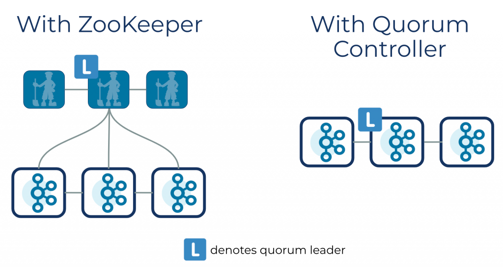

## Introduction

如果选择使用新的仲裁控制器运行 Kafka，
所有以前由 Kafka 控制器和 ZooKeeper 承担的元数据职责都合并到这个新服务中，在 Kafka 集群内部运行。
仲裁控制器也可以在专用硬件上运行，如果你的用例有这种需求。

<div style="text-align: center;">



</div>

<p style="text-align: center;">
Fig.1. Quorum Controller
</p>

```scala
  override def startup(): Unit = {
    Mx4jLoader.maybeLoad()
    // Note that we startup `RaftManager` first so that the controller and broker
    // can register listeners during initialization.
    raftManager.startup()
    controller.foreach(_.startup())
    broker.foreach(_.startup())
    AppInfoParser.registerAppInfo(Server.MetricsPrefix, config.brokerId.toString, metrics, time.milliseconds())
    info(KafkaBroker.STARTED_MESSAGE)
  }
```

RaftManager
```scala
  def startup(): Unit = {
    // Update the voter endpoints (if valid) with what's in RaftConfig
    val voterAddresses: util.Map[Integer, AddressSpec] = controllerQuorumVotersFuture.get()
    for (voterAddressEntry <- voterAddresses.entrySet.asScala) {
      voterAddressEntry.getValue match {
        case spec: InetAddressSpec =>
          netChannel.updateEndpoint(voterAddressEntry.getKey, spec)
        case _: UnknownAddressSpec =>
          info(s"Skipping channel update for destination ID: ${voterAddressEntry.getKey} " +
            s"because of non-routable endpoint: ${NON_ROUTABLE_ADDRESS.toString}")
        case invalid: AddressSpec =>
          warn(s"Unexpected address spec (type: ${invalid.getClass}) for channel update for " +
            s"destination ID: ${voterAddressEntry.getKey}")
      }
    }
    netChannel.start()
    raftIoThread.start()
  }
```

### state

此类负责管理当前节点的状态并确保
只有有效的状态转换。下面我们定义可能的状态转换以及
它们如何被触发：

Unattached|Resigned 转换为：
Unattached: 在了解到更高 epoch 的新选举后
Voted: 在授予投票给候选者后
Candidate: 在选举超时过期后
Follower: 在发现具有相等或更大 epoch 的 leader 后

Voted 转换为：
Unattached: 在了解到更高 epoch 的新选举后
Candidate: 在选举超时过期后

Candidate 转换为：
Unattached: 在了解到更高 epoch 的新选举后
Candidate: 在选举超时过期后
Leader: 在获得多数投票后

Leader 转换为：
Unattached: 在了解到更高 epoch 的新选举后
Resigned: 在正常关闭时

Follower 转换为：
Unattached: 在了解到更高 epoch 的新选举后
Candidate: 在 fetch 超时过期后
Follower: 在发现具有更大 epoch 的 leader 后

Observer 遵循更简单的状态机。Voted/Candidate/Leader/Resigned
状态对于 observer 是不可能的，因此唯一可能的转换
是在 Unattached 和 Follower 之间。

Unattached 转换为：
Unattached: 在了解到更高 epoch 的新选举后
Follower: 在发现具有相等或更大 epoch 的 leader 后

Follower 转换为：
Unattached: 在了解到更高 epoch 的新选举后
Follower: 在发现具有更大 epoch 的 leader 后

```scala
class KafkaRaftClient {
  public void poll() {
    pollListeners();
    
    long pollStateTimeoutMs = pollCurrentState(currentTimeMs);
    
    long cleaningTimeoutMs = snapshotCleaner.maybeClean(currentTimeMs);

    RaftMessage message = messageQueue.poll(pollTimeoutMs);

    if (message != null) {
      handleInboundMessage(message, currentTimeMs);
    }
  }
}
```
#### pollCurrentState

```java
class KafkaRaftClient {
    private long pollCurrentState(long currentTimeMs) {
        if (quorum.isLeader()) {
            return pollLeader(currentTimeMs);
        } else if (quorum.isCandidate()) {
            return pollCandidate(currentTimeMs);
        } else if (quorum.isFollower()) {
            return pollFollower(currentTimeMs);
        } else if (quorum.isVoted()) {
            return pollVoted(currentTimeMs);
        } else if (quorum.isUnattached()) {
            return pollUnattached(currentTimeMs);
        } else if (quorum.isResigned()) {
            return pollResigned(currentTimeMs);
        } else {
            throw new IllegalStateException("Unexpected quorum state " + quorum);
        }
    }
}
```

##### pollLeader
```java
  private long pollLeader(long currentTimeMs) {
        LeaderState<T> state = quorum.leaderStateOrThrow();
        maybeFireLeaderChange(state);

        if (shutdown.get() != null || state.isResignRequested()) {
            transitionToResigned(state.nonLeaderVotersByDescendingFetchOffset());
            return 0L;
        }

        long timeUntilFlush = maybeAppendBatches(
            state,
            currentTimeMs
        );

        long timeUntilSend = maybeSendRequests(
            currentTimeMs,
            state.nonAcknowledgingVoters(),
            this::buildBeginQuorumEpochRequest
        );

        return Math.min(timeUntilFlush, timeUntilSend);
    }
```

##### pollFollower

```java
private long pollFollower(long currentTimeMs) {
        FollowerState state = quorum.followerStateOrThrow();
        if (quorum.isVoter()) {
            return pollFollowerAsVoter(state, currentTimeMs);
        } else {
            return pollFollowerAsObserver(state, currentTimeMs);
        }
    }
```

#### handleInboundMessage

```scala
private void handleInboundMessage(RaftMessage message, long currentTimeMs) {
  logger.trace("Received inbound message {}", message);

  if (message instanceof RaftRequest.Inbound) {
    RaftRequest.Inbound request = (RaftRequest.Inbound) message;
    handleRequest(request, currentTimeMs);
  } else if (message instanceof RaftResponse.Inbound) {
    RaftResponse.Inbound response = (RaftResponse.Inbound) message;
    ConnectionState connection = requestManager.getOrCreate(response.sourceId());
    if (connection.isResponseExpected(response.correlationId)) {
      handleResponse(response, currentTimeMs);
    } else {
      logger.debug("Ignoring response {} since it is no longer needed", response);
    }
  } else {
    throw new IllegalArgumentException("Unexpected message " + message);
  }
}
```
handleResponse

```scala
private void handleResponse(RaftResponse.Inbound response, long currentTimeMs) {
        // The response epoch matches the local epoch, so we can handle the response
        ApiKeys apiKey = ApiKeys.forId(response.data.apiKey());
        final boolean handledSuccessfully;

        switch (apiKey) {
            case FETCH:
                handledSuccessfully = handleFetchResponse(response, currentTimeMs);
                break;

            case VOTE:
                handledSuccessfully = handleVoteResponse(response, currentTimeMs);
                break;

            case BEGIN_QUORUM_EPOCH:
                handledSuccessfully = handleBeginQuorumEpochResponse(response, currentTimeMs);
                break;

            case END_QUORUM_EPOCH:
                handledSuccessfully = handleEndQuorumEpochResponse(response, currentTimeMs);
                break;

            case FETCH_SNAPSHOT:
                handledSuccessfully = handleFetchSnapshotResponse(response, currentTimeMs);
                break;

            default:
                throw new IllegalArgumentException("Received unexpected response type: " + apiKey);
        }

        ConnectionState connection = requestManager.getOrCreate(response.sourceId());
        if (handledSuccessfully) {
            connection.onResponseReceived(response.correlationId);
        } else {
            connection.onResponseError(response.correlationId, currentTimeMs);
        }
    }
```

## Links


## References

1. [KIP-500: Replace ZooKeeper with a Self-Managed Metadata Quorum](https://cwiki.apache.org/confluence/display/KAFKA/KIP-500%3A+Replace+ZooKeeper+with+a+Self-Managed+Metadata+Quorum)
2. [Apache Kafka Made Simple: A First Glimpse of a Kafka Without ZooKeeper](https://www.confluent.io/blog/kafka-without-zookeeper-a-sneak-peek/)
