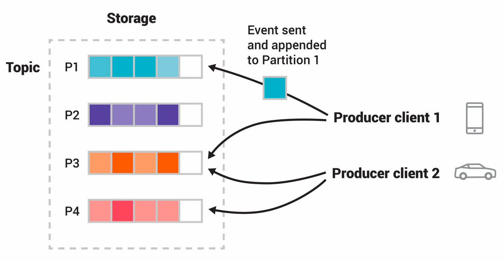

## Introduction

[Apache Kafka](https://kafka.apache.org/) is an open-source distributed **event streaming** platform used by thousands of companies for high-performance data pipelines, streaming analytics, data integration, and mission-critical applications.
Kafka is a distributed system consisting of servers and clients that communicate via a high-performance [TCP network protocol](/docs/CS/CN/TCP.md).
It can be deployed on bare-metal hardware, virtual machines, and containers in on-premise as well as cloud environments.

### Event Streaming

Event streaming is the digital equivalent of the human body's central nervous system.
It is the technological foundation for the 'always-on' world where businesses are increasingly software-defined and automated, and where the user of software is more software.
Technically speaking, event streaming is the practice of capturing data in real-time from event sources like databases, sensors, mobile devices, cloud services,
and software applications in the form of streams of events; storing these event streams durably for later retrieval; manipulating, processing, and reacting to the event streams in real-time as well as retrospectively;
and routing the event streams to different destination technologies as needed.
Event streaming thus ensures a continuous flow and interpretation of data so that the right information is at the right place, at the right time.

Kafka combines three key capabilities so you can implement your use cases for event streaming end-to-end with a single battle-tested solution:

- To publish (write) and subscribe to (read) streams of events, including continuous import/export of your data from other systems.
- To store streams of events durably and reliably for as long as you want.
- To process streams of events as they occur or retrospectively.

### Main Concepts and Terminology

An **event** records the fact that "something happened" in the world or in your business. It is also called record or message in the documentation.
When you read or write data to Kafka, you do this in the form of events. Conceptually, an event has a key, value, timestamp, and optional metadata headers.

Messages consist of a variable-length header, a variable-length opaque key byte array and a variable-length opaque value byte array.

**Producers** are those client applications that publish (write) events to Kafka, and **consumers** are those that subscribe to (read and process) these events.
In Kafka, producers and consumers are fully decoupled and agnostic of each other, which is a key design element to achieve the high scalability that Kafka is known for.
For example, producers never need to wait for consumers. Kafka provides various guarantees such as the ability to process events exactly-once.

Events are organized and durably stored in  **topics** . Very simplified, a topic is similar to a folder in a filesystem, and the events are the files in that folder.
Topics in Kafka are always multi-producer and multi-subscriber: a topic can have zero, one, or many producers that write events to it, as well as zero, one, or many consumers that subscribe to these events.
**Events in a topic can be read as often as needed—unlike traditional messaging systems, events are not deleted after consumption.**
Instead, you define for how long Kafka should retain your events through a per-topic configuration setting, after which old events will be discarded.
Kafka's performance is effectively constant with respect to data size, so storing data for a long time is perfectly fine.

Topics are  **partitioned** , meaning a topic is spread over a number of "buckets" located on different Kafka brokers.
This distributed placement of your data is very important for scalability because it allows client applications to both read and write the data from/to many brokers at the same time.
When a new event is published to a topic, it is actually appended to one of the topic's partitions.
Events with the same event key (e.g., a customer or vehicle ID) are written to the same partition, and Kafka guarantees that any consumer of a given topic-partition will always read that partition's events in exactly the same order as they were written.

<div style="text-align: center;">



</div>

<p style="text-align: center;">
Fig.1. This example topic has four partitions P1–P4. 
<br>
Two different producer clients are publishing, independently from each other, new events to the topic by writing events over the network to the topic's partitions.
<br>
Events with the same key (denoted by their color in the figure) are written to the same partition. 
Note that both producers can write to the same partition if appropriate.
</p>

To make your data fault-tolerant and highly-available, every topic can be  **replicated** , even across geo-regions or datacenters, so that there are always multiple brokers that have a copy of the data just in case things go wrong, you want to do maintenance on the brokers, and so on.
A common production setting is a replication factor of 3, i.e., there will always be three copies of your data. This replication is performed at the level of topic-partitions.

### Message Delivery Semantics

Recall the [message delivery semantics](/docs/CS/MQ/MQ.md?id=Message-Delivery-Semantics).

Now let's describe the semantics from the point-of-view of the consumer.
All replicas have the exact same log with the same offsets. The consumer controls its position in this log.
If the consumer never crashed it could just store this position in memory, but if the consumer fails and we want this topic partition to be taken over by another process the new process will need to choose an appropriate position from which to start processing.
Let's say the consumer reads some messages -- it has several options for processing the messages and updating its position.

1. It can read the messages, then save its position in the log, and finally process the messages.
   In this case there is a possibility that the consumer process crashes after saving its position but before saving the output of its message processing.
   In this case the process that took over processing would start at the saved position even though a few messages prior to that position had not been processed.
   This corresponds to "at-most-once" semantics as in the case of a consumer failure messages may not be processed.
2. It can read the messages, process the messages, and finally save its position.
   In this case there is a possibility that the consumer process crashes after processing messages but before saving its position.
   In this case when the new process takes over the first few messages it receives will already have been processed.
   This corresponds to the "at-least-once" semantics in the case of consumer failure.
   In many cases messages have a primary key and so the updates are idempotent (receiving the same message twice just overwrites a record with another copy of itself).

So what about exactly once semantics (i.e. the thing you actually want)?
When consuming from a Kafka topic and producing to another topic (as in a application), we can leverage the new transactional producer capabilities in 0.11.0.0 that were mentioned above.
The consumer's position is stored as a message in a topic, so we can write the offset to Kafka in the same transaction as the output topics receiving the processed data.
If the transaction is aborted, the consumer's position will revert to its old value and the produced data on the output topics will not be visible to other consumers, depending on their "isolation level."
In the default "read_uncommitted" isolation level, all messages are visible to consumers even if they were part of an aborted transaction, but in "read_committed,"
the consumer will only return messages from transactions which were committed (and any messages which were not part of a transaction).

When writing to an external system, the limitation is in the need to coordinate the consumer's position with what is actually stored as output.
The classic way of achieving this would be to introduce a two-phase commit between the storage of the consumer position and the storage of the consumers output.
But this can be handled more simply and generally by letting the consumer store its offset in the same place as its output. This is better because many of the output systems a consumer might want to write to will not support a two-phase commit.
As an example of this, consider a Kafka Connect connector which populates data in HDFS along with the offsets of the data it reads so that it is guaranteed that either data and offsets are both updated or neither is.
We follow similar patterns for many other data systems which require these stronger semantics and for which the messages do not have a primary key to allow for deduplication.

So effectively Kafka supports exactly-once delivery in Kafka Streams, and the transactional producer/consumer can be used generally to provide exactly-once delivery when transferring and processing data between Kafka topics.
Exactly-once delivery for other destination systems generally requires cooperation with such systems, but Kafka provides the offset which makes implementing this feasible (see also Kafka Connect).
Otherwise, Kafka guarantees at-least-once delivery by default, and allows the user to implement at-most-once delivery by disabling retries on the producer and committing offsets in the consumer prior to processing a batch of messages.

Notes:

1. check the `server.properties` before start Kafka

- Consumer Group improve TPS

Rebalance

## Efficiency

The small I/O problem happens both between the client and the server and in the server's own persistent operations.
To avoid this, our protocol is built around a "message set" abstraction that naturally groups messages together. This allows network requests to group messages together and amortize the overhead of the network roundtrip rather than sending a single message at a time. The server in turn appends chunks of messages to its log in one go, and the consumer fetches large linear chunks at a time.
This simple optimization produces orders of magnitude speed up. Batching leads to larger network packets, larger sequential disk operations, contiguous memory blocks, and so on, all of which allows Kafka to turn a bursty stream of random message writes into linear writes that flow to the consumers.

The other inefficiency is in byte copying.

The message log maintained by the broker is itself just a directory of files, each populated by a sequence of message sets that have been written to disk in the same format used by the producer and consumer.
Maintaining this common format allows optimization of the most important operation: network transfer of persistent log chunks.
Modern unix operating systems offer a highly optimized code path for transferring data out of pagecache to a socket; in Linux this is done with the sendfile system call.

The common data path for transfer of data from file to socket:

- The operating system reads data from the disk into pagecache in kernel space
- The application reads the data from kernel space into a user-space buffer
- The application writes the data back into kernel space into a socket buffer
- The operating system copies the data from the socket buffer to the NIC buffer where it is sent over the network

This is clearly inefficient, there are four copies and two system calls.
Using sendfile, this re-copying is avoided by allowing the OS to send the data from pagecache to the network directly.
So in this optimized path, only the final copy to the NIC buffer is needed.

We expect a common use case to be multiple consumers on a topic.
Using the zero-copy optimization above, data is copied into pagecache exactly once and reused on each consumption instead of being stored in memory and copied out to user-space every time it is read.
This allows messages to be consumed at a rate that approaches the limit of the network connection.
This combination of pagecache and sendfile means that on a Kafka cluster where the consumers are mostly caught up you will see no read activity on the disks whatsoever as they will be serving data entirely from cache.

TLS/SSL libraries operate at the user space (in-kernel SSL_sendfile is currently not supported by Kafka).
Due to this restriction, sendfile is not used when SSL is enabled. For enabling SSL configuration, refer to `security.protocol` and `security.inter.broker.protocol`.

> TODO: How about [QUIC](/docs/CS/CN/HTTP/QUIC.md)(with TLS libraries operate at the user space)?

### Compression

multi-compression versions

The compression type to use:

- none
- gzip
- snappy
- lz4
- zstd

We should only load classes from a given compression library when we actually use said compression library.
This is because compression libraries include native code for a set of platforms and we want to avoid errors in case the platform is not supported and the compression library is not actually used.
To ensure this, we only reference compression library code from classes that are only invoked when actual usage happens.

And there are some changes for snappy and zstd:
<br>
use `Class.forName()` and Reflection -> <br>
Method handles were designed to be faster than Core Reflection, particularly if the method handle can be stored in a static final field (the JVM can then optimise the call as if it was a regular method call).
Since the code is of similar complexity (and simpler if we consider the whole PR), I am treating this as a clean-up instead of a performance improvement (which would require doing benchmarks). -> <br>
Move the logic to separate classes that are only invoked when the relevant compression library is actually used.
Place such classes in their own package and enforce via checkstyle that only these classes refer to compression library packages.

#### SocketServer

监听Socket请求，提供Socket服务模块。

##### Acceptor

监听Socket连接，Acceptor初始化主要步骤如下：

- 开启Socket服务
- 注册Accept事件
- 监听此ServerChannel上ACCEPT事件，事件发生时轮询把对应SocketChannel转交给Processor处理线程

##### Processor

转发Socket请求与响应，Processor初始化。

##### RequestChannel

缓存Socket请求和响应

#### KafkaRequestHandlerPool

处理Socket请求线程池，默认为8个。

循环调用requestChannel的Request阻塞队列中获取请求，

判断请求类型

#### LogManager

日志管理模块。

#### ReplicaManager

#### OffsetManager

偏移量管理模块

#### TopicConfigManager

#### KafkaController

Topic 无序

paritition内部有序, 同一个key只会散列到同一个parition, 可以设置业务唯一性的key来保证消费顺序

消息重试:消息存储 异步重试

消息积压: 减小传输数据大小 IO压力 路由分配规则

高并发下重复主键是否需加锁

消息重复:幂等性

环境隔离

消息恢复

## Controller

It is also important to optimize the leadership election process as that is the critical window of unavailability.
A naive implementation of leader election would end up running an election per partition for all partitions a node hosted when that node failed.
As discussed above in the section on replication, Kafka clusters have a special role known as the "controller" which is responsible for managing the registration of brokers.
If the controller detects the failure of a broker, it is responsible for electing one of the remaining members of the ISR to serve as the new leader.
The result is that we are able to batch together many of the required leadership change notifications which makes the election process far cheaper and faster for a large number of partitions.
If the controller itself fails, then another controller will be elected.

QuorumController implements the main logic of the KRaft (Kafka Raft Metadata) mode controller.
The node which is the leader of the metadata log becomes the active controller.
All other nodes remain in standby mode. Standby controllers cannot create new metadata log entries.
They just replay the metadata log entries that the current active controller has created.
The QuorumController is **single-threaded**. A single event handler thread performs most operations.
This avoids the need for complex locking.
The controller exposes an *asynchronous, futures-based API* to the world.
This reflects the fact that the controller may have several operations in progress at any given point.
The future associated with each operation will not be completed until the results of the operation have been made durable to the metadata log.

1. Register Brokers
2. Register Topics
3. load Balance

### quorum replace zookeeper

why

1. 强依赖 维护困难
2. Zookeeper CP 影响性能

[KIP-500: Replace ZooKeeper with a Self-Managed Metadata Quorum](https://cwiki.apache.org/confluence/display/KAFKA/KIP-500%3A+Replace+ZooKeeper+with+a+Self-Managed+Metadata+Quorum)

We would like to remove this dependency on ZooKeeper.
This will enable us to manage metadata in a more scalable and robust way, enabling support for more partitions.
It will also simplify the deployment and configuration of Kafka.

#### Metadata as an Event Log

We often talk about the benefits of managing state as a stream of events.
A single number, the offset, describes a consumer's position in the stream.
Multiple consumers can quickly catch up to the latest state simply by replaying all the events newer than their current offset.
The log establishes a clear ordering between events, and ensures that the consumers always move along a single timeline.

However, although our users enjoy these benefits, Kafka itself has been left out.  We treat changes to metadata as isolated changes with no relationship to each other.
When the controller pushes out state change notifications (such as LeaderAndIsrRequest) to other brokers in the cluster, it is possible for brokers to get some of the changes, but not all.
Although the controller retries several times, it eventually give up.  This can leave brokers in a divergent state.

Worse still, although ZooKeeper is the store of record, the state in ZooKeeper often doesn't match the state that is held in memory in the controller.
For example, when a partition leader changes its ISR in ZK, the controller will typically not learn about these changes for many seconds.
There is no generic way for the controller to follow the ZooKeeper event log.
Although the controller can set one-shot watches, the number of watches is limited for performance reasons.
When a watch triggers, it doesn't tell the controller the current state-- only that the state has changed.
By the time the controller re-reads the znode and sets up a new watch, the state may have changed from what it was when the watch originally fired.
If there is no watch set, the controller may not learn about the change at all.  In some cases, restarting the controller is the only way to resolve the discrepancy.

Rather than being stored in a separate system, metadata should be stored in Kafka itself.  This will avoid all the problems associated with discrepancies between the controller state and the Zookeeper state.
Rather than pushing out notifications to brokers, brokers should simply consume metadata events from the event log.  This ensures that metadata changes will always arrive in the same order.
Brokers will be able to store metadata locally in a file.  When they start up, they will only need to read what has changed from the controller, not the full state.
This will let us support more partitions with less CPU consumption.

#### The Controller Quorum

The controller nodes comprise a Raft quorum which manages the metadata log.  This log contains information about each change to the cluster metadata.  Everything that is currently stored in ZooKeeper, such as topics, partitions, ISRs, configurations, and so on, will be stored in this log.

Using the Raft algorithm, the controller nodes will elect a leader from amongst themselves, without relying on any external system.  The leader of the metadata log is called the active controller.  The active controller handles all RPCs made from the brokers.  The follower controllers replicate the data which is written to the active controller, and serve as hot standbys if the active controller should fail.  Because the controllers will now all track the latest state, controller failover will not require a lengthy reloading period where we transfer all the state to the new controller.

Just like ZooKeeper, Raft requires a majority of nodes to be running in order to continue running.  Therefore, a three-node controller cluster can survive one failure.  A five-node controller cluster can survive two failures, and so on.

Periodically, the controllers will write out a snapshot of the metadata to disk.  While this is conceptually similar to compaction, the code path will be a bit different because we can simply read the state from memory rather than re-reading the log from disk.

#### Broker Metadata Management

Instead of the controller pushing out updates to the other brokers, those brokers will fetch updates from the active controller via the new MetadataFetch API.

A MetadataFetch is similar to a fetch request.  Just like with a fetch request, the broker will track the offset of the last updates it fetched, and only request newer updates from the active controller.

The broker will persist the metadata it fetched to disk.  
This will allow the broker to start up very quickly, even if there are hundreds of thousands or even millions of partitions. 
(Note that since this persistence is an optimization, we can leave it out of the first version, if it makes development easier.)

Most of the time, the broker should only need to fetch the deltas, not the full state.  
However, if the broker is too far behind the active controller, or if the broker has no cached metadata at all, the controller will send a full metadata image rather than a series of deltas.

## Producer

Load balancing

The client controls which partition it publishes messages to. This can be done at random, implementing a kind of random load balancing, or it can be done by some semantic partitioning function.

Asynchronous send
Batching is one of the big drivers of efficiency, and to enable batching the Kafka producer will attempt to accumulate data in memory and to send out larger batches in a single request.
The batching can be configured to accumulate no more than a fixed number of messages and to wait no longer than some fixed latency bound (say 64k or 10 ms).
This allows the accumulation of more bytes to send, and few larger I/O operations on the servers.
This buffering is configurable and gives a mechanism to trade off a small amount of additional latency for better throughput.

A Kafka client that publishes records to the Kafka cluster.
The producer is **thread safe** and sharing a **single producer instance** across threads will generally be faster than having multiple instances.

Here is a simple example of using the producer to send records with strings containing sequential numbers as the key/value pairs.

```java
 Properties props = new Properties();
 props.put("bootstrap.servers", "localhost:9092");
 props.put("linger.ms", 1);
 props.put("key.serializer", "org.apache.kafka.common.serialization.StringSerializer");
 props.put("value.serializer", "org.apache.kafka.common.serialization.StringSerializer");

 Producer<String, String> producer = new KafkaProducer<>(props);
 for (int i = 0; i < 100; i++)
     producer.send(new ProducerRecord<String, String>("my-topic", Integer.toString(i), Integer.toString(i)));

 producer.close();
```

The producer consists of a pool of buffer space that holds records that haven't yet been transmitted to the server as well as a background I/O thread that is responsible for turning these records into requests and transmitting them to the cluster.
Failure to close the producer after use will leak these resources.

### send

A container that holds the list ProducerInterceptor and wraps calls to the chain of custom interceptors.

A plugin interface that allows you to intercept (and possibly mutate) the records received by the producer before they are published to the Kafka cluster.
This class will get producer config properties via configure() method, including clientId assigned by KafkaProducer if not specified in the producer config. The interceptor implementation needs to be aware that it will be sharing producer config namespace with other interceptors and serializers, and ensure that there are no conflicts.

**Exceptions thrown by ProducerInterceptor methods will be caught, logged, but not propagated further.** As a result, if the user configures the interceptor with the wrong key and value type parameters, the producer will not throw an exception, just log the errors.
ProducerInterceptor callbacks may be called from multiple threads. Interceptor implementation must ensure thread-safety, if needed.

Implement org.apache.kafka.common.ClusterResourceListener to receive cluster metadata once it's available. Please see the class documentation for ClusterResourceListener for more information.

```java
public interface ProducerInterceptor<K, V> extends Configurable, AutoCloseable {
  
    ProducerRecord<K, V> onSend(ProducerRecord<K, V> record);
  
    void onAcknowledgement(RecordMetadata metadata, Exception exception);

    void close();
}
```

```plantuml
participant Actor
Actor -> KafkaProducer : send
activate KafkaProducer
KafkaProducer -> ProducerInterceptors : onSend
activate ProducerInterceptors
ProducerInterceptors --> KafkaProducer
deactivate ProducerInterceptors
KafkaProducer -> KafkaProducer : doSend
activate KafkaProducer
KafkaProducer -> KafkaProducer : waitOnMetadata
activate KafkaProducer
deactivate KafkaProducer
KafkaProducer -> Sender : wakeup
activate Sender
Sender --> KafkaProducer
deactivate Sender
KafkaProducer -> Serializer : serialize
activate Serializer
Serializer --> KafkaProducer
deactivate Serializer
KafkaProducer -> Serializer : serialize
activate Serializer
Serializer --> KafkaProducer
deactivate Serializer
KafkaProducer -> KafkaProducer : partition
activate KafkaProducer
deactivate KafkaProducer
KafkaProducer -> RecordAccumulator : append
activate RecordAccumulator
RecordAccumulator --> KafkaProducer
deactivate RecordAccumulator
KafkaProducer -> Sender : wakeup
activate Sender
Sender --> KafkaProducer
deactivate Sender
deactivate KafkaProducer
return
```

The `send()` method is asynchronous.
When called, it adds the record to a buffer of pending record sends and immediately returns.
This allows the producer to batch together individual records for efficiency.

```java
public class KafkaProducer<K, V> implements Producer<K, V> {
    @Override
    public Future<RecordMetadata> send(ProducerRecord<K, V> record, Callback callback) {
        // intercept the record, which can be potentially modified; this method does not throw exceptions
        ProducerRecord<K, V> interceptedRecord = this.interceptors.onSend(record);
        return doSend(interceptedRecord, callback);
    }
}
```

doSend():

1. waitOnMetadata
2. serializedKey and value
3. get partition
4. ensureValidRecordSize
5. new interceptCallback
6. append into buffer
7. if buffer if full or new buffer, wakeup [Sender](/docs/CS/MQ/Kafka/Network.md?id=Sender)(actually wakeup the Selector in KafkaClient).

```java
public class KafkaProducer<K, V> implements Producer<K, V> {
    private Future<RecordMetadata> doSend(ProducerRecord<K, V> record, Callback callback) {
        TopicPartition tp = null;
        try {
            throwIfProducerClosed();
  
            // first make sure the metadata for the topic is available
            ClusterAndWaitTime clusterAndWaitTime;
            clusterAndWaitTime = waitOnMetadata(record.topic(), record.partition(), maxBlockTimeMs);
            long remainingWaitMs = Math.max(0, maxBlockTimeMs - clusterAndWaitTime.waitedOnMetadataMs);
            Cluster cluster = clusterAndWaitTime.cluster;
  
            byte[] serializedKey;
            serializedKey = keySerializer.serialize(record.topic(), record.headers(), record.key());
            byte[] serializedValue;
            serializedValue = valueSerializer.serialize(record.topic(), record.headers(), record.value());
   
            int partition = partition(record, serializedKey, serializedValue, cluster);
            tp = new TopicPartition(record.topic(), partition);

            setReadOnly(record.headers());
            Header[] headers = record.headers().toArray();

            int serializedSize = AbstractRecords.estimateSizeInBytesUpperBound(apiVersions.maxUsableProduceMagic(),
                    compressionType, serializedKey, serializedValue, headers);
            ensureValidRecordSize(serializedSize);
            long timestamp = record.timestamp() == null ? time.milliseconds() : record.timestamp();
            // producer callback will make sure to call both 'callback' and interceptor callback
            Callback interceptCallback = new InterceptorCallback<>(callback, this.interceptors, tp);

            if (transactionManager != null && transactionManager.isTransactional())
                transactionManager.maybeAddPartitionToTransaction(tp);

            RecordAccumulator.RecordAppendResult result = accumulator.append(tp, timestamp, serializedKey,
                    serializedValue, headers, interceptCallback, remainingWaitMs);
            if (result.batchIsFull || result.newBatchCreated) {
                this.sender.wakeup();
            }
            return result.future;
            // handling exceptions and record the errors;
            // for API exceptions return them in the future,
            // for other exceptions throw directly
        } catch (Exception e) {
            // we notify interceptor about all exceptions, since onSend is called before anything else in this method
            this.interceptors.onSendError(record, tp, e);
            throw e;
        }
    }
}
```

#### append

The acks config controls the criteria under which requests are considered complete.
The default setting "all" will result in blocking on the full commit of the record, the slowest but most durable setting.

If the request fails, the producer can automatically retry.
The retries setting defaults to Integer.MAX_VALUE, and it's recommended to use delivery.timeout.ms to control retry behavior, instead of retries.

The producer maintains buffers of unsent records for each partition. These buffers are of a size specified by the batch.size config.
Making this larger can result in more batching, but requires more memory (since we will generally have one of these buffers for each active partition).

> [!NOTE]
>
> new Sender and start ioThread in the constructor of Producer. And create connections with all of cluster brokers.

Add a record to the accumulator, return the append result
The append result will contain the future metadata, and flag for whether the appended batch is full or a new batch is created

```java
public RecordAppendResult append(String topic,
                                     int partition,
                                     long timestamp,
                                     byte[] key,
                                     byte[] value,
                                     Header[] headers,
                                     AppendCallbacks callbacks,
                                     long maxTimeToBlock,
                                     boolean abortOnNewBatch,
                                     long nowMs,
                                     Cluster cluster) throws InterruptedException {
        TopicInfo topicInfo = topicInfoMap.computeIfAbsent(topic, k -> new TopicInfo(logContext, k, batchSize));

        // We keep track of the number of appending thread to make sure we do not miss batches in
        // abortIncompleteBatches().
        appendsInProgress.incrementAndGet();
        ByteBuffer buffer = null;
        if (headers == null) headers = Record.EMPTY_HEADERS;
        try {
            // Loop to retry in case we encounter partitioner's race conditions.
            while (true) {
                // If the message doesn't have any partition affinity, so we pick a partition based on the broker
                // availability and performance.  Note, that here we peek current partition before we hold the
                // deque lock, so we'll need to make sure that it's not changed while we were waiting for the
                // deque lock.
                final BuiltInPartitioner.StickyPartitionInfo partitionInfo;
                final int effectivePartition;
                if (partition == RecordMetadata.UNKNOWN_PARTITION) {
                    partitionInfo = topicInfo.builtInPartitioner.peekCurrentPartitionInfo(cluster);
                    effectivePartition = partitionInfo.partition();
                } else {
                    partitionInfo = null;
                    effectivePartition = partition;
                }

                // Now that we know the effective partition, let the caller know.
                setPartition(callbacks, effectivePartition);

                // check if we have an in-progress batch
                Deque<ProducerBatch> dq = topicInfo.batches.computeIfAbsent(effectivePartition, k -> new ArrayDeque<>());
                synchronized (dq) {
                    // After taking the lock, validate that the partition hasn't changed and retry.
                    if (partitionChanged(topic, topicInfo, partitionInfo, dq, nowMs, cluster))
                        continue;

                    RecordAppendResult appendResult = tryAppend(timestamp, key, value, headers, callbacks, dq, nowMs);
                    if (appendResult != null) {
                        // If queue has incomplete batches we disable switch (see comments in updatePartitionInfo).
                        boolean enableSwitch = allBatchesFull(dq);
                        topicInfo.builtInPartitioner.updatePartitionInfo(partitionInfo, appendResult.appendedBytes, cluster, enableSwitch);
                        return appendResult;
                    }
                }

                // we don't have an in-progress record batch try to allocate a new batch
                if (abortOnNewBatch) {
                    // Return a result that will cause another call to append.
                    return new RecordAppendResult(null, false, false, true, 0);
                }

                if (buffer == null) {
                    byte maxUsableMagic = apiVersions.maxUsableProduceMagic();
                    int size = Math.max(this.batchSize, AbstractRecords.estimateSizeInBytesUpperBound(maxUsableMagic, compression, key, value, headers));
                    log.trace("Allocating a new {} byte message buffer for topic {} partition {} with remaining timeout {}ms", size, topic, partition, maxTimeToBlock);
                    // This call may block if we exhausted buffer space.
                    buffer = free.allocate(size, maxTimeToBlock);
                    // Update the current time in case the buffer allocation blocked above.
                    // NOTE: getting time may be expensive, so calling it under a lock
                    // should be avoided.
                    nowMs = time.milliseconds();
                }

                synchronized (dq) {
                    // After taking the lock, validate that the partition hasn't changed and retry.
                    if (partitionChanged(topic, topicInfo, partitionInfo, dq, nowMs, cluster))
                        continue;

                    RecordAppendResult appendResult = appendNewBatch(topic, effectivePartition, dq, timestamp, key, value, headers, callbacks, buffer, nowMs);
                    // Set buffer to null, so that deallocate doesn't return it back to free pool, since it's used in the batch.
                    if (appendResult.newBatchCreated)
                        buffer = null;
                    // If queue has incomplete batches we disable switch (see comments in updatePartitionInfo).
                    boolean enableSwitch = allBatchesFull(dq);
                    topicInfo.builtInPartitioner.updatePartitionInfo(partitionInfo, appendResult.appendedBytes, cluster, enableSwitch);
                    return appendResult;
                }
            }
        } finally {
            free.deallocate(buffer);
            appendsInProgress.decrementAndGet();
        }
    }
```
#### ready

Get a list of nodes whose partitions are ready to be sent, and the earliest time at which any non-sendable partition will be ready; 
Also return the flag for whether there are any unknown leaders for the accumulated partition batches.
A destination node is ready to send data if:

1. There is at least one partition that is not backing off its send
2. and those partitions are not muted (to prevent reordering if "max.in.flight.requests.per.connection" is set to one)
3. and any of the following are true
   - The record set is full
   - The record set has sat in the accumulator for at least lingerMs milliseconds
   - The accumulator is out of memory and threads are blocking waiting for data (in this case all partitions are immediately considered ready).
   - The accumulator has been closed

```java
public ReadyCheckResult ready(Cluster cluster, long nowMs) {
        Set<Node> readyNodes = new HashSet<>();
        long nextReadyCheckDelayMs = Long.MAX_VALUE;
        Set<String> unknownLeaderTopics = new HashSet<>();
        // Go topic by topic so that we can get queue sizes for partitions in a topic and calculate
        // cumulative frequency table (used in partitioner).
        for (Map.Entry<String, TopicInfo> topicInfoEntry : this.topicInfoMap.entrySet()) {
            final String topic = topicInfoEntry.getKey();
            nextReadyCheckDelayMs = partitionReady(cluster, nowMs, topic, topicInfoEntry.getValue(), nextReadyCheckDelayMs, readyNodes, unknownLeaderTopics);
        }
        return new ReadyCheckResult(readyNodes, nextReadyCheckDelayMs, unknownLeaderTopics);
    }
```

TODO:

1. Connection with brokers
2. Connection close
   - Kafka will close idle timeout connection if clients set `connections.max.idle.ms!=-1`.
   - Otherwise, clients don't explicit close() and will keep CLOSE_WAIT until it send again.

### Idempotence

single partition, single session

### Transaction

all partitions, all sessions

```java
producer.initTransactions();
try {
            producer.beginTransaction();
            producer.send(record1);
            producer.send(record2);
            producer.commitTransaction();
} catch (KafkaException e) {
            producer.abortTransaction();
}
```

kafka.consumer.isolation-level: read_committed

## Consumer

**The Kafka consumer is NOT thread-safe.**
All network I/O happens in the thread of the application making the call.
It is the responsibility of the user to ensure that multi-threaded access is properly synchronized.
Un-synchronized access will result in ConcurrentModificationException.

1. One Consumer Per Thread
2. Decouple Consumption and Processing

Create Connections

- FindCoordinator
- connect Coordinator
- consume records

### Consumer Group

The consumer group state.

```java
public enum ConsumerGroupState {
   UNKNOWN("Unknown"),
   PREPARING_REBALANCE("PreparingRebalance"),
   COMPLETING_REBALANCE("CompletingRebalance"),
   STABLE("Stable"),
   DEAD("Dead"),
   EMPTY("Empty");
}
```

Best Practice: Consumer Number == Partition Number

```java

 try{
      while (true) {
         ConsumerRecords<String, String> records = consumer.poll(Duration.ofSeconds(1));
         process(records); // 处理消息
         commitAysnc(); // 使用异步提交规避阻塞
      }
   } catch(Exception e){
      handle(e); // 处理异常
   } finally{
      try {
         consumer.commitSync(); // 最后一次提交使用同步阻塞式提交
      } finally {
         consumer.close();
      }
   }

```

Standalone consumer must use different groupId

#### Latency

High latency will cause records not in page cache and can not use Zero Copy

```shell
bin/kafka-consumer-groups.sh --bootstrap-server localhost:9092 --describe --group <group name>
```

##### JMX

### Partition

The "Round-Robin" partitioner This partitioning strategy can be used when user wants to distribute the writes to all partitions equally. This is the behaviour regardless of record key hash.

NOTE this partitioner is deprecated and shouldn't be used. To use default partitioning logic remove partitioner.class configuration setting. See KIP-794 for more info. The default partitioning strategy:

- If a partition is specified in the record, use it
- If no partition is specified but a key is present choose a partition based on a hash of the key
- If no partition or key is present choose the sticky partition that changes when the batch is full. See KIP-480 for details about sticky partitioning.

NOTE this partitioner is deprecated and shouldn't be used. To use default partitioning logic remove partitioner.class configuration setting and set partitioner.ignore.keys=true.
See KIP-794 for more info. The partitioning strategy:

- If a partition is specified in the record, use it
- Otherwise choose the sticky partition that changes when the batch is full. NOTE: In contrast to the DefaultPartitioner, the record key is NOT used as part of the partitioning strategy in this partitioner.
  Records with the same key are not guaranteed to be sent to the same partition. See KIP-480 for details about sticky partitioning.

### poll

## Replication

Kafka replicates the log for each topic's partitions across a configurable number of servers (you can set this replication factor on a topic-by-topic basis).
This allows automatic failover to these replicas when a server in the cluster fails so messages remain available in the presence of failures.

The unit of replication is the topic partition. Under non-failure conditions, each partition in Kafka has a single leader and zero or more followers.
The total number of replicas including the leader constitute the replication factor. All writes go to the leader of the partition, and reads can go to the leader or the followers of the partition.
Typically, there are many more partitions than brokers and the leaders are evenly distributed among brokers.
The logs on the followers are identical to the leader's log—all have the same offsets and messages in the same order (though, of course, at any given time the leader may have a few as-yet unreplicated messages at the end of its log).

As with most distributed systems, automatically handling failures requires a precise definition of what it means for a node to be "alive."
In Kafka, a special node known as the "controller" is responsible for managing the registration of brokers in the cluster. Broker liveness has two conditions:

1. Brokers must maintain an active session with the controller in order to receive regular metadata updates.
2. Brokers acting as followers must replicate the writes from the leader and not fall "too far" behind.

We refer to nodes satisfying these two conditions as being "in sync" to avoid the vagueness of "alive" or "failed".
The leader keeps track of the set of "in sync" replicas, which is known as the *ISR*. If either of these conditions fail to be satisified, then the broker will be removed from the ISR.
For example, if a follower dies, then the controller will notice the failure through the loss of its session, and will remove the broker from the ISR.
On the other hand, if the follower lags too far behind the leader but still has an active session, then the leader can also remove it from the ISR.
The determination of lagging replicas is controlled through the replica.lag.time.max.ms configuration.
Replicas that cannot catch up to the end of the log on the leader within the max time set by this configuration are removed from the ISR.

In distributed systems terminology we only attempt to handle a "fail/recover" model of failures where nodes suddenly cease working and then later recover (perhaps without knowing that they have died).
Kafka does not handle so-called "Byzantine" failures in which nodes produce arbitrary or malicious responses (perhaps due to bugs or foul play).

We can now more precisely define that a message is considered committed when all replicas in the ISR for that partition have applied it to their log.
Only committed messages are ever given out to the consumer. This means that the consumer need not worry about potentially seeing a message that could be lost if the leader fails.
Producers, on the other hand, have the option of either waiting for the message to be committed or not, depending on their preference for tradeoff between latency and durability.
This preference is controlled by the acks setting that the producer uses.
Note that topics have a setting for the "minimum number" of in-sync replicas that is checked when the producer requests acknowledgment that a message has been written to the full set of in-sync replicas.
If a less stringent acknowledgement is requested by the producer, then the message can be committed, and consumed, even if the number of in-sync replicas is lower than the minimum (e.g. it can be as low as just the leader).
The guarantee that Kafka offers is that a committed message will not be lost, as long as there is at least one in sync replica alive, at all times.

Kafka will remain available in the presence of node failures after a short fail-over period, but may not remain available in the presence of network partitions.

### Quorums

At its heart a Kafka partition is a replicated log. The replicated log is one of the most basic primitives in distributed data systems, and there are many approaches for implementing one.
A replicated log can be used by other systems as a primitive for implementing other distributed systems in the state-machine style.

A replicated log models the process of coming into consensus on the order of a series of values (generally numbering the log entries 0, 1, 2, ...).
There are many ways to implement this, but the simplest and fastest is with a leader who chooses the ordering of values provided to it. As long as the leader remains alive, all followers need to only copy the values and ordering the leader chooses.

If you choose the number of acknowledgements required and the number of logs that must be compared to elect a leader such that there is guaranteed to be an overlap, then this is called a *Quorum*.

A common approach to this tradeoff is to use a majority vote for both the commit decision and the leader election.
This is not what Kafka does, but let's explore it anyway to understand the tradeoffs. Let's say we have 2f+1 replicas.
If f+1 replicas must receive a message prior to a commit being declared by the leader, and if we elect a new leader by electing the follower with the most complete log from at least f+1 replicas,
then, with no more than f failures, the leader is guaranteed to have all committed messages.
This is because among any f+1 replicas, there must be at least one replica that contains all committed messages.
That replica's log will be the most complete and therefore will be selected as the new leader.
There are many remaining details that each algorithm must handle (such as precisely defined what makes a log more complete, ensuring log consistency during leader failure or changing the set of servers in the replica set) but we will ignore these for now.

This majority vote approach has a very nice property: the latency is dependent on only the fastest servers.
That is, if the replication factor is three, the latency is determined by the faster follower not the slower one.

The downside of majority vote is that it doesn't take many failures to leave you with no electable leaders.
To tolerate one failure requires three copies of the data, and to tolerate two failures requires five copies of the data.
In our experience having only enough redundancy to tolerate a single failure is not enough for a practical system,
but doing every write five times, with 5x the disk space requirements and 1/5th the throughput, is not very practical for large volume data problems.
This is likely why quorum algorithms more commonly appear for shared cluster configuration such as ZooKeeper but are less common for primary data storage.
For example in HDFS the namenode's high-availability feature is built on a majority-vote-based journal, but this more expensive approach is not used for the data itself.

Kafka takes a slightly different approach to choosing its quorum set.
Instead of majority vote, Kafka dynamically maintains a set of in-sync replicas (ISR) that are caught-up to the leader.
Only members of this set are eligible for election as leader. A write to a Kafka partition is not considered committed until all in-sync replicas have received the write.
This ISR set is persisted in the cluster metadata whenever it changes. Because of this, any replica in the ISR is eligible to be elected leader.
This is an important factor for Kafka's usage model where there are many partitions and ensuring leadership balance is important.
With this ISR model and f+1 replicas, a Kafka topic can tolerate f failures without losing committed messages.

For most use cases we hope to handle, we think this tradeoff is a reasonable one.
In practice, to tolerate f failures, both the majority vote and the ISR approach will wait for the same number of replicas to acknowledge before committing a message
(e.g. to survive one failure a majority quorum needs three replicas and one acknowledgement and the ISR approach requires two replicas and one acknowledgement).
The ability to commit without the slowest servers is an advantage of the majority vote approach.
However, we think it is ameliorated by allowing the client to choose whether they block on the message commit or not, and the additional throughput and disk space due to the lower required replication factor is worth it.

Another important design distinction is that Kafka does not require that crashed nodes recover with all their data intact.
It is not uncommon for replication algorithms in this space to depend on the existence of "stable storage" that cannot be lost in any failure-recovery scenario without potential consistency violations.
There are two primary problems with this assumption. First, disk errors are the most common problem we observe in real operation of persistent data systems and they often do not leave data intact.
Secondly, even if this were not a problem, we do not want to require the use of fsync on every write for our consistency guarantees as this can reduce performance by two to three orders of magnitude.
Our protocol for allowing a replica to rejoin the ISR ensures that before rejoining, it must fully re-sync again even if it lost unflushed data in its crash.

Note that Kafka's guarantee with respect to data loss is predicated on at least one replica remaining in sync. If all the nodes replicating a partition die, this guarantee no longer holds.
However a practical system needs to do something reasonable when all the replicas die.
If you are unlucky enough to have this occur, it is important to consider what will happen. There are two behaviors that could be implemented:

1. Wait for a replica in the ISR to come back to life and choose this replica as the leader (hopefully it still has all its data).
2. Choose the first replica (not necessarily in the ISR) that comes back to life as the leader.

This is a simple tradeoff between availability and consistency. If we wait for replicas in the ISR, then we will remain unavailable as long as those replicas are down.
If such replicas were destroyed or their data was lost, then we are permanently down.
If, on the other hand, a non-in-sync replica comes back to life and we allow it to become leader, then its log becomes the source of truth even though it is not guaranteed to have every committed message.
By default from version 0.11.0.0, Kafka chooses the first strategy and favor waiting for a consistent replica.
This behavior can be changed using configuration property unclean.leader.election.enable, to support use cases where uptime is preferable to consistency.

This dilemma is not specific to Kafka. It exists in any quorum-based scheme.
For example in a majority voting scheme, if a majority of servers suffer a permanent failure, then you must either choose to lose 100% of your data or violate consistency by taking what remains on an existing server as your new source of truth.

When writing to Kafka, producers can choose whether they wait for the message to be acknowledged by 0,1 or all (-1) replicas. Note that "acknowledgement by all replicas" does not guarantee that the full set of assigned replicas have received the message. By default, when acks=all, acknowledgement happens as soon as all the current in-sync replicas have received the message. For example, if a topic is configured with only two replicas and one fails (i.e., only one in sync replica remains), then writes that specify acks=all will succeed. However, these writes could be lost if the remaining replica also fails. Although this ensures maximum availability of the partition, this behavior may be undesirable to some users who prefer durability over availability. Therefore, we provide two topic-level configurations that can be used to prefer message durability over availability:

1. Disable unclean leader election - if all replicas become unavailable, then the partition will remain unavailable until the most recent leader becomes available again. This effectively prefers unavailability over the risk of message loss. See the previous section on Unclean Leader Election for clarification.
2. Specify a minimum ISR size - the partition will only accept writes if the size of the ISR is above a certain minimum, in order to prevent the loss of messages that were written to just a single replica, which subsequently becomes unavailable. This setting only takes effect if the producer uses acks=all and guarantees that the message will be acknowledged by at least this many in-sync replicas. This setting offers a trade-off between consistency and availability. A higher setting for minimum ISR size guarantees better consistency since the message is guaranteed to be written to more replicas which reduces the probability that it will be lost. However, it reduces availability since the partition will be unavailable for writes if the number of in-sync replicas drops below the minimum threshold.

## Rebalance

1. Partitions
2. Topics
3. Consumers

All consumers stop and wait until rebalanced finished.

Coordinator

partitionId=Math.abs(groupId.hashCode() % offsetsTopicPartitionCount)

- session.timeout.ms = 6s。
- heartbeat.interval.ms = 2s
  max.poll.interval.ms
  Full GC STW

Choose a leader of consumers and let leader selects strategy.

### Consumer Offset

K,V

K: Topic, Partition, GroupId

offsets.topic.num.partitions

Compact commmitted ack


```java
public interface ConsumerRebalanceListener {

    void onPartitionsRevoked(Collection<TopicPartition> partitions);

    void onPartitionsAssigned(Collection<TopicPartition> partitions);

    default void onPartitionsLost(Collection<TopicPartition> partitions) {
        onPartitionsRevoked(partitions);
    }
}

```


## Interceptor

### ProducerInterceptor

### ConsumerInterceptor

### Record

RecordAccumulator

This class acts as a queue that accumulates records into MemoryRecords instances to be sent to the server.
The accumulator uses a bounded amount of memory and append calls will block when that memory is exhausted, unless this behavior is explicitly disabled.

## shutdown

The Kafka cluster will automatically detect any broker shutdown or failure and elect new leaders for the partitions on that machine.
This will occur whether a server fails or it is brought down intentionally for maintenance or configuration changes.
For the latter cases Kafka supports a more graceful mechanism for stopping a server than just killing it. When a server is stopped gracefully it has two optimizations it will take advantage of:
It will sync all its logs to disk to avoid needing to do any log recovery when it restarts (i.e. validating the checksum for all messages in the tail of the log).
Log recovery takes time so this speeds up intentional restarts.
It will migrate any partitions the server is the leader for to other replicas prior to shutting down.
This will make the leadership transfer faster and minimize the time each partition is unavailable to a few milliseconds.
Syncing the logs will happen automatically whenever the server is stopped other than by a hard kill, but the controlled leadership migration requires using a special setting:

```
controlled.shutdown.enable=true
```

Note that controlled shutdown will only succeed if all the partitions hosted on the broker have replicas (i.e. the replication factor is greater than 1 and at least one of these replicas is alive).
This is generally what you want since shutting down the last replica would make that topic partition unavailable.

## Configuration

## Buffer Pool

A pool of ByteBuffers kept under a given memory limit. This class is fairly specific to the needs of the producer.
In particular it has the following properties:

1. There is a special "poolable size" and buffers of this size are kept in a free list and recycled
2. It is fair. That is all memory is given to the longest waiting thread until it has sufficient memory.
   This prevents starvation or deadlock when a thread asks for a large chunk of memory and needs to block until multiple buffers are deallocated.

Allocate a buffer of the given size. This method blocks if there is not enough memory and the buffer pool is configured with blocking mode.

```java
public ByteBuffer allocate(int size, long maxTimeToBlockMs) throws InterruptedException {
        if (size > this.totalMemory)
            throw new IllegalArgumentException("Attempt to allocate " + size
                                               + " bytes, but there is a hard limit of "
                                               + this.totalMemory
                                               + " on memory allocations.");

        ByteBuffer buffer = null;
        this.lock.lock();

        if (this.closed) {
            this.lock.unlock();
            throw new KafkaException("Producer closed while allocating memory");
        }

        try {
            // check if we have a free buffer of the right size pooled
            if (size == poolableSize && !this.free.isEmpty())
                return this.free.pollFirst();

            // now check if the request is immediately satisfiable with the
            // memory on hand or if we need to block
            int freeListSize = freeSize() * this.poolableSize;
            if (this.nonPooledAvailableMemory + freeListSize >= size) {
                // we have enough unallocated or pooled memory to immediately
                // satisfy the request, but need to allocate the buffer
                freeUp(size);
                this.nonPooledAvailableMemory -= size;
            } else {
                // we are out of memory and will have to block
                int accumulated = 0;
                Condition moreMemory = this.lock.newCondition();
                try {
                    long remainingTimeToBlockNs = TimeUnit.MILLISECONDS.toNanos(maxTimeToBlockMs);
                    this.waiters.addLast(moreMemory);
                    // loop over and over until we have a buffer or have reserved
                    // enough memory to allocate one
                    while (accumulated < size) {
                        long startWaitNs = time.nanoseconds();
                        long timeNs;
                        boolean waitingTimeElapsed;
                        try {
                            waitingTimeElapsed = !moreMemory.await(remainingTimeToBlockNs, TimeUnit.NANOSECONDS);
                        } finally {
                            long endWaitNs = time.nanoseconds();
                            timeNs = Math.max(0L, endWaitNs - startWaitNs);
                            recordWaitTime(timeNs);
                        }

                        if (this.closed)
                            throw new KafkaException("Producer closed while allocating memory");

                        if (waitingTimeElapsed) {
                            this.metrics.sensor("buffer-exhausted-records").record();
                            throw new BufferExhaustedException("Failed to allocate " + size + " bytes within the configured max blocking time "
                                + maxTimeToBlockMs + " ms. Total memory: " + totalMemory() + " bytes. Available memory: " + availableMemory()
                                + " bytes. Poolable size: " + poolableSize() + " bytes");
                        }

                        remainingTimeToBlockNs -= timeNs;

                        // check if we can satisfy this request from the free list,
                        // otherwise allocate memory
                        if (accumulated == 0 && size == this.poolableSize && !this.free.isEmpty()) {
                            // just grab a buffer from the free list
                            buffer = this.free.pollFirst();
                            accumulated = size;
                        } else {
                            // we'll need to allocate memory, but we may only get
                            // part of what we need on this iteration
                            freeUp(size - accumulated);
                            int got = (int) Math.min(size - accumulated, this.nonPooledAvailableMemory);
                            this.nonPooledAvailableMemory -= got;
                            accumulated += got;
                        }
                    }
                    // Don't reclaim memory on throwable since nothing was thrown
                    accumulated = 0;
                } finally {
                    // When this loop was not able to successfully terminate don't loose available memory
                    this.nonPooledAvailableMemory += accumulated;
                    this.waiters.remove(moreMemory);
                }
            }
        } finally {
            // signal any additional waiters if there is more memory left
            // over for them
            try {
                if (!(this.nonPooledAvailableMemory == 0 && this.free.isEmpty()) && !this.waiters.isEmpty())
                    this.waiters.peekFirst().signal();
            } finally {
                // Another finally... otherwise find bugs complains
                lock.unlock();
            }
        }

        if (buffer == null)
            return safeAllocateByteBuffer(size);
        else
            return buffer;
    }
  
```

Return buffers to the pool. If they are of the poolable size add them to the free list, otherwise just mark the memory as free.

```java
  public void deallocate(ByteBuffer buffer, int size) {
        lock.lock();
        try {
            if (size == this.poolableSize && size == buffer.capacity()) {
                buffer.clear();
                this.free.add(buffer);
            } else {
                this.nonPooledAvailableMemory += size;
            }
            Condition moreMem = this.waiters.peekFirst();
            if (moreMem != null)
                moreMem.signal();
        } finally {
            lock.unlock();
        }
    }
```

## Performance

- disk
- bandwidth

## Links

- [MQ](/docs/CS/MQ/MQ.md?id=Kafka)

## References

1. [Kafka Documentation](https://kafka.apache.org/documentation/#design)
2. [Kafka: a Distributed Messaging System for Log Processing](http://notes.stephenholiday.com/Kafka.pdf)
3. [KSQL: Streaming SQL Engine for Apache Kafka](https://openproceedings.org/2019/conf/edbt/EDBT19_paper_329.pdf)
4. [Streams and Tables: Two Sides of the Same Coin](https://dl.acm.org/doi/10.1145/3242153.3242155)
5. [Building a Replicated Logging System with Apache Kafka](https://dl.acm.org/doi/10.14778/2824032.2824063)
