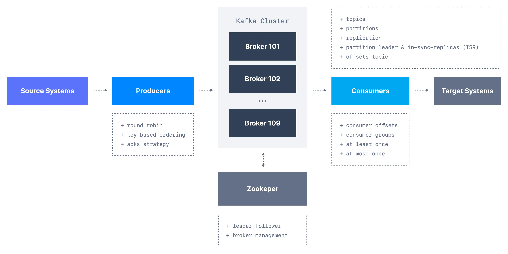
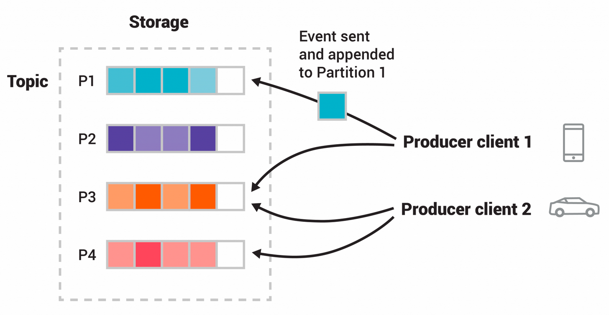

## Introduction

[Apache Kafka](https://kafka.apache.org/) 是一个开源的分布式**事件流**平台，被数千家公司用于高性能数据管道、流分析、数据集成和关键任务应用。
Kafka 是一个分布式系统，由通过高性能 [TCP 网络协议](/docs/CS/CN/TCP/TCP.md) 通信的服务器和客户端组成。
它可以部署在裸机硬件、虚拟机和容器中，无论是在本地还是云环境。

> [Kafka Design](https://kafka.apache.org/documentation/#design)
>
> 我们设计 Kafka 使其能够作为一个统一平台，处理大型公司可能拥有的所有实时数据流。
> 为此，我们必须考虑相当广泛的使用场景。
>
> - 它必须具有高吞吐量，以支持高容量事件流，例如实时日志聚合。
> - 它需要优雅地处理大数据积压，以支持来自离线系统的周期性数据加载。
> - 这也意味着系统必须处理低延迟交付，以应对更传统的消息传递用例。
> - 我们希望支持对这些数据流进行分区、分布式的实时处理，以创建新的派生数据流。这推动了我们的分区和消费者模型。
> - 最后，在数据流被馈送到其他数据系统进行服务的场景中，我们知道系统必须能够在机器故障时保证容错性。
>
> 支持这些用例使我们采用了许多独特元素的设计，更类似于数据库日志而非传统消息系统。

### Event Streaming

事件流在数字世界中相当于人体中枢神经系统的数字对应物。
它是"永远在线"世界的技术基础，在这个世界中，企业越来越由软件定义和自动化，软件的"用户"更多的是软件本身。
从技术上讲，事件流是从事件源（如数据库、传感器、移动设备、云服务和软件应用程序）以事件流的形式实时捕获数据；
持久化存储这些事件流以供后续检索；实时以及回顾性地操作、处理和响应事件流；
并根据需要将事件流路由到不同的目标技术。
事件流因此确保了数据的连续流动和解释，以便正确的信息在正确的时间到达正确的位置。

Kafka 结合了三个关键能力，让你可以使用一个经过实战验证的解决方案端到端地实现事件流用例：

- 发布（写入）和订阅（读取）事件流，包括从其他系统持续导入/导出数据。
- 持久可靠地存储事件流，时间长短由你决定。
- 在事件发生时或回顾性地处理事件流。

## Architecture

<div style="text-align: center;">



</div>

<p style="text-align: center;">
Fig.1. Apache Kafka Components.
</p>

我们将学习所有基础知识并理解各种 Apache Kafka 组件，例如：

- Kafka Topics
- Kafka Producers
- Kafka Consumers
- Kafka Consumer Groups and Consumer Offsets
- Kafka Brokers
- Kafka Topic Replication
- Zookeeper
- KRaft Mode

一个**事件**记录了"某事发生了"的事实，发生在世界或你的业务中。
在文档中它也被称为记录或消息。
当你向 Kafka 读写数据时，你以事件的形式进行操作。
从概念上讲，事件具有 key、value、timestamp 和可选的元数据 headers。

Kafka 中的数据单元称为消息。
消息由可变长度 header、可变长度不透明 key 字节数组和可变长度不透明 value 字节数组组成。

为了提高效率，消息以批次的形式写入 Kafka。
批次只是消息的集合，所有消息都生成到同一个 topic 和 partition。
每条消息单独进行一次网络往返会产生过多的开销，将消息收集在一起形成批次可以减少这种开销。
当然，这是延迟和吞吐量之间的权衡：批次越大，单位时间内可以处理的消息越多，但单个消息传播所需的时间也越长。
批次通常也被压缩，以更有效地传输和存储数据，但会消耗一些处理能力。

**Producers** 是那些发布（写入）事件到 Kafka 的客户端应用程序，而 **consumers** 是那些订阅（读取和处理）这些事件的客户端。
在 Kafka 中，生产者和消费者是完全解耦且互不知晓的，这是实现 Kafka 闻名的高可扩展性的关键设计元素。
例如，生产者永远不需要等待消费者。Kafka 提供了各种保证，例如能够恰好一次地处理事件。

事件被组织并持久化存储在 **topics** 中。
简单来说，topic 类似于文件系统中的文件夹，而事件是文件夹中的文件。
Kafka 中的 topic 始终是多生产者和多订阅者的：一个 topic 可以有零个、一个或多个生产者写入事件，也可以有零个、一个或多个消费者订阅这些事件。
**topic 中的事件可以根据需要反复读取——与传统消息系统不同，事件在消费后不会被删除。**
相反，你可以通过每个 topic 的配置设置来定义 Kafka 应该保留事件多长时间，之后旧事件将被丢弃。
Kafka 的性能在数据大小方面实际上是恒定的，因此长时间存储数据完全没有问题。

### Topics and partition

Topics 是**分区的**，这意味着一个 topic 分布在位于不同 Kafka broker 上的多个"桶"中。
这种数据的分布式放置对于可扩展性非常重要，因为它允许客户端应用程序同时从多个 broker 读写数据。
当新事件发布到 topic 时，它实际上被追加到该 topic 的一个分区中。
具有相同事件 key（例如，客户或车辆 ID）的事件被写入同一个分区，Kafka 保证给定 topic-partition 的任何消费者始终按照写入的完全相同的顺序读取该分区的事件。

<div style="text-align: center;">



</div>

<p style="text-align: center;">
Fig.2. 此示例 topic 有四个分区 P1–P4。
<br>
两个不同的生产者客户端独立地向该 topic 发布新事件，通过网络将事件写入 topic 的分区。
<br>
具有相同 key（图中以颜色区分）的事件被写入同一个分区。
注意，在适当的情况下，两个生产者可以写入同一个分区。
</p>

为了使你的数据具有容错性和高可用性，每个 topic 都可以被**复制**，甚至可以跨地域或数据中心，
这样总会有多个 broker 拥有数据的副本，以防出现问题、进行 broker 维护等。
常见的生产设置是复制因子为 3，即始终有三个数据副本。
这种复制是在 topic-partition 级别执行的。

### Message Delivery Semantics

回顾 [消息传递语义](/docs/CS/MQ/MQ.md?id=Message-Delivery-Semantics)。

现在让我们从消费者的角度描述语义。
所有副本都有完全相同的日志和相同的偏移量。消费者控制其在日志中的位置。
如果消费者从未崩溃，它可以将此位置存储在内存中，但如果消费者失败并且我们希望此 topic partition 由另一个进程接管，新进程将需要选择一个合适的位置开始处理。
假设消费者读取了一些消息——它有几种处理消息和更新其位置的选项。

1. 它可以读取消息，然后保存其在日志中的位置，最后处理消息。
   在这种情况下，消费者进程有可能在保存位置之后但在保存其消息处理输出之前崩溃。
   在这种情况下，接管处理的进程将从保存的位置开始，即使该位置之前的几条消息尚未被处理。
   这对应于"至多一次"语义，因为在消费者失败的情况下消息可能未被处理。
2. 它可以读取消息，处理消息，最后保存其位置。
   在这种情况下，消费者进程有可能在处理消息之后但在保存位置之前崩溃。
   在这种情况下，当新进程接管时，它接收到的前几条消息可能已经被处理过了。
   这对应于"至少一次"语义。
   在许多情况下，消息有主键，因此更新是幂等的（重复接收同一条消息只是用自身的另一个副本覆盖记录）。

那么恰好一次语义呢（即你真正想要的）？
当从 Kafka topic 消费并生成到另一个 topic 时（如在应用中），我们可以利用上面提到的 0.11.0.0 中的新事务性生产者能力。
消费者的位置作为消息存储在 topic 中，因此我们可以在与接收处理数据的输出 topic 相同的事务中将偏移量写入 Kafka。
如果事务中止，消费者的位置将回退到旧值，并且输出 topic 上生成的数据将不会对其他消费者可见，具体取决于它们的"隔离级别"。
在默认的"read_uncommitted"隔离级别下，所有消息对消费者都是可见的，即使它们属于已中止的事务，但在"read_committed"下，
消费者只返回来自已提交事务的消息（以及任何不属于事务的消息）。

当写入外部系统时，限制在于需要协调消费者的位置与实际存储的输出。
实现这一点的经典方法是引入消费者位置存储和消费者输出存储之间的两阶段提交。
但这可以更简单、更普遍地处理，方法是让消费者将其偏移量存储在与输出相同的位置。这样更好，因为消费者可能想要写入的许多输出系统不支持两阶段提交。
例如，考虑一个 Kafka Connect 连接器，它将数据填充到 HDFS 中，同时填充它所读取的数据的偏移量，从而保证数据和偏移量要么都更新，要么都不更新。
我们在许多其他需要这些更强语义的数据系统中遵循类似的模式，并且这些消息没有用于去重的主键。

因此，实际上 Kafka 在 Kafka Streams 中支持恰好一次交付，并且事务性生产者/消费者通常可用于在 Kafka topic 之间传输和处理数据时提供恰好一次交付。
其他目标系统的恰好一次交付通常需要与此类系统协作，但 Kafka 提供了偏移量，这使得实现这一点变得可行（另请参阅 Kafka Connect）。
否则，Kafka 默认保证至少一次交付，并允许用户通过在生产端禁用重试并在消费端处理一批消息之前提交偏移量来实现至多一次交付。

Notes:

1. 在启动 Kafka 之前检查 `server.properties`

- Consumer Group 提高 TPS

Rebalance

[Producer](/docs/CS/MQ/Kafka/Producer.md) 与 [Consumer](/docs/CS/MQ/Kafka/Consumer.md) 的对比

| Client          | Producer                     | Consumer      |
| --------------- | ---------------------------- | ------------- |
| Network         | NetworkClient                | NetworkClient |
| Background Task | Sender(start at newInstance) | Fetcher       |

- [Broker](/docs/CS/MQ/Kafka/Broker.md)

Apache Kafka 的一个关键特性是 retention，即消息在一定时间段内的持久存储。
Kafka broker 为 topic 配置了默认的保留设置，要么将消息保留一段时间（例如 7 天），要么直到 topic 达到一定字节大小（例如 1 GB）。
一旦达到这些限制，消息将被过期删除，因此保留配置是在任何时间点可用的最小数据量。
个别 topic 也可以配置自己的保留设置，以便消息只在其有用期间内存储。
例如，跟踪 topic 可能保留几天，而应用程序指标可能只保留几个小时。
Topic 也可以配置为日志压缩，这意味着 Kafka 只保留具有特定 key 的最后一条生成的消息。
这对于变更日志类型的数据很有用，其中只有最后一次更新是有意义的。

### Multiple Clusters

随着 Kafka 部署的增长，拥有多个集群通常是有利的。有几个原因：

- 不同类型数据的隔离
- 安全要求的隔离
- 多数据中心（灾难恢复）

特别是在使用多个数据中心时，通常需要在它们之间复制消息。
这样，在线应用程序可以访问两个站点的用户活动。
例如，如果用户在其个人资料中更改了公共信息，则无论搜索结果在哪个数据中心显示，该更改都必须可见。
或者，监控数据可以从多个站点收集到一个中央位置，在那里运行分析和告警系统。
Kafka 集群内的复制机制仅设计用于在单个集群内工作，而不是在多个集群之间。

Kafka 项目包含一个名为 MirrorMaker 的工具，用于此目的。
其核心是，MirrorMaker 只是一个 Kafka 消费者和生产者，通过队列连接在一起。
消息从一个 Kafka 集群消费，然后为另一个集群生成。

> [!TIP]
>
> 以下是 Kafka 开发人员可能选择实现自己的 socket server 而不是使用 Netty 的一些原因：
>
> 1. 性能：通过实现针对 Kafka 需求定制的自定义解决方案，开发人员可能能够优化 Kafka 用例的性能。定制实现允许开发人员针对 Kafka 的特定需求微调网络层，可能比使用 Netty 等更通用的库带来更好的性能。
> 2. 其余的原因是依赖项。

## Efficiency

小 I/O 问题既发生在客户端和服务器之间，也发生在服务器自身的持久化操作中。
为了避免这个问题，我们的协议建立在"消息集"抽象之上，自然地分组消息。这允许网络请求分组消息并分摊网络往返的开销，而不是一次发送一条消息。服务器依次将消息块一次性追加到其日志中，消费者一次获取大的线性块。
这个简单的优化带来了数量级的加速。批处理导致更大的网络数据包、更大的顺序磁盘操作、连续的内存块等，所有这些都允许 Kafka 将突发的随机消息写入流转换为流向消费者的线性写入。

另一个效率低下的问题在于字节复制。

broker 维护的消息日志本身只是一个目录的文件，每个文件由一系列消息集填充，这些消息集以生产者和消费者使用的相同格式写入磁盘。
维护这种通用格式可以优化最重要的操作：持久日志块的网络传输。
现代 Unix 操作系统为将数据从 pagecache 传输到 socket 提供了高度优化的代码路径；在 Linux 中，这是通过 sendfile 系统调用完成的。

数据从文件到 socket 传输的通用路径：

- 操作系统将数据从磁盘读取到内核空间的 pagecache 中
- 应用程序将数据从内核空间读取到用户空间缓冲区
- 应用程序将数据写回内核空间的 socket 缓冲区
- 操作系统将数据从 socket 缓冲区复制到 NIC 缓冲区，然后通过网络发送

这显然是低效的，有四次复制和两次系统调用。
使用 sendfile，通过允许 OS 直接将数据从 pagecache 发送到网络来避免这种重复复制。
因此在这种优化路径中，只需要最终复制到 NIC 缓冲区。

我们期望一个常见用例是一个 topic 上有多个消费者。
使用上述的零拷贝优化，数据被恰好复制到 pagecache 一次，并在每次消费时重用，而不是存储在内存中并在每次读取时复制到用户空间。
这允许消费者以接近网络连接限制的速率消费消息。
这种 pagecache 和 sendfile 的组合意味着，在消费者基本跟上的 Kafka 集群上，你根本不会看到任何磁盘读取活动，因为它们将完全从缓存提供服务。

TLS/SSL 库在用户空间运行（Kafka 目前不支持内核空间的 SSL_sendfile）。
由于这个限制，当启用 SSL 时，sendfile 不会被使用。要启用 SSL 配置，请参考 `security.protocol` 和 `security.inter.broker.protocol`。

> TODO: [QUIC](/docs/CS/CN/HTTP/QUIC.md) 怎么样（TLS 库在用户空间运行）？

### Compression

此功能在 Kafka 中引入了端到端的块压缩特性。
如果启用，数据将由生产者压缩，以压缩格式写入服务器，并由消费者解压缩。
压缩将以一定的解压成本提高消费者的吞吐量。
这在跨数据中心镜像数据时特别有用。
默认情况下，生产者消息以未压缩形式发送。

> Producer端压缩、Broker端保持、Consumer端解压

Broker重新压缩原因：compression type 与 producer 不同需要重新压缩
在以下情况之一中，我们无法进行原地分配：

1. 源和目标压缩编解码器不同
2. 当目标 magic 不等于批次的 magic 时，意味着需要格式转换
3. 当目标 magic 等于 V0 时，意味着需要重新分配绝对偏移量

多压缩版本

要使用的压缩类型：

- none
- gzip
- snappy
- lz4
- zstd

我们只应在实际使用某个压缩库时加载该库的类。
这是因为压缩库包含一组平台的本地代码，我们希望在不支持该平台且未实际使用该压缩库时避免错误。
为了确保这一点，我们只从实际使用时才被调用的类中引用压缩库代码。

对于 snappy 和 zstd 还有一些变化：
<br>
使用 `Class.forName()` 和反射 -> <br>
方法句柄的设计比核心反射更快，特别是如果方法句柄可以存储在静态 final 字段中（JVM 可以将其优化为常规方法调用）。
由于代码复杂度相似（如果考虑整个 PR 则更简单），我将其视为清理而非性能改进（这需要基准测试）。-> <br>
将逻辑移到单独的类中，这些类仅在实际使用相关压缩库时才被调用。
将这些类放在自己的包中，并通过 checkstyle 强制执行只有这些类引用压缩库包。

## Replication

Kafka 将每个 topic 分区的日志复制到可配置数量的服务器上（你可以逐个 topic 设置复制因子）。
这允许当集群中的服务器故障时自动故障转移到这些副本，从而在故障情况下消息仍然可用。

复制的单位是 topic partition。在无故障条件下，Kafka 中的每个 partition 都有一个 leader 和零个或多个 follower。
包括 leader 在内的副本总数构成复制因子。所有写入都发送到 partition 的 leader，读取可以发送到 partition 的 leader 或 follower。
通常，分区数量远多于 broker 数量，并且 leader 在 broker 之间均匀分布。
Follower 上的日志与 leader 的日志相同——所有日志都有相同的偏移量和相同顺序的消息（当然，在任何给定时间，leader 的日志末尾可能有一些尚未复制的消息）。

与大多数分布式系统一样，自动处理故障需要精确定义节点"存活"的含义。
在 Kafka 中，称为"controller"的特殊节点负责管理集群中 broker 的注册。Broker 存活有两个条件：

1. Brokers 必须与 controller 保持活动会话以接收定期元数据更新。
2. 作为 follower 的 Brokers 必须复制 leader 的写入，并且不要落后"太多"。

我们将满足这两个条件的节点称为"同步中"，以避免模糊的"存活"或"故障"。
Leader 跟踪"同步中"副本的集合，称为 *ISR*。如果这两个条件中的任何一个未能满足，则该 broker 将从 ISR 中移除。
例如，如果 follower 宕机，controller 将通过会话丢失注意到故障，并将该 broker 从 ISR 中移除。
另一方面，如果 follower 落后 leader 太远但仍然有活动会话，则 leader 也可以将其从 ISR 中移除。
滞后副本的判定由 replica.lag.time.max.ms 配置控制。
在此配置设置的最大时间内无法赶上 leader 日志末尾的副本将从 ISR 中移除。

用分布式系统的术语来说，我们只尝试处理"故障/恢复"模型，即节点突然停止工作然后稍后恢复（可能不知道它们已经宕机）。
Kafka 不处理所谓的"拜占庭"故障，即节点产生任意或恶意响应（可能是由于错误或恶意行为）。

我们现在可以更精确地定义：当分区中 ISR 中的所有副本都已将消息应用到其日志时，该消息被视为已提交。
只有已提交的消息才会被提供给消费者。这意味着消费者无需担心可能看到一条在 leader 故障时可能丢失的消息。
另一方面，生产者可以选择等待消息提交或不等待，取决于它们在延迟和持久性之间的权衡偏好。
这种偏好由生产者使用的 acks 设置控制。
注意，topic 有一个"同步副本最小数量"的设置，当生产者请求确认消息已写入完整的同步副本集时进行检查。
如果生产者请求的确认不那么严格，那么消息仍然可以被提交和消费，即使同步副本的数量低于最小值（例如，可以低到只有 leader）。
Kafka 提供的保证是，只要至少有一个同步副本存活，已提交的消息就不会丢失。

Kafka 在节点故障后会经过短暂的故障转移期仍然可用，但在网络分区情况下可能无法保持可用。

### Quorums

Kafka 分区的核心是一个复制日志。复制日志是分布式数据系统中最基本的原语之一，有许多实现方法。
复制日志可以被其他系统用作以状态机风格实现其他分布式系统的原语。

复制日志模拟就一系列值的顺序达成共识的过程（通常将日志条目编号为 0、1、2...）。
实现这一点有很多方法，但最简单、最快的方法是使用 leader 来选择提供给它的值的顺序。
只要 leader 保持存活，所有 follower 只需要复制 leader 选择的值和顺序。

如果你选择的确认数量和选举 leader 时必须比较的日志数量保证存在重叠，这称为 *Quorum*。

处理这种权衡的一种常见方法是对提交决策和 leader 选举都使用多数投票。
这不是 Kafka 的做法，但让我们先了解一下这种权衡。假设我们有 2f+1 个副本。
如果 leader 声明提交之前必须让 f+1 个副本收到消息，并且如果我们通过从至少 f+1 个副本中选举具有最完整日志的 follower 作为新 leader，
那么，在不超过 f 个故障的情况下，leader 保证拥有所有已提交的消息。
这是因为在任何 f+1 个副本中，必须至少有一个副本包含所有已提交的消息。
该副本的日志将是最完整的，因此将被选为新 leader。
每个算法都必须处理许多剩余细节（例如精确定义什么使日志更完整、确保 leader 故障期间的日志一致性或更改副本集中的服务器集合），但我们现在忽略这些。

这种多数投票方法有一个很好的特性：延迟仅取决于最快的服务器。
也就是说，如果复制因子为三，则延迟由较快的 follower 而非较慢的 follower 决定。

多数投票的缺点是，不需要太多故障就会让你没有可选举的 leader。
要容忍一次故障需要三个数据副本，要容忍两次故障需要五个数据副本。
根据我们的经验，只有足够的冗余来容忍一次故障对于实际系统来说是不够的，
但是每次写入都进行五次、需要 5 倍的磁盘空间和 1/5 的吞吐量，对于大量数据问题来说非常不实用。
这可能是为什么 quorum 算法更常见于共享集群配置（如 ZooKeeper），而不太常见于主要数据存储。
例如，在 HDFS 中，namenode 的高可用性功能基于多数投票的日志，但这种更昂贵的方法不用于数据本身。

Kafka 采用了稍微不同的方法来选择其 quorum 集合。
Kafka 没有使用多数投票，而是动态维护一组与 leader 保持同步的同步副本集（ISR）。
只有此集合中的成员才有资格被选举为 leader。对 Kafka 分区的写入在所有同步副本都收到之前，不被视为已提交。
这个 ISR 集合在每次更改时都持久化在集群元数据中。因此，ISR 中的任何副本都有资格被选举为 leader。
这对于 Kafka 的使用模型来说是一个重要因素，其中有许多分区，确保领导权平衡很重要。
使用这种 ISR 模型和 f+1 个副本，Kafka topic 可以在不丢失已提交消息的情况下容忍 f 次故障。

对于我们希望处理的大多数用例，我们认为这种权衡是合理的。
实际上，要容忍 f 次故障，多数投票和 ISR 方法都会在提交消息之前等待相同数量的副本确认
（例如，要容忍一次故障，多数 quorum 需要三个副本和一个确认，而 ISR 方法需要两个副本和一个确认）。
无需等待最慢服务器的能力是多数投票方法的优势。
然而，我们认为通过允许客户端选择是否阻塞等待消息提交，并且由于较低复制因子带来的额外吞吐量和磁盘空间，这种权衡是值得的。

另一个重要的设计区别是，Kafka 不要求崩溃节点恢复时所有数据完好无损。
此领域的复制算法通常依赖于"稳定存储"的存在，该存储在任何故障恢复场景中都不能丢失，否则可能违反一致性。
这个假设有两个主要问题。首先，磁盘错误是我们在持久数据系统实际运行中最常见的问题，而且它们通常不会使数据完好无损。
其次，即使这不是问题，我们也不希望为了一致性保证而在每次写入时都使用 fsync，因为这会将性能降低两到三个数量级。
我们的协议允许副本重新加入 ISR，确保在重新加入之前，即使它在崩溃中丢失了未刷新的数据，也必须完全重新同步。

注意，Kafka 关于数据丢失的保证基于至少有一个副本保持同步。如果复制分区的所有节点都宕机，此保证不再有效。
然而，当所有副本都宕机时，实际系统需要做一些合理的事情。
如果你不幸遇到这种情况，考虑会发生什么是很重要的。有两种可以实现的行为：

1. 等待 ISR 中的副本恢复，并选择该副本作为 leader（希望它仍然拥有所有数据）。
2. 选择第一个恢复的副本（不一定在 ISR 中）作为 leader。

这是可用性和一致性之间的简单权衡。
如果我们等待 ISR 中的副本，那么只要这些副本宕机，我们就保持不可用。
如果这些副本被销毁或其数据丢失，那么我们将永久宕机。
另一方面，如果非同步副本恢复，并且我们允许它成为 leader，那么即使不能保证它拥有所有已提交的消息，其日志也成为事实来源。
从 0.11.0.0 版本开始，Kafka 默认选择第一种策略，即倾向于等待一致的副本。
可以使用配置属性 unclean.leader.election.enable 更改此行为，以支持正常运行时间优于一致性的用例。

这个困境并非 Kafka 独有。它存在于任何基于 quorum 的方案中。
例如，在多数投票方案中，如果多数服务器遭受永久性故障，那么你必须选择要么丢失 100% 的数据，要么通过将现有服务器上的数据作为新的事实来源来违反一致性。

当写入 Kafka 时，生产者可以选择是否等待消息被 0、1 或全部（-1）副本确认。
注意，"所有副本确认"并不保证所有分配的副本集都收到了消息。
默认情况下，当 acks=all 时，一旦所有当前的同步副本都收到消息，确认就会发生。例如，如果一个 topic 只配置了两个副本，其中一个发生故障（即只剩下一个同步副本），那么指定 acks=all 的写入将成功。然而，如果剩下的副本也发生故障，这些写入可能会丢失。尽管这确保了分区的最大可用性，但对于某些更倾向于持久性而非可用性的用户来说，这种行为可能是不可取的。因此，我们提供了两个 topic 级别的配置，可用于优先考虑消息持久性而非可用性：

1. 禁用 unclean leader election - 如果所有副本都不可用，则分区将保持不可用，直到最新的 leader 再次可用。
   这实际上是在消息丢失风险的情况下优先选择不可用性。
2. 指定最小 ISR 大小 - 只有当 ISR 的大小高于某个最小值时，分区才接受写入，
   以防止消息仅写入单个副本而后该副本不可用时消息丢失。
   此设置仅在生产者使用 acks=all 时生效，并保证消息至少被这么多同步副本确认。
   此设置提供了一致性和可用性之间的权衡。
   较高的最小 ISR 大小设置保证更好的一致性，因为消息保证写入更多副本，从而降低丢失的概率。
   然而，它降低了可用性，因为如果同步副本数量低于最小阈值，分区将无法写入。

## Interceptor

### ConsumerInterceptor

### Record

RecordAccumulator

此类充当队列，将记录累积成 MemoryRecords 实例以发送到服务器。
累加器使用有限的内存，当内存耗尽时，追加调用将阻塞，除非显式禁用此行为。

## Message

timestamp

RecordBatch

## shutdown

Kafka 集群将自动检测任何 broker 关闭或故障，并为该机器上的分区选举新的 leader。
无论服务器是发生故障还是被有意停机进行维护或配置更改，都会发生这种情况。
对于后一种情况，Kafka 支持比直接杀进程更优雅的停止服务器机制。当服务器优雅停止时，它将利用两种优化：
它会将所有日志同步到磁盘，以避免在重新启动时需要进行任何日志恢复（即验证日志尾部所有消息的校验和）。
日志恢复需要时间，因此这加速了有意的重新启动。
它将在关闭之前将服务器作为 leader 的任何分区迁移到其他副本。
这将使领导权转移更快，并将每个分区不可用的时间最小化到几毫秒。
日志同步将在服务器停止时自动发生（硬杀进程除外），但受控的领导权迁移需要使用特殊设置：

```
controlled.shutdown.enable=true
```

注意，受控关机的成功条件是 broker 上托管的所有分区都有副本（即复制因子大于 1，并且至少有一个副本存活）。
这通常是你想要的，因为关闭最后一个副本会使该 topic partition 不可用。

## Transaction

TransactionManager

TransactionCoordinator

TransactionMetadata

提交正在进行的事务。此方法将在实际提交事务之前刷新任何未发送的记录。

此外，如果属于该事务的任何 send(ProducerRecord) 调用遇到了不可恢复的错误，此方法将立即抛出最后一个接收到的异常，并且事务将不会被提交。
因此，事务中的所有 send(ProducerRecord) 调用都必须成功，此方法才能成功。

如果事务成功提交并且此方法返回且没有抛出异常，则保证事务中所有记录的 callback 都已被调用并完成。
注意，callback 抛出的异常将被忽略；生产者无论如何都会继续提交事务。

注意，如果在 `max.block.ms` 到期之前无法提交事务，此方法将抛出 TimeoutException。
此外，如果被中断，将抛出 InterruptException。
在任何一种情况下，重试都是安全的，但不能尝试不同的操作（如 abortTransaction），因为提交可能已经在完成过程中。
如果不重试，唯一的选项是关闭生产者。

```java
class KafkaProducer {
   public void commitTransaction() throws ProducerFencedException {
      throwIfNoTransactionManager();
      throwIfProducerClosed();
      long commitStart = time.nanoseconds();
      TransactionalRequestResult result = transactionManager.beginCommit();
      sender.wakeup();
      result.await(maxBlockTimeMs, TimeUnit.MILLISECONDS);
      producerMetrics.recordCommitTxn(time.nanoseconds() - commitStart);
   }
}
```

[TransactionCoordinator.endTransaction 方法省略 - 参见上面原始代码块]

## Configuration

## Buffer Pool

在给定内存限制下管理的 ByteBuffer 池。此类相当特定于生产者的需求。
特别是它具有以下属性：

1. 有一个特殊的"可池化大小"，这种大小的缓冲区保存在空闲列表中并循环利用。
2. 它是公平的。即所有内存都分配给等待最久的线程，直到它有足够的内存。
   这可以防止线程请求大块内存并需要阻塞直到多个缓冲区被释放时出现饥饿或死锁。

分配给定大小的缓冲区。如果内存不足且缓冲池配置为阻塞模式，此方法将阻塞。

[allocate/deallocate 方法省略 - 参见上面原始代码块]

## Implementation

### Network Layer

网络层是一个相当直接的 [NIO](/docs/CS/Java/JDK/IO/NIO.md) 服务器。
sendfile 实现是通过给 MessageSet 接口提供一个 writeTo 方法完成的。
这允许文件支持的消息集使用更高效的 transferTo 实现，而不是进程内的缓冲写入。
线程模型是一个单独的 acceptor 线程和 N 个 processor 线程，每个线程处理固定数量的连接。
这种设计在其他地方已经经过相当彻底的测试，并且被发现实现简单且速度快。
协议保持非常简单，以便将来可以用其他语言实现客户端。

## Performance

- disk
- bandwidth

## Tuning

Kafka 几个痛点：

1. 弹性扩容的能力，在Broker负载高的时候，没办法快速扩容，需要先迁移数据，扩容速度会比较慢，极端情况下，可能无法扩容，影响业务。
2. 消费分组Rebalance速度在一些极端情况(如分区和消费者比较多)会比较慢，而Rebalance会导致消费暂停，从而影响消费性能。
3. ~~基于zookeeper的架构，可能会出现Zookeeper、Contrller、Broker之间的元数据不一致。可能会导致集群异常。另外zookeeper的存在，增加了kafka的运维复杂度 Kakfa 在 4.0版本正式移除了 ZooKeeper~~
4. 功能层面，kafka支持的功能比较简单，目前主要支持生产、消费、事务、幂等等功能。大家希望kakfa 支持更多的功能，比如延时消息、死信队列、消息轨迹等，但是社区当前不支持。

### performance

Broker

```properties
num.network.threads=8
num.io.threads=16
socket.send.buffer.bytes=102400
socket.receive.buffer.bytes=102400
socket.request.max.bytes=104857600
```

- OS fast file system ZFS, mount -o noatime swappiness low Big pagecache log.segment.bytes
- JVM 6-8G
- Broker keep the same version with clients. num.repclia.fetchers
- producer batch size linger.ms compress acks retries buffer
- consumer fetch.min.bytes

#### Throutput

broker incr num.repclia.fetchers

procuder:
incr batch.size
incr linger.ms
compression
acks=0/1
retries=0
incr buffer.memory

max.request.size

Consumer

multi-thread consume
incr fetch.min.bytes

#### Latency

broker incr num.repclia.fetchers

linger.ms=0
none compression
acks=1

fetch.min.bytes=1

JVM 堆大小设置成 6GB

```
Topic max.message.bytes
Broker replica.fetch.max.bytes
Consumer fetch.message.max.bytes
```

### 消息丢失

- Producer: Kafka只对"已提交"的消息（committed message）做有限度的持久化保证 - ACK and ISR
  - send是异步 可设置retry和callback
- Consumer: consumer offset,
  - 先消费 再提交consumer offset
  - 自动commit
  - 新增分区时 消费auto.offset.reset earliest
  - 使用多线程消费消息时关闭自动提交 需注意消息重复

### 消息重复

- Producer idempotent and transaction
- Consumer
  - rebalance后分配给其它Consumer

我们目前的做法是kafka消费前都有一个消息接口表，可以使用Redis或者MySQL(Redis只存最近100个消息)，然后会设置consumer拉取消息的大小极限，
保证消息数量不超过100(这个阈值可以自行调整)，其中我们会保证kafka消息的key是全局唯一的，比如使用雪花算法，在进行消费的时候可以通过前置表进行幂等性去重

### Zero Copy

基于 mmap 的索引和日志文件读写所用的 TransportLayer。

在不同的操作系统下，mmap 的创建和销毁成本可能是不一样的。很高的创建和销毁开销会抵消 Zero Copy 带来的性能优势
kafka的log文件是以分区为单位的 日志未采用mmap

如果 I/O 通道使用普通的 PLAINTEXT，那么，Kafka 就可以利用 Zero Copy 特性，直接将页缓存中的数据发送到网卡的 Buffer 中，避免中间的多次拷贝。相反，如果I/O 通道启用了 SSL，那么，Kafka 便无法利用 Zero Copy 特性了

## Integration

- [Spring Kafka](/docs/CS/Framework/Spring/Kafka.md)

## Links

- [MQ](/docs/CS/MQ/MQ.md?id=Kafka)

## References

1. [The Log: What every software engineer should know about real-time data's unifying abstraction](https://engineering.linkedin.com/distributed-systems/log-what-every-software-engineer-should-know-about-real-time-datas-unifying)
2. [Kafka Documentation](https://kafka.apache.org/documentation/#design)
3. [Kafka: a Distributed Messaging System for Log Processing](http://notes.stephenholiday.com/Kafka.pdf)
4. [KSQL: Streaming SQL Engine for Apache Kafka](https://openproceedings.org/2019/conf/edbt/EDBT19_paper_329.pdf)
5. [Streams and Tables: Two Sides of the Same Coin](https://dl.acm.org/doi/10.1145/3242153.3242155)
6. [Building a Replicated Logging System with Apache Kafka](https://dl.acm.org/doi/10.14778/2824032.2824063)
7. [huxihx](https://www.cnblogs.com/huxi2b)
8. [关于 Kafka 的一些面试题目](https://juejin.cn/post/6844904022827073549)
