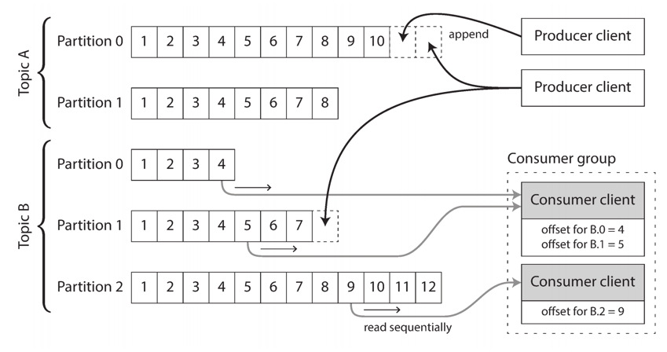
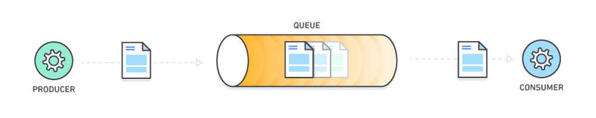
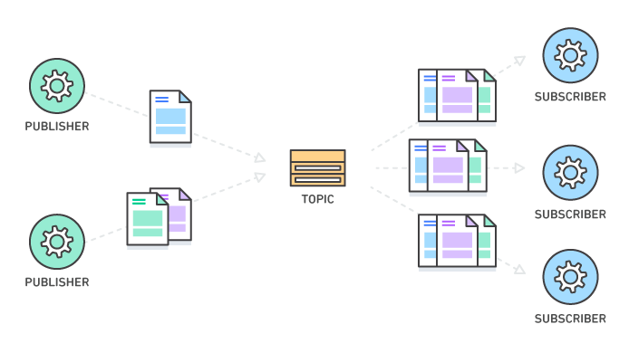

## Introduction

In computer science, message queues and mailboxes are software-engineering components typically used for inter-process communication (IPC), or for inter-thread communication within the same process.
They use a queue for messaging – the passing of control or of content. Group communication systems provide similar kinds of functionality.

## Message System

Within this publish/subscribe model, different systems take a wide range of approaches, and there is no one right answer for all purposes.
To differentiate the systems, it is particularly helpful to ask the following two questions:

1. What happens if the producers send messages faster than the consumers can process them?
   Broadly speaking, there are three options: the system can drop messages, buffer messages in a queue, or apply backpressure (also known as flow control; i.e., blocking the producer from sending more messages).
   For example, Unix pipes and TCP use backpressure: they have a small fixed-size buffer, and if it fills up, the sender is blocked until the recipient takes data out of the buffer.
   If messages are buffered in a queue, it is important to understand what happens as that queue grows.
   Does the system crash if the queue no longer fits in memory, or does it write messages to disk?
   If so, how does the disk access affect the performance of the messaging system?
2. What happens if nodes crash or temporarily go offline—are any messages lost?
   As with databases, durability may require some combination of writing to disk and/or replication, which has a cost.
   If you can afford to sometimes lose messages, you can probably get higher throughput and lower latency on the same hardware.

Whether message loss is acceptable depends very much on the application.
For example, with sensor readings and metrics that are transmitted periodically, an occasional missing data point is perhaps not important, since an updated value will be sent a short time later anyway.
However, beware that if a large number of messages are dropped, it may not be immediately apparent that the metrics are incorrect.
If you are counting events, it is more important that they are delivered reliably, since every lost message means incorrect counters.

### Direct messaging from producers to consumers

A number of messaging systems use direct network communication between producers and consumers without going via intermediary nodes.

### Message brokers

A widely used alternative is to send messages via a message broker (also known as a message queue), which is essentially a kind of database that is optimized for handling message streams.
It runs as a server, with producers and consumers connecting to it as clients.
Producers write messages to the broker, and consumers receive them by reading them from the broker.

By centralizing the data in the broker, these systems can more easily tolerate clients that come and go (connect, disconnect, and crash), and the question of durability is moved to the broker instead.
Some message brokers only keep messages in memory, while others (depending on configuration) write them to disk so that they are not lost in case of a broker crash. Faced with slow consumers, they generally allow unbounded queueing (as opposed to dropping messages or backpressure), although this choice may also depend on the configuration.

A consequence of queueing is also that consumers are generally asynchronous: when a producer sends a message, it normally only waits for the broker to confirm that it has buffered the message and does not wait for the message to be processed by consumers.
The delivery to consumers will happen at some undetermined future point in time—often within a fraction of a second, but sometimes significantly later if there is a queue backlog.

#### Message brokers compared to databases

Some message brokers can even participate in two-phase commit protocols using XA or JTA.
This feature makes them quite similar in nature to databases, although there are still important practical differences between message brokers and databases:

- Databases usually keep data until it is explicitly deleted, whereas most message brokers automatically delete a message when it has been successfully delivered to its consumers.
  Such message brokers are not suitable for long-term data storage.
- Since they quickly delete messages, most message brokers assume that their working set is fairly small—i.e., the queues are short.
  If the broker needs to buffer a lot of messages because the consumers are slow (perhaps spilling messages to disk if they no longer fit in memory), each individual message takes longer to process, and the overall throughput may degrade.
- Databases often support secondary indexes and various ways of searching for data, while message brokers often support some way of subscribing to a subset of topics matching some pattern.
  The mechanisms are different, but both are essentially ways for a client to select the portion of the data that it wants to know about.
- When querying a database, the result is typically based on a point-in-time snapshot of the data; if another client subsequently writes something to the database that changes the query result,
  the first client does not find out that its prior result is now outdated (unless it repeats the query, or polls for changes).
  By contrast, message brokers do not support arbitrary queries, but they do notify clients when data changes (i.e., when new messages become available).

#### Multiple consumers

When multiple consumers read messages in the same topic, two main patterns of messaging are used:

- Load balancing
  Each message is delivered to one of the consumers, so the consumers can share the work of processing the messages in the topic. The broker may assign messages to consumers arbitrarily.
  This pattern is useful when the messages are expensive to process, and so you want to be able to add consumers to parallelize the processing.
  (In AMQP, you can implement load balancing by having multiple clients consuming from the same queue, and in JMS it is called a shared subscription.)
- Fan-out
  Each message is delivered to all of the consumers.
  Fan-out allows several independent consumers to each “tune in” to the same broadcast of messages, without affecting each other—the streaming equivalent of having several different batch jobs that read the same input file.
  (This feature is provided by topic subscriptions in JMS, and exchange bindings in AMQP.)

The two patterns can be combined: for example, two separate groups of consumers may each subscribe to a topic, such that each group collectively receives all messages, but within each group only one of the nodes receives each message.

## Partitioned Logs

A [log](/docs/CS/log/Log.md) is simply an append-only sequence of records on disk.

The same structure can be used to implement a message broker: a producer sends a message by appending it to the end of the log, and a consumer receives messages by reading the log sequentially.
If a consumer reaches the end of the log, it waits for a notification that a new message has been appended.

In order to scale to higher throughput than a single disk can offer, the log can be partitioned.
Different partitions can then be hosted on different machines, making each partition a separate log that can be read and written independently from other partitions.
A topic can then be defined as a group of partitions that all carry messages of the same type.

Within each partition, the broker assigns a monotonically increasing sequence number, or offset, to every message (in Figure 1, the numbers in boxes are message off‐sets).
Such a sequence number makes sense because a partition is append-only, so the messages within a partition are totally ordered. There is no ordering guarantee across different partitions.

Fig.1. Producers send messages by appending them to a topic-partition file, and consumers read these files sequentially.

[Apache Kafka](/docs/CS/MQ/Kafka/Kafka.md), Amazon Kinesis Streams, and Twitter’s DistributedLog are log-based message brokers that work like this. 
Google Cloud Pub/Sub is architecturally similar but exposes a JMS-style API rather than a log abstraction.
Even though these message brokers write all messages to disk, they are able to achieve throughput of millions of messages per second by partitioning across multiple machines, and fault tolerance by replicating messages [22, 23].

The log-based approach trivially supports fan-out messaging, because several consumers can independently read the log without affecting each other—reading a message does not delete it from the log.
To achieve load balancing across a group of consumers, instead of assigning individual messages to consumer clients, the broker can assign entire partitions to nodes in the consumer group. 

Each client then consumes all the messages in the partitions it has been assigned.
Typically, when a consumer has been assigned a log partition, it reads the messages in the partition sequentially, in a straightforward single-threaded manner.
This coarsegrained load balancing approach has some downsides:
- The number of nodes sharing the work of consuming a topic can be at most the number of log partitions in that topic, because messages within the same partition are delivered to the same node.i
- If a single message is slow to process, it holds up the processing of subsequent messages in that partition (a form of head-of-line blocking.

Thus, in situations where messages may be expensive to process and you want to parallelize processing on a message-by-message basis, and where message ordering is not so important, the JMS/AMQP style of message broker is preferable. 
On the other hand, in situations with high message throughput, where each message is fast to process and where message ordering is important, the log-based approach works very well.

### Compaction

If you only ever append to the log, you will eventually run out of disk space. 
To reclaim disk space, the log is actually divided into segments, and from time to time old segments are deleted or moved to archive storage.
(We’ll discuss a more sophisticated way of freeing disk space later.)

This means that if a slow consumer cannot keep up with the rate of messages, and it falls so far behind that its consumer offset points to a deleted segment, it will miss some of the messages.
Effectively, the log implements a bounded-size buffer that discards old messages when it gets full, also known as a circular buffer or ring buffer.
However, since that buffer is on disk, it can be quite large.

Let’s do a back-of-the-envelope calculation. At the time of writing, a typical large hard drive has a capacity of 6 TB and a sequential write throughput of 150 MB/s. 
If you are writing messages at the fastest possible rate, it takes about 11 hours to fill the drive.
Thus, the disk can buffer 11 hours’ worth of messages, after which it will start overwriting old messages.
This ratio remains the same, even if you use many hard drives and machines.
In practice, deployments rarely use the full write bandwidth of the disk, so the log can typically keep a buffer of several days’ or even weeks’ worth of messages.

Regardless of how long you retain messages, the throughput of a log remains more or less constant, since every message is written to disk anyway. 
This behavior is in contrast to messaging systems that keep messages in memory by default and only write them to disk if the queue grows too large: 
such systems are fast when queues are short and become much slower when they start writing to disk, so the throughput depends on the amount of history retained.

#### When consumers cannot keep up with producers

We discussed three choices of what to do if a consumer cannot keep up with the rate at which producers are sending messages: dropping messages, buffering, or applying backpressure. 
In this taxonomy, the log-based approach is a form of buffering with a large but fixed-size buffer (limited by the available disk space).
If a consumer falls so far behind that the messages it requires are older than what is retained on disk, it will not be able to read those messages—so the broker effectively drops old messages that go back further than the size of the buffer can accommodate.
You can monitor how far a consumer is behind the head of the log, and raise an alert if it falls behind significantly. 
As the buffer is large, there is enough time for a human operator to fix the slow consumer and allow it to catch up before it starts missing messages.

Even if a consumer does fall too far behind and starts missing messages, only that consumer is affected; it does not disrupt the service for other consumers. 
This fact is a big operational advantage: you can experimentally consume a production log for development, testing, or debugging purposes, without having to worry much about disrupting production services. 
When a consumer is shut down or crashes, it stops consuming resources—the only thing that remains is its consumer offset.

This behavior also contrasts with traditional message brokers, where you need to be careful to delete any queues whose consumers have been shut down—otherwise they continue unnecessarily accumulating messages and taking away memory from consumers that are still active.

#### Replaying old messages
We noted previously that with AMQP- and JMS-style message brokers, processing and acknowledging messages is a destructive operation, since it causes the messages to be deleted on the broker.
On the other hand, in a log-based message broker, consuming messages is more like reading from a file: it is a read-only operation that does not change the log.

The only side effect of processing, besides any output of the consumer, is that the consumer offset moves forward. 
But the offset is under the consumer’s control, so it can easily be manipulated if necessary: for example, you can start a copy of a consumer with yesterday’s offsets and write the output to a different location, in order to reprocess the last day’s worth of messages.
You can repeat this any number of times, varying the processing code.

## Model

### Message Queue

A message queue is a form of asynchronous service-to-service communication used in serverless and microservices architectures.
Messages are stored on the queue until they are processed and deleted. Each message is processed only once, by a single consumer.
Message queues can be used to decouple heavyweight processing, to buffer or batch work, and to smooth spiky workloads.

In modern cloud architecture, applications are decoupled into smaller, independent building blocks that are easier to develop, deploy and maintain.
Message queues provide communication and coordination for these distributed applications.
Message queues can significantly simplify coding of decoupled applications, while improving performance, reliability and scalability.
Message queues allow different parts of a system to communicate and process operations asynchronously.
A message queue provides a lightweight buffer which temporarily stores messages, and endpoints that allow software components to connect to the queue in order to send and receive messages.
The messages are usually small, and can be things like requests, replies, error messages, or just plain information. To send a message, a component called a producer adds a message to the queue.
The message is stored on the queue until another component called a consumer retrieves the message and does something with it.

Fig.1. Message queue.

Many producers and consumers can use the queue, but each message is processed only once, by a single consumer.
For this reason, this messaging pattern is often called one-to-one, or point-to-point, communications.
When a message needs to be processed by more than one consumer, message queues can be combined with Pub/Sub messaging in a fanout design pattern.

### Pub-Sub

The Publish Subscribe model allows messages to be broadcast to different parts of a system asynchronously.
A sibling to a message queue, a message topic provides a lightweight mechanism to broadcast asynchronous event notifications, and endpoints that allow software components to connect to the topic in order to send and receive those messages.
To broadcast a message, a component called a publisher simply pushes a message to the topic.
Unlike message queues, which batch messages until they are retrieved, message topics transfer messages with no or very little queuing, and push them out immediately to all subscribers.
All components that subscribe to the topic will receive every message that is broadcast, unless a message filtering policy is set by the subscriber.

Fig.2. Pub/Sub.

The subscribers to the message topic often perform different functions, and can each do something different with the message in parallel.
The publisher doesn’t need to know who is using the information that it is broadcasting, and the subscribers don’t need to know who the message comes from.
This style of messaging is a bit different than message queues, where the component that sends the message often knows the destination it is sending to.

## Features

### Message Delivery Semantics

By message delivery semantics, we refer to the expected message delivery guaranties in the case of failure recovery.
After a failure recovery, we recognize these different message delivery guarantees:

- *At most once*
  Data may have been processed but will never be processed twice. In this case, data may be lost but processing will never result in duplicate records.
- *At-least-once*
  Data that has been processed may be replayed and processed again. In this case, each data record is guaranteed to be processed and may result in duplicate records.
- *Exactly once*
  Data is processed once and only once. All data is guaranteed to be processed and no duplicate records are generated.
  This is the most desirable guarantee for many enterprise applications, but it’s considered impossible to achieve in a distributed environment.
- *Effectively Exactly Once*
  is a variant of *exactly once* delivery semantics that tolerates duplicates during data processing and requires the producer side of the process to be idempotent.
  That is, producing the same record more than once is the same as producing it only once. In practical terms, this translates to writing the data to a system that can preserve the uniqueness of keys or use a deduplication process to prevent duplicate records from being produced to an external system.

### Push versus Pull

Most message queues provide both push and pull options for retrieving messages.

- Pull means continuously querying the queue for new messages.
- Push means that a consumer is notified when a message is available.

A push-based system has difficulty dealing with diverse consumers as the broker controls the rate at which data is transferred.
The goal is generally for the consumer to be able to consume at the maximum possible rate; unfortunately, in a push system this means the consumer tends to be overwhelmed when its rate of consumption falls below the rate of production (a denial of service attack, in essence).
A pull-based system has the nicer property that the consumer simply falls behind and catches up when it can.
This can be mitigated with some kind of backoff protocol by which the consumer can indicate it is overwhelmed, but getting the rate of transfer to fully utilize (but never over-utilize) the consumer is trickier than it seems.
Previous attempts at building systems in this fashion led us to go with a more traditional pull model.

Another advantage of a pull-based system is that it lends itself to aggressive batching of data sent to the consumer.
A push-based system must choose to either send a request immediately or accumulate more data and then send it later without knowledge of whether the downstream consumer will be able to immediately process it.
If tuned for low latency, this will result in sending a single message at a time only for the transfer to end up being buffered anyway, which is wasteful.
A pull-based design fixes this as the consumer always pulls all available messages after its current position in the log (or up to some configurable max size).
So one gets optimal batching without introducing unnecessary latency.

The deficiency of a naive pull-based system is that if the broker has no data the consumer may end up polling in a tight loop, effectively busy-waiting for data to arrive.

### Schedule or Delay Delivery

Many message queues support setting a specific delivery time for a message. If you need to have a common delay for all messages, you can set up a delay queue.

### Dead-letter Queues

Sometimes, messages can't be processed because of a variety of possible issues, such as erroneous conditions within the producer or consumer application or an unexpected state change that causes an issue with your application code.
For example, if a user places a web order with a particular product ID, but the product ID is deleted, the web store's code fails and displays an error, and the message with the order request is sent to a dead-letter queue.

Occasionally, producers and consumers might fail to interpret aspects of the protocol that they use to communicate, causing message corruption or loss. Also, the consumer's hardware errors might corrupt message payload.

A dead-letter queue is a queue to which other queues can send messages that can't be processed successfully.
This makes it easy to set them aside for further inspection without blocking the queue processing or spending CPU cycles on a message that might never be consumed successfully.

The main task of a dead-letter queue is handling message failure.
A dead-letter queue lets you set aside and isolate messages that can’t be processed correctly to determine why their processing didn’t succeed.
Setting up a dead-letter queue allows you to do the following:

- Configure an alarm for any messages delivered to a dead-letter queue.
- Examine logs for exceptions that might have caused messages to be delivered to a dead-letter queue.
- Analyze the contents of messages delivered to a dead-letter queue to diagnose software or the producer’s or consumer’s hardware issues.
- Determine whether you have given your consumer sufficient time to process messages.

When should I use a dead-letter queue?

- Do use dead-letter queues with high-throughput, unordered queues.
- You should always take advantage of dead-letter queues when your applications don’t depend on ordering. Dead-letter queues can help you troubleshoot incorrect message transmission operations.
- Note: Even when you use dead-letter queues, you should continue to monitor your queues and retry sending messages that fail for transient reasons.
- Do use dead-letter queues to decrease the number of messages and to reduce the possibility of exposing your system to poison-pill messages (messages that can be received but can’t be processed).
- Don’t use a dead-letter queue with high-throughput, unordered queues when you want to be able to keep retrying the transmission of a message indefinitely.
- For example, don’t use a dead-letter queue if your program must wait for a dependent process to become active or available.
- Don’t use a dead-letter queue with a FIFO queue if you don’t want to break the exact order of messages or operations.
- For example, don’t use a dead-letter queue with instructions in an Edit Decision List (EDL) for a video editing suite, where changing the order of edits changes the context of subsequent edits.

### Ordering

Most message queues provide best-effort ordering which ensures that messages are generally delivered in the same order as they're sent, and that a message is delivered at least once.

### Poison-pill Messages

Poison pills are special messages that can be received, but not processed.
They are a mechanism used in order to signal a consumer to end its work so it is no longer waiting for new inputs, and is similar to closing a socket in a client/server model.

## Security

Message queues will authenticate applications that try to access the queue, and allow you to use encryption to encrypt messages over the network as well as in the queue itself.

## Issues

### High Avaliability

RabbitMQ

Mirroring Cluster

Kafka

Topic can be multiple partitions

partitions have replicate in other brokers

we can only read/write leader

leader will sync data to followers, return ack when most of followers sync successfully

### lost message

RabbitMQ

- producer confirm
- broker storage
- consumer confirm manually

Kafka

- broker
  - unclean.leader.election.enable = false
  - set topic repliaction factor > 1 : at least 2 partitions
  - set broker min.insync.replicas > 1 : at least 1 follower
  - replication.factor = min.insync.replicas + 1
- producer
  - set producer acks = all : must write to all replicas then ack
  - set producer retries = MAX : retry util success
- consumer
  - enable.auto.commit: false

### Duplicate Consume

Based on no message losing

- Redis is always idempotent.
- DB primary key is unique.
- update wehn exist, insert when not exist.
- every request has own id, check if has consumed(a set).

### message ordering

Kafka partition -> queue -> thread

## MQs

### Kafka

[Apache Kafka](/docs/CS/MQ/Kafka/Kafka.md) is an open-source distributed event streaming platform used by thousands of companies for high-performance data pipelines, streaming analytics, data integration, and mission-critical applications.

### RocketMQ

[RocketMQ](/docs/CS/MQ/RocketMQ/RocketMQ.md)

Topic
- 

Kafka partition -> segment -> .log, .index, .timeindex

RocketMQ all topics using single commitlog and multiple index

## Links

- [Apache Kafka](/docs/CS/MQ/Kafka/Kafka.md)
- [RocketMQ](/docs/CS/MQ/RocketMQ/RocketMQ.md)
- [Pulsar](/docs/CS/MQ/Pulsar/Pulsar.md)
