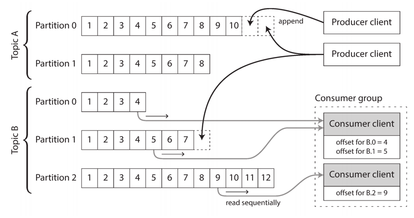
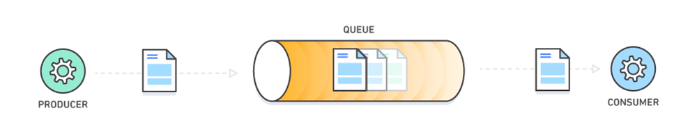
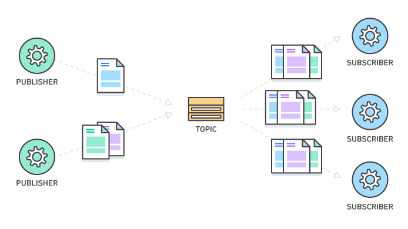

## Introduction

在计算机科学中，消息队列和邮箱是软件工程组件，通常用于进程间通信（IPC）或同一进程内的线程间通信。
它们使用队列进行消息传递——即控制或内容的传递。组通信系统提供类似的功能。

## Message System

在发布/订阅模型中，不同的系统采用多种方法，没有一个适用于所有目的的正确方案。
为了区分系统，提出以下两个问题特别有帮助：

1. 如果生产者发送消息的速度快于消费者处理的速度会发生什么？
   一般来说，有三种选择：系统可以丢弃消息、在队列中缓冲消息，或应用背压（也称为流量控制；即阻止生产者发送更多消息）。
   例如，Unix 管道和 TCP 使用背压：它们有一个小的固定大小缓冲区，如果满了，发送方将被阻塞，直到接收方从缓冲区取出数据。
   如果消息在队列中缓冲，理解队列增长时会发生什么很重要。
   如果队列无法容纳在内存中，系统会崩溃吗？还是会将消息写入磁盘？
   如果是这样，磁盘访问如何影响消息系统的性能？
2. 如果节点崩溃或暂时离线会发生什么——消息会丢失吗？
   与数据库一样，持久性可能需要写入磁盘和/或复制的某些组合，这会产生成本。
   如果你能接受偶尔丢失消息，那么在相同的硬件上可能会获得更高的吞吐量和更低的延迟。

消息丢失是否可以接受很大程度上取决于应用程序。
例如，对于周期性传输的传感器读数和指标，偶尔丢失一个数据点可能不重要，因为更新后的值很快就会发送。
但要注意，如果大量消息被丢弃，指标不正确可能不会立即显现。
如果你正在计数事件，可靠交付更重要，因为每条丢失的消息都意味着计数器不正确。

### Direct messaging from producers to consumers

一些消息系统使用生产者和消费者之间的直接网络通信，而无需经过中间节点。

### Message brokers

广泛使用的替代方案是通过消息代理（也称为消息队列）发送消息，它本质上是一种针对处理消息流优化的数据库。
它作为服务器运行，生产者和消费者作为客户端连接到它。
生产者将消息写入代理，消费者通过从代理读取来接收消息。

通过将数据集中到代理，这些系统可以更容易地容忍客户端的连接和断开（连接、断开和崩溃），持久性问题也转移到了代理。
一些消息代理仅在内存中保存消息，而其他消息代理（取决于配置）将消息写入磁盘，以便在代理崩溃时不会丢失。面对慢消费者，它们通常允许无限制的排队（而不是丢弃消息或背压），尽管这个选择也可能取决于配置。

排队的一个结果是消费者通常是异步的：当生产者发送消息时，它通常只等待代理确认已缓冲消息，而不等待消费者处理消息。
消息将在未来的某个不确定时间点投递给消费者——通常在几分之一秒内，但有时如果队列积压，可能会显著延迟。

#### Message brokers compared to databases

一些消息代理甚至可以使用 XA 或 JTA 参与两阶段提交协议。
这个特性使它们在本质上与数据库非常相似，尽管消息代理和数据库之间仍然存在重要的实际差异：

- 数据库通常保留数据直到显式删除，而大多数消息代理在消息成功投递给消费者后自动删除消息。
  这种消息代理不适合长期数据存储。
- 由于它们快速删除消息，大多数消息代理假设其工作集相当小——即队列很短。
  如果代理需要缓冲大量消息（因为消费者很慢），每条消息的处理时间会更长，整体吞吐量可能会下降。
- 数据库通常支持二级索引和各种搜索数据的方式，而消息代理通常支持订阅匹配某种模式的主题子集。
  机制不同，但本质上都是客户端选择其想要了解的数据部分的方式。
- 查询数据库时，结果通常基于数据的某个时间点快照；如果另一个客户端随后写入数据库更改了查询结果，
  第一个客户端不会发现其先前的结果已过时（除非重复查询或轮询更改）。
  相比之下，消息代理不支持任意查询，但它们会在数据更改时通知客户端。

#### Multiple consumers

当多个消费者读取同一 topic 中的消息时，使用两种主要的消息传递模式：

- Load balancing（负载均衡）
  每条消息投递给一个消费者，以便消费者可以分担处理 topic 消息的工作。代理可以任意将消息分配给消费者。
  当消息处理成本高时，此模式很有用，因此希望能够添加消费者来并行处理。
  （在 AMQP 中，可以通过多个消费者从同一队列消费来实现负载均衡，在 JMS 中称为共享订阅。）
- Fan-out（扇出）
  每条消息投递给所有消费者。
  扇出允许几个独立的消费者各自"收听"相同的消息广播，而不影响彼此——这相当于多个批处理作业读取同一输入文件的流式版本。
  （此功能由 JMS 中的 topic 订阅和 AMQP 中的 exchange binding 提供。）

两种模式可以结合：例如，两个独立的消费者组可以各自订阅一个 topic，这样每个组共同接收所有消息，但在每个组内只有一个节点接收每条消息。

## Protocols

从功能支持、迭代速度、灵活性上考虑 大多数消息队列的核心通信协议都会选择自定义的私有协议

私有协议的设计

- 为了保证性能和可靠性 几乎所有主流消息队列在核心生产、消费链路的网络通信协议都是基于可靠性高、长连接的 [TCP](/docs/CS/CN/TCP/TCP.md) 协议
- 应用通信协议分为请求和返回两种 协议包含协议头和协议体两部分
- 编解码在实现上分为自定义实现和使用现有的编解码框架两种 从零实现编解码器比较复杂 一些消息队列（如 RocketMQ5.0 和 Pulsar) 开始使用业界成熟的编解码器 如 Google 的 [ProtocolBuffer](/docs//CS/Distributed/RPC/ProtoBuf.md)

## Network

基于 IO 多路复用技术和 Reactor 模型，可以解决网络模块的性能问题

网络模块的特点是编码非常复杂，要考虑的细节和边界条件非常多，一些异常情况的处理也很细节，需要经过长时间的打磨。但是一旦开发完成，稳定后，代码几乎不需要再改动，因为需求是相对固定的而 Java NIO 库开发一个 Server 需要的工作量非常大

为了提高稳定性或者降低成本，选择现成的、成熟的 NIO 框架是一个更好的方案
[Netty]() 就是这样一个基于 Java NIO 封装的成熟框架 当前业界主流消息队列 RocketMQ、Pulsar 也都是基于 Netty 开发的网络模块，Kafka 因为历史原因是基于 Java NIO 实现的

## Storage

消息队列中的数据一般分为元数据和消息数据  

元数据信息的特点是数据量比较小，不会经常读写，但是需要保证数据的强一致和高可靠，不允许出现数据的丢失。同时，元数据信息一般需要通知到所有的 Broker 节点，Broker 会根据元数据信息执行具体的逻辑  

### 元数据存储

元数据信息的存储，一般有两个思路。

- 基于第三方组件来实现元数据的存储。
- 在集群内部实现元数据的存储

基于第三方组件来实现元数据的存储是目前业界的主流选择。

比如 Kafka ZooKeeper 版本、Pulsar、RocketMQ 用的就是这个思路，其中 Kakfa 和 Pulsar 的元数据存储在 ZooKeeper中，RocketMQ 存储在 NameServer 中（准确说是存储在 Broker+NameServer 中）

这个方案最大的优点是集成方便，开发成本低，能满足消息队列功能层面的基本要求，因为我们可以直接复用第三方组件已经实现的一致性存储、高性能的读写和存储、Hook 机制等能力，而且在后续集群构建中也可以复用这个组件，能极大降低开发难度和工作成本  

但也有缺点。引入第三方组件会增加系统部署和运维的复杂度，而且第三方组件自身的稳定性问题会增加系统风险，第三方组件和多台 Broker 之间可能会出现数据信息不一致的情况，导致读写异常  

另一种思路，集群内部实现元数据的存储是指在集群内部完成元数据的存储和分发。也就是在集群内部实现类似第三方组件一样的元数据服务，比如基于 Raft 协议实现内部的元数据存储模块或依赖一些内置的数据库。目前 Kafka 去 ZooKeeper 的版本、RabbitMQ 的 Mnesia、Kafka 的 C++ 版本 RedPanda 用的就是这个思路  

这个方案的优缺点跟第一个正好相反。优点是部署和运维成本低，不会因为依赖第三方服务导致稳定性问题，也不会有数据不一致的问题。但缺点是开发成本高，前期要投入大量的开发人力  

### 消息数据存储

消息数据的存储，分为存储结构、数据分段、数据存储格式、数据清理四个部分  

在消息队列中，跟存储有关的主要是 Topic 和分区两个维度。用户可以将数据写入 Topic 或直接写入到分区  不过如果写入 Topic，数据也是分发到多个分区去存储的。所以从实际数据存储的角度来看，Topic 和 Group 不承担数据存储功能，承担的是逻辑组织的功能，实际的数据存储是在在分区维度完成的

从技术架构的角度，数据的落盘存储也有两个思路  

- 每个分区单独一个存储"文件"
- 每个节点上所有分区的数据都存储在同一个"文件"

第一个思路，每个分区对应一个文件的形式去存储数据。具体实现时，每个分区上的数据顺序写到同一个磁盘文件中，数据的存储是连续的。因为消息队列在大部分情况下的读写是有序的，所以这种机制在读写性能上的表现是最高的

但如果分区太多，会占用太多的系统 FD 资源，极端情况下有可能把节点的 FD 资源耗完，并且硬盘层面会出现大量的随机写情况，导致写入的性能下降很多，另外管理起来也相对复杂。Kafka 在存储数据的组织上用的就是这个思路

第二种思路，每个节点上所有分区的数据都存储在同一个文件中，这种方案需要为每个分区维护一个对应的索引文件，索引文件里会记录每条消息在 File 里面的位置信息，以便快速定位到具体的消息内容  

因为所有文件都在一份文件上，管理简单，也不会占用过多的系统 FD 资源，单机上的数据写入都是顺序的，写入的性能会很高

缺点是同一个分区的数据一般会在文件中的不同位置，或者不同的文件段中，无法利用到顺序读的优势，读取的性能会受到影响，但是随着 SSD 技术的发展，随机读写的性能也越来越高。如果使用 SSD 或高性能 SSD，一定程度上可以缓解随机读写的性能损耗，但 SSD 的成本比机械硬盘高很多

目前 RocketMQ、RabbitMQ 和 Pulsar 的底层存储 BookKeeper 用的就是这个方案

这种方案的数据组织形式一般是这样的。假设这个统一的文件叫 commitlog，则 commitlog就是用来存储数据的文件，.index 是每个分区的索引信息

选择呢哪种方案考虑是你对读和写的性能要求  

第一种方案，单个文件读和写都是顺序的，性能最高。但是当文件很多且都有读写的场景下，硬盘层面就会退化为随机读写，性能会严重下降

第二种方案，因为只有一个文件，不存在文件过多的情况，写入层面一直都会是顺序的，性能一直很高。但是在消费的时候，因为多个分区数据存储在同一个文件中，同一个分区的数据在底层存储上是不连续的，硬盘层面会出现随机读的情况，导致读取的性能降低

不过随机读带来的性能问题，可以通过给底层配备高性能的硬件来缓解。所以当前比较多的消息队列选用的是第二种方案，但是 Kafka 为了保证更高的吞吐性能，选用的是第一种方案  

不管是方案一还是方案二，在数据存储的过程中，如果单个文件过大，在文件加载、写入和检索的时候，性能就会有问题，并且消息队列有自动过期机制，如果单个文件过大，数据清理时会很麻烦，效率很低。所以，我们的消息数据都会分段存储  

数据分段的规则一般是根据大小来进行的，比如默认 1G 一个文件，同时会支持配置项调整分段数据的大小  

进行了分段，消息数据可能分布在不同的文件中。所以我们在读取数据的时候，就需要先定位消息数据在哪个文件中。为了满足这个需求，技术上一般有根据偏移量定位或根据索引定位两种思路  

根据偏移量（Offset）来定位消息在哪个分段文件中，是指通过记录每个数据段文件的起始偏移量、中止偏移量、消息的偏移量信息，来快速定位消息在哪个文件。

当消息数据存储时，通常会用一个自增的数值型数据（比如 Long）来表示这条数据在分区或commitlog 中的位置，这个值就是消息的偏移量

在实际的编码过程中，记录文件的起始偏移量一般有两种思路：单独记录每个数据段的起始和结束偏移量，在文件名称中携带起始偏移量信息。因为数据是顺序存储的，每个文件记录了本文件的起始偏移量，那么下一个文件的起始偏移量就是上一个文件的结束偏移量  

如果用索引定位，会直接存储消息对应的文件信息，而不是通过偏移量来定位到具体文件。

具体是通过维护一个单独的索引文件，记录消息在哪个文件和文件的哪个位置。读取消息的时候，先根据消息 ID 找到存储的信息，然后找到对应的文件和位置，读取数据。RabbitMQ 和RocketMQ 用的就是这个思路

这两种方案所面临的场景不一样。根据偏移量定位数据，通常用在每个分区各自存储一份文件的场景；根据索引定位数据，通常用在所有分区的数据存储在同一份文件的场景。因为在前一种场景，每一份数据都属于同一个分区，那么通过位点来二分查找数据的效率是最高的。第二种场景，这一份数据属于多个不同分区，则通过二分查找来查找数据效率很低，用哈希查找效率是最高的  

消息数据存储格式一般包含消息写入文件的格式和消息内容的格式两个方面  

从性能和空间冗余的角度来看，消息队列中的数据基本都是以二进制的格式写入到文件的  

消息内容的格式是指写入到文件中的数据都包含哪些信息。对于一个成熟的消息队列来说，消息内容格式不仅关系功能维度的扩展，还牵涉性能维度的优化
在数据的存储格式设计方面，内容的格式需要尽量完整且不要有太多冗余

消息数据的存储格式虽然没有统一的规范，但是一般包含通用信息和业务信息两部分。通用信息主要包括时间戳、CRC、消息头、消息体、偏移量、长度、大小等信息，业务信息主要跟业务相关，包含事务、幂等、系统标记、数据来源、数据目标等信息  

#### 消息数据清理机制

消息队列中的数据最终都会删除，时间周期短的话几小时、甚至几分钟，正常情况一天、三天、七天，长的话可能一个月，基本很少有场景需要在消息队列中存储一年的数据。

消息队列的数据过期机制一般有手动删除和自动删除两种形式，从实现上看主要有三种思路

- 消费完成执行 ACK 删除数据
- 根据时间和保留大小删除
- ACK 机制和过期机制相结合  

消费完成执行 ACK 删除数据，技术上的实现思路一般是：当客户端成功消费数据后，回调服务端的 ACK 接口，告诉服务端数据已经消费成功，服务端就会标记删除该行数据，以确保消息不会被重复消费。ACK 的请求一般会有单条消息 ACK 和批量消息 ACK 两种形式  

纵观业界主流消息队列，三种方案都有在使用，RabbitMQ 选择的是第一个方案，Kafka 和RocketMQ 选择的是第二种方案，Pulsar 选择的是第三种方案  

## Partitioned Logs

[Log](/docs/CS/log/Log.md) 只是一个仅追加的磁盘记录序列。

相同的结构可用于实现消息代理：生产者通过将消息追加到日志末尾来发送消息，消费者通过顺序读取日志来接收消息。
如果消费者到达日志末尾，它会等待新消息追加的通知。

为了扩展到比单个磁盘更高的吞吐量，日志可以被分区。
不同的分区可以托管在不同的机器上，使每个分区成为一个独立的日志，可以独立于其他分区进行读写。
Topic 可以定义为一组承载相同类型消息的分区。

在每个分区内，broker 为每条消息分配一个单调递增的序列号或偏移量（在图 1 中，框中的数字是消息偏移量）。
这种序列号是有意义的，因为分区是仅追加的，所以分区内的消息是完全排序的。不同分区之间没有排序保证。

Fig.1. 生产者通过将消息追加到 topic-partition 文件来发送消息，消费者顺序读取这些文件。

[Apache Kafka](/docs/CS/MQ/Kafka/Kafka.md)、Amazon Kinesis Streams 和 Twitter 的 DistributedLog 都是这样工作的基于日志的消息代理。
Google Cloud Pub/Sub 在架构上类似，但暴露的是 JMS 风格的 API 而不是日志抽象。
尽管这些消息代理将所有消息写入磁盘，但通过跨多台机器分区和复制消息实现容错，它们能够达到每秒数百万条消息的吞吐量。

基于日志的方法天然支持扇出消息，因为多个消费者可以独立读取日志而不互相影响——读取消息不会将其从日志中删除。
为了在消费者组中实现负载均衡，broker 可以将整个分区分配给消费者组中的节点，而不是将单个消息分配给消费者客户端。

然后每个客户端消费其被分配的分区中的所有消息。
通常，当消费者被分配一个日志分区时，它以简单的单线程方式顺序读取分区中的消息。
这种粗粒度的负载均衡方法有一些缺点：

- 共享消费 topic 工作的节点数最多为该 topic 中的日志分区数，因为同一分区内的消息被投递给同一个节点。
- 如果单条消息处理缓慢，它会阻塞该分区中后续消息的处理（一种 head-of-line blocking）。

因此，在消息处理成本高且希望逐条并行处理，且消息排序不太重要的情况下，JMS/AMQP 风格的消息代理更可取。
另一方面，在消息吞吐量高、每条消息处理速度快且消息排序重要的情况下，基于日志的方法效果很好。

### Compaction

如果只追加日志，最终会耗尽磁盘空间。
为了回收磁盘空间，日志实际上被分成段，旧段会被定期删除或移动到归档存储。
（我们稍后会讨论更复杂的释放磁盘空间的方法。）

这意味着如果慢消费者跟不上消息速率，并且落后太多以至于其消费者偏移量指向已删除的段，它将丢失一些消息。
实际上，日志实现了一个有界大小的缓冲区，当满时丢弃旧消息，也称为循环缓冲区或环形缓冲区。
但由于该缓冲区在磁盘上，它可以非常大。

做个粗略计算。在撰写本文时，典型的大硬盘容量为 6 TB，顺序写入吞吐量为 150 MB/s。
如果以最快速率写入消息，大约需要 11 小时才能填满硬盘。
因此，磁盘可以缓冲约 11 小时的消息，之后将开始覆盖旧消息。
即使使用多个硬盘和机器，这个比例也保持不变。
在实践中，部署很少使用磁盘的全部写入带宽，因此日志通常可以保留几天甚至几周的消息缓冲区。

无论保留消息多长时间，日志的吞吐量或多或少是恒定的，因为每条消息无论如何都会写入磁盘。
这种行为与默认将消息保留在内存中、仅在队列增长过大时才写入磁盘的消息系统形成对比：
此类系统在队列短时很快，在开始写入磁盘时变得慢得多，因此吞吐量取决于保留的历史数据量。

#### When consumers cannot keep up with producers

我们讨论了消费者跟不上生产者发送消息速率时的三种选择：丢弃消息、缓冲或应用背压。
在这种分类中，基于日志的方法是一种具有大但固定大小缓冲区（受可用磁盘空间限制）的缓冲形式。
如果消费者落后太多以至于其所需的消息比磁盘上保留的更旧，它将无法读取这些消息——因此代理实际上丢弃了超出缓冲区容量的旧消息。
你可以监控消费者落后日志头部的距离，并在其显著落后时发出警报。
由于缓冲区很大，有足够时间让人工操作员修复慢消费者，使其在开始丢失消息之前赶上。

即使消费者确实落后太多并开始丢失消息，也只有该消费者受到影响；不会破坏其他消费者的服务。
这是一个很大的操作优势：你可以为开发、测试或调试目的实验性地消费生产日志，而不必太担心破坏生产服务。
当消费者关闭或崩溃时，它停止消耗资源——唯一剩下的是其消费者偏移量。

这种行为也与传统消息代理形成对比，在传统消息代理中，你需要小心删除消费者已关闭的队列——否则它们会继续不必要地累积消息并占用仍活跃消费者的内存。

#### Replaying old messages

我们之前注意到，在 AMQP 和 JMS 风格的消息代理中，处理和确认消息是破坏性操作，因为它会导致代理删除消息。
另一方面，在基于日志的消息代理中，消费消息更像是从文件读取：这是一个不会改变日志的只读操作。

除了消费者的任何输出之外，处理的唯一副作用是消费者偏移量向前移动。
但偏移量受消费者控制，因此在必要时可以轻松操纵：例如，你可以用昨天的偏移量启动一个消费者副本，并将输出写入不同的位置，以便重新处理最近一天的消息。
你可以任意重复此操作，更改处理代码。

## Client

消息队列的客户端主要包含生产、消费、集群管控三类功能

### Producer

从客户端 SDK 实现的角度来看，生产模块包含客户端基础功能和生产相关功能两部分，其中基础功能是客户端中所有功能共用的 

生产模块基础功能包括请求连接管理、心跳检测、内容构建、序列化、重试、容错处理等等。生产功能是黄色部分，包括客户端寻址、分区选择、批量发送，生产错误处理、SSL、压缩、事务、幂等等等  

客户端和服务端之间基本都是通过各自语言的网络库，创建 TCP 长连接进行通信的。在大部分实现中，为了避免连接数膨胀，每个客户端实例和每台 Broker 只会维护一条 TCP 连接 

建立一条 TCP 连接很简单，更关键的是，什么情况下建立连接？一般有初始化创建连接和使用时创建链接两种方式  

因为客户端会有空闲连接回收机制，创建连接的耗时一般较短，所以在实际的架构实现中，两种方式都会用，优劣区别并不明显。不过，从资源利用率的角度考虑，建议你使用晚建立连接的方式。

因为连接并不是任何时候都有数据，可能出现长时间连接空闲。所以连接都会搭配连接回收机制，连接建立后如果连接出现长时间空闲，就回收连接。连接回收的策略一般是判断这段时间内是否有发送数据的行为，如果没有就判断是空闲，然后执行回收

因为单个 TCP 连接发送性能存在上限，我们就需要在客户端启动多个生产者，提高并发读写的能力。一般情况下，每个生产者会有一个唯一的 ID 或唯一标识来标识客户端，比如ProduceID 或客户端的 IP+Port  

客户端和服务端之间的心跳检测机制的实现，一般有基于 TCP 的 KeepAlive 保活机制和应用层主动探测两种形式  

 从请求的角度，有些错误是重试可以恢复的，比如连接断开、Leader 切换、发送偶尔超时、服务端某些异常等；有些错误是不可恢复的，比如 Topic/ 分区不存在、服务端 Broker 不存在、集群和 Broker 长时间无响应等。

所以，在客户端的处理中也会将错误分为可重试错误和不可重试错误两类

因为网络环境、架构部署的复杂性，集群可能出现短暂网络抖动、Leader 切换等异常，可重试错误就是这类通过一次或多次重试可能恢复的异常；不可重试的错误就是不管如何重试都无法恢复的异常

客户端收到可重试错误后，会通过一定的策略进行重试，尽量确保生产流程的顺利进行

虽然实现思路很直接、很简单，但在客户端 SDK 的实现过程中，错误处理是一个包含很多细节的工作，一般需要考虑下面几个点

如何定义可恢复错误和不可恢复错误。
完整的错误码的定义和枚举，好的错误码定义可以提高排查问题的效率。
错误后重试的代码实现方式是否合理高效。
判断哪些情况需要停止客户端，向上抛错，以免一些错误信息一直在 SDK 内空转，提高上层感知异常和排查异常的难度。
日志信息打印 debug、info、error 日志时，是否包含了完整的内容

重试机制

发生错误后，客户端一般会提供重试策略，接下来我们来看看重试机制的实现。

重试策略一般会支持重试次数和退避时间的概念。当消息失败，超过设置的退避时间后，会继续重试，当超过重试次数后，就会抛弃消息或者将消息投递到配置好的重试队列中。

退避时间是可以配置的，比如 1s、10s、1 分钟。当出现错误时，就会根据退避策略退避，再尝试写入。一般情况下，重试是有次数上限的，当然也支持配置无限重试。

退避策略影响的是重试的成功率，因为网络抖动正常是 ms 级，某些异常可能会抖动十几秒。此时，如果退避策略设置得太短，在退避策略和重试次数用完后，可能消息还没生产成功；如果退避时间设置太长，可能导致客户端发送堵塞消息堆积

客户端寻址机制  

业界提出了 Metadata（元数据）寻址机制和服务端内部转发两个思路  

服务端会提供一个获取全量的 Metadata 的接口，客户端在启动时，首先通过接口拿到集群所有的元数据信息，本地缓存这部分数据信息。然后，客户端发送数据的时候，会根据元数据信息的内容，得到服务端的地址是什么，要发送的分区在哪台节点上。最后根据这两部分信息，将数据发送到服务端  

在 Metadata 寻址机制中，元数据信息主要包括 Topic 及其对应的分区信息和 Node 信息两部分  

客户端一般通过定期全量更新 Metadata 信息和请求报错时更新元数据信息两种方式，来保证客户端的元数据信息是最新的。目前 Kafka、RocketMQ、Pulsar 用的都是这个方案

另外一种服务端内部转发机制，客户端不需要经过寻址的过程，写入的时候是随机把数据写入到服务端任意一台 Broker。

具体思路是服务端的每一台 Broker 会缓存所有节点的元数据信息，生产者将数据发送给Broker 后，Broker 如果判断分区不在当前节点上，会找到这个分区在哪个节点上，然后把数据转发到目标节点

这个方案的好处是分区寻址在服务端完成，客户端的实现成本比较低。但是生产流程多了一跳，耗时增加了。另外服务端因为转发多了一跳，会导致服务端的资源损耗多一倍，比如CPU、内存、网卡，在大流量的场景下，这种损耗会导致集群负载变高，从而导致集群性能降低。

所以这种方案不适合大流量、高吞吐的消息队列。目前业界只有 RabbitMQ 使用这个方案。

生产分区分配策略

我们知道，数据可以直接写入分区或者写入 Topic。写入 Topic 时，最终数据还是要写入到某个分区。这个数据选择写入到哪个分区的过程，就是生产数据的分区分配过程。过程中的分配策略就是生产分区分配策略

一般情况下，消息队列默认支持轮询、按 Key Hash、手动指定、自定义分区分配策略四种分区分配策略

轮询是所有消息队列的默认选项。消息通过轮询的方式依次写入到各个分区中，这样可以保证每个分区的数据量是一样的，不会出现分区数据倾斜  

但是如果我们需要保证数据的写入是有序的，轮询就满足不了。因为在消费模型中，每个分区的消费是独立的，如果数据顺序依次写入多个分区，在消费的时候就无法保持顺序。所以为了保证数据有序，就需要保证 Topic 只有一个分区。这是另外两种分配策略的思路  

按 Key Hash 是指根据消息的 Key 算出一个 Hash 值，然后跟 Topic 的分区数取余数，算出一个分区号，将数据写入到这个分区中  

这种方案的好处是可以根据 Key 来保证数据的分区有序。比如某个用户的访问轨迹，以客户的 AppID 为 Key，按 Key Hash 存储，就可以确保客户维度的数据分区有序。缺点是分区数量不能变化，变化后 Hash 值就会变，导致消息乱序。并且因为每个 Key 的数据量不一样，容易导致数据倾斜。

手动指定

很简单，就是在生产数据的时候，手动指定数据写入哪个分区。这种方案的好处就是灵活，用户可以在代码逻辑中根据自己的需要，选择合适的分区，缺点就是业务需要感知分区的数量和变化，代码实现相对复杂。

除了这 3 种默认策略，消息队列也支持

自定义分区分配策略，让用户灵活使用。内核提供Interface（接口）机制，用户如果需要指定自定义的分区分配策略，可以实现对应的接口，然后配置分区分配策略。比如 Kafka 可以通过实现org.apache.kafka.clients.producer.Partitioner 接口实现自定义分区策略

客户端支持批量写入数据的前提是，需要在协议层支持批量的语义。否则就只能在业务中自定义将多条消息组成一条消息。

批量发送的实现思路一般是在客户端内存中维护一个队列，数据写入的时候，先将其写到这个内存队列，然后通过某个策略从内存队列读取数据，发送到服务端

批量发送数据的策略和存储模块的刷盘策略很像，都是根据数据条数或时间聚合后，汇总发送到服务端，一般是满足时间或者条数的条件后触发发送操作，也会有立即发送的配置项。  

Kafka 是按照时间的策略批量发送的，提供了 linger.ms、max.request.size、batch.size 三个参数，来控制数据的批量发送  

Pulsar 也提供了 batchingEnabled, batchingMaxMessages, batchingMaxPublishDelayMicros 三个参数，来控制数据批量发送

数据发送方式

消息队列一般也会提供同步发送、异步发送、发送即忘三种形式。

同步和异步更多是语言语法的实现，同步发送主要解决数据发送的即时性和顺序性，异步发送主要考虑性能

发送即忘指消息发送后不关心请求返回的结果，立即发送下一条。这种方式因为不用关心发送结果，发送性能会提升很多。缺点是当数据发送失败时无法感知，可能有数据丢失的情况，所以适合用在发送不重要的日志等场景。Kafka 提供了 ack=0、RocketMQ 提供了sendOneway 来支持这种模式  

集群管控操作

集群管控操作一般是用来完成资源的创建、查询、修改、删除等集群管理动作。资源包括主题、分区、配置、消费分组等等。

从功能上来看，消息队列一般会提供多种集群管理方式，比如命令行、客户端、HTTP 接口等等。

命令行工具是最基本的支持方式

有的消息队列也会支持 HTTP 接口形式的管控操作。好处是因为 HTTP 协议的通用性，业务可以从各个环境发起管控的调用，不用非得使用 admin SDK。另外客户端封装 HTTP 接口实现命令行工具的成本也比较低。

### Consumer

消费端 SDK 和生产端 SDK 一样，主要包括客户端基础功能和消费相关功能两部分  

从实现来看，消费相关功能包括消费模型、分区消费模式、消费分组（订阅）、消费确认、消费失败处理五个部分  

为了满足不同场景的业务需求，从实现机制上来看，主流消息队列一般支持 Pull、Push、Pop 三种消费模型  

## Model

### Message Queue

消息队列是无服务器和微服务架构中使用的一种异步服务间通信形式。
消息存储在队列中，直到被处理和删除。每条消息仅由一个消费者处理一次。
消息队列可用于解耦重量级处理、缓冲或批处理工作，以及平滑突发工作负载。

在现代云架构中，应用程序被解耦为更小、独立的构建块，更易于开发、部署和维护。
消息队列为这些分布式应用程序提供通信和协调。
消息队列可以显著简化解耦应用程序的编码，同时提高性能、可靠性和可扩展性。
消息队列允许系统的不同部分异步通信和处理操作。
消息队列提供一个轻量级缓冲区，用于临时存储消息，并提供端点，允许软件组件连接到队列以发送和接收消息。
消息通常很小，可以是请求、回复、错误消息或纯信息。要发送消息，称为生产者的组件将消息添加到队列。
消息存储在队列中，直到另一个称为消费者的组件检索到消息并对其进行处理。

Fig.1. Message queue.

许多生产者和消费者可以使用该队列，但每条消息仅由一个消费者处理一次。
因此，这种消息传递模式通常称为一对一或点对点通信。
当一条消息需要由多个消费者处理时，消息队列可以与 Pub/Sub 消息传递结合使用，形成扇出设计模式。

### Pub-Sub

发布/订阅模型允许消息异步广播到系统的不同部分。
作为消息队列的同类，消息 topic 提供了一种轻量级机制来广播异步事件通知，并提供端点，允许软件组件连接到 topic 以发送和接收这些消息。
要广播消息，称为发布者的组件只需将消息推送到 topic。
与消息队列不同（消息队列会批处理消息直到被检索），消息 topic 以很少或没有排队的方式传输消息，并立即将其推送给所有订阅者。
除非订阅者设置了消息过滤策略，否则订阅该 topic 的所有组件都将接收每个广播的消息。

Fig.2. Pub/Sub.

消息 topic 的订阅者通常执行不同的功能，每个订阅者可以并行地对消息做不同的事情。
发布者不需要知道谁在使用它广播的信息，订阅者也不需要知道消息来自谁。
这种消息传递风格与消息队列略有不同，在消息队列中，发送消息的组件通常知道其发送的目标。

## Features

### Message Delivery Semantics

消息传递语义指的是在故障恢复情况下预期的消息传递保证。
在故障恢复后，我们识别以下不同的消息传递保证：

- *At most once*（至多一次）
  数据可能已被处理，但永远不会被处理两次。在这种情况下，数据可能会丢失，但处理永远不会导致重复记录。
- *At-least-once*（至少一次）
  已处理的数据可能会被重放并再次处理。在这种情况下，保证每条数据记录都被处理，但可能导致重复记录。
- *Exactly once*（恰好一次）
  数据仅被处理一次。所有数据保证被处理，不产生重复记录。
  这是许多企业应用程序最期望的保证，但在分布式环境中被认为是不可能实现的。
- *Effectively Exactly Once*（有效恰好一次）
  是 *exactly once* 传递语义的变体，容忍数据处理过程中的重复，并要求过程的发送端是幂等的。
  也就是说，多次生成同一条记录与只生成一次相同。实际上，这意味着将数据写入能够保留键唯一性或使用去重过程以防止向外部系统产生重复记录的系统。

### Push versus Pull

大多数消息队列同时提供 push 和 pull 选项来检索消息。

- Pull 意味着持续查询队列以获取新消息。
- Push 意味着当消息可用时通知消费者。

基于 push 的系统难以处理多样化的消费者，因为 broker 控制数据传输速率。
目标通常是让消费者能够以最大可能速率消费；不幸的是，在 push 系统中，这意味着当消费者的消费速率低于生产速率时，消费者往往会被压垮（本质上是一种拒绝服务攻击）。
基于 pull 的系统具有更好的属性：消费者只是落后，然后在可能时赶上。
这可以通过某种退避协议来缓解，消费者可以通过该协议表明自己不堪重负，但使传输速率完全利用（但绝不过度利用）消费者比看起来更难。
以前尝试以这种方式构建系统的经验使我们采用了更传统的 pull 模型。

基于 pull 的系统的另一个优点是它有利于对发送给消费者的数据进行积极的批处理。
基于 push 的系统必须选择立即发送请求或累积更多数据然后稍后发送，而不知道下游消费者能否立即处理。
如果针对低延迟进行调优，这将导致一次只发送一条消息，但传输最终仍然会被缓冲，这是浪费的。
基于 pull 的设计解决了这个问题，因为消费者总是拉取其日志当前位置之后的所有可用消息（或达到某个可配置的最大大小）。
因此，可以在不引入不必要延迟的情况下获得最佳批处理。

朴素 pull 系统的缺点是，如果 broker 没有数据，消费者可能会在一个紧密循环中轮询，实际上是在忙等待数据到达。

### Schedule or Delay Delivery

许多消息队列支持为消息设置特定的投递时间。如果你需要所有消息都有共同的延迟，可以设置延迟队列。

### Dead-letter Queues

有时，由于各种可能的问题，消息无法被处理，例如生产者或消费者应用程序中出现错误条件，或意外的状态更改导致应用程序代码出现问题。
例如，如果用户使用特定产品 ID 下订单，但该产品 ID 已被删除，网店代码会失败并显示错误，包含订单请求的消息将被发送到死信队列。

偶尔，生产者和消费者可能无法正确解释用于通信的协议的某些方面，导致消息损坏或丢失。此外，消费者的硬件错误可能会损坏消息负载。

死信队列是一个队列，其他队列可以向其发送无法成功处理的消息。
这使得可以轻松地将它们搁置以供进一步检查，而不会阻塞队列处理或将 CPU 周期花费在可能永远无法成功消费的消息上。

死信队列的主要任务是处理消息失败。
死信队列允许你搁置和隔离无法正确处理的消息，以确定其处理失败的原因。
设置死信队列允许你执行以下操作：

- 为发送到死信队列的任何消息配置告警。
- 检查可能导致消息被发送到死信队列的异常的日志。
- 分析发送到死信队列的消息内容，以诊断软件或生产者/消费者的硬件问题。
- 确定是否为消费者提供了足够的消息处理时间。

何时应使用死信队列？

- 在吞吐量高、无序的队列中使用死信队列。
- 当应用程序不依赖消息顺序时，应始终利用死信队列。死信队列可以帮助你排查不正确的消息传输操作。
- 注意：即使使用死信队列，仍应继续监控队列并重试因临时原因失败的消息。
- 使用死信队列来减少消息数量，并降低系统暴露于毒药消息（可以接收但无法处理的消息）的可能性。
- 如果希望能够无限期地重试消息传输，则不要对高吞吐量、无序的队列使用死信队列。
- 例如，如果程序必须等待依赖进程变为活动或可用，请不要使用死信队列。
- 如果不想破坏消息或操作的精确顺序，请不要对 FIFO 队列使用死信队列。
- 例如，不要将死信队列用于视频编辑套件中的编辑决策列表（EDL）指令，因为更改编辑顺序会改变后续编辑的上下文。

### Ordering

大多数消息队列提供尽力而为的排序，确保消息通常以发送时的相同顺序投递，并且消息至少投递一次。

### Transaction Message

目前只有 RocketMQ 实现了事务消息

其它方式实现需要和数据库事务结合进行trade off

- 如果在数据库事务提交后发消息，需要注意半消息回查需要控制在DB默认事务超时时间上，保护unknown状态
- 结合消息表保障事务，通过消息表异步发送消息，维护后续流转状态

### Poison-pill Messages

Poison pills are special messages that can be received, but not processed.
They are a mechanism used in order to signal a consumer to end its work so it is no longer waiting for new inputs, and is similar to closing a socket in a client/server model.

### Message Tracing

消息轨迹

## Security

Message queues will authenticate applications that try to access the queue, and allow you to use encryption to encrypt messages over the network as well as in the queue itself.

## Architecture

最基础的消息队列应该具备五个模块。

- 通信协议：用来完成客户端（生产者和消费者）和 Broker 之间的通信，比如生产或消费
- 网络模块：客户端用来发送数据，服务端用来接收数据
- 存储模块：服务端用来完成持久化数据存储
- 生产者：完成生产相关的功能
- 消费者：完成消费相关的功能

消息队列的核心特性是高吞吐、低延时、高可靠，所以在协议上至少需要满足  

协议可靠性要高，不能丢数据。协议的性能要高，通信的延时要低  协议的内容要精简，带宽的利用率要高。协议需要具备可扩展能力，方便功能的增减  

大多数消息队列为了自身的功能支持、迭代速度、灵活性考虑，在核心通信协议的选择上不会选择公有协议，都会选择自定义私有协议  

私有协议的设计主要考虑网络通信协议选择、应用通信协议设计、编解码实现三个方面  

网络通信协议选型，基于可靠、低延时的需求，大部分情况下应该选择 TCP。

应用通信协议设计，分为请求协议和返回协议两方面。协议应该包含协议头和协议体两部分。协议头主要包含一些通用的信息，协议体包含请求维度的信息

RocketMQ 是业界唯一一个既支持自定义编解码，又支持成熟编解码框架的消息队列产品。RocketMQ 5.0 之前支持的 Remoting 协议是自定义编解码，5.0 之后支持的 gRPC 协议是基于 Protobuf 编解码框架  

## store

单文件/多文件

|              | 单文件               | 多文件       |
| ------------ | -------------------- | ------------ |
| 文件大小     | 大                   | 小           |
| 数据定位     | 需要索引辅助快速定位 | 需要索引辅助 |
| 读取速率     | 块                   | 非常快       |
| 内存映射空间 | 大                   | 小           |
| 内存映射频率 | 低                   | 高           |
| 实现难度     | 中等                 | 较高         |
| 使用场景     |                      |              |

根据topic分文件

存储消息体结构

Consumer Queue

多个Consumer Group 对应不同的 consume offset

注册中心 broker 元数据

## Issues

### Disk Access

#### PageCache

mmap

sendfile

- Write
- Tailing Read
- Catch-up Read

### High Availability

RabbitMQ

Mirroring Cluster

Kafka

Topic can be multiple partitions

partitions have replicate in other brokers

we can only read/write leader

leader will sync data to followers, return ack when most of followers sync successfully

### 消息丢失

消息丢失是需要消息从生产到消费整条链路上的组件协同保障的

RabbitMQ

- producer confirm
- broker storage
- consumer confirm manually

Kafka

- broker
  - unclean.leader.election.enable = false
  - set topic repliaction factor > 1 : at least 2 partitions
  - set broker min.insync.replicas > 1 : at least 1 follower
  - replication.factor = min.insync.replicas + 1
- producer
  - set producer acks = all : must write to all replicas then ack
  - set producer retries = MAX : retry util success
- consumer
  - enable.auto.commit: false

Producer:

正确处理返回值或者捕获异常并重发，就可以保证这个阶段的消息不会丢

Broker:

如果
Broker 出现了故障，比如进程死掉了或者服务器宕机了，还是可能会丢失消息的

配置刷盘

至少将消息发送到 2 个以上的节点，再给客户端回复发送确认响应

Consumer:

在执行完所有消费业务逻辑之后，再发送消费确认。

### Duplicate Consume

重复消费是无法避免的，需要消费者做好幂等性处理

- 消息中间件通常消息语义都是保证至少一条，也就是生产者可能在重试时就已经发送了重复的消息
- 对于唯一的一条消息也是会存在重复消费的
  - Broker
    - Broker宕机、主从切换导致offset未持久化
  - Consumer
    - OOM、进程退出等异常情况未提交offset
    - Full GC停顿、业务超时导致心跳丢失触发rebalance，rebalance后消费者的队列被分配给其它线程处理了，此时队列被丢弃，不提交消费进度，那就会存在重复消费
    - 手动提交offset未捕获异常重试
    - MQ的重试机制，例如RocketMQ的重试topic可能会导致多次消费

幂等性实现

- Redis is always idempotent.
- DB primary key is unique.
- update wehn exist, insert when not exist.
- every request has own message id, check if has consumed(a set).

### message ordering

Kafka partition -> queue -> thread

### 消息积压

消息积压问题通常是消费侧的问题 因为一个 Topic 通常会被多个消费端订阅，我们只要看看其他消费组是否也积压

## MQs

如果没有大消息和大流量等复杂场景，是可以选用非标准消息队列产品的。比如在用户状态审核的场景中，只需要向下游传递用户 ID 和审核结果，结构简单，数量有限。这时候选择非标准消息队列比如 Redis 和 MySQL 也是可以的  

早年业界消息队列演进的主要推动力在于功能（如延迟消息、事务消息、顺序消息等）、场景（实时场景、大数据场景等）、分布式集群的支持等等。近几年，随着云原生架构和Serverless 的普及，业界 MQ 主要向实时消息和流消息的融合架构、Serverless、Event、协议兼容等方面演进。从而实现计算、存储的弹性，实现集群的 Serverless 化  

- 从需求发展路径上看，消息队列的发展趋势是：消息 -> 流 -> 消息和流融合
- 从架构发展的角度来看，消息队列的发展趋势是：单机 -> 分布式 -> 云原生/Serverless

消息、流分开来看都比较好理解。

- 消息就是业务消息，在业务架构（比如微服务架构）中用来作消息传递，做系统的消息总线，比如用户提交订单的流程。

- 流，就是在大数据架构中用来做大流量时的数据削峰，比如日志的投递流转

消息和流融合就是这两个事情都能做。不过为什么会有消息和流融合的这个趋势呢

其实都是钱的原因。虽然消息队列是基础组件，但是功能比较单一，主要是缓冲作用，在消息、流的方向上，功能需求一直是相对固定的，细分的市场也都有领头组件，流领域目前是Kafka 一家独大，消息领域的头部玩家，国外是 RabbitMQ，国内是 RocketMQ  

当前开源社区用的较多的消息队列主要有 RabbitMQ、Kafka，RocketMQ 和Pulsar 四款  

当消息发送和消费端共存时，topic 数量的增加会导致 Kafka 的吞吐量急剧下降，而 Apache RocketMQ 提供稳定的性能。
因此，Kafka 更适合只有少数 topic 和消费端的业务场景，而 Apache RocketMQ 更适合多 topic 和多消费端的业务场景。

这种差异归因于 Kafka 的每个 topic 和分区对应一个物理文件。
当 topic 数量增加时，消息分散存储到磁盘的策略会导致磁盘 IO 竞争，造成性能瓶颈。
相比之下，Apache RocketMQ 中的所有消息存储在同一物理文件中。Topic 和分区数量对 Apache RocketMQ 来说只是逻辑划分。
因此 topic 数量的增加不会对 Apache RocketMQ 的性能产生巨大影响。

使用 RabbitMQ 的缺点：

- RabbitMQ 中的消息一旦投递就会从队列中删除。
- RabbitMQ 垂直扩展，依赖更强大的硬件来提高吞吐量。
- RabbitMQ 在有空间时在内存中存储消息，之后消息才会转移到磁盘。
- RabbitMQ 无法处理高吞吐量，因为它不支持消息批处理，针对一次一条消息进行了优化。
- RabbitMQ 的许多缺点源于用 Erlang 编写，但开发人员在排查问题时也可能难以阅读源代码并理解发生了什么。

### Kafka

[Apache Kafka](/docs/CS/MQ/Kafka/Kafka.md) 是一个开源的分布式事件流平台，被数千家公司用于高性能数据管道、流分析、数据集成和关键任务应用。

### RocketMQ

[Apache RocketMQ](/docs/CS/MQ/RocketMQ/RocketMQ.md)

### Pulsar

[Pulsar](/docs/CS/MQ/Pulsar/Pulsar.md) 是一个分布式 pub-sub 消息平台，具有非常灵活的消息模型和直观的客户端 API。

下一代消息队列 RobustMQ

### Comparison

| Messaging Product              | ActiveMQ                                                     | Kafka                                                        | RocketMQ                                                     | Pulsa |
| ------------------------------ | ------------------------------------------------------------ | ------------------------------------------------------------ | ------------------------------------------------------------ | ----- |
| Client SDK                     | Java, .NET, C++ etc.                                         | Java, Scala etc.                                             | Java, C++, Go                                                |       |
| Protocol and Specification     | Push model, support OpenWire, STOMP, AMQP, MQTT, JMS         | Pull model, support TCP                                      | Pull model, support TCP, JMS, OpenMessaging                  |       |
| Ordered Message                | Exclusive Consumer or Exclusive Queues can ensure ordering   | Ensure ordering of messages within a partition               | Ensure strict ordering of messages,and can scale out gracefully |       |
| Scheduled Message              | Supported                                                    | Not Supported                                                | Supported                                                    |       |
| Batched Message                | Not Supported                                                | Supported, with async producer                               | Supported, with sync mode to avoid message loss              |       |
| BroadCast Message              | Supported                                                    | Not Supported                                                | Supported                                                    |       |
| Message Filter                 | Supported                                                    | Supported, you can use Kafka Streams to filter messages      | Supported, property filter expressions based on SQL92        |       |
| Server Triggered Redelivery    | Not Supported                                                | Not Supported                                                | Supported                                                    |       |
| Message Storage                | Supports very fast persistence using JDBC along with a high performance journal，such as levelDB, kahaDB | High performance file storage                                | High performance and low latency file storage                |       |
| Message Retroactive            | Supported                                                    | Supported offset indicate                                    | Supported timestamp and offset two indicates                 |       |
| Message Priority               | Supported                                                    | Not Supported                                                | Not Supported                                                |       |
| High Availability and Failover | Supported, depending on storage,if using levelDB it requires a ZooKeeper server | Supported                                                    | Supported, Master-Slave model, without another kit           |       |
| Message Track                  | Not Supported                                                | Not Supported                                                | Supported                                                    |       |
| Configuration                  | The default configuration is low level, user need to optimize the configuration parameters | Kafka uses key-value pairs format for configuration.  These values can be supplied either from a file or programmatically. | Work out of box,user only need to pay attention to a few configurations |       |
| Management and Operation Tools | Supported                                                    | Supported, use terminal command to expose core metrics       | Supported, rich web and terminal command to expose core metrics |       |

选型比较

性能

在性能方面，Kafka是优于RocketMQ的，可以达到几十万的TPS，而RocketMQ很难超过10W TPS，但是这是有提前的，提前就是Kafka的Topic或者Partition不能过多（最好不要超过64个），这是因为Kafka之所以可以高性能是因为采用了顺序写，但如果一旦Topic或者Partition变多，则变成不断的写多个文件相当于随机写，所以性能开始大幅度下降；而RocketMQ则几乎没有这个问题，及时在Topic很多的（官方说可以支持5W），也不会出现明显的性能下降，所以在需要使用很多Topic的场景下，可以选择RocketMQ，且上万的TPS也是不错的性能表现。

可靠性

可靠性方面，RocketMQ由于支持主从双同步刷盘机制，所以要强于Kafka的异步刷盘机制，虽然性能会下降，但是如果你对可靠性要求很高，推荐使用；当然如果你只是发送一些不可靠消息，如给用户发个通知，发个短信等，则不推荐使用同步刷盘，就算选择使用RocketMQ，也可以使用异步刷盘即可。

消息投递语义
​Kafka​：

提供至少一次（At-least-once）​​ 作为默认和主要保证。通过消费者先处理业务再提交 Offset 来实现。

支持最多一次（At-most-once）​​ 和精确一次（Exactly-once）​。精确一次语义需要与外部系统的事务协作或使用 Kafka 自身的幂等和事务特性，配置复杂，有性能开销。

RocketMQ​：

默认提供至少一次保证。

其设计哲学更倾向于业务层面的幂等性来保证最终效果上的“仅一次”效果，而非在传输层提供复杂的 Exactly-once。这在其事务消息模型中体现得尤为明显

特性

RocketMQ有很多丰富的特性，如自动消息重试，延时消息等。

顺序消息
​Kafka​：​在 Partition 内保证严格的消息顺序。这是其架构天然保证的。要保证全局顺序，必须使用一个 Partition，这会牺牲扩展性。

RocketMQ​：​在 Queue 内保证严格的消息顺序。同样，要保证全局顺序需使用一个 Queue。但 RocketMQ 在异常情况下的顺序保证更强​：如果消费顺序消息失败，消息会被发送到重试队列，但依然会按照顺序被重试。而 Kafka 在发生 Rebalance 时，可能会打乱处理顺序。

Topic

Kafka partition -> segment -> .log, .index, .timeindex

RocketMQ all topics using single commitlog and multiple index

naming Service

- rocketmq ， client connect to the name server getting the topics and brokers 
- Kafka clients connect to the broker 

为什么 RocketMQ 参考了 Kafka 的架构，却无法与 Kafka 保持相同的性能呢

Kafka：使用 sendfile 函数进行零拷贝，以减少数据拷贝次数和系统内核切换次数，从而获得更高的性能。sendfile 返回的是发送成功的字节数，而应用层无法获取到消息内容。Kafka 以更少的拷贝次数以及系统内核切换次数，获得了更高的性能
RocketMQ：使用 mmap 技术进行零拷贝，返回的是数据的具体内容，应用层可以获取消息内容并进行一些逻辑处理。
RocketMQ 的一些功能需要了解具体这个消息内容，方便二次投递等，比如将消费失败的消息重新投递到死信队列中

RocketMQ 和 Kafka 相比，在架构上做了减法，在功能上做了加法：RocketMQ 简化了协调节点和分区以及备份模型，同时增强了消息过滤、消息回溯和事务能力，加入了延迟队列、死信队列等新特性

## Links

- [Apache Kafka](/docs/CS/MQ/Kafka/Kafka.md)
- [Apache RocketMQ](/docs/CS/MQ/RocketMQ/RocketMQ.md)
- [Apache Pulsar](/docs/CS/MQ/Pulsar/Pulsar.md)

## References

1. [Kafka vs. Apache RocketMQ™- Multiple Topic Stress Test Results](https://www.alibabacloud.com/blog/kafka-vs-rocketmq--multiple-topic-stress-test-results_69781)
2. [OpenMessaging](https://openmessaging.cloud/design/2018/03/28/openmessaging-domain-architecture-v0.3/)
