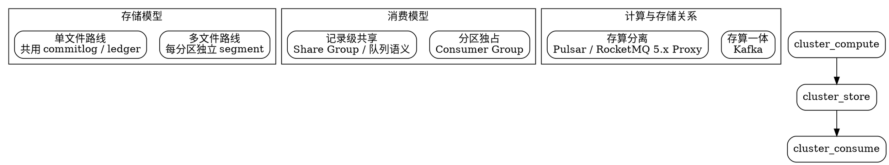
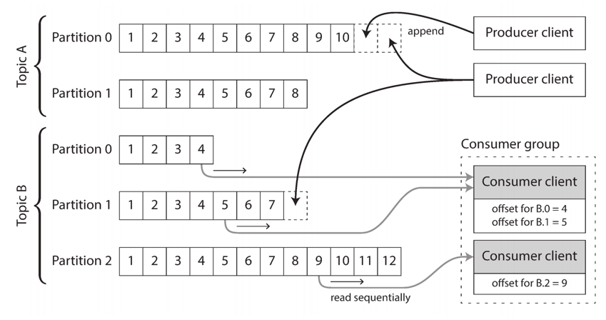
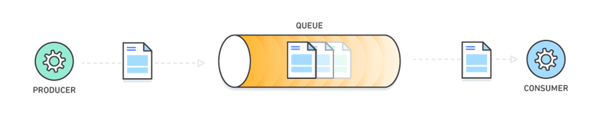
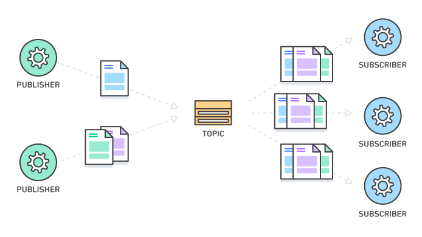

## Introduction

在计算机科学中，消息队列与邮箱（mailbox）是软件工程中的组件，通常用于进程间通信（IPC），或用于同一进程内的线程间通信。它们借助队列来传递消息 —— 即传递控制权或内容。组通信系统（group communication）提供的是类似的功能。

消息队列做的事本质上只有两件：**把数据可靠地存起来**，以及**把数据高效地递给需要它的一方**。围绕这两件事，各家在模型、协议、存储与运维上做出了不同取舍，形成了不同的适用场景。本文先给出三个主流开源产品（Kafka / RocketMQ / Pulsar）的定位差异与选型建议，再逐层展开消息系统、协议、存储、客户端、模型、特性与常见问题；最后给出各产品的子目录导航。

> [!NOTE]
> 本目录收录的三个产品笔记都标注了**经源码核实的版本基线与纠错点** —— 三者都在 4.x 附近经历了版本级重构（Kafka 4.3.1 / RocketMQ 5.5.1 / Pulsar 4.2.4），网上流传的中文资料大多停留在 2.x/3.x，照抄容易出错。

```dot
digraph MQ {
    rankdir=TB;
    node [shape=box, style=rounded];

    subgraph cluster_store {
        label="存储模型";
        direction=LR;
        multi [label="多文件路线\n每分区独立 segment"];
        single [label="单文件路线\n共用 commitlog / ledger"];
    }

    subgraph cluster_consume {
        label="消费模型";
        direction=LR;
        exclusive [label="分区独占\nConsumer Group"];
        shared [label="记录级共享\nShare Group / 队列语义"];
    }

    subgraph cluster_compute {
        label="计算与存储关系";
        direction=LR;
        coupled [label="存算一体\nKafka"];
        split [label="存算分离\nPulsar / RocketMQ 5.x Proxy"];
    }

    cluster_store -> cluster_consume;
    cluster_compute -> cluster_store;
}
```

### 三个产品的定位差异

理解三者差异最快的方式是问三个问题：**数据存在哪、谁来做路由、怎么扩**。

| | Kafka 4.3.1 | RocketMQ 5.5.1 | Pulsar 4.2.4 |
| -- | --------- | ------------- | ----------- |
| 定位 | 事件流平台（日志型） | 面向业务的消息队列 | 存算分离的云原生队列 |
| 存储路线 | **多文件**：每分区独立 segment | **单文件**：全 topic 共用 commitlog | **两级**：topic → ledger → segment → entry |
| 存储引擎 | 自研日志系统 | 自研 CommitLog | **独立的 Apache BookKeeper** |
| 零拷贝路线 | `FileChannel.transferTo`（内核 sendfile） | **mmap**（能拿到消息内容） | mmap + BookKeeper ledger |
| 路由 | 客户端直连 broker | NameServer 轻量注册中心 | metadata store + bundle 切分 |
| 扩容粒度 | 加 partition（受单文件路线限制） | 加 topic 几乎无影响 | **加 bookie**（存储层独立扩） |
| 消息过滤 | 需自行用 Streams | Tag + SQL92（Broker 端） | Tag + SQL92（JavaCC AST） |
| 事务消息 | 事务/幂等生产者 | 2PC + 回查（half 消息改写 topic） | TC 事务协调器（**默认关闭**） |
| 共享消费 | 4.x 新增 ShareGroup（记录级） | 无（队列语义靠 topic 模拟） | 无（天然支持同一订阅多订阅者） |
| 跨集群复制 | MirrorMaker v2 | 4.x 已移除内置方案 | 4.x **已移除** geo-replication |

> [!IMPORTANT]
> **零拷贝路线的差异决定了两者的功能边界**，这是本目录最值得记住的一条主线：Kafka 用 `sendfile` 只把字节搬出去，应用层拿不到消息内容，因此做不了「读到内容再过滤/改写」这类事；RocketMQ 用 `mmap` 能拿到完整消息，才可能有 Broker 端的 SQL92 表达式过滤与死信二次投递。详见 [Kafka Storage](/docs/CS/MQ/Kafka/Storage.md) 与 [RocketMQ Store](/docs/CS/MQ/RocketMQ/Store.md)。

### 选型速查

| 场景 | 推荐 | 理由 |
| ---- | ---- | ---- |
| 日志聚合、埋点、大数据管道 | **Kafka** | 吞吐与生态（Streams/Connect）最强 |
| 业务消息、订单/通知、需要事务与延时 | **RocketMQ** | 功能完备，topic 多也不掉性能 |
| 多租户、存算独立扩、细粒度扩容 | **Pulsar** | bundle 级卸载 + bookie 独立扩容 |
| topic 数量极多（数千以上） | **RocketMQ** | 共用 commitlog，无文件数爆炸 |
| 需要队列语义（多消费者抢任务） | **Pulsar** 或 Kafka 4.x ShareGroup | 记录级共享 + 逐条 ack |

> [!TIP]
> 不要迷信「Kafka 吞吐一定更高」。Kafka 的优势建立在 **partition 数量可控**的前提上 —— partition 多到一定程度，写侧会退化为随机写。RocketMQ 共用 commitlog，topic 数量对其影响小得多。

### 目录导航

- [Apache Kafka](/docs/CS/MQ/Kafka/Kafka.md) —— 事件流平台
- [Apache RocketMQ](/docs/CS/MQ/RocketMQ/RocketMQ.md) —— 业务消息队列
- [Apache Pulsar](/docs/CS/MQ/Pulsar/Pulsar.md) —— 云原生存算分离队列
- [RabbitMQ](/docs/CS/MQ/RabbitMQ.md) —— 轻量队列，Erlang 实现

## Message System

在这个发布/订阅模型下，不同系统采取了差异很大的做法，没有一种方案适用于所有场景。要区分这些系统，问两个问题特别有帮助：

1. **如果生产者发送消息的速度超过消费者处理的速度，会发生什么？**
   大体上有三种选择：系统丢弃消息、把消息缓存在队列里、或者施加反压（也称流控，即阻塞生产者继续发送）。
   例如 Unix 管道和 TCP 就是用反压：它们有一个固定大小的缓冲区，缓冲区满时发送方会被阻塞，直到接收方把数据取走。
   如果选择缓存到队列，那么队列增长时的行为很关键 —— 队列撑爆内存时系统会崩溃吗？还是把消息写到磁盘？如果写盘，磁盘访问又如何影响消息系统的性能？
2. **如果节点崩溃或临时离线，会丢消息吗？**
   与数据库一样，持久性通常需要写盘和/或副本复制的某种组合，而这有成本。
   如果能接受偶尔丢消息，那么同样的硬件上大概能获得更高的吞吐和更低的延迟。

消息丢失是否可接受非常取决于应用。对于周期性上报的传感器读数和指标，偶尔缺失一个数据点也许并不重要 —— 反正稍后会送来更新后的值。但要注意，如果丢弃的消息数量很大，指标不正确这件事可能不会立刻被发现；而如果是计数场景，可靠投递就重要得多 —— 每丢一条消息就意味着计数错误。

### Direct messaging from producers to consumers

不少消息系统让生产者与消费者之间直接通过网络通信，不经过中间节点。

### Message brokers

另一种广泛使用的方案是通过消息代理（message broker，也叫消息队列）来收发消息，本质上是一种针对消息流做了优化的数据库。它作为服务器运行，生产者和消费者以客户端身份连接上去 —— 生产者把消息写入代理，消费者从代理读取消息。

数据集中到代理之后，系统更容易容忍客户端的来来去去（连接、断开、崩溃），而持久性问题则转移给了代理。有些消息代理只在内存里保存消息，另一些（取决于配置）会写盘，以便代理崩溃时消息不丢。遇到慢消费者时，它们通常允许队列无界增长（而非丢弃消息或施加反压），不过这同样可能取决于配置。

排队带来的一个结果是消费者通常是异步的：生产者发送消息时一般只等代理确认「我已经缓冲好了」，不会等消息被消费者处理完。投递会在未来某个不确定的时刻发生 —— 往往在一秒之内，但如果队列积压，也可能晚得多。

#### Message brokers与数据库的对比

有些消息代理甚至能参与 XA 或 JTA 的两阶段提交协议，这让它们在本质上与数据库非常接近。不过两者之间仍有一些重要的实际差异：

- 数据库通常一直保存数据直到被显式删除，而大多数消息代理在消息成功投递给消费者之后就自动删除它 —— 这类消息代理不适合做长期数据存储。
- 由于会快速删除消息，大多数消息代理假定自己的**工作集相当小**，也就是队列很短。如果因为消费者太慢而需要缓冲大量消息（内存不够时可能溢写到磁盘），那么每条消息的处理耗时都会变长，整体吞吐可能下降。
- 数据库往往支持二级索引和各种数据检索方式，而消息代理通常支持以某种方式订阅匹配特定模式的一部分 topic。机制不同，但本质上都是让客户端选择它关心的那部分数据。
- 查询数据库时，结果通常基于某个时间点的数据快照；如果之后另一个客户端写入了会改变该查询结果的数据，第一个客户端不会得知自己先前的结果已经过期（除非它重新查询或轮询变更）。相比之下，消息代理不支持任意查询，但会在数据变化时（即有新消息可用时）通知客户端。

#### 多消费者

当多个消费者读取同一个 topic 的消息时，主要有两种消息传递模式：

- **负载均衡（Load balancing）** —— 每条消息只投递给其中一个消费者，于是消费者可以分摊 topic 中消息的处理工作。代理可以任意把消息分配给各消费者。这种模式适合消息处理代价高昂的场景：你需要能通过增加消费者来并行处理。（在 AMQP 中可以让多个客户端消费同一个队列来实现负载均衡；在 JMS 中这叫共享订阅。）
- **广播（Fan-out）** —— 每条消息都投递给所有消费者。广播让若干独立消费者各自「调频」到同一份消息流上而互不影响，相当于流处理版的「多个批处理作业读同一个输入文件」。（在 JMS 中由 topic 订阅提供，在 AMQP 中由 exchange 绑定提供。）

两种模式可以组合使用：比如两组不同的消费者各自订阅同一个 topic，使得每组都收到全部消息，但组内每条消息只由其中一个节点接收。

## Protocols

从功能支持、迭代速度、灵活性上考虑 大多数消息队列的核心通信协议都会选择自定义的私有协议

私有协议的设计

- 为了保证性能和可靠性 几乎所有主流消息队列在核心生产、消费链路的网络通信协议都是基于可靠性高、长连接的 [TCP](/docs/CS/CN/TCP/TCP.md) 协议
- 应用通信协议分为请求和返回两种 协议包含协议头和协议体两部分
- 编解码在实现上分为自定义实现和使用现有的编解码框架两种 从零实现编解码器比较复杂 一些消息队列（如 RocketMQ5.0 和 Pulsar) 开始使用业界成熟的编解码器 如 Google 的 [ProtocolBuffer](/docs/CS/Distributed/RPC/ProtoBuf.md)

## Network

基于 IO 多路复用技术和 Reactor 模型，可以解决网络模块的性能问题

网络模块的特点是编码非常复杂，要考虑的细节和边界条件非常多，一些异常情况的处理也很细节，需要经过长时间的打磨。但是一旦开发完成，稳定后，代码几乎不需要再改动，因为需求是相对固定的而 Java NIO 库开发一个 Server 需要的工作量非常大

为了提高稳定性或者降低成本，选择现成的、成熟的 NIO 框架是一个更好的方案
[Netty]() 就是这样一个基于 Java NIO 封装的成熟框架 当前业界主流消息队列 RocketMQ、Pulsar 也都是基于 Netty 开发的网络模块，Kafka 因为历史原因是基于 Java NIO 实现的

## Storage

消息队列中的数据一般分为元数据和消息数据  

元数据信息的特点是数据量比较小，不会经常读写，但是需要保证数据的强一致和高可靠，不允许出现数据的丢失。同时，元数据信息一般需要通知到所有的 Broker 节点，Broker 会根据元数据信息执行具体的逻辑  

### 元数据存储

元数据信息的存储，一般有两个思路。

- 基于第三方组件来实现元数据的存储。
- 在集群内部实现元数据的存储

基于第三方组件来实现元数据的存储是目前业界的主流选择。

比如 Kafka ZooKeeper 版本、Pulsar、RocketMQ 用的就是这个思路，其中 Kakfa 和 Pulsar 的元数据存储在 ZooKeeper中，RocketMQ 存储在 NameServer 中（准确说是存储在 Broker+NameServer 中）

这个方案最大的优点是集成方便，开发成本低，能满足消息队列功能层面的基本要求，因为我们可以直接复用第三方组件已经实现的一致性存储、高性能的读写和存储、Hook 机制等能力，而且在后续集群构建中也可以复用这个组件，能极大降低开发难度和工作成本  

但也有缺点。引入第三方组件会增加系统部署和运维的复杂度，而且第三方组件自身的稳定性问题会增加系统风险，第三方组件和多台 Broker 之间可能会出现数据信息不一致的情况，导致读写异常  

另一种思路，集群内部实现元数据的存储是指在集群内部完成元数据的存储和分发。也就是在集群内部实现类似第三方组件一样的元数据服务，比如基于 Raft 协议实现内部的元数据存储模块或依赖一些内置的数据库。目前 Kafka 去 ZooKeeper 的版本、RabbitMQ 的 Mnesia、Kafka 的 C++ 版本 RedPanda 用的就是这个思路  

这个方案的优缺点跟第一个正好相反。优点是部署和运维成本低，不会因为依赖第三方服务导致稳定性问题，也不会有数据不一致的问题。但缺点是开发成本高，前期要投入大量的开发人力  

### 消息数据存储

消息数据的存储，分为存储结构、数据分段、数据存储格式、数据清理四个部分  

在消息队列中，跟存储有关的主要是 Topic 和分区两个维度。用户可以将数据写入 Topic 或直接写入到分区  不过如果写入 Topic，数据也是分发到多个分区去存储的。所以从实际数据存储的角度来看，Topic 和 Group 不承担数据存储功能，承担的是逻辑组织的功能，实际的数据存储是在在分区维度完成的

从技术架构的角度，数据的落盘存储也有两个思路  

- 每个分区单独一个存储"文件"
- 每个节点上所有分区的数据都存储在同一个"文件"

第一个思路，每个分区对应一个文件的形式去存储数据。具体实现时，每个分区上的数据顺序写到同一个磁盘文件中，数据的存储是连续的。因为消息队列在大部分情况下的读写是有序的，所以这种机制在读写性能上的表现是最高的

但如果分区太多，会占用太多的系统 FD 资源，极端情况下有可能把节点的 FD 资源耗完，并且硬盘层面会出现大量的随机写情况，导致写入的性能下降很多，另外管理起来也相对复杂。Kafka 在存储数据的组织上用的就是这个思路

第二种思路，每个节点上所有分区的数据都存储在同一个文件中，这种方案需要为每个分区维护一个对应的索引文件，索引文件里会记录每条消息在 File 里面的位置信息，以便快速定位到具体的消息内容  

因为所有文件都在一份文件上，管理简单，也不会占用过多的系统 FD 资源，单机上的数据写入都是顺序的，写入的性能会很高

缺点是同一个分区的数据一般会在文件中的不同位置，或者不同的文件段中，无法利用到顺序读的优势，读取的性能会受到影响，但是随着 SSD 技术的发展，随机读写的性能也越来越高。如果使用 SSD 或高性能 SSD，一定程度上可以缓解随机读写的性能损耗，但 SSD 的成本比机械硬盘高很多

目前 RocketMQ、RabbitMQ 和 Pulsar 的底层存储 BookKeeper 用的就是这个方案

这种方案的数据组织形式一般是这样的。假设这个统一的文件叫 commitlog，则 commitlog就是用来存储数据的文件，.index 是每个分区的索引信息

选择呢哪种方案考虑是你对读和写的性能要求  

第一种方案，单个文件读和写都是顺序的，性能最高。但是当文件很多且都有读写的场景下，硬盘层面就会退化为随机读写，性能会严重下降

第二种方案，因为只有一个文件，不存在文件过多的情况，写入层面一直都会是顺序的，性能一直很高。但是在消费的时候，因为多个分区数据存储在同一个文件中，同一个分区的数据在底层存储上是不连续的，硬盘层面会出现随机读的情况，导致读取的性能降低

不过随机读带来的性能问题，可以通过给底层配备高性能的硬件来缓解。所以当前比较多的消息队列选用的是第二种方案，但是 Kafka 为了保证更高的吞吐性能，选用的是第一种方案  

不管是方案一还是方案二，在数据存储的过程中，如果单个文件过大，在文件加载、写入和检索的时候，性能就会有问题，并且消息队列有自动过期机制，如果单个文件过大，数据清理时会很麻烦，效率很低。所以，我们的消息数据都会分段存储  

数据分段的规则一般是根据大小来进行的，比如默认 1G 一个文件，同时会支持配置项调整分段数据的大小  

进行了分段，消息数据可能分布在不同的文件中。所以我们在读取数据的时候，就需要先定位消息数据在哪个文件中。为了满足这个需求，技术上一般有根据偏移量定位或根据索引定位两种思路  

根据偏移量（Offset）来定位消息在哪个分段文件中，是指通过记录每个数据段文件的起始偏移量、中止偏移量、消息的偏移量信息，来快速定位消息在哪个文件。

当消息数据存储时，通常会用一个自增的数值型数据（比如 Long）来表示这条数据在分区或commitlog 中的位置，这个值就是消息的偏移量

在实际的编码过程中，记录文件的起始偏移量一般有两种思路：单独记录每个数据段的起始和结束偏移量，在文件名称中携带起始偏移量信息。因为数据是顺序存储的，每个文件记录了本文件的起始偏移量，那么下一个文件的起始偏移量就是上一个文件的结束偏移量  

如果用索引定位，会直接存储消息对应的文件信息，而不是通过偏移量来定位到具体文件。

具体是通过维护一个单独的索引文件，记录消息在哪个文件和文件的哪个位置。读取消息的时候，先根据消息 ID 找到存储的信息，然后找到对应的文件和位置，读取数据。RabbitMQ 和RocketMQ 用的就是这个思路

这两种方案所面临的场景不一样。根据偏移量定位数据，通常用在每个分区各自存储一份文件的场景；根据索引定位数据，通常用在所有分区的数据存储在同一份文件的场景。因为在前一种场景，每一份数据都属于同一个分区，那么通过位点来二分查找数据的效率是最高的。第二种场景，这一份数据属于多个不同分区，则通过二分查找来查找数据效率很低，用哈希查找效率是最高的  

消息数据存储格式一般包含消息写入文件的格式和消息内容的格式两个方面  

从性能和空间冗余的角度来看，消息队列中的数据基本都是以二进制的格式写入到文件的  

消息内容的格式是指写入到文件中的数据都包含哪些信息。对于一个成熟的消息队列来说，消息内容格式不仅关系功能维度的扩展，还牵涉性能维度的优化
在数据的存储格式设计方面，内容的格式需要尽量完整且不要有太多冗余

消息数据的存储格式虽然没有统一的规范，但是一般包含通用信息和业务信息两部分。通用信息主要包括时间戳、CRC、消息头、消息体、偏移量、长度、大小等信息，业务信息主要跟业务相关，包含事务、幂等、系统标记、数据来源、数据目标等信息  

#### 单文件与多文件的取舍

前面提到的两种落盘思路（每分区独立文件 vs 全部分区共用一个文件），在工程上可进一步归纳为单文件与多文件两种形态：

|              | 单文件               | 多文件       |
| ------------ | -------------------- | ------------ |
| 文件大小     | 大                   | 小           |
| 数据定位     | 需要索引辅助快速定位 | 需要索引辅助 |
| 读取速率     | 取决于访问模式       | 取决于访问模式 |
| 内存映射空间 | 大                   | 小           |
| 内存映射频率 | 低                   | 高           |
| 实现难度     | 中等                 | 较高         |
| 使用场景     | 写多读少             | 读写均衡、多分区并发 |

单文件路线（commitlog 模式）顺序写强，但按分区读取时退化为随机读；多文件路线（分区独立文件）可按文件顺序读，但文件数过多时写侧退化为随机写，且占用系统 FD。这是 Kafka 选多文件、RocketMQ/Pulsar 选单文件的根本原因。

按 topic 或按分区划分文件是另一层维度：Kafka 是「分区 → 独立 segment 文件」并在文件名携带基准 offset；RocketMQ 是「全部 topic 共用一个 commitlog + 每 topic 一个 ConsumeQueue 索引」；Pulsar 则是「topic → ledger → segment → entry」两级。详见 [Kafka Storage](/docs/CS/MQ/Kafka/Storage.md) 与 [RocketMQ Store](/docs/CS/MQ/RocketMQ/Store.md)。

#### 消息数据清理机制

消息队列中的数据最终都会删除，时间周期短的话几小时、甚至几分钟，正常情况一天、三天、七天，长的话可能一个月，基本很少有场景需要在消息队列中存储一年的数据。

消息队列的数据过期机制一般有手动删除和自动删除两种形式，从实现上看主要有三种思路

- 消费完成执行 ACK 删除数据
- 根据时间和保留大小删除
- ACK 机制和过期机制相结合  

消费完成执行 ACK 删除数据，技术上的实现思路一般是：当客户端成功消费数据后，回调服务端的 ACK 接口，告诉服务端数据已经消费成功，服务端就会标记删除该行数据，以确保消息不会被重复消费。ACK 的请求一般会有单条消息 ACK 和批量消息 ACK 两种形式  

纵观业界主流消息队列，三种方案都有在使用，RabbitMQ 选择的是第一个方案，Kafka 和RocketMQ 选择的是第二种方案，Pulsar 选择的是第三种方案  

## Partitioned Logs

[日志](/docs/CS/log/Log.md) 本质上就是磁盘上一条只能追加的记录序列。

同样的结构可以用来实现消息代理：生产者把消息追加到日志末尾来发送，消费者则通过顺序读取日志来接收消息。如果消费者读到了日志末尾，就等待「有新消息被追加」的通知。

为了扩展到单块磁盘无法提供的吞吐，日志可以分区。不同分区可以放在不同机器上，于是每个分区都是一个独立的日志，可以独立于其他分区读写。这样，一个 topic 就定义为「一组承载同类消息的分区」。

在每个分区内部，代理为每条消息分配一个单调递增的序号，也就是**偏移量（offset）**（图 1 中方框里的数字就是消息的 offset）。这个序号之所以有意义，是因为分区是只能追加的 —— 分区内的消息完全有序，但**不同分区之间没有顺序保证**。

图 1. 生产者把消息追加到 topic-partition 文件末尾，消费者顺序读取这些文件。

[Apache Kafka](/docs/CS/MQ/Kafka/Kafka.md)、Amazon Kinesis Streams 和 Twitter 的 DistributedLog 都是这样工作的基于日志的消息代理。Google Cloud Pub/Sub 在架构上类似，但暴露的是 JMS 风格的 API 而非日志抽象。尽管这些消息代理都把全部消息写盘，但通过跨多机分区，它们能实现每秒数百万条消息的吞吐；通过复制消息实现容错 [22, 23]。

基于日志的方案天然支持广播式消息：多个消费者可以各自独立读日志而互不影响 —— 读一条消息并不会把它从日志里删掉。而要在一组消费者之间做负载均衡，代理不再把单条消息指派给消费者客户端，而是把**整个分区**分配给消费组中的某个节点。

每个客户端于是消费它所获分配到的全部消息。通常消费者拿到一个日志分区后，就以直白的单线程方式顺序读取该分区。这种**粗粒度**负载均衡有一些缺点：

- 分摊某个 topic 消费工作的节点数最多等于该 topic 的分区数，因为同一分区内的消息只会投递给同一个节点。
- 如果某条消息处理很慢，它会拖住该分区内后续所有消息的处理（这属于队头阻塞的一种）。

因此在「消息处理代价高、且希望逐条并行处理、同时消息顺序不太重要」的场景下，JMS/AMQP 风格的消息代理更合适。反过来，在「消息吞吐高、每条消息处理都很快、且消息顺序很重要」的场景下，基于日志的方案表现非常好。

### Compaction

如果只往日志里追加，最终会把磁盘空间用尽。为了回收磁盘空间，日志实际上被划分为多个**段（segment）**，并会不时删除旧段或将其移入归档存储。（更精细的释放磁盘空间方式后面再讨论。）

这意味着如果某个慢消费者跟不上消息速度，落后到其消费偏移量指向一个已被删除的段时，它就会漏掉一部分消息。实际上，日志实现了一个**有界大小的缓冲区** —— 满了就丢弃旧消息，也称循环缓冲区（circular buffer / ring buffer）。不过由于这个缓冲区在磁盘上，它可以相当大。

来算一笔粗账：撰写本文时，一块典型的大容量硬盘容量约 6 TB，顺序写吞吐约 150 MB/s。若以最快速度写消息，大约 11 小时就能把盘写满。也就是说，磁盘能缓冲 11 小时的消息，之后便开始覆盖旧消息。这个比例在多用几块硬盘、多台机器时依然成立。实践中，部署很少用满磁盘的写带宽，所以日志通常能缓冲数天甚至数周的消息。

无论保留消息多久，日志的吞吐基本保持恒定 —— 因为每条消息反正都要写盘。这与「默认把消息放内存、队列过大才落盘」的消息系统形成鲜明对比：后者在队列短的时候很快，一旦开始写盘就慢得多，吞吐取决于保留了多少历史。

#### 当消费者跟不上生产者时

前面讨论过消费者跟不上生产速度时的三种选择：丢弃消息、缓冲、施加反压。在这个分类下，基于日志的方案属于「缓冲」的一种 —— 缓冲区很大但固定（受可用磁盘空间限制）。如果消费者落后到所需消息比磁盘保留的更旧，它就读不到那些消息了 —— 也就是说代理实际上丢弃了超出缓冲区容量的更早消息。你可以监控消费者落后日志头的程度，落后严重时告警。由于缓冲区很大，有足够时间让运维人员修复慢消费者，让它赶上进度而不开始漏消息。

即使消费者确实落后太多开始漏消息，也**只影响这一个消费者**，不会干扰其他消费者的服务。这一点是重要的运维优势：你可以放心地拿生产日志做开发、测试或调试的实验性消费，而不必担心打断生产服务。消费者关闭或崩溃时，它就停止消耗资源了 —— 唯一残留的是它的消费偏移量。

这个行为也和传统消息代理形成对照：在传统代理里，你必须小心删除那些消费者已关闭的队列，否则它们会继续无谓地累积消息、占用活跃消费者的内存。

#### 重放旧消息

前面提到，在 AMQP 和 JMS 风格的消息代理中，处理并确认消息是一个**破坏性操作** —— 因为它会导致消息在代理上被删除。而基于日志的消息代理里，消费消息更像是从文件读取：这是一个只读操作，不改变日志。

除了消费者的输出之外，处理消息唯一的副作用就是消费偏移量向前移动。但偏移量由消费者自己控制，因此必要时可以随意操作：比如用昨天的偏移量启动一个消费者副本、把输出写到别处，从而重新处理最近一天的消息。这个过程可以重复任意多次，每次换不同的处理逻辑。

## Client

消息队列的客户端主要包含生产、消费、集群管控三类功能

### Producer

从客户端 SDK 实现的角度来看，生产模块包含客户端基础功能和生产相关功能两部分，其中基础功能是客户端中所有功能共用的 

生产模块基础功能包括请求连接管理、心跳检测、内容构建、序列化、重试、容错处理等等。生产功能是黄色部分，包括客户端寻址、分区选择、批量发送，生产错误处理、SSL、压缩、事务、幂等等等  

客户端和服务端之间基本都是通过各自语言的网络库，创建 TCP 长连接进行通信的。在大部分实现中，为了避免连接数膨胀，每个客户端实例和每台 Broker 只会维护一条 TCP 连接 

建立一条 TCP 连接很简单，更关键的是，什么情况下建立连接？一般有初始化创建连接和使用时创建链接两种方式  

因为客户端会有空闲连接回收机制，创建连接的耗时一般较短，所以在实际的架构实现中，两种方式都会用，优劣区别并不明显。不过，从资源利用率的角度考虑，建议你使用晚建立连接的方式。

因为连接并不是任何时候都有数据，可能出现长时间连接空闲。所以连接都会搭配连接回收机制，连接建立后如果连接出现长时间空闲，就回收连接。连接回收的策略一般是判断这段时间内是否有发送数据的行为，如果没有就判断是空闲，然后执行回收

因为单个 TCP 连接发送性能存在上限，我们就需要在客户端启动多个生产者，提高并发读写的能力。一般情况下，每个生产者会有一个唯一的 ID 或唯一标识来标识客户端，比如ProduceID 或客户端的 IP+Port  

客户端和服务端之间的心跳检测机制的实现，一般有基于 TCP 的 KeepAlive 保活机制和应用层主动探测两种形式  

 从请求的角度，有些错误是重试可以恢复的，比如连接断开、Leader 切换、发送偶尔超时、服务端某些异常等；有些错误是不可恢复的，比如 Topic/ 分区不存在、服务端 Broker 不存在、集群和 Broker 长时间无响应等。

所以，在客户端的处理中也会将错误分为可重试错误和不可重试错误两类

因为网络环境、架构部署的复杂性，集群可能出现短暂网络抖动、Leader 切换等异常，可重试错误就是这类通过一次或多次重试可能恢复的异常；不可重试的错误就是不管如何重试都无法恢复的异常

客户端收到可重试错误后，会通过一定的策略进行重试，尽量确保生产流程的顺利进行

虽然实现思路很直接、很简单，但在客户端 SDK 的实现过程中，错误处理是一个包含很多细节的工作，一般需要考虑下面几个点

如何定义可恢复错误和不可恢复错误。
完整的错误码的定义和枚举，好的错误码定义可以提高排查问题的效率。
错误后重试的代码实现方式是否合理高效。
判断哪些情况需要停止客户端，向上抛错，以免一些错误信息一直在 SDK 内空转，提高上层感知异常和排查异常的难度。
日志信息打印 debug、info、error 日志时，是否包含了完整的内容

重试机制

发生错误后，客户端一般会提供重试策略，接下来我们来看看重试机制的实现。

重试策略一般会支持重试次数和退避时间的概念。当消息失败，超过设置的退避时间后，会继续重试，当超过重试次数后，就会抛弃消息或者将消息投递到配置好的重试队列中。

退避时间是可以配置的，比如 1s、10s、1 分钟。当出现错误时，就会根据退避策略退避，再尝试写入。一般情况下，重试是有次数上限的，当然也支持配置无限重试。

退避策略影响的是重试的成功率，因为网络抖动正常是 ms 级，某些异常可能会抖动十几秒。此时，如果退避策略设置得太短，在退避策略和重试次数用完后，可能消息还没生产成功；如果退避时间设置太长，可能导致客户端发送堵塞消息堆积

客户端寻址机制  

业界提出了 Metadata（元数据）寻址机制和服务端内部转发两个思路  

服务端会提供一个获取全量的 Metadata 的接口，客户端在启动时，首先通过接口拿到集群所有的元数据信息，本地缓存这部分数据信息。然后，客户端发送数据的时候，会根据元数据信息的内容，得到服务端的地址是什么，要发送的分区在哪台节点上。最后根据这两部分信息，将数据发送到服务端  

在 Metadata 寻址机制中，元数据信息主要包括 Topic 及其对应的分区信息和 Node 信息两部分  

客户端一般通过定期全量更新 Metadata 信息和请求报错时更新元数据信息两种方式，来保证客户端的元数据信息是最新的。目前 Kafka、RocketMQ、Pulsar 用的都是这个方案

另外一种服务端内部转发机制，客户端不需要经过寻址的过程，写入的时候是随机把数据写入到服务端任意一台 Broker。

具体思路是服务端的每一台 Broker 会缓存所有节点的元数据信息，生产者将数据发送给Broker 后，Broker 如果判断分区不在当前节点上，会找到这个分区在哪个节点上，然后把数据转发到目标节点

这个方案的好处是分区寻址在服务端完成，客户端的实现成本比较低。但是生产流程多了一跳，耗时增加了。另外服务端因为转发多了一跳，会导致服务端的资源损耗多一倍，比如CPU、内存、网卡，在大流量的场景下，这种损耗会导致集群负载变高，从而导致集群性能降低。

所以这种方案不适合大流量、高吞吐的消息队列。目前业界只有 RabbitMQ 使用这个方案。

生产分区分配策略

我们知道，数据可以直接写入分区或者写入 Topic。写入 Topic 时，最终数据还是要写入到某个分区。这个数据选择写入到哪个分区的过程，就是生产数据的分区分配过程。过程中的分配策略就是生产分区分配策略

一般情况下，消息队列默认支持轮询、按 Key Hash、手动指定、自定义分区分配策略四种分区分配策略

轮询是所有消息队列的默认选项。消息通过轮询的方式依次写入到各个分区中，这样可以保证每个分区的数据量是一样的，不会出现分区数据倾斜  

但是如果我们需要保证数据的写入是有序的，轮询就满足不了。因为在消费模型中，每个分区的消费是独立的，如果数据顺序依次写入多个分区，在消费的时候就无法保持顺序。所以为了保证数据有序，就需要保证 Topic 只有一个分区。这是另外两种分配策略的思路  

按 Key Hash 是指根据消息的 Key 算出一个 Hash 值，然后跟 Topic 的分区数取余数，算出一个分区号，将数据写入到这个分区中  

这种方案的好处是可以根据 Key 来保证数据的分区有序。比如某个用户的访问轨迹，以客户的 AppID 为 Key，按 Key Hash 存储，就可以确保客户维度的数据分区有序。缺点是分区数量不能变化，变化后 Hash 值就会变，导致消息乱序。并且因为每个 Key 的数据量不一样，容易导致数据倾斜。

手动指定

很简单，就是在生产数据的时候，手动指定数据写入哪个分区。这种方案的好处就是灵活，用户可以在代码逻辑中根据自己的需要，选择合适的分区，缺点就是业务需要感知分区的数量和变化，代码实现相对复杂。

除了这 3 种默认策略，消息队列也支持

自定义分区分配策略，让用户灵活使用。内核提供Interface（接口）机制，用户如果需要指定自定义的分区分配策略，可以实现对应的接口，然后配置分区分配策略。比如 Kafka 可以通过实现org.apache.kafka.clients.producer.Partitioner 接口实现自定义分区策略

客户端支持批量写入数据的前提是，需要在协议层支持批量的语义。否则就只能在业务中自定义将多条消息组成一条消息。

批量发送的实现思路一般是在客户端内存中维护一个队列，数据写入的时候，先将其写到这个内存队列，然后通过某个策略从内存队列读取数据，发送到服务端

批量发送数据的策略和存储模块的刷盘策略很像，都是根据数据条数或时间聚合后，汇总发送到服务端，一般是满足时间或者条数的条件后触发发送操作，也会有立即发送的配置项。  

Kafka 是按照时间的策略批量发送的，提供了 linger.ms、max.request.size、batch.size 三个参数，来控制数据的批量发送  

Pulsar 也提供了 batchingEnabled, batchingMaxMessages, batchingMaxPublishDelayMicros 三个参数，来控制数据批量发送

数据发送方式

消息队列一般也会提供同步发送、异步发送、发送即忘三种形式。

同步和异步更多是语言语法的实现，同步发送主要解决数据发送的即时性和顺序性，异步发送主要考虑性能

发送即忘指消息发送后不关心请求返回的结果，立即发送下一条。这种方式因为不用关心发送结果，发送性能会提升很多。缺点是当数据发送失败时无法感知，可能有数据丢失的情况，所以适合用在发送不重要的日志等场景。Kafka 提供了 ack=0、RocketMQ 提供了sendOneway 来支持这种模式  

集群管控操作

集群管控操作一般是用来完成资源的创建、查询、修改、删除等集群管理动作。资源包括主题、分区、配置、消费分组等等。

从功能上来看，消息队列一般会提供多种集群管理方式，比如命令行、客户端、HTTP 接口等等。

命令行工具是最基本的支持方式

有的消息队列也会支持 HTTP 接口形式的管控操作。好处是因为 HTTP 协议的通用性，业务可以从各个环境发起管控的调用，不用非得使用 admin SDK。另外客户端封装 HTTP 接口实现命令行工具的成本也比较低。

### Consumer

消费端 SDK 和生产端 SDK 一样，主要包括客户端基础功能和消费相关功能两部分  

从实现来看，消费相关功能包括消费模型、分区消费模式、消费分组（订阅）、消费确认、消费失败处理五个部分  

为了满足不同场景的业务需求，从实现机制上来看，主流消息队列一般支持 Pull、Push、Pop 三种消费模型  

## Model

### Message Queue

消息队列是一种在 Serverless 与微服务架构中常用的异步服务间通信方式。消息被存放在队列中，直到被处理并删除；每条消息只会被某一个消费者处理一次。消息队列可用于解耦重量级处理、缓冲或批量聚合工作，以及平滑尖峰负载。

在现代云架构中，应用被解耦成更小、更独立、易于开发部署维护的构件，消息队列为这些分布式应用提供通信与协作。它能显著简化解耦式应用的编写，同时提升性能、可靠性与可扩展性，并让系统的不同部分能够异步通信与处理操作。

消息队列提供了一个轻量级缓冲区来临时存放消息，并提供端点让软件构件连接上去收发消息。消息通常很小，可以是请求、响应、错误消息或纯粹的信息。发送消息时，一个叫**生产者（producer）** 的构件把消息加入队列；消息一直存在队列里，直到另一个叫**消费者（consumer）** 的构件取走并处理它。

图 1. 消息队列。

许多生产者和消费者都可以使用同一个队列，但每条消息只会被一个消费者处理一次。因此这种消息模式常被称为「一对一」或「点对点」通信。当一条消息需要被多个消费者处理时，可以把消息队列与 Pub/Sub 消息结合成扇出（fan-out）设计模式。

### Pub-Sub

发布订阅模型允许把消息异步广播到系统的不同部分。作为消息队列的近亲，**消息主题（topic）** 提供了一种轻量机制来广播异步事件通知，并提供端点让软件构件连接上去收发消息。要广播消息，一个叫**发布者（publisher）** 的构件只需把消息推送到主题。

与消息队列（会把消息攒着直到被取走）不同，消息主题几乎不排队，会立即把消息推送给所有订阅者。除非订阅者设置了消息过滤策略，否则所有订阅了该主题的构件都会收到每一条广播消息。

图 2. 发布/订阅。

消息主题的订阅者往往各自承担不同职能，可以并行地对同一条消息做不同的处理。发布者不需要知道谁在消费它广播的信息，订阅者也不需要知道消息来自何方。这种消息风格与消息队列有微妙区别 —— 在消息队列里，发送消息的构件通常知道自己的接收方是谁。

## Features

### Message Delivery Semantics

所谓消息投递语义，指的是在故障恢复场景下所能期望的投递保证。经历故障恢复后，人们通常会区分出以下几种投递保证：

- **至多一次（At most once）**
  数据可能被处理过，但绝不会被处理两次。这种情况下数据可能丢失，但处理不会产生重复记录。
- **至少一次（At-least-once）**
  已被处理的数据可能被重放并再次处理。这种情况下每条数据都保证被处理，但可能产生重复记录。
- **恰好一次（Exactly once）**
  数据被处理且仅被处理一次，所有数据都保证被处理且不产生重复记录。这对许多企业应用是最理想的保证，但在分布式环境中通常被认为无法实现。
- ** Effectively Once（实质恰好一次）**
  是恰好一次的变体：它容忍数据处理过程中的重复，并要求流程的生产者侧是幂等的。也就是说，同一条记录被生产多次等价于只生产一次。落到实践上，就是把数据写入一个能保持 key 唯一性的系统，或用去重流程来防止重复记录被投递到外部系统。

### Push versus Pull

大多数消息队列都同时提供推（push）与拉（pull）两种获取消息的方式。

- **拉（Pull）** 指持续查询队列中是否有新消息。
- **推（Push）** 指有消息时通知消费者。

基于推的系统在面对差异化消费者时比较棘手，因为速率由代理控制。目标通常是让消费者尽可能快地消费，但不幸的是，在推系统里这意味着一旦消费速度低于生产速度，消费者就会被压垮（本质上相当于一次拒绝服务攻击）。基于拉的系统有个更好的性质：消费者只是落后，能追上时再追上。

这可以通过某种退避协议来缓解 —— 消费者可以表示自己不堪重负。但要让传输速率完全（且永不超量地）用满消费者能力，比看上去要棘手得多。此前尝试这样构建系统的经验让我们转向了更传统的拉模型。

基于拉的系统另一个优势是天然适合对发给消费者的数据做激进批处理。基于推的系统必须在「立即发送请求」与「先攒更多数据、稍后再发」之间做选择，且并不清楚下游消费者能否立即处理。若为了低延迟而调优成逐条发送，最终这些单条消息的传输还是会被缓冲起来，纯属浪费。基于拉的设计则解决了这个问题：消费者总是从它在日志中的当前位置之后（或某个可配置的上限内）一次性拉取所有可用消息，从而在不引入额外延迟的前提下获得最优的批量效果。

朴素的拉系统有一个缺陷：如果代理没有数据，消费者可能陷入紧密轮询的空转，本质上是忙等待数据到来。

### Schedule or Delay Delivery

许多消息队列支持为消息设置特定的投递时间。如果需要让所有消息有统一的延时，可以搭建一个延时队列。

### Dead-letter Queues

有时候消息无法被处理，原因可能五花八门：生产者或消费者应用内部出错、或者某个意外的状态变化影响了你的应用代码。比如用户用某个商品 ID 下单，但该商品 ID 已被删除，于是网店代码报错，承载该订单请求的消息就被送进了死信队列。

此外，生产者与消费者偶尔会误解它们通信所用的协议的某些方面，导致消息损坏或丢失；消费者侧的硬件故障也可能损坏消息载荷。

死信队列是一个特殊队列，其他队列可以把无法成功处理的消息发送进来。这样就能很方便地把它们挑出来单独检查，而不会阻塞队列处理，也不用在一条可能永远无法被成功消费的消息上白白消耗 CPU 周期。

死信队列的主要任务是处理消息失败。它让你把无法正确处理的消息挑出来并隔离，以弄清它们为何没能被成功处理。搭建死信队列后，你可以做以下几件事：

- 为任何进入死信队列的消息配置告警。
- 检视日志中可能导致消息进入死信队列的异常。
- 分析进入死信队列的消息内容，以诊断软件缺陷或生产者/消费者的硬件问题。
- 判断是否给消费者留够了处理消息的时间。

**什么时候该用死信队列？**

- 高吞吐、无序队列**应该**用死信队列。
- 当你的应用不依赖顺序时，一定要善用死信队列 —— 它能帮你排查消息传输中的错误。
- 注意：即使用了死信队列，也应继续监控自己的队列，并对因瞬时原因失败的消息重试发送。
- 用死信队列来减少消息数量、降低系统暴露于毒丸消息（能收到但无法处理的消息）之下的可能性。
- 当你需要能无限期重试发送某条消息时，**不要**在高吞吐无序队列上用死信队列。
- 例如，如果你的程序必须等待某个依赖进程先激活或变为可用，就不要用死信队列。
- 如果你不想破坏消息或操作的严格顺序，就**不要**在 FIFO 队列上用死信队列。
- 例如，视频剪辑套件中 Edit Decision List（EDL）的指令若改变顺序就会改变后续剪辑的上下文，这种场景不要用死信队列。

### Ordering

大多数消息队列提供的是尽力而为（best-effort）的顺序保证 —— 消息大体上按发送顺序投递，且保证至少投递一次。

### Transaction Message

目前只有 RocketMQ 实现了事务消息。

其他实现方式通常需要与数据库事务结合，做权衡取舍：

- 如果在数据库事务提交后再发消息，需要注意把半消息回查控制在 DB 默认事务超时时间之内，以保护 unknown 状态。
- 结合消息表保障事务 —— 通过消息表异步发送消息，并维护后续流转状态。

### Poison-pill Messages

毒丸消息（poison pill）是一种特殊的消息：能收到，但无法被处理。它用来向消费者发出「结束工作」的信号，使其不再等待新输入，类似于客户端/服务器模型中关闭 socket。

### Message Tracing

消息轨迹。

## Security

安全同样分三层：**认证**（SASL 确认「你是谁」）→ **传输加密**（TLS）→ **授权**（ACL 确认「你能做什么」）。三者在不同产品里的落地差异很大，且默认值陷阱不少 —— 例如 Kafka 的 `authorizer.class.name` 默认是空串（等于不装任何 authorizer），而 RocketMQ 与 Pulsar 的 ACL 存储位置在 4.x 都已随架构重构迁移。具体配置与源码默认值见 [Kafka Security](/docs/CS/MQ/Kafka/Security.md)。

## Architecture

最基础的消息队列应该具备五个模块。

- 通信协议：用来完成客户端（生产者和消费者）和 Broker 之间的通信，比如生产或消费
- 网络模块：客户端用来发送数据，服务端用来接收数据
- 存储模块：服务端用来完成持久化数据存储
- 生产者：完成生产相关的功能
- 消费者：完成消费相关的功能

消息队列的核心特性是高吞吐、低延时、高可靠，所以在协议上至少需要满足  

协议可靠性要高，不能丢数据。协议的性能要高，通信的延时要低  协议的内容要精简，带宽的利用率要高。协议需要具备可扩展能力，方便功能的增减  

大多数消息队列为了自身的功能支持、迭代速度、灵活性考虑，在核心通信协议的选择上不会选择公有协议，都会选择自定义私有协议  

私有协议的设计主要考虑网络通信协议选择、应用通信协议设计、编解码实现三个方面  

网络通信协议选型，基于可靠、低延时的需求，大部分情况下应该选择 TCP。

应用通信协议设计，分为请求协议和返回协议两方面。协议应该包含协议头和协议体两部分。协议头主要包含一些通用的信息，协议体包含请求维度的信息

RocketMQ 是业界唯一一个既支持自定义编解码，又支持成熟编解码框架的消息队列产品。RocketMQ 5.0 之前支持的 Remoting 协议是自定义编解码，5.0 之后支持的 gRPC 协议是基于 Protobuf 编解码框架  

## Issues

### Disk Access

#### PageCache

mmap

sendfile

- 写（Write）
- 尾读（Tailing Read）
- 追读（Catch-up Read）

### High Availability

**RabbitMQ**

镜像集群（Mirroring Cluster）

**Kafka**

- 一个 topic 可以有多个分区
- 分区在其他 broker 上有副本
- 只能读/写 leader
- leader 把数据同步给 follower，大多数 follower 同步成功后返回 ack

### 消息丢失

消息丢失需要消息从生产到消费整条链路上的组件协同保障

**RabbitMQ**

- 生产者确认（producer confirm）
- broker 落盘存储
- 消费者手动确认

**Kafka**

- broker
  - `unclean.leader.election.enable = false`
  - 设置 topic 的 `replication.factor > 1`：至少 2 个分区副本
  - 设置 broker 的 `min.insync.replicas > 1`：至少 1 个 follower
  - `replication.factor = min.insync.replicas + 1`
- 生产者
  - 设置 `acks = all`：必须写入所有副本后才 ack
  - 设置 `retries = MAX`：一直重试直到成功
- 消费者
  - `enable.auto.commit: false`

**Producer：**

正确处理返回值或者捕获异常并重发，就可以保证这个阶段的消息不会丢。

**Broker：**

如果 Broker 出现故障，比如进程死掉或服务器宕机，还是可能丢消息的。需要配置刷盘，并至少将消息发送到 2 个以上的节点，再给客户端回复发送确认响应。

**Consumer：**

在执行完所有消费业务逻辑之后，再发送消费确认。

### Duplicate Consume

重复消费是无法避免的，需要消费者做好幂等性处理。

- 消息中间件的语义通常都保证「至少一条」，也就是生产者可能在重试时就已经发送了重复的消息。
- 即便对于唯一的一条消息，也可能存在重复消费：
  - **Broker 侧**：Broker 宕机、主从切换导致 offset 未持久化。
  - **Consumer 侧**：OOM、进程退出等异常导致未提交 offset；Full GC 停顿或业务超时引发心跳丢失触发 rebalance，rebalance 后该队列被分配给其它线程处理，此时原队列被丢弃、不提交消费进度，就会产生重复消费；手动提交 offset 时未捕获异常而重试；MQ 自身的重试机制（如 RocketMQ 的重试 topic）可能导致多次消费。

**幂等性的实现**

- Redis 天然是幂等的。
- 数据库主键唯一。
- 存在则更新，不存在则插入。
- 每个请求带自己的消息 id，消费前先判断是否已消费过（用一个集合）。

### message ordering

Kafka partition → queue → thread（Kafka 分区对应队列，队列再对应处理线程）

### 消息积压

消息积压问题通常出在消费侧。因为一个 topic 通常会被多个消费组订阅，只要看看其他消费组是否也积压即可。

## MQs

如果没有大消息和大流量等复杂场景，是可以选用非标准消息队列产品的。比如在用户状态审核的场景中，只需要向下游传递用户 ID 和审核结果，结构简单，数量有限。这时候选择非标准消息队列比如 Redis 和 MySQL 也是可以的  

早年业界消息队列演进的主要推动力在于功能（如延迟消息、事务消息、顺序消息等）、场景（实时场景、大数据场景等）、分布式集群的支持等等。近几年，随着云原生架构和 Serverless 的普及，业界 MQ 主要向实时消息和流消息的融合架构、Serverless、Event、协议兼容等方面演进。从而实现计算、存储的弹性，实现集群的 Serverless 化

- 从需求发展路径上看，消息队列的发展趋势是：消息 -> 流 -> 消息和流融合
- 从架构发展的角度来看，消息队列的发展趋势是：单机 -> 分布式 -> 云原生/Serverless

消息与流分开来看都比较好理解。消息是业务消息，在业务架构（比如微服务架构）中用来作消息传递，做系统的消息总线，比如用户提交订单的流程；流是在大数据架构中用来做大流量时的数据削峰，比如日志的投递流转。消息和流融合就是这两件事都能做 —— 其实都是钱的原因：消息队列功能相对固定，细分市场都有领头组件，流领域目前是 Kafka 一家独大，消息领域国外是 RabbitMQ、国内是 RocketMQ。

当前开源社区用得较多的消息队列主要有 RabbitMQ、Kafka、RocketMQ 和 Pulsar 四款，各自定位差异见 [Introduction 的定位差异表](#三个产品的定位差异)。

### 存储路线与吞吐的取舍

topic 数量增多时 Kafka 吞吐会明显下降而 RocketMQ 稳定，原因在于存储路线不同：Kafka 的每个 topic-partition 对应一个物理文件，topic 变多会导致磁盘 IO 竞争；RocketMQ 所有消息存在同一个物理文件里，topic 与 partition 只是逻辑划分，因此 topic 数量增加对性能影响很小。

> [!TIP]
> 所以「Kafka 吞吐一定更高」的说法要加限定条件 —— 前提是 partition 数量可控。选型时若 topic 极多（数千以上），RocketMQ 的共用 commitlog 路线更稳。

### RabbitMQ 的取舍

- 消息一旦投递即从队列移除（无消费位点重放能力）
- 纵向扩展，靠更强的硬件换吞吐
- 内存优先，空间不足才落盘
- 不支持消息批量，为单条消息优化，难以承载高吞吐
- 用 Erlang 编写，故障排查时阅读源码有一定门槛

### Kafka

[Apache Kafka](/docs/CS/MQ/Kafka/Kafka.md) 的主线是「顺序写的日志 + 独立于日志的复制协议 + 两种消费模型」。存储侧要落到 segment 滚动、稀疏索引、retention 配置优先级，以及「Kafka 用 sendfile、RocketMQ 用 mmap」这个决定功能边界的取舍，见 [Storage](/docs/CS/MQ/Kafka/Storage.md)；控制面见 [KRaft](/docs/CS/MQ/Kafka/KRaft.md)，副本机制见 [Replica](/docs/CS/MQ/Kafka/Replica.md)；消费侧除经典的 partition 独占式 [Consumer](/docs/CS/MQ/Kafka/Consumer.md) 与 [Producer](/docs/CS/MQ/Kafka/Producer.md) 外，4.x 新增了记录级共享的 [ShareGroup](/docs/CS/MQ/Kafka/ShareGroup.md)；网络层见 [Network](/docs/CS/MQ/Kafka/Network.md)；生态侧的 [Connect](/docs/CS/MQ/Kafka/Connect.md)、[Streams](/docs/CS/MQ/Kafka/Streams.md)、[MirrorMaker](/docs/CS/MQ/Kafka/MirrorMaker.md) 都是构建在 Kafka 之上的独立子系统；鉴权与 ACL 见 [Security](/docs/CS/MQ/Kafka/Security.md)。

> [!WARNING]
> **4.x 是大版本级重构**：`kafka.log` 包已迁到 `storage` 模块、全树 `.scala` 只剩 309 个；ZooKeeper 模式彻底移除（4.0 起 KRaft-only）；`connect-runtime` 改名 `connect/runtime`。
>
> 三条容易记错的默认值：`log.retention.hours` 只是**三级兜底**（权威是 `.ms`）；`flush.ms` 默认 `Long.MAX_VALUE`（**默认不主动刷盘**）；SSL 的 `ssl.trustmanager.algorithm` 默认是 **JVM 动态值**而非 `PKIX`。

### RocketMQ

[Apache RocketMQ](/docs/CS/MQ/RocketMQ/RocketMQ.md)

主题域内已展开的专题：存储引擎（CommitLog/ConsumeQueue/IndexFile 三类文件、mmap 预分配、flush 与 commit 的两级语义、过期清理判定阶梯）见 [Store](/docs/CS/MQ/RocketMQ/Store.md)；事务消息（half 消息改写 topic、opaque 的真实含义、回查的 30s 间隔与 15 次上限）见 [事务消息](/docs/CS/MQ/RocketMQ/Transaction.md)；消息过滤（Tag 与 SQL92 两级、三级过滤链、JavaCC AST 解释执行）见 [消息过滤](/docs/CS/MQ/RocketMQ/Filter.md)；5.x 的无状态 Proxy、gRPC SDK 独立仓库归属与 POP 无状态消费见 [RocketMQ 5.x](/docs/CS/MQ/RocketMQ/RocketMQ5.md)；高层封装见 [Dledger](/docs/CS/MQ/RocketMQ/Dledger.md) 与 [Cluster](/docs/CS/MQ/RocketMQ/Cluster.md)，通信层见 [Remoting](/docs/CS/MQ/RocketMQ/Remoting.md)。

### Pulsar

[Pulsar](/docs/CS/MQ/Pulsar/Pulsar.md) 的独特之处是计算与存储彻底分离：Broker 无状态，数据落到 BookKeeper ledger，元数据落到可插拔的 metadata store。这个分层决定了它几乎所有能力（多租户、细粒度扩容、unload）的形态。存储侧要落到 entry 与 cursor 两级、ledger 层级与 quorum 语义见 [BookKeeper 存储层](/docs/CS/MQ/Pulsar/BookKeeper.md)；集群侧的 bundle 切分、`ModularLoadManager`、unload 与分层存储（offload 事件驱动机制）见 [集群复制与分层存储](/docs/CS/MQ/Pulsar/Cluster.md)；轻量计算与事务状态机见 [Functions 与事务](/docs/CS/MQ/Pulsar/Functions.md)，内部实现见 [Broker](/docs/CS/MQ/Pulsar/Broker.md) 与 [Consumer](/docs/CS/MQ/Pulsar/Consumer.md)。

> [!WARNING]
> **4.x 相对 2.x/3.x 有大量功能移除**：`pulsar-replication`（跨地域复制）、`PulsarBackup`（备份）、`pulsar-streams`、`enableIdempotence` 幂等开关、`GoRuntimeFactory` 均已删除或改造，照旧资料写必错。

RobustMQ 是 RocketMQ 的商业化发行版（由 Apache RocketMQ 团队与腾讯云主导），在开源版之上提供云原生部署、存算分离与多租户等企业级能力。其内核与本目录 [RocketMQ](/docs/CS/MQ/RocketMQ/RocketMQ.md) 同源，架构上的取舍可对照阅读。

### Comparison

> [!NOTE]
> 版本基线：Kafka **4.3.1**、RocketMQ **5.5.1**、Pulsar **4.2.4**。三者在 4.x 都有各自的重大重构与功能移除，下表按当前版本的能力填写。

| Messaging Product              | ActiveMQ                          | Kafka 4.3.1                                | RocketMQ 5.5.1                              | Pulsar 4.2.4                                  |
| ------------------------------ | --------------------------------- | ------------------------------------------- | -------------------------------------------- | --------------------------------------------- |
| Client SDK                     | Java, .NET, C++ 等                 | Java, Scala 等（4.x 客户端已拆出 `AsyncKafkaConsumer`；无独立 gRPC SDK 仓库）| Java, C++, Go（gRPC SDK 在独立仓库 `apache/rocketmq-clients`）| Java, Go, Python, C++, Node.js              |
| Protocol and Specification     | Push model, support OpenWire, STOMP, AMQP, MQTT, JMS | Pull model, 自定义二进制协议；**4.0 起 KRaft-only，已移除 ZooKeeper** | Pull model；Remoting（自定义编解码）+ 5.x gRPC（Protobuf）| Pull model，自定义二进制协议 + 独立 gRPC 端口 |
| Ordered Message                | Exclusive Consumer or Exclusive Queues can ensure ordering | 分区内严格有序；全局有序需单分区 | Queue 内严格有序，失败进重试队列仍按序重试 | Key-shared 模式；单条有序由 KeyShared 语义保证 |
| Scheduled Message              | Supported                         | **Not Supported**                           | Supported（18 级固定延迟 + 5.x 时间轮）        | Supported（`delayedDelivery`）                 |
| Batched Message                | Not Supported                     | Supported（纯客户端侧 `batchingMaxMessages`）| Supported，batch 封装在 broker 侧完成          | Supported（batch entry + `num_messages_in_batch`）|
| BroadCast Message              | Supported                         | Not Supported                               | Supported                                     | Supported                                     |
| Message Filter                 | Supported                         | 需自行用 Streams 处理（`enablePropertyFilter` 概念不适用）| Tag + **SQL92** 两级；Broker 端 `enablePropertyFilter` **默认 false** | Tag + SQL92（JavaCC AST 解释执行，非 Calcite）|
| Server Triggered Redelivery    | Not Supported                     | Not Supported                               | Supported（重试队列 + DLQ，超 15 次回查上限）  | Supported                                     |
| Message Storage                | JDBC + journal（levelDB/kahaDB）   | **每分区独立 segment 文件**（多文件路线）    | **全 topic 共用单个 commitlog**（单文件路线）  | **topic → ledger → segment → entry**，BookKeeper 独立存储 |
| Message Retroactive            | Supported                         | 按 offset 指示                             | 按时间戳与 offset 两种维度                    | 按 ledger + entry id                           |
| Message Priority               | Supported                         | Not Supported                               | Not Supported                                 | Not Supported                                 |
| High Availability and Failover | Supported（levelDB 时需 ZooKeeper）| **KRaft controller quorum**，动态配置 `controller.quorum.bootstrap.servers` | Master-Slave + DLedger Controller，无额外组件 | BookKeeper 三副本 ledger + 独立的元数据 quorum  |
| Message Track                  | Not Supported                     | Not Supported                               | Supported                                     | Supported                                     |
| Configuration                  | 默认配置较低级，需较多调优         | key-value 格式，可来自文件或程序             | 开箱可用，只需关注少数配置                    | key-value 格式；4.x 起 broker 默认值随容器化调整 |
| Management and Operation Tools | Supported                         | 命令行 + Prometheus（`/docs/observability/`，5.1.0 起仅 broker）| 命令行 + Dashboard                             | 命令行 + Prometheus + Grafana                  |

> [!WARNING]
> 原表「High Availability and Failover」一行称 ActiveMQ「requires a ZooKeeper server」—— 该说法针对 levelDB 引擎，且与 Kafka 4.x 已无关：**Kafka 自 4.0 起彻底移除 ZooKeeper**，KRaft 是唯一模式。

选型比较

性能

在性能方面，Kafka是优于RocketMQ的，可以达到几十万的TPS，而RocketMQ很难超过10W TPS，但是这是有提前的，提前就是Kafka的Topic或者Partition不能过多（最好不要超过64个），这是因为Kafka之所以可以高性能是因为采用了顺序写，但如果一旦Topic或者Partition变多，则变成不断的写多个文件相当于随机写，所以性能开始大幅度下降；而RocketMQ则几乎没有这个问题，及时在Topic很多的（官方说可以支持5W），也不会出现明显的性能下降，所以在需要使用很多Topic的场景下，可以选择RocketMQ，且上万的TPS也是不错的性能表现。

可靠性

可靠性方面，RocketMQ由于支持主从双同步刷盘机制，所以要强于Kafka的异步刷盘机制，虽然性能会下降，但是如果你对可靠性要求很高，推荐使用；当然如果你只是发送一些不可靠消息，如给用户发个通知，发个短信等，则不推荐使用同步刷盘，就算选择使用RocketMQ，也可以使用异步刷盘即可。

消息投递语义
​Kafka​：

提供至少一次（At-least-once）​​ 作为默认和主要保证。通过消费者先处理业务再提交 Offset 来实现。

支持最多一次（At-most-once）​​ 和精确一次（Exactly-once）​。精确一次语义需要与外部系统的事务协作或使用 Kafka 自身的幂等和事务特性，配置复杂，有性能开销。

RocketMQ​：

默认提供至少一次保证。

其设计哲学更倾向于业务层面的幂等性来保证最终效果上的“仅一次”效果，而非在传输层提供复杂的 Exactly-once。这在其事务消息模型中体现得尤为明显

特性

RocketMQ有很多丰富的特性，如自动消息重试，延时消息等。

顺序消息
​Kafka​：​在 Partition 内保证严格的消息顺序。这是其架构天然保证的。要保证全局顺序，必须使用一个 Partition，这会牺牲扩展性。

RocketMQ​：​在 Queue 内保证严格的消息顺序。同样，要保证全局顺序需使用一个 Queue。但 RocketMQ 在异常情况下的顺序保证更强​：如果消费顺序消息失败，消息会被发送到重试队列，但依然会按照顺序被重试。而 Kafka 在发生 Rebalance 时，可能会打乱处理顺序。

Topic

Kafka partition -> segment -> .log, .index, .timeindex

RocketMQ all topics using single commitlog and multiple index

naming Service

- rocketmq ， client connect to the name server getting the topics and brokers 
- Kafka clients connect to the broker 

为什么 RocketMQ 参考了 Kafka 的架构，却无法与 Kafka 保持相同的性能呢

Kafka：使用 sendfile 函数进行零拷贝，以减少数据拷贝次数和系统内核切换次数，从而获得更高的性能。sendfile 返回的是发送成功的字节数，而应用层无法获取到消息内容。Kafka 以更少的拷贝次数以及系统内核切换次数，获得了更高的性能
RocketMQ：使用 mmap 技术进行零拷贝，返回的是数据的具体内容，应用层可以获取消息内容并进行一些逻辑处理。
RocketMQ 的一些功能需要了解具体这个消息内容，方便二次投递等，比如将消费失败的消息重新投递到死信队列中

RocketMQ 和 Kafka 相比，在架构上做了减法，在功能上做了加法：RocketMQ 简化了协调节点和分区以及备份模型，同时增强了消息过滤、消息回溯和事务能力，加入了延迟队列、死信队列等新特性

## Links

本目录按产品分三个子域，各自的入口页提供完整篇目清单与分层导航：

- [Apache Kafka](/docs/CS/MQ/Kafka/Kafka.md) —— 事件流平台
- [Apache RocketMQ](/docs/CS/MQ/RocketMQ/RocketMQ.md) —— 业务消息队列
- [Apache Pulsar](/docs/CS/MQ/Pulsar/Pulsar.md) —— 云原生存算分离队列
- [RabbitMQ](/docs/CS/MQ/RabbitMQ.md)

按机制横向阅读（有些机制是跨产品通用的，可对照读）：

- **存储引擎**：多文件 vs 单文件路线的取舍 → [Kafka Storage](/docs/CS/MQ/Kafka/Storage.md) · [RocketMQ Store](/docs/CS/MQ/RocketMQ/Store.md) · [Pulsar BookKeeper](/docs/CS/MQ/Pulsar/BookKeeper.md)
- **零拷贝与内核机制**：`transferTo` vs `mmap` → [ZeroCopy](/docs/CS/OS/Linux/ZeroCopy.md)
- **事务消息**：2PC+回查 vs 事务协调器 → [RocketMQ 事务消息](/docs/CS/MQ/RocketMQ/Transaction.md) · [Pulsar Functions 与事务](/docs/CS/MQ/Pulsar/Functions.md) · [Kafka ShareGroup](/docs/CS/MQ/Kafka/ShareGroup.md)
- **消息过滤**：SQL92 表达式与开关 → [RocketMQ 消息过滤](/docs/CS/MQ/RocketMQ/Filter.md)
- **控制面**：元数据与协调 → [Kafka KRaft](/docs/CS/MQ/Kafka/KRaft.md) · [Pulsar 集群复制与分层存储](/docs/CS/MQ/Pulsar/Cluster.md)
- **可靠性工程**：重试、死信、幂等 → 各产品 Consumer 篇与本文 Features 章节

## References

1. [Kafka vs. Apache RocketMQ™- Multiple Topic Stress Test Results](https://www.alibabacloud.com/blog/kafka-vs-rocketmq--multiple-topic-stress-test-results_69781)
2. [OpenMessaging](https://openmessaging.cloud/design/2018/03/28/openmessaging-domain-architecture-v0.3/)
3. [Apache Kafka 4.3.1](https://kafka.apache.org/downloads)
4. [Apache RocketMQ 5.5.1](https://github.com/apache/rocketmq/releases)
5. [Apache Pulsar 4.2.4](https://pulsar.apache.org/docs/)
