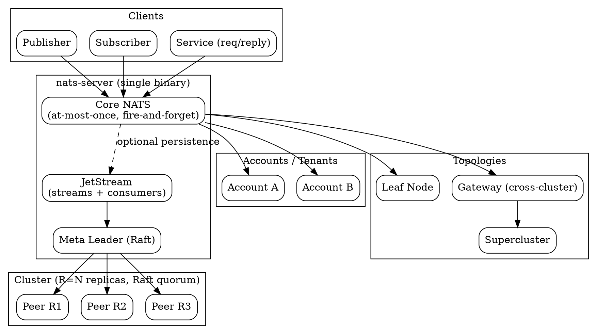

## Introduction

NATS 是云原生与边缘原生（cloud and edge native）的开源消息系统，由 [nats-io](https://github.com/nats-io) 维护。应用连接到 NATS Server，通过 **subject（主题）** 交换消息，彼此不需要知道对方网络地址。它追求的目标是一个**单一小二进制**、高吞吐低延迟、安全默认；从笔记本上的单节点到跨区域的集群都能运行。

当前稳定版本：**nats-server v2.15.0，发布于 2026-09-17**（来源：nats.io 下载页与 GitHub Releases，确认于 2026-10-06）。JetStream 持久化引擎随 **NATS 2.2** 引入（nats.io 下载页原文："NATS 2.2 release welcomed our newest persistence engine, JetStream"）。

它解决的核心问题：应用组件间的解耦通信（发布/订阅、请求-应答、队列、scatter-gather），以及在此之上可选的"时间解耦"——消息可落盘、可重放、可在订阅者离线时等待。

定位差异（与 Kafka / RocketMQ / Pulsar 相比）：NATS 核心（Core NATS）是**无存储、无分区、无 ACK 的 subject 级 pub/sub**，而非基于日志分区（partition）的提交日志系统；它不按 partition 做伸缩，而是按 subject 树路由。持久化由 JetStream 作为可叠加的存储层提供，二者共用同一进程。相较于 Kafka 以"分区日志 + 消费者位移"为核心，NATS 以"subject + stream/consumer"为核心，运维更轻、API 更小，但放弃了分区顺序保证与 Kafka 式重放语义的等价物。

## Architecture

### Single Binary Server
`nats-server` 是一个单一可执行文件。集群、JetStream、leaf nodes、MQTT、WebSocket 都是**同一进程上的配置项**，无需额外部署独立组件。官方客户端（Tier 1）覆盖 Go、JavaScript/TypeScript、Python、Java、Rust、C#/.NET、C。

### Subject Hierarchy
消息按 **subject** 路由，subject 是点分隔的层次名（如 `orders.created`、`events.data`）。订阅方支持两种通配符：`*`（单层）与 `>`（多层后缀）。Core NATS 没有 broker 队列、没有存储、没有 ACK。

### Accounts / Multi-tenancy
Account 在单个 server 或集群内隔离消息域，支持安全多租户、团队/部门隔离、SaaS 平台构建。不同 account 之间通过 import/export 的 stream 与 service 映射建立受控的跨域访问。

### Leaf Nodes
Leaf node 让边缘或分支集群"挂"到中心（hub）集群，实现边缘到云的连通，适合带宽受限、网络间歇的环境；hub 与 leaf 间可桥接 system account 与 JetStream domain。

### Supercluster & Gateway
- **Supercluster（超级集群）**：多个 NATS 集群（如 `east`/`west`）组成全局网格，跨集群流量按 geo-affinity 路由。
- **Gateway**：集群间互联机制，用于跨集群消息转发与地理亲和（geo-affinity）。

## Core NATS

### Subject-based Pub/Sub
发布者向 subject 发消息，所有当前对该 subject 感兴趣的订阅者各收到一份拷贝。消息到达谁听，就给谁。

### At-Most-Once / Fire-and-Forget
Core NATS 的本质属性是 **at-most-once（最多一次）**：消息只发给"发布那一刻在线"的订阅者，最多一次；订阅者离线、重启或未订阅则**永远收不到**，server 不存储。这是刻意设计——保持小而快，适合"被下一条覆盖"的场景（实时报价、温度、缓存失效）。无 ACK、无重发，默认单条 payload 上限 **1 MB**。

## JetStream

### Persistent Streams
Stream 是绑定到一个或多个 subject 模式的**服务端存储**，publisher 向匹配 subject 发消息时 server 追加进 stream 并分配序列号。可配置 storage（memory/file）、retention、replication 等。

### Consumers
Consumer 是 stream 的**有状态服务端视图（游标）**：server 跟踪客户端进度，应用无需自己记位移。未 ACK 的消息会被重投（redeliver），由此得到 at-least-once。多个 consumer 可独立读取同一 stream 并各自维护位置；可配置从开头/最新/指定序列号/指定时间开始。

### Raft Replication
JetStream 在集群内用 **Raft** 保证一致性与 HA。每个 stream/consumer 是一组 Raft group，写入需 **quorum（多数派）** 提交后才对客户端可见。复制因子记为 `R`（如 `R=3`），元数据层有 meta leader 与 stream leader；`R=3` 可容忍单节点宕机仍正常服务（`R=1` 为无复制单副本）。

### KV & Object Buckets
在 stream/consumer 之上提供高层抽象：**Key Value Store**（带复制与持久化的键值存储）与 **Object Store**（将大于单条消息的对象分块存储，带每对象元数据）。

## Delivery Semantics

### Core NATS: At-Most-Once
见上。订阅者不在即丢。

### JetStream: At-Least-Once
经 consumer 重投实现至少一次；配合应用侧幂等即可近似 exactly-once。

### Idempotency / Effectively-Once
JetStream 支持通过 **`Nats-Msg-Id` 去重头**实现幂等：配置去重窗口（默认约 2 分钟）后，相同 msg-id 的重复发布被去重；stream 级也可基于 `Nats-Msg-Id` / `Nats-Last-Msg-Id` 去重。实务上将 at-least-once + 幂等消费 = effectively-once。该去重头机制属 NATS 官方文档既定能力（集中抓取未逐条回放该页面，建议引文核对）。

## Consumption Model

### Push vs Pull Consumers
- **Push consumer**：server 主动把消息推到指定 deliver subject，适合在线实时消费。
- **Pull consumer**：客户端主动拉取（fetch），适合批处理与可控速率。

### Filtered Consumers
consumer 可设 `filter_subject`，只消费 stream 中匹配某 subject 的子集。

### Ordered Consumers
ordered consumer 提供按序重放、带每消费者序列号，且**不做重投、无需 ACK**，适合要求严格顺序且可容忍"重放即顺序"的场景（配合去重达 effectively-once）。

## Clustering & HA

### Meta Cluster (Raft)
集群内 servers 通过 routes 形成 mesh，选举 leader，对每个写达成 Raft 一致；quorum 提交、placement 决定副本落点、peer management 安全扩缩。

### Supercluster & Gateway
跨集群复制（gateways、geo-affinity、super-cluster 流量）与单集群内复制分开处理。

### Leaf Nodes for Edge HA
边缘 leaf 在中心不可达时本地缓冲/桥接，恢复后同步。

## Key Features

- 单一二进制、极小内存占用（官方称约 15MB）、亚毫秒延迟、单 server 可处理百万级 msg/s。
- 位置透明：服务发现、负载均衡、容错由 server 处理。
- 内建多租户（accounts）、安全默认、nkey/JWT 身份体系。
- 协议外还提供 MQTT、WebSocket 适配。
- 持久层 JetStream 同时给出 stream/consumer、KV、Object Store 三种原语。

## Pitfalls

- **Core NATS 默认丢消息**：无订阅者在线即丢失，不可当作可靠队列；需要持久化必须上 JetStream。这是最常见的误用。
- **Subject-based 而非 partition-based**：不要用 Kafka 的"分区顺序/分区再均衡"心智模型套 NATS；stream 内的顺序由序列号保证，跨 subject 无全局顺序。
- **ACK 与重投**：JetStream 的 at-least-once 意味着重复投递，消费端必须幂等（或用 `Nats-Msg-Id` 去重 + ordered consumer）。
- **版本基线**：务必以当前 v2.15.0 为准核对配置项；早期版本部分 JetStream 特性与默认值不同（如 `js_raft_delete_range` 在新版默认开启）。
- **单条 payload 上限 1 MB**：超大对象请走 Object Store 分块，而非单条大消息。
- **R=1 无 HA**：生产环境务必 `R>=3` 并跨节点放置，否则单点故障即丢数据/不可用。

## Links

- [MQ 总纲](/docs/CS/MQ/MQ.md)
- [发布/订阅与消息代理](/docs/CS/MQ/MQ.md?id=message-system)
- [Pulsar（同样提供 subject 路由与持久化流）](/docs/CS/MQ/Pulsar/Pulsar.md)
- [Kafka（生态与吞吐路线的对照）](/docs/CS/MQ/Kafka/Kafka.md)
- [CS 主题总纲](/docs/CS/CS.md)

## References
1. NATS 官方文档 - What is NATS: https://docs.nats.io/nats-concepts/intro
2. NATS 官方文档 - JetStream: https://docs.nats.io/nats-concepts/jetstream
3. NATS 官方文档 - Core NATS Deep Dive: https://docs.nats.io/learn/core-nats
4. NATS 官方文档 - Clustering & Replication Deep Dive: https://docs.nats.io/learn/clustering
5. nats.io 下载页（含当前稳定版本）: https://nats.io/download
6. nats-io/nats-server Releases: https://github.com/nats-io/nats-server/releases
