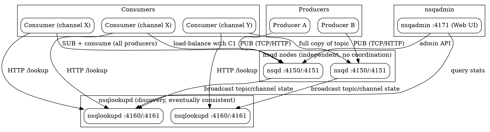

## Introduction

NSQ 是由 bitly 开源、用 Go 编写的实时分布式消息平台，设计目标是"在规模下运行、每天处理数十亿条消息"。它主打**去中心化、无单点故障（SPOF）**的拓扑，结合 at-least-once 投递保证，适合对实时性要求高、能容忍少量重复、但绝不能容忍整集群不可用（broker 挂掉就全停）的场景。

**实时性定位**：NSQ 是 push 模型（服务端主动推送，靠 `RDY` 状态做客户端流控），消息在生产后几乎立即投递，延迟极低，典型用于日志聚合、事件分发、任务队列、实时通知等"准实时"管道，而非对延迟不敏感的大批量离线 ETL。

**与同类 MQ 的差异**：
- **Kafka**：分区日志、持久化到磁盘、严格分区有序、支持消费组重放；NSQ 无分区概念、内存优先、不保证顺序、不重放历史。
- **RocketMQ**：强顺序消息、事务消息、丰富企业特性；NSQ 设计极简，无事务、无顺序保证。
- **Pulsar**：分层架构（broker + bookkeeper 存储）、多租户、持久化强；NSQ 单进程自包含、无独立存储层。

## Components

**nsqd**：核心守护进程，负责接收、排队、投递消息。每个 nsqd 独立运行、彼此不通信、不协调。默认监听 TCP `:4150`（客户端协议）与 HTTP `:4151`（管理/发布 API），可选 HTTPS `:4152`。可独立运行，但通常接入 nsqlookupd 集群做发现。提供 `/pub`、`/mpub`、`/stats`、`/ping` 等 HTTP 接口；`--mem-queue-size`（默认 10000）控制每 topic/channel 内存缓冲条数。

**nsqlookupd**：拓扑/目录服务，管理"哪个 nsqd 在提供哪个 topic"。nsqd 通过长连接 TCP 周期性推送自身状态；消费者通过 HTTP `/lookup` 轮询发现生产者地址。默认 TCP `:4160`、HTTP `:4161`。多个 nsqlookupd 互不通信、数据最终一致，消费者轮询所有实例并取并集——个别节点故障不会让系统停滞。它解耦了生产者和消费者：双方只需知道 nsqlookupd 地址，彼此从不直连。

**nsqadmin**：Web UI（默认 `:4171`），聚合展示集群的 topic/channel/consumer 层级、深度（Depth）、in-flight、deferred 等关键统计，并支持管理操作（pause/resume topic、empty channel、tombstone producer 等）。

## Topics vs Channels

- **Topic** 是消息流；**Channel** 是 topic 下的"消费队列"。Topic 可有 1 个或多个 channel，每个 channel 收到该 topic 的**全量副本**（multicast：topic → channel 是广播）。
- **同一 channel 上的多个消费者之间是负载均衡**：消息随机分发给其中一个就绪客户端（开启拓扑感知消费时按地理就近优先）。即 channel → consumer 是均分。
- 不同 channel 各自拿到一份**完整拷贝**。实践中一个 channel 通常映射一个下游服务。
- Topic/channel 均**按需创建**（首次发布或订阅即建），无需预配置；各自独立缓冲，慢消费者不会拖垮其他 channel。

总结：**topic → channel 多播全量；channel → consumer 负载均衡均分。**

## Message Flow

1. Producer 通过 TCP 协议或 HTTP `/pub` 向某 nsqd 发布消息。
2. nsqd 将消息写入对应 topic 的内存队列（超出 `--mem-queue-size` 则溢出落盘）。
3. topic 把消息复制给其下每个 channel。
4. 消费者通过 nsqlookupd 发现提供该 topic 的所有 nsqd，并**连上全部**这些 nsqd、订阅某个 channel。
5. 消费者以 `RDY` 状态声明可接收条数，nsqd 主动 push 消息（push 模型，客户端流控）。
6. 消费者处理完回 `FIN`（成功）或 `REQ`（重入队）；超时未响应则 nsqd 自动重入队。

## Delivery Semantics

NSQ 保证**至少一次（at-least-once）**投递，但**可能重复**。机制：发送后 nsqd 在本地暂存消息；客户端回 `FIN` 或 `REQ`；超时才自动重入队（`--msg-timeout` 默认 1m）。因此唯一会丢消息的边缘情况是 **nsqd 进程非正常关闭**——此时内存中（或未刷盘）的消息会丢失。可通过部署冗余 nsqd 对（收相同消息副本）+ 幂等消费来彻底避免丢失。消费者应**做好去重或幂等**。

## Ordering Guarantee

NSQ **不保证严格顺序**。消息按"在途（in-flight）到达即投递"的方式分发，顺序不被保证。需要有序的场景不适合 NSQ（这正是它与 Kafka 分区有序的本质区别）。

## Persistence

- **默认内存优先**：nsqd 用 `--mem-queue-size`（默认 10000 条/topic/channel）决定内存缓冲量；队列深度超过阈值时，消息**透明地写入磁盘**（diskqueue）。
- 内存占用上限约为 `mem-queue-size × (topic+channel 数)`。
- 把该值调低（甚至 0）可获得更强投递保证；磁盘队列能**在进程异常重启后存活**（但可能投递两次）。
- 干净关闭（`TERM` 信号）会安全持久化内存中、in-flight、deferred 及内部缓冲的消息。
- **Ephemeral（临时）**：topic/channel 名以 `#ephemeral` 结尾时**不落盘**，超过 mem-queue-size 直接丢消息，且最后一个客户端断开后即消失——适合不需要保证的消费者。

## Clustering and HA

每个 nsqd **独立运行、兄弟间无通信协调**，无 SPOF。消费者连到提供该 topic 的**所有** nsqd，直接消费、无中间 broker。nsqlookupd 多实例部署即 HA，互不通信、最终一致，消费者取并集。整体拓扑去中心化、可水平扩展、无集中式 broker。

## Key Features

- 去中心化、无单点、高可用；支持 pub-sub 与负载均衡两种投递模式。
- 实时 push + `RDY` 流控，低延迟、高吞吐。
- 运维友好：纯命令行配置、静态二进制无运行时依赖，官方提供 Linux/Darwin/FreeBSD/Windows 包与 Docker 镜像。
- 数据格式无关（JSON / MsgPack / Protobuf / 任意字节）。
- 内置 nsqadmin Web UI；官方 Go/Python 客户端，社区多语言库。
- 拓扑感知消费（实验特性）：按 region/zone 就近推送，降低跨地域流量成本。

## Pitfalls

- **无顺序保证**：消息顺序不保证，需要有序请选 Kafka 等其他方案。
- **at-least-once 重复**：消息可能多次投递，消费者必须幂等/去重。
- **磁盘持久化是"可选"而非"默认持久"**：默认主要驻内存，仅溢出落盘；进程崩溃会丢内存中消息。不要误以为 NSQ 默认像 Kafka 一样持久。
- **消费者全挂 + 内存写满即丢消息**：若所有消费者下线且队列超过内存阈值、磁盘也写满/或 ephemeral 通道，消息会被丢弃。
- 最新稳定版 v1.3.0 发布于 2023-12，发布节奏较慢；对"活跃上游承诺/新版本频率"敏感者需评估。

## Links

- [MQ 总纲](/docs/CS/MQ/MQ.md)
- [推送与拉取（Push versus Pull）](/docs/CS/MQ/MQ.md?id=push-versus-pull)
- [消息投递语义](/docs/CS/MQ/MQ.md?id=message-delivery-semantics)
- [Kafka（去中心化 vs 中心化 broker 的架构对照）](/docs/CS/MQ/Kafka/Kafka.md)
- [CS 主题总纲](/docs/CS/CS.md)

## References
1. NSQ 官方设计文档：https://nsq.io/overview/design.html
2. NSQ nsqd 组件与端口：https://nsq.io/components/nsqd.html
3. NSQ nsqlookupd 发现服务：https://nsq.io/components/nsqlookupd.html
4. NSQ nsqadmin 管理界面：https://nsq.io/components/nsqadmin.html
5. nsqio/nsq Releases（v1.3.0）：https://github.com/nsqio/nsq/releases
6. nsqio/nsq ChangeLog：https://github.com/nsqio/nsq/blob/master/ChangeLog.md
