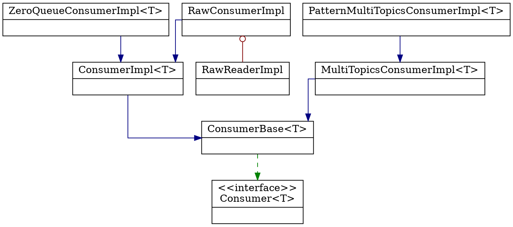

## Introduction


Create a consumer builder with no schema (Schema.BYTES) for subscribing to one or more topics.
```java
Consumer<byte[]> consumer = client.newConsumer()
        .topic("my-topic")         
        .subscriptionName("my-subscription-name")         
        .subscribe();  

while (true) {      
    Message<byte[]> message = consumer.receive();      
    System.out.println("Got message: " + message.getValue());      
    consumer.acknowledge(message);  
}
```





Dispatcher


### ConsumerBase

```java
public abstract class ConsumerBase<T> extends HandlerState implements Consumer<T> {
    final BlockingQueue<Message<T>> incomingMessages;

    protected final ExecutorProvider executorProvider;
    protected final ScheduledExecutorService externalPinnedExecutor;
    protected final ScheduledExecutorService internalPinnedExecutor;
}
```

internalPinnedExecutor 

pendingBatchReceiveTask
```java
public abstract class ConsumerBase<T> extends HandlerState implements Consumer<T> {
    private void pendingBatchReceiveTask(Timeout timeout) {
        internalPinnedExecutor.execute(() -> doPendingBatchReceiveTask(timeout));
    }

    private void doPendingBatchReceiveTask(Timeout timeout) {
        if (timeout.isCancelled()) {
            return;
        }

        long timeToWaitMs;

        synchronized (this) {
            // If it's closing/closed we need to ignore this timeout and not schedule next timeout.
            if (getState() == State.Closing || getState() == State.Closed) {
                return;
            }

            timeToWaitMs = batchReceivePolicy.getTimeoutMs();
            OpBatchReceive<T> opBatchReceive = pendingBatchReceives.peek();

            while (opBatchReceive != null) {
                // If there is at least one batch receive, calculate the diff between the batch receive timeout and the elapsed time since the operation was created.
                long diff = batchReceivePolicy.getTimeoutMs()
                        - TimeUnit.NANOSECONDS.toMillis(System.nanoTime() - opBatchReceive.createdAt);

                if (diff <= 0) {
                    completeOpBatchReceive(opBatchReceive);

                    // remove the peeked item from the queue
                    OpBatchReceive<T> removed = pendingBatchReceives.poll();

                    if (removed != opBatchReceive) {
                        // regression check, if this were to happen due to incorrect code changes in the future,
                        // (allowing multi-threaded calls to poll()), then ensure that the polled item is completed
                        // to avoid blocking user code

                        log.error("Race condition in consumer {} (should not cause data loss). "
                                + " Concurrent operations on pendingBatchReceives is not safe", this.consumerName);
                        if (removed != null && !removed.future.isDone()) {
                            completeOpBatchReceive(removed);
                        }
                    }
                } else {
                    // The diff is greater than zero, set the timeout to the diff value
                    timeToWaitMs = diff;
                    break;
                }

                opBatchReceive = pendingBatchReceives.peek();
            }
            batchReceiveTimeout = client.timer().newTimeout(this::pendingBatchReceiveTask,
                    timeToWaitMs, TimeUnit.MILLISECONDS);
        }
    }
}
```

triggerListener

The messages are added into the receiver queue by the internal pinned executor, so need to use internal pinned executor to avoid race condition which message might be added into the receiver queue but not able to read here.
```java
public abstract class ConsumerBase<T> extends HandlerState implements Consumer<T> {
    private void triggerListener() {
        internalPinnedExecutor.execute(() -> {
            try {
                Message<T> msg;
                do {
                    msg = internalReceive(0, TimeUnit.MILLISECONDS);
                    if (msg != null) {
                        // Trigger the notification on the message listener in a separate thread to avoid blocking the
                        // internal pinned executor thread while the message processing happens
                        final Message<T> finalMsg = msg;
                        if (SubscriptionType.Key_Shared == conf.getSubscriptionType()) {
                            executorProvider.getExecutor(peekMessageKey(msg)).execute(() ->
                                    callMessageListener(finalMsg));
                        } else {
                            getExternalExecutor(msg).execute(() -> {
                                callMessageListener(finalMsg);
                            });
                        }
                    }
                } while (msg != null);
            } catch (PulsarClientException e) {
                log.warn("[{}] [{}] Failed to dequeue the message for listener", topic, subscription, e);
            }
        });
    }
}
```


ConsumerImpl

```java

public class ConsumerImpl<T> extends ConsumerBase<T> implements ConnectionHandler.Connection {
    private final UnAckedMessageTracker unAckedMessageTracker;
    private final AcknowledgmentsGroupingTracker acknowledgmentsGroupingTracker;
    private final NegativeAcksTracker negativeAcksTracker;

}
```

BlockingQueue.take

```java
 @Override
    public Message<T> receive() throws PulsarClientException {
        if (listener != null) {
            throw new PulsarClientException.InvalidConfigurationException(
                    "Cannot use receive() when a listener has been set");
        }
        verifyConsumerState();
        return internalReceive();
    }

@Override
protected Message<T> internalReceive() throws PulsarClientException {
        Message<T> message;
        try {
        message = incomingMessages.take();
        messageProcessed(message);
        return beforeConsume(message);
        } catch (InterruptedException e) {
        stats.incrementNumReceiveFailed();
        throw PulsarClientException.unwrap(e);
        }
        }

@Override
protected synchronized void messageProcessed(Message<?> msg) {
        ClientCnx currentCnx = cnx();
        ClientCnx msgCnx = ((MessageImpl<?>) msg).getCnx();
        lastDequeuedMessageId = msg.getMessageId();

        if (msgCnx != currentCnx) {
        // The processed message did belong to the old queue that was cleared after reconnection.
        } else {
        if (listener == null && !parentConsumerHasListener) {
        increaseAvailablePermits(currentCnx);
        }
        stats.updateNumMsgsReceived(msg);

        trackMessage(msg);
        }
        decreaseIncomingMessageSize(msg);
        }
```


```java
protected Message<T> beforeConsume(Message<T> message) {
        if (interceptors != null) {
            return interceptors.beforeConsume(this, message);
        } else {
            return message;
        }
    }
```
This is called just before the message is returned by Consumer.receive(), MessageListener.received(Consumer, Message) or the java.util.concurrent.CompletableFuture returned by Consumer.receiveAsync() completes.

This method calls ConsumerInterceptor.beforeConsume(Consumer, Message) for each interceptor. Messages returned from each interceptor get passed to beforeConsume() of the next interceptor in the chain of interceptors.

This method does not throw exceptions. 
If any of the interceptors in the chain throws an exception, it gets caught and logged, and next interceptor in int the chain is called with 'messages' returned by the previous successful interceptor beforeConsume call.

```java
public class ConsumerInterceptors<T> implements Closeable {
    public Message<T> beforeConsume(Consumer<T> consumer, Message<T> message) {
        Message<T> interceptorMessage = message;
        for (int i = 0, interceptorsSize = interceptors.size(); i < interceptorsSize; i++) {
            try {
                interceptorMessage = interceptors.get(i).beforeConsume(consumer, interceptorMessage);
            } catch (Throwable e) {
                if (consumer != null) {
                    log.warn("Error executing interceptor beforeConsume callback topic: {} consumerName: {}", consumer.getTopic(), consumer.getConsumerName(), e);
                } else {
                    log.warn("Error executing interceptor beforeConsume callback", e);
                }
            }
        }
        return interceptorMessage;
    }
}
```


```java
@Override
    protected CompletableFuture<Message<T>> internalReceiveAsync() {
        CompletableFutureCancellationHandler cancellationHandler = new CompletableFutureCancellationHandler();
        CompletableFuture<Message<T>> result = cancellationHandler.createFuture();
        internalPinnedExecutor.execute(() -> {
            Message<T> message = incomingMessages.poll();
            if (message == null) {
                pendingReceives.add(result);
                cancellationHandler.setCancelAction(() -> pendingReceives.remove(result));
            } else {
                messageProcessed(message);
                result.complete(beforeConsume(message));
            }
        });

        return result;
    }
```

## message Retention


```
defaultRetentionSizeInMB
defaultRetentionTimeInMinutes
```


backlog


## Links

- [Pulsar](/docs/CS/MQ/Pulsar/Pulsar.md)
